# FastAPI应用架构

<cite>
**本文引用的文件**
- [backend/app/main.py](file://backend/app/main.py)
- [backend/app/core/config.py](file://backend/app/core/config.py)
- [backend/app/core/database.py](file://backend/app/core/database.py)
- [backend/app/core/redis.py](file://backend/app/core/redis.py)
- [backend/app/core/security.py](file://backend/app/core/security.py)
- [backend/app/api/v1/quote.py](file://backend/app/api/v1/quote.py)
- [backend/app/api/v1/stock.py](file://backend/app/api/v1/stock.py)
- [backend/app/api/v1/watchlist.py](file://backend/app/api/v1/watchlist.py)
- [backend/app/api/v1/ai.py](file://backend/app/api/v1/ai.py)
- [backend/app/api/websocket.py](file://backend/app/api/websocket.py)
- [backend/app/models/models.py](file://backend/app/models/models.py)
- [backend/app/schemas/schemas.py](file://backend/app/schemas/schemas.py)
- [backend/app/services/collector/manager.py](file://backend/app/services/collector/manager.py)
- [backend/app/services/collector/base.py](file://backend/app/services/collector/base.py)
- [backend/app/services/collector/eastmoney.py](file://backend/app/services/collector/eastmoney.py)
</cite>

## 目录
1. [简介](#简介)
2. [项目结构](#项目结构)
3. [核心组件](#核心组件)
4. [架构总览](#架构总览)
5. [详细组件分析](#详细组件分析)
6. [依赖分析](#依赖分析)
7. [性能考虑](#性能考虑)
8. [故障排查指南](#故障排查指南)
9. [结论](#结论)
10. [附录](#附录)

## 简介
本文件系统性梳理后端FastAPI应用的架构设计与实现要点，覆盖应用生命周期管理、CORS跨域配置、路由注册机制；配置管理系统（Config）、数据库连接初始化（Database）、Redis缓存管理（Redis）的实现原理与使用方法；依赖注入机制、中间件配置、异常处理策略；应用启动流程、资源管理与优雅关闭；并提供配置项说明与最佳实践建议。

## 项目结构
后端采用按功能模块划分的目录组织方式，核心入口位于应用根目录，核心能力集中在core、api、models、schemas、services等子包中，前端独立于后端目录。

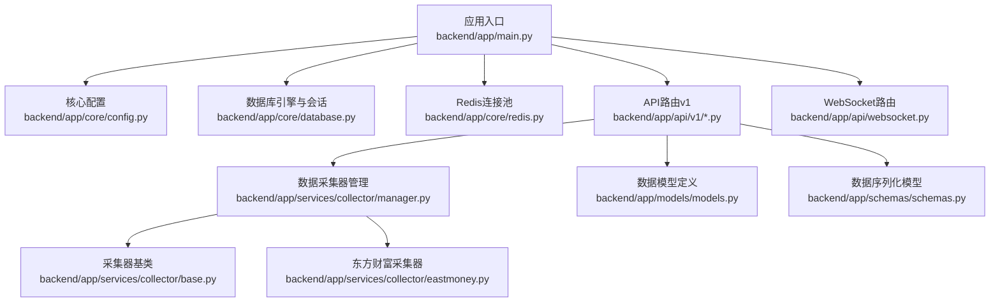

图表来源
- [backend/app/main.py:1-48](file://backend/app/main.py#L1-L48)
- [backend/app/core/config.py:1-43](file://backend/app/core/config.py#L1-L43)
- [backend/app/core/database.py:1-25](file://backend/app/core/database.py#L1-L25)
- [backend/app/core/redis.py:1-25](file://backend/app/core/redis.py#L1-L25)
- [backend/app/api/v1/quote.py:1-65](file://backend/app/api/v1/quote.py#L1-L65)
- [backend/app/api/v1/stock.py:1-37](file://backend/app/api/v1/stock.py#L1-L37)
- [backend/app/api/v1/watchlist.py:1-77](file://backend/app/api/v1/watchlist.py#L1-L77)
- [backend/app/api/v1/ai.py:1-29](file://backend/app/api/v1/ai.py#L1-L29)
- [backend/app/api/websocket.py:1-79](file://backend/app/api/websocket.py#L1-L79)
- [backend/app/services/collector/manager.py:1-94](file://backend/app/services/collector/manager.py#L1-L94)
- [backend/app/services/collector/base.py:1-45](file://backend/app/services/collector/base.py#L1-L45)
- [backend/app/services/collector/eastmoney.py:1-297](file://backend/app/services/collector/eastmoney.py#L1-L297)
- [backend/app/models/models.py:1-74](file://backend/app/models/models.py#L1-L74)
- [backend/app/schemas/schemas.py:1-103](file://backend/app/schemas/schemas.py#L1-L103)

章节来源
- [backend/app/main.py:1-48](file://backend/app/main.py#L1-L48)

## 核心组件
- 应用生命周期与中间件
  - 使用异步生命周期上下文管理数据库初始化与Redis连接关闭。
  - 配置CORS中间件允许任意来源、凭证、方法与头。
- 配置系统（Config）
  - 基于Pydantic设置类，从.env文件加载键值，提供全局缓存实例。
- 数据库（Database）
  - 异步SQLAlchemy引擎与会话工厂，提供依赖注入的会话获取器，并在启动时创建表。
- Redis（Redis）
  - 单例连接池封装，提供获取与关闭接口。
- 安全工具（Security）
  - 密码哈希、校验与JWT签发/解码工具，基于配置参数工作。

章节来源
- [backend/app/main.py:13-27](file://backend/app/main.py#L13-L27)
- [backend/app/main.py:29-36](file://backend/app/main.py#L29-L36)
- [backend/app/core/config.py:5-43](file://backend/app/core/config.py#L5-L43)
- [backend/app/core/database.py:7-25](file://backend/app/core/database.py#L7-L25)
- [backend/app/core/redis.py:10-25](file://backend/app/core/redis.py#L10-L25)
- [backend/app/core/security.py:10-30](file://backend/app/core/security.py#L10-L30)

## 架构总览
下图展示应用启动、中间件装配、路由注册与核心服务交互的总体流程。

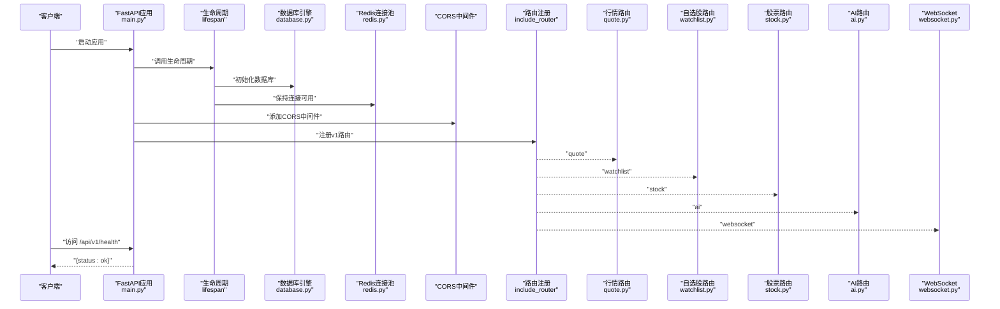

图表来源
- [backend/app/main.py:13-48](file://backend/app/main.py#L13-L48)
- [backend/app/core/database.py:23-25](file://backend/app/core/database.py#L23-L25)
- [backend/app/core/redis.py:21-25](file://backend/app/core/redis.py#L21-L25)
- [backend/app/api/v1/quote.py:1-65](file://backend/app/api/v1/quote.py#L1-L65)
- [backend/app/api/v1/watchlist.py:1-77](file://backend/app/api/v1/watchlist.py#L1-L77)
- [backend/app/api/v1/stock.py:1-37](file://backend/app/api/v1/stock.py#L1-L37)
- [backend/app/api/v1/ai.py:1-29](file://backend/app/api/v1/ai.py#L1-L29)
- [backend/app/api/websocket.py:1-79](file://backend/app/api/websocket.py#L1-L79)

## 详细组件分析

### 应用入口与生命周期管理
- 生命周期
  - 启动阶段：初始化数据库（创建所有表）。
  - 关闭阶段：关闭Redis连接池，释放资源。
- 中间件
  - CORS中间件允许任意来源、凭证、方法与头，便于前后端联调与跨域通信。
- 路由注册
  - 统一前缀/api/v1，注册quote、stock、watchlist、ai与websocket路由。
- 健康检查
  - 提供/version与状态查询接口，便于监控与部署验证。

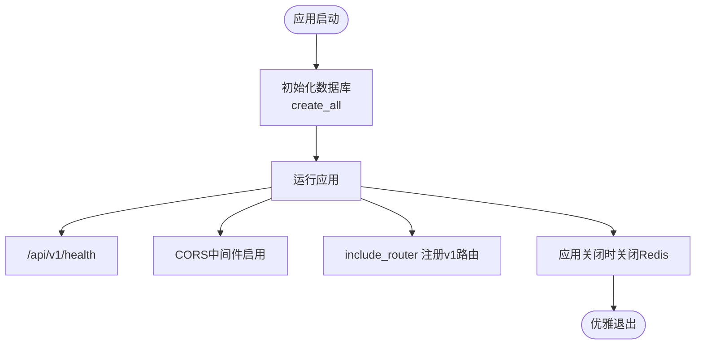

图表来源
- [backend/app/main.py:13-48](file://backend/app/main.py#L13-L48)
- [backend/app/core/database.py:23-25](file://backend/app/core/database.py#L23-L25)
- [backend/app/core/redis.py:21-25](file://backend/app/core/redis.py#L21-L25)

章节来源
- [backend/app/main.py:13-48](file://backend/app/main.py#L13-L48)

### 配置管理系统（Config）
- 设计要点
  - 使用Pydantic设置类，自动从.env文件加载键值，支持类型校验与默认值。
  - 使用LRU缓存函数提供全局唯一配置实例，避免重复解析。
- 关键配置项（节选）
  - 应用环境与调试开关、密钥与版本信息。
  - 数据库URL、Redis URL。
  - 主/备用数据源名称。
  - AI适配器、服务地址、超时、缓存开关与TTL、限流。
  - Celery消息代理与结果后端。
  - 行情采集间隔与缓存TTL。
  - JWT密钥、算法与过期分钟数。
- 使用方法
  - 在其他模块通过get_settings()获取统一配置实例，读取对应字段。

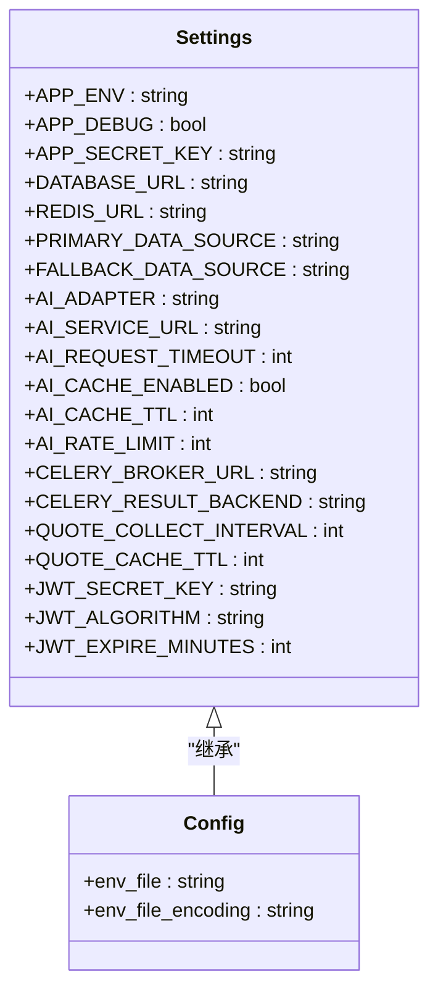

图表来源
- [backend/app/core/config.py:5-43](file://backend/app/core/config.py#L5-L43)

章节来源
- [backend/app/core/config.py:5-43](file://backend/app/core/config.py#L5-L43)

### 数据库连接初始化（Database）
- 引擎与会话
  - 创建异步引擎，开启调试日志输出，设置连接池大小与溢出上限。
  - 会话工厂以AsyncSession为基类，关闭时不会过早失效。
- 依赖注入
  - 提供get_db异步生成器，确保每次请求创建独立会话并在finally中关闭。
- 初始化与建模
  - init_db在启动时使用引擎连接执行元数据建表。
  - 所有ORM模型继承自Base，统一管理表结构。

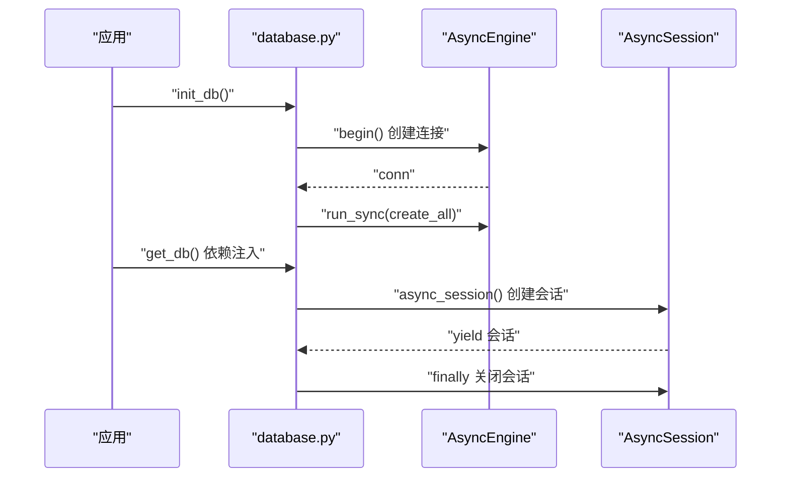

图表来源
- [backend/app/core/database.py:7-25](file://backend/app/core/database.py#L7-L25)

章节来源
- [backend/app/core/database.py:7-25](file://backend/app/core/database.py#L7-L25)
- [backend/app/models/models.py:1-74](file://backend/app/models/models.py#L1-L74)

### Redis缓存管理（Redis）
- 连接池
  - 通过aioredis从URL解析连接，设置编码与响应解码，全局单例避免重复创建。
- 依赖注入
  - 提供get_redis异步获取连接的方法。
- 资源关闭
  - 应用关闭时调用close_redis，释放连接池并清空引用。

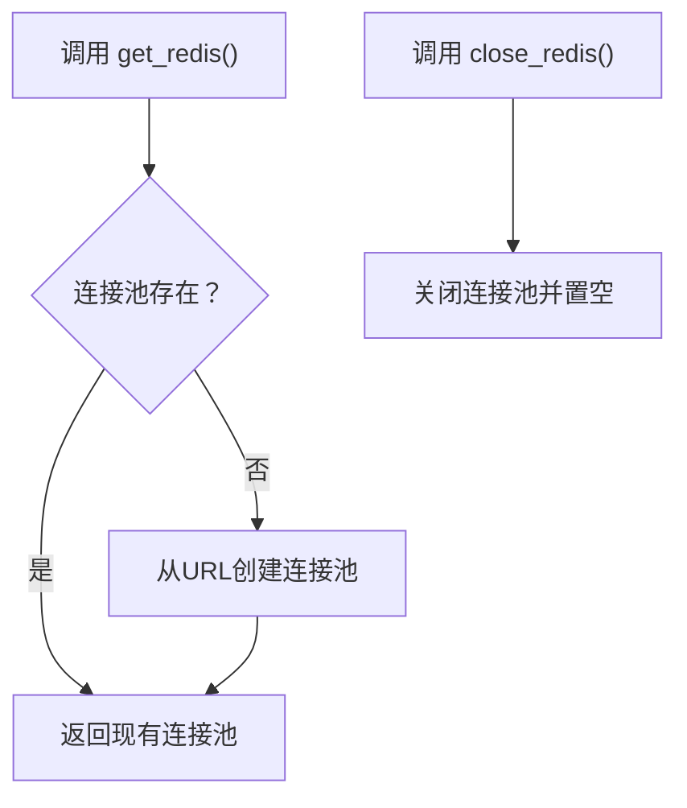

图表来源
- [backend/app/core/redis.py:10-25](file://backend/app/core/redis.py#L10-L25)

章节来源
- [backend/app/core/redis.py:10-25](file://backend/app/core/redis.py#L10-L25)

### 依赖注入机制
- 数据库会话
  - API路由通过Depends(get_db)注入AsyncSession，确保事务隔离与自动清理。
- 配置
  - 各模块通过get_settings()读取统一配置，避免硬编码。
- 采集器
  - 路由层通过CollectorManager统一调度多个数据源，内部依赖具体采集器实现。

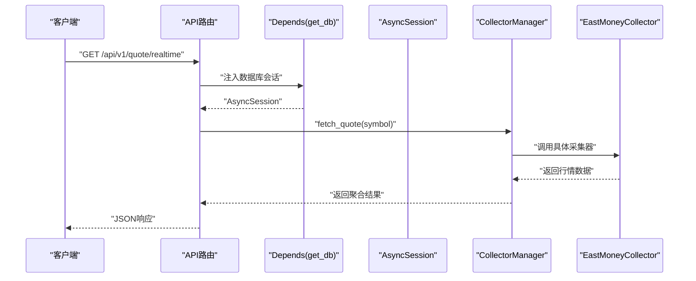

图表来源
- [backend/app/api/v1/quote.py:1-65](file://backend/app/api/v1/quote.py#L1-L65)
- [backend/app/core/database.py:15-20](file://backend/app/core/database.py#L15-L20)
- [backend/app/services/collector/manager.py:21-33](file://backend/app/services/collector/manager.py#L21-L33)
- [backend/app/services/collector/eastmoney.py:69-85](file://backend/app/services/collector/eastmoney.py#L69-L85)

章节来源
- [backend/app/api/v1/quote.py:1-65](file://backend/app/api/v1/quote.py#L1-L65)
- [backend/app/core/database.py:15-20](file://backend/app/core/database.py#L15-L20)
- [backend/app/services/collector/manager.py:12-94](file://backend/app/services/collector/manager.py#L12-L94)
- [backend/app/services/collector/eastmoney.py:26-297](file://backend/app/services/collector/eastmoney.py#L26-L297)

### 中间件与异常处理策略
- CORS中间件
  - 已在应用入口启用，允许任意来源、凭证、方法与头，便于开发与跨域通信。
- 异常处理
  - 当前未显式注册全局异常处理器。建议在应用入口处注册统一异常处理器，捕获业务异常与HTTP异常，返回标准化响应体（参考响应模型）。

章节来源
- [backend/app/main.py:29-36](file://backend/app/main.py#L29-L36)
- [backend/app/schemas/schemas.py:6-103](file://backend/app/schemas/schemas.py#L6-L103)

### 应用启动流程、资源管理与优雅关闭
- 启动流程
  - 加载配置 → 初始化数据库（建表） → 启动应用 → 注册CORS与路由 → 健康检查可用。
- 资源管理
  - 数据库引擎与会话工厂在模块级创建，避免重复初始化；会话在请求作用域内创建与销毁。
  - Redis连接池为全局单例，减少连接开销。
- 优雅关闭
  - 生命周期结束时关闭Redis连接池，确保资源回收。

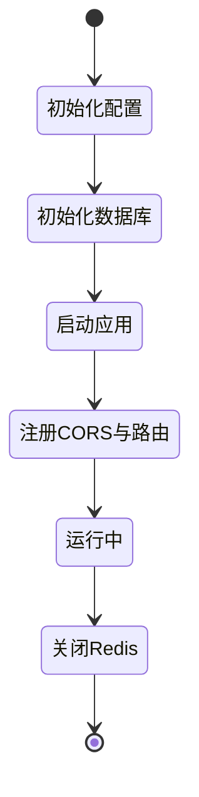

图表来源
- [backend/app/main.py:13-48](file://backend/app/main.py#L13-L48)
- [backend/app/core/database.py:23-25](file://backend/app/core/database.py#L23-L25)
- [backend/app/core/redis.py:21-25](file://backend/app/core/redis.py#L21-L25)

章节来源
- [backend/app/main.py:13-48](file://backend/app/main.py#L13-L48)
- [backend/app/core/database.py:23-25](file://backend/app/core/database.py#L23-L25)
- [backend/app/core/redis.py:21-25](file://backend/app/core/redis.py#L21-L25)

### API路由与业务逻辑
- 行情数据（quote）
  - 实时行情、列表、K线、分时、盘口接口，统一返回响应模型，错误时返回特定错误码。
- 股票搜索（stock）
  - 基于东方财富建议接口的搜索，限制返回A股并进行简单过滤。
- 自选股（watchlist）
  - 列表、新增、删除、排序接口，使用数据库会话完成持久化。
- AI分析（ai）
  - 通过适配器调用AI分析服务，支持获取模型信息。
- WebSocket（websocket）
  - 连接管理器维护活跃连接与订阅关系，支持订阅/退订与心跳。

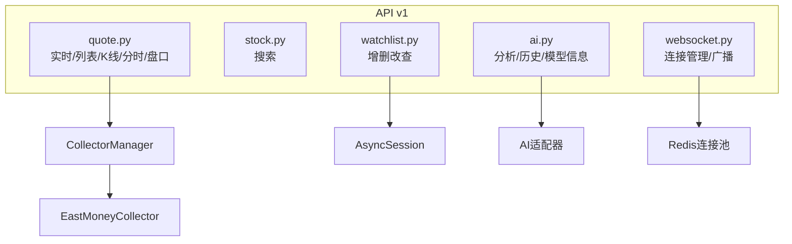

图表来源
- [backend/app/api/v1/quote.py:1-65](file://backend/app/api/v1/quote.py#L1-L65)
- [backend/app/api/v1/stock.py:1-37](file://backend/app/api/v1/stock.py#L1-L37)
- [backend/app/api/v1/watchlist.py:1-77](file://backend/app/api/v1/watchlist.py#L1-L77)
- [backend/app/api/v1/ai.py:1-29](file://backend/app/api/v1/ai.py#L1-L29)
- [backend/app/api/websocket.py:1-79](file://backend/app/api/websocket.py#L1-L79)
- [backend/app/services/collector/manager.py:12-94](file://backend/app/services/collector/manager.py#L12-L94)
- [backend/app/services/collector/eastmoney.py:26-297](file://backend/app/services/collector/eastmoney.py#L26-L297)

章节来源
- [backend/app/api/v1/quote.py:1-65](file://backend/app/api/v1/quote.py#L1-L65)
- [backend/app/api/v1/stock.py:1-37](file://backend/app/api/v1/stock.py#L1-L37)
- [backend/app/api/v1/watchlist.py:1-77](file://backend/app/api/v1/watchlist.py#L1-L77)
- [backend/app/api/v1/ai.py:1-29](file://backend/app/api/v1/ai.py#L1-L29)
- [backend/app/api/websocket.py:1-79](file://backend/app/api/websocket.py#L1-L79)

### 数据模型与序列化模型
- 数据模型（ORM）
  - 包含股票基础信息、日线行情、分时数据、自选股与AI分析日志等表结构。
- 序列化模型（Pydantic）
  - 定义通用响应体、行情、K线、分时、盘口、自选股排序、AI分析请求与响应等结构。

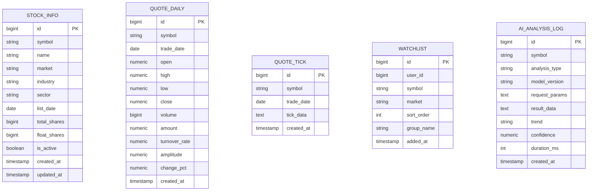

图表来源
- [backend/app/models/models.py:5-74](file://backend/app/models/models.py#L5-L74)
- [backend/app/schemas/schemas.py:6-103](file://backend/app/schemas/schemas.py#L6-L103)

章节来源
- [backend/app/models/models.py:1-74](file://backend/app/models/models.py#L1-L74)
- [backend/app/schemas/schemas.py:1-103](file://backend/app/schemas/schemas.py#L1-L103)

### 安全与认证工具
- 密码处理
  - 使用bcrypt进行密码哈希与校验。
- JWT工具
  - 支持签发带过期时间的访问令牌与解码验证，基于配置中的密钥与算法。

章节来源
- [backend/app/core/security.py:10-30](file://backend/app/core/security.py#L10-L30)

## 依赖分析
- 模块耦合
  - main.py集中编排配置、数据库、Redis与路由，耦合度适中。
  - API路由依赖数据库会话与采集器管理器，形成清晰的职责边界。
- 外部依赖
  - FastAPI、SQLAlchemy异步、aioredis、httpx、Pydantic Settings等。
- 循环依赖
  - 当前结构未见循环导入迹象。

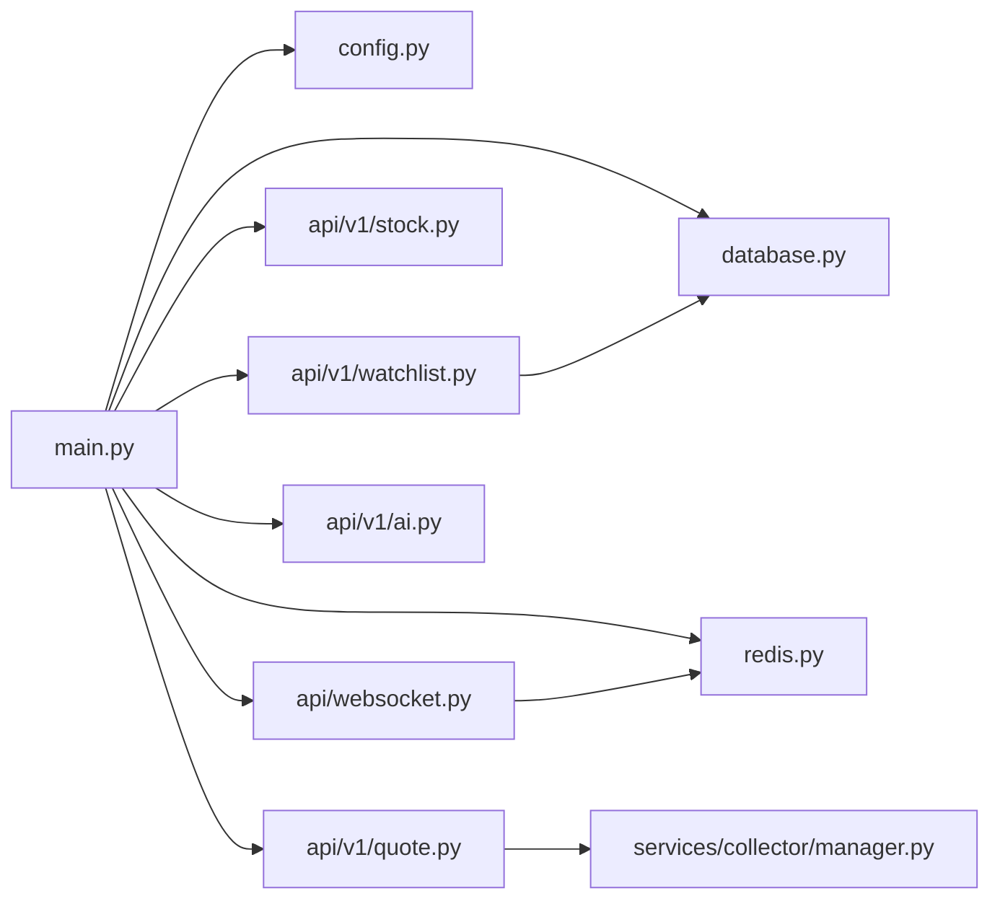

图表来源
- [backend/app/main.py:1-48](file://backend/app/main.py#L1-L48)
- [backend/app/core/config.py:1-43](file://backend/app/core/config.py#L1-L43)
- [backend/app/core/database.py:1-25](file://backend/app/core/database.py#L1-L25)
- [backend/app/core/redis.py:1-25](file://backend/app/core/redis.py#L1-L25)
- [backend/app/api/v1/quote.py:1-65](file://backend/app/api/v1/quote.py#L1-L65)
- [backend/app/api/v1/stock.py:1-37](file://backend/app/api/v1/stock.py#L1-L37)
- [backend/app/api/v1/watchlist.py:1-77](file://backend/app/api/v1/watchlist.py#L1-L77)
- [backend/app/api/v1/ai.py:1-29](file://backend/app/api/v1/ai.py#L1-L29)
- [backend/app/api/websocket.py:1-79](file://backend/app/api/websocket.py#L1-L79)
- [backend/app/services/collector/manager.py:1-94](file://backend/app/services/collector/manager.py#L1-L94)

章节来源
- [backend/app/main.py:1-48](file://backend/app/main.py#L1-L48)

## 性能考虑
- 连接池与并发
  - 数据库连接池大小与溢出上限已配置，建议结合实际QPS调优。
  - Redis连接池为单例，避免频繁创建连接。
- 异步I/O
  - 使用异步HTTP客户端与异步数据库驱动，提升I/O密集场景吞吐。
- 缓存策略
  - 行情采集与AI分析可结合Redis缓存（当前AI缓存开关存在但未在采集器中直接体现），合理设置TTL降低上游压力。
- 超时与重试
  - 采集器对上游接口设置超时与指数回退重试，提高稳定性。

## 故障排查指南
- 健康检查
  - 访问/api/v1/health确认应用正常运行与版本信息。
- 数据库问题
  - 确认DATABASE_URL正确且数据库可达；查看初始化日志；检查权限与网络。
- Redis问题
  - 确认REDIS_URL正确；在应用关闭时是否触发close_redis；检查连接池状态。
- CORS问题
  - 若出现跨域错误，检查CORS中间件配置与前端请求头。
- 采集器异常
  - 查看采集器日志与重试记录；确认上游接口状态与反爬策略；必要时切换备用数据源。

章节来源
- [backend/app/main.py:46-48](file://backend/app/main.py#L46-L48)
- [backend/app/core/database.py:23-25](file://backend/app/core/database.py#L23-L25)
- [backend/app/core/redis.py:21-25](file://backend/app/core/redis.py#L21-L25)
- [backend/app/services/collector/eastmoney.py:41-67](file://backend/app/services/collector/eastmoney.py#L41-L67)

## 结论
本应用采用清晰的模块化架构：入口负责生命周期与中间件，核心模块提供配置、数据库与Redis管理，API层通过依赖注入与采集器管理器实现稳定的业务能力。建议后续补充全局异常处理、完善AI缓存策略与连接池参数调优，以进一步提升稳定性与可维护性。

## 附录
- 配置项速览（来自配置模块）
  - 应用环境与调试、密钥与版本
  - 数据库与Redis URL
  - 主/备用数据源
  - AI适配器、服务地址、超时、缓存与限流
  - Celery代理与结果后端
  - 行情采集间隔与缓存TTL
  - JWT密钥、算法与过期时间
- 最佳实践
  - 使用Depends注入数据库会话，确保事务隔离与资源回收。
  - 对外部接口设置超时与重试，避免阻塞。
  - 统一响应模型，便于前端消费与监控。
  - 在生产环境收紧CORS配置，仅允许必要来源与方法。
  - 定期评估数据库与Redis连接池参数，结合监控指标优化。