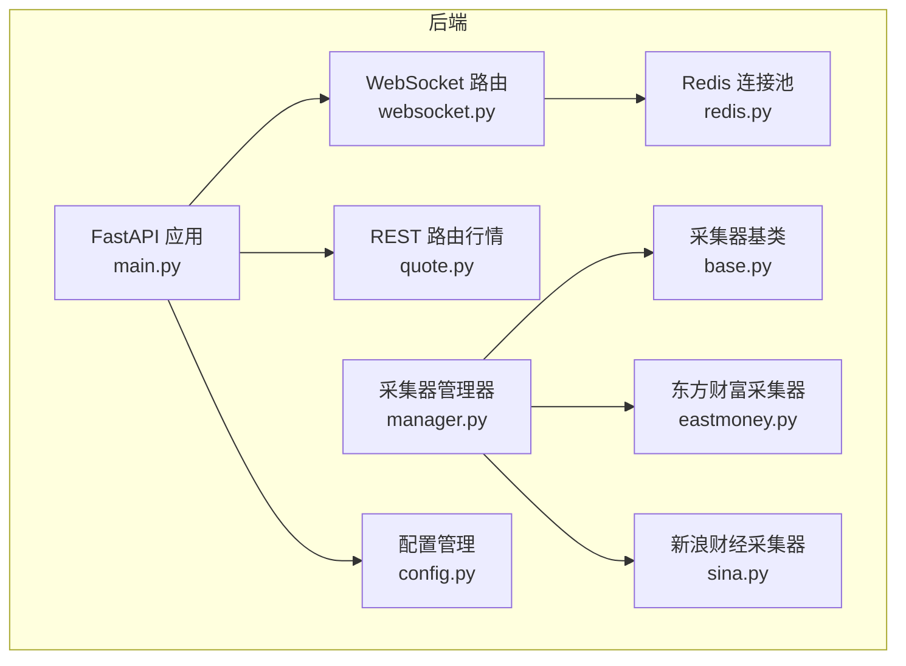
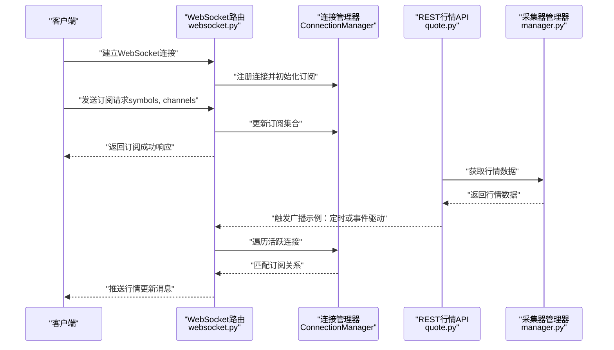
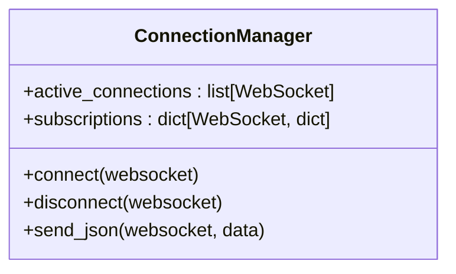
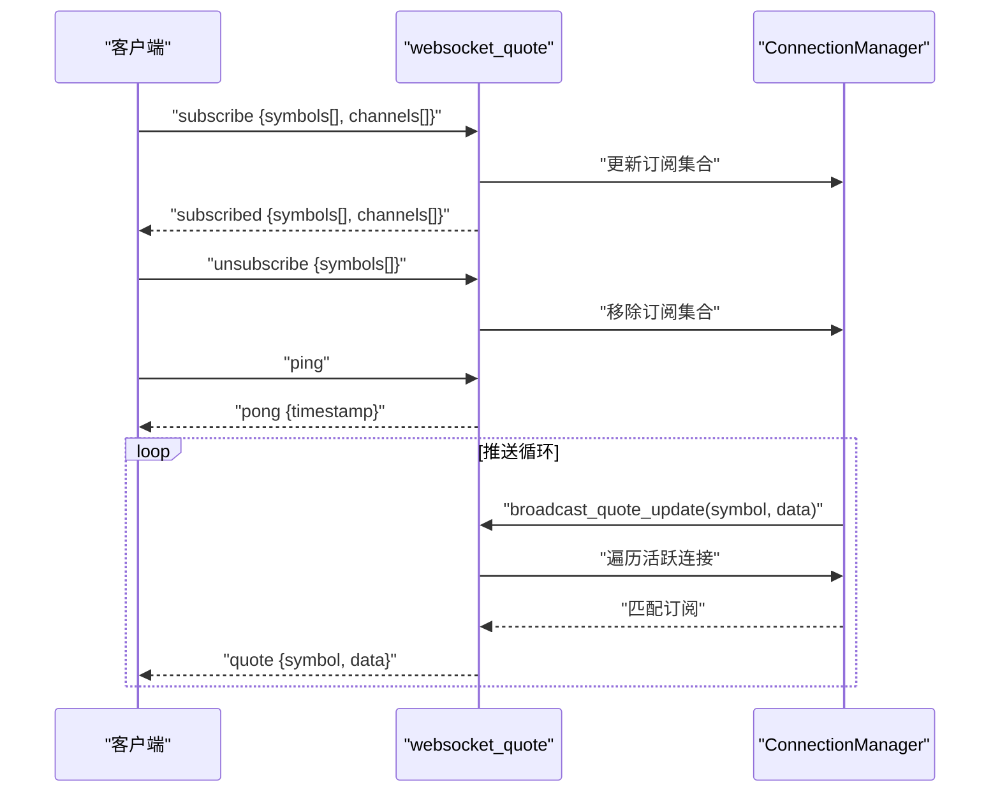
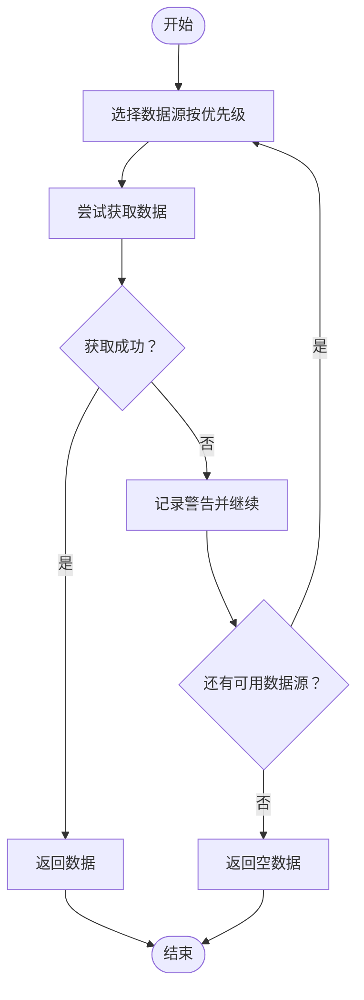
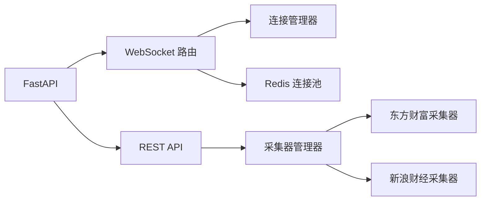

# WebSocket实时推送

<cite>
**本文引用的文件**
- [websocket.py](file://backend/app/api/websocket.py)
- [main.py](file://backend/app/main.py)
- [redis.py](file://backend/app/core/redis.py)
- [config.py](file://backend/app/core/config.py)
- [manager.py](file://backend/app/services/collector/manager.py)
- [base.py](file://backend/app/services/collector/base.py)
- [eastmoney.py](file://backend/app/services/collector/eastmoney.py)
- [sina.py](file://backend/app/services/collector/sina.py)
- [quote.py](file://backend/app/api/v1/quote.py)
- [quote.ts](file://frontend/src/stores/quote.ts)
- [requirements.txt](file://backend/requirements.txt)
- [README.md](file://README.md)
</cite>

## 目录
1. [简介](#简介)
2. [项目结构](#项目结构)
3. [核心组件](#核心组件)
4. [架构总览](#架构总览)
5. [详细组件分析](#详细组件分析)
6. [依赖分析](#依赖分析)
7. [性能考虑](#性能考虑)
8. [故障排查指南](#故障排查指南)
9. [结论](#结论)
10. [附录](#附录)

## 简介
本文件面向WebSocket实时推送系统，围绕连接建立、消息处理、连接管理、断线重连机制进行深入解析；同时说明实时数据推送的触发条件、消息格式定义、客户端订阅管理；解释Redis在实时推送中的作用（当前代码未直接使用Redis pub/sub）、消息队列处理与并发连接管理；并提供WebSocket连接示例、消息协议规范、错误处理策略、性能优化建议、监控方案与故障排查指南。

## 项目结构
后端采用FastAPI + 异步编程模型，WebSocket路由位于独立模块中，行情数据通过采集器管理器统一调度多个数据源（东方财富、新浪财经），REST API提供静态数据查询能力。

图表来源
- [main.py:1-48](file://backend/app/main.py#L1-L48)
- [websocket.py:1-79](file://backend/app/api/websocket.py#L1-L79)
- [redis.py:1-25](file://backend/app/core/redis.py#L1-L25)
- [config.py:1-43](file://backend/app/core/config.py#L1-L43)
- [manager.py:1-94](file://backend/app/services/collector/manager.py#L1-L94)
- [base.py:1-45](file://backend/app/services/collector/base.py#L1-L45)
- [eastmoney.py:1-297](file://backend/app/services/collector/eastmoney.py#L1-L297)
- [sina.py:1-312](file://backend/app/services/collector/sina.py#L1-L312)
- [quote.py:1-65](file://backend/app/api/v1/quote.py#L1-L65)

章节来源
- [main.py:1-48](file://backend/app/main.py#L1-L48)
- [README.md:92-126](file://README.md#L92-L126)

## 核心组件
- WebSocket连接管理器：负责连接生命周期管理、订阅信息维护、消息广播。
- WebSocket路由：处理订阅/取消订阅、心跳检测、接收客户端消息。
- 采集器管理器：多数据源自动故障转移，提供统一接口。
- Redis连接池：异步Redis连接池封装，供未来扩展pub/sub使用。
- REST行情API：提供静态行情查询能力，作为WebSocket的补充。

章节来源
- [websocket.py:12-79](file://backend/app/api/websocket.py#L12-L79)
- [manager.py:12-94](file://backend/app/services/collector/manager.py#L12-L94)
- [redis.py:10-25](file://backend/app/core/redis.py#L10-L25)
- [quote.py:7-65](file://backend/app/api/v1/quote.py#L7-L65)

## 架构总览
WebSocket实时推送采用“客户端订阅 + 服务端广播”的模式。客户端通过WebSocket订阅感兴趣的数据（如某股票行情），服务端在收到数据更新时，遍历活跃连接并按订阅关系筛选目标客户端进行推送。

图表来源
- [websocket.py:39-79](file://backend/app/api/websocket.py#L39-L79)
- [quote.py:7-16](file://backend/app/api/v1/quote.py#L7-L16)
- [manager.py:21-33](file://backend/app/services/collector/manager.py#L21-L33)

## 详细组件分析

### WebSocket连接管理器（ConnectionManager）
- 责任边界
  - 维护活跃连接列表与每个连接的订阅信息（股票代码集合、频道集合）。
  - 提供连接接入、断开、单播发送JSON的能力。
  - 广播函数用于向订阅特定股票的客户端推送行情更新。
- 设计要点
  - 使用字典记录每个连接的订阅，便于快速匹配推送目标。
  - 发送失败时主动断开连接，避免僵尸连接占用资源。
- 并发与性能
  - 广播时遍历活跃连接，复杂度O(N)，N为活跃连接数。
  - 建议在高并发场景下引入订阅索引（如按symbol分组）以降低广播成本。

图表来源
- [websocket.py:12-36](file://backend/app/api/websocket.py#L12-L36)

章节来源
- [websocket.py:12-36](file://backend/app/api/websocket.py#L12-L36)

### WebSocket路由与消息协议
- 路由入口
  - 定义WebSocket端点，处理连接接入、消息循环与断开清理。
- 订阅管理
  - 支持订阅/取消订阅动作，订阅参数包含股票代码数组与频道数组。
  - 订阅集合使用集合去重，支持增量更新。
- 心跳机制
  - 支持ping/pong消息，用于保活与健康检查。
- 广播逻辑
  - 广播函数根据symbol与channel匹配订阅关系，逐个发送消息。
  - 发送异常时收集断开连接，统一清理。

图表来源
- [websocket.py:39-79](file://backend/app/api/websocket.py#L39-L79)

章节来源
- [websocket.py:39-79](file://backend/app/api/websocket.py#L39-L79)

### 采集器管理器与数据源
- 多数据源自动故障转移
  - 优先尝试主数据源，失败则回退到备用数据源。
  - 对不同接口（实时、列表、K线、分时、盘口）分别提供统一调用入口。
- 错误处理
  - 捕获网络异常、解析异常，记录警告并继续尝试其他数据源。
- 性能与稳定性
  - 限制最大重试次数与延迟，避免雪崩效应。
  - 通过统一接口屏蔽底层差异，便于扩展新数据源。

图表来源
- [manager.py:21-33](file://backend/app/services/collector/manager.py#L21-L33)

章节来源
- [manager.py:12-94](file://backend/app/services/collector/manager.py#L12-L94)
- [base.py:5-45](file://backend/app/services/collector/base.py#L5-L45)
- [eastmoney.py:69-85](file://backend/app/services/collector/eastmoney.py#L69-L85)
- [sina.py:64-107](file://backend/app/services/collector/sina.py#L64-L107)

### Redis连接池与未来扩展
- 当前用途
  - 提供异步Redis连接池封装，便于未来集成pub/sub或缓存。
- 扩展建议
  - 在广播前先写入Redis队列，由后台消费者统一推送，降低主线程压力。
  - 使用Redis发布/订阅实现跨实例广播，提升横向扩展能力。

章节来源
- [redis.py:10-25](file://backend/app/core/redis.py#L10-L25)
- [config.py:14](file://backend/app/core/config.py#L14)

### REST行情API与WebSocket互补
- REST接口提供静态查询能力，适合一次性获取历史或批量数据。
- WebSocket用于实时推送，二者结合可满足不同业务场景。

章节来源
- [quote.py:7-65](file://backend/app/api/v1/quote.py#L7-L65)

## 依赖分析
- 外部依赖
  - FastAPI、uvicorn：Web框架与ASGI服务器。
  - httpx：异步HTTP客户端，用于数据源抓取。
  - redis：异步Redis客户端，当前用于连接池。
  - SQLAlchemy 2.0 + asyncpg：异步数据库ORM。
- 内部模块耦合
  - WebSocket路由依赖连接管理器与Redis连接池。
  - 采集器管理器依赖具体数据源实现。
  - REST API依赖采集器管理器。

图表来源
- [requirements.txt:1-17](file://backend/requirements.txt#L1-L17)
- [websocket.py:4-5](file://backend/app/api/websocket.py#L4-L5)
- [manager.py:3-5](file://backend/app/services/collector/manager.py#L3-L5)

章节来源
- [requirements.txt:1-17](file://backend/requirements.txt#L1-L17)
- [main.py:1-48](file://backend/app/main.py#L1-L48)

## 性能考虑
- 广播效率
  - 当前广播为O(N)遍历，建议引入订阅索引（按symbol分组）以降低匹配成本。
- 连接管理
  - 及时断开异常连接，避免内存泄漏与资源浪费。
- 数据源稳定性
  - 限流与重试策略防止上游抖动影响整体性能。
- Redis扩展
  - 引入队列与消费者模式，将推送解耦至后台，减少主线程阻塞。
- 并发与限流
  - 对高频推送场景增加速率限制与背压控制。

## 故障排查指南
- WebSocket连接问题
  - 检查路由是否正确注册到FastAPI应用。
  - 确认客户端URL与端点一致。
- 订阅无效
  - 确认客户端发送的订阅参数格式正确（symbols与channels）。
  - 检查连接管理器订阅集合是否更新成功。
- 心跳失效
  - 确认客户端定期发送ping消息。
  - 检查服务端pong响应是否正常返回。
- 数据源异常
  - 查看采集器日志，确认网络请求与解析流程。
  - 检查主备数据源切换是否生效。
- Redis相关
  - 确认Redis连接字符串与可用性。
  - 如启用队列/订阅，请检查发布/订阅通道名称与消费者状态。

章节来源
- [main.py:38-43](file://backend/app/main.py#L38-L43)
- [websocket.py:39-79](file://backend/app/api/websocket.py#L39-L79)
- [eastmoney.py:41-67](file://backend/app/services/collector/eastmoney.py#L41-L67)
- [sina.py:36-62](file://backend/app/services/collector/sina.py#L36-L62)
- [redis.py:10-25](file://backend/app/core/redis.py#L10-L25)

## 结论
本WebSocket实时推送系统以简洁的连接管理与广播机制为核心，配合多数据源故障转移保障数据稳定性。当前实现未直接使用Redis pub/sub，但Redis连接池已就绪，可作为后续扩展的基础。建议在高并发场景下引入订阅索引、队列与消费者模式，以进一步提升性能与可扩展性。

## 附录

### WebSocket连接示例
- 连接地址：ws://localhost:8000/api/v1/ws/quote
- 建立连接后，发送订阅请求：
  - 动作：subscribe
  - 参数：symbols（数组）、channels（数组）
- 心跳：发送ping，期望收到pong
- 断开：客户端主动关闭或服务端检测异常断开

章节来源
- [websocket.py:39-64](file://backend/app/api/websocket.py#L39-L64)

### 消息协议规范
- 订阅请求
  - 动作：subscribe
  - 字段：symbols（股票代码数组）、channels（频道数组）
- 订阅响应
  - 动作：subscribed
  - 字段：symbols、channels
- 取消订阅
  - 动作：unsubscribe
  - 字段：symbols
- 心跳
  - 请求：ping
  - 响应：pong（包含时间戳）
- 行情推送
  - 类型：quote
  - 字段：symbol（股票代码）、data（行情数据对象）

章节来源
- [websocket.py:47-61](file://backend/app/api/websocket.py#L47-L61)
- [websocket.py:67-79](file://backend/app/api/websocket.py#L67-L79)

### 客户端订阅管理（前端参考）
- 前端Pinia Store中提供更新行情的方法，可用于接收WebSocket推送后的数据更新。
- 建议在组件中监听WebSocket消息，调用store方法更新UI。

章节来源
- [quote.ts:32-40](file://frontend/src/stores/quote.ts#L32-L40)