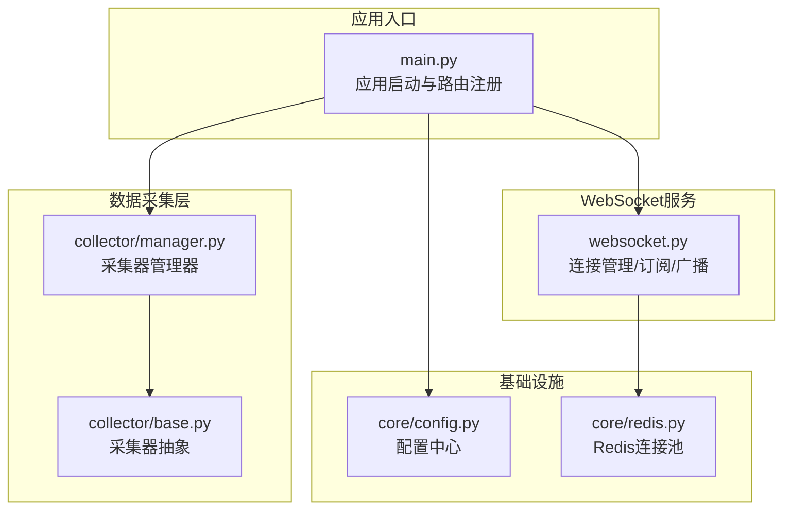
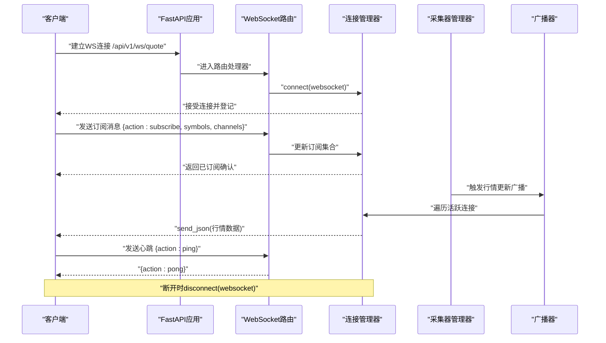
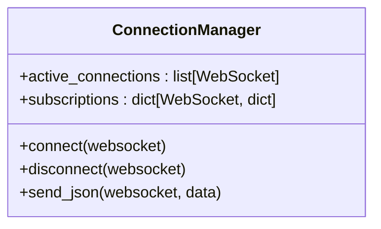
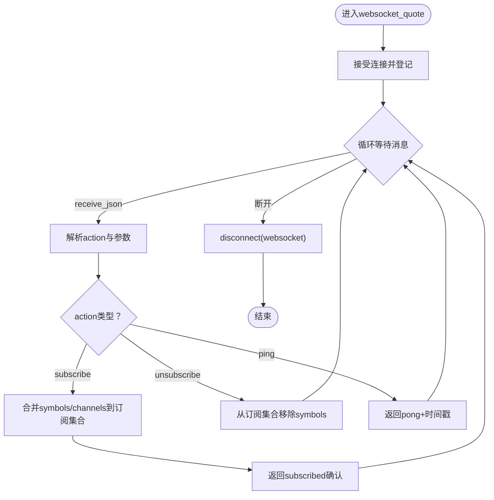
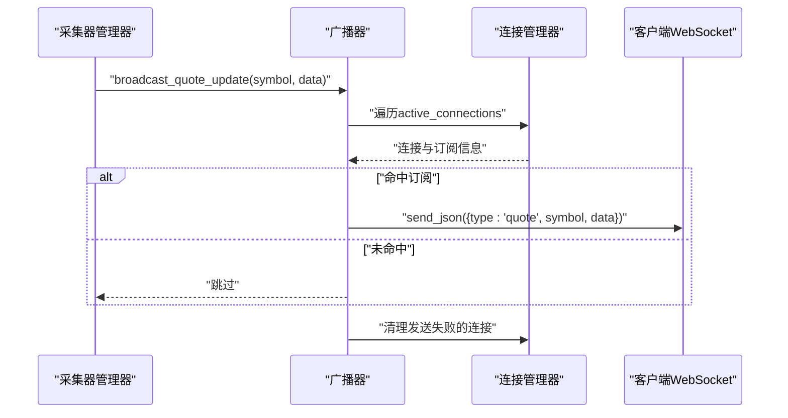
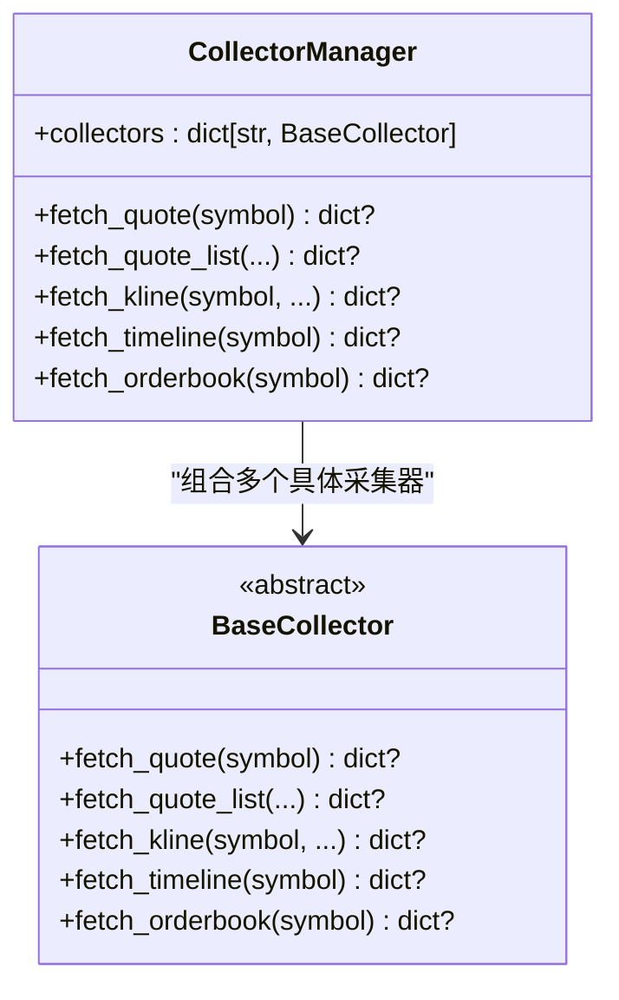
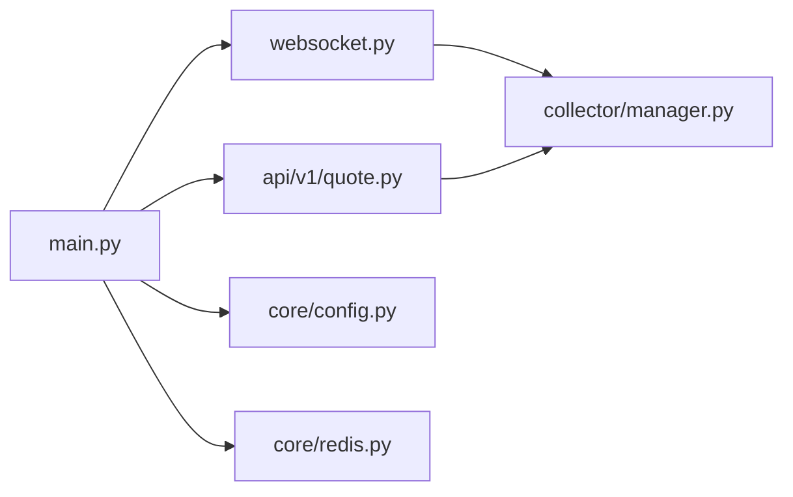

# WebSocket实时推送服务

<cite>
**本文档引用的文件**
- [backend/app/api/websocket.py](file://backend/app/api/websocket.py)
- [backend/app/main.py](file://backend/app/main.py)
- [backend/app/core/redis.py](file://backend/app/core/redis.py)
- [backend/app/services/collector/manager.py](file://backend/app/services/collector/manager.py)
- [backend/app/api/v1/quote.py](file://backend/app/api/v1/quote.py)
- [backend/app/services/collector/base.py](file://backend/app/services/collector/base.py)
- [backend/app/core/config.py](file://backend/app/core/config.py)
- [backend/requirements.txt](file://backend/requirements.txt)
</cite>

## 目录
1. [引言](#引言)
2. [项目结构](#项目结构)
3. [核心组件](#核心组件)
4. [架构总览](#架构总览)
5. [详细组件分析](#详细组件分析)
6. [依赖分析](#依赖分析)
7. [性能考虑](#性能考虑)
8. [故障排查指南](#故障排查指南)
9. [结论](#结论)
10. [附录](#附录)

## 引言
本文件面向Stock-View项目的WebSocket实时推送服务，系统性解析其架构设计与实现细节，覆盖连接建立、消息处理、连接管理、断线重连、实时行情推送、订阅机制、广播策略、连接池管理等核心主题。同时对比WebSocket与传统HTTP请求的差异，提供客户端集成指南与性能优化建议，帮助开发者构建稳定可靠的实时推送系统。

## 项目结构
后端采用FastAPI框架，WebSocket路由位于独立模块中，配合全局生命周期管理、Redis连接池、数据采集器管理器等基础设施，形成“HTTP接口 + 实时推送”的统一服务入口。

图表来源
- [backend/app/main.py:1-48](file://backend/app/main.py#L1-L48)
- [backend/app/api/websocket.py:1-79](file://backend/app/api/websocket.py#L1-L79)
- [backend/app/services/collector/manager.py:1-80](file://backend/app/services/collector/manager.py#L1-L80)
- [backend/app/services/collector/base.py:1-45](file://backend/app/services/collector/base.py#L1-L45)
- [backend/app/core/redis.py:1-25](file://backend/app/core/redis.py#L1-L25)
- [backend/app/core/config.py:1-43](file://backend/app/core/config.py#L1-L43)

章节来源
- [backend/app/main.py:1-48](file://backend/app/main.py#L1-L48)
- [backend/app/api/websocket.py:1-79](file://backend/app/api/websocket.py#L1-L79)
- [backend/app/core/redis.py:1-25](file://backend/app/core/redis.py#L1-L25)
- [backend/app/services/collector/manager.py:1-80](file://backend/app/services/collector/manager.py#L1-L80)
- [backend/app/services/collector/base.py:1-45](file://backend/app/services/collector/base.py#L1-L45)
- [backend/app/core/config.py:1-43](file://backend/app/core/config.py#L1-L43)

## 核心组件
- 连接管理器：负责WebSocket连接的接入、断开、订阅登记与JSON消息发送，具备异常断开自动清理能力。
- WebSocket路由：提供/ws/quote端点，支持订阅/退订、心跳检测（ping/pong）等协议指令。
- 广播器：按订阅关系向客户端推送行情更新，自动剔除不可达连接。
- 数据采集器管理器：封装多数据源采集逻辑，提供故障转移与优先级控制。
- 应用入口：注册路由、CORS中间件与生命周期钩子，统一暴露HTTP与WebSocket服务。

章节来源
- [backend/app/api/websocket.py:12-79](file://backend/app/api/websocket.py#L12-L79)
- [backend/app/services/collector/manager.py:12-80](file://backend/app/services/collector/manager.py#L12-L80)
- [backend/app/main.py:13-48](file://backend/app/main.py#L13-L48)

## 架构总览
WebSocket实时推送服务以FastAPI为载体，通过ConnectionManager集中管理连接与订阅，使用Redis作为共享状态存储（当前代码未直接使用），行情数据由采集器管理器统一拉取并触发广播。

图表来源
- [backend/app/api/websocket.py:39-79](file://backend/app/api/websocket.py#L39-L79)
- [backend/app/services/collector/manager.py:12-80](file://backend/app/services/collector/manager.py#L12-L80)

## 详细组件分析

### 连接管理器（ConnectionManager）
- 职责
  - 维护活跃连接列表与订阅映射（按连接维度记录symbols与channels）。
  - 提供connect/disconnect、send_json等基础能力。
  - send_json在异常时自动断开连接，避免僵尸连接。
- 订阅模型
  - 每个连接维护symbols集合与channels集合，用于广播过滤。
- 并发与可靠性
  - 使用异步send_json，异常捕获后主动清理，降低广播循环成本。

图表来源
- [backend/app/api/websocket.py:12-36](file://backend/app/api/websocket.py#L12-L36)

章节来源
- [backend/app/api/websocket.py:12-36](file://backend/app/api/websocket.py#L12-L36)

### WebSocket路由与消息协议
- 路由定义
  - 端点：/api/v1/ws/quote
  - 处理器：websocket_quote
- 协议指令
  - subscribe：更新连接订阅集合，返回subscribed确认。
  - unsubscribe：从连接订阅中移除symbols。
  - ping：返回pong及时间戳，用于心跳检测。
- 断线处理
  - 捕获WebSocketDisconnect，调用disconnect清理。

图表来源
- [backend/app/api/websocket.py:39-65](file://backend/app/api/websocket.py#L39-L65)

章节来源
- [backend/app/api/websocket.py:39-65](file://backend/app/api/websocket.py#L39-L65)

### 广播器（broadcast_quote_update）
- 触发时机
  - 当采集器管理器获取到某股票行情更新后，调用广播器。
- 广播策略
  - 遍历所有活跃连接，仅向订阅了对应symbol且channel包含"quote"的客户端发送。
  - 发送失败的连接会被收集并在结束后统一断开，避免后续重复尝试。
- 消息格式
  - type为"quote"，携带symbol与data字段。

图表来源
- [backend/app/api/websocket.py:67-79](file://backend/app/api/websocket.py#L67-L79)

章节来源
- [backend/app/api/websocket.py:67-79](file://backend/app/api/websocket.py#L67-L79)

### 数据采集器管理器（CollectorManager）
- 设计要点
  - 定义采集器优先级列表，按顺序尝试不同数据源，实现故障转移。
  - 对外提供fetch_quote、fetch_quote_list、fetch_kline、fetch_timeline、fetch_orderbook等异步接口。
  - 对每个数据源调用进行异常捕获与日志记录，确保整体可用性。
- 与WebSocket的关系
  - WebSocket不直接调用采集器；行情更新通常由后台任务或定时任务触发，完成后调用广播器。

图表来源
- [backend/app/services/collector/manager.py:12-80](file://backend/app/services/collector/manager.py#L12-L80)
- [backend/app/services/collector/base.py:5-45](file://backend/app/services/collector/base.py#L5-L45)

章节来源
- [backend/app/services/collector/manager.py:12-80](file://backend/app/services/collector/manager.py#L12-L80)
- [backend/app/services/collector/base.py:5-45](file://backend/app/services/collector/base.py#L5-L45)

### 应用入口与生命周期
- 生命周期
  - 启动阶段初始化数据库，关闭阶段释放Redis连接池。
- 路由注册
  - 包含HTTP行情接口与WebSocket路由，统一前缀/api/v1。
- CORS
  - 放通所有来源，便于前端跨域访问。

章节来源
- [backend/app/main.py:13-48](file://backend/app/main.py#L13-L48)

### 配置与依赖
- 配置项
  - REDIS_URL：Redis连接地址。
  - QUOTE_COLLECT_INTERVAL：行情采集间隔（秒）。
  - QUOTE_CACHE_TTL：行情缓存TTL（秒）。
- 依赖
  - redis==5.0.*：异步Redis客户端。
  - fastapi==0.110.*、uvicorn[standard]==0.29.*：Web框架与ASGI服务器。
  - httpx==0.27.*：HTTP客户端（用于外部服务调用）。

章节来源
- [backend/app/core/config.py:1-43](file://backend/app/core/config.py#L1-L43)
- [backend/requirements.txt:1-17](file://backend/requirements.txt#L1-L17)

## 依赖分析
- 组件耦合
  - WebSocket路由依赖连接管理器；广播器依赖连接管理器；采集器管理器独立于WebSocket。
  - 应用入口统一注册路由与中间件，形成清晰的控制流。
- 外部依赖
  - Redis用于连接池管理（当前WebSocket未直接使用），可扩展为订阅状态持久化或集群共享。
  - HTTP行情接口与WebSocket接口共用采集器管理器，保证数据一致性。

图表来源
- [backend/app/main.py:1-48](file://backend/app/main.py#L1-L48)
- [backend/app/api/websocket.py:1-79](file://backend/app/api/websocket.py#L1-L79)
- [backend/app/api/v1/quote.py:1-65](file://backend/app/api/v1/quote.py#L1-L65)
- [backend/app/services/collector/manager.py:1-80](file://backend/app/services/collector/manager.py#L1-L80)
- [backend/app/core/config.py:1-43](file://backend/app/core/config.py#L1-L43)
- [backend/app/core/redis.py:1-25](file://backend/app/core/redis.py#L1-L25)

章节来源
- [backend/app/main.py:1-48](file://backend/app/main.py#L1-L48)
- [backend/app/api/websocket.py:1-79](file://backend/app/api/websocket.py#L1-L79)
- [backend/app/api/v1/quote.py:1-65](file://backend/app/api/v1/quote.py#L1-L65)
- [backend/app/services/collector/manager.py:1-80](file://backend/app/services/collector/manager.py#L1-L80)
- [backend/app/core/config.py:1-43](file://backend/app/core/config.py#L1-L43)
- [backend/app/core/redis.py:1-25](file://backend/app/core/redis.py#L1-L25)

## 性能考虑
- 广播复杂度
  - 当前广播遍历所有活跃连接，时间复杂度O(N)。建议：
    - 基于symbol建立倒排索引，仅遍历订阅者集合。
    - 使用Redis发布/订阅或频道分区，减少Python侧广播压力。
- 连接池与资源
  - Redis连接池已实现单例懒加载，注意在高并发下合理设置连接数与超时。
- 心跳与保活
  - 已实现ping/pong，建议客户端定期发送心跳，服务端可增加超时踢人策略。
- 缓存与去抖
  - 利用配置中的QUOTE_CACHE_TTL进行本地缓存，避免频繁重复请求。
- 并发与背压
  - send_json在异常时断开连接，避免阻塞；可引入队列与限速防止瞬时洪峰。
- 内存管理
  - 订阅集合使用set，查询与更新均为平均O(1)；注意及时unsubscribe，避免内存泄漏。

## 故障排查指南
- 常见问题
  - 客户端无法收到行情：检查订阅是否包含"quote"通道，以及symbol是否正确。
  - 连接频繁断开：关注send_json异常路径，确认网络波动与心跳频率。
  - 广播效率低：评估活跃连接数量，考虑按symbol分桶广播。
- 日志与监控
  - 采集器管理器对各数据源调用进行异常捕获与警告日志，便于定位数据源问题。
- 排查步骤
  - 确认WebSocket端点与路由注册正常。
  - 在客户端发送ping验证连通性。
  - 检查订阅消息格式与内容。
  - 观察广播器对特定symbol的发送情况。

章节来源
- [backend/app/api/websocket.py:29-34](file://backend/app/api/websocket.py#L29-L34)
- [backend/app/services/collector/manager.py:21-32](file://backend/app/services/collector/manager.py#L21-L32)

## 结论
Stock-View的WebSocket实时推送服务以简洁的连接管理与广播策略为核心，结合采集器管理器实现高可用的数据源故障转移。通过心跳保活、异常断开清理与订阅过滤，系统在功能与稳定性之间取得平衡。建议在生产环境中引入订阅索引、Redis发布/订阅或频道分区、队列与限速等优化手段，进一步提升吞吐与稳定性。

## 附录

### WebSocket与HTTP请求的区别
- 双向通信
  - WebSocket：全双工，服务端可主动推送。
  - HTTP：请求-响应单向模型，需轮询或Server-Sent Events实现近似推送。
- 长连接维护
  - WebSocket：一次握手后保持长连接，开销低。
  - HTTP：每次请求建立新连接或复用连接，存在连接开销。
- 消息序列化
  - WebSocket：文本/二进制帧，适合JSON对象传输。
  - HTTP：主要为请求体与响应体，序列化方式多样。

### 客户端集成指南
- 连接建立
  - 使用浏览器或语言原生WebSocket库连接/api/v1/ws/quote。
- 订阅管理
  - 发送订阅消息，包含action、symbols数组、channels数组（如"quote"）。
- 消息接收
  - 监听消息事件，解析type为"quote"的消息，提取symbol与data。
- 错误处理
  - 捕获连接断开事件，实现指数退避重连。
  - 定期发送ping，若长时间无响应则主动重连。
- 心跳与保活
  - 建议每30秒发送一次ping，服务端返回pong确认。

### 高级主题与最佳实践
- 并发连接处理
  - 使用连接池与限速，避免广播风暴。
- 内存管理
  - 及时unsubscribe，定期清理无效连接。
- 可观测性
  - 增加连接数、订阅数、广播耗时等指标埋点。
- 扩展性
  - 将订阅状态迁移到Redis，支持多实例共享与水平扩展。