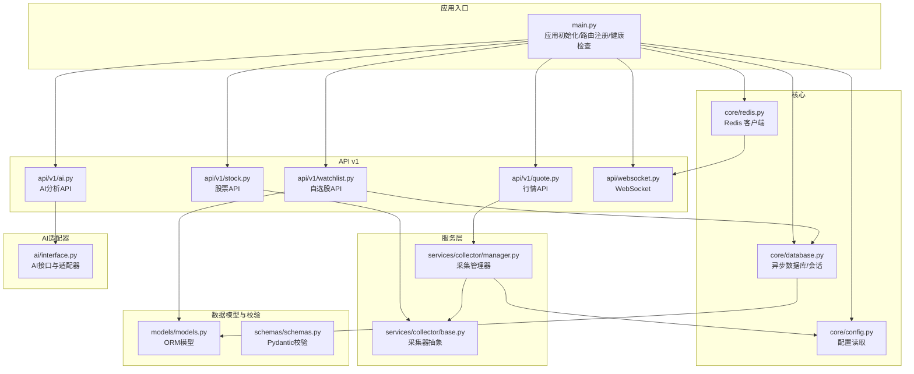
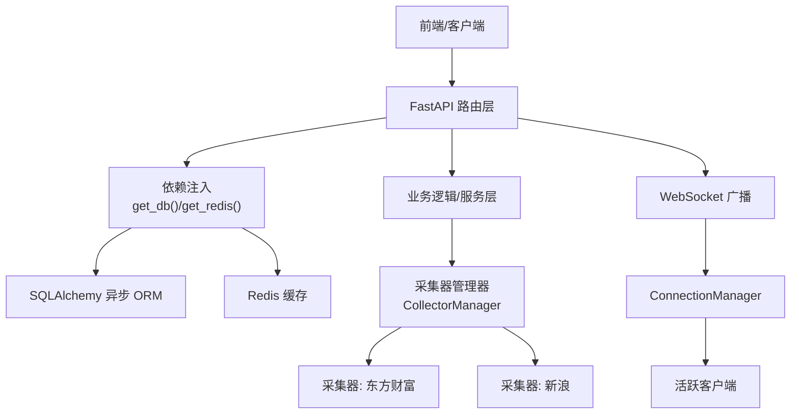
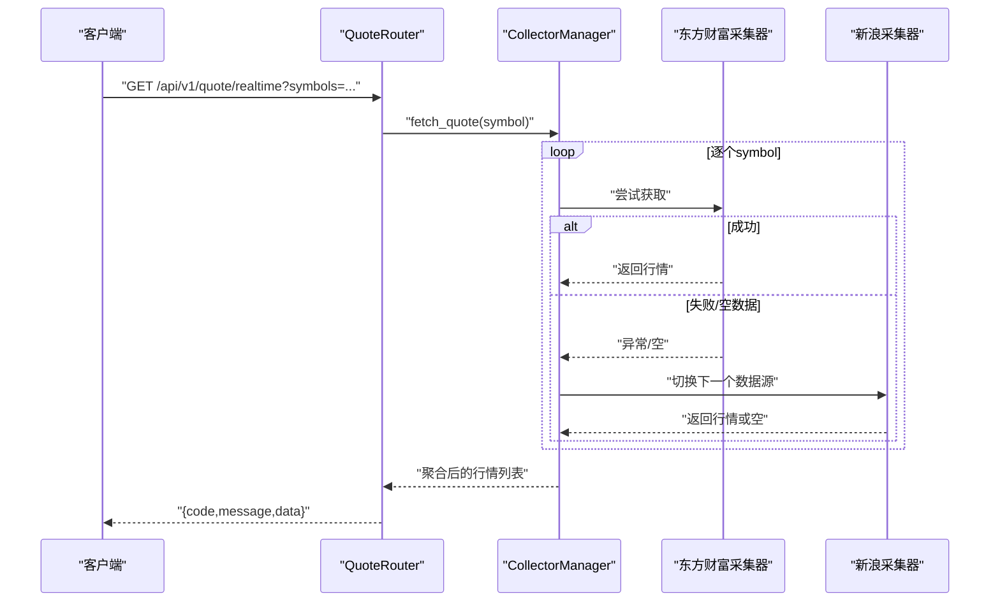
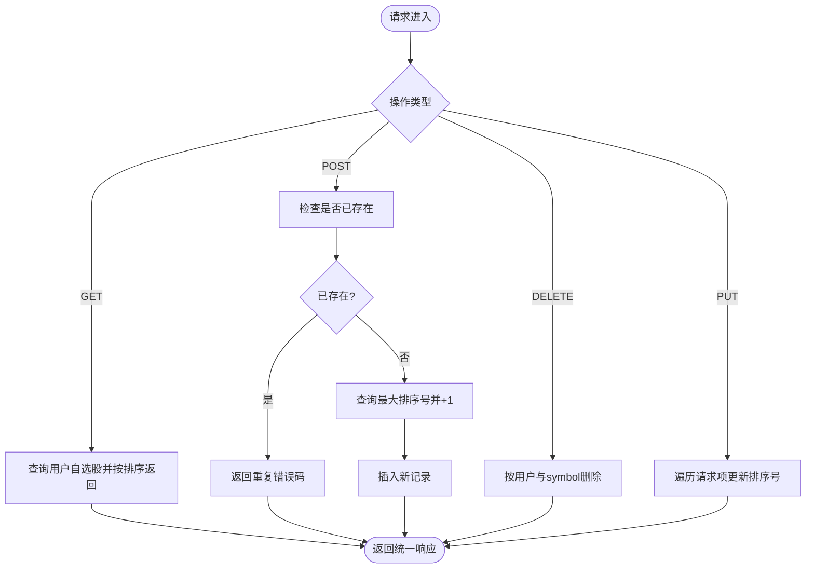
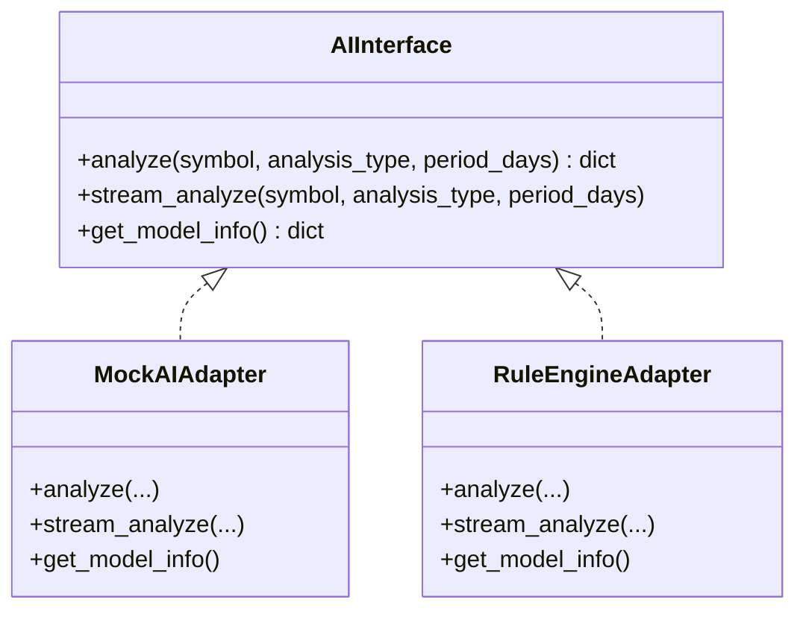
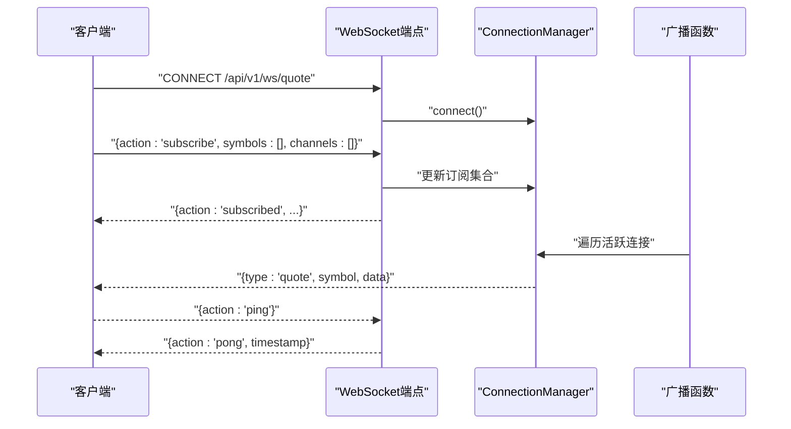
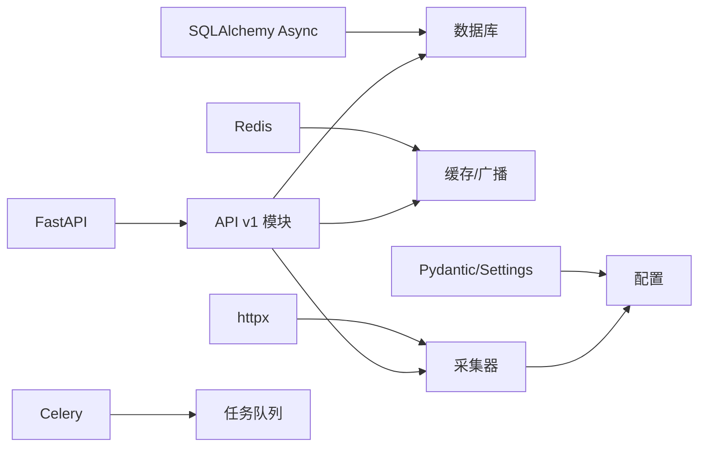

# 后端开发

<cite>
**本文引用的文件**
- [backend/app/main.py](file://backend/app/main.py)
- [backend/app/core/config.py](file://backend/app/core/config.py)
- [backend/app/core/database.py](file://backend/app/core/database.py)
- [backend/app/core/redis.py](file://backend/app/core/redis.py)
- [backend/app/api/v1/quote.py](file://backend/app/api/v1/quote.py)
- [backend/app/api/v1/stock.py](file://backend/app/api/v1/stock.py)
- [backend/app/api/v1/watchlist.py](file://backend/app/api/v1/watchlist.py)
- [backend/app/api/v1/ai.py](file://backend/app/api/v1/ai.py)
- [backend/app/api/websocket.py](file://backend/app/api/websocket.py)
- [backend/app/services/collector/manager.py](file://backend/app/services/collector/manager.py)
- [backend/app/services/collector/base.py](file://backend/app/services/collector/base.py)
- [backend/app/models/models.py](file://backend/app/models/models.py)
- [backend/app/schemas/schemas.py](file://backend/app/schemas/schemas.py)
- [backend/app/ai/interface.py](file://backend/app/ai/interface.py)
- [backend/requirements.txt](file://backend/requirements.txt)
</cite>

## 目录
1. [简介](#简介)
2. [项目结构](#项目结构)
3. [核心组件](#核心组件)
4. [架构总览](#架构总览)
5. [详细组件分析](#详细组件分析)
6. [依赖分析](#依赖分析)
7. [性能考虑](#性能考虑)
8. [故障排查指南](#故障排查指南)
9. [结论](#结论)
10. [附录](#附录)

## 简介
本文件为 Stock-View 后端开发的综合文档，面向 Python 开发者，覆盖 FastAPI 应用的整体结构、路由系统设计、中间件与生命周期配置、依赖注入机制；深入解析行情、股票、自选股、AI 分析四大 API 模块的功能实现；详解 WebSocket 实时推送机制、连接管理与消息格式；给出 RESTful 设计规范、错误处理策略与数据验证机制，并提供最佳实践与性能优化建议。

## 项目结构
后端采用 FastAPI + SQLAlchemy Async + Redis 异步架构，按功能域划分模块：
- 应用入口与生命周期：main.py
- 配置中心：core/config.py
- 数据库与会话：core/database.py
- 缓存：core/redis.py
- API v1：api/v1 下的 quote.py、stock.py、watchlist.py、ai.py、websocket.py
- 数据采集层：services/collector 下的 base.py、manager.py、eastmoney.py、sina.py
- 模型与校验：models/models.py、schemas/schemas.py
- AI 抽象与适配器：ai/interface.py
- 依赖清单：requirements.txt

图表来源
- [backend/app/main.py:1-48](file://backend/app/main.py#L1-L48)
- [backend/app/core/config.py:1-43](file://backend/app/core/config.py#L1-L43)
- [backend/app/core/database.py:1-25](file://backend/app/core/database.py#L1-L25)
- [backend/app/core/redis.py:1-25](file://backend/app/core/redis.py#L1-L25)
- [backend/app/api/v1/quote.py:1-65](file://backend/app/api/v1/quote.py#L1-L65)
- [backend/app/api/v1/stock.py:1-37](file://backend/app/api/v1/stock.py#L1-L37)
- [backend/app/api/v1/watchlist.py:1-77](file://backend/app/api/v1/watchlist.py#L1-L77)
- [backend/app/api/v1/ai.py:1-29](file://backend/app/api/v1/ai.py#L1-L29)
- [backend/app/api/websocket.py:1-79](file://backend/app/api/websocket.py#L1-L79)
- [backend/app/services/collector/manager.py:1-94](file://backend/app/services/collector/manager.py#L1-L94)
- [backend/app/services/collector/base.py:1-45](file://backend/app/services/collector/base.py#L1-L45)
- [backend/app/models/models.py:1-74](file://backend/app/models/models.py#L1-L74)
- [backend/app/schemas/schemas.py:1-103](file://backend/app/schemas/schemas.py#L1-L103)
- [backend/app/ai/interface.py:1-196](file://backend/app/ai/interface.py#L1-L196)

章节来源
- [backend/app/main.py:1-48](file://backend/app/main.py#L1-L48)
- [backend/app/core/config.py:1-43](file://backend/app/core/config.py#L1-L43)
- [backend/app/core/database.py:1-25](file://backend/app/core/database.py#L1-L25)
- [backend/app/core/redis.py:1-25](file://backend/app/core/redis.py#L1-L25)

## 核心组件
- 应用入口与生命周期
  - 使用 lifespan 在启动阶段初始化数据库，在关闭阶段释放 Redis 连接池。
  - 注册 CORS 中间件，允许跨域访问。
  - 注册 v1 所有子路由：/api/v1/quote、/api/v1/stock、/api/v1/watchlist、/api/v1/ai、/api/v1/ws。
  - 提供 /api/v1/health 健康检查接口。
- 配置中心
  - 通过 Settings 从 .env 文件读取配置，包括数据库、Redis、AI 服务、Celery、行情采集间隔与缓存 TTL、JWT 等。
  - 使用 LRU 缓存 get_settings()，避免重复解析。
- 数据库与会话
  - 异步 SQLAlchemy 引擎与会话工厂，支持连接池参数；提供 get_db() 依赖注入会话。
  - 应用启动时自动创建所有表。
- 缓存
  - Redis 异步客户端，全局单例，提供 get_redis() 与 close_redis() 生命周期钩子。

章节来源
- [backend/app/main.py:13-48](file://backend/app/main.py#L13-L48)
- [backend/app/core/config.py:5-43](file://backend/app/core/config.py#L5-L43)
- [backend/app/core/database.py:15-25](file://backend/app/core/database.py#L15-L25)
- [backend/app/core/redis.py:10-25](file://backend/app/core/redis.py#L10-L25)

## 架构总览
后端采用“API 层 → 服务层 → 数据采集层”的分层架构，结合 Redis 缓存与数据库持久化，支持 WebSocket 实时推送。

图表来源
- [backend/app/main.py:22-43](file://backend/app/main.py#L22-L43)
- [backend/app/core/database.py:15-20](file://backend/app/core/database.py#L15-L20)
- [backend/app/core/redis.py:10-18](file://backend/app/core/redis.py#L10-L18)
- [backend/app/services/collector/manager.py:12-94](file://backend/app/services/collector/manager.py#L12-L94)
- [backend/app/api/websocket.py:12-36](file://backend/app/api/websocket.py#L12-L36)

## 详细组件分析

### 路由系统与中间件
- 路由注册
  - 所有 v1 接口统一以 /api/v1 为前缀，分别挂载 quote、stock、watchlist、ai、websocket 子路由。
- 中间件
  - CORS 允许任意来源、方法与头，便于前后端联调。
- 生命周期
  - 启动：初始化数据库元数据。
  - 关闭：关闭 Redis 连接池。

章节来源
- [backend/app/main.py:29-48](file://backend/app/main.py#L29-L48)

### 行情 API（实时报价、K线图、分时图、盘口数据）
- 接口概览
  - GET /api/v1/quote/realtime：批量获取实时行情，最多 50 个股票代码。
  - GET /api/v1/quote/list：分页获取行情列表，支持按字段排序。
  - GET /api/v1/quote/kline：获取 K 线，支持周期、复权类型与数量限制。
  - GET /api/v1/quote/timeline：获取分时数据。
  - GET /api/v1/quote/orderbook：获取盘口数据。
- 数据来源与容错
  - 通过 CollectorManager 自动在多个数据源之间进行优先级与故障转移。
  - 若所有数据源均不可用，返回统一错误码与提示。
- 统一响应结构
  - 字段 code、message、data；成功时 code 为 0，失败时返回特定错误码。

图表来源
- [backend/app/api/v1/quote.py:7-16](file://backend/app/api/v1/quote.py#L7-L16)
- [backend/app/services/collector/manager.py:21-33](file://backend/app/services/collector/manager.py#L21-L33)

章节来源
- [backend/app/api/v1/quote.py:1-65](file://backend/app/api/v1/quote.py#L1-L65)
- [backend/app/services/collector/manager.py:12-94](file://backend/app/services/collector/manager.py#L12-L94)

### 股票 API（基本信息、搜索功能）
- 接口概览
  - GET /api/v1/stock/search：关键词搜索股票，返回 A 股标的（上/深），支持限制数量。
- 实现要点
  - 使用异步 HTTP 客户端调用第三方搜索接口，过滤非 A 股与无效条目。
  - 返回统一结构，包含 symbol、name、market、pinyin。

章节来源
- [backend/app/api/v1/stock.py:1-37](file://backend/app/api/v1/stock.py#L1-L37)

### 自选股 API（列表管理、排序）
- 接口概览
  - GET /api/v1/watchlist：获取当前用户自选股列表（默认用户 ID 固定为 1）。
  - POST /api/v1/watchlist：添加自选股，自动分配排序序号。
  - DELETE /api/v1/watchlist/{symbol}：移除自选股。
  - PUT /api/v1/watchlist/sort：批量重排。
- 数据模型
  - 使用 Watchlist 模型，包含 user_id、symbol、market、sort_order、group_name、added_at。
- 依赖注入
  - 通过 get_db() 获取 AsyncSession，执行 CRUD 操作。

图表来源
- [backend/app/api/v1/watchlist.py:13-77](file://backend/app/api/v1/watchlist.py#L13-L77)
- [backend/app/models/models.py:50-60](file://backend/app/models/models.py#L50-L60)

章节来源
- [backend/app/api/v1/watchlist.py:1-77](file://backend/app/api/v1/watchlist.py#L1-L77)
- [backend/app/models/models.py:50-60](file://backend/app/models/models.py#L50-L60)

### AI 分析 API（智能分析接口）
- 接口概览
  - POST /api/v1/ai/analyze：请求 AI 分析，支持分析类型与时间窗口。
  - GET /api/v1/ai/history：获取 AI 分析历史（预留）。
  - GET /api/v1/ai/model-info：获取当前 AI 模型信息。
- 适配器模式
  - 通过 create_ai_adapter(settings.AI_ADAPTER) 创建适配器实例，支持 mock 与规则引擎两种实现。
  - AIInterface 定义 analyze、stream_analyze、get_model_info 三个接口。
- 统一响应
  - 返回 code、message、data；data 包含趋势、置信度、摘要、细节等。

图表来源
- [backend/app/ai/interface.py:26-196](file://backend/app/ai/interface.py#L26-L196)

章节来源
- [backend/app/api/v1/ai.py:1-29](file://backend/app/api/v1/ai.py#L1-L29)
- [backend/app/ai/interface.py:190-196](file://backend/app/ai/interface.py#L190-L196)

### WebSocket 实时推送机制
- 连接管理
  - ConnectionManager 维护活跃连接列表与订阅映射（symbols/channels），支持订阅/退订与心跳 ping/pong。
- 广播流程
  - broadcast_quote_update 将行情更新按 symbol 与 channel 过滤后推送给订阅客户端。
- 消息格式
  - 订阅/退订：客户端发送 {action: "subscribe"/"unsubscribe", symbols[], channels[]}，服务端回执 {action: "subscribed"}。
  - 心跳：客户端发送 {action: "ping"}，服务端回执 {action: "pong", timestamp}。
  - 行情推送：服务端推送 {type: "quote", symbol, data}。

图表来源
- [backend/app/api/websocket.py:12-79](file://backend/app/api/websocket.py#L12-L79)

章节来源
- [backend/app/api/websocket.py:1-79](file://backend/app/api/websocket.py#L1-L79)

### 数据模型与校验
- 数据模型（SQLAlchemy）
  - StockInfo：股票基础信息。
  - QuoteDaily：日线行情。
  - QuoteTick：分时 tick 数据（JSON 字符串）。
  - Watchlist：自选股。
  - AIAnalysisLog：AI 分析日志。
- Pydantic 校验
  - ResponseBase：统一响应结构。
  - QuoteItem/KlineItem/TimelinePoint/OrderBookLevel：各数据结构。
  - WatchlistAddRequest/WatchlistSortRequest：自选股请求体。
  - AIAnalysisRequest/AIAnalysisResponse：AI 请求与响应。

章节来源
- [backend/app/models/models.py:1-74](file://backend/app/models/models.py#L1-L74)
- [backend/app/schemas/schemas.py:1-103](file://backend/app/schemas/schemas.py#L1-L103)

### 依赖注入与服务层
- 依赖注入
  - get_db()：提供 AsyncSession，用于数据库操作。
  - get_redis()：提供 Redis 客户端，用于缓存与广播。
- 采集器抽象
  - BaseCollector 定义 fetch_* 方法与工具方法（如 secid 生成）。
  - CollectorManager 维护多采集器实例与故障转移逻辑。

章节来源
- [backend/app/core/database.py:15-20](file://backend/app/core/database.py#L15-L20)
- [backend/app/core/redis.py:10-18](file://backend/app/core/redis.py#L10-L18)
- [backend/app/services/collector/base.py:5-45](file://backend/app/services/collector/base.py#L5-L45)
- [backend/app/services/collector/manager.py:12-94](file://backend/app/services/collector/manager.py#L12-L94)

## 依赖分析
- 外部依赖
  - FastAPI、Uvicorn：Web 框架与 ASGI 服务器。
  - SQLAlchemy Async + asyncpg：异步 ORM 与 PostgreSQL 驱动。
  - Celery + Redis：任务队列与结果存储。
  - httpx：异步 HTTP 客户端。
  - Pydantic/Settings：数据校验与配置管理。
  - ta/pandas/numpy：技术分析与数值计算。
  - python-jose/passlib：JWT 与密码处理。
- 内部模块耦合
  - API 层仅依赖服务层与核心组件（数据库/Redis/配置）。
  - 采集层通过 CollectorManager 解耦具体数据源。
  - WebSocket 依赖 Redis 与 ConnectionManager 管理连接。

图表来源
- [backend/requirements.txt:1-17](file://backend/requirements.txt#L1-L17)
- [backend/app/main.py:1-48](file://backend/app/main.py#L1-L48)
- [backend/app/core/config.py:1-43](file://backend/app/core/config.py#L1-L43)

章节来源
- [backend/requirements.txt:1-17](file://backend/requirements.txt#L1-L17)

## 性能考虑
- 连接池与并发
  - 数据库连接池参数可调，建议根据并发与资源情况评估 max_overflow 与 pool_size。
- 缓存策略
  - 利用 Redis 缓存热点数据，减少对上游数据源与数据库的压力。
- 异步化
  - 使用异步 HTTP 客户端与异步 ORM，提升 I/O 密集场景吞吐。
- 限流与降级
  - AI 服务可通过配置项设置超时、缓存 TTL 与速率限制，必要时启用降级策略。
- 数据源故障转移
  - 采集器管理器按优先级自动切换，提高可用性与稳定性。

## 故障排查指南
- 健康检查
  - 访问 /api/v1/health，确认应用状态与版本。
- 数据源不可用
  - 行情相关接口在数据源不可用时返回特定错误码与提示，检查采集器日志与网络连通性。
- WebSocket 断开
  - 检查客户端是否定期发送 ping，服务端是否正确回送 pong；确认订阅符号与通道是否匹配。
- 数据库连接问题
  - 检查连接字符串与数据库服务状态；确认连接池参数合理。
- Redis 连接问题
  - 检查 Redis 地址与认证；确认生命周期钩子正确关闭连接池。

章节来源
- [backend/app/main.py:46-48](file://backend/app/main.py#L46-L48)
- [backend/app/api/v1/quote.py:31-33](file://backend/app/api/v1/quote.py#L31-L33)
- [backend/app/api/websocket.py:63-64](file://backend/app/api/websocket.py#L63-L64)
- [backend/app/core/database.py:23-25](file://backend/app/core/database.py#L23-L25)
- [backend/app/core/redis.py:21-25](file://backend/app/core/redis.py#L21-L25)

## 结论
本后端以 FastAPI 为核心，结合异步数据库、Redis 缓存与多数据源采集，构建了高可用的 A 股行情与 AI 分析平台。通过清晰的分层架构、统一的响应结构与 WebSocket 实时推送，满足了前端交互与扩展需求。建议在生产环境中进一步完善鉴权、限流、监控与日志体系，并持续优化采集与缓存策略以提升性能与稳定性。

## 附录
- RESTful 设计规范
  - 统一使用 /api/v1 前缀；资源命名使用名词复数；HTTP 方法语义明确；错误码与消息统一。
- 错误处理策略
  - 使用统一响应结构；对上游数据源失败返回特定错误码；捕获异常并记录日志。
- 数据验证机制
  - 使用 Pydantic 校验请求参数与响应结构；在路由层声明 Query/Body 参数约束。
- 最佳实践
  - 依赖注入解耦；长耗时任务使用 Celery；WebSocket 连接管理与心跳保活；配置集中化与缓存。