# 后端开发

<cite>
**本文引用的文件**
- [backend/app/main.py](file://backend/app/main.py)
- [backend/app/core/config.py](file://backend/app/core/config.py)
- [backend/app/core/database.py](file://backend/app/core/database.py)
- [backend/app/core/redis.py](file://backend/app/core/redis.py)
- [backend/app/models/models.py](file://backend/app/models/models.py)
- [backend/app/schemas/schemas.py](file://backend/app/schemas/schemas.py)
- [backend/app/api/v1/quote.py](file://backend/app/api/v1/quote.py)
- [backend/app/api/v1/stock.py](file://backend/app/api/v1/stock.py)
- [backend/app/api/v1/watchlist.py](file://backend/app/api/v1/watchlist.py)
- [backend/app/api/v1/ai.py](file://backend/app/api/v1/ai.py)
- [backend/app/api/websocket.py](file://backend/app/api/websocket.py)
- [backend/app/ai/interface.py](file://backend/app/ai/interface.py)
- [backend/app/services/collector/manager.py](file://backend/app/services/collector/manager.py)
- [backend/app/services/collector/base.py](file://backend/app/services/collector/base.py)
- [backend/app/services/collector/eastmoney.py](file://backend/app/services/collector/eastmoney.py)
</cite>

## 目录
1. [引言](#引言)
2. [项目结构](#项目结构)
3. [核心组件](#核心组件)
4. [架构总览](#架构总览)
5. [详细组件分析](#详细组件分析)
6. [依赖分析](#依赖分析)
7. [性能考虑](#性能考虑)
8. [故障排查指南](#故障排查指南)
9. [结论](#结论)
10. [附录](#附录)

## 引言
本指南面向Stock-View后端开发者，系统讲解基于FastAPI的A股行情查看与AI分析平台的架构与实现。内容覆盖应用初始化、路由注册、中间件配置、异步数据库与Redis连接、数据模型与Schema、行情采集与回退机制、自选股管理、AI分析适配器、WebSocket实时推送等核心模块，并给出异步编程、错误处理、缓存策略与性能优化的最佳实践。

## 项目结构
后端采用“按功能域分层”的组织方式：入口应用、核心配置与基础设施（数据库、Redis）、模型与Schema、API版本路由、服务层（采集器与管理器）、AI适配器、WebSocket模块等。

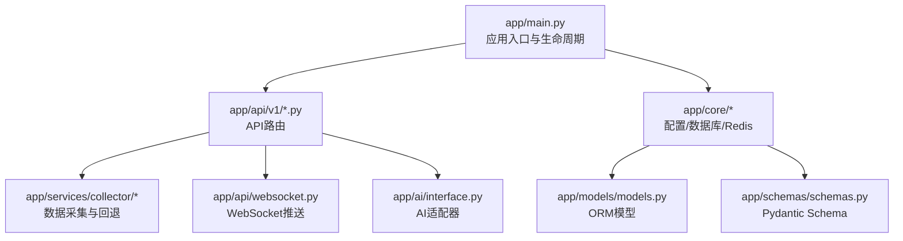

图表来源
- [backend/app/main.py:1-48](file://backend/app/main.py#L1-L48)
- [backend/app/api/v1/quote.py:1-65](file://backend/app/api/v1/quote.py#L1-L65)
- [backend/app/api/v1/stock.py:1-37](file://backend/app/api/v1/stock.py#L1-L37)
- [backend/app/api/v1/watchlist.py:1-77](file://backend/app/api/v1/watchlist.py#L1-L77)
- [backend/app/api/v1/ai.py:1-29](file://backend/app/api/v1/ai.py#L1-L29)
- [backend/app/api/websocket.py:1-79](file://backend/app/api/websocket.py#L1-L79)
- [backend/app/ai/interface.py:1-196](file://backend/app/ai/interface.py#L1-L196)
- [backend/app/services/collector/manager.py:1-80](file://backend/app/services/collector/manager.py#L1-L80)
- [backend/app/core/database.py:1-25](file://backend/app/core/database.py#L1-L25)
- [backend/app/core/redis.py:1-25](file://backend/app/core/redis.py#L1-L25)
- [backend/app/models/models.py:1-74](file://backend/app/models/models.py#L1-L74)
- [backend/app/schemas/schemas.py:1-103](file://backend/app/schemas/schemas.py#L1-L103)

章节来源
- [backend/app/main.py:1-48](file://backend/app/main.py#L1-L48)

## 核心组件
- 应用入口与生命周期：定义FastAPI实例、CORS中间件、路由注册、健康检查端点，以及通过lifespan进行数据库初始化与Redis连接关闭。
- 配置中心：集中管理数据库、Redis、AI服务、Celery、行情采集间隔与缓存TTL、JWT等配置项。
- 数据库与会话：使用SQLAlchemy异步引擎与session工厂，提供依赖注入的异步会话获取与初始化。
- 缓存：Redis异步连接池封装，提供全局获取与关闭。
- 数据模型与Schema：定义StockInfo、QuoteDaily、QuoteTick、Watchlist、AIAnalysisLog等表结构；定义统一响应体与各API输入输出Schema。
- 采集器与管理器：抽象采集器接口，实现东方财富与新浪采集器，管理器负责优先级与故障回退。
- AI适配器：抽象AI接口，提供Mock与规则引擎两种适配器，支持同步分析与流式进度。
- WebSocket：连接管理器、订阅/取消订阅、心跳、广播行情更新。

章节来源
- [backend/app/main.py:1-48](file://backend/app/main.py#L1-L48)
- [backend/app/core/config.py:1-43](file://backend/app/core/config.py#L1-L43)
- [backend/app/core/database.py:1-25](file://backend/app/core/database.py#L1-L25)
- [backend/app/core/redis.py:1-25](file://backend/app/core/redis.py#L1-L25)
- [backend/app/models/models.py:1-74](file://backend/app/models/models.py#L1-L74)
- [backend/app/schemas/schemas.py:1-103](file://backend/app/schemas/schemas.py#L1-L103)
- [backend/app/services/collector/base.py:1-45](file://backend/app/services/collector/base.py#L1-L45)
- [backend/app/services/collector/manager.py:1-80](file://backend/app/services/collector/manager.py#L1-L80)
- [backend/app/ai/interface.py:1-196](file://backend/app/ai/interface.py#L1-L196)
- [backend/app/api/websocket.py:1-79](file://backend/app/api/websocket.py#L1-L79)

## 架构总览
下图展示从HTTP请求到数据采集、数据库与缓存的交互路径，以及WebSocket的广播流程。

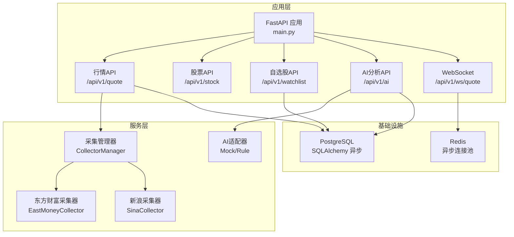

图表来源
- [backend/app/main.py:1-48](file://backend/app/main.py#L1-L48)
- [backend/app/api/v1/quote.py:1-65](file://backend/app/api/v1/quote.py#L1-L65)
- [backend/app/api/v1/stock.py:1-37](file://backend/app/api/v1/stock.py#L1-L37)
- [backend/app/api/v1/watchlist.py:1-77](file://backend/app/api/v1/watchlist.py#L1-L77)
- [backend/app/api/v1/ai.py:1-29](file://backend/app/api/v1/ai.py#L1-L29)
- [backend/app/api/websocket.py:1-79](file://backend/app/api/websocket.py#L1-L79)
- [backend/app/services/collector/manager.py:1-80](file://backend/app/services/collector/manager.py#L1-L80)
- [backend/app/services/collector/eastmoney.py:1-240](file://backend/app/services/collector/eastmoney.py#L1-L240)
- [backend/app/core/database.py:1-25](file://backend/app/core/database.py#L1-L25)
- [backend/app/core/redis.py:1-25](file://backend/app/core/redis.py#L1-L25)

## 详细组件分析

### 应用初始化与生命周期
- 使用lifespan在应用启动时初始化数据库元数据，在关闭时释放Redis连接。
- 注册CORS中间件，允许跨域访问。
- 路由前缀统一为/api/v1，包含行情、股票、自选股、AI分析与WebSocket。

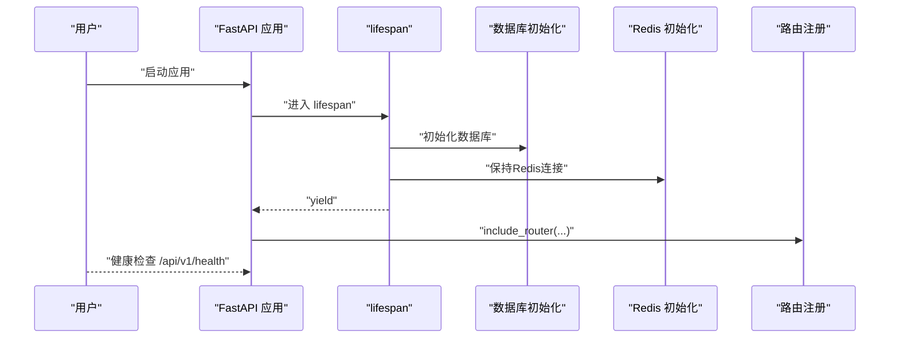

图表来源
- [backend/app/main.py:13-27](file://backend/app/main.py#L13-L27)
- [backend/app/main.py:38-48](file://backend/app/main.py#L38-L48)

章节来源
- [backend/app/main.py:1-48](file://backend/app/main.py#L1-L48)

### 配置中心
- 通过Settings从环境变量读取配置，使用lru_cache缓存以避免重复解析。
- 关键配置包括数据库URL、Redis URL、主/备数据源、AI适配器与服务地址、缓存TTL、限流、Celery、JWT等。

章节来源
- [backend/app/core/config.py:1-43](file://backend/app/core/config.py#L1-L43)

### 数据库与会话
- 异步引擎与session工厂，开启echo便于调试；expire_on_commit=False减少事务开销。
- 提供get_db依赖，确保每个请求内复用同一会话并在finally中关闭。
- init_db在应用启动时创建所有表。

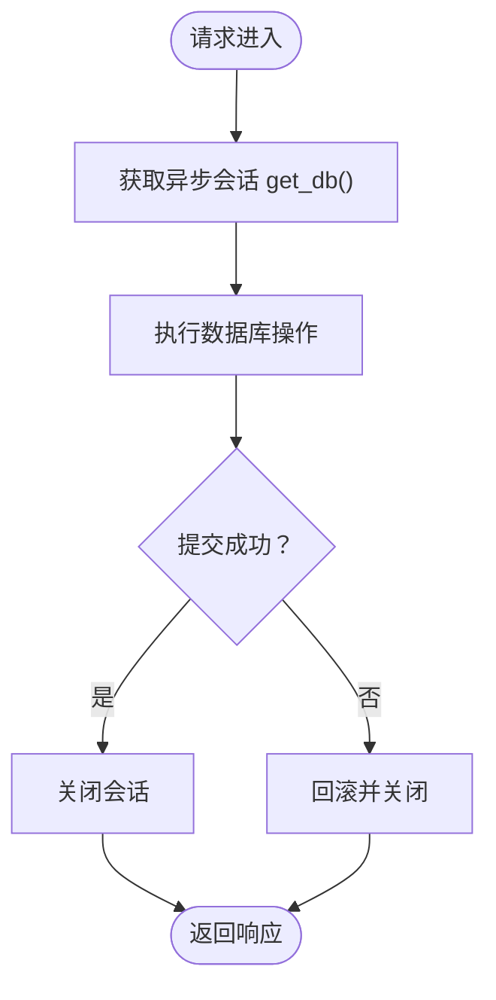

图表来源
- [backend/app/core/database.py:15-21](file://backend/app/core/database.py#L15-L21)
- [backend/app/core/database.py:23-25](file://backend/app/core/database.py#L23-L25)

章节来源
- [backend/app/core/database.py:1-25](file://backend/app/core/database.py#L1-L25)

### Redis缓存
- get_redis创建全局异步连接池；close_redis在应用关闭时释放。
- WebSocket模块通过Redis进行连接管理与消息广播（当前实现直接维护内存中的连接集合，未使用Redis发布订阅）。

章节来源
- [backend/app/core/redis.py:1-25](file://backend/app/core/redis.py#L1-L25)
- [backend/app/api/websocket.py:1-79](file://backend/app/api/websocket.py#L1-L79)

### 数据模型与Schema
- 模型：StockInfo、QuoteDaily、QuoteTick、Watchlist、AIAnalysisLog。
- Schema：统一响应体ResponseBase；行情相关QuoteItem/KlineItem/TimelinePoint/OrderBookLevel；自选股请求与排序；AI分析请求与响应。

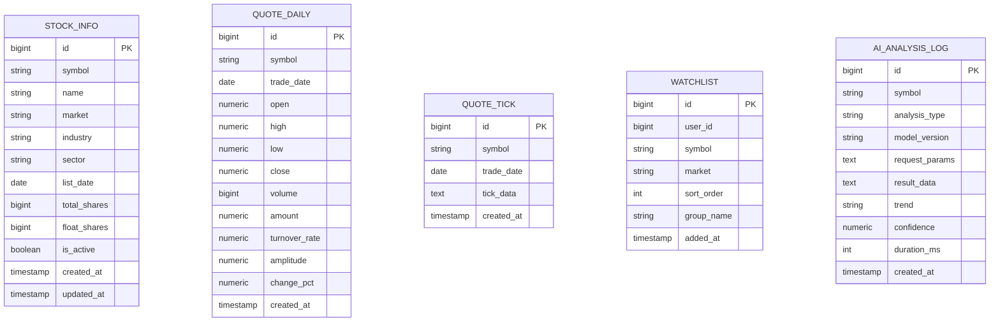

图表来源
- [backend/app/models/models.py:5-74](file://backend/app/models/models.py#L5-L74)

章节来源
- [backend/app/models/models.py:1-74](file://backend/app/models/models.py#L1-L74)
- [backend/app/schemas/schemas.py:1-103](file://backend/app/schemas/schemas.py#L1-L103)

### 行情数据API
- 实时行情：支持批量symbol查询，最多50个，逐个调用采集器并聚合返回。
- 行情列表：支持按市场、排序字段与方向、分页查询。
- K线、分时、盘口：分别返回对应数据结构，若采集失败返回统一错误码。

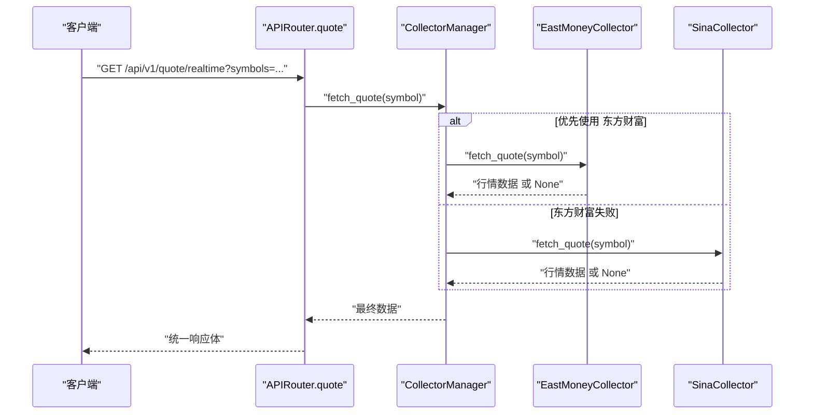

图表来源
- [backend/app/api/v1/quote.py:7-16](file://backend/app/api/v1/quote.py#L7-L16)
- [backend/app/services/collector/manager.py:21-32](file://backend/app/services/collector/manager.py#L21-L32)
- [backend/app/services/collector/eastmoney.py:23-37](file://backend/app/services/collector/eastmoney.py#L23-L37)

章节来源
- [backend/app/api/v1/quote.py:1-65](file://backend/app/api/v1/quote.py#L1-L65)
- [backend/app/services/collector/manager.py:1-80](file://backend/app/services/collector/manager.py#L1-L80)
- [backend/app/services/collector/base.py:1-45](file://backend/app/services/collector/base.py#L1-L45)
- [backend/app/services/collector/eastmoney.py:1-240](file://backend/app/services/collector/eastmoney.py#L1-L240)

### 股票信息API
- 提供股票搜索，调用东方财富建议接口，过滤A股并返回标准化结果。

章节来源
- [backend/app/api/v1/stock.py:1-37](file://backend/app/api/v1/stock.py#L1-L37)

### 自选股管理API
- 查询：按sort_order升序返回当前用户自选股。
- 新增：去重后插入，自动分配sort_order。
- 删除：按用户与symbol删除。
- 排序：批量更新sort_order。

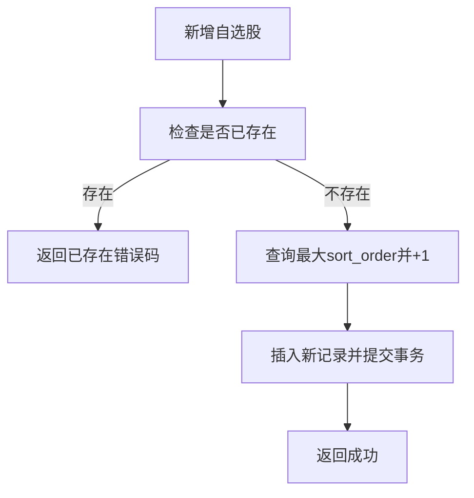

图表来源
- [backend/app/api/v1/watchlist.py:29-51](file://backend/app/api/v1/watchlist.py#L29-L51)

章节来源
- [backend/app/api/v1/watchlist.py:1-77](file://backend/app/api/v1/watchlist.py#L1-L77)
- [backend/app/core/database.py:15-21](file://backend/app/core/database.py#L15-L21)

### AI分析API
- 分析：根据配置选择适配器（默认mock），返回统一响应体。
- 历史：预留接口。
- 模型信息：返回当前适配器的模型信息。

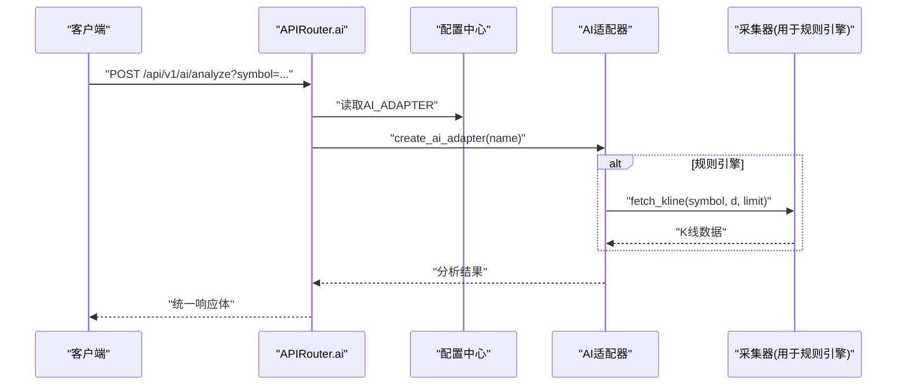

图表来源
- [backend/app/api/v1/ai.py:10-15](file://backend/app/api/v1/ai.py#L10-L15)
- [backend/app/ai/interface.py:190-196](file://backend/app/ai/interface.py#L190-L196)
- [backend/app/services/collector/manager.py:45-54](file://backend/app/services/collector/manager.py#L45-L54)

章节来源
- [backend/app/api/v1/ai.py:1-29](file://backend/app/api/v1/ai.py#L1-L29)
- [backend/app/ai/interface.py:1-196](file://backend/app/ai/interface.py#L1-L196)

### WebSocket实时推送
- 连接管理：维护活动连接与订阅集合，支持subscribe/unsubscribe/ping。
- 广播：根据订阅的symbol与channel向客户端发送行情更新。

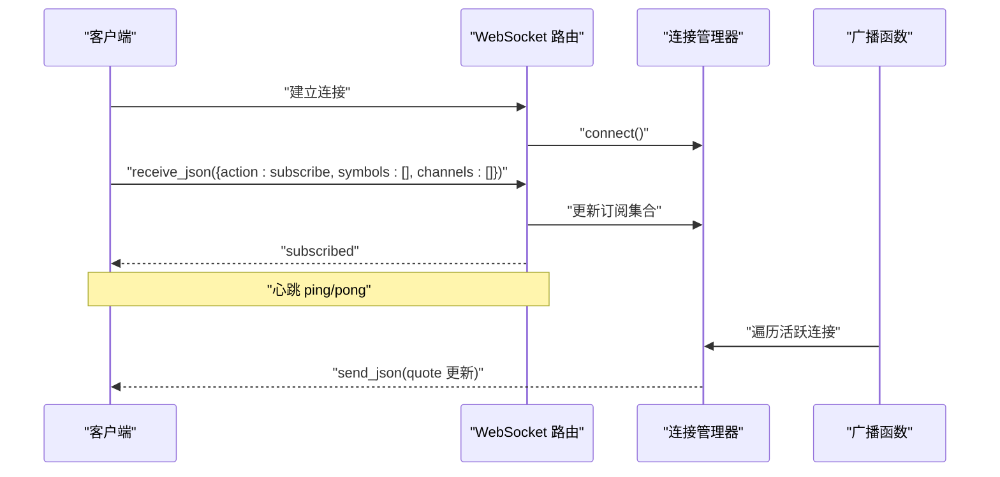

图表来源
- [backend/app/api/websocket.py:39-65](file://backend/app/api/websocket.py#L39-L65)
- [backend/app/api/websocket.py:67-79](file://backend/app/api/websocket.py#L67-L79)

章节来源
- [backend/app/api/websocket.py:1-79](file://backend/app/api/websocket.py#L1-L79)

### 采集器与回退机制
- 抽象基类定义统一接口。
- 采集管理器按优先级尝试不同数据源，失败自动切换，提升可用性。
- 东方财富采集器封装HTTP请求与字段映射。

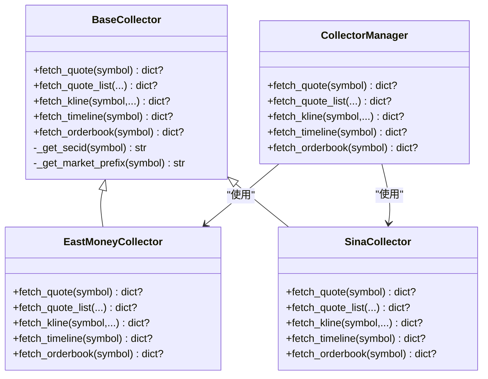

图表来源
- [backend/app/services/collector/base.py:5-45](file://backend/app/services/collector/base.py#L5-L45)
- [backend/app/services/collector/eastmoney.py:11-240](file://backend/app/services/collector/eastmoney.py#L11-L240)
- [backend/app/services/collector/manager.py:12-77](file://backend/app/services/collector/manager.py#L12-L77)

章节来源
- [backend/app/services/collector/base.py:1-45](file://backend/app/services/collector/base.py#L1-L45)
- [backend/app/services/collector/eastmoney.py:1-240](file://backend/app/services/collector/eastmoney.py#L1-L240)
- [backend/app/services/collector/manager.py:1-80](file://backend/app/services/collector/manager.py#L1-L80)

## 依赖分析
- 组件耦合：API层仅依赖服务层与基础设施；服务层依赖采集器抽象；AI适配器可插拔；WebSocket与Redis解耦。
- 外部依赖：FastAPI、SQLAlchemy异步、httpx、aioredis、Pydantic Settings。
- 循环依赖：未见循环导入；CollectorManager持有具体采集器实例，但通过接口解耦。

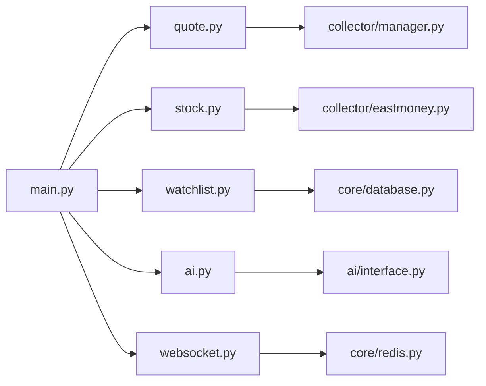

图表来源
- [backend/app/main.py:38-43](file://backend/app/main.py#L38-L43)
- [backend/app/api/v1/quote.py:1-65](file://backend/app/api/v1/quote.py#L1-L65)
- [backend/app/api/v1/stock.py:1-37](file://backend/app/api/v1/stock.py#L1-L37)
- [backend/app/api/v1/watchlist.py:1-77](file://backend/app/api/v1/watchlist.py#L1-L77)
- [backend/app/api/v1/ai.py:1-29](file://backend/app/api/v1/ai.py#L1-L29)
- [backend/app/api/websocket.py:1-79](file://backend/app/api/websocket.py#L1-L79)
- [backend/app/services/collector/manager.py:1-80](file://backend/app/services/collector/manager.py#L1-L80)
- [backend/app/services/collector/eastmoney.py:1-240](file://backend/app/services/collector/eastmoney.py#L1-L240)
- [backend/app/core/database.py:1-25](file://backend/app/core/database.py#L1-L25)
- [backend/app/core/redis.py:1-25](file://backend/app/core/redis.py#L1-L25)

章节来源
- [backend/app/main.py:1-48](file://backend/app/main.py#L1-L48)

## 性能考虑
- 异步I/O：数据库与HTTP请求均采用异步客户端，降低阻塞。
- 连接池：数据库连接池与Redis连接池复用连接，减少创建销毁开销。
- 采集回退：多数据源优先级与异常跳过，提高可用性。
- 缓存策略：配置中包含AI缓存开关与TTL，建议结合Redis对热点数据做缓存。
- 批量限制：实时行情最多50个symbol，避免过度并发。
- 事务控制：异步session在请求结束时关闭，避免长事务占用资源。

## 故障排查指南
- 健康检查：访问/api/v1/health确认应用存活。
- 数据库：检查DATABASE_URL与权限；确认init_db已执行且表存在。
- Redis：确认REDIS_URL可达；检查close_redis在应用关闭时被调用。
- 采集失败：查看CollectorManager日志，确认主/备数据源状态；检查网络与第三方接口稳定性。
- WebSocket：确认连接管理器订阅集合更新正确；排查send_json异常导致断连。
- AI分析：检查AI_ADAPTER配置与AI_SERVICE_URL；Mock适配器用于本地调试。

章节来源
- [backend/app/main.py:46-48](file://backend/app/main.py#L46-L48)
- [backend/app/core/config.py:12-27](file://backend/app/core/config.py#L12-L27)
- [backend/app/services/collector/manager.py:21-32](file://backend/app/services/collector/manager.py#L21-L32)
- [backend/app/api/websocket.py:29-34](file://backend/app/api/websocket.py#L29-L34)

## 结论
本项目以FastAPI为核心，采用异步编程范式，结合SQLAlchemy异步ORM与Redis，构建了高可用的A股行情与AI分析后端。通过抽象采集器与管理器实现数据源回退，通过统一Schema与响应体保证接口一致性，通过WebSocket提供实时推送能力。建议后续增强Redis缓存策略、完善AI服务集成与限流、补充单元测试与监控埋点。

## 附录
- 最佳实践清单
  - 使用Depends注入异步会话，确保事务边界清晰。
  - 在lifespan中集中初始化外部资源，避免重复创建。
  - 对外统一响应体与错误码，便于前端一致处理。
  - 对热点数据增加缓存与TTL，结合配置中心动态调整。
  - 采集器异常应记录日志并快速失败，避免阻塞主流程。
  - WebSocket消息发送失败应及时断开连接并清理订阅。