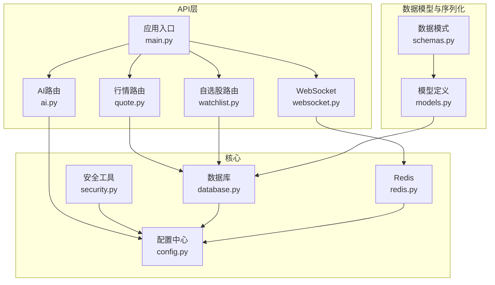
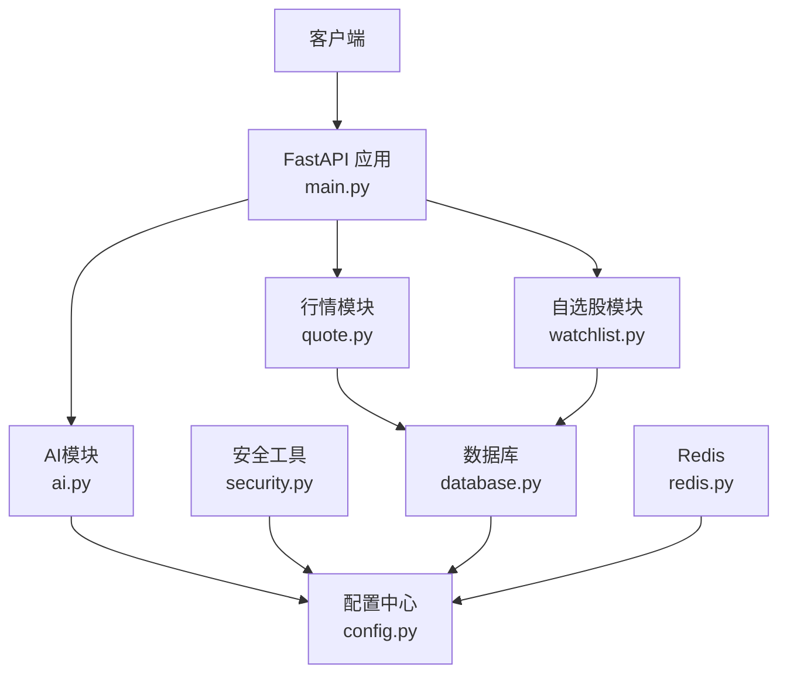
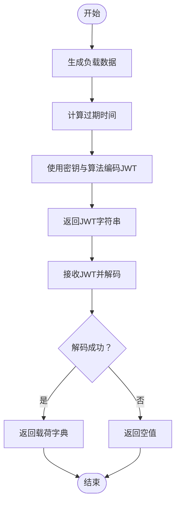
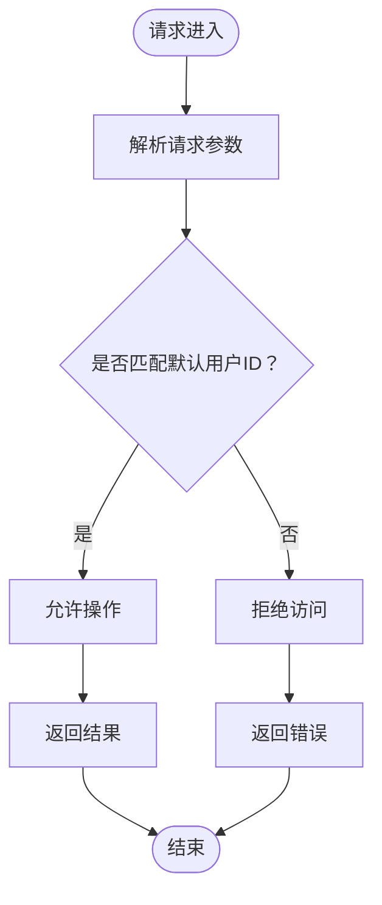
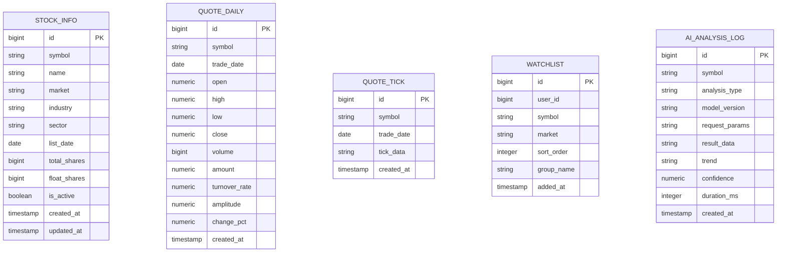
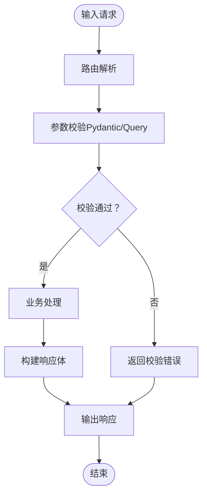
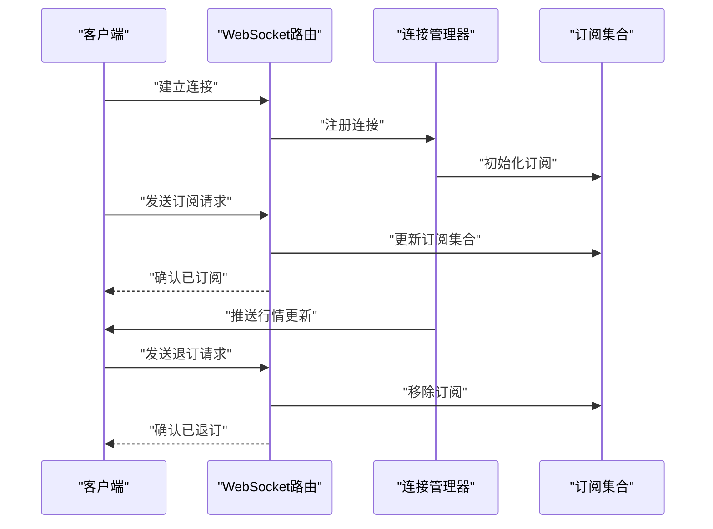
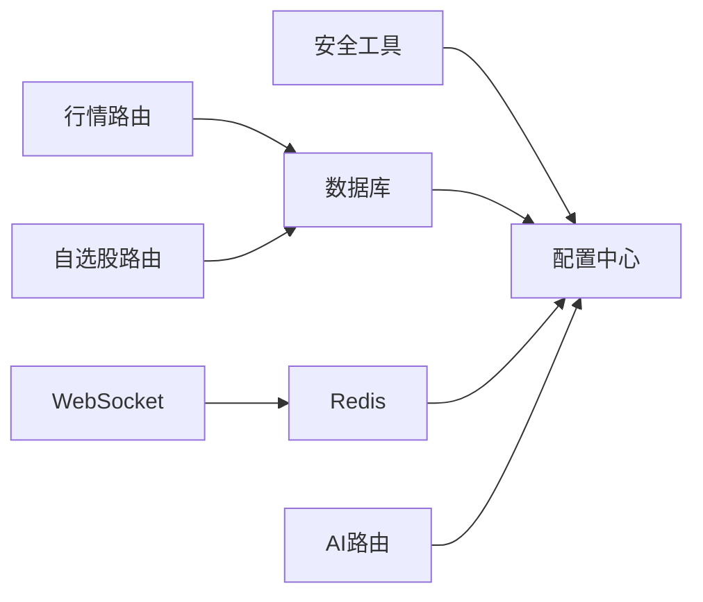

# 安全认证与权限控制

<cite>
**本文引用的文件**
- [backend/app/core/security.py](file://backend/app/core/security.py)
- [backend/app/core/config.py](file://backend/app/core/config.py)
- [backend/app/core/database.py](file://backend/app/core/database.py)
- [backend/app/core/redis.py](file://backend/app/core/redis.py)
- [backend/app/models/models.py](file://backend/app/models/models.py)
- [backend/app/schemas/schemas.py](file://backend/app/schemas/schemas.py)
- [backend/app/api/v1/watchlist.py](file://backend/app/api/v1/watchlist.py)
- [backend/app/api/v1/quote.py](file://backend/app/api/v1/quote.py)
- [backend/app/api/v1/ai.py](file://backend/app/api/v1/ai.py)
- [backend/app/api/websocket.py](file://backend/app/api/websocket.py)
- [backend/app/main.py](file://backend/app/main.py)
</cite>

## 目录
1. [简介](#简介)
2. [项目结构](#项目结构)
3. [核心组件](#核心组件)
4. [架构总览](#架构总览)
5. [详细组件分析](#详细组件分析)
6. [依赖分析](#依赖分析)
7. [性能考虑](#性能考虑)
8. [故障排查指南](#故障排查指南)
9. [结论](#结论)
10. [附录](#附录)

## 简介
本文件聚焦于后端的安全认证与权限控制体系，基于现有代码库进行深入解析。当前系统采用对称密钥的JWT令牌进行身份标识，并通过配置中心集中管理密钥与算法等安全参数；在数据访问层通过数据库连接池与异步会话确保资源可控；在API层面未发现显式的认证中间件或权限装饰器，但存在默认用户隔离策略与WebSocket连接管理。本文将围绕以下主题展开：JWT令牌管理、用户身份验证、访问权限控制、数据模型安全字段、输入验证规则、输出过滤机制、安全配置指南、自定义认证方式开发、权限扩展方法、安全最佳实践、漏洞防护措施与安全审计建议。

## 项目结构
后端采用FastAPI框架，按功能模块划分，核心安全相关模块集中在core目录，API路由位于api/v1，数据模型与序列化位于models与schemas，数据库与缓存连接由core子模块统一管理。

图表来源
- [backend/app/main.py:1-48](file://backend/app/main.py#L1-L48)
- [backend/app/api/v1/quote.py:1-65](file://backend/app/api/v1/quote.py#L1-L65)
- [backend/app/api/v1/watchlist.py:1-77](file://backend/app/api/v1/watchlist.py#L1-L77)
- [backend/app/api/v1/ai.py:1-29](file://backend/app/api/v1/ai.py#L1-L29)
- [backend/app/api/websocket.py:1-79](file://backend/app/api/websocket.py#L1-L79)
- [backend/app/core/config.py:1-43](file://backend/app/core/config.py#L1-L43)
- [backend/app/core/security.py:1-30](file://backend/app/core/security.py#L1-L30)
- [backend/app/core/database.py:1-25](file://backend/app/core/database.py#L1-L25)
- [backend/app/core/redis.py:1-25](file://backend/app/core/redis.py#L1-L25)
- [backend/app/models/models.py:1-74](file://backend/app/models/models.py#L1-L74)
- [backend/app/schemas/schemas.py:1-103](file://backend/app/schemas/schemas.py#L1-L103)

章节来源
- [backend/app/main.py:1-48](file://backend/app/main.py#L1-L48)
- [backend/app/core/config.py:1-43](file://backend/app/core/config.py#L1-L43)

## 核心组件
- 配置中心：集中管理JWT密钥、算法、过期时间、数据库URL、Redis URL等敏感参数，支持从环境变量加载。
- 安全工具：提供密码哈希与校验、JWT生成与解码能力。
- 数据库：异步引擎与会话管理，连接池参数可调。
- Redis：异步连接池封装，用于缓存与消息队列。
- 数据模型：定义业务实体及字段约束，含时间戳与布尔状态字段。
- 序列化模式：Pydantic模型定义API输入输出结构，具备基础字段校验。
- API路由：各功能模块路由，部分路由存在默认用户隔离逻辑。

章节来源
- [backend/app/core/config.py:1-43](file://backend/app/core/config.py#L1-L43)
- [backend/app/core/security.py:1-30](file://backend/app/core/security.py#L1-L30)
- [backend/app/core/database.py:1-25](file://backend/app/core/database.py#L1-L25)
- [backend/app/core/redis.py:1-25](file://backend/app/core/redis.py#L1-L25)
- [backend/app/models/models.py:1-74](file://backend/app/models/models.py#L1-L74)
- [backend/app/schemas/schemas.py:1-103](file://backend/app/schemas/schemas.py#L1-L103)

## 架构总览
系统采用“配置中心-安全工具-数据访问-API路由”的分层架构。JWT用于标识用户身份，数据库与Redis作为数据与缓存存储，API路由负责对外服务。当前未发现全局认证中间件或权限装饰器，但存在默认用户隔离策略与WebSocket连接管理。

图表来源
- [backend/app/main.py:1-48](file://backend/app/main.py#L1-L48)
- [backend/app/api/v1/quote.py:1-65](file://backend/app/api/v1/quote.py#L1-L65)
- [backend/app/api/v1/watchlist.py:1-77](file://backend/app/api/v1/watchlist.py#L1-L77)
- [backend/app/api/v1/ai.py:1-29](file://backend/app/api/v1/ai.py#L1-L29)
- [backend/app/core/security.py:1-30](file://backend/app/core/security.py#L1-L30)
- [backend/app/core/config.py:1-43](file://backend/app/core/config.py#L1-L43)
- [backend/app/core/database.py:1-25](file://backend/app/core/database.py#L1-L25)
- [backend/app/core/redis.py:1-25](file://backend/app/core/redis.py#L1-L25)

## 详细组件分析

### JWT令牌管理与用户身份验证
- 密钥与算法：配置中心集中定义JWT密钥、算法与过期时间，确保全局一致。
- 密码处理：使用BCrypt进行密码哈希与校验，避免明文存储。
- 令牌生成与解码：提供标准化的令牌编码与解码流程，异常捕获防止泄露细节。

图表来源
- [backend/app/core/security.py:18-30](file://backend/app/core/security.py#L18-L30)
- [backend/app/core/config.py:32-34](file://backend/app/core/config.py#L32-L34)

章节来源
- [backend/app/core/security.py:1-30](file://backend/app/core/security.py#L1-L30)
- [backend/app/core/config.py:1-43](file://backend/app/core/config.py#L1-L43)

### 访问权限控制与默认用户隔离
- 默认用户ID：自选股模块在多处使用默认用户ID进行数据隔离，避免跨用户访问。
- 权限边界：当前未发现全局权限装饰器或角色模型，权限控制以“默认用户ID”为边界实现。

图表来源
- [backend/app/api/v1/watchlist.py:10](file://backend/app/api/v1/watchlist.py#L10)
- [backend/app/api/v1/watchlist.py:13-26](file://backend/app/api/v1/watchlist.py#L13-L26)
- [backend/app/api/v1/watchlist.py:29-51](file://backend/app/api/v1/watchlist.py#L29-L51)
- [backend/app/api/v1/watchlist.py:54-61](file://backend/app/api/v1/watchlist.py#L54-L61)
- [backend/app/api/v1/watchlist.py:64-77](file://backend/app/api/v1/watchlist.py#L64-L77)

章节来源
- [backend/app/api/v1/watchlist.py:1-77](file://backend/app/api/v1/watchlist.py#L1-L77)

### 数据模型中的安全字段
- 时间戳字段：自动记录创建与更新时间，便于审计与追踪。
- 布尔状态字段：如活跃状态，可用于快速禁用或启用记录。
- JSON字段：用于存储结构化数据，需注意外部注入风险与大小限制。

图表来源
- [backend/app/models/models.py:5-74](file://backend/app/models/models.py#L5-L74)

章节来源
- [backend/app/models/models.py:1-74](file://backend/app/models/models.py#L1-L74)

### 输入验证规则与输出过滤机制
- 输入验证：API路由与Pydantic模式共同完成输入校验，如查询参数范围、必填项、格式约束等。
- 输出过滤：统一响应基类包含状态码与消息字段，便于标准化输出与错误传播。

图表来源
- [backend/app/api/v1/quote.py:7-65](file://backend/app/api/v1/quote.py#L7-L65)
- [backend/app/schemas/schemas.py:6-103](file://backend/app/schemas/schemas.py#L6-L103)

章节来源
- [backend/app/api/v1/quote.py:1-65](file://backend/app/api/v1/quote.py#L1-L65)
- [backend/app/schemas/schemas.py:1-103](file://backend/app/schemas/schemas.py#L1-L103)

### WebSocket连接与订阅管理
- 连接管理：维护活动连接与订阅集合，支持订阅/退订与心跳响应。
- 广播机制：根据订阅关系向客户端推送行情更新，异常断连自动清理。

图表来源
- [backend/app/api/websocket.py:12-79](file://backend/app/api/websocket.py#L12-L79)

章节来源
- [backend/app/api/websocket.py:1-79](file://backend/app/api/websocket.py#L1-L79)

## 依赖分析
- 组件耦合：安全工具依赖配置中心；数据库与Redis均依赖配置中心；API路由依赖数据库或配置；WebSocket依赖Redis连接池。
- 外部依赖：JWT签名库、密码哈希库、SQLAlchemy异步引擎、Redis异步客户端、FastAPI。

图表来源
- [backend/app/core/config.py:1-43](file://backend/app/core/config.py#L1-L43)
- [backend/app/core/security.py:1-30](file://backend/app/core/security.py#L1-L30)
- [backend/app/core/database.py:1-25](file://backend/app/core/database.py#L1-L25)
- [backend/app/core/redis.py:1-25](file://backend/app/core/redis.py#L1-L25)
- [backend/app/api/v1/quote.py:1-65](file://backend/app/api/v1/quote.py#L1-L65)
- [backend/app/api/v1/watchlist.py:1-77](file://backend/app/api/v1/watchlist.py#L1-L77)
- [backend/app/api/v1/ai.py:1-29](file://backend/app/api/v1/ai.py#L1-L29)
- [backend/app/api/websocket.py:1-79](file://backend/app/api/websocket.py#L1-L79)

章节来源
- [backend/app/core/config.py:1-43](file://backend/app/core/config.py#L1-L43)
- [backend/app/core/security.py:1-30](file://backend/app/core/security.py#L1-L30)
- [backend/app/core/database.py:1-25](file://backend/app/core/database.py#L1-L25)
- [backend/app/core/redis.py:1-25](file://backend/app/core/redis.py#L1-L25)
- [backend/app/api/v1/quote.py:1-65](file://backend/app/api/v1/quote.py#L1-L65)
- [backend/app/api/v1/watchlist.py:1-77](file://backend/app/api/v1/watchlist.py#L1-L77)
- [backend/app/api/v1/ai.py:1-29](file://backend/app/api/v1/ai.py#L1-L29)
- [backend/app/api/websocket.py:1-79](file://backend/app/api/websocket.py#L1-L79)

## 性能考虑
- 连接池：数据库连接池参数可调，建议结合并发与QPS评估合理设置。
- 异步I/O：数据库与Redis均为异步客户端，减少阻塞，提升吞吐。
- 缓存策略：Redis用于缓存与消息队列，建议结合TTL与淘汰策略优化内存占用。
- JWT开销：对称算法签名/验签性能较高，注意密钥长度与算法选择。

## 故障排查指南
- JWT解码失败：检查密钥、算法与过期时间配置，确认客户端传递的令牌有效。
- 数据库连接异常：检查连接URL、池大小与超时设置，观察连接泄漏。
- Redis连接异常：检查URL格式与网络连通性，关注连接池生命周期。
- WebSocket断连：检查订阅集合与异常处理，确保断连后及时清理。

章节来源
- [backend/app/core/security.py:25-30](file://backend/app/core/security.py#L25-L30)
- [backend/app/core/database.py:7-20](file://backend/app/core/database.py#L7-L20)
- [backend/app/core/redis.py:10-25](file://backend/app/core/redis.py#L10-L25)
- [backend/app/api/websocket.py:29-34](file://backend/app/api/websocket.py#L29-L34)

## 结论
当前系统在安全方面具备基础能力：对称JWT、BCrypt密码处理、配置中心集中管理、异步数据访问与WebSocket连接管理。但在认证与权限控制方面尚未实现全局中间件与细粒度权限模型，建议后续引入认证中间件、角色与资源权限模型、细粒度授权策略以及更完善的审计与监控机制。

## 附录

### 安全配置指南
- 密钥与算法：生产环境务必使用强随机密钥与安全算法，定期轮换。
- 过期时间：根据业务场景设置合理的过期时间，短令牌配合刷新机制。
- 环境变量：通过环境变量注入敏感配置，避免硬编码。
- CORS策略：生产环境限制允许的源、方法与头，避免通配符暴露。

章节来源
- [backend/app/core/config.py:32-34](file://backend/app/core/config.py#L32-L34)
- [backend/app/main.py:29-36](file://backend/app/main.py#L29-L36)

### 自定义认证方式开发
- 认证中间件：在应用启动时注册认证中间件，拦截请求并解析令牌。
- 用户上下文：将用户标识注入请求上下文，供路由与服务层使用。
- 登出与刷新：实现令牌黑名单与刷新令牌机制，保障会话安全。

### 权限扩展方法
- 角色模型：引入用户角色与资源权限映射，实现RBAC。
- 资源隔离：基于用户ID或租户ID进行数据隔离，避免越权访问。
- 动态授权：结合业务规则与策略引擎，动态判断访问权限。

### 安全最佳实践
- 最小权限原则：仅授予完成任务所需的最小权限。
- 输入验证：严格校验所有输入，防止注入与越界。
- 输出过滤：统一响应结构，避免敏感信息泄露。
- 审计日志：记录关键操作与异常事件，便于追溯。

### 漏洞防护措施
- 注入攻击：参数绑定与ORM查询，避免拼接SQL。
- 会话劫持：短令牌、HTTPS传输、安全Cookie属性。
- CSRF防护：同源策略与CSRF令牌，限制跨站请求。
- XSS防护：内容转义与CSP策略，限制脚本执行。

### 安全审计建议
- 定期扫描：对依赖库进行漏洞扫描与升级。
- 日志审计：记录登录、授权与敏感操作日志。
- 权限审查：定期审查角色与权限分配，清理无效权限。
- 渗透测试：模拟攻击评估系统安全性，修复高危问题。