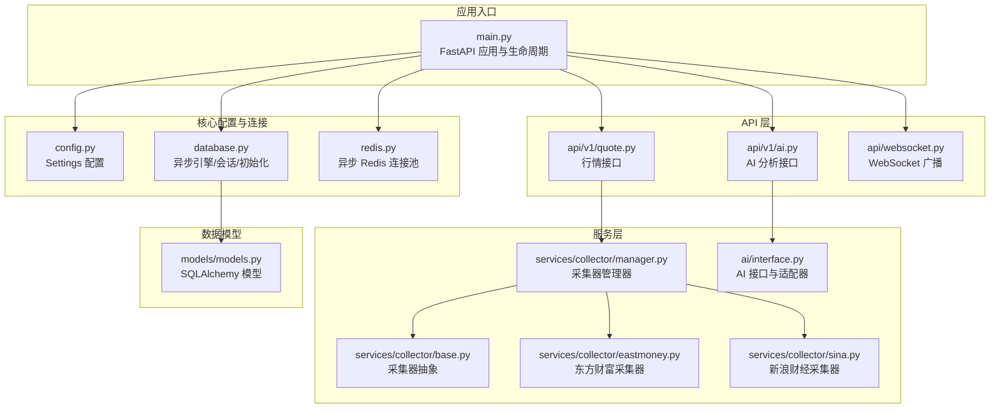
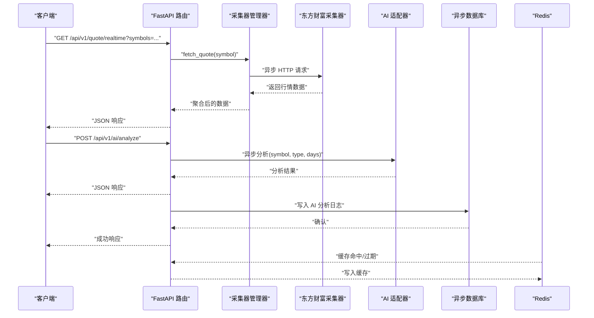
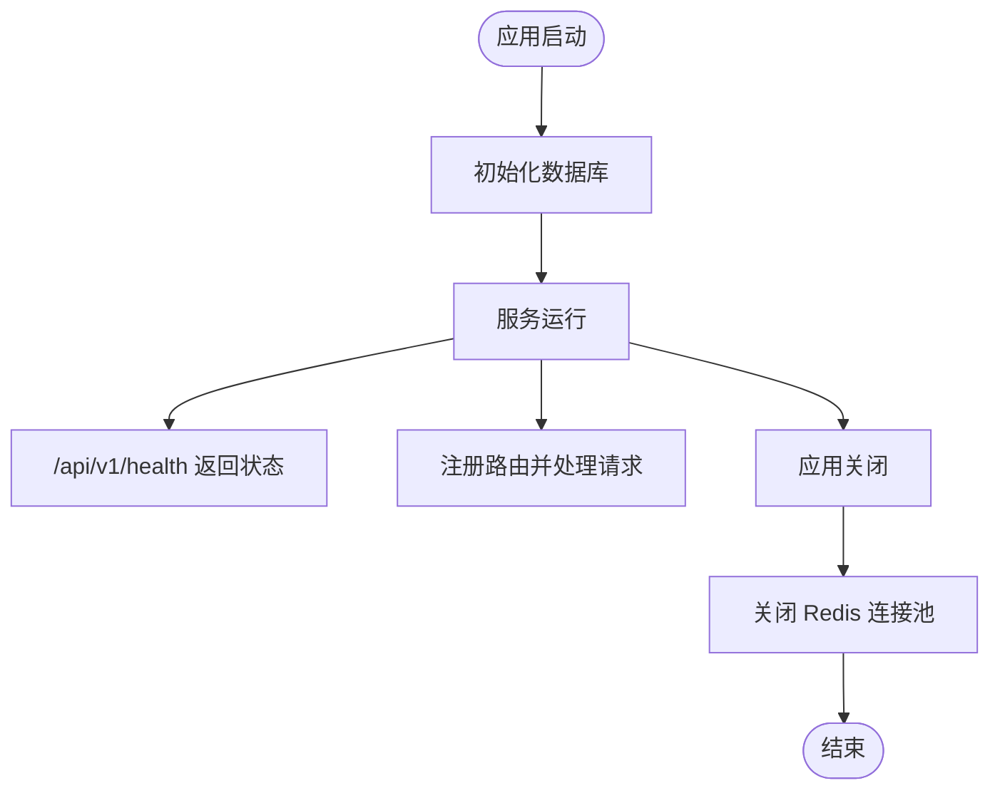
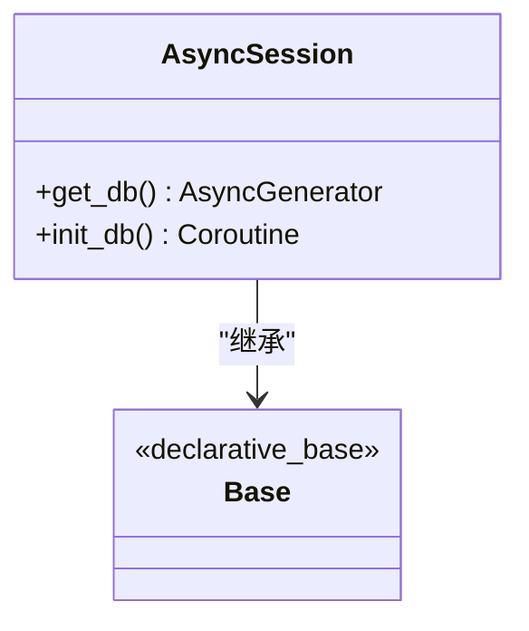
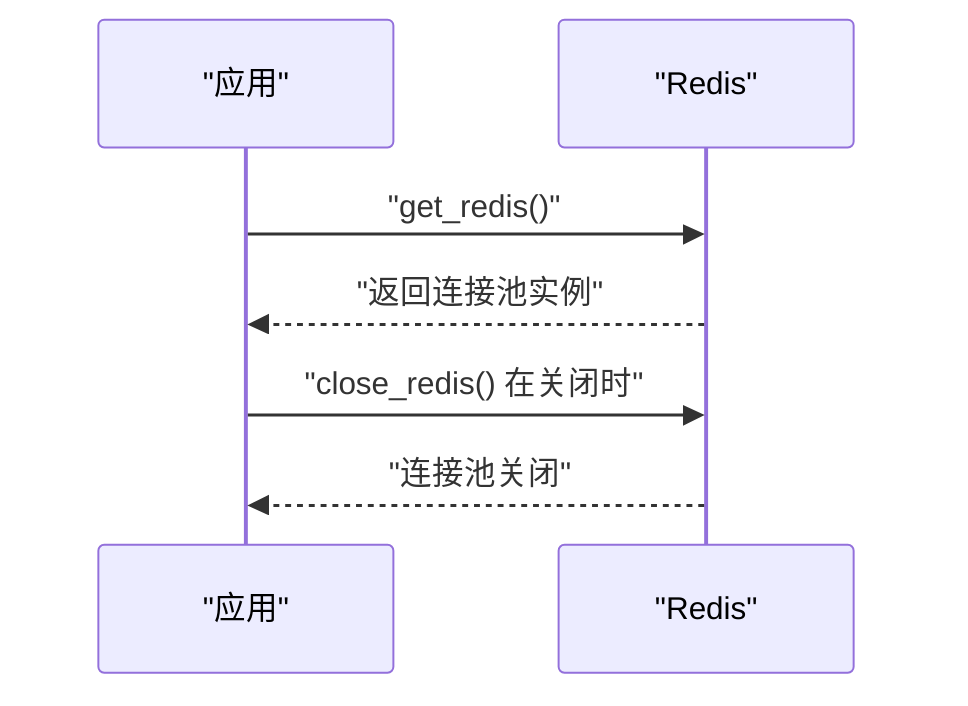
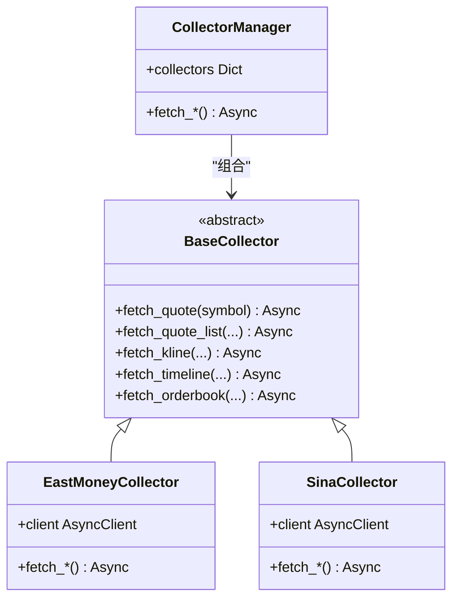
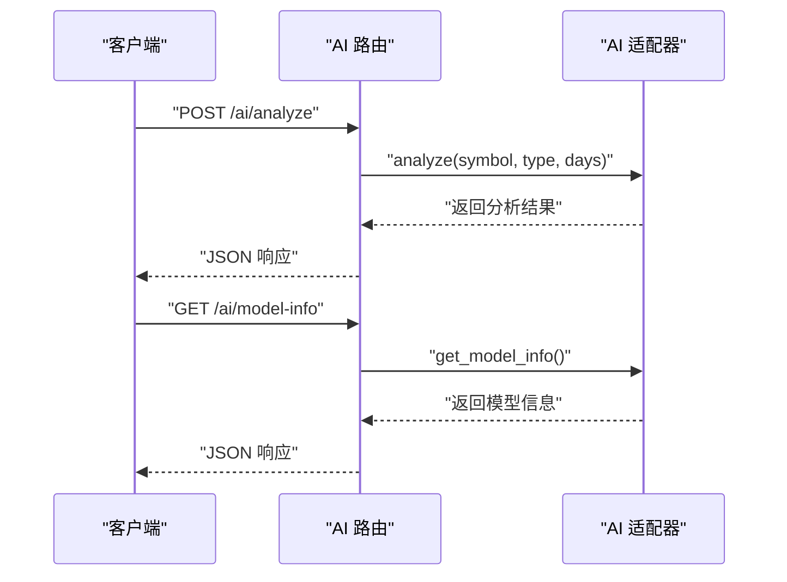
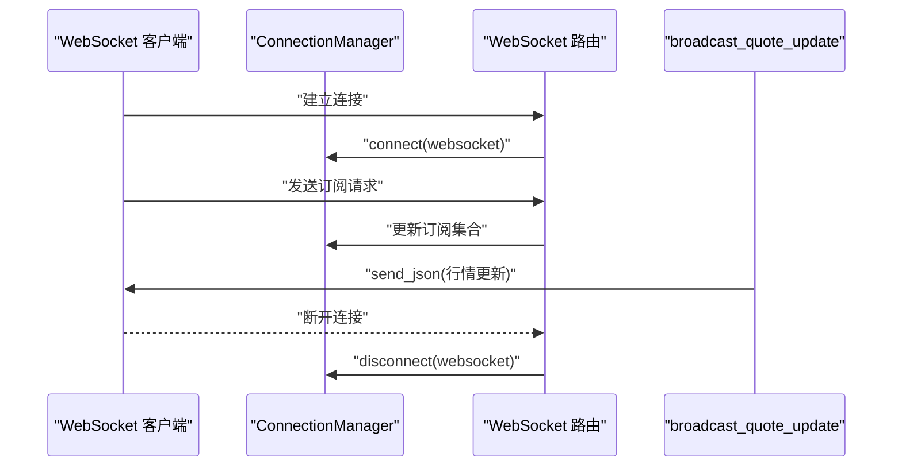
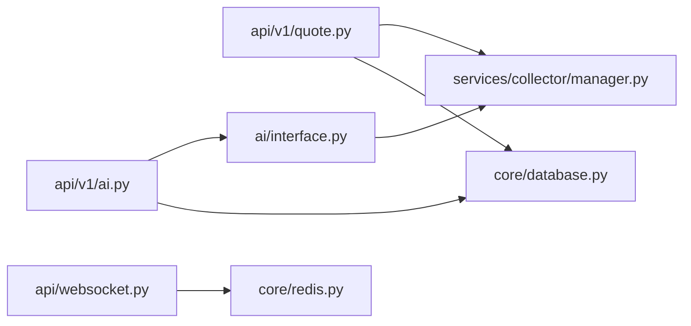

# 异步编程与并发处理

<cite>
**本文引用的文件**
- [backend/app/main.py](file://backend/app/main.py)
- [backend/app/core/database.py](file://backend/app/core/database.py)
- [backend/app/core/redis.py](file://backend/app/core/redis.py)
- [backend/app/core/config.py](file://backend/app/core/config.py)
- [backend/app/api/v1/quote.py](file://backend/app/api/v1/quote.py)
- [backend/app/api/v1/ai.py](file://backend/app/api/v1/ai.py)
- [backend/app/api/websocket.py](file://backend/app/api/websocket.py)
- [backend/app/services/collector/manager.py](file://backend/app/services/collector/manager.py)
- [backend/app/services/collector/base.py](file://backend/app/services/collector/base.py)
- [backend/app/services/collector/eastmoney.py](file://backend/app/services/collector/eastmoney.py)
- [backend/app/services/collector/sina.py](file://backend/app/services/collector/sina.py)
- [backend/app/ai/interface.py](file://backend/app/ai/interface.py)
- [backend/app/models/models.py](file://backend/app/models/models.py)
</cite>

## 目录
1. [引言](#引言)
2. [项目结构](#项目结构)
3. [核心组件](#核心组件)
4. [架构总览](#架构总览)
5. [详细组件分析](#详细组件分析)
6. [依赖分析](#依赖分析)
7. [性能考量](#性能考量)
8. [故障排查指南](#故障排查指南)
9. [结论](#结论)
10. [附录](#附录)

## 引言
本文件围绕 Stock-View 项目的异步编程与并发处理展开，系统梳理 FastAPI 异步路由、异步数据库与 Redis 访问、异步数据采集与 AI 分析、WebSocket 广播、以及异步上下文生命周期管理等关键技术点。文档同时总结异步 I/O 在高并发场景下的优势、最佳实践（错误处理、超时控制、资源清理、性能监控）、异步测试与调试方法，并给出可操作的优化建议。

## 项目结构
后端采用 FastAPI 应用，按功能模块组织：核心配置与连接、API 路由、服务层（采集器与 AI 适配器）、WebSocket 广播、数据库模型与会话管理。异步贯穿于路由处理、HTTP 客户端调用、数据库会话、Redis 连接池、WebSocket 通信与 AI 流式分析。

图表来源
- [backend/app/main.py:1-48](file://backend/app/main.py#L1-L48)
- [backend/app/core/config.py:1-43](file://backend/app/core/config.py#L1-L43)
- [backend/app/core/database.py:1-25](file://backend/app/core/database.py#L1-L25)
- [backend/app/core/redis.py:1-25](file://backend/app/core/redis.py#L1-L25)
- [backend/app/api/v1/quote.py:1-65](file://backend/app/api/v1/quote.py#L1-L65)
- [backend/app/api/v1/ai.py:1-29](file://backend/app/api/v1/ai.py#L1-L29)
- [backend/app/api/websocket.py:1-79](file://backend/app/api/websocket.py#L1-L79)
- [backend/app/services/collector/manager.py:1-80](file://backend/app/services/collector/manager.py#L1-L80)
- [backend/app/services/collector/base.py:1-45](file://backend/app/services/collector/base.py#L1-L45)
- [backend/app/services/collector/eastmoney.py:1-240](file://backend/app/services/collector/eastmoney.py#L1-L240)
- [backend/app/services/collector/sina.py:1-79](file://backend/app/services/collector/sina.py#L1-L79)
- [backend/app/ai/interface.py:1-196](file://backend/app/ai/interface.py#L1-L196)
- [backend/app/models/models.py:1-74](file://backend/app/models/models.py#L1-L74)

章节来源
- [backend/app/main.py:1-48](file://backend/app/main.py#L1-L48)
- [backend/app/core/config.py:1-43](file://backend/app/core/config.py#L1-L43)

## 核心组件
- FastAPI 异步路由与生命周期
  - 使用异步上下文管理器定义应用生命周期，在启动阶段初始化数据库，在关闭阶段释放 Redis 连接池。
  - 路由函数均为 async def，统一采用异步处理，便于与异步数据库、Redis、HTTP 客户端协作。
- 异步数据库访问
  - 使用 SQLAlchemy 2.x 的异步引擎与异步会话工厂，通过依赖注入提供会话；会话在 try/finally 中确保关闭。
  - 初始化元数据在应用启动时完成，避免重复建表。
- 异步 Redis 访问
  - 使用 aioredis 创建全局连接池，提供异步获取与关闭方法，减少连接开销。
- 异步数据采集与故障转移
  - 采集器抽象定义统一异步接口；管理器按优先级尝试多个数据源，失败自动切换，增强可用性。
  - 采集器内部使用 httpx.AsyncClient 发起异步 HTTP 请求，设置合理超时。
- 异步 AI 分析与流式输出
  - AI 接口定义异步分析与流式分析方法；Mock 与规则引擎适配器均实现异步逻辑；流式分析通过异步生成器逐步产出进度与结果。
- WebSocket 广播
  - 维护活动连接与订阅集合，异步发送消息；对发送异常进行断连清理，保证连接健康。

章节来源
- [backend/app/main.py:13-27](file://backend/app/main.py#L13-L27)
- [backend/app/core/database.py:15-25](file://backend/app/core/database.py#L15-L25)
- [backend/app/core/redis.py:10-25](file://backend/app/core/redis.py#L10-L25)
- [backend/app/services/collector/manager.py:21-76](file://backend/app/services/collector/manager.py#L21-L76)
- [backend/app/services/collector/base.py:9-34](file://backend/app/services/collector/base.py#L9-L34)
- [backend/app/ai/interface.py:26-39](file://backend/app/ai/interface.py#L26-L39)
- [backend/app/api/websocket.py:12-79](file://backend/app/api/websocket.py#L12-L79)

## 架构总览
下图展示异步编程在 Stock-View 中的关键交互路径：FastAPI 路由触发异步处理，数据采集器通过异步 HTTP 客户端访问外部数据源，AI 适配器执行异步分析，Redis 用于缓存与广播通道，数据库用于持久化。

图表来源
- [backend/app/api/v1/quote.py:8-16](file://backend/app/api/v1/quote.py#L8-L16)
- [backend/app/services/collector/manager.py:21-32](file://backend/app/services/collector/manager.py#L21-L32)
- [backend/app/services/collector/eastmoney.py:23-37](file://backend/app/services/collector/eastmoney.py#L23-L37)
- [backend/app/api/v1/ai.py:11-15](file://backend/app/api/v1/ai.py#L11-L15)
- [backend/app/ai/interface.py:45-87](file://backend/app/ai/interface.py#L45-L87)
- [backend/app/core/database.py:15-20](file://backend/app/core/database.py#L15-L20)
- [backend/app/core/redis.py:10-18](file://backend/app/core/redis.py#L10-L18)

## 详细组件分析

### FastAPI 异步路由与生命周期
- 异步上下文管理器 lifespan 负责应用启动与关闭阶段的资源初始化与释放。
- 路由注册统一使用异步 APIRouter，接口函数为 async def，便于与异步依赖协作。
- 健康检查接口返回版本信息，验证异步路由可用性。

图表来源
- [backend/app/main.py:13-27](file://backend/app/main.py#L13-L27)
- [backend/app/main.py:46-48](file://backend/app/main.py#L46-L48)

章节来源
- [backend/app/main.py:13-27](file://backend/app/main.py#L13-L27)
- [backend/app/main.py:46-48](file://backend/app/main.py#L46-L48)

### 异步数据库与会话管理
- 异步引擎与会话工厂配置连接池参数，满足高并发场景。
- 依赖注入提供异步会话，try/finally 确保会话关闭，避免连接泄漏。
- 应用启动时创建所有表，避免运行时动态建表带来的延迟。

图表来源
- [backend/app/core/database.py:15-25](file://backend/app/core/database.py#L15-L25)
- [backend/app/models/models.py:5-74](file://backend/app/models/models.py#L5-L74)

章节来源
- [backend/app/core/database.py:1-25](file://backend/app/core/database.py#L1-L25)
- [backend/app/models/models.py:1-74](file://backend/app/models/models.py#L1-L74)

### 异步 Redis 连接池
- 全局连接池在首次使用时创建，后续复用以降低连接成本。
- 提供关闭方法在应用生命周期末尾释放资源。

图表来源
- [backend/app/core/redis.py:10-25](file://backend/app/core/redis.py#L10-L25)

章节来源
- [backend/app/core/redis.py:1-25](file://backend/app/core/redis.py#L1-L25)

### 异步数据采集与故障转移
- 采集器抽象定义统一异步接口，具体实现（东方财富、新浪财经）均采用 httpx.AsyncClient 发起异步请求。
- 管理器按优先级尝试多个数据源，捕获异常并记录日志，失败则切换下一个数据源，最终返回 None 或有效数据。

图表来源
- [backend/app/services/collector/base.py:5-45](file://backend/app/services/collector/base.py#L5-L45)
- [backend/app/services/collector/eastmoney.py:11-240](file://backend/app/services/collector/eastmoney.py#L11-L240)
- [backend/app/services/collector/sina.py:10-79](file://backend/app/services/collector/sina.py#L10-L79)
- [backend/app/services/collector/manager.py:12-80](file://backend/app/services/collector/manager.py#L12-L80)

章节来源
- [backend/app/services/collector/base.py:1-45](file://backend/app/services/collector/base.py#L1-L45)
- [backend/app/services/collector/eastmoney.py:1-240](file://backend/app/services/collector/eastmoney.py#L1-L240)
- [backend/app/services/collector/sina.py:1-79](file://backend/app/services/collector/sina.py#L1-L79)
- [backend/app/services/collector/manager.py:1-80](file://backend/app/services/collector/manager.py#L1-L80)

### 异步 AI 分析与流式输出
- AI 接口定义异步分析与流式分析方法；Mock 适配器返回模拟结果并支持异步生成器逐步产出进度与最终结果。
- 规则引擎适配器通过采集器获取 K 线数据，基于规则计算趋势与置信度，同样提供异步生成器支持流式分析。

图表来源
- [backend/app/api/v1/ai.py:11-29](file://backend/app/api/v1/ai.py#L11-L29)
- [backend/app/ai/interface.py:45-108](file://backend/app/ai/interface.py#L45-L108)
- [backend/app/ai/interface.py:114-178](file://backend/app/ai/interface.py#L114-L178)

章节来源
- [backend/app/api/v1/ai.py:1-29](file://backend/app/api/v1/ai.py#L1-L29)
- [backend/app/ai/interface.py:1-196](file://backend/app/ai/interface.py#L1-L196)

### WebSocket 广播与连接管理
- 连接管理器维护活动连接与订阅集合，异步接受与发送消息。
- 广播函数遍历订阅指定股票的连接，异步发送行情更新；对发送异常进行断连清理，保持连接健康。

图表来源
- [backend/app/api/websocket.py:12-79](file://backend/app/api/websocket.py#L12-L79)

章节来源
- [backend/app/api/websocket.py:1-79](file://backend/app/api/websocket.py#L1-L79)

### 异步 I/O 在高并发场景的优势
- 事件循环与非阻塞 I/O：异步 HTTP 客户端与数据库驱动在等待网络/磁盘 IO 时让出控制权，提高吞吐。
- 内存效率：协程栈轻量，大量并发连接共享少量内存。
- 资源复用：连接池与全局 Redis 连接池减少频繁创建销毁的开销。

## 依赖分析
- 组件耦合与内聚
  - API 层仅依赖服务层抽象，耦合度低，便于替换与扩展。
  - 采集器管理器通过组合多个采集器实现高可用，内聚于故障转移逻辑。
  - AI 适配器与采集器解耦，可通过配置切换不同实现。
- 外部依赖
  - httpx.AsyncClient 作为异步 HTTP 客户端，需合理设置超时与重试策略。
  - SQLAlchemy 2.x 异步引擎与 aioredis 提供异步能力，注意连接池大小与超时配置。
- 可能的循环依赖
  - 未发现直接循环导入；AI 适配器在需要时才导入采集器管理器，避免静态循环。

图表来源
- [backend/app/api/v1/quote.py:1-65](file://backend/app/api/v1/quote.py#L1-L65)
- [backend/app/api/v1/ai.py:1-29](file://backend/app/api/v1/ai.py#L1-L29)
- [backend/app/ai/interface.py:115-116](file://backend/app/ai/interface.py#L115-L116)
- [backend/app/api/websocket.py:1-79](file://backend/app/api/websocket.py#L1-79)
- [backend/app/core/database.py:1-25](file://backend/app/core/database.py#L1-L25)
- [backend/app/core/redis.py:1-25](file://backend/app/core/redis.py#L1-L25)

章节来源
- [backend/app/api/v1/quote.py:1-65](file://backend/app/api/v1/quote.py#L1-L65)
- [backend/app/api/v1/ai.py:1-29](file://backend/app/api/v1/ai.py#L1-L29)
- [backend/app/ai/interface.py:114-116](file://backend/app/ai/interface.py#L114-L116)
- [backend/app/api/websocket.py:1-79](file://backend/app/api/websocket.py#L1-L79)
- [backend/app/core/database.py:1-25](file://backend/app/core/database.py#L1-L25)
- [backend/app/core/redis.py:1-25](file://backend/app/core/redis.py#L1-L25)

## 性能考量
- 连接池与超时
  - 数据库连接池参数已在异步会话工厂中配置；建议结合实际并发与查询复杂度调整。
  - httpx.AsyncClient 已设置超时，采集器与 AI 分析应遵循统一的超时策略，避免请求堆积。
- 缓存与降级
  - Redis 用于缓存热点数据与广播通道；建议为高频接口设置 TTL 与命中率监控。
  - 采集器管理器已实现故障转移，建议增加熔断与快速失败策略。
- 并发控制
  - 对外部接口调用可引入信号量限制并发数，避免被限流或压垮上游。
- 监控与可观测性
  - 记录关键耗时指标（采集耗时、AI 分析耗时、数据库写入耗时），结合日志与指标系统定位瓶颈。

## 故障排查指南
- 异常处理
  - 采集器与 AI 适配器在异常时返回 None 或抛出异常，上层应判断返回值并返回统一错误码。
  - WebSocket 发送异常时断开连接，确保连接池健康。
- 超时与重试
  - 为外部 HTTP 请求设置合理超时；对可重试的错误（如网络抖动）实施指数退避重试。
- 资源清理
  - 确保异步会话与 Redis 连接在 finally 中关闭；应用关闭时调用关闭钩子。
- 日志与追踪
  - 为每个请求生成唯一 ID，串联日志链路；对慢查询与慢接口进行告警。

章节来源
- [backend/app/services/collector/manager.py:28-31](file://backend/app/services/collector/manager.py#L28-L31)
- [backend/app/api/websocket.py:30-34](file://backend/app/api/websocket.py#L30-L34)
- [backend/app/services/collector/eastmoney.py:35-37](file://backend/app/services/collector/eastmoney.py#L35-L37)
- [backend/app/ai/interface.py:89-99](file://backend/app/ai/interface.py#L89-L99)

## 结论
Stock-View 项目在 FastAPI 生态中完整实现了异步编程范式：从应用生命周期、数据库与 Redis 访问，到数据采集、AI 分析与 WebSocket 广播，均采用 async/await 与异步 I/O，显著提升了高并发场景下的吞吐与资源利用率。通过合理的异常处理、超时控制、资源清理与监控策略，可进一步提升系统的稳定性与可维护性。

## 附录
- 异步测试方法
  - 使用 pytest-asyncio 运行异步测试；对路由、服务与工具函数分别编写单元测试。
  - 对异步数据库与 Redis 操作使用临时数据库与容器化 Redis 进行集成测试。
- 调试技巧
  - 利用日志与结构化日志（含请求 ID）定位问题；对异步栈进行采样与分析。
  - 使用性能剖析工具（如 uvprof）识别热点协程与阻塞点。
- 性能优化建议
  - 合理设置连接池大小与超时；对外部接口引入并发限制与熔断。
  - 对热点数据启用缓存与预热；对数据库查询添加索引与分页。
  - 将 CPU 密集型任务迁移到进程池或专用服务，避免阻塞事件循环。