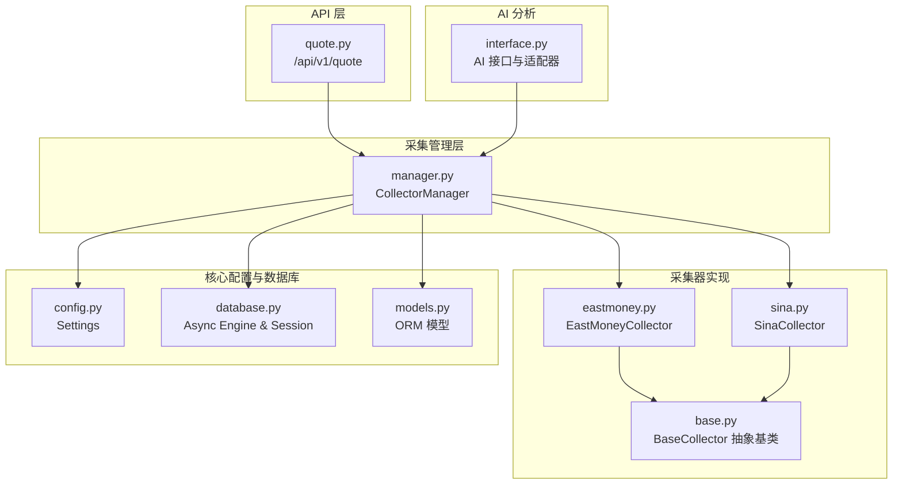
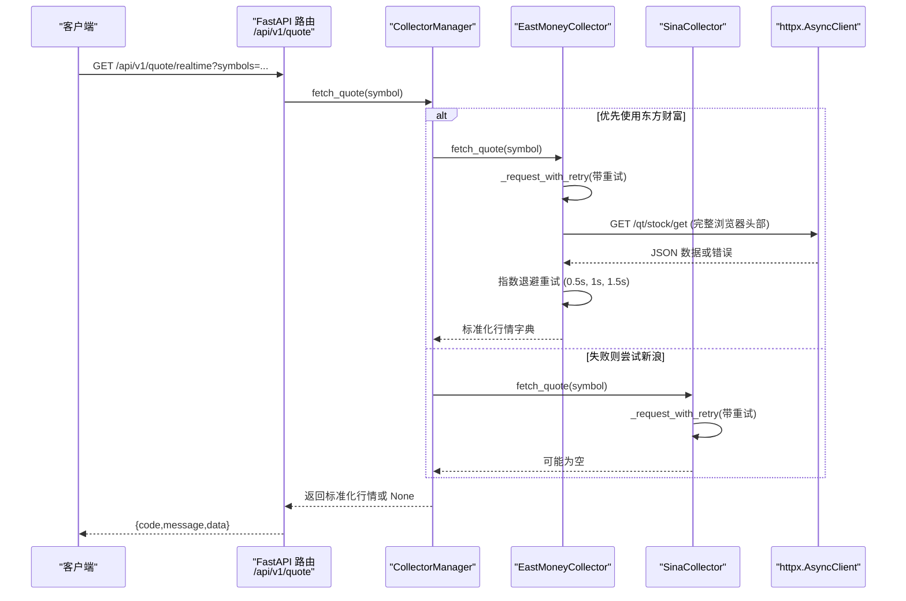
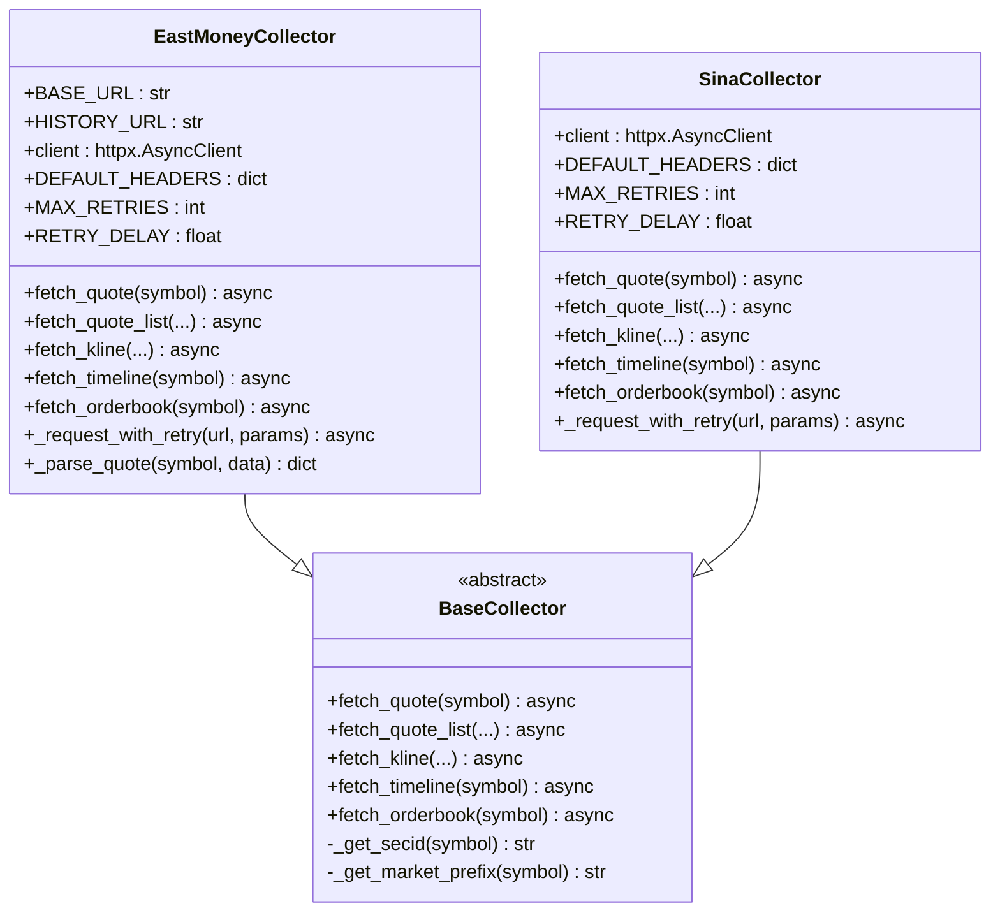
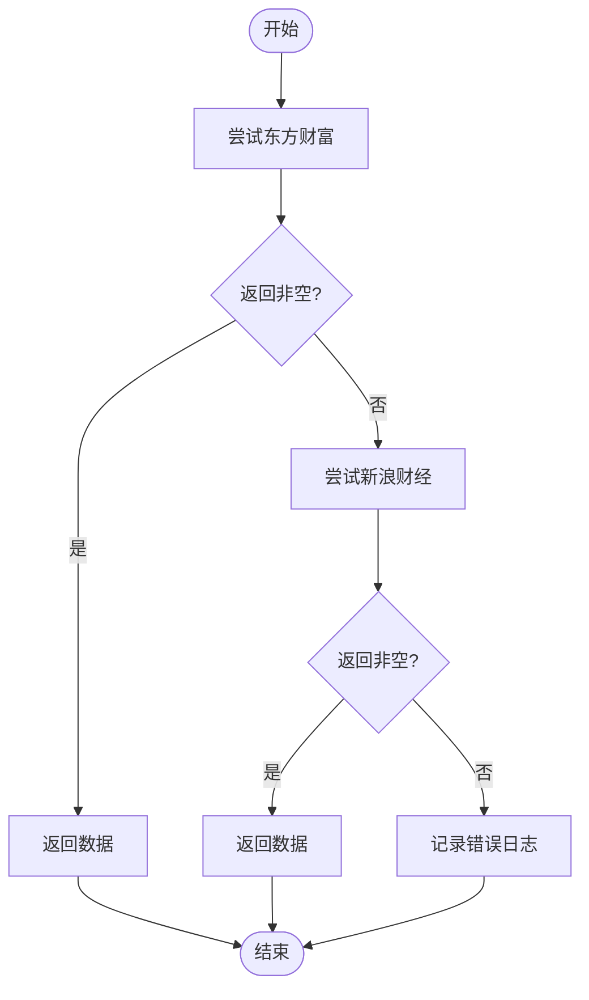
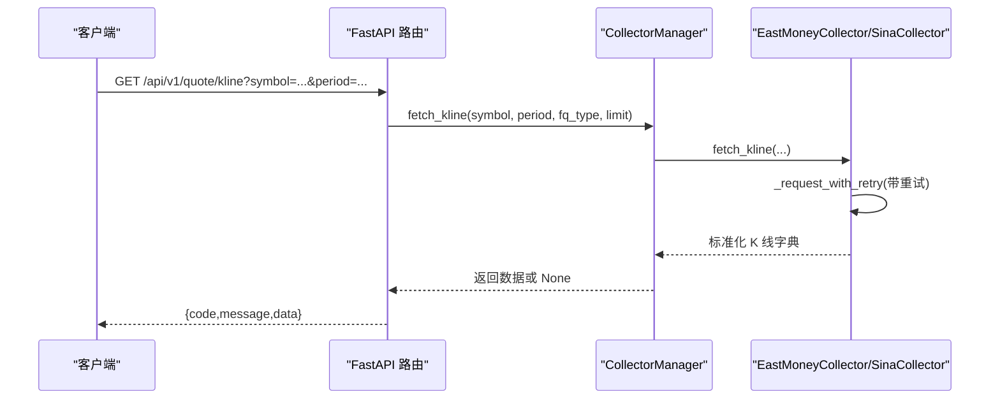
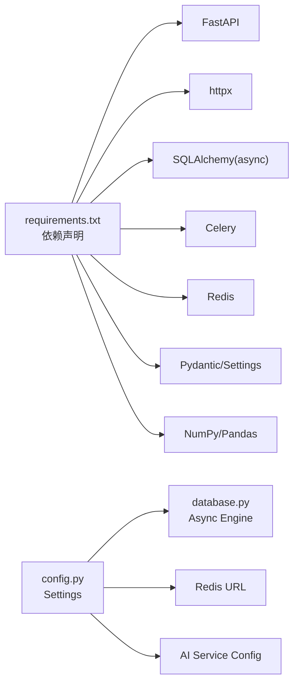

# 东方财富数据采集器

<cite>
**本文引用的文件**
- [eastmoney.py](file://backend/app/services/collector/eastmoney.py)
- [base.py](file://backend/app/services/collector/base.py)
- [manager.py](file://backend/app/services/collector/manager.py)
- [quote.py](file://backend/app/api/v1/quote.py)
- [sina.py](file://backend/app/services/collector/sina.py)
- [models.py](file://backend/app/models/models.py)
- [main.py](file://backend/app/main.py)
- [config.py](file://backend/app/core/config.py)
- [database.py](file://backend/app/core/database.py)
- [interface.py](file://backend/app/ai/interface.py)
- [requirements.txt](file://backend/requirements.txt)
</cite>

## 更新摘要
**变更内容**
- 新增完整的重试机制章节，涵盖指数退避算法和异常处理策略
- 更新浏览器头部配置章节，详细说明反爬虫优化措施
- 新增HTTP客户端配置优化章节，包括连接池和超时设置
- 增强错误重试策略与容错设计章节，提供具体的重试参数配置
- 更新性能考虑章节，增加重试机制对系统性能的影响分析

## 目录
1. [简介](#简介)
2. [项目结构](#项目结构)
3. [核心组件](#核心组件)
4. [架构总览](#架构总览)
5. [详细组件分析](#详细组件分析)
6. [依赖分析](#依赖分析)
7. [性能考虑](#性能考虑)
8. [故障排查指南](#故障排查指南)
9. [结论](#结论)
10. [附录](#附录)

## 简介
本文件面向"东方财富数据采集器"的实现与使用，系统性解析 EastMoneyCollector 的具体实现细节，覆盖其与 BaseCollector 抽象基类的继承关系、接口方法的实现逻辑、与 API 的交互方式、数据格式解析与参数映射规则，并对异步处理机制、网络请求优化、错误重试策略进行深入说明。特别关注最新的重试机制实现、浏览器头部配置优化、HTTP客户端设置改进等增强功能，这些变更显著提升了系统的反爬虫能力和可靠性。

## 项目结构
后端采用 FastAPI + 异步 SQLAlchemy 架构，行情数据采集通过 Collector 抽象层统一对外暴露，具体实现由 EastMoneyCollector 和 SinaCollector 提供，采集器由 CollectorManager 统一编排并实现故障转移。

**图表来源**
- [quote.py:1-65](file://backend/app/api/v1/quote.py#L1-L65)
- [manager.py:1-94](file://backend/app/services/collector/manager.py#L1-L94)
- [eastmoney.py:1-297](file://backend/app/services/collector/eastmoney.py#L1-L297)
- [sina.py:1-312](file://backend/app/services/collector/sina.py#L1-L312)
- [base.py:1-45](file://backend/app/services/collector/base.py#L1-L45)
- [config.py:1-43](file://backend/app/core/config.py#L1-L43)
- [database.py:1-25](file://backend/app/core/database.py#L1-L25)
- [models.py:1-74](file://backend/app/models/models.py#L1-L74)
- [interface.py:1-196](file://backend/app/ai/interface.py#L1-L196)

**章节来源**
- [main.py:1-48](file://backend/app/main.py#L1-L48)
- [config.py:1-43](file://backend/app/core/config.py#L1-L43)
- [database.py:1-25](file://backend/app/core/database.py#L1-L25)

## 核心组件
- BaseCollector：定义统一的异步采集接口（实时行情、行情列表、K线、分时、盘口），并提供 secid 与市场前缀的通用转换工具。
- EastMoneyCollector：实现 BaseCollector，对接东方财富 API，完成数据抓取、字段映射与标准化输出，具备完整的重试机制和反爬虫优化。
- SinaCollector：实现 BaseCollector，作为备用数据源，目前仅实现部分接口，同样具备重试机制和浏览器头部配置。
- CollectorManager：负责按优先级自动故障转移，封装多数据源聚合与错误日志记录。
- API 层（quote.py）：FastAPI 路由，接收查询参数并调用 CollectorManager，返回统一结构化响应。
- 配置与数据库：Settings 提供运行时配置，database.py 提供异步连接池与会话管理。

**章节来源**
- [base.py:1-45](file://backend/app/services/collector/base.py#L1-L45)
- [eastmoney.py:1-297](file://backend/app/services/collector/eastmoney.py#L1-L297)
- [sina.py:1-312](file://backend/app/services/collector/sina.py#L1-L312)
- [manager.py:1-94](file://backend/app/services/collector/manager.py#L1-L94)
- [quote.py:1-65](file://backend/app/api/v1/quote.py#L1-L65)
- [config.py:1-43](file://backend/app/core/config.py#L1-L43)
- [database.py:1-25](file://backend/app/core/database.py#L1-L25)

## 架构总览
下图展示从 API 请求到数据采集与返回的整体流程，体现异步、容错与标准化输出的关键路径，以及新增的重试机制和反爬虫优化。

**图表来源**
- [quote.py:7-16](file://backend/app/api/v1/quote.py#L7-L16)
- [manager.py:21-33](file://backend/app/services/collector/manager.py#L21-L33)
- [eastmoney.py:41-67](file://backend/app/services/collector/eastmoney.py#L41-L67)
- [sina.py:36-62](file://backend/app/services/collector/sina.py#L36-L62)

## 详细组件分析

### EastMoneyCollector 实现详解
- 继承关系与职责
  - 继承自 BaseCollector，必须实现 fetch_quote、fetch_quote_list、fetch_kline、fetch_timeline、fetch_orderbook 五个异步方法。
  - 提供 _get_secid 与 _get_market_prefix 两个内部工具，用于将股票代码转换为东方财富 secid 与市场前缀。
- API 调用方式与参数映射
  - 实时行情：调用 /api/qt/stock/get，fields 明确指定所需字段，返回 data.data 后进行解析。
  - 行情列表：调用 /api/qt/clist/get，支持按排序字段、排序方向、市场过滤（all/sh/sz）等参数映射。
  - K线：调用 /api/qt/stock/kline/get，period 到 klt 映射，fq_type 到 fqt 映射，限制返回条数。
  - 分时：调用 /api/qt/stock/trends2/get，解析 trends 字段并构造时间序列点。
  - 盘口：调用 /api/qt/stock/get，fields 中提取买卖档位，构造 asks/bids 列表。
- 数据格式解析与标准化
  - 所有接口返回统一的字典结构，包含 symbol、name、market、timestamp 等关键字段；数值字段进行类型转换（float/int/str）并设置默认值 0。
  - _parse_quote 将原始字段映射为标准字段集合，确保上层无需关心底层字段差异。
- 错误处理与日志
  - 捕获异常并记录 warning 日志，返回 None，便于上层进行容错与降级。
- 异步与网络优化
  - 使用 httpx.AsyncClient，统一超时与 UA/Referer 头部，减少重复握手开销。
  - 通过 CollectorManager 的优先级与故障转移，提升可用性。
- **新增** 重试机制与反爬虫优化
  - 实现完整的 _request_with_retry 方法，支持最多3次重试，采用指数退避算法（0.5s、1.0s、1.5s）。
  - 配置完整的浏览器请求头，包含User-Agent、Referer、Accept、Accept-Language等，有效规避反爬虫检测。
  - HTTP客户端优化：连接超时5秒，读取超时10秒，最大连接数20，保持连接10个，启用重定向跟随。

**图表来源**
- [base.py:5-45](file://backend/app/services/collector/base.py#L5-L45)
- [eastmoney.py:26-297](file://backend/app/services/collector/eastmoney.py#L26-L297)
- [sina.py:24-312](file://backend/app/services/collector/sina.py#L24-L312)

**章节来源**
- [eastmoney.py:26-297](file://backend/app/services/collector/eastmoney.py#L26-L297)
- [base.py:36-45](file://backend/app/services/collector/base.py#L36-L45)

### CollectorManager 故障转移与优先级
- 优先级顺序：["eastmoney", "sina"]
- 对每个采集接口，依次尝试当前优先数据源，若成功则立即返回；失败则记录 warning 并继续下一个数据源。
- 特定接口（如行情列表）明确限定使用某数据源，避免跨源兼容问题。

**图表来源**
- [manager.py:21-33](file://backend/app/services/collector/manager.py#L21-L33)

**章节来源**
- [manager.py:12-94](file://backend/app/services/collector/manager.py#L12-L94)

### API 路由与调用链
- /api/v1/quote/realtime：批量获取实时行情，最多 50 个 symbol，逐个调用 CollectorManager.fetch_quote。
- /api/v1/quote/list：获取行情列表，参数包括 market、sort_by、sort_order、page、page_size。
- /api/v1/quote/kline：获取 K 线，参数包括 period、fq_type、limit。
- /api/v1/quote/timeline：获取分时。
- /api/v1/quote/orderbook：获取盘口。
- 返回结构统一为 {code, message, data}，其中 data 为采集器返回的标准化字典。

**图表来源**
- [quote.py:36-47](file://backend/app/api/v1/quote.py#L36-L47)
- [manager.py:49-61](file://backend/app/services/collector/manager.py#L49-L61)
- [eastmoney.py:151-199](file://backend/app/services/collector/eastmoney.py#L151-L199)

**章节来源**
- [quote.py:1-65](file://backend/app/api/v1/quote.py#L1-L65)
- [manager.py:35-61](file://backend/app/services/collector/manager.py#L35-L61)

### 数据清洗与标准化处理
- 字段映射与类型转换：将原始字段映射为标准字段名，数值字段统一转为 float/int，字符串字段保留或设默认空串。
- 缺失值处理：当 API 返回空或字段缺失时，使用 0 或空串作为默认值，保证上层消费稳定。
- 时间戳与日期：统一使用 ISO 格式的时间戳字符串，日期字段按业务需要格式化。
- 示例参考路径（不展示具体代码内容）：
  - [实时行情字段映射与转换:280-297](file://backend/app/services/collector/eastmoney.py#L280-L297)
  - [K线数据解析与标准化:170-199](file://backend/app/services/collector/eastmoney.py#L170-L199)
  - [分时数据解析与标准化:212-239](file://backend/app/services/collector/eastmoney.py#L212-L239)
  - [盘口数据解析与标准化:250-278](file://backend/app/services/collector/eastmoney.py#L250-L278)

**章节来源**
- [eastmoney.py:170-297](file://backend/app/services/collector/eastmoney.py#L170-L297)

### 参数转换规则与映射表
- 排序字段映射（行情列表）：change_pct → f3，volume → f5，amount → f6，turnover → f8。
- 排序方向映射：desc → po=0，asc → po=1。
- 市场过滤映射：all → m:0+t:6,m:0+t:80,m:1+t:2,m:1+t:23；sh → m:1+t:2,m:1+t:23；sz → m:0+t:6,m:0+t:80。
- K线周期映射：1m→1、5m→5、15m→15、30m→30、60m→60、d→101、w→102、m→103。
- 复权类型映射：none→0、front→1、back→2。
- 示例参考路径（不展示具体代码内容）：
  - [行情列表参数映射:87-103](file://backend/app/services/collector/eastmoney.py#L87-L103)
  - [K线参数映射:151-166](file://backend/app/services/collector/eastmoney.py#L151-L166)

**章节来源**
- [eastmoney.py:87-166](file://backend/app/services/collector/eastmoney.py#L87-L166)

### 异步处理机制与网络优化
- 异步客户端：统一使用 httpx.AsyncClient，减少阻塞，提高并发吞吐。
- 超时控制：全局超时 10 秒，避免请求长时间占用资源。
- 请求头：设置合理的 User-Agent 与 Referer，降低被反爬拦截概率。
- 会话复用：同一实例内复用 AsyncClient，减少 TCP 握手成本。
- **新增** 浏览器头部配置：完整的DEFAULT_HEADERS包含User-Agent、Referer、Accept、Accept-Language等，模拟真实浏览器行为。
- **新增** HTTP客户端优化：连接超时5秒，读取超时10秒，最大连接数20，保持连接10个，启用重定向跟随。
- 示例参考路径（不展示具体代码内容）：
  - [AsyncClient 初始化与头部设置:32-39](file://backend/app/services/collector/eastmoney.py#L32-L39)
  - [SinaCollector AsyncClient 初始化:27-34](file://backend/app/services/collector/sina.py#L27-L34)

**章节来源**
- [eastmoney.py:32-39](file://backend/app/services/collector/eastmoney.py#L32-L39)
- [sina.py:27-34](file://backend/app/services/collector/sina.py#L27-L34)

### 错误重试策略与容错设计
- **新增** 完整的重试机制：MAX_RETRIES=3，RETRY_DELAY=0.5秒，采用指数退避算法。
- **新增** 异常类型覆盖：处理RemoteProtocolError、ConnectTimeout、ReadTimeout等网络异常。
- **新增** 重试参数配置：每次重试延迟递增，第1次0.5秒，第2次1.0秒，第3次1.5秒。
- **新增** 状态码检查：验证HTTP 200状态码，非200时记录警告并重试。
- **新增** 重试日志记录：详细记录每次重试的原因和结果，便于故障排查。
- 单次调用失败即返回 None，由上层进行重试或降级。
- CollectorManager 采用"优先级 + 顺序尝试"的故障转移策略，提升整体可用性。
- API 层对 None 返回进行统一错误码处理，避免服务崩溃。
- 示例参考路径（不展示具体代码内容）：
  - [EastMoneyCollector 重试机制:41-67](file://backend/app/services/collector/eastmoney.py#L41-L67)
  - [SinaCollector 重试机制:36-62](file://backend/app/services/collector/sina.py#L36-L62)
  - [CollectorManager 逐源尝试与日志记录:21-33](file://backend/app/services/collector/manager.py#L21-L33)
  - [API 层对 None 的错误码处理:31-33](file://backend/app/api/v1/quote.py#L31-L33)

**章节来源**
- [eastmoney.py:41-67](file://backend/app/services/collector/eastmoney.py#L41-L67)
- [sina.py:36-62](file://backend/app/services/collector/sina.py#L36-L62)
- [manager.py:21-33](file://backend/app/services/collector/manager.py#L21-L33)
- [quote.py:31-33](file://backend/app/api/v1/quote.py#L31-L33)

### 反爬虫能力增强
- **新增** 完整浏览器请求头：模拟Chrome浏览器访问，包含User-Agent、Referer、Accept、Accept-Language等。
- **新增** 反爬虫策略：通过完整的请求头配置，有效规避东方财富的反爬虫检测机制。
- **新增** 请求头优化：设置正确的Referer指向东方财富官网，Accept设置为通配符，提升请求成功率。
- **新增** 会话保持：启用keep-alive连接，减少连接建立开销。
- 示例参考路径（不展示具体代码内容）：
  - [浏览器头部配置:10-20](file://backend/app/services/collector/eastmoney.py#L10-L20)
  - [Sina浏览器头部配置:11-18](file://backend/app/services/collector/sina.py#L11-L18)

**章节来源**
- [eastmoney.py:10-20](file://backend/app/services/collector/eastmoney.py#L10-L20)
- [sina.py:11-18](file://backend/app/services/collector/sina.py#L11-L18)

## 依赖分析
- 运行时依赖：FastAPI、httpx、SQLAlchemy(async)、Celery、Redis、Pydantic、NumPy、Pandas 等。
- 配置来源：Settings 从 .env 文件加载，包含数据库、Redis、AI 服务、采集间隔与缓存 TTL 等。
- 数据库连接：异步引擎与连接池，支持高并发写入与查询。
- ORM 模型：StockInfo、QuoteDaily、QuoteTick、Watchlist、AIAnalysisLog 等，支撑行情与分析数据持久化。

**图表来源**
- [requirements.txt:1-17](file://backend/requirements.txt#L1-L17)
- [config.py:5-31](file://backend/app/core/config.py#L5-L31)
- [database.py:7-8](file://backend/app/core/database.py#L7-L8)

**章节来源**
- [requirements.txt:1-17](file://backend/requirements.txt#L1-L17)
- [config.py:1-43](file://backend/app/core/config.py#L1-L43)
- [database.py:1-25](file://backend/app/core/database.py#L1-L25)

## 性能考虑
- 并发与限流：API 层对 symbols 最大数量限制（如实时行情最多 50），避免一次性并发过高。
- 采集间隔：配置项 QUOTE_COLLECT_INTERVAL 控制采集频率，避免频繁请求导致数据源限流或自身压力过大。
- 缓存策略：QUOTE_CACHE_TTL 控制缓存过期时间，结合 Redis 可进一步实现热点数据缓存。
- 数据库写入：批量插入与事务控制，避免高频小事务造成锁竞争。
- 指标与监控：结合 Celery 任务队列与 Redis，统计采集耗时、成功率与失败原因，持续优化。
- **新增** 重试机制性能影响：指数退避算法在保证可靠性的同时，增加了平均等待时间，需要根据业务需求调整重试次数和延迟参数。
- **新增** 反爬虫优化性能：完整的浏览器头部配置虽然增加了请求头处理开销，但显著提升了请求成功率，减少了重试次数。

## 故障排查指南
- 现象：返回 {code: 1002/1003, message: "..."}，data: None
  - 可能原因：股票代码不存在、数据源不可用、网络超时、字段缺失。
  - 排查步骤：检查 symbol 是否正确、确认 CollectorManager 优先级是否命中、查看日志 warning。
- 现象：实时行情缺失或字段为 0
  - 可能原因：API 返回空 data、fields 映射不完整。
  - 排查步骤：核对 fields 参数、确认 _parse_quote 字段映射是否覆盖。
- 现象：K线/分时/盘口为空
  - 可能原因：目标周期或参数不支持、历史数据不足。
  - 排查步骤：检查 period/fq_type 映射、调整 limit、确认 HISTORY_URL 接口可用性。
- **新增** 现象：重试失败但仍返回None
  - 可能原因：超过最大重试次数、网络异常、API限制。
  - 排查步骤：检查日志中的重试记录、确认网络连接、查看API状态。
- **新增** 现象：反爬虫拦截
  - 可能原因：请求头配置不完整、请求过于频繁。
  - 排查步骤：确认浏览器头部配置、检查请求频率、查看返回的状态码。
- 日志定位：EastMoneyCollector 与 SinaCollector 在异常时会记录 warning 日志，便于快速定位失败节点。

**章节来源**
- [quote.py:31-33](file://backend/app/api/v1/quote.py#L31-L33)
- [eastmoney.py:66-67](file://backend/app/services/collector/eastmoney.py#L66-L67)
- [sina.py:61-62](file://backend/app/services/collector/sina.py#L61-L62)
- [manager.py:30-33](file://backend/app/services/collector/manager.py#L30-L33)

## 结论
EastMoneyCollector 通过清晰的抽象与标准化输出，实现了对东方财富数据源的高效接入；配合 CollectorManager 的故障转移与 API 层的统一响应，构建了高可用、易扩展的行情数据采集体系。最新的重试机制、浏览器头部配置和HTTP客户端优化显著提升了系统的反爬虫能力和可靠性，为生产环境部署提供了坚实的技术基础。建议在生产环境中结合缓存、限流与监控，持续优化采集性能与稳定性。

## 附录
- 代码片段路径参考（不展示具体代码内容）
  - [实时行情接口实现:69-85](file://backend/app/services/collector/eastmoney.py#L69-L85)
  - [行情列表接口实现:87-149](file://backend/app/services/collector/eastmoney.py#L87-L149)
  - [K线接口实现:151-199](file://backend/app/services/collector/eastmoney.py#L151-L199)
  - [分时接口实现:201-239](file://backend/app/services/collector/eastmoney.py#L201-L239)
  - [盘口接口实现:241-278](file://backend/app/services/collector/eastmoney.py#L241-L278)
  - [重试机制实现:41-67](file://backend/app/services/collector/eastmoney.py#L41-L67)
  - [浏览器头部配置:10-20](file://backend/app/services/collector/eastmoney.py#L10-L20)
  - [HTTP客户端配置:32-39](file://backend/app/services/collector/eastmoney.py#L32-L39)
  - [BaseCollector 抽象接口:8-34](file://backend/app/services/collector/base.py#L8-L34)
  - [CollectorManager 故障转移:21-94](file://backend/app/services/collector/manager.py#L21-L94)
  - [API 路由定义:7-65](file://backend/app/api/v1/quote.py#L7-L65)
  - [AI 分析集成采集器:114-117](file://backend/app/ai/interface.py#L114-L117)