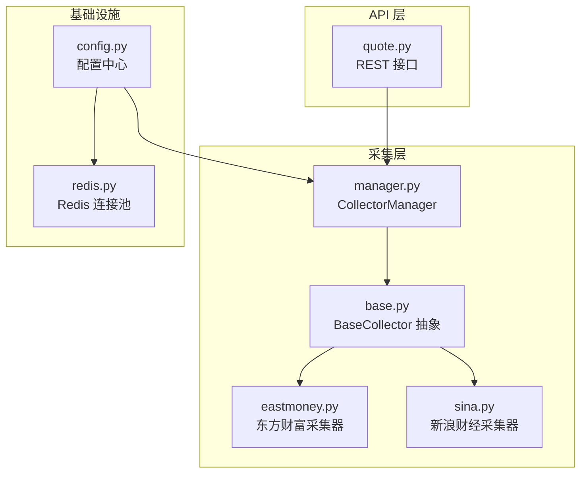
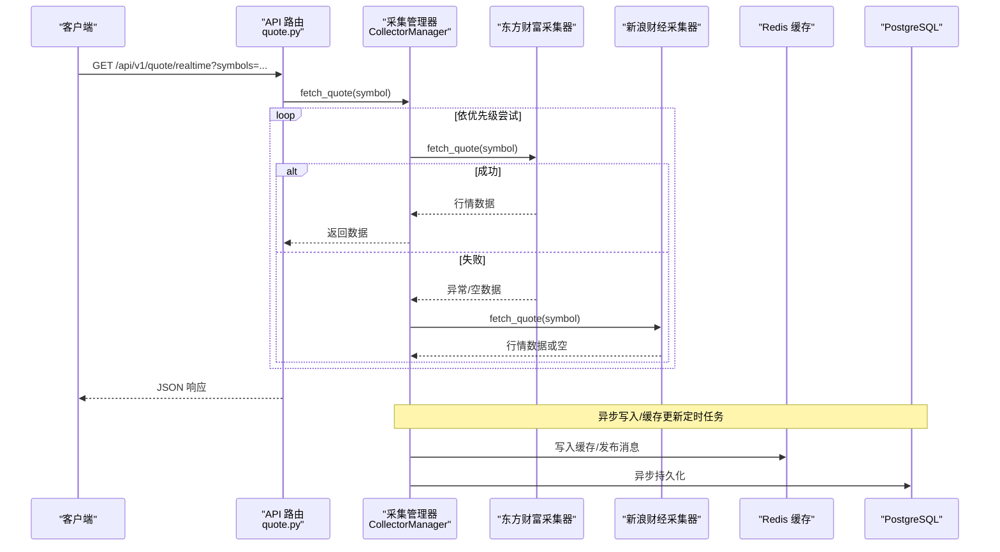
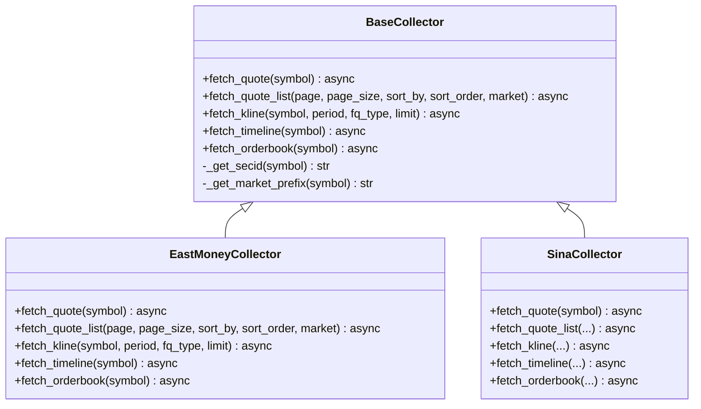
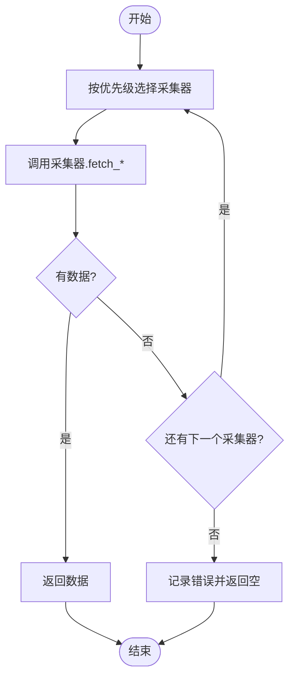
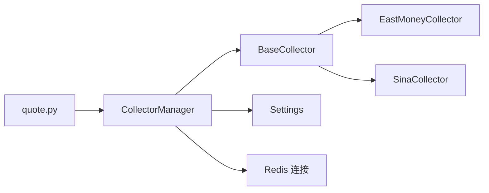

# 数据服务层

<cite>
**本文引用的文件**
- [backend/app/services/collector/base.py](file://backend/app/services/collector/base.py)
- [backend/app/services/collector/eastmoney.py](file://backend/app/services/collector/eastmoney.py)
- [backend/app/services/collector/sina.py](file://backend/app/services/collector/sina.py)
- [backend/app/services/collector/manager.py](file://backend/app/services/collector/manager.py)
- [backend/app/api/v1/quote.py](file://backend/app/api/v1/quote.py)
- [backend/app/core/config.py](file://backend/app/core/config.py)
- [backend/app/core/redis.py](file://backend/app/core/redis.py)
- [backend/app/main.py](file://backend/app/main.py)
- [Stock-View 软件开发文档/开发文档.md](file://Stock-View 软件开发文档/开发文档.md)
</cite>

## 目录
1. [简介](#简介)
2. [项目结构](#项目结构)
3. [核心组件](#核心组件)
4. [架构总览](#架构总览)
5. [详细组件分析](#详细组件分析)
6. [依赖分析](#依赖分析)
7. [性能考虑](#性能考虑)
8. [故障排查指南](#故障排查指南)
9. [结论](#结论)
10. [附录：数据采集配置指南](#附录数据采集配置指南)

## 简介
本文件面向数据服务层，系统性梳理 Stock-View 的数据采集架构与实现，重点覆盖：
- 多数据源容灾机制（主备自动切换）
- 采集器策略模式设计（抽象基类、具体实现、管理器协调）
- 异步处理模式（定时任务、并发控制、错误重试、数据去重）
- 数据缓存与同步机制（Redis 缓存键与 TTL、消息推送）
- 数据质量保证（参数映射、字段清洗、异常降级）

## 项目结构
后端采用分层组织，数据采集位于 services/collector 子模块，API 层通过 CollectorManager 统一编排，核心配置集中于 core/config.py，Redis 连接在 core/redis.py 中统一管理。

图示来源
- [backend/app/api/v1/quote.py:1-65](file://backend/app/api/v1/quote.py#L1-L65)
- [backend/app/services/collector/manager.py:1-80](file://backend/app/services/collector/manager.py#L1-L80)
- [backend/app/services/collector/base.py:1-45](file://backend/app/services/collector/base.py#L1-L45)
- [backend/app/services/collector/eastmoney.py:1-240](file://backend/app/services/collector/eastmoney.py#L1-L240)
- [backend/app/services/collector/sina.py:1-79](file://backend/app/services/collector/sina.py#L1-L79)
- [backend/app/core/config.py:1-43](file://backend/app/core/config.py#L1-L43)
- [backend/app/core/redis.py:1-25](file://backend/app/core/redis.py#L1-L25)

章节来源
- [backend/app/api/v1/quote.py:1-65](file://backend/app/api/v1/quote.py#L1-L65)
- [backend/app/services/collector/manager.py:1-80](file://backend/app/services/collector/manager.py#L1-L80)
- [backend/app/services/collector/base.py:1-45](file://backend/app/services/collector/base.py#L1-L45)
- [backend/app/services/collector/eastmoney.py:1-240](file://backend/app/services/collector/eastmoney.py#L1-L240)
- [backend/app/services/collector/sina.py:1-79](file://backend/app/services/collector/sina.py#L1-L79)
- [backend/app/core/config.py:1-43](file://backend/app/core/config.py#L1-L43)
- [backend/app/core/redis.py:1-25](file://backend/app/core/redis.py#L1-L25)

## 核心组件
- BaseCollector：定义统一的异步采集接口（实时行情、列表、K线、分时、盘口），并提供通用工具方法（生成 secid、市场前缀）。
- EastMoneyCollector：实现东方财富数据源的完整接口，负责参数构造、请求发送、响应解析与字段映射。
- SinaCollector：实现新浪财经备用采集器，当前仅支持实时行情，其他接口为占位提示。
- CollectorManager：基于优先级的采集器管理器，实现主备自动切换与异常降级；提供全局单例以供 API 层直接调用。
- 配置中心 Settings：集中管理数据源、缓存、定时任务、AI 适配器等运行参数。
- Redis 连接：提供异步连接池，供缓存与消息通道使用。

章节来源
- [backend/app/services/collector/base.py:1-45](file://backend/app/services/collector/base.py#L1-L45)
- [backend/app/services/collector/eastmoney.py:1-240](file://backend/app/services/collector/eastmoney.py#L1-L240)
- [backend/app/services/collector/sina.py:1-79](file://backend/app/services/collector/sina.py#L1-L79)
- [backend/app/services/collector/manager.py:1-80](file://backend/app/services/collector/manager.py#L1-L80)
- [backend/app/core/config.py:1-43](file://backend/app/core/config.py#L1-L43)
- [backend/app/core/redis.py:1-25](file://backend/app/core/redis.py#L1-L25)

## 架构总览
下图展示从 API 到采集器再到数据源的整体链路，以及与缓存和数据库的交互路径。

图示来源
- [backend/app/api/v1/quote.py:1-65](file://backend/app/api/v1/quote.py#L1-L65)
- [backend/app/services/collector/manager.py:1-80](file://backend/app/services/collector/manager.py#L1-L80)
- [backend/app/services/collector/eastmoney.py:1-240](file://backend/app/services/collector/eastmoney.py#L1-L240)
- [backend/app/services/collector/sina.py:1-79](file://backend/app/services/collector/sina.py#L1-L79)

## 详细组件分析

### 策略模式：采集器抽象与实现
- 抽象基类 BaseCollector：统一定义 fetch_quote/fetch_quote_list/fetch_kline/fetch_timeline/fetch_orderbook 等异步接口，并提供 _get_secid/_get_market_prefix 等通用工具。
- 东方财富实现：覆盖全部接口，参数映射完善，字段清洗严格，异常捕获并返回空值以触发降级。
- 新浪财经实现：当前仅实现 fetch_quote，其余接口返回 None 并输出“暂未实现”警告，便于主流程继续降级。

图示来源
- [backend/app/services/collector/base.py:1-45](file://backend/app/services/collector/base.py#L1-L45)
- [backend/app/services/collector/eastmoney.py:1-240](file://backend/app/services/collector/eastmoney.py#L1-L240)
- [backend/app/services/collector/sina.py:1-79](file://backend/app/services/collector/sina.py#L1-L79)

章节来源
- [backend/app/services/collector/base.py:1-45](file://backend/app/services/collector/base.py#L1-L45)
- [backend/app/services/collector/eastmoney.py:1-240](file://backend/app/services/collector/eastmoney.py#L1-L240)
- [backend/app/services/collector/sina.py:1-79](file://backend/app/services/collector/sina.py#L1-L79)

### 采集器管理器：主备自动切换与协调
- 优先级顺序：eastmoney → sina
- 单次请求按序尝试，遇异常或空数据则切换到下一个采集器
- 对部分接口（如列表、K线、分时、盘口）限定仅使用 eastmoney，避免功能缺失
- 全局单例 collector_manager 提供统一入口，API 层直接调用

图示来源
- [backend/app/services/collector/manager.py:1-80](file://backend/app/services/collector/manager.py#L1-L80)

章节来源
- [backend/app/services/collector/manager.py:1-80](file://backend/app/services/collector/manager.py#L1-L80)

### API 层对接：统一入口与错误码
- quote.py 将前端请求映射到 CollectorManager 的对应接口
- 对空结果返回明确的错误码与提示，便于前端处理
- 限制 symbols 最大数量，避免一次性请求过多导致超时

章节来源
- [backend/app/api/v1/quote.py:1-65](file://backend/app/api/v1/quote.py#L1-L65)

### 配置中心：采集与缓存参数
- 数据源：PRIMARY_DATA_SOURCE、FALLBACK_DATA_SOURCE
- 定时任务：QUOTE_COLLECT_INTERVAL（秒）、QUOTE_CACHE_TTL（秒）
- Redis：REDIS_URL
- Celery：CELERY_BROKER_URL、CELERY_RESULT_BACKEND
- AI 适配器：AI_ADAPTER、AI_SERVICE_URL、AI_REQUEST_TIMEOUT、AI_CACHE_ENABLED、AI_CACHE_TTL、AI_RATE_LIMIT

章节来源
- [backend/app/core/config.py:1-43](file://backend/app/core/config.py#L1-L43)

### 缓存与消息通道：Redis 设计
- 缓存键模式（示例）：实时行情、盘口、分时、日K、股票基础信息、自选股、AI 分析、活跃股票集合等
- TTL 设定：如实时行情 5s、日K 30min、股票信息 24h 等
- Pub/Sub 频道：行情更新、盘口更新、市场状态变更等

章节来源
- [Stock-View 软件开发文档/开发文档.md:1109-1133](file://Stock-View 软件开发文档/开发文档.md#L1109-L1133)

## 依赖分析
- CollectorManager 依赖 BaseCollector 抽象，具体实现为 EastMoneyCollector 与 SinaCollector
- API 层仅依赖 CollectorManager，解耦具体数据源
- 配置中心为采集层与基础设施提供参数来源
- Redis 连接池为缓存与消息通道提供统一访问

图示来源
- [backend/app/api/v1/quote.py:1-65](file://backend/app/api/v1/quote.py#L1-L65)
- [backend/app/services/collector/manager.py:1-80](file://backend/app/services/collector/manager.py#L1-L80)
- [backend/app/services/collector/base.py:1-45](file://backend/app/services/collector/base.py#L1-L45)
- [backend/app/services/collector/eastmoney.py:1-240](file://backend/app/services/collector/eastmoney.py#L1-L240)
- [backend/app/services/collector/sina.py:1-79](file://backend/app/services/collector/sina.py#L1-L79)
- [backend/app/core/config.py:1-43](file://backend/app/core/config.py#L1-L43)
- [backend/app/core/redis.py:1-25](file://backend/app/core/redis.py#L1-L25)

章节来源
- [backend/app/api/v1/quote.py:1-65](file://backend/app/api/v1/quote.py#L1-L65)
- [backend/app/services/collector/manager.py:1-80](file://backend/app/services/collector/manager.py#L1-L80)
- [backend/app/services/collector/base.py:1-45](file://backend/app/services/collector/base.py#L1-L45)
- [backend/app/services/collector/eastmoney.py:1-240](file://backend/app/services/collector/eastmoney.py#L1-L240)
- [backend/app/services/collector/sina.py:1-79](file://backend/app/services/collector/sina.py#L1-L79)
- [backend/app/core/config.py:1-43](file://backend/app/core/config.py#L1-L43)
- [backend/app/core/redis.py:1-25](file://backend/app/core/redis.py#L1-L25)

## 性能考虑
- 异步 I/O：采集器使用 httpx.AsyncClient，提升并发吞吐
- 参数映射与字段清洗：减少后续处理成本，提高缓存命中率
- 缓存 TTL 策略：热点数据短 TTL，冷数据长 TTL，平衡新鲜度与压力
- 主备切换：在单一数据源异常时快速降级，保障可用性
- 定时任务节流：Beat 任务设置 expires，避免任务堆积

## 故障排查指南
- 数据为空
  - 检查采集器返回是否为空（可能因网络异常或数据源格式变化）
  - 查看 CollectorManager 日志，确认是否已尝试备选数据源
- 接口报错码
  - quote.py 对空结果返回特定错误码，前端据此提示用户
- 数据源不可用
  - 确认 PRIMARY_DATA_SOURCE/FALLBACK_DATA_SOURCE 配置
  - 检查网络连通性与第三方接口可用性
- 缓存异常
  - 核对 Redis 连接与键空间命名规范
  - 检查 TTL 设置是否合理

章节来源
- [backend/app/services/collector/manager.py:1-80](file://backend/app/services/collector/manager.py#L1-L80)
- [backend/app/api/v1/quote.py:1-65](file://backend/app/api/v1/quote.py#L1-L65)
- [backend/app/core/config.py:1-43](file://backend/app/core/config.py#L1-L43)
- [backend/app/core/redis.py:1-25](file://backend/app/core/redis.py#L1-L25)

## 结论
该数据服务层通过策略模式将采集器抽象化，结合 CollectorManager 的主备切换机制，实现了高可用、可扩展的数据采集体系。配合 Redis 缓存与定时任务，满足了实时行情的低延迟与高并发需求。建议在生产环境中进一步完善：
- 增强数据源健康检查与熔断策略
- 扩展更多数据源（如腾讯）以提升冗余度
- 加强数据质量监控与告警
- 优化定时任务的并发与去重策略

## 附录：数据采集配置指南
- 采集频率
  - QUOTE_COLLECT_INTERVAL：采集间隔（秒）
  - QUOTE_CACHE_TTL：缓存 TTL（秒）
- 数据源切换
  - PRIMARY_DATA_SOURCE：主数据源名称
  - FALLBACK_DATA_SOURCE：备用数据源名称
- 异常处理策略
  - 采集器内部捕获异常并返回空，交由管理器进行主备切换
  - API 层对空结果返回明确错误码
- 缓存与消息
  - Redis URL：REDIS_URL
  - 缓存键与 TTL：参考缓存键设计表
  - Pub/Sub 频道：行情更新、盘口更新、市场状态变更
- Celery 定时任务
  - Broker/Backend：CELERY_BROKER_URL、CELERY_RESULT_BACKEND
  - 任务调度：采集实时行情、同步股票信息、日K快照、预热缓存等

章节来源
- [backend/app/core/config.py:1-43](file://backend/app/core/config.py#L1-L43)
- [Stock-View 软件开发文档/开发文档.md:434-470](file://Stock-View 软件开发文档/开发文档.md#L434-L470)
- [Stock-View 软件开发文档/开发文档.md:1109-1133](file://Stock-View 软件开发文档/开发文档.md#L1109-L1133)