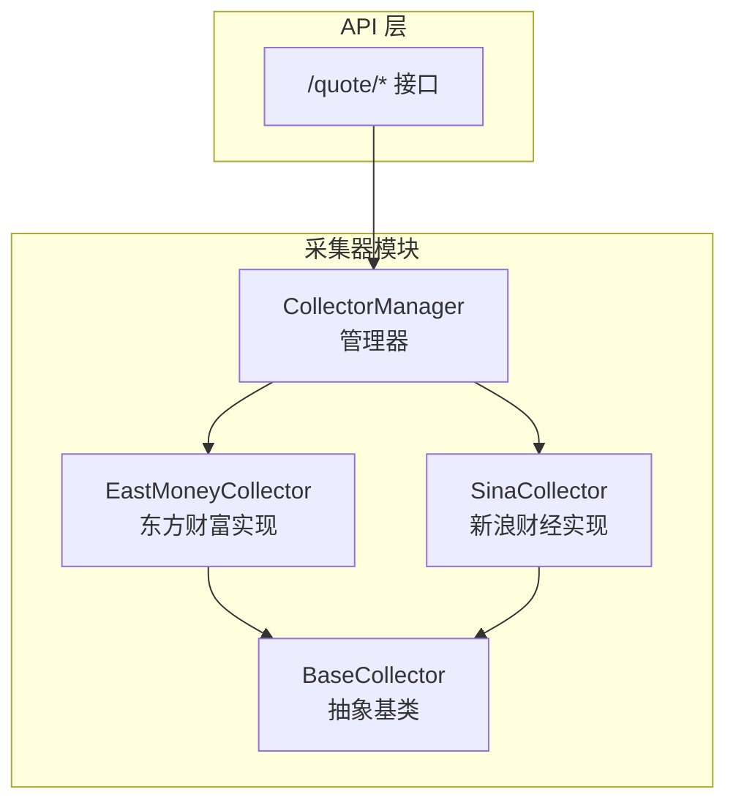
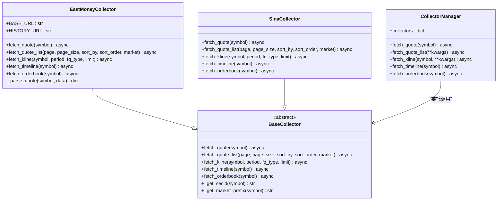
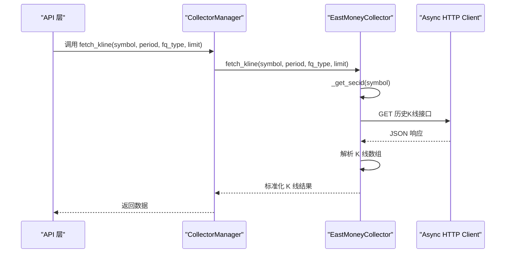
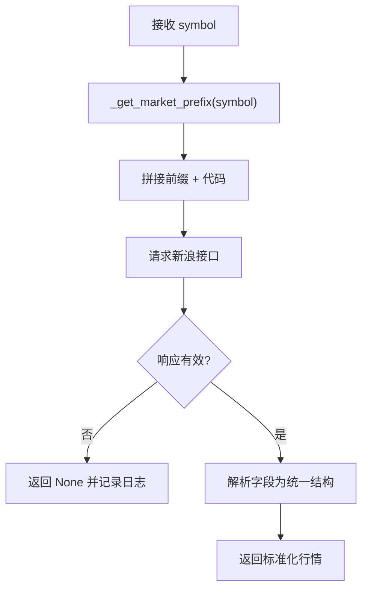
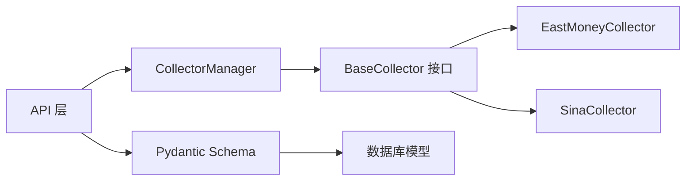

# 数据采集器架构

<cite>
**本文档引用的文件**
- [base.py](file://backend/app/services/collector/base.py)
- [eastmoney.py](file://backend/app/services/collector/eastmoney.py)
- [sina.py](file://backend/app/services/collector/sina.py)
- [manager.py](file://backend/app/services/collector/manager.py)
- [quote.py](file://backend/app/api/v1/quote.py)
- [schemas.py](file://backend/app/schemas/schemas.py)
- [models.py](file://backend/app/models/models.py)
</cite>

## 目录
1. [简介](#简介)
2. [项目结构](#项目结构)
3. [核心组件](#核心组件)
4. [架构概览](#架构概览)
5. [详细组件分析](#详细组件分析)
6. [依赖关系分析](#依赖关系分析)
7. [性能考量](#性能考量)
8. [故障排查指南](#故障排查指南)
9. [结论](#结论)

## 简介
本文件系统化梳理了数据采集器的整体架构与实现细节，重点围绕抽象基类 BaseCollector 的设计理念与接口规范展开，涵盖 fetch_quote、fetch_quote_list、fetch_kline、fetch_timeline、fetch_orderbook 等核心方法的职责边界与参数约定；同时阐述策略模式在多数据源场景下的应用方式，统一数据格式规范与跨数据源兼容性处理机制，并给出扩展性、错误处理与性能优化的最佳实践建议。

## 项目结构
数据采集器位于后端服务的 collector 子模块中，采用“抽象基类 + 多实现 + 管理器”的分层设计：
- 抽象基类：定义统一接口与通用工具方法
- 具体实现：东方财富采集器与新浪财经采集器
- 管理器：负责多数据源的优先级调度与故障转移

图表来源
- [base.py:5-45](file://backend/app/services/collector/base.py#L5-L45)
- [eastmoney.py:11-240](file://backend/app/services/collector/eastmoney.py#L11-L240)
- [sina.py:10-79](file://backend/app/services/collector/sina.py#L10-L79)
- [manager.py:12-80](file://backend/app/services/collector/manager.py#L12-L80)
- [quote.py:1-65](file://backend/app/api/v1/quote.py#L1-L65)

章节来源
- [base.py:1-45](file://backend/app/services/collector/base.py#L1-L45)
- [eastmoney.py:1-240](file://backend/app/services/collector/eastmoney.py#L1-L240)
- [sina.py:1-79](file://backend/app/services/collector/sina.py#L1-L79)
- [manager.py:1-80](file://backend/app/services/collector/manager.py#L1-L80)
- [quote.py:1-65](file://backend/app/api/v1/quote.py#L1-L65)

## 核心组件
- 抽象基类 BaseCollector：定义统一接口与通用工具方法，确保各具体实现遵循一致的数据格式与行为规范。
- 东方财富采集器 EastMoneyCollector：完整实现所有接口，负责实时行情、行情列表、K线、分时、盘口等数据抓取与标准化输出。
- 新浪财经采集器 SinaCollector：仅实现实时行情接口，其他接口为占位实现，用于演示策略模式的可扩展性。
- 采集器管理器 CollectorManager：按优先级顺序尝试调用各采集器，实现自动故障转移与容错。

章节来源
- [base.py:5-45](file://backend/app/services/collector/base.py#L5-L45)
- [eastmoney.py:11-240](file://backend/app/services/collector/eastmoney.py#L11-L240)
- [sina.py:10-79](file://backend/app/services/collector/sina.py#L10-L79)
- [manager.py:12-80](file://backend/app/services/collector/manager.py#L12-L80)

## 架构概览
整体采用策略模式：通过抽象基类约束接口，具体实现类提供不同数据源的适配逻辑，管理器负责选择与调度。该模式的优势在于：
- 易于新增数据源：只需实现 BaseCollector 接口并注册到管理器
- 容易替换与回退：通过调整优先级或异常处理实现故障转移
- 统一数据格式：各实现内部完成标准化转换，上层无需感知数据源差异

图表来源
- [base.py:5-45](file://backend/app/services/collector/base.py#L5-L45)
- [eastmoney.py:11-240](file://backend/app/services/collector/eastmoney.py#L11-L240)
- [sina.py:10-79](file://backend/app/services/collector/sina.py#L10-L79)
- [manager.py:12-80](file://backend/app/services/collector/manager.py#L12-L80)

## 详细组件分析

### 抽象基类 BaseCollector 设计
- 接口职责
  - fetch_quote：获取单只股票实时行情，返回标准化字典
  - fetch_quote_list：获取行情列表，支持分页、排序与市场过滤
  - fetch_kline：获取 K 线数据，支持周期与复权类型
  - fetch_timeline：获取分时数据
  - fetch_orderbook：获取盘口数据
- 工具方法
  - _get_secid：将股票代码转换为东方财富 secid 格式
  - _get_market_prefix：根据代码前缀推断市场前缀（sh/sz）

图表来源
- [base.py:36-45](file://backend/app/services/collector/base.py#L36-L45)

章节来源
- [base.py:5-45](file://backend/app/services/collector/base.py#L5-L45)

### 东方财富采集器 EastMoneyCollector
- 实现策略
  - 使用异步 HTTP 客户端访问多个接口，分别处理实时行情、行情列表、K线、分时、盘口
  - 在每个接口中完成数据解析与标准化，确保返回结构一致
- 关键流程
  - fetch_quote：构造 secid 参数，请求实时行情接口，解析响应并调用内部解析函数
  - fetch_quote_list：根据排序字段映射与市场过滤条件构造查询参数，解析列表项
  - fetch_kline：周期与复权类型映射，解析 K 线数组为标准条目
  - fetch_timeline：解析分时趋势数组，组装时间序列点
  - fetch_orderbook：解析买卖盘口数据，按层级组织
- 内部解析
  - _parse_quote：将原始字段映射为统一的行情结构

图表来源
- [eastmoney.py:101-147](file://backend/app/services/collector/eastmoney.py#L101-L147)
- [manager.py:45-54](file://backend/app/services/collector/manager.py#L45-L54)

章节来源
- [eastmoney.py:11-240](file://backend/app/services/collector/eastmoney.py#L11-L240)

### 新浪财经采集器 SinaCollector
- 实现策略
  - 仅实现 fetch_quote，其他接口返回 None 并记录警告日志
  - 通过市场前缀拼接代码，解析新浪接口返回的字符串数据
- 设计意图
  - 演示策略模式的可插拔特性：当某数据源能力不足时，可通过管理器切换到其他实现

图表来源
- [sina.py:19-60](file://backend/app/services/collector/sina.py#L19-L60)

章节来源
- [sina.py:10-79](file://backend/app/services/collector/sina.py#L10-L79)

### 采集器管理器 CollectorManager
- 职责
  - 维护采集器字典与优先级列表
  - 针对每个接口依次尝试调用，遇到成功即返回，否则继续下一个数据源
- 错误处理
  - 捕获异常并记录警告日志，避免单个数据源故障影响整体可用性
- 扩展性
  - 新增数据源只需实例化实现并加入 collectors 字典，调整优先级即可

图表来源
- [manager.py:21-32](file://backend/app/services/collector/manager.py#L21-L32)
- [quote.py:7-16](file://backend/app/api/v1/quote.py#L7-L16)

章节来源
- [manager.py:12-80](file://backend/app/services/collector/manager.py#L12-L80)
- [quote.py:1-65](file://backend/app/api/v1/quote.py#L1-L65)

## 依赖关系分析
- 组件耦合
  - API 层仅依赖 CollectorManager，不直接依赖具体实现，降低耦合度
  - CollectorManager 依赖 BaseCollector 接口，通过多态实现调度
- 外部依赖
  - 异步 HTTP 客户端用于访问第三方数据接口
  - 日志模块用于异常与状态记录
- 数据模型与格式
  - Pydantic 模型定义了统一的响应结构，便于前后端契约一致

图表来源
- [quote.py:1-65](file://backend/app/api/v1/quote.py#L1-L65)
- [schemas.py:1-103](file://backend/app/schemas/schemas.py#L1-L103)
- [models.py:1-74](file://backend/app/models/models.py#L1-L74)
- [manager.py:12-80](file://backend/app/services/collector/manager.py#L12-L80)

章节来源
- [schemas.py:1-103](file://backend/app/schemas/schemas.py#L1-L103)
- [models.py:1-74](file://backend/app/models/models.py#L1-L74)

## 性能考量
- 异步 I/O：使用异步 HTTP 客户端减少阻塞，提升并发吞吐
- 缓存策略：可在管理器或业务层引入缓存，降低重复请求频率
- 请求限流：对第三方接口设置合理的超时与重试策略，避免雪崩效应
- 数据预处理：在采集器内部完成字段映射与格式化，减少上层处理成本
- 批量请求：对于批量行情查询，可合并请求或分批处理以提高效率

## 故障排查指南
- 常见问题
  - 数据源不可用：检查网络连通性与第三方接口状态
  - 返回空数据：确认 symbol 是否正确、接口是否支持该功能
  - 格式不一致：核对采集器内部解析逻辑与字段映射
- 排查步骤
  - 查看日志：关注采集器与管理器的日志输出
  - 单元测试：针对关键接口编写测试用例验证返回结构
  - 回退策略：临时调整优先级或禁用故障数据源
- 最佳实践
  - 为每个接口提供默认值与边界检查
  - 对异常进行分类处理并记录上下文信息
  - 在 API 层对错误码进行统一包装，便于前端处理

章节来源
- [eastmoney.py:35-37](file://backend/app/services/collector/eastmoney.py#L35-L37)
- [sina.py:58-60](file://backend/app/services/collector/sina.py#L58-L60)
- [manager.py:28-32](file://backend/app/services/collector/manager.py#L28-L32)

## 结论
该数据采集器架构以策略模式为核心，通过抽象基类统一接口与工具方法，结合管理器的故障转移机制，实现了多数据源的高可用与可扩展性。EastMoneyCollector 提供完整的数据能力，SinaCollector 作为补充实现展示扩展性。配合 API 层与 Pydantic 模型，形成从采集、调度到输出的一致性数据流。未来可进一步引入缓存、限流与监控体系，持续提升稳定性与性能表现。