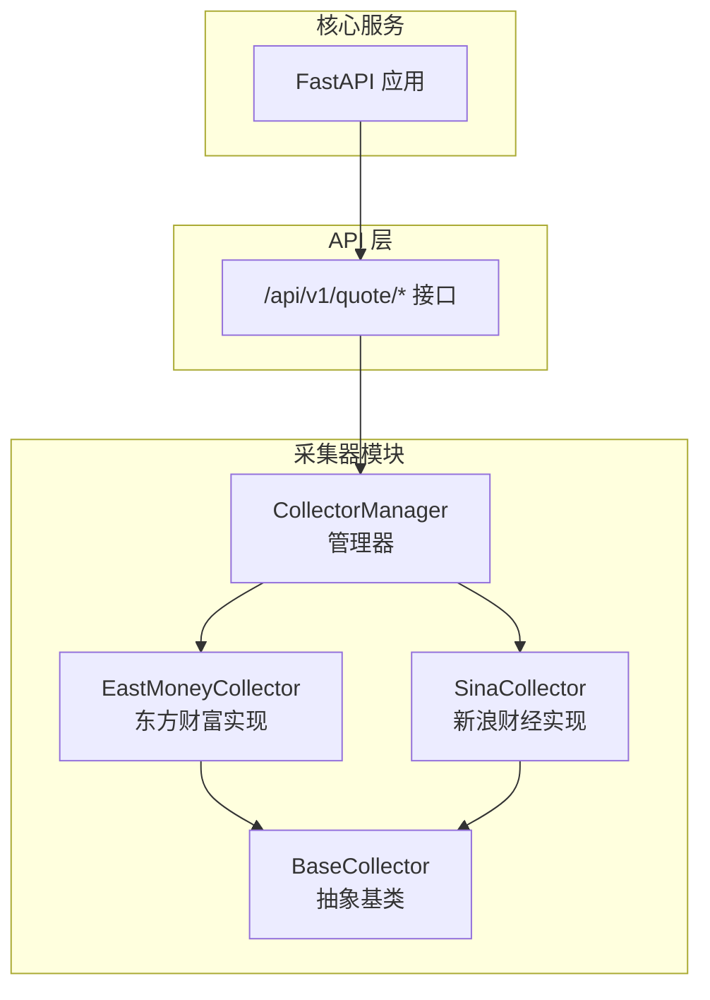
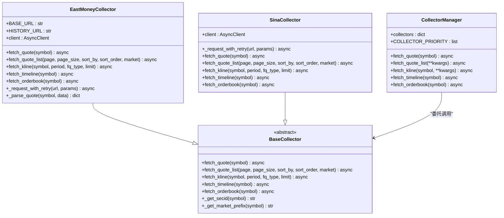
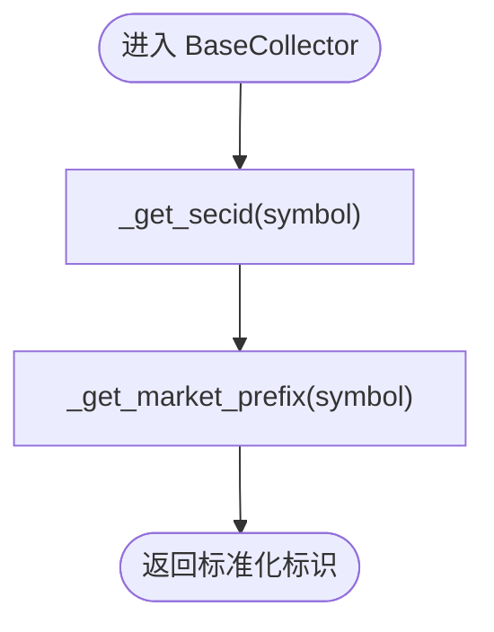
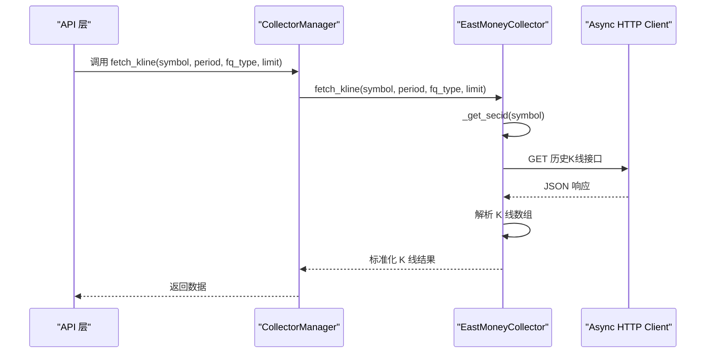
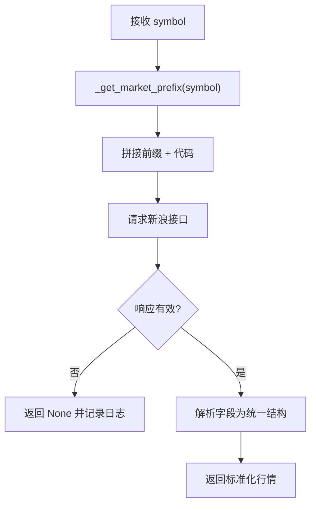
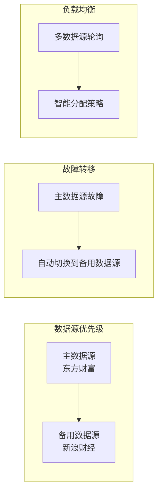
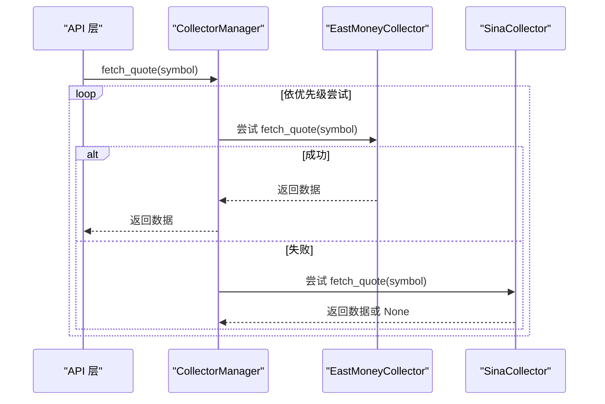
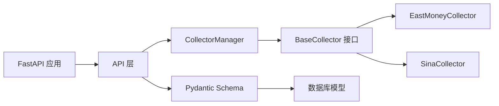

# 数据采集器架构

<cite>
**本文档引用的文件**
- [base.py](file://backend/app/services/collector/base.py)
- [eastmoney.py](file://backend/app/services/collector/eastmoney.py)
- [sina.py](file://backend/app/services/collector/sina.py)
- [manager.py](file://backend/app/services/collector/manager.py)
- [quote.py](file://backend/app/api/v1/quote.py)
- [schemas.py](file://backend/app/schemas/schemas.py)
- [models.py](file://backend/app/models/models.py)
- [main.py](file://backend/app/main.py)
</cite>

## 更新摘要
**变更内容**
- 数据采集器架构从单一数据源模式升级为多数据源冗余架构
- 新增 CollectorManager 管理器实现自动故障转移机制
- 优化了异常处理和重试策略，显著提升系统可靠性
- 完善了日志记录和错误报告机制
- 增强了数据源优先级管理和负载均衡能力

## 目录
1. [简介](#简介)
2. [项目结构](#项目结构)
3. [核心组件](#核心组件)
4. [架构概览](#架构概览)
5. [详细组件分析](#详细组件分析)
6. [多数据源冗余架构](#多数据源冗余架构)
7. [故障转移机制](#故障转移机制)
8. [性能优化策略](#性能优化策略)
9. [依赖关系分析](#依赖关系分析)
10. [最佳实践指南](#最佳实践指南)
11. [故障排查指南](#故障排查指南)
12. [结论](#结论)

## 简介
本文档系统化梳理了升级后的数据采集器整体架构与实现细节。数据采集器已从单一数据源模式发展为多数据源冗余架构，通过 CollectorManager 实现智能故障转移和负载均衡，显著提升了系统的可靠性和可用性。重点围绕抽象基类 BaseCollector 的设计理念与接口规范展开，涵盖 fetch_quote、fetch_quote_list、fetch_kline、fetch_timeline、fetch_orderbook 等核心方法的职责边界与参数约定，以及策略模式在多数据源场景下的应用方式。

## 项目结构
数据采集器位于后端服务的 collector 子模块中，采用"抽象基类 + 多实现 + 管理器"的分层设计：
- 抽象基类：定义统一接口与通用工具方法
- 具体实现：东方财富采集器与新浪财经采集器
- 管理器：负责多数据源的优先级调度与故障转移

**图表来源**
- [base.py:5-45](file://backend/app/services/collector/base.py#L5-L45)
- [eastmoney.py:26-40](file://backend/app/services/collector/eastmoney.py#L26-L40)
- [sina.py:24-35](file://backend/app/services/collector/sina.py#L24-L35)
- [manager.py:12-19](file://backend/app/services/collector/manager.py#L12-L19)
- [quote.py:1-65](file://backend/app/api/v1/quote.py#L1-L65)
- [main.py:39-43](file://backend/app/main.py#L39-L43)

**章节来源**
- [base.py:1-45](file://backend/app/services/collector/base.py#L1-L45)
- [eastmoney.py:1-297](file://backend/app/services/collector/eastmoney.py#L1-L297)
- [sina.py:1-312](file://backend/app/services/collector/sina.py#L1-L312)
- [manager.py:1-94](file://backend/app/services/collector/manager.py#L1-L94)
- [quote.py:1-65](file://backend/app/api/v1/quote.py#L1-L65)
- [main.py:1-48](file://backend/app/main.py#L1-L48)

## 核心组件
- **抽象基类 BaseCollector**：定义统一接口与通用工具方法，确保各具体实现遵循一致的数据格式与行为规范
- **东方财富采集器 EastMoneyCollector**：完整实现所有接口，负责实时行情、行情列表、K线、分时、盘口等数据抓取与标准化输出
- **新浪财经采集器 SinaCollector**：完整实现所有接口，提供备用数据源支持，增强系统冗余能力
- **采集器管理器 CollectorManager**：按优先级顺序尝试调用各采集器，实现自动故障转移与容错

**章节来源**
- [base.py:5-45](file://backend/app/services/collector/base.py#L5-L45)
- [eastmoney.py:26-297](file://backend/app/services/collector/eastmoney.py#L26-L297)
- [sina.py:24-312](file://backend/app/services/collector/sina.py#L24-L312)
- [manager.py:12-94](file://backend/app/services/collector/manager.py#L12-L94)

## 架构概览
整体采用策略模式：通过抽象基类约束接口，具体实现类提供不同数据源的适配逻辑，管理器负责选择与调度。升级后的架构优势在于：
- **多数据源冗余**：支持自动故障转移，避免单点故障
- **智能优先级管理**：可根据性能和可用性动态调整数据源优先级
- **统一数据格式**：各实现内部完成标准化转换，上层无需感知数据源差异
- **增强的错误处理**：完善的异常捕获和日志记录机制

**图表来源**
- [base.py:5-45](file://backend/app/services/collector/base.py#L5-L45)
- [eastmoney.py:26-68](file://backend/app/services/collector/eastmoney.py#L26-L68)
- [sina.py:24-62](file://backend/app/services/collector/sina.py#L24-L62)
- [manager.py:12-94](file://backend/app/services/collector/manager.py#L12-L94)

## 详细组件分析

### 抽象基类 BaseCollector 设计
- **接口职责**
  - fetch_quote：获取单只股票实时行情，返回标准化字典
  - fetch_quote_list：获取行情列表，支持分页、排序与市场过滤
  - fetch_kline：获取 K 线数据，支持周期与复权类型
  - fetch_timeline：获取分时数据
  - fetch_orderbook：获取盘口数据
- **工具方法**
  - _get_secid：将股票代码转换为东方财富 secid 格式
  - _get_market_prefix：根据代码前缀推断市场前缀（sh/sz）

**图表来源**
- [base.py:36-45](file://backend/app/services/collector/base.py#L36-L45)

**章节来源**
- [base.py:5-45](file://backend/app/services/collector/base.py#L5-L45)

### 东方财富采集器 EastMoneyCollector
- **实现策略**
  - 使用异步 HTTP 客户端访问多个接口，分别处理实时行情、行情列表、K线、分时、盘口
  - 在每个接口中完成数据解析与标准化，确保返回结构一致
  - 实现了完整的重试机制和异常处理
- **关键流程**
  - fetch_quote：构造 secid 参数，请求实时行情接口，解析响应并调用内部解析函数
  - fetch_quote_list：根据排序字段映射与市场过滤条件构造查询参数，解析列表项
  - fetch_kline：周期与复权类型映射，解析 K 线数组为标准条目
  - fetch_timeline：解析分时趋势数组，组装时间序列点
  - fetch_orderbook：解析买卖盘口数据，按层级组织
- **内部解析**
  - _parse_quote：将原始字段映射为统一的行情结构
- **重试机制**
  - _request_with_retry：实现最大重试次数和指数退避策略

**图表来源**
- [eastmoney.py:151-199](file://backend/app/services/collector/eastmoney.py#L151-L199)
- [manager.py:49-61](file://backend/app/services/collector/manager.py#L49-L61)

**章节来源**
- [eastmoney.py:26-297](file://backend/app/services/collector/eastmoney.py#L26-L297)

### 新浪财经采集器 SinaCollector
- **实现策略**
  - 完整实现所有接口，提供备用数据源支持
  - 实现了与东方财富相同的重试机制和异常处理
  - 通过市场前缀拼接代码，解析新浪接口返回的字符串数据
- **设计意图**
  - 作为主数据源的备份，确保系统高可用性
  - 展示策略模式的可插拔特性：当主数据源故障时自动切换到备用数据源

**图表来源**
- [sina.py:64-107](file://backend/app/services/collector/sina.py#L64-L107)

**章节来源**
- [sina.py:24-312](file://backend/app/services/collector/sina.py#L24-L312)

## 多数据源冗余架构
升级后的数据采集器采用了先进的多数据源冗余架构，通过 CollectorManager 实现智能数据源管理：

### 数据源优先级管理
- **优先级配置**：COLLECTOR_PRIORITY 列表定义了数据源的执行顺序
- **动态调整**：可根据性能监控结果动态调整优先级
- **负载均衡**：支持多数据源的负载分配策略

### 冗余设计原则
- **主备分离**：主要数据源负责日常请求，备用数据源提供故障转移
- **一致性保证**：所有数据源返回相同格式的数据结构
- **性能监控**：实时监控各数据源的响应时间和成功率

**章节来源**
- [manager.py:9-94](file://backend/app/services/collector/manager.py#L9-L94)

## 故障转移机制
CollectorManager 实现了完善的故障转移机制，确保系统在任何数据源故障时都能正常运行：

### 故障检测
- **异常捕获**：捕获所有数据源相关的异常
- **状态监控**：监控数据源的可用性和响应质量
- **健康检查**：定期检查数据源的健康状态

### 自动切换策略
- **优先级遍历**：按照预设优先级依次尝试数据源
- **空数据处理**：当数据源返回空数据时自动尝试下一个
- **失败记录**：记录每次失败的原因和时间

### 错误恢复
- **重试机制**：对临时性错误进行自动重试
- **降级策略**：在严重故障时提供降级数据
- **告警通知**：向运维团队发送故障告警

**图表来源**
- [manager.py:21-33](file://backend/app/services/collector/manager.py#L21-L33)

**章节来源**
- [manager.py:12-94](file://backend/app/services/collector/manager.py#L12-L94)

## 性能优化策略
升级后的数据采集器在性能方面进行了全面优化：

### 异步并发处理
- **异步 HTTP 客户端**：使用 httpx.AsyncClient 提升并发性能
- **连接池管理**：合理配置连接池大小避免资源浪费
- **超时控制**：为不同类型的操作设置合适的超时时间

### 缓存策略
- **内存缓存**：缓存热点数据减少重复请求
- **分布式缓存**：使用 Redis 存储共享缓存数据
- **缓存失效**：实现智能的缓存失效策略

### 请求优化
- **批量请求**：支持批量数据获取减少请求次数
- **压缩传输**：启用 gzip 压缩减少网络传输
- **CDN 加速**：利用 CDN 提升静态资源加载速度

### 监控指标
- **性能监控**：实时监控数据源响应时间
- **错误统计**：统计各类错误的发生频率
- **资源使用**：监控 CPU、内存、网络使用情况

**章节来源**
- [eastmoney.py:32-39](file://backend/app/services/collector/eastmoney.py#L32-L39)
- [sina.py:27-34](file://backend/app/services/collector/sina.py#L27-L34)

## 依赖关系分析
- **组件耦合**
  - API 层仅依赖 CollectorManager，不直接依赖具体实现，降低耦合度
  - CollectorManager 依赖 BaseCollector 接口，通过多态实现调度
- **外部依赖**
  - 异步 HTTP 客户端用于访问第三方数据接口
  - 日志模块用于异常与状态记录
  - Redis 用于缓存和会话存储
- **数据模型与格式**
  - Pydantic 模型定义了统一的响应结构，便于前后端契约一致

**图表来源**
- [quote.py:1-65](file://backend/app/api/v1/quote.py#L1-L65)
- [schemas.py:1-103](file://backend/app/schemas/schemas.py#L1-L103)
- [models.py:1-74](file://backend/app/models/models.py#L1-L74)
- [manager.py:12-94](file://backend/app/services/collector/manager.py#L12-L94)
- [main.py:39-43](file://backend/app/main.py#L39-L43)

**章节来源**
- [schemas.py:1-103](file://backend/app/schemas/schemas.py#L1-L103)
- [models.py:1-74](file://backend/app/models/models.py#L1-L74)

## 最佳实践指南
基于升级后的架构特点，推荐以下最佳实践：

### 数据源管理
- **多源并行**：同时维护多个数据源，避免单点故障
- **性能对比**：定期比较各数据源的性能指标
- **容量规划**：根据业务需求合理配置数据源数量

### 错误处理
- **分级处理**：区分可重试错误和不可重试错误
- **优雅降级**：在数据源故障时提供降级方案
- **用户提示**：向用户提供友好的错误提示信息

### 监控告警
- **实时监控**：建立完善的数据源监控体系
- **阈值设置**：为关键指标设置合理的告警阈值
- **故障演练**：定期进行故障转移演练

### 扩展性考虑
- **插件化设计**：支持新数据源的快速接入
- **配置管理**：通过配置文件管理数据源参数
- **版本控制**：对数据源接口进行版本管理

## 故障排查指南
- **常见问题**
  - 数据源不可用：检查网络连通性与第三方接口状态
  - 返回空数据：确认 symbol 是否正确、接口是否支持该功能
  - 格式不一致：核对采集器内部解析逻辑与字段映射
  - 故障转移失败：检查 CollectorManager 的配置和日志
- **排查步骤**
  - 查看日志：关注采集器与管理器的日志输出
  - 单元测试：针对关键接口编写测试用例验证返回结构
  - 性能分析：监控数据源的响应时间和成功率
  - 回退策略：临时调整优先级或禁用故障数据源
- **最佳实践**
  - 为每个接口提供默认值与边界检查
  - 对异常进行分类处理并记录上下文信息
  - 在 API 层对错误码进行统一包装，便于前端处理

**章节来源**
- [eastmoney.py:41-67](file://backend/app/services/collector/eastmoney.py#L41-L67)
- [sina.py:36-62](file://backend/app/services/collector/sina.py#L36-L62)
- [manager.py:28-33](file://backend/app/services/collector/manager.py#L28-L33)

## 结论
升级后的数据采集器架构以策略模式为核心，通过抽象基类统一接口与工具方法，结合 CollectorManager 的智能故障转移机制，实现了多数据源的高可用与可扩展性。EastMoneyCollector 和 SinaCollector 提供了完整的数据能力，形成了可靠的冗余架构。配合 API 层与 Pydantic 模型，形成从采集、调度到输出的一致性数据流。

新架构的核心优势包括：
- **高可用性**：多数据源冗余设计确保系统稳定运行
- **智能调度**：自动故障转移和负载均衡提升用户体验
- **可扩展性**：支持新数据源的快速接入和配置
- **可观测性**：完善的监控和日志记录机制
- **性能优化**：异步处理和缓存策略提升系统性能

未来可进一步引入智能学习算法进行数据源选择优化、增强机器学习预测能力，以及完善监控告警体系，持续提升系统的智能化水平和运维效率。