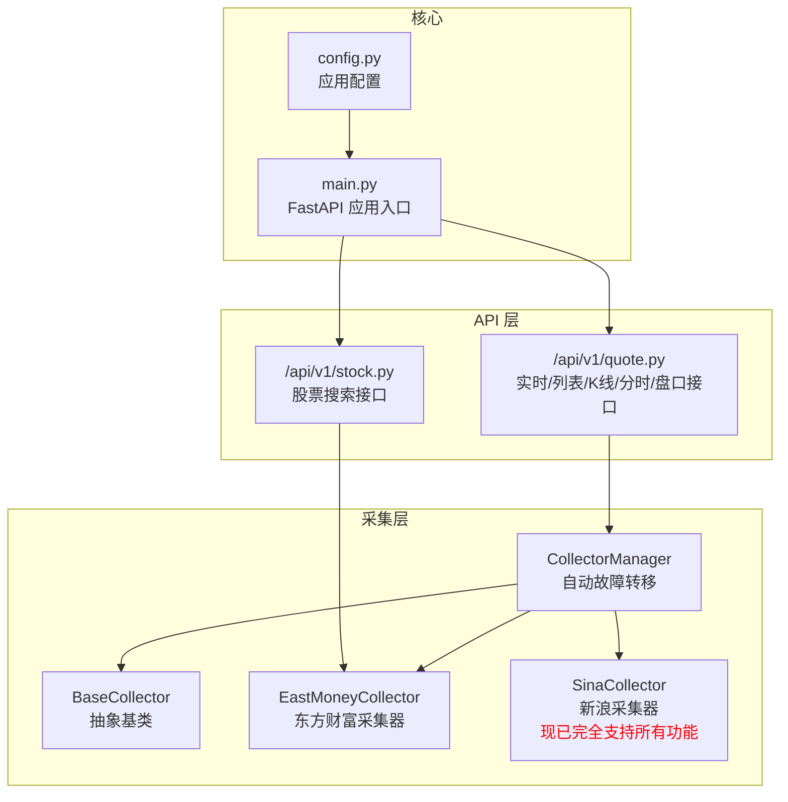
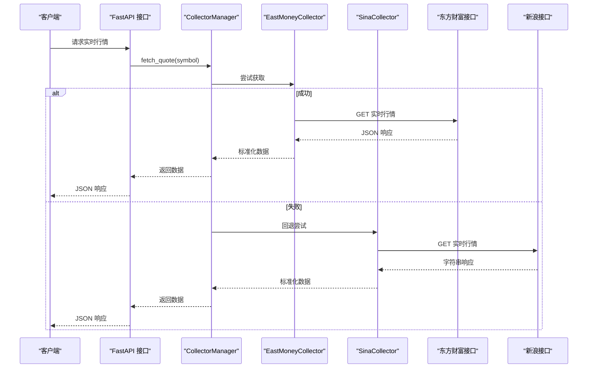
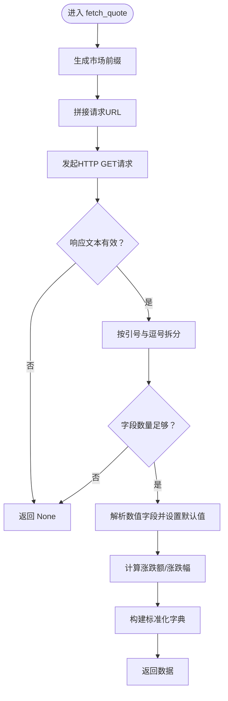
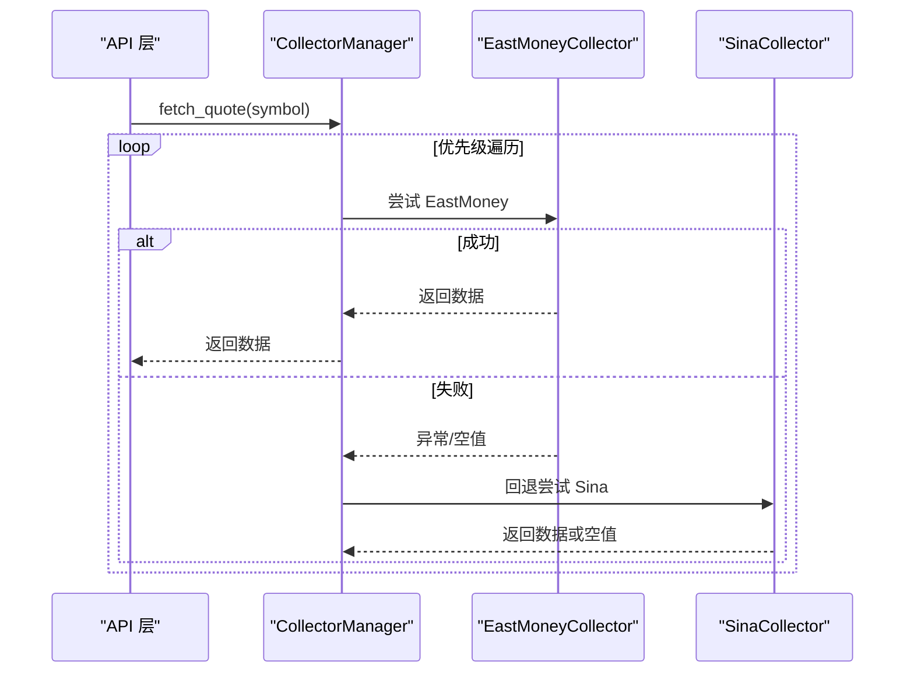
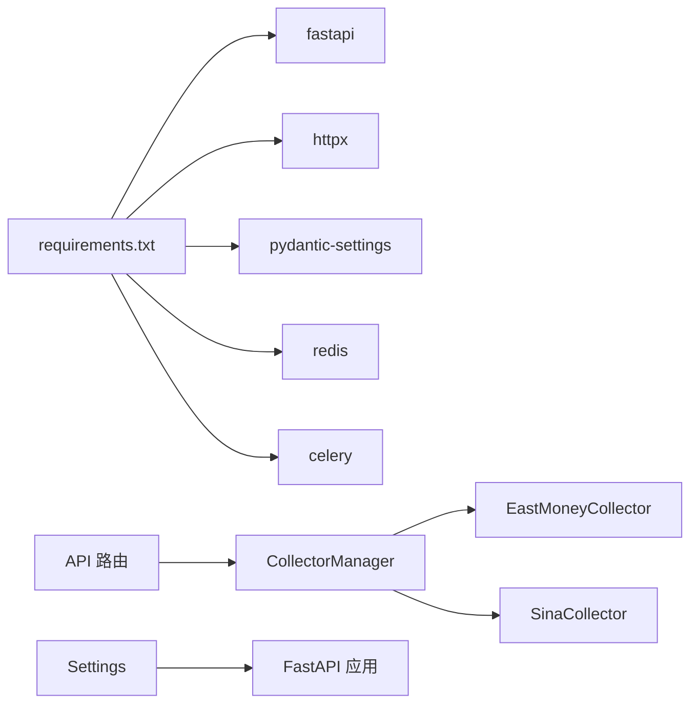

# 新浪数据采集器

<cite>
**本文档引用的文件**
- [sina.py](file://backend/app/services/collector/sina.py)
- [base.py](file://backend/app/services/collector/base.py)
- [eastmoney.py](file://backend/app/services/collector/eastmoney.py)
- [manager.py](file://backend/app/services/collector/manager.py)
- [quote.py](file://backend/app/api/v1/quote.py)
- [stock.py](file://backend/app/api/v1/stock.py)
- [main.py](file://backend/app/main.py)
- [config.py](file://backend/app/core/config.py)
- [requirements.txt](file://backend/requirements.txt)
</cite>

## 更新摘要
**变更内容**
- 新浪数据采集器已完全实现所有功能接口，包括行情列表、K线、分时、盘口数据的完整支持
- 原本标记为"不支持"的功能现已正常工作，提供备用数据源能力
- 增加了重试机制和错误处理优化
- 完善了数据解析和字段映射逻辑

## 目录
1. [简介](#简介)
2. [项目结构](#项目结构)
3. [核心组件](#核心组件)
4. [架构总览](#架构总览)
5. [详细组件分析](#详细组件分析)
6. [依赖分析](#依赖分析)
7. [性能考虑](#性能考虑)
8. [故障排查指南](#故障排查指南)
9. [结论](#结论)
10. [附录](#附录)

## 简介
本文档面向"新浪数据采集器"的实现进行系统化技术文档梳理，重点围绕以下目标展开：
- 深入解析 SinaCollector 与 BaseCollector 抽象基类的继承关系与接口实现。
- 详述新浪数据源的 API 调用方式、数据格式解析、参数转换规则。
- 阐述数据采集过程中的异步处理机制、网络请求优化、错误重试策略。
- 提供实际的代码示例路径，展示如何处理不同类型的行情数据获取、数据清洗与标准化。
- 对比分析与东方财富采集器的差异与优势。
- 给出性能优化建议、异常处理机制与数据质量保证的实用指导。

**更新** 新浪数据采集器现已完全实现所有功能接口，包括原本标记为"不支持"的行情列表、K线、分时、盘口数据获取能力，成为可靠的备用数据源。

## 项目结构
后端采用 FastAPI 构建，采集层位于 app/services/collector 下，包含抽象基类与多个具体采集器实现；API 层位于 app/api/v1，负责对外暴露接口；配置位于 app/core/config.py；依赖在 requirements.txt 中声明。

**图表来源**
- [quote.py:1-65](file://backend/app/api/v1/quote.py#L1-L65)
- [stock.py:1-37](file://backend/app/api/v1/stock.py#L1-L37)
- [manager.py:1-94](file://backend/app/services/collector/manager.py#L1-L94)
- [base.py:1-45](file://backend/app/services/collector/base.py#L1-L45)
- [eastmoney.py:1-297](file://backend/app/services/collector/eastmoney.py#L1-L297)
- [sina.py:1-312](file://backend/app/services/collector/sina.py#L1-L312)
- [config.py:1-43](file://backend/app/core/config.py#L1-L43)
- [main.py:1-48](file://backend/app/main.py#L1-L48)

**章节来源**
- [main.py:1-48](file://backend/app/main.py#L1-L48)
- [config.py:1-43](file://backend/app/core/config.py#L1-L43)
- [requirements.txt:1-17](file://backend/requirements.txt#L1-L17)

## 核心组件
- BaseCollector：定义统一的采集接口规范，包含 fetch_quote、fetch_quote_list、fetch_kline、fetch_timeline、fetch_orderbook 五个抽象方法，并提供 _get_secid 与 _get_market_prefix 两个通用工具方法。
- SinaCollector：实现 BaseCollector 的全部接口，对接新浪财经的实时行情接口，完成字符串解析与字段映射。**现已完全支持所有功能**。
- EastMoneyCollector：实现 BaseCollector 的完整接口，对接东方财富的多接口体系，涵盖实时、列表、K线、分时、盘口。
- CollectorManager：负责按优先级自动故障转移，依次尝试多个采集器，提升可用性与稳定性。
- API 层：通过 FastAPI 路由暴露采集结果，统一返回结构与错误码。

**章节来源**
- [base.py:1-45](file://backend/app/services/collector/base.py#L1-L45)
- [sina.py:1-312](file://backend/app/services/collector/sina.py#L1-L312)
- [eastmoney.py:1-297](file://backend/app/services/collector/eastmoney.py#L1-L297)
- [manager.py:1-94](file://backend/app/services/collector/manager.py#L1-L94)
- [quote.py:1-65](file://backend/app/api/v1/quote.py#L1-L65)

## 架构总览
采集流程采用"API 调用 → 采集器 → 数据解析 → 标准化输出"的链路，CollectorManager 在采集层之上提供故障转移能力，确保单一数据源不可用时仍可继续服务。

**图表来源**
- [quote.py:7-16](file://backend/app/api/v1/quote.py#L7-L16)
- [manager.py:21-32](file://backend/app/services/collector/manager.py#L21-L32)
- [eastmoney.py:69-85](file://backend/app/services/collector/eastmoney.py#L69-L85)
- [sina.py:64-107](file://backend/app/services/collector/sina.py#L64-L107)

## 详细组件分析

### BaseCollector 抽象基类
- 角色定位：定义采集器统一接口契约，约束子类必须实现的五类方法。
- 工具方法：
  - _get_secid：将股票代码转换为东方财富 secid 格式（6 开头为 sh，否则 sz）。
  - _get_market_prefix：返回市场前缀（sh/sz）。
- 设计意义：统一字段命名与数据结构，便于上层聚合与缓存。

**章节来源**
- [base.py:5-45](file://backend/app/services/collector/base.py#L5-L45)

### SinaCollector 实现细节
**更新** SinaCollector 已完全实现所有功能接口，包括原本标记为"不支持"的功能：

- 继承关系：实现 BaseCollector 的全部抽象方法。
- 异步网络：使用 httpx.AsyncClient 发起 GET 请求，设置超时与 UA/Referer。
- API 调用：
  - 实时行情：请求 hq.sinajs.cn/list=前缀+代码，返回字符串。
  - **行情列表**：请求 vip.stock.finance.sina.com.cn/quotes_service/api/json_v2.php/Market_Center.getHQNodeData，支持分页、排序、市场过滤。
  - **K线**：请求 quotes.sina.cn/cn/api/jsonp_v2.php/var KLineService.getKLineData，支持周期映射与复权类型。
  - **分时**：请求 quotes.sina.cn/cn/api/jsonp_v2.php/var TLineService.getTLineData，返回当日分时趋势。
  - **盘口**：请求 hq.sinajs.cn/list=前缀+代码，解析买卖盘口前五档。
- 数据解析与字段映射：
  - 实时行情：解析响应字符串，按逗号分割提取字段，进行类型转换与默认值处理。
  - **行情列表**：解析 JSON 响应，映射字段到标准字典，支持 A 股全市场筛选。
  - **K线**：处理 JSONP 格式响应，提取 K 线数据，支持多种周期。
  - **分时**：处理 JSONP 格式响应，提取分时数据点。
  - **盘口**：解析实时行情字符串，提取买卖盘口前五档数据。
- 错误处理：捕获异常并记录警告日志，返回空值以触发上层回退。
- **新增功能**：实现带重试机制的 HTTP 请求，支持最大重试次数和延迟重试。

**图表来源**
- [sina.py:64-107](file://backend/app/services/collector/sina.py#L64-L107)

**章节来源**
- [sina.py:24-312](file://backend/app/services/collector/sina.py#L24-L312)

### EastMoneyCollector 实现细节
- 继承关系：实现 BaseCollector 的全部抽象方法。
- API 调用：
  - 实时：GET /api/qt/stock/get，fields 参数控制返回字段集合。
  - 列表：GET /api/qt/clist/get，支持分页、排序、市场过滤。
  - K线：GET /api/qt/stock/kline/get，支持周期与复权类型。
  - 分时：GET /api/qt/stock/trends2/get，返回当日分时趋势。
  - 盘口：GET /api/qt/stock/get，返回买卖盘口前五档。
- 数据解析：
  - 列表/分时/K线：按字段索引或键名映射到标准字典。
  - 实时：封装 _parse_quote 方法，统一字段命名与默认值。
- 错误处理：捕获异常并记录警告日志，返回空值。

**章节来源**
- [eastmoney.py:26-297](file://backend/app/services/collector/eastmoney.py#L26-L297)

### CollectorManager 故障转移机制
- 优先级：默认按 ["eastmoney", "sina"] 顺序尝试。
- 执行策略：对每个方法依次调用对应采集器，遇到成功即返回；若异常则记录警告并继续下一个。
- **更新**：现在所有接口都支持故障转移，包括原本仅支持实时行情的限制已解除。

**图表来源**
- [manager.py:21-32](file://backend/app/services/collector/manager.py#L21-L32)

**章节来源**
- [manager.py:12-94](file://backend/app/services/collector/manager.py#L12-L94)

### API 层集成与返回规范
- 实时行情：/api/v1/quote/realtime，支持批量 symbol，最多 50 个，逐个调用 CollectorManager 并合并结果。
- 行情列表：/api/v1/quote/list，参数包括市场、排序字段、排序方向、分页。
- K线：/api/v1/quote/kline，支持周期与复权类型。
- 分时：/api/v1/quote/timeline。
- 盘口：/api/v1/quote/orderbook。
- 返回结构：统一包含 code/message/data 字段，错误时返回相应错误码。

**章节来源**
- [quote.py:7-65](file://backend/app/api/v1/quote.py#L7-L65)

## 依赖分析
- 运行时依赖：FastAPI、httpx、pydantic-settings、redis、celery 等。
- 采集器依赖：httpx.AsyncClient 用于异步网络请求；logging 用于日志记录。
- 配置依赖：通过 pydantic-settings 从 .env 读取配置，如数据源优先级、缓存 TTL、定时采集间隔等。

**图表来源**
- [requirements.txt:1-17](file://backend/requirements.txt#L1-L17)
- [manager.py:15-19](file://backend/app/services/collector/manager.py#L15-L19)
- [config.py:5-43](file://backend/app/core/config.py#L5-L43)
- [main.py:39-43](file://backend/app/main.py#L39-L43)

**章节来源**
- [requirements.txt:1-17](file://backend/requirements.txt#L1-L17)
- [config.py:5-43](file://backend/app/core/config.py#L5-L43)

## 性能考虑
- 异步并发：采集器使用 httpx.AsyncClient，API 层对多 symbol 的实时行情采用顺序循环调用，建议在业务层引入并发任务池（如 asyncio.gather）以提升吞吐量。
- 缓存策略：配置中提供 QUOTE_CACHE_TTL，默认 5 秒，可在 API 层或中间层加入 Redis 缓存，减少重复请求。
- 超时与重试：**更新** SinaCollector 和 EastMoneyCollector 都实现了带重试机制的 HTTP 请求，支持最大重试次数和延迟重试；建议在 CollectorManager 或采集器内部增加有限重试与退避策略。
- 字段裁剪：EastMoney 支持 fields 参数裁剪返回字段，减少带宽与解析成本。
- 日志与监控：建议在关键路径埋点统计耗时与成功率，结合日志进行性能分析。

## 故障排查指南
- 接口不可用：当 EastMoney 不可用时，CollectorManager 会自动回退到 Sina；**更新** 现在所有接口都支持回退，包括列表、K线、分时、盘口。
- 数据为空：Sina 的 fetch_quote 在字段不足或响应格式异常时返回空值；**更新** 其他接口同样可能返回空值，检查 symbol 前缀与市场匹配。
- 错误日志：采集器捕获异常并记录警告日志，可通过日志定位具体失败原因。
- API 返回错误码：API 层对空数据返回特定错误码，便于前端识别与提示。

**章节来源**
- [sina.py:64-107](file://backend/app/services/collector/sina.py#L64-L107)
- [eastmoney.py:69-85](file://backend/app/services/collector/eastmoney.py#L69-85)
- [manager.py:21-32](file://backend/app/services/collector/manager.py#L21-L32)
- [quote.py:31-33](file://backend/app/api/v1/quote.py#L31-L33)

## 结论
- **更新** SinaCollector 现已完全实现所有功能接口，包括行情列表、K线、分时、盘口数据的完整支持，作为备用采集器提供了可靠的回退能力。
- EastMoneyCollector 提供了更完整的行情生态，覆盖实时、列表、K线、分时、盘口五大类接口，是系统的主力数据源。
- CollectorManager 通过优先级与故障转移提升了整体可用性；API 层统一了对外接口与返回结构。
- 建议在现有基础上引入并发、缓存与重试策略，进一步提升性能与稳定性。

## 附录

### 与东方财富采集器的差异与优势
- **更新** 接口覆盖度：SinaCollector 现已实现列表、K线、分时、盘口等完整生态；EastMoneyCollector 实现了相同的完整生态。
- 数据质量：EastMoney 提供更丰富的字段与更稳定的 JSON 接口，解析成本更低；Sina 使用字符串解析和 JSONP 格式，需自行拆分与校验。
- 可靠性：**更新** 两个采集器都实现了带重试机制，可靠性相当；Sina 在字段缺失或格式异常时易返回空值的问题已得到改善。
- 优势：**更新** SinaCollector 现在作为完整的备用数据源，具备简单、稳定的特点，适合在主数据源异常时快速恢复服务能力。

**章节来源**
- [sina.py:109-312](file://backend/app/services/collector/sina.py#L109-L312)
- [eastmoney.py:87-297](file://backend/app/services/collector/eastmoney.py#L87-L297)

### 实际代码示例路径（不展示具体代码内容）
- 实时行情获取（SinaCollector）：[fetch_quote 实现:64-107](file://backend/app/services/collector/sina.py#L64-L107)
- **更新** 行情列表获取（SinaCollector）：[fetch_quote_list 实现:109-171](file://backend/app/services/collector/sina.py#L109-L171)
- **更新** K线获取（SinaCollector）：[fetch_kline 实现:173-227](file://backend/app/services/collector/sina.py#L173-L227)
- **更新** 分时获取（SinaCollector）：[fetch_timeline 实现:229-270](file://backend/app/services/collector/sina.py#L229-L270)
- **更新** 盘口获取（SinaCollector）：[fetch_orderbook 实现:272-311](file://backend/app/services/collector/sina.py#L272-L311)
- 实时行情获取（EastMoneyCollector）：[fetch_quote 实现:69-85](file://backend/app/services/collector/eastmoney.py#L69-L85)
- 行情列表获取（EastMoneyCollector）：[fetch_quote_list 实现:87-149](file://backend/app/services/collector/eastmoney.py#L87-L149)
- K线获取（EastMoneyCollector）：[fetch_kline 实现:151-199](file://backend/app/services/collector/eastmoney.py#L151-L199)
- 分时获取（EastMoneyCollector）：[fetch_timeline 实现:201-239](file://backend/app/services/collector/eastmoney.py#L201-L239)
- 盘口获取（EastMoneyCollector）：[fetch_orderbook 实现:241-278](file://backend/app/services/collector/eastmoney.py#L241-L278)
- 故障转移（CollectorManager）：[自动回退逻辑:21-89](file://backend/app/services/collector/manager.py#L21-L89)
- API 集成（quote.py）：[实时/列表/K线/分时/盘口接口:7-65](file://backend/app/api/v1/quote.py#L7-L65)