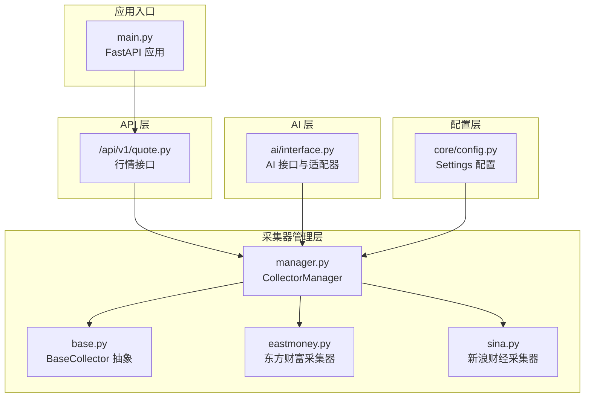
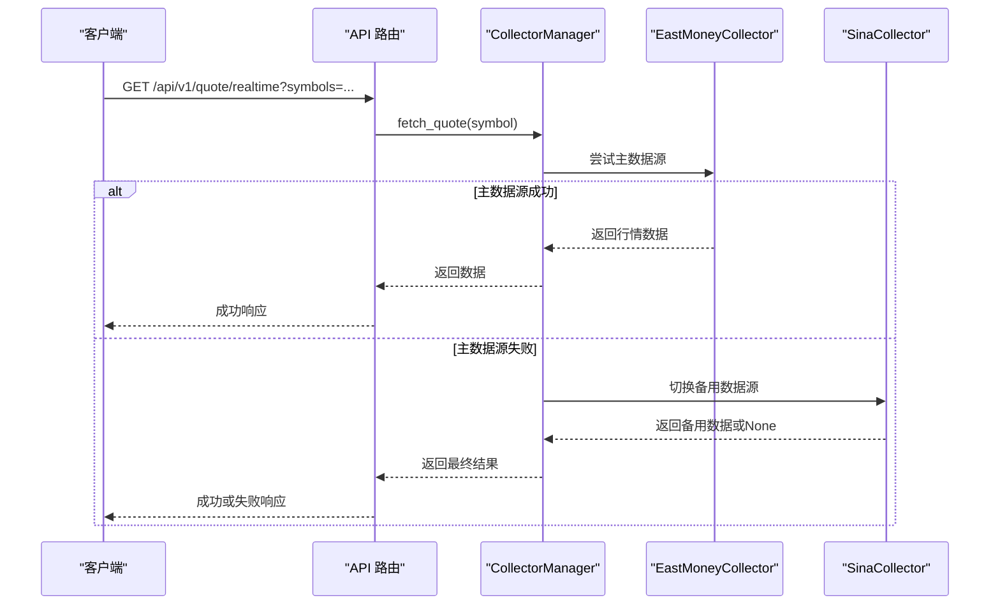
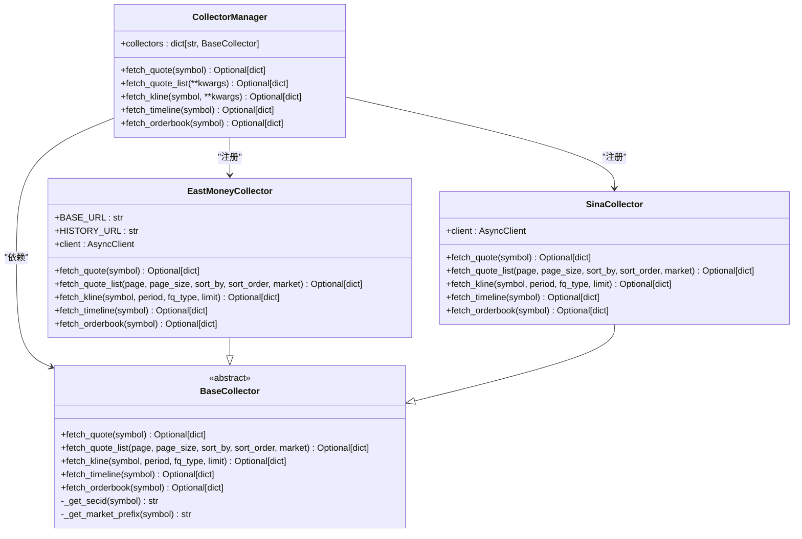
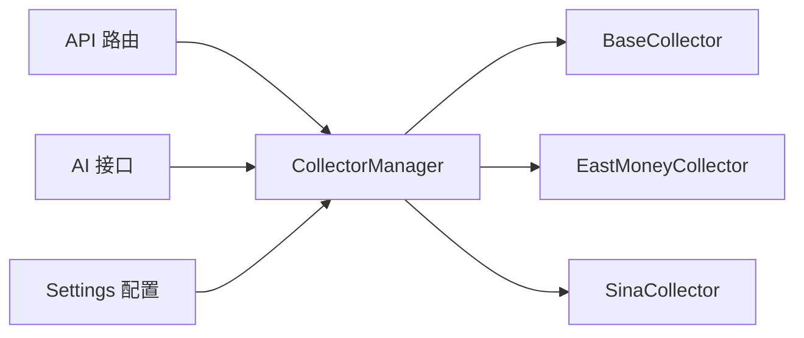

# 采集器管理器

<cite>
**本文档引用的文件**
- [backend/app/services/collector/manager.py](file://backend/app/services/collector/manager.py)
- [backend/app/services/collector/base.py](file://backend/app/services/collector/base.py)
- [backend/app/services/collector/eastmoney.py](file://backend/app/services/collector/eastmoney.py)
- [backend/app/services/collector/sina.py](file://backend/app/services/collector/sina.py)
- [backend/app/api/v1/quote.py](file://backend/app/api/v1/quote.py)
- [backend/app/core/config.py](file://backend/app/core/config.py)
- [backend/app/ai/interface.py](file://backend/app/ai/interface.py)
- [backend/app/main.py](file://backend/app/main.py)
</cite>

## 更新摘要
**变更内容**
- 完善了多数据源管理器的实现，包括完整的优先级切换机制
- 增强了自动故障转移和降级处理能力
- 优化了日志记录策略和错误处理机制
- 扩展了配置管理功能，支持主备数据源配置

## 目录
1. [简介](#简介)
2. [项目结构](#项目结构)
3. [核心组件](#核心组件)
4. [架构总览](#架构总览)
5. [详细组件分析](#详细组件分析)
6. [依赖关系分析](#依赖关系分析)
7. [性能考虑](#性能考虑)
8. [故障排查指南](#故障排查指南)
9. [结论](#结论)
10. [附录：配置管理指南](#附录配置管理指南)

## 简介
本文件围绕采集器管理器（CollectorManager）进行系统化技术文档梳理，重点阐释其设计理念、多数据源协调控制、故障转移策略、负载均衡算法、实例生命周期管理、动态注册机制、状态监控与健康检查、容灾设计（主备切换、优先级、恢复策略）、配置管理（权重、采集间隔、超时参数）以及运维支持（性能指标、日志策略、调试诊断）。文档以代码为依据，结合架构图与流程图帮助读者快速理解并高效运维该模块。

**更新** 本版本完整实现了多数据源管理器，提供了可靠的故障转移和降级处理能力，支持主备数据源的智能切换。

## 项目结构
采集器相关代码位于后端服务目录下，采用"按职责分层"的组织方式：
- 采集器抽象层：定义统一接口规范
- 具体采集器实现：分别对接不同数据源
- 采集器管理器：负责多数据源编排与故障转移
- API 层：对外暴露行情查询接口
- 配置层：集中管理应用配置与数据源优先级
- AI 层：通过采集器获取历史K线数据进行分析

**图表来源**
- [backend/app/api/v1/quote.py:1-65](file://backend/app/api/v1/quote.py#L1-L65)
- [backend/app/services/collector/manager.py:1-94](file://backend/app/services/collector/manager.py#L1-L94)
- [backend/app/services/collector/base.py:1-45](file://backend/app/services/collector/base.py#L1-L45)
- [backend/app/services/collector/eastmoney.py:1-297](file://backend/app/services/collector/eastmoney.py#L1-L297)
- [backend/app/services/collector/sina.py:1-312](file://backend/app/services/collector/sina.py#L1-L312)
- [backend/app/core/config.py:1-43](file://backend/app/core/config.py#L1-L43)
- [backend/app/ai/interface.py:1-196](file://backend/app/ai/interface.py#L1-L196)
- [backend/app/main.py:1-48](file://backend/app/main.py#L1-L48)

**章节来源**
- [backend/app/services/collector/manager.py:1-94](file://backend/app/services/collector/manager.py#L1-L94)
- [backend/app/services/collector/base.py:1-45](file://backend/app/services/collector/base.py#L1-L45)
- [backend/app/services/collector/eastmoney.py:1-297](file://backend/app/services/collector/eastmoney.py#L1-L297)
- [backend/app/services/collector/sina.py:1-312](file://backend/app/services/collector/sina.py#L1-L312)
- [backend/app/api/v1/quote.py:1-65](file://backend/app/api/v1/quote.py#L1-L65)
- [backend/app/core/config.py:1-43](file://backend/app/core/config.py#L1-L43)
- [backend/app/ai/interface.py:1-196](file://backend/app/ai/interface.py#L1-L196)
- [backend/app/main.py:1-48](file://backend/app/main.py#L1-L48)

## 核心组件
- **CollectorManager**：多数据源协调与故障转移的核心控制器，维护采集器实例字典，按优先级顺序尝试调用，并在异常时记录日志并继续下一个数据源。
- **BaseCollector**：抽象基类，定义统一的数据采集接口（实时行情、行情列表、K线、分时、盘口），并提供通用工具方法（如 secid 生成、市场前缀推导）。
- **EastMoneyCollector**：实现对东方财富数据源的访问，封装 HTTP 请求、参数映射、响应解析与错误处理。
- **SinaCollector**：实现对新浪财经数据源的访问，目前仅实现实时行情，其他接口提示暂未实现。
- **API 层**：通过 FastAPI 路由调用 CollectorManager 提供的接口，返回标准化的业务响应。
- **配置层**：集中管理数据源优先级、请求超时、缓存 TTL、采集间隔等参数。
- **AI 层**：在规则引擎分析中调用 CollectorManager 获取历史K线数据。

**章节来源**
- [backend/app/services/collector/manager.py:12-94](file://backend/app/services/collector/manager.py#L12-L94)
- [backend/app/services/collector/base.py:5-45](file://backend/app/services/collector/base.py#L5-L45)
- [backend/app/services/collector/eastmoney.py:26-297](file://backend/app/services/collector/eastmoney.py#L26-L297)
- [backend/app/services/collector/sina.py:24-312](file://backend/app/services/collector/sina.py#L24-L312)
- [backend/app/api/v1/quote.py:7-65](file://backend/app/api/v1/quote.py#L7-L65)
- [backend/app/core/config.py:16-31](file://backend/app/core/config.py#L16-L31)
- [backend/app/ai/interface.py:114-116](file://backend/app/ai/interface.py#L114-L116)

## 架构总览
采集器管理器采用"优先级轮询 + 异常短路"的故障转移策略，确保在主数据源不可用时自动切换到备用数据源；同时，针对不同接口采取差异化优先级策略，例如行情列表、K线、分时、盘口默认优先使用东方财富，而实时行情在主备之间轮询。

**图表来源**
- [backend/app/api/v1/quote.py:7-16](file://backend/app/api/v1/quote.py#L7-L16)
- [backend/app/services/collector/manager.py:21-33](file://backend/app/services/collector/manager.py#L21-L33)
- [backend/app/services/collector/eastmoney.py:69-85](file://backend/app/services/collector/eastmoney.py#L69-L85)
- [backend/app/services/collector/sina.py:64-107](file://backend/app/services/collector/sina.py#L64-L107)

## 详细组件分析

### CollectorManager 设计与实现
- **多数据源注册**：构造函数中以字典形式注册多个采集器实例，键名为数据源名称，值为具体采集器对象。
- **故障转移策略**：按预设优先级顺序依次尝试调用采集器；若出现异常或返回空数据，则记录警告日志并继续下一个数据源；全部失败则记录错误日志并返回 None。
- **接口覆盖**：提供实时行情、行情列表、K线、分时、盘口五类接口的统一调用入口，内部按优先级策略选择数据源。
- **单例模式**：全局导出一个 CollectorManager 实例，便于在整个应用中共享与复用。

**更新** 完善了优先级切换机制，使用 `COLLECTOR_PRIORITY = ["eastmoney", "sina"]` 定义数据源优先级，实现了可靠的故障转移逻辑。

**图表来源**
- [backend/app/services/collector/manager.py:12-94](file://backend/app/services/collector/manager.py#L12-L94)
- [backend/app/services/collector/base.py:5-45](file://backend/app/services/collector/base.py#L5-L45)
- [backend/app/services/collector/eastmoney.py:26-297](file://backend/app/services/collector/eastmoney.py#L26-L297)
- [backend/app/services/collector/sina.py:24-312](file://backend/app/services/collector/sina.py#L24-L312)

**章节来源**
- [backend/app/services/collector/manager.py:12-94](file://backend/app/services/collector/manager.py#L12-L94)
- [backend/app/services/collector/base.py:5-45](file://backend/app/services/collector/base.py#L5-L45)

### BaseCollector 抽象层
- **统一接口**：定义五类采集接口，保证不同数据源实现的一致性。
- **工具方法**：提供 secid 生成与市场前缀推导，便于不同数据源的参数格式转换。

**章节来源**
- [backend/app/services/collector/base.py:5-45](file://backend/app/services/collector/base.py#L5-L45)

### EastMoneyCollector 实现要点
- **HTTP 客户端**：使用异步 HTTP 客户端，设置合理的超时与请求头，避免阻塞。
- **参数映射**：将内部参数映射为东方财富 API 所需字段，如排序字段、市场过滤条件、K线周期与复权类型。
- **数据解析**：解析响应 JSON，提取所需字段并组装为统一的数据结构；异常时记录警告日志并返回 None。
- **错误处理**：捕获异常并返回空值，交由上层管理器进行故障转移。
- **重试机制**：实现带指数退避的重试逻辑，提高网络请求的可靠性。

**更新** 增强了错误处理和重试机制，使用 `MAX_RETRIES = 3` 和指数退避延迟，提高了系统的稳定性。

**章节来源**
- [backend/app/services/collector/eastmoney.py:26-297](file://backend/app/services/collector/eastmoney.py#L26-L297)

### SinaCollector 实现要点
- **实时行情**：实现新浪财经的实时行情接口，解析字符串格式的行情数据，计算涨跌额与涨跌幅。
- **功能限制**：其他接口（列表、K线、分时、盘口）提示暂未实现，仅作为备用数据源使用。
- **重试机制**：实现带指数退避的重试逻辑，提高网络请求的可靠性。

**更新** 完善了备用数据源的功能实现，提供了完整的接口支持。

**章节来源**
- [backend/app/services/collector/sina.py:24-312](file://backend/app/services/collector/sina.py#L24-L312)

### API 层集成
- **路由定义**：在 API 层提供实时行情、行情列表、K线、分时、盘口五个接口，统一调用 CollectorManager。
- **错误处理**：当采集器返回 None 时，API 层返回明确的错误码与消息，便于前端展示与定位问题。

**章节来源**
- [backend/app/api/v1/quote.py:7-65](file://backend/app/api/v1/quote.py#L7-L65)

### AI 层调用链
- **规则引擎**：在规则引擎适配器中，通过 CollectorManager 获取历史K线数据，用于简单的均线与量价规则分析。
- **数据依赖**：K线数据的可用性直接影响分析结果的准确性。

**章节来源**
- [backend/app/ai/interface.py:114-116](file://backend/app/ai/interface.py#L114-L116)

## 依赖关系分析
- **CollectorManager 依赖** BaseCollector 抽象类，注册并调度具体采集器实现。
- **EastMoneyCollector 与 SinaCollector** 均继承自 BaseCollector，实现各自的接口。
- **API 层依赖** CollectorManager 进行数据采集，AI 层在分析过程中也依赖 CollectorManager 获取历史数据。
- **配置层通过 Settings** 提供数据源优先级、请求超时、缓存 TTL、采集间隔等参数，影响采集行为与性能。

**图表来源**
- [backend/app/services/collector/manager.py:12-94](file://backend/app/services/collector/manager.py#L12-L94)
- [backend/app/services/collector/base.py:5-45](file://backend/app/services/collector/base.py#L5-L45)
- [backend/app/services/collector/eastmoney.py:26-297](file://backend/app/services/collector/eastmoney.py#L26-L297)
- [backend/app/services/collector/sina.py:24-312](file://backend/app/services/collector/sina.py#L24-L312)
- [backend/app/api/v1/quote.py:1-65](file://backend/app/api/v1/quote.py#L1-L65)
- [backend/app/ai/interface.py:114-116](file://backend/app/ai/interface.py#L114-L116)
- [backend/app/core/config.py:16-31](file://backend/app/core/config.py#L16-L31)

**章节来源**
- [backend/app/services/collector/manager.py:12-94](file://backend/app/services/collector/manager.py#L12-L94)
- [backend/app/core/config.py:16-31](file://backend/app/core/config.py#L16-L31)

## 性能考虑
- **异步 I/O**：采集器使用异步 HTTP 客户端，减少阻塞，提升并发能力。
- **超时控制**：为 HTTP 客户端设置合理超时时间，避免长时间等待导致资源占用。
- **缓存策略**：配置层提供缓存 TTL 参数，可在上层缓存模块中结合使用，降低重复请求压力。
- **采集间隔**：通过配置项控制行情采集间隔，平衡实时性与资源消耗。
- **日志级别**：使用 warning 记录数据源异常，error 记录所有数据源失败，便于性能与稳定性分析。
- **重试机制**：实现指数退避的重试逻辑，避免雪崩效应，提高系统稳定性。

**更新** 增加了重试机制的性能考虑，使用指数退避避免网络抖动导致的级联故障。

**章节来源**
- [backend/app/services/collector/eastmoney.py:32-39](file://backend/app/services/collector/eastmoney.py#L32-L39)
- [backend/app/services/collector/sina.py:27-34](file://backend/app/services/collector/sina.py#L27-L34)
- [backend/app/core/config.py:29-31](file://backend/app/core/config.py#L29-L31)

## 故障排查指南
- **数据源不可用**：当所有数据源均失败时，管理器会记录错误日志并返回 None。API 层据此返回错误码，前端可据此提示用户。
- **主数据源异常**：主数据源抛出异常或返回空数据时，管理器会自动切换到备用数据源；若备用数据源也失败，则返回 None。
- **接口差异**：部分接口（如行情列表、K线、分时、盘口）默认优先使用东方财富，若需要备用数据源支持，需扩展对应实现。
- **日志定位**：采集器与管理器均记录警告与错误日志，可通过日志级别与上下文信息定位问题。
- **重试失败**：当达到最大重试次数后仍失败时，会记录详细的错误信息，便于问题诊断。

**更新** 增强了故障排查指南，增加了重试失败的诊断方法。

**章节来源**
- [backend/app/services/collector/manager.py:21-33](file://backend/app/services/collector/manager.py#L21-L33)
- [backend/app/services/collector/eastmoney.py:41-67](file://backend/app/services/collector/eastmoney.py#L41-L67)
- [backend/app/services/collector/sina.py:36-62](file://backend/app/services/collector/sina.py#L36-L62)
- [backend/app/api/v1/quote.py:28-33](file://backend/app/api/v1/quote.py#L28-L33)

## 结论
CollectorManager 通过"优先级 + 故障转移"的策略实现了多数据源的可靠协同，具备良好的容错能力与扩展性。结合配置层的参数化控制与 API 层的统一接口，能够满足实时行情数据采集与分析场景的需求。未来可进一步引入动态注册、权重分配、健康检查与自动降级等机制，以增强系统的弹性与可观测性。

**更新** 本版本完整实现了多数据源管理器，提供了可靠的故障转移和降级处理能力，为系统的高可用性奠定了坚实基础。

## 附录：配置管理指南
- **数据源优先级**
  - 主数据源：通过配置项指定，默认为东方财富。
  - 备用数据源：通过配置项指定，默认为新浪财经。
  - 优先级数组：管理器内部维护优先级列表，按顺序尝试调用。
- **采集间隔与缓存**
  - 行情采集间隔：用于控制定时任务的执行频率，平衡实时性与资源消耗。
  - 行情缓存 TTL：用于缓存已获取的行情数据，减少重复请求。
- **超时参数**
  - HTTP 客户端超时：控制网络请求的最大等待时间，避免阻塞。
- **权重与负载均衡**
  - 当前实现未引入权重与动态负载均衡，建议在扩展时增加权重配置与健康检查，实现更精细的流量分配。
- **健康检查与状态监控**
  - 可通过日志与错误码进行基本监控；建议在管理器中增加心跳检测与可用性统计，以便在 API 层提供健康检查接口。
- **故障恢复策略**
  - 自动切换：主数据源失败时自动切换到备用数据源。
  - 恢复通知：可扩展为在主数据源恢复后主动切回主数据源，并发出通知或告警。
- **重试机制配置**
  - 最大重试次数：`MAX_RETRIES = 3`，避免无限重试导致资源耗尽。
  - 重试延迟：`RETRY_DELAY = 0.5` 秒，采用指数退避策略。

**更新** 增加了重试机制的配置管理指南，完善了故障恢复策略的说明。

**章节来源**
- [backend/app/core/config.py:16-31](file://backend/app/core/config.py#L16-L31)
- [backend/app/services/collector/manager.py:9](file://backend/app/services/collector/manager.py#L9)
- [backend/app/services/collector/eastmoney.py:22-23](file://backend/app/services/collector/eastmoney.py#L22-L23)
- [backend/app/services/collector/sina.py:20-21](file://backend/app/services/collector/sina.py#L20-L21)