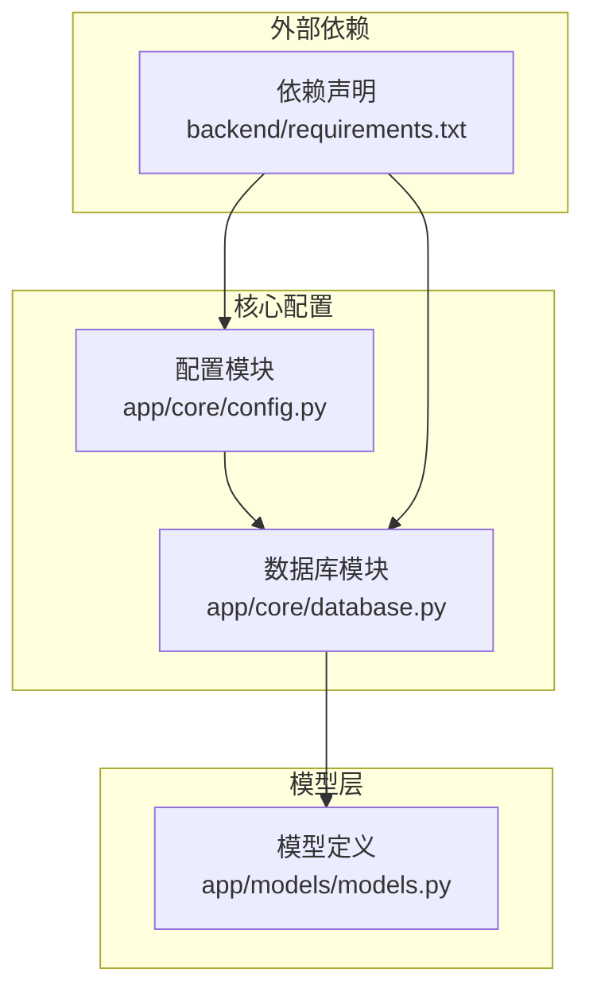
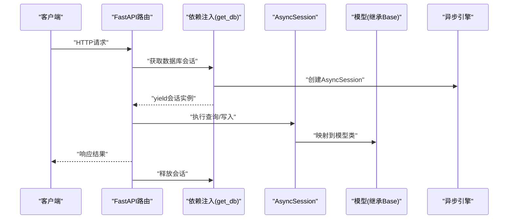
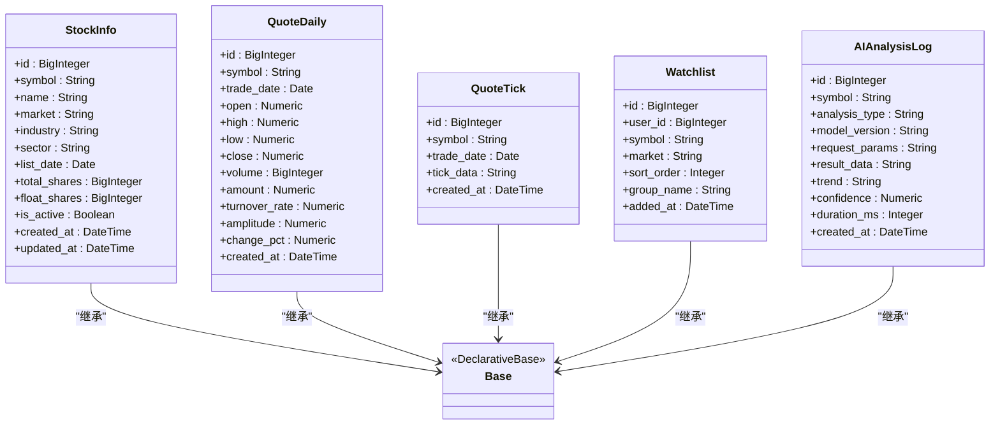
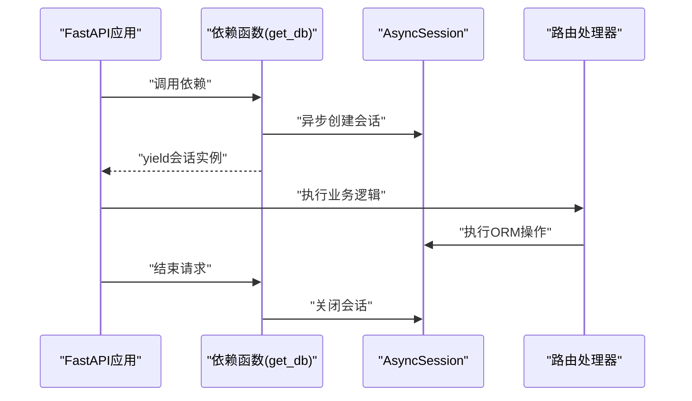
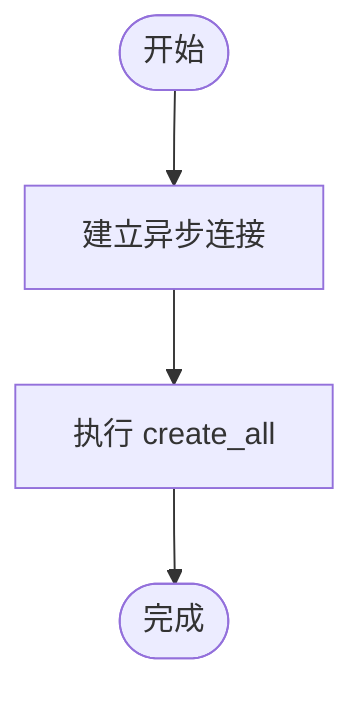
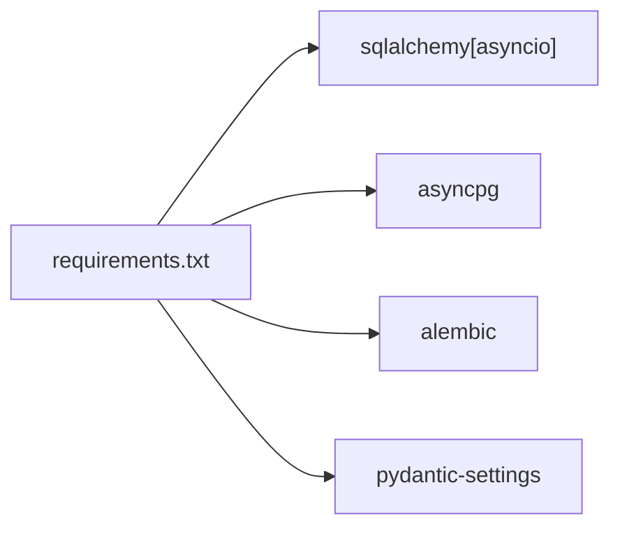

# ORM与SQLAlchemy配置

<cite>
**本文引用的文件**
- [backend/app/core/database.py](file://backend/app/core/database.py)
- [backend/app/models/models.py](file://backend/app/models/models.py)
- [backend/app/core/config.py](file://backend/app/core/config.py)
- [backend/requirements.txt](file://backend/requirements.txt)
</cite>

## 目录
1. [简介](#简介)
2. [项目结构](#项目结构)
3. [核心组件](#核心组件)
4. [架构总览](#架构总览)
5. [详细组件分析](#详细组件分析)
6. [依赖分析](#依赖分析)
7. [性能考虑](#性能考虑)
8. [故障排查指南](#故障排查指南)
9. [结论](#结论)
10. [附录](#附录)

## 简介
本文件系统性梳理Stock-View后端在SQLAlchemy 2.0上的异步ORM配置与使用模式，覆盖以下主题：
- 异步引擎与会话配置
- 模型基类设计与继承方式
- 数据库初始化与元数据管理
- 常见ORM查询实践（关系、联表、聚合、分页）
- 运维操作（初始化、建表、迁移）建议
- 异步事务与错误处理最佳实践

## 项目结构
后端采用按功能域分层的组织方式：核心配置与数据库连接位于core目录，模型定义位于models目录；异步数据库配置集中在core/database.py，模型类统一继承自Base。

**图表来源**
- [backend/app/core/database.py:1-25](file://backend/app/core/database.py#L1-L25)
- [backend/app/models/models.py:1-74](file://backend/app/models/models.py#L1-L74)
- [backend/app/core/config.py:1-43](file://backend/app/core/config.py#L1-L43)
- [backend/requirements.txt:1-17](file://backend/requirements.txt#L1-L17)

**章节来源**
- [backend/app/core/database.py:1-25](file://backend/app/core/database.py#L1-L25)
- [backend/app/models/models.py:1-74](file://backend/app/models/models.py#L1-L74)
- [backend/app/core/config.py:1-43](file://backend/app/core/config.py#L1-L43)
- [backend/requirements.txt:1-17](file://backend/requirements.txt#L1-L17)

## 核心组件
- 配置中心：通过Pydantic Settings加载环境变量，集中管理DATABASE_URL、调试开关等。
- 异步引擎与会话：使用create_async_engine创建异步连接池，async_sessionmaker生成AsyncSession工厂。
- 模型基类：自定义Base类继承DeclarativeBase，所有模型统一继承该基类以共享元数据与命名约定。
- 数据库初始化：init_db通过异步连接执行metadata.create_all，完成表结构创建。
- 依赖注入：get_db提供FastAPI依赖，确保请求生命周期内正确创建与关闭会话。

**章节来源**
- [backend/app/core/config.py:5-43](file://backend/app/core/config.py#L5-L43)
- [backend/app/core/database.py:1-25](file://backend/app/core/database.py#L1-L25)
- [backend/app/models/models.py:1-74](file://backend/app/models/models.py#L1-L74)

## 架构总览
下图展示异步ORM在Stock-View中的整体调用链：配置加载 → 创建异步引擎 → 会话工厂 → 模型基类 → 初始化元数据 → API依赖注入提供会话。

**图表来源**
- [backend/app/core/database.py:15-20](file://backend/app/core/database.py#L15-L20)
- [backend/app/core/database.py:7-8](file://backend/app/core/database.py#L7-L8)
- [backend/app/models/models.py:5-74](file://backend/app/models/models.py#L5-L74)

## 详细组件分析

### 配置与连接池
- 配置来源：Settings类从.env文件加载键值，包含DATABASE_URL、APP_DEBUG等。
- 引擎参数：使用异步驱动URL，开启echo便于调试；设置连接池大小与溢出上限以平衡并发与资源占用。
- 会话策略：expire_on_commit=False避免提交后对象过期导致的延迟查询问题。

**章节来源**
- [backend/app/core/config.py:12](file://backend/app/core/config.py#L12)
- [backend/app/core/config.py:8-10](file://backend/app/core/config.py#L8-L10)
- [backend/app/core/database.py:7](file://backend/app/core/database.py#L7)
- [backend/app/core/database.py:8](file://backend/app/core/database.py#L8)

### 模型基类与模型设计
- 继承体系：所有模型统一继承自Base，借助DeclarativeBase实现ORM元数据管理与表映射。
- 字段类型：根据业务选择BigInteger、String、Boolean、DateTime、Date、Numeric、SmallInteger等，满足股票数据精度与范围需求。
- 时间戳：利用server_default与onupdate自动维护创建与更新时间。
- JSON字段：tick数据与AI日志结果以字符串存储，便于灵活扩展。

**图表来源**
- [backend/app/models/models.py:5-74](file://backend/app/models/models.py#L5-L74)
- [backend/app/core/database.py:11-12](file://backend/app/core/database.py#L11-L12)

**章节来源**
- [backend/app/models/models.py:1-74](file://backend/app/models/models.py#L1-L74)
- [backend/app/core/database.py:11-12](file://backend/app/core/database.py#L11-L12)

### 异步会话与依赖注入
- get_db提供异步上下文管理器，确保在请求期间创建与关闭会话，避免泄漏。
- 会话生命周期：进入依赖时创建，退出时自动关闭，适合FastAPI路由函数直接注入使用。

**图表来源**
- [backend/app/core/database.py:15-20](file://backend/app/core/database.py#L15-L20)

**章节来源**
- [backend/app/core/database.py:15-20](file://backend/app/core/database.py#L15-L20)

### 数据库初始化与元数据管理
- init_db通过异步连接在引擎范围内执行metadata.create_all，一次性创建所有模型对应的表。
- 适用场景：首次部署、测试环境重建、CI流程中的数据库准备。

**图表来源**
- [backend/app/core/database.py:23-25](file://backend/app/core/database.py#L23-L25)

**章节来源**
- [backend/app/core/database.py:23-25](file://backend/app/core/database.py#L23-L25)

### 异步事务与错误处理
- 事务控制：在异步会话中使用with语句块包裹写入操作，保证原子性与一致性。
- 错误处理：捕获异常并回滚，确保会话状态一致；在FastAPI中结合HTTP异常返回标准错误码。
- 资源释放：依赖注入确保会话在finally阶段关闭，避免连接泄露。

**章节来源**
- [backend/app/core/database.py:15-20](file://backend/app/core/database.py#L15-L20)

### ORM查询最佳实践
- 关系查询：通过外键与关联属性访问相关实体，注意懒加载与急加载的选择。
- 联表查询：使用join或select进行多表联合，配合filter与order_by优化条件与排序。
- 聚合查询：使用func聚合函数统计数量、求和、平均值等，结合group_by分组。
- 分页查询：使用offset与limit实现分页，或基于游标分页提升大偏移场景性能。
- 条件过滤：优先使用索引列作为过滤条件，避免全表扫描。
- 批量操作：批量插入/更新减少往返次数，注意内存与锁竞争。

[本节为通用实践指导，不直接分析具体文件，故不附加“章节来源”]

## 依赖分析
- SQLAlchemy异步支持：通过sqlalchemy[asyncio]与asyncpg驱动实现异步I/O。
- Alembic：提供迁移工具，建议在生产环境使用迁移而非直接create_all。
- Pydantic Settings：集中管理配置，支持缓存与类型校验。

**图表来源**
- [backend/requirements.txt:3-5](file://backend/requirements.txt#L3-L5)
- [backend/requirements.txt:10](file://backend/requirements.txt#L10)

**章节来源**
- [backend/requirements.txt:1-17](file://backend/requirements.txt#L1-L17)

## 性能考虑
- 连接池：合理设置pool_size与max_overflow，避免高并发下的连接争用。
- 查询优化：为高频过滤与排序列建立索引；避免N+1查询，使用selectinload或joinedload。
- 异步I/O：充分利用异步特性，减少阻塞；批量操作合并请求。
- 缓存策略：结合Redis缓存热点数据，降低数据库压力。
- 监控与日志：开启echo仅限开发环境，生产环境关闭以减少日志开销。

[本节提供通用指导，不直接分析具体文件，故不附加“章节来源”]

## 故障排查指南
- 连接失败：检查DATABASE_URL格式与网络连通性；确认asyncpg驱动安装。
- 会话泄漏：确保依赖注入正确关闭会话；避免在异步任务中长期持有会话。
- 元数据不匹配：init_db仅适用于开发/测试；生产环境使用Alembic迁移。
- 查询性能差：分析慢查询日志，添加索引与优化SQL；避免不必要的JOIN与子查询。
- 事务死锁：缩短事务时间，避免长事务持有锁；重试机制处理偶发冲突。

**章节来源**
- [backend/app/core/database.py:7-8](file://backend/app/core/database.py#L7-L8)
- [backend/app/core/database.py:15-20](file://backend/app/core/database.py#L15-L20)
- [backend/app/core/config.py:12](file://backend/app/core/config.py#L12)

## 结论
Stock-View采用SQLAlchemy 2.0异步ORM，通过清晰的配置、会话与模型分层，实现了可维护、可扩展的数据访问层。结合依赖注入与异步事务，能够有效支撑高性能的金融数据服务。建议在生产环境中引入Alembic进行版本化迁移，并持续优化查询与索引策略。

## 附录
- 快速对照清单
  - 配置项：DATABASE_URL、APP_DEBUG、REDIS_URL
  - 引擎与会话：create_async_engine、async_sessionmaker、AsyncSession
  - 模型基类：DeclarativeBase → 自定义Base
  - 初始化：init_db → metadata.create_all
  - 依赖注入：get_db → yield AsyncSession
  - 运维：Alembic迁移替代create_all

**章节来源**
- [backend/app/core/config.py:12](file://backend/app/core/config.py#L12)
- [backend/app/core/database.py:7-8](file://backend/app/core/database.py#L7-L8)
- [backend/app/core/database.py:11-12](file://backend/app/core/database.py#L11-L12)
- [backend/app/core/database.py:23-25](file://backend/app/core/database.py#L23-L25)
- [backend/app/core/database.py:15-20](file://backend/app/core/database.py#L15-L20)
- [backend/requirements.txt:3-5](file://backend/requirements.txt#L3-L5)