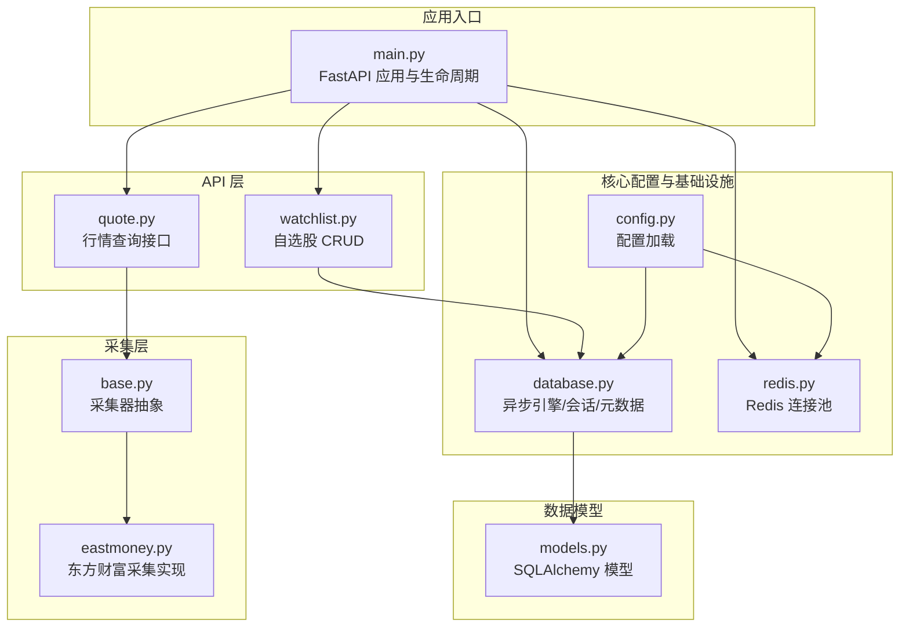
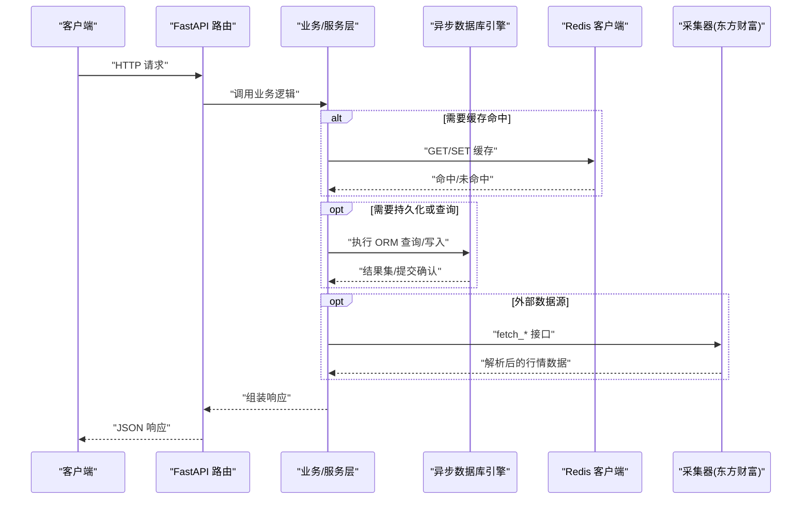
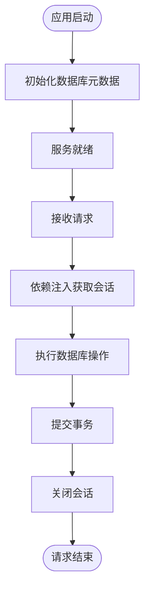
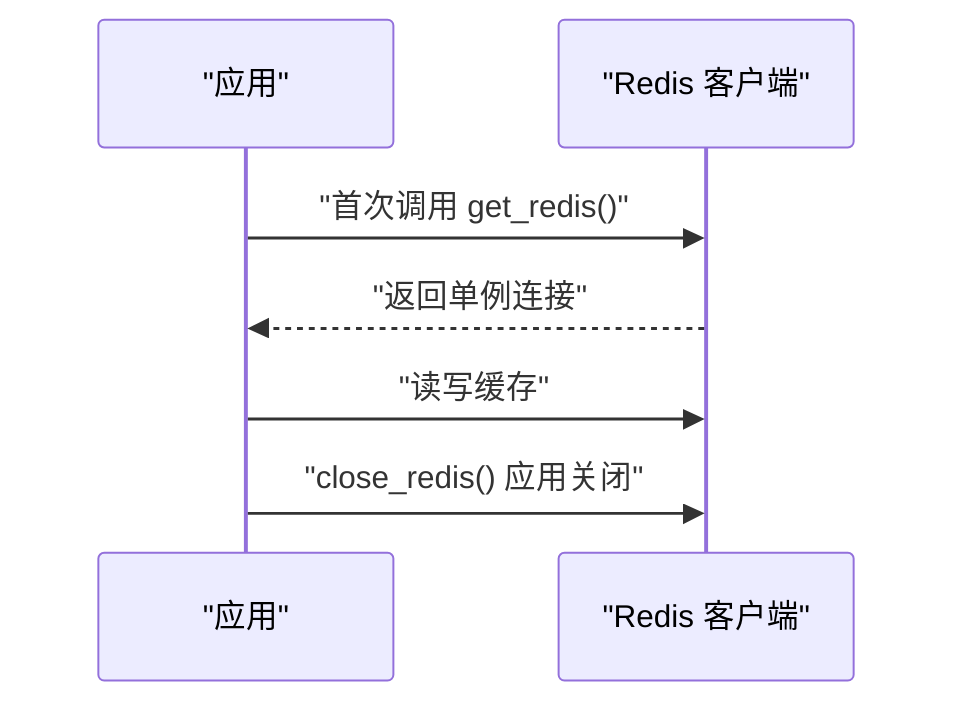
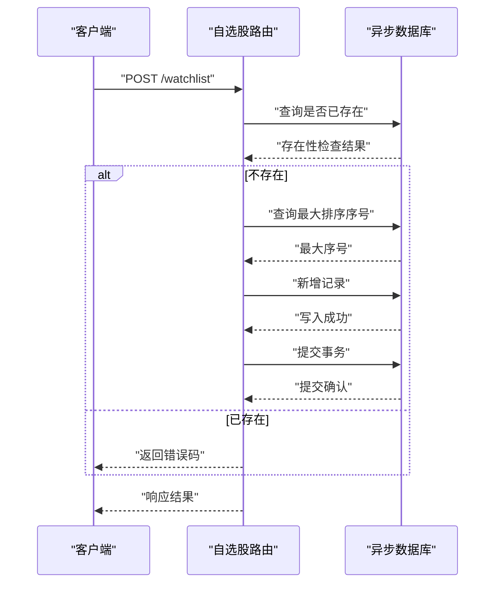
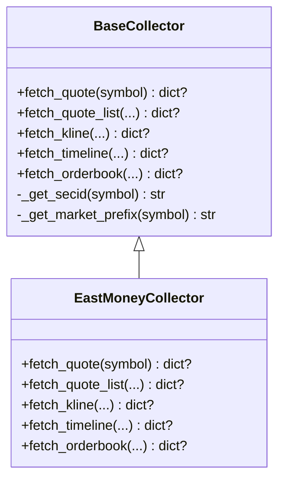
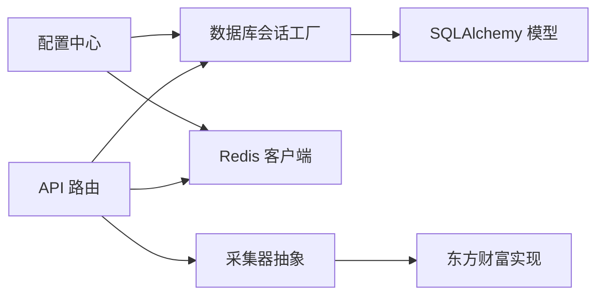

# 数据库操作与优化

<cite>
**本文引用的文件**
- [backend/app/core/database.py](file://backend/app/core/database.py)
- [backend/app/core/redis.py](file://backend/app/core/redis.py)
- [backend/app/models/models.py](file://backend/app/models/models.py)
- [backend/app/core/config.py](file://backend/app/core/config.py)
- [backend/app/api/v1/watchlist.py](file://backend/app/api/v1/watchlist.py)
- [backend/app/api/v1/quote.py](file://backend/app/api/v1/quote.py)
- [backend/app/main.py](file://backend/app/main.py)
- [backend/app/services/collector/base.py](file://backend/app/services/collector/base.py)
- [backend/app/services/collector/eastmoney.py](file://backend/app/services/collector/eastmoney.py)
</cite>

## 目录
1. [简介](#简介)
2. [项目结构](#项目结构)
3. [核心组件](#核心组件)
4. [架构总览](#架构总览)
5. [详细组件分析](#详细组件分析)
6. [依赖分析](#依赖分析)
7. [性能考量](#性能考量)
8. [故障排查指南](#故障排查指南)
9. [结论](#结论)
10. [附录](#附录)

## 简介
本文件聚焦于 Stock-View 项目中的数据库操作与优化实践，系统梳理异步数据库访问、连接池与事务管理、批量操作最佳实践、查询优化策略、Redis 缓存集成与失效策略、以及监控、备份与故障处理等运维要点。文档面向不同层次读者，既提供高层架构视图，也给出可落地的实现细节与优化建议。

## 项目结构
后端采用 FastAPI + SQLAlchemy Async 的架构，数据库模型定义在 models 中，异步引擎与会话工厂在 core/database.py 中初始化；Redis 客户端在 core/redis.py 中集中管理；业务 API 在 api/v1 下按功能模块组织；数据采集通过 collector 抽象与具体实现（如 Eastmoney）完成。

图表来源
- [backend/app/main.py:1-48](file://backend/app/main.py#L1-L48)
- [backend/app/core/database.py:1-25](file://backend/app/core/database.py#L1-L25)
- [backend/app/core/redis.py:1-25](file://backend/app/core/redis.py#L1-L25)
- [backend/app/models/models.py:1-74](file://backend/app/models/models.py#L1-L74)
- [backend/app/api/v1/watchlist.py:1-77](file://backend/app/api/v1/watchlist.py#L1-L77)
- [backend/app/api/v1/quote.py:1-65](file://backend/app/api/v1/quote.py#L1-L65)
- [backend/app/services/collector/base.py:1-45](file://backend/app/services/collector/base.py#L1-L45)
- [backend/app/services/collector/eastmoney.py:1-240](file://backend/app/services/collector/eastmoney.py#L1-L240)

章节来源
- [backend/app/main.py:1-48](file://backend/app/main.py#L1-L48)
- [backend/app/core/database.py:1-25](file://backend/app/core/database.py#L1-L25)
- [backend/app/core/redis.py:1-25](file://backend/app/core/redis.py#L1-L25)
- [backend/app/models/models.py:1-74](file://backend/app/models/models.py#L1-L74)
- [backend/app/api/v1/watchlist.py:1-77](file://backend/app/api/v1/watchlist.py#L1-L77)
- [backend/app/api/v1/quote.py:1-65](file://backend/app/api/v1/quote.py#L1-L65)
- [backend/app/services/collector/base.py:1-45](file://backend/app/services/collector/base.py#L1-L45)
- [backend/app/services/collector/eastmoney.py:1-240](file://backend/app/services/collector/eastmoney.py#L1-L240)

## 核心组件
- 异步数据库引擎与会话：通过 SQLAlchemy Async 创建异步引擎与 async_session 工厂，提供基于上下文的会话生命周期管理，并在应用启动时初始化元数据。
- Redis 客户端：使用 aioredis 提供异步 Redis 客户端，全局单例连接池，应用关闭时显式释放。
- 数据模型：定义了股票信息、日线行情、分时行情、自选股、AI 分析日志等表结构，统一继承 Base。
- 配置中心：集中管理数据库 URL、Redis URL、AI 缓存 TTL、Celery Broker/Backend 等运行参数。
- API 层：自选股模块提供查询、新增、删除、排序等 CRUD 操作；行情模块提供实时、列表、K 线、分时、盘口等查询接口。
- 采集层：抽象采集器接口，具体实现对接第三方数据源（如东方财富），负责数据抓取与格式化。

章节来源
- [backend/app/core/database.py:1-25](file://backend/app/core/database.py#L1-L25)
- [backend/app/core/redis.py:1-25](file://backend/app/core/redis.py#L1-L25)
- [backend/app/models/models.py:1-74](file://backend/app/models/models.py#L1-L74)
- [backend/app/core/config.py:1-43](file://backend/app/core/config.py#L1-L43)
- [backend/app/api/v1/watchlist.py:1-77](file://backend/app/api/v1/watchlist.py#L1-L77)
- [backend/app/api/v1/quote.py:1-65](file://backend/app/api/v1/quote.py#L1-L65)
- [backend/app/services/collector/base.py:1-45](file://backend/app/services/collector/base.py#L1-L45)
- [backend/app/services/collector/eastmoney.py:1-240](file://backend/app/services/collector/eastmoney.py#L1-L240)

## 架构总览
下图展示从 API 请求到数据库与外部数据源的整体交互流程，突出异步数据库访问、Redis 缓存与采集器的协作关系。

图表来源
- [backend/app/api/v1/watchlist.py:13-77](file://backend/app/api/v1/watchlist.py#L13-L77)
- [backend/app/api/v1/quote.py:7-65](file://backend/app/api/v1/quote.py#L7-L65)
- [backend/app/core/database.py:15-25](file://backend/app/core/database.py#L15-L25)
- [backend/app/core/redis.py:10-25](file://backend/app/core/redis.py#L10-L25)
- [backend/app/services/collector/eastmoney.py:23-240](file://backend/app/services/collector/eastmoney.py#L23-L240)

## 详细组件分析

### 异步数据库引擎与会话管理
- 引擎配置：使用异步驱动创建引擎，开启 echo 便于调试；设置连接池大小与溢出上限，平衡并发与资源占用。
- 会话工厂：通过 async_sessionmaker 创建 AsyncSession，关闭自动过期，避免在事务外误用过期对象。
- 依赖注入：get_db 提供 FastAPI 依赖，确保每个请求拥有独立会话并在结束时正确关闭。
- 初始化：应用启动时通过 init_db 在连接上下文中创建所有表的元数据。

图表来源
- [backend/app/core/database.py:15-25](file://backend/app/core/database.py#L15-L25)
- [backend/app/main.py:13-27](file://backend/app/main.py#L13-L27)

章节来源
- [backend/app/core/database.py:1-25](file://backend/app/core/database.py#L1-L25)
- [backend/app/main.py:13-27](file://backend/app/main.py#L13-L27)

### Redis 缓存集成与失效策略
- 单例连接池：全局变量维护 Redis 连接池，首次使用时建立连接，减少重复握手开销。
- 生命周期管理：应用关闭时主动释放 Redis 连接，避免资源泄漏。
- 缓存键空间：结合配置中的 AI 缓存 TTL 等参数，可在业务层扩展缓存键命名与过期策略。

图表来源
- [backend/app/core/redis.py:10-25](file://backend/app/core/redis.py#L10-L25)
- [backend/app/main.py:18-19](file://backend/app/main.py#L18-L19)

章节来源
- [backend/app/core/redis.py:1-25](file://backend/app/core/redis.py#L1-L25)
- [backend/app/main.py:18-19](file://backend/app/main.py#L18-L19)

### 数据模型与索引设计建议
- 模型概览：包含股票信息、日线行情、分时行情、自选股、AI 分析日志等表，统一继承 Base。
- 索引设计建议：
  - 自选股查询常按 user_id 与 symbol 组合过滤，建议在 user_id、symbol 上建立复合索引，或在 symbol 上建立唯一索引以避免重复。
  - 日线/分时表按 symbol 与 trade_date 查询频繁，建议在 (symbol, trade_date) 上建立联合索引，提升范围查询性能。
  - 若存在高频统计查询（如按日期区间聚合），可考虑在 trade_date 上建立索引并评估分区策略。
- 字段类型：数值型字段使用 Numeric/BigInteger，字符串长度明确，避免过大或过小导致存储浪费。

章节来源
- [backend/app/models/models.py:1-74](file://backend/app/models/models.py#L1-L74)

### 自选股模块：CRUD 与事务处理
- 查询：按用户 ID 与排序字段查询自选股列表，返回轻量级结构。
- 新增：先查重，再计算排序序号，最后写入并提交事务。
- 删除：按用户 ID 与 symbol 执行删除并提交。
- 排序：批量更新多个记录，逐条查询并修改后一次性提交。

图表来源
- [backend/app/api/v1/watchlist.py:29-51](file://backend/app/api/v1/watchlist.py#L29-L51)
- [backend/app/core/database.py:15-20](file://backend/app/core/database.py#L15-L20)

章节来源
- [backend/app/api/v1/watchlist.py:1-77](file://backend/app/api/v1/watchlist.py#L1-L77)
- [backend/app/core/database.py:15-20](file://backend/app/core/database.py#L15-L20)

### 行情模块：查询接口与外部数据采集
- 实时/列表/K线/分时/盘口：通过采集器管理器调用具体采集器，限制并发与请求超时，保证稳定性。
- 采集器抽象：定义统一接口，便于扩展其他数据源（如新浪）。
- 东方财富实现：封装 HTTP 请求、参数映射、字段解析，输出标准化结构。

图表来源
- [backend/app/services/collector/base.py:5-45](file://backend/app/services/collector/base.py#L5-L45)
- [backend/app/services/collector/eastmoney.py:11-240](file://backend/app/services/collector/eastmoney.py#L11-L240)

章节来源
- [backend/app/api/v1/quote.py:1-65](file://backend/app/api/v1/quote.py#L1-L65)
- [backend/app/services/collector/base.py:1-45](file://backend/app/services/collector/base.py#L1-L45)
- [backend/app/services/collector/eastmoney.py:1-240](file://backend/app/services/collector/eastmoney.py#L1-L240)

### 批量操作最佳实践
- 批量插入：使用批量参数化插入（如 executemany 或批量构造对象后一次 commit），减少往返次数与锁竞争。
- 批量更新：对多条记录进行批量更新时，尽量合并为单条 SQL 或最小化事务次数，避免逐条提交。
- 批量删除：按条件批量删除，必要时分批处理以控制锁持有时间。
- 事务边界：将多次写操作包裹在单个事务中，确保原子性；长事务会增加锁竞争，应尽量缩短事务持续时间。
- 并发控制：在高并发场景下，合理设置连接池大小与超时，避免阻塞排队。

[本节为通用实践指导，不直接分析具体文件，故无“章节来源”]

### 查询优化策略
- 索引设计：围绕高频查询字段建立合适索引，避免全表扫描；对组合过滤条件建立复合索引。
- 查询计划分析：在开发/测试环境启用慢查询日志与执行计划分析工具，定位热点查询。
- 参数化查询：使用 ORM 的参数化查询防止 SQL 注入并提升计划复用率。
- 分页与限制：对列表查询设置合理的分页与条数上限，避免一次性返回过多数据。
- 缓存策略：对稳定且高频的数据引入缓存，降低数据库压力。

[本节为通用实践指导，不直接分析具体文件，故无“章节来源”]

### 缓存优化方案
- Redis 集成：统一通过 get_redis 获取连接，避免重复创建；在应用关闭时 close_redis 释放资源。
- 缓存键命名：建议采用前缀+业务域+主键的规范，便于清理与管理。
- 失效机制：结合业务 TTL 设置与热点数据预热，定期刷新热点键。
- 缓存穿透防护：对空值也做短 TTL 缓存，避免对后端造成冲击；对外部接口异常时也应设置兜底缓存。

章节来源
- [backend/app/core/redis.py:10-25](file://backend/app/core/redis.py#L10-L25)
- [backend/app/core/config.py:22-24](file://backend/app/core/config.py#L22-L24)

### 数据库监控、备份与故障处理
- 监控指标：连接池利用率、平均响应时间、慢查询数量、错误率等。
- 备份策略：定期全量备份与增量备份结合，验证恢复流程，确保可回滚窗口满足 RPO/RTO。
- 故障处理：数据库连接异常时快速降级（如本地缓存或只读副本）、熔断与重试；对关键路径增加超时与重试策略，避免级联故障。

[本节为通用实践指导，不直接分析具体文件，故无“章节来源”]

## 依赖分析
- 组件耦合：API 层依赖数据库会话工厂与 Redis 客户端；采集层与 API 层解耦，通过抽象接口对接。
- 外部依赖：PostgreSQL 异步驱动、aioredis、httpx、FastAPI、SQLAlchemy Async。
- 循环依赖：当前结构未见循环导入，依赖方向清晰。

图表来源
- [backend/app/api/v1/watchlist.py:1-77](file://backend/app/api/v1/watchlist.py#L1-L77)
- [backend/app/api/v1/quote.py:1-65](file://backend/app/api/v1/quote.py#L1-L65)
- [backend/app/core/database.py:1-25](file://backend/app/core/database.py#L1-L25)
- [backend/app/core/redis.py:1-25](file://backend/app/core/redis.py#L1-L25)
- [backend/app/services/collector/base.py:1-45](file://backend/app/services/collector/base.py#L1-L45)
- [backend/app/services/collector/eastmoney.py:1-240](file://backend/app/services/collector/eastmoney.py#L1-L240)
- [backend/app/models/models.py:1-74](file://backend/app/models/models.py#L1-L74)
- [backend/app/core/config.py:1-43](file://backend/app/core/config.py#L1-L43)

章节来源
- [backend/app/api/v1/watchlist.py:1-77](file://backend/app/api/v1/watchlist.py#L1-L77)
- [backend/app/api/v1/quote.py:1-65](file://backend/app/api/v1/quote.py#L1-L65)
- [backend/app/core/database.py:1-25](file://backend/app/core/database.py#L1-L25)
- [backend/app/core/redis.py:1-25](file://backend/app/core/redis.py#L1-L25)
- [backend/app/services/collector/base.py:1-45](file://backend/app/services/collector/base.py#L1-L45)
- [backend/app/services/collector/eastmoney.py:1-240](file://backend/app/services/collector/eastmoney.py#L1-L240)
- [backend/app/models/models.py:1-74](file://backend/app/models/models.py#L1-L74)
- [backend/app/core/config.py:1-43](file://backend/app/core/config.py#L1-L43)

## 性能考量
- 异步 I/O：使用 SQLAlchemy Async 与 aioredis，充分利用异步特性降低等待时间。
- 连接池：合理设置 pool_size 与 max_overflow，避免过度连接导致数据库压力。
- 事务粒度：将相关写操作合并到单次事务，减少提交次数；长事务需谨慎。
- 批量处理：对批量写入与更新采用批量接口，减少网络往返。
- 查询优化：为高频查询建立索引，避免 N+1 查询，使用分页与 LIMIT 控制结果集。
- 缓存策略：对热点数据设置合理 TTL，结合缓存穿透与击穿防护，提升整体吞吐。

[本节为通用性能指导，不直接分析具体文件，故无“章节来源”]

## 故障排查指南
- 数据库连接问题：检查 DATABASE_URL、连接池配置与数据库状态；查看引擎 echo 输出定位 SQL 与参数。
- 会话生命周期：确认 get_db 依赖是否正确注入，避免跨请求复用会话或提前关闭。
- Redis 连接问题：确认 REDIS_URL 正确，应用关闭时调用 close_redis；监控连接泄漏。
- 外部数据源异常：采集器内部已做异常捕获与告警，检查超时与限流配置，必要时切换备用数据源。
- 健康检查：通过 /api/v1/health 快速判断服务状态。

章节来源
- [backend/app/core/database.py:15-25](file://backend/app/core/database.py#L15-L25)
- [backend/app/core/redis.py:10-25](file://backend/app/core/redis.py#L10-L25)
- [backend/app/services/collector/eastmoney.py:35-37](file://backend/app/services/collector/eastmoney.py#L35-L37)
- [backend/app/main.py:46-48](file://backend/app/main.py#L46-L48)

## 结论
Stock-View 项目在数据库方面采用了异步 SQLAlchemy 与 aioredis，配合清晰的模型定义与 API 分层，具备良好的扩展性与可维护性。建议在现有基础上进一步完善索引设计、批量操作与查询优化策略，并强化缓存与监控体系，以支撑更高并发与更复杂的数据场景。

## 附录
- 配置项参考：DATABASE_URL、REDIS_URL、AI_CACHE_TTL、CELERY_BROKER_URL、CELERY_RESULT_BACKEND 等。
- 建议扩展：在业务层增加缓存装饰器或中间件，统一处理缓存读写；对关键查询增加执行计划分析与慢查询日志。

章节来源
- [backend/app/core/config.py:12-27](file://backend/app/core/config.py#L12-L27)