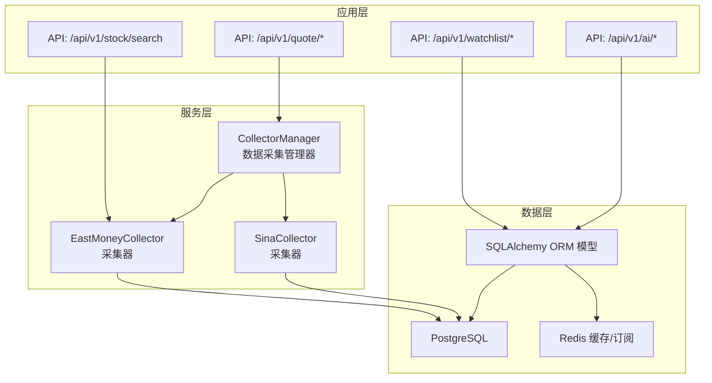
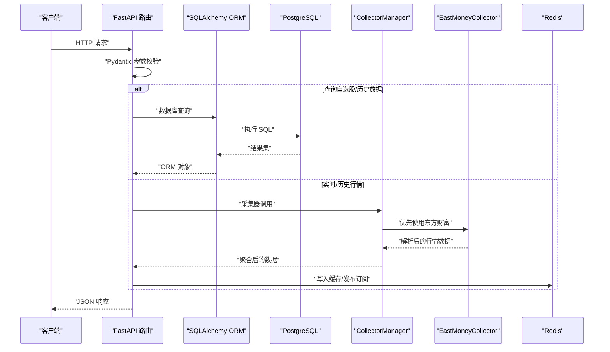
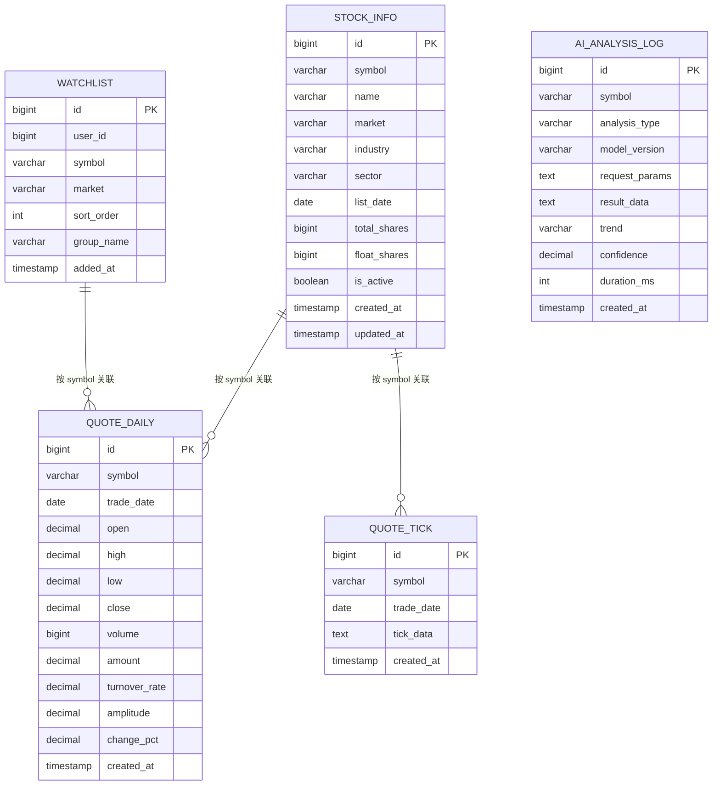
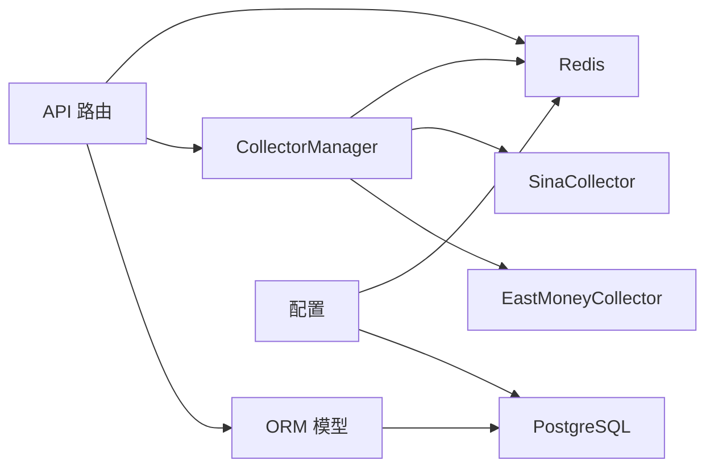

# 数据模型与数据库

<cite>
**本文引用的文件**
- [models.py](file://backend/app/models/models.py)
- [schemas.py](file://backend/app/schemas/schemas.py)
- [database.py](file://backend/app/core/database.py)
- [config.py](file://backend/app/core/config.py)
- [watchlist.py](file://backend/app/api/v1/watchlist.py)
- [quote.py](file://backend/app/api/v1/quote.py)
- [stock.py](file://backend/app/api/v1/stock.py)
- [manager.py](file://backend/app/services/collector/manager.py)
- [base.py](file://backend/app/services/collector/base.py)
- [eastmoney.py](file://backend/app/services/collector/eastmoney.py)
- [main.py](file://backend/app/main.py)
- [开发文档.md](file://Stock-View 软件开发文档/开发文档.md)
</cite>

## 目录
1. [简介](#简介)
2. [项目结构](#项目结构)
3. [核心组件](#核心组件)
4. [架构总览](#架构总览)
5. [详细组件分析](#详细组件分析)
6. [依赖分析](#依赖分析)
7. [性能考虑](#性能考虑)
8. [故障排查指南](#故障排查指南)
9. [结论](#结论)
10. [附录](#附录)

## 简介
本章节面向数据建模与数据库运维，系统梳理 Stock-View 项目的数据模型设计、SQLAlchemy ORM 使用模式、Pydantic 数据验证机制、数据库操作最佳实践以及与之配套的运维策略（迁移、版本管理、备份恢复）。文档以仓库现有代码为依据，结合开发文档中的数据库表结构与索引设计说明，帮助开发者构建稳定、可扩展的数据存储体系。

## 项目结构
后端采用 FastAPI + SQLAlchemy Async 的架构，数据层由 ORM 模型、数据库连接与会话管理、API 层调用组成；行情采集通过多数据源适配器实现，支持主备自动切换；Redis 用于缓存与实时推送，PostgreSQL 作为持久化存储。

图表来源
- [quote.py:1-65](file://backend/app/api/v1/quote.py#L1-L65)
- [watchlist.py:1-77](file://backend/app/api/v1/watchlist.py#L1-L77)
- [stock.py:1-37](file://backend/app/api/v1/stock.py#L1-L37)
- [manager.py:1-80](file://backend/app/services/collector/manager.py#L1-L80)
- [eastmoney.py:1-240](file://backend/app/services/collector/eastmoney.py#L1-L240)
- [models.py:1-74](file://backend/app/models/models.py#L1-L74)
- [database.py:1-25](file://backend/app/core/database.py#L1-L25)

章节来源
- [main.py:1-48](file://backend/app/main.py#L1-L48)
- [config.py:1-43](file://backend/app/core/config.py#L1-L43)

## 核心组件
- 数据库引擎与会话：基于 SQLAlchemy Async Engine 与 AsyncSession，支持连接池与异步事务。
- ORM 模型：定义股票信息、日线行情、分时行情、自选股、AI 分析日志等核心实体。
- Pydantic 模型：用于 API 请求/响应的数据结构与参数校验。
- 数据采集器：抽象基类与具体实现（东方财富、新浪），支持主备切换与错误降级。
- API 路由：围绕行情、自选股、股票搜索、AI 分析的 REST 接口。

章节来源
- [database.py:1-25](file://backend/app/core/database.py#L1-L25)
- [models.py:1-74](file://backend/app/models/models.py#L1-L74)
- [schemas.py:1-103](file://backend/app/schemas/schemas.py#L1-L103)
- [base.py:1-45](file://backend/app/services/collector/base.py#L1-L45)
- [eastmoney.py:1-240](file://backend/app/services/collector/eastmoney.py#L1-L240)
- [watchlist.py:1-77](file://backend/app/api/v1/watchlist.py#L1-L77)
- [quote.py:1-65](file://backend/app/api/v1/quote.py#L1-L65)
- [stock.py:1-37](file://backend/app/api/v1/stock.py#L1-L37)

## 架构总览
下图展示数据在系统内的流向：API 接收请求，经 Pydantic 校验后，通过 ORM 或采集器访问数据库或外部数据源；Redis 用于缓存与实时推送。

图表来源
- [schemas.py:1-103](file://backend/app/schemas/schemas.py#L1-L103)
- [watchlist.py:1-77](file://backend/app/api/v1/watchlist.py#L1-L77)
- [quote.py:1-65](file://backend/app/api/v1/quote.py#L1-L65)
- [manager.py:1-80](file://backend/app/services/collector/manager.py#L1-L80)
- [eastmoney.py:1-240](file://backend/app/services/collector/eastmoney.py#L1-L240)
- [models.py:1-74](file://backend/app/models/models.py#L1-L74)
- [database.py:1-25](file://backend/app/core/database.py#L1-L25)

## 详细组件分析

### 数据模型与实体关系
- StockInfo：股票基础信息，包含代码、名称、市场、行业、板块、上市日期、总股本、流通股本、状态与时间戳。
- QuoteDaily：日线行情，包含日期、开盘/最高/最低/收盘价、成交量/成交额、换手率、振幅、涨跌幅与创建时间；开发文档补充了唯一键与索引设计。
- QuoteTick：分时行情，以 JSON 字符串存储当日分时点序列与昨收。
- Watchlist：自选股，包含用户标识、股票代码、市场、排序与分组、添加时间。
- AIAnalysisLog：AI 分析日志，包含分析类型、模型版本、请求参数、结果数据、趋势、置信度、耗时与创建时间。

图表来源
- [models.py:5-74](file://backend/app/models/models.py#L5-L74)
- [开发文档.md:997-1070](file://Stock-View 软件开发文档/开发文档.md#L997-L1070)

章节来源
- [models.py:1-74](file://backend/app/models/models.py#L1-L74)

### SQLAlchemy ORM 使用模式
- 引擎与会话
  - 使用异步引擎与会话工厂，开启连接池与溢出控制，避免每次请求重建连接。
  - 提供 get_db 依赖注入，确保会话生命周期与请求绑定，并在 finally 中关闭会话。
  - 初始化函数在应用启动时创建所有表结构。
- 模型定义
  - 字段类型选择：整数使用 BigInteger/Integer，浮点数值精度使用 Numeric 并指定精度与小数位；字符串长度限制；布尔值默认值；日期时间字段使用 Date/DateTime。
  - 时间戳：使用 server_default 与 onupdate 组合，自动维护创建与更新时间。
- 关系映射
  - 当前模型间通过 symbol 外键关联（如日线与分时表），未显式声明外键约束，但开发文档提供了唯一键与索引设计，有助于保证数据一致性与查询效率。
- 索引设计
  - 日线表：唯一键 (symbol, trade_date)，复合索引 (symbol, trade_date)、(trade_date)。
  - 分钟线表：唯一键 (symbol, trade_time, period)，复合索引 (symbol, trade_time, period)。
  - 分时表：唯一键 (symbol, trade_date)。
- 事务与批量操作
  - API 层使用单条插入/更新/删除，未见批量写入示例；建议在采集器侧或定时任务中进行批量写入以提升吞吐。

章节来源
- [database.py:1-25](file://backend/app/core/database.py#L1-L25)
- [models.py:1-74](file://backend/app/models/models.py#L1-L74)
- [开发文档.md:997-1070](file://Stock-View 软件开发文档/开发文档.md#L997-L1070)

### 数据验证机制
- Pydantic 模型
  - ResponseBase 提供统一响应结构；行情相关模型（QuoteItem/KlineItem/TimelinePoint/OrderBookLevel）定义字段类型与默认值，保障 API 输入输出的一致性。
  - 请求模型（WatchlistAddRequest/WatchlistSortRequest/AIAnalysisRequest）用于参数校验与默认值设置。
- 数据库约束
  - 字段非空与长度约束在模型中体现；开发文档补充唯一键与索引，减少重复与提升查询性能。
- 数据完整性检查
  - 采集器解析与清洗逻辑（如东方财富采集器）在入库前进行字段提取与类型转换，降低脏数据进入数据库的概率。
  - API 层对查询参数进行范围校验（如 page/page_size/limit），避免异常输入导致数据库压力。

章节来源
- [schemas.py:1-103](file://backend/app/schemas/schemas.py#L1-L103)
- [base.py:1-45](file://backend/app/services/collector/base.py#L1-L45)
- [eastmoney.py:1-240](file://backend/app/services/collector/eastmoney.py#L1-L240)
- [watchlist.py:1-77](file://backend/app/api/v1/watchlist.py#L1-L77)

### 数据库操作最佳实践
- 异步数据库访问
  - 使用 AsyncSession 与依赖注入 get_db，确保每个请求拥有独立会话，避免并发问题。
- 事务管理
  - 单条写入（新增/删除/更新）直接提交；复杂业务建议封装到事务块中，失败回滚。
- 批量操作
  - 建议在采集器或定时任务中使用批量插入/更新，减少往返次数与锁竞争。
- 查询优化
  - 利用开发文档提供的唯一键与索引，避免全表扫描；对高频查询字段建立合适索引。
  - 控制返回字段与分页大小，避免一次性拉取过多数据。
- 连接池与资源管理
  - 合理配置 pool_size 与 max_overflow；在 lifespan 中初始化数据库并在应用关闭时释放资源。

章节来源
- [database.py:1-25](file://backend/app/core/database.py#L1-L25)
- [main.py:1-48](file://backend/app/main.py#L1-L48)
- [watchlist.py:1-77](file://backend/app/api/v1/watchlist.py#L1-L77)
- [quote.py:1-65](file://backend/app/api/v1/quote.py#L1-L65)
- [开发文档.md:997-1070](file://Stock-View 软件开发文档/开发文档.md#L997-L1070)

### 数据迁移策略、版本管理与备份恢复
- 迁移与版本管理
  - 项目中存在 Alembic 依赖，可用于生成与应用迁移脚本；建议在模型变更时使用 autogenerate 生成差异，并在测试环境先行验证。
- 备份与恢复
  - 建议定期对 PostgreSQL 进行逻辑备份（如 pg_dump）与物理备份；结合 WAL 归档实现点-in-time 恢复。
  - 对 Redis 数据进行 RDB/AOF 持久化配置，确保缓存与会话状态可恢复。
- 发布与回滚
  - 通过迁移脚本逐步演进；回滚时注意数据一致性与兼容性，必要时准备补偿操作。

章节来源
- [database.py:1-25](file://backend/app/core/database.py#L1-L25)
- [config.py:1-43](file://backend/app/core/config.py#L1-L43)
- [开发文档.md:997-1070](file://Stock-View 软件开发文档/开发文档.md#L997-L1070)

## 依赖分析
- 组件耦合
  - API 层依赖数据库会话与 ORM 模型；采集器通过 CollectorManager 统一调度，降低对具体数据源的耦合。
  - 配置模块集中管理数据库 URL、AI 服务参数等，便于环境切换与运维。
- 外部依赖
  - SQLAlchemy Async、httpx、Pydantic、Alembic（迁移工具）、Redis（缓存/订阅）。
- 潜在风险
  - 当前模型未显式声明外键约束，建议在迁移脚本中补充，以增强参照完整性。
  - API 层未见批量写入示例，建议在高频写入场景引入批量操作以提升性能。

图表来源
- [watchlist.py:1-77](file://backend/app/api/v1/watchlist.py#L1-L77)
- [quote.py:1-65](file://backend/app/api/v1/quote.py#L1-L65)
- [manager.py:1-80](file://backend/app/services/collector/manager.py#L1-L80)
- [eastmoney.py:1-240](file://backend/app/services/collector/eastmoney.py#L1-L240)
- [models.py:1-74](file://backend/app/models/models.py#L1-L74)
- [database.py:1-25](file://backend/app/core/database.py#L1-L25)
- [config.py:1-43](file://backend/app/core/config.py#L1-L43)

章节来源
- [main.py:1-48](file://backend/app/main.py#L1-L48)
- [config.py:1-43](file://backend/app/core/config.py#L1-L43)

## 性能考虑
- 异步 I/O：使用 AsyncEngine 与 AsyncSession，减少阻塞，提升并发处理能力。
- 连接池：合理设置 pool_size 与 max_overflow，避免高并发下的连接争用。
- 索引与唯一键：遵循开发文档的索引设计，避免重复数据与慢查询。
- 缓存策略：利用 Redis 缓存热点数据与发布订阅，降低数据库压力与延迟。
- 批量写入：在采集器与定时任务中采用批量插入/更新，减少事务开销。
- 查询优化：限制返回字段、使用分页、避免 N+1 查询。

章节来源
- [database.py:1-25](file://backend/app/core/database.py#L1-L25)
- [manager.py:1-80](file://backend/app/services/collector/manager.py#L1-L80)
- [eastmoney.py:1-240](file://backend/app/services/collector/eastmoney.py#L1-L240)
- [开发文档.md:997-1070](file://Stock-View 软件开发文档/开发文档.md#L997-L1070)

## 故障排查指南
- 数据库连接问题
  - 检查 DATABASE_URL 是否正确；确认连接池参数与目标数据库可达性。
- 会话生命周期
  - 确保 get_db 在依赖注入中正确使用，避免提前关闭或泄漏。
- 数据采集失败
  - 查看 CollectorManager 的日志与异常处理，确认主数据源可用性与备用源切换逻辑。
- 自选股操作异常
  - 检查重复添加与排序更新逻辑，确保唯一性与事务提交成功。
- Pydantic 参数错误
  - 核对请求模型字段类型与默认值，定位参数校验失败原因。

章节来源
- [database.py:1-25](file://backend/app/core/database.py#L1-L25)
- [manager.py:1-80](file://backend/app/services/collector/manager.py#L1-L80)
- [watchlist.py:1-77](file://backend/app/api/v1/watchlist.py#L1-L77)
- [schemas.py:1-103](file://backend/app/schemas/schemas.py#L1-L103)

## 结论
Stock-View 的数据层以 SQLAlchemy Async 为核心，结合 Pydantic 的强类型校验与 Redis 的缓存/推送机制，形成了高效、可扩展的数据通路。当前模型与索引设计已具备良好的查询性能基础；建议在迁移脚本中补充外键约束与分区策略，进一步强化数据完整性与可维护性。通过批量写入、连接池优化与缓存策略，可在高并发场景下保持稳定表现。

## 附录
- 配置项概览
  - 数据库连接：DATABASE_URL
  - 主/备数据源：PRIMARY_DATA_SOURCE、FALLBACK_DATA_SOURCE
  - AI 服务：AI_ADAPTER、AI_SERVICE_URL、AI_REQUEST_TIMEOUT、AI_CACHE_ENABLED、AI_CACHE_TTL、AI_RATE_LIMIT
  - 缓存与任务：QUOTE_COLLECT_INTERVAL、QUOTE_CACHE_TTL
  - Redis：REDIS_URL
  - Celery：CELERY_BROKER_URL、CELERY_RESULT_BACKEND

章节来源
- [config.py:1-43](file://backend/app/core/config.py#L1-L43)