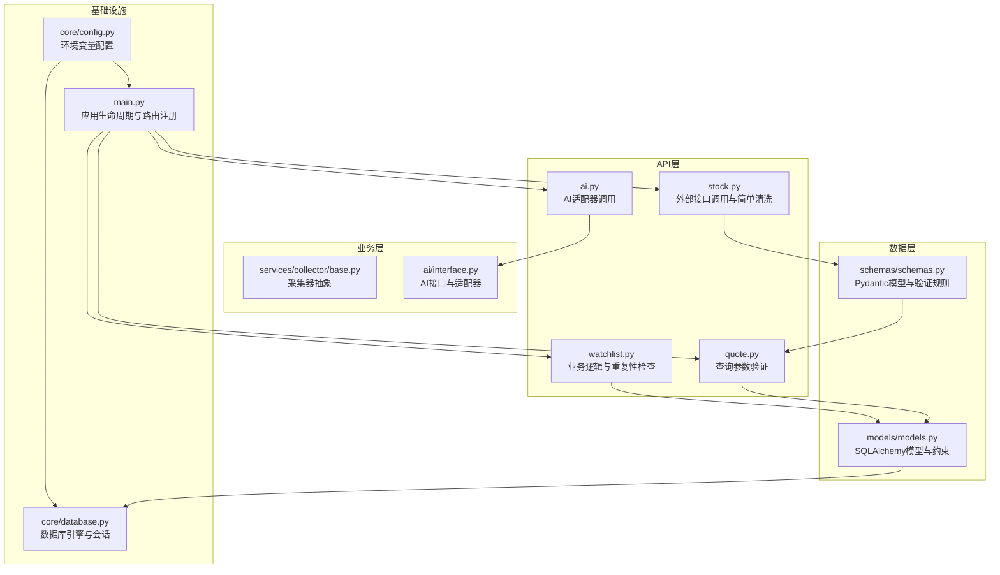
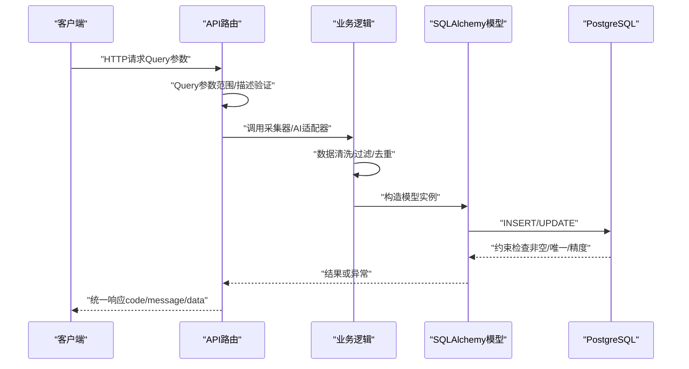
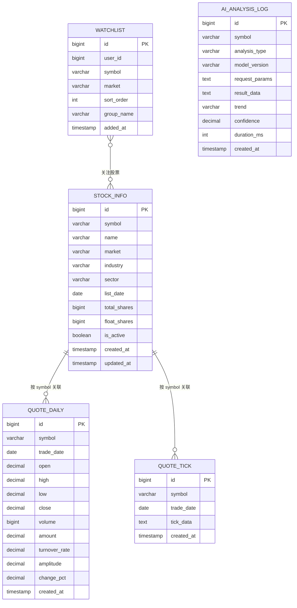
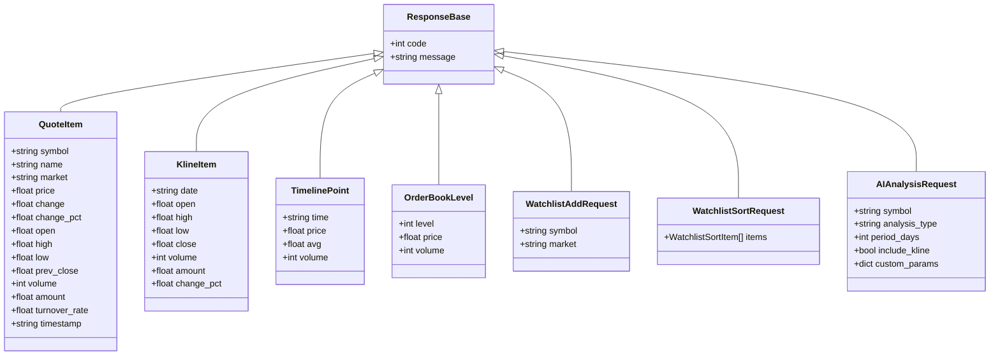
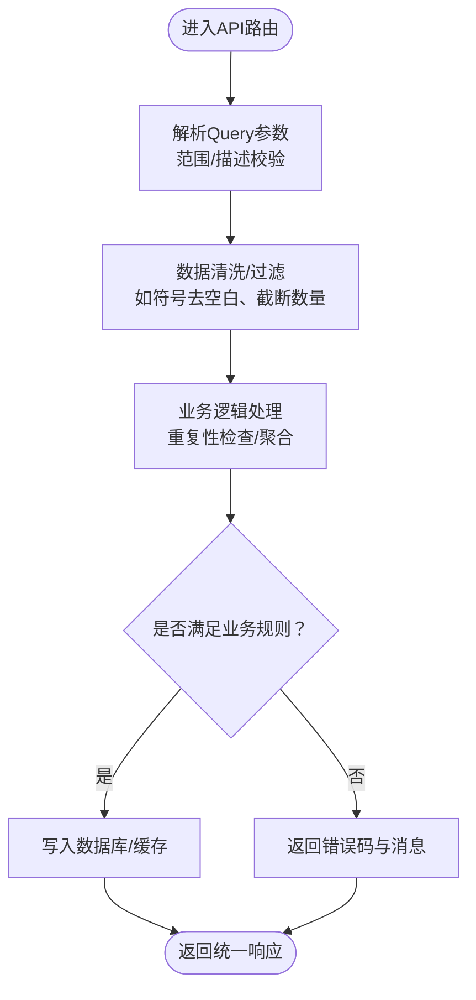
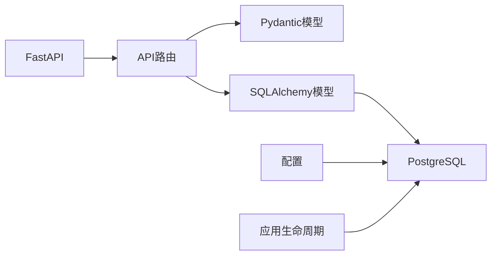

# 数据验证与约束

<cite>
**本文引用的文件**
- [models.py](file://backend/app/models/models.py)
- [schemas.py](file://backend/app/schemas/schemas.py)
- [database.py](file://backend/app/core/database.py)
- [config.py](file://backend/app/core/config.py)
- [main.py](file://backend/app/main.py)
- [quote.py](file://backend/app/api/v1/quote.py)
- [watchlist.py](file://backend/app/api/v1/watchlist.py)
- [ai.py](file://backend/app/api/v1/ai.py)
- [stock.py](file://backend/app/api/v1/stock.py)
- [base.py](file://backend/app/services/collector/base.py)
- [interface.py](file://backend/app/ai/interface.py)
- [开发文档.md](file://Stock-View 软件开发文档/开发文档.md)
- [README.md](file://README.md)
</cite>

## 目录
1. [引言](#引言)
2. [项目结构](#项目结构)
3. [核心组件](#核心组件)
4. [架构总览](#架构总览)
5. [详细组件分析](#详细组件分析)
6. [依赖分析](#依赖分析)
7. [性能考虑](#性能考虑)
8. [故障排查指南](#故障排查指南)
9. [结论](#结论)
10. [附录](#附录)

## 引言
本文件聚焦于Stock-View项目中的“数据验证与约束”体系，系统梳理数据库层面的约束定义与Pydantic模型层面的验证规则，解释字段类型选择原则（如字符串长度限制、数值精度控制、日期时间格式等），并总结数据完整性检查机制（非空、唯一、外键、检查约束等）。同时给出输入数据清洗、格式验证、业务规则检查等最佳实践，并说明异常处理策略与错误信息反馈机制，帮助开发者构建健壮的数据验证系统。

## 项目结构
后端采用FastAPI + SQLAlchemy 2.0异步ORM的分层架构：
- API层：定义路由与查询参数验证（Query参数范围、描述等）
- 业务层：调用采集器与AI适配器，执行业务逻辑
- 数据层：SQLAlchemy模型定义表结构与约束；Pydantic模型定义请求/响应数据结构与验证规则
- 配置层：读取环境变量，初始化数据库连接与Redis连接

图表来源
- [quote.py:1-65](file://backend/app/api/v1/quote.py#L1-L65)
- [watchlist.py:1-77](file://backend/app/api/v1/watchlist.py#L1-L77)
- [ai.py:1-29](file://backend/app/api/v1/ai.py#L1-L29)
- [stock.py:1-37](file://backend/app/api/v1/stock.py#L1-L37)
- [base.py:1-45](file://backend/app/services/collector/base.py#L1-L45)
- [interface.py:1-43](file://backend/app/ai/interface.py#L1-L43)
- [models.py:1-74](file://backend/app/models/models.py#L1-L74)
- [schemas.py:1-103](file://backend/app/schemas/schemas.py#L1-L103)
- [config.py:1-43](file://backend/app/core/config.py#L1-L43)
- [database.py:1-25](file://backend/app/core/database.py#L1-L25)
- [main.py:1-48](file://backend/app/main.py#L1-L48)

章节来源
- [main.py:1-48](file://backend/app/main.py#L1-L48)
- [config.py:1-43](file://backend/app/core/config.py#L1-L43)
- [database.py:1-25](file://backend/app/core/database.py#L1-L25)
- [README.md:1-163](file://README.md#L1-L163)

## 核心组件
- 数据库模型与约束：通过SQLAlchemy列类型与约束定义实现数据完整性，覆盖字符串长度、数值精度、日期时间、布尔值、默认值与索引等。
- Pydantic模型与验证规则：通过字段类型、默认值、嵌套模型与可选字段实现请求/响应数据的结构化验证。
- 查询参数验证：在API路由中使用Query参数的ge/le、描述等进行范围与语义约束。
- 业务层重复性检查：在写入前对唯一性进行显式检查，避免仅依赖数据库约束导致的错误信息不友好。
- 外部接口调用与清洗：对外部返回数据进行过滤与清洗，确保入库与返回的一致性。

章节来源
- [models.py:1-74](file://backend/app/models/models.py#L1-L74)
- [schemas.py:1-103](file://backend/app/schemas/schemas.py#L1-L103)
- [quote.py:1-65](file://backend/app/api/v1/quote.py#L1-L65)
- [watchlist.py:1-77](file://backend/app/api/v1/watchlist.py#L1-L77)

## 架构总览
下图展示数据从API进入系统后的验证与约束路径：API层参数验证 → 业务层数据清洗与重复性检查 → ORM模型入库 → 数据库约束生效。

图表来源
- [quote.py:7-16](file://backend/app/api/v1/quote.py#L7-L16)
- [watchlist.py:29-51](file://backend/app/api/v1/watchlist.py#L29-L51)
- [models.py:5-74](file://backend/app/models/models.py#L5-L74)
- [database.py:23-25](file://backend/app/core/database.py#L23-L25)

## 详细组件分析

### 数据库模型与约束（SQLAlchemy）
- 字段类型与长度限制
  - String(n)：stock_info.name、stock_info.symbol、stock_info.market等限定长度，防止过长数据入库。
  - JSON/JSONB：quote_tick.tick_data、ai_analysis_log.request_params/result_data使用字符串存储JSON，便于灵活扩展；若需强约束可考虑引入JSON Schema校验（当前未在模型中直接体现）。
- 数值精度控制
  - Numeric(precision, scale)：quote_daily.open/high/low/close使用(10,3)，amount使用(18,2)，turnover_rate/amplitude/change_pct使用(8,4)，ai_analysis_log.confidence使用(4,2)。这些精度设置确保价格、金额、比率等金融数据的精度与存储空间平衡。
- 日期与时间
  - Date/DateTime：多处使用Date（如quote_daily.trade_date、quote_tick.trade_date）与DateTime（created_at/updated_at），统一时间格式，便于统计与索引。
- 布尔值与默认值
  - Boolean默认True（is_active），server_default函数设置created_at/updated_at默认值，减少应用侧冗余逻辑。
- 索引与唯一性
  - stock_info：UNIQUE(symbol, market)；带多个索引（symbol、industry、is_active）提升查询效率。
  - quote_minute：UNIQUE(symbol, trade_time, period)；复合索引加速按时间序列检索。
  - quote_tick：UNIQUE(symbol, trade_date)；JSONB字段tick_data用于存储分时明细。
  - watchlist：UNIQUE(user_id, symbol, market)；避免同一用户重复添加相同股票。
  - ai_analysis_log：索引(symbol, created_at)辅助查询与统计。
- 外键约束
  - 当前模型未显式声明外键约束；若未来引入用户表等实体，应补充外键以保障参照完整性。

图表来源
- [models.py:5-74](file://backend/app/models/models.py#L5-L74)
- [开发文档.md:969-1107](file://Stock-View 软件开发文档/开发文档.md#L969-L1107)

章节来源
- [models.py:1-74](file://backend/app/models/models.py#L1-L74)
- [开发文档.md:969-1107](file://Stock-View 软件开发文档/开发文档.md#L969-L1107)

### Pydantic模型与验证规则
- 通用响应模型
  - ResponseBase：统一返回结构（code/message），便于前端一致处理。
- 行情相关模型
  - QuoteItem/KlineItem/TimelinePoint/OrderBookLevel：字段类型明确（str/float/int），部分字段提供默认值，确保序列化稳定。
- 请求模型
  - WatchlistAddRequest：默认市场为“sh”，简化调用方参数。
  - WatchlistSortRequest：包含排序项列表，便于批量更新。
- AI分析请求模型
  - AIAnalysisRequest：analysis_type/period_days/include_kline/custom_params等字段具备默认值，便于灵活调用。

图表来源
- [schemas.py:1-103](file://backend/app/schemas/schemas.py#L1-L103)

章节来源
- [schemas.py:1-103](file://backend/app/schemas/schemas.py#L1-L103)

### 查询参数验证与业务规则
- API层参数验证
  - quote.py：symbols逗号分隔、最多50个；page/page_size有ge/le约束；limit有范围约束；market/sort_by/sort_order有枚举式约束（通过描述体现）。
  - stock.py：limit在[1,20]范围内，确保外部接口调用的稳定性。
- 业务层重复性检查
  - watchlist.py：添加前查询是否存在相同user_id+symbol组合，存在则返回明确错误码，避免依赖数据库约束导致的模糊错误。
- 外部接口调用与清洗
  - stock.py：仅返回A股代码（以0/3/6开头），并对返回字段进行过滤，确保后续流程一致性。

图表来源
- [quote.py:7-16](file://backend/app/api/v1/quote.py#L7-L16)
- [watchlist.py:29-51](file://backend/app/api/v1/watchlist.py#L29-L51)
- [stock.py:10-37](file://backend/app/api/v1/stock.py#L10-L37)

章节来源
- [quote.py:1-65](file://backend/app/api/v1/quote.py#L1-L65)
- [watchlist.py:1-77](file://backend/app/api/v1/watchlist.py#L1-L77)
- [stock.py:1-37](file://backend/app/api/v1/stock.py#L1-L37)

### 字段类型选择原则与技术细节
- 字符串长度限制
  - stock_info.symbol/name/market等使用String(n)限定长度，避免超长数据引发索引膨胀与存储浪费。
- 数值精度控制
  - 价格/幅度/换手率使用(10,3)/(8,4)等，金额使用(18,2)，置信度使用(4,2)，兼顾精度与存储成本。
- 日期与时间格式
  - Date用于日粒度数据（如交易日、行情日），DateTime用于审计与统计（created_at/updated_at），保持统一时区与时标。
- JSON存储
  - tick_data与AI日志参数/结果以文本形式存储，便于灵活扩展；若需要强约束，可在应用层增加JSON Schema校验。
- 默认值与自增
  - 主键自增BigInteger；布尔默认值is_active=True；时间默认now()，减少应用侧冗余逻辑。

章节来源
- [models.py:1-74](file://backend/app/models/models.py#L1-L74)
- [开发文档.md:969-1107](file://Stock-View 软件开发文档/开发文档.md#L969-L1107)

### 数据完整性检查机制
- 非空约束：多处Column(nullable=False)确保关键字段必填。
- 唯一性约束：stock_info.watchlist.ai_analysis_log均定义UNIQUE，避免重复数据。
- 外键约束：当前模型未显式声明外键；建议在引入用户表等实体时补充外键以保障参照完整性。
- 检查约束：未在SQLAlchemy模型中显式定义CHECK；可通过数据库迁移脚本添加业务规则检查（例如正数范围、合法枚举值等）。

章节来源
- [models.py:1-74](file://backend/app/models/models.py#L1-L74)
- [开发文档.md:969-1107](file://Stock-View 软件开发文档/开发文档.md#L969-L1107)

### 异常处理策略与错误信息反馈
- 统一响应格式：所有API返回统一结构（code/message/data），便于前端一致处理。
- 明确错误码：开发文档定义了常见错误码（如1001参数错误、1002股票不存在、1003数据源不可用、3001/3002 AI服务问题等），API层按场景返回对应错误码。
- 外部接口异常：stock.py中对异常进行捕获并降级为空列表，避免影响整体响应。
- 业务冲突处理：watchlist.py对重复添加场景返回明确错误码，提示已在自选股中。

章节来源
- [开发文档.md:1157-1187](file://Stock-View 软件开发文档/开发文档.md#L1157-L1187)
- [stock.py:15-37](file://backend/app/api/v1/stock.py#L15-L37)
- [watchlist.py:38-40](file://backend/app/api/v1/watchlist.py#L38-L40)

## 依赖分析
- FastAPI负责路由与参数验证（Query参数范围/描述）
- SQLAlchemy负责ORM映射与数据库约束
- Pydantic负责请求/响应模型验证
- 配置模块提供数据库URL与调试开关
- 应用生命周期负责初始化数据库与关闭资源

图表来源
- [main.py:1-48](file://backend/app/main.py#L1-L48)
- [config.py:1-43](file://backend/app/core/config.py#L1-L43)
- [database.py:1-25](file://backend/app/core/database.py#L1-L25)
- [schemas.py:1-103](file://backend/app/schemas/schemas.py#L1-L103)
- [models.py:1-74](file://backend/app/models/models.py#L1-L74)

章节来源
- [main.py:1-48](file://backend/app/main.py#L1-L48)
- [config.py:1-43](file://backend/app/core/config.py#L1-L43)
- [database.py:1-25](file://backend/app/core/database.py#L1-L25)

## 性能考虑
- 索引优化：stock_info与watchlist等表建立常用查询字段索引，提升查询性能。
- 数值精度：合理设置Numeric精度，避免过大精度导致存储与计算开销。
- 查询参数限制：API层对page_size、limit等参数进行上限控制，防止高并发下的资源消耗。
- 缓存策略：开发文档中定义了Redis缓存结构与TTL，结合数据库约束可降低重复写入压力。

章节来源
- [开发文档.md:1135-1153](file://Stock-View 软件开发文档/开发文档.md#L1135-L1153)
- [quote.py:24-25](file://backend/app/api/v1/quote.py#L24-L25)
- [stock.py:11](file://backend/app/api/v1/stock.py#L11)

## 故障排查指南
- 参数错误（1001）：检查Query参数范围与必填字段，确认前端传参符合API定义。
- 股票不存在（1002）：确认symbol格式正确且存在于stock_info中，或检查外部数据源可用性。
- 数据源不可用（1003）：检查collector服务状态与网络连通性，必要时启用备用数据源。
- AI服务问题（3001/3002）：检查AI适配器配置与服务健康状态，确认超时与限流设置。
- 数据库约束冲突：关注唯一性冲突（如watchlist重复添加），在应用层返回明确错误码并引导用户修正。

章节来源
- [开发文档.md:1173-1187](file://Stock-View 软件开发文档/开发文档.md#L1173-L1187)
- [watchlist.py:38-40](file://backend/app/api/v1/watchlist.py#L38-L40)
- [stock.py:15-37](file://backend/app/api/v1/stock.py#L15-L37)

## 结论
Stock-View项目在数据验证与约束方面形成了“API层参数验证 + Pydantic模型验证 + 业务层重复性检查 + SQLAlchemy模型约束 + 数据库索引”的多层保障体系。通过合理的字段类型与精度选择、明确的错误码与统一响应格式，以及清晰的业务规则检查，系统在保证数据质量的同时提升了可维护性与可扩展性。建议后续在引入用户表等实体时补充外键约束，并在应用层增加JSON Schema校验以进一步强化数据完整性。

## 附录
- 字段类型与精度对照（节选）
  - 价格/幅度/换手率：(10,3)/(8,4)
  - 金额：(18,2)
  - 置信度：(4,2)
  - 符号/名称/市场：String(10)/String(20)
- 常用错误码
  - 0：成功
  - 1001：参数错误
  - 1002：股票代码不存在
  - 1003：数据源暂不可用
  - 3001：AI服务暂不可用
  - 3002：AI分析超时

章节来源
- [models.py:1-74](file://backend/app/models/models.py#L1-L74)
- [开发文档.md:1173-1187](file://Stock-View 软件开发文档/开发文档.md#L1173-L1187)