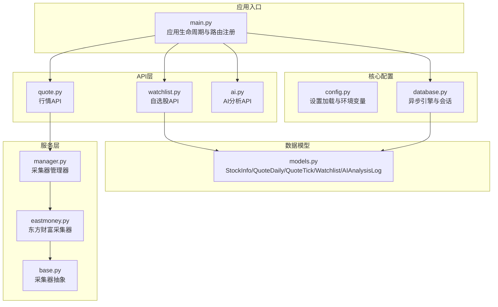
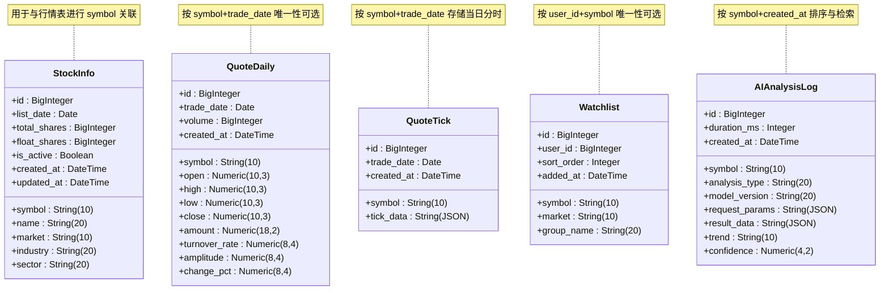
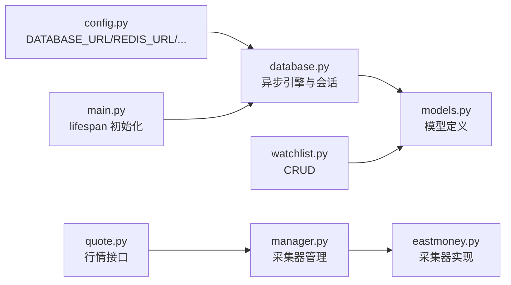
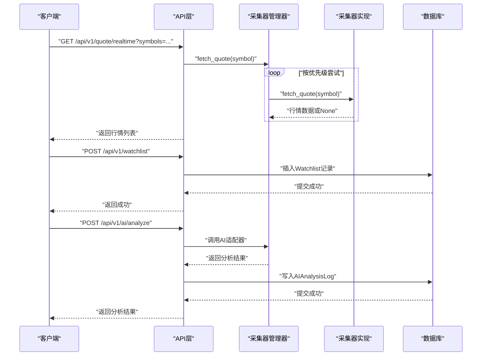

# 核心数据模型

<cite>
**本文引用的文件**
- [models.py](file://backend/app/models/models.py)
- [schemas.py](file://backend/app/schemas/schemas.py)
- [database.py](file://backend/app/core/database.py)
- [config.py](file://backend/app/core/config.py)
- [main.py](file://backend/app/main.py)
- [watchlist.py](file://backend/app/api/v1/watchlist.py)
- [quote.py](file://backend/app/api/v1/quote.py)
- [ai.py](file://backend/app/api/v1/ai.py)
- [base.py](file://backend/app/services/collector/base.py)
- [eastmoney.py](file://backend/app/services/collector/eastmoney.py)
- [manager.py](file://backend/app/services/collector/manager.py)
</cite>

## 目录
1. [简介](#简介)
2. [项目结构](#项目结构)
3. [核心组件](#核心组件)
4. [架构总览](#架构总览)
5. [详细组件分析](#详细组件分析)
6. [依赖分析](#依赖分析)
7. [性能考虑](#性能考虑)
8. [故障排查指南](#故障排查指南)
9. [结论](#结论)
10. [附录](#附录)

## 简介
本文件聚焦于Stock-View项目中的五大核心数据模型：StockInfo股票信息模型、QuoteDaily日线行情模型、QuoteTick分时行情模型、Watchlist自选股模型、AIAnalysisLog AI分析日志模型。我们将从字段定义、数据类型选择、约束条件、业务含义出发，系统阐述模型间的关系设计（如外键关联、索引策略、查询优化），并给出最佳实践（插入、更新、查询的代码路径与性能优化建议），最后总结设计原则与业务考量，帮助开发者快速理解并高效使用这些数据模型。

## 项目结构
后端采用FastAPI + SQLAlchemy异步ORM + PostgreSQL的典型架构。数据库连接通过异步引擎创建，模型定义在统一的Base下，API层负责对外暴露REST接口，服务层负责数据采集与转换，配置文件集中管理数据库URL、AI适配器、缓存与限流等参数。

图表来源
- [main.py:13-27](file://backend/app/main.py#L13-L27)
- [database.py:11-25](file://backend/app/core/database.py#L11-L25)
- [models.py:5-74](file://backend/app/models/models.py#L5-L74)
- [watchlist.py:13-26](file://backend/app/api/v1/watchlist.py#L13-L26)
- [quote.py:7-16](file://backend/app/api/v1/quote.py#L7-L16)
- [ai.py:10-15](file://backend/app/api/v1/ai.py#L10-L15)
- [base.py:5-45](file://backend/app/services/collector/base.py#L5-L45)
- [eastmoney.py:11-240](file://backend/app/services/collector/eastmoney.py#L11-L240)
- [manager.py:12-80](file://backend/app/services/collector/manager.py#L12-L80)

章节来源
- [main.py:13-27](file://backend/app/main.py#L13-L27)
- [database.py:11-25](file://backend/app/core/database.py#L11-L25)

## 核心组件
本节概述五大核心数据模型的职责与字段概要：
- StockInfo：存储股票基础信息（代码、名称、市场、行业、上市日期、总股本、流通股本、状态等）
- QuoteDaily：存储日线行情（日期、开盘/最高/最低/收盘、成交量/成交额、换手率、振幅、涨跌幅等）
- QuoteTick：存储分时行情（交易日期、JSON字符串形式的分时点序列）
- Watchlist：存储用户自选股（用户ID、股票代码、市场、排序、分组、添加时间）
- AIAnalysisLog：存储AI分析日志（股票代码、分析类型、模型版本、请求参数、结果数据、趋势、置信度、耗时、创建时间）

章节来源
- [models.py:5-74](file://backend/app/models/models.py#L5-L74)

## 架构总览
下面以类图展示五大模型的结构与关系。注意：当前模型定义未显式声明外键约束，但API与业务逻辑中体现了跨表关联与一致性约束。

图表来源
- [models.py:5-74](file://backend/app/models/models.py#L5-L74)

## 详细组件分析

### StockInfo 股票信息模型
- 字段与类型
  - id：自增主键
  - symbol/name/market：字符串，长度限制；非空
  - industry/sector：字符串，允许为空
  - list_date：日期
  - total_shares/float_shares：大整数
  - is_active：布尔，默认启用
  - created_at/updated_at：时间戳，默认服务器默认值与更新触发
- 约束与业务含义
  - 非空约束保证基础信息完整性
  - is_active便于软删除或停用标记
  - updated_at自动维护变更时间
- 使用场景
  - 作为行情表（QuoteDaily/QuoteTick）的上游参考
  - 与Watchlist形成“用户关注”的基础
- 最佳实践
  - 插入：批量导入时注意去重（基于symbol唯一性）
  - 更新：仅更新必要字段，避免频繁写入
  - 查询：按symbol精确匹配，建立索引提升查询效率

章节来源
- [models.py:5-20](file://backend/app/models/models.py#L5-L20)

### QuoteDaily 日线行情模型
- 字段与类型
  - id：自增主键
  - symbol/trade_date：非空；组合键可选用于唯一性
  - open/high/low/close：数值精度控制（价格）
  - volume/amount：成交量与成交额
  - turnover_rate/amplitude/change_pct：比率与涨跌幅
  - created_at：时间戳
- 约束与业务含义
  - 数值精度控制确保价格与比例的准确性
  - trade_date+symbol组合可作为唯一性约束候选
- 使用场景
  - K线图绘制、技术指标计算、回测
- 最佳实践
  - 插入：按日期顺序写入，避免重复
  - 更新：日线通常不更新，若需修正应记录修正日志
  - 查询：按symbol+日期范围查询，建立复合索引

章节来源
- [models.py:22-38](file://backend/app/models/models.py#L22-L38)

### QuoteTick 分时行情模型
- 字段与类型
  - id：自增主键
  - symbol/trade_date：非空
  - tick_data：JSON字符串，存储当日分时点序列
  - created_at：时间戳
- 约束与业务含义
  - tick_data为JSON，便于灵活扩展分时字段
  - 适合高频分时数据的存储与检索
- 使用场景
  - 实时分时图、盘口数据、逐笔统计
- 最佳实践
  - 插入：按交易日写入，避免跨日数据混杂
  - 查询：按symbol+trade_date过滤，必要时对tick_data做二级解析
  - 性能：分时数据量大，建议分区或归档旧数据

章节来源
- [models.py:40-48](file://backend/app/models/models.py#L40-L48)

### Watchlist 自选股模型
- 字段与类型
  - id：自增主键
  - user_id：默认值1，非空
  - symbol/market：非空
  - sort_order：整数，默认0
  - group_name：字符串，默认"default"
  - added_at：时间戳
- 约束与业务含义
  - 默认用户ID便于演示与测试
  - sort_order支持自定义排序
  - group_name支持分组管理
- 使用场景
  - 用户自选股列表、排序调整、分组筛选
- 最佳实践
  - 插入：先查重（user_id+symbol），再计算sort_order
  - 更新：批量排序时逐条更新，避免并发冲突
  - 查询：按user_id+sort_order排序，建立复合索引

章节来源
- [models.py:50-60](file://backend/app/models/models.py#L50-L60)
- [watchlist.py:13-26](file://backend/app/api/v1/watchlist.py#L13-L26)
- [watchlist.py:29-51](file://backend/app/api/v1/watchlist.py#L29-L51)
- [watchlist.py:64-77](file://backend/app/api/v1/watchlist.py#L64-L77)

### AIAnalysisLog AI分析日志模型
- 字段与类型
  - id：自增主键
  - symbol/analysis_type/model_version：非空
  - request_params/result_data：JSON字符串
  - trend/confidence/duration_ms：趋势、置信度、耗时
  - created_at：时间戳
- 约束与业务含义
  - JSON字段便于保存结构化请求与结果
  - confidence与trend便于前端展示与二次分析
- 使用场景
  - AI分析历史记录、性能监控、结果回放
- 最佳实践
  - 插入：分析完成后统一写入
  - 查询：按symbol+created_at倒序，建立复合索引
  - 清理：定期归档或删除过期日志

章节来源
- [models.py:62-74](file://backend/app/models/models.py#L62-L74)
- [ai.py:10-15](file://backend/app/api/v1/ai.py#L10-L15)

## 依赖分析
- 数据库连接与模型
  - 引擎与会话由异步引擎创建，模型继承统一Base
  - 应用启动时调用初始化函数创建所有表
- API与模型
  - Watchlist API直接操作模型，体现用户维度的数据管理
  - 行情API通过采集器管理器获取数据，最终落库或缓存
- 配置与运行
  - 配置文件集中管理数据库URL、AI适配器、缓存与限流参数
  - 主程序在生命周期内完成数据库初始化

图表来源
- [config.py:12](file://backend/app/core/config.py#L12)
- [database.py:7-8](file://backend/app/core/database.py#L7-L8)
- [main.py:16](file://backend/app/main.py#L16)
- [watchlist.py:13-26](file://backend/app/api/v1/watchlist.py#L13-L26)
- [quote.py:7-16](file://backend/app/api/v1/quote.py#L7-L16)
- [manager.py:12-80](file://backend/app/services/collector/manager.py#L12-L80)
- [eastmoney.py:11-240](file://backend/app/services/collector/eastmoney.py#L11-L240)

章节来源
- [config.py:12](file://backend/app/core/config.py#L12)
- [database.py:7-8](file://backend/app/core/database.py#L7-L8)
- [main.py:16](file://backend/app/main.py#L16)
- [watchlist.py:13-26](file://backend/app/api/v1/watchlist.py#L13-L26)
- [quote.py:7-16](file://backend/app/api/v1/quote.py#L7-L16)
- [manager.py:12-80](file://backend/app/services/collector/manager.py#L12-L80)
- [eastmoney.py:11-240](file://backend/app/services/collector/eastmoney.py#L11-L240)

## 性能考虑
- 连接池与并发
  - 异步引擎配置了连接池大小与溢出，适合高并发请求
- 查询优化
  - 建议在symbol、trade_date、user_id、created_at等常用查询字段上建立索引
  - 复合索引：如(用户ID, 排序)、(股票代码, 交易日期)、(股票代码, 创建时间)
- 缓存与限流
  - 配置中包含AI缓存与限流参数，可在服务层结合Redis实现热点数据缓存
- 数据分区与归档
  - 对历史日线与分时数据可考虑按时间分区或归档，降低查询扫描范围

章节来源
- [database.py:7](file://backend/app/core/database.py#L7)
- [config.py:22-24](file://backend/app/core/config.py#L22-L24)

## 故障排查指南
- 数据库连接问题
  - 检查DATABASE_URL是否正确，确认PostgreSQL服务可用
  - 启动时调用初始化函数创建表，若失败检查权限与网络
- 自选股操作异常
  - 添加自选股前先查重，避免重复插入
  - 批量排序时注意并发更新，建议加锁或原子操作
- 行情数据异常
  - 采集器管理器具备故障转移机制，若某数据源失败会尝试备用源
  - 若所有数据源均失败，检查网络与第三方接口可用性
- AI分析日志
  - 请求参数与结果均为JSON，注意字段兼容性
  - 如需历史查询，可在API层扩展分页与过滤

章节来源
- [main.py:16](file://backend/app/main.py#L16)
- [watchlist.py:29-51](file://backend/app/api/v1/watchlist.py#L29-L51)
- [manager.py:21-32](file://backend/app/services/collector/manager.py#L21-L32)
- [eastmoney.py:23-37](file://backend/app/services/collector/eastmoney.py#L23-L37)

## 结论
五大核心数据模型围绕“股票基础信息”“日线/分时行情”“用户自选股”“AI分析日志”四个维度构建，既满足业务需求又兼顾可扩展性。当前模型未显式声明外键，但API与业务逻辑已体现跨表一致性约束。建议后续补充索引与唯一性约束，配合缓存与限流策略，进一步提升系统稳定性与性能。

## 附录

### 模型关系与业务流程（序列图）
以下序列图展示从API到服务再到数据模型的典型流程，体现各模型间的协作关系。

图表来源
- [quote.py:7-16](file://backend/app/api/v1/quote.py#L7-L16)
- [manager.py:21-32](file://backend/app/services/collector/manager.py#L21-L32)
- [eastmoney.py:23-37](file://backend/app/services/collector/eastmoney.py#L23-L37)
- [watchlist.py:29-51](file://backend/app/api/v1/watchlist.py#L29-L51)
- [ai.py:10-15](file://backend/app/api/v1/ai.py#L10-L15)
- [models.py:50-74](file://backend/app/models/models.py#L50-L74)

### 字段定义与约束对照表
- StockInfo
  - symbol/name/market：非空；长度限制
  - is_active：布尔，默认true
  - 时间字段：created_at/updated_at
- QuoteDaily
  - symbol/trade_date：非空；建议唯一性
  - 数值精度：价格与比例字段
  - 时间字段：created_at
- QuoteTick
  - symbol/trade_date：非空
  - tick_data：JSON字符串
  - 时间字段：created_at
- Watchlist
  - user_id：默认1；非空
  - symbol/market：非空
  - sort_order/group_name：默认值
  - 时间字段：added_at
- AIAnalysisLog
  - symbol/analysis_type/model_version：非空
  - request_params/result_data：JSON
  - trend/confidence/duration_ms：分析相关
  - 时间字段：created_at

章节来源
- [models.py:5-74](file://backend/app/models/models.py#L5-L74)