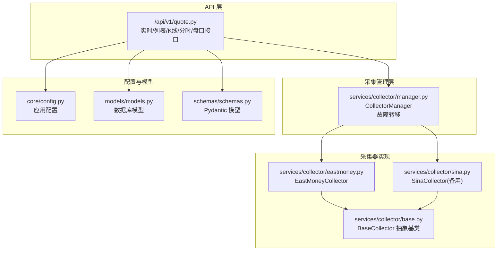
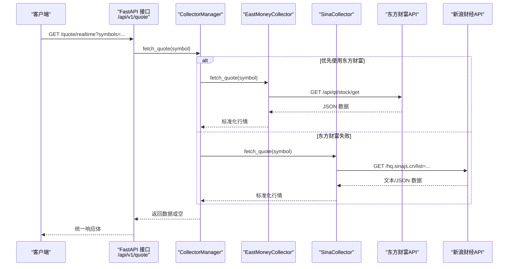
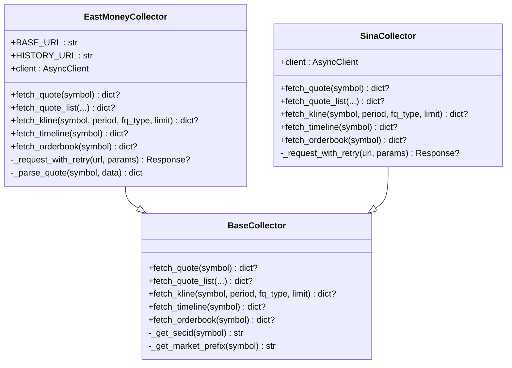
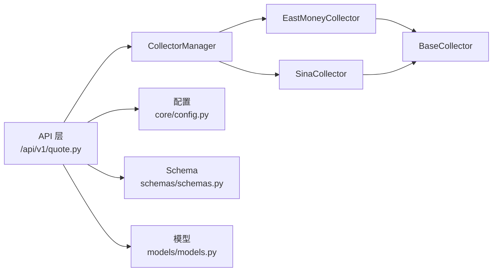

# 东方财富数据采集器

<cite>
**本文档引用的文件**
- [eastmoney.py](file://backend/app/services/collector/eastmoney.py)
- [base.py](file://backend/app/services/collector/base.py)
- [manager.py](file://backend/app/services/collector/manager.py)
- [sina.py](file://backend/app/services/collector/sina.py)
- [config.py](file://backend/app/core/config.py)
- [quote.py](file://backend/app/api/v1/quote.py)
- [models.py](file://backend/app/models/models.py)
- [schemas.py](file://backend/app/schemas/schemas.py)
- [main.py](file://backend/app/main.py)
</cite>

## 目录
1. [简介](#简介)
2. [项目结构](#项目结构)
3. [核心组件](#核心组件)
4. [架构总览](#架构总览)
5. [详细组件分析](#详细组件分析)
6. [依赖分析](#依赖分析)
7. [性能考虑](#性能考虑)
8. [故障排查指南](#故障排查指南)
9. [结论](#结论)
10. [附录](#附录)

## 简介
本文件面向“东方财富数据采集器”的实现与使用，系统性解析 EastMoneyCollector 的设计与实现细节，涵盖以下方面：
- 基于抽象基类接口的实时行情、K线、分时、盘口数据采集流程
- 东方财富数据源的 API 调用方式、URL 构建规则与数据格式转换
- 特有数据结构处理：secid 格式转换、市场标识符映射、字段映射关系
- 数据采集配置参数、请求头设置、反爬虫策略应对
- 错误处理机制、重试策略、数据验证与缓存优化建议

## 项目结构
后端采用 FastAPI + 异步 HTTP 客户端的模块化组织，数据采集层位于 services/collector，通过 CollectorManager 实现多数据源自动故障转移。

图表来源
- [quote.py:1-65](file://backend/app/api/v1/quote.py#L1-L65)
- [manager.py:1-94](file://backend/app/services/collector/manager.py#L1-L94)
- [eastmoney.py:1-297](file://backend/app/services/collector/eastmoney.py#L1-L297)
- [sina.py:1-312](file://backend/app/services/collector/sina.py#L1-L312)
- [base.py:1-45](file://backend/app/services/collector/base.py#L1-L45)
- [config.py:1-43](file://backend/app/core/config.py#L1-L43)
- [models.py:1-74](file://backend/app/models/models.py#L1-L74)
- [schemas.py:1-103](file://backend/app/schemas/schemas.py#L1-L103)

章节来源
- [main.py:1-48](file://backend/app/main.py#L1-L48)
- [quote.py:1-65](file://backend/app/api/v1/quote.py#L1-L65)
- [manager.py:1-94](file://backend/app/services/collector/manager.py#L1-L94)

## 核心组件
- 抽象基类 BaseCollector：定义统一的数据采集接口，并提供 secid 与市场前缀转换工具方法。
- EastMoneyCollector：实现东方财富数据源的实时行情、列表、K线、分时、盘口采集。
- SinaCollector：实现新浪财经备用数据源的对应采集能力。
- CollectorManager：按优先级自动故障转移，提升可用性。
- API 层：FastAPI 接口封装，调用 CollectorManager 并返回标准化响应。

章节来源
- [base.py:1-45](file://backend/app/services/collector/base.py#L1-L45)
- [eastmoney.py:1-297](file://backend/app/services/collector/eastmoney.py#L1-L297)
- [sina.py:1-312](file://backend/app/services/collector/sina.py#L1-L312)
- [manager.py:1-94](file://backend/app/services/collector/manager.py#L1-L94)
- [quote.py:1-65](file://backend/app/api/v1/quote.py#L1-L65)

## 架构总览
下图展示从 API 到采集器再到数据源的整体交互流程，以及故障转移机制：

图表来源
- [quote.py:7-16](file://backend/app/api/v1/quote.py#L7-L16)
- [manager.py:21-33](file://backend/app/services/collector/manager.py#L21-L33)
- [eastmoney.py:69-85](file://backend/app/services/collector/eastmoney.py#L69-L85)
- [sina.py:64-107](file://backend/app/services/collector/sina.py#L64-L107)

## 详细组件分析

### EastMoneyCollector 实现要点
- 基础 URL 与历史数据 URL 分离，分别用于实时/列表与历史数据。
- 使用 httpx.AsyncClient，设置连接/读写/池化超时与并发限制。
- 默认请求头包含浏览器特征，降低被反爬拦截概率。
- 统一的带重试请求方法，支持连接断开、超时与一般异常的指数退避重试。
- 四大采集方法：
  - 实时行情：构造 secid 参数，指定字段集，解析返回并映射到标准结构。
  - 行情列表：支持按变更幅度/成交量/成交额/换手率排序，按市场筛选。
  - K线：周期与复权类型映射，限制返回条数。
  - 分时：解析当日分时点序列，包含时间、价格、均价、成交量。
  - 盘口：解析买卖五档报价。
- 字段映射与 secid/市场前缀转换由基类提供，确保跨数据源一致性。

图表来源
- [base.py:5-45](file://backend/app/services/collector/base.py#L5-L45)
- [eastmoney.py:26-297](file://backend/app/services/collector/eastmoney.py#L26-L297)
- [sina.py:24-312](file://backend/app/services/collector/sina.py#L24-L312)

章节来源
- [eastmoney.py:26-297](file://backend/app/services/collector/eastmoney.py#L26-L297)
- [base.py:36-45](file://backend/app/services/collector/base.py#L36-L45)

### API 调用与 URL 构建规则
- 实时行情
  - URL: BASE_URL + /api/qt/stock/get
  - 参数: secid、fields、ut
  - 字段映射: 通过固定字段集返回，解析为标准结构
- 行情列表
  - URL: BASE_URL + /api/qt/clist/get
  - 参数: pn/pz/po/np/fltt/invt/fid/fs/fields
  - 市场筛选: fs_map 支持 all/sh/sz
  - 排序字段: change_pct/volume/amount/turnover 映射到 f3/f5/f6/f8
- K线
  - URL: HISTORY_URL + /api/qt/stock/kline/get
  - 参数: secid/fields1/fields2/klt/fqt/beg/end/lmt/ut
  - 周期映射: 1m/5m/15m/30m/60m/d/w/m → 1/5/15/30/60/101/102/103
  - 复权映射: none/front/back → 0/1/2
- 分时
  - URL: HISTORY_URL + /api/qt/stock/trends2/get
  - 参数: secid/fields1/fields2/isc/ut
- 盘口
  - URL: BASE_URL + /api/qt/stock/get
  - 参数: secid/fields/ut
  - 买卖五档: f19..f38 对应 5~1 买/卖档位

章节来源
- [eastmoney.py:69-85](file://backend/app/services/collector/eastmoney.py#L69-L85)
- [eastmoney.py:87-149](file://backend/app/services/collector/eastmoney.py#L87-L149)
- [eastmoney.py:151-199](file://backend/app/services/collector/eastmoney.py#L151-L199)
- [eastmoney.py:201-239](file://backend/app/services/collector/eastmoney.py#L201-L239)
- [eastmoney.py:241-278](file://backend/app/services/collector/eastmoney.py#L241-L278)

### 数据格式转换与字段映射
- secid 格式转换：上证以 1. 开头，深证以 0. 开头；由基类方法统一生成。
- 市场标识符映射：上证返回 sh，深证返回 sz。
- 字段映射关系：
  - 实时行情：名称、价格、涨跌、涨跌幅、开盘、最高、最低、昨收、成交量、成交额、换手率等
  - K线：日期、开盘、收盘、最高、最低、成交量、成交额、涨跌幅
  - 分时：时间、价格、均价、成交量
  - 盘口：买卖五档价格与量

章节来源
- [base.py:36-45](file://backend/app/services/collector/base.py#L36-L45)
- [eastmoney.py:280-296](file://backend/app/services/collector/eastmoney.py#L280-L296)

### 请求头设置与反爬虫策略
- 默认请求头包含浏览器特征（User-Agent、Referer、Accept、Accept-Language、Connection、Sec-Fetch-*），减少被识别为爬虫的概率。
- 连接池与超时控制：连接超时、读取超时、写入超时、池化上限，避免资源耗尽。
- 重试策略：最大重试次数、延迟递增（指数退避），覆盖远程协议错误、连接超时、读取超时与一般异常。
- 故障转移：CollectorManager 按优先级自动切换备用数据源。

章节来源
- [eastmoney.py:10-24](file://backend/app/services/collector/eastmoney.py#L10-L24)
- [eastmoney.py:32-39](file://backend/app/services/collector/eastmoney.py#L32-L39)
- [eastmoney.py:41-67](file://backend/app/services/collector/eastmoney.py#L41-L67)
- [manager.py:9-94](file://backend/app/services/collector/manager.py#L9-L94)
- [sina.py:11-22](file://backend/app/services/collector/sina.py#L11-L22)
- [sina.py:27-34](file://backend/app/services/collector/sina.py#L27-L34)
- [sina.py:36-62](file://backend/app/services/collector/sina.py#L36-L62)

### 错误处理与数据验证
- 状态码校验：仅当返回 200 时视为成功，否则记录警告并重试。
- JSON 解析保护：捕获异常并记录告警，避免中断流程。
- 空数据处理：若返回数据为空或缺失关键字段，返回 None，交由上层处理。
- API 层统一响应：当采集器返回 None 时，接口层返回明确的错误码与消息。

章节来源
- [eastmoney.py:41-67](file://backend/app/services/collector/eastmoney.py#L41-L67)
- [eastmoney.py:78-85](file://backend/app/services/collector/eastmoney.py#L78-L85)
- [eastmoney.py:118-149](file://backend/app/services/collector/eastmoney.py#L118-L149)
- [eastmoney.py:170-199](file://backend/app/services/collector/eastmoney.py#L170-L199)
- [eastmoney.py:212-239](file://backend/app/services/collector/eastmoney.py#L212-L239)
- [eastmoney.py:250-278](file://backend/app/services/collector/eastmoney.py#L250-L278)
- [quote.py:31-33](file://backend/app/api/v1/quote.py#L31-L33)
- [quote.py:44-47](file://backend/app/api/v1/quote.py#L44-L47)
- [quote.py:53-56](file://backend/app/api/v1/quote.py#L53-L56)
- [quote.py:62-65](file://backend/app/api/v1/quote.py#L62-L65)

### 缓存优化与配置参数
- 应用配置项（来自环境变量）：
  - QUOTE_COLLECT_INTERVAL：行情采集间隔
  - QUOTE_CACHE_TTL：行情缓存 TTL
  - AI_*：AI 分析相关缓存与限流配置
- 建议在采集层或 API 层增加缓存中间件，结合 QUOTE_CACHE_TTL 控制热点数据刷新频率，降低对上游数据源的压力。
- 可结合 Redis 实现分布式缓存，注意键空间命名与过期策略。

章节来源
- [config.py:29-30](file://backend/app/core/config.py#L29-L30)

## 依赖分析
- CollectorManager 依赖 EastMoneyCollector 与 SinaCollector，形成主备双活架构。
- EastMoneyCollector/SinaCollector 均继承 BaseCollector，保证接口一致与可替换性。
- API 层仅依赖 CollectorManager，解耦具体数据源实现。
- 数据模型与 Pydantic Schema 提供持久化与响应结构约束。

图表来源
- [quote.py:1-65](file://backend/app/api/v1/quote.py#L1-L65)
- [manager.py:1-94](file://backend/app/services/collector/manager.py#L1-L94)
- [eastmoney.py:1-297](file://backend/app/services/collector/eastmoney.py#L1-L297)
- [sina.py:1-312](file://backend/app/services/collector/sina.py#L1-L312)
- [base.py:1-45](file://backend/app/services/collector/base.py#L1-L45)
- [config.py:1-43](file://backend/app/core/config.py#L1-L43)
- [schemas.py:1-103](file://backend/app/schemas/schemas.py#L1-L103)
- [models.py:1-74](file://backend/app/models/models.py#L1-L74)

章节来源
- [manager.py:12-94](file://backend/app/services/collector/manager.py#L12-L94)
- [base.py:5-45](file://backend/app/services/collector/base.py#L5-L45)

## 性能考虑
- 并发与连接池：httpx.AsyncClient 的连接/保活连接上限与超时设置有助于稳定吞吐。
- 重试与退避：指数退避可缓解上游瞬时抖动带来的失败。
- 列表与 K线分页：合理设置 page_size 与 limit，避免一次性拉取过多数据。
- 缓存策略：结合 QUOTE_CACHE_TTL 与热点符号集合，减少重复请求。
- 数据源优先级：在高峰时段优先使用稳定性更高的数据源，必要时启用备用源。

## 故障排查指南
- 现象：接口返回“数据源暂不可用”或“股票代码不存在”
  - 排查：确认 symbol 是否符合 secid 规则（上证以 6 开头），检查字段映射是否正确。
  - 参考：[eastmoney.py:36-45](file://backend/app/services/collector/eastmoney.py#L36-L45)
- 现象：频繁出现连接断开/超时
  - 排查：检查网络连通性、代理设置、防火墙；适当增大超时与重试次数。
  - 参考：[eastmoney.py:41-67](file://backend/app/services/collector/eastmoney.py#L41-L67)
- 现象：解析失败或字段缺失
  - 排查：确认返回 JSON 结构未变化；更新字段映射；记录日志定位问题。
  - 参考：[eastmoney.py:78-85](file://backend/app/services/collector/eastmoney.py#L78-L85), [eastmoney.py:118-149](file://backend/app/services/collector/eastmoney.py#L118-L149)
- 现象：备用源切换频繁
  - 排查：调整优先级顺序或提高备用源可用性；监控各数据源健康度。
  - 参考：[manager.py:9-94](file://backend/app/services/collector/manager.py#L9-L94)

章节来源
- [eastmoney.py:41-67](file://backend/app/services/collector/eastmoney.py#L41-L67)
- [eastmoney.py:78-85](file://backend/app/services/collector/eastmoney.py#L78-L85)
- [eastmoney.py:118-149](file://backend/app/services/collector/eastmoney.py#L118-L149)
- [manager.py:21-33](file://backend/app/services/collector/manager.py#L21-L33)

## 结论
EastMoneyCollector 通过标准化的接口设计与稳健的错误处理机制，实现了对东方财富数据源的高效采集。配合 CollectorManager 的故障转移与 API 层的统一响应，整体具备良好的可用性与扩展性。建议在生产环境中结合缓存与限流策略进一步优化性能与稳定性。

## 附录

### API 定义概览
- 实时行情
  - 方法: GET
  - 路径: /api/v1/quote/realtime
  - 查询参数: symbols（逗号分隔，最多 50）
  - 返回: 统一响应体，data.items 为行情数组
- 行情列表
  - 方法: GET
  - 路径: /api/v1/quote/list
  - 查询参数: market（all/sh/sz）、sort_by（change_pct/volume/amount/turnover）、sort_order（asc/desc）、page/page_size
  - 返回: 统一响应体，data 包含 items、total、page、page_size
- K线
  - 方法: GET
  - 路径: /api/v1/quote/kline
  - 查询参数: symbol、period（1m/5m/15m/30m/60m/d/w/m）、fq_type（none/front/back）、limit（1-500）
  - 返回: 统一响应体，data 包含 symbol、period、fq_type、items
- 分时
  - 方法: GET
  - 路径: /api/v1/quote/timeline
  - 查询参数: symbol
  - 返回: 统一响应体，data 包含 symbol、date、prev_close、points
- 盘口
  - 方法: GET
  - 路径: /api/v1/quote/orderbook
  - 查询参数: symbol
  - 返回: 统一响应体，data 包含 symbol、timestamp、asks、bids

章节来源
- [quote.py:7-16](file://backend/app/api/v1/quote.py#L7-L16)
- [quote.py:19-33](file://backend/app/api/v1/quote.py#L19-L33)
- [quote.py:36-47](file://backend/app/api/v1/quote.py#L36-L47)
- [quote.py:50-56](file://backend/app/api/v1/quote.py#L50-L56)
- [quote.py:59-65](file://backend/app/api/v1/quote.py#L59-L65)

### 数据模型与字段说明
- 行情项（QuoteItem）
  - 字段: symbol、name、market、price、change、change_pct、open、high、low、prev_close、volume、amount、turnover_rate、timestamp
- K线项（KlineItem）
  - 字段: date、open、high、low、close、volume、amount、change_pct
- 分时点（TimelinePoint）
  - 字段: time、price、avg、volume
- 盘口档位（OrderBookLevel）
  - 字段: level、price、volume

章节来源
- [schemas.py:13-28](file://backend/app/schemas/schemas.py#L13-L28)
- [schemas.py:34-47](file://backend/app/schemas/schemas.py#L34-L47)
- [schemas.py:49-57](file://backend/app/schemas/schemas.py#L49-L57)
- [schemas.py:60-67](file://backend/app/schemas/schemas.py#L60-L67)