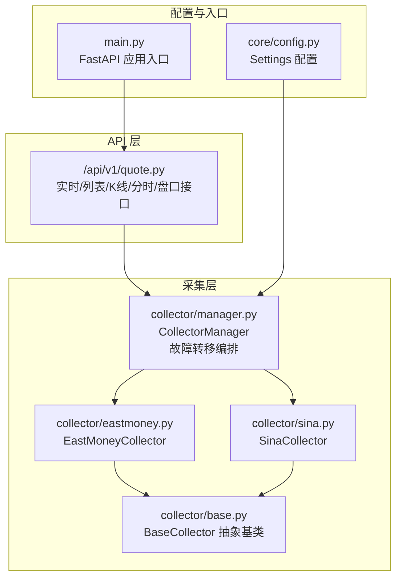
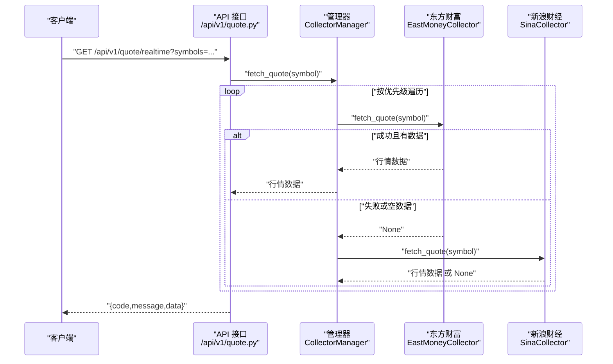
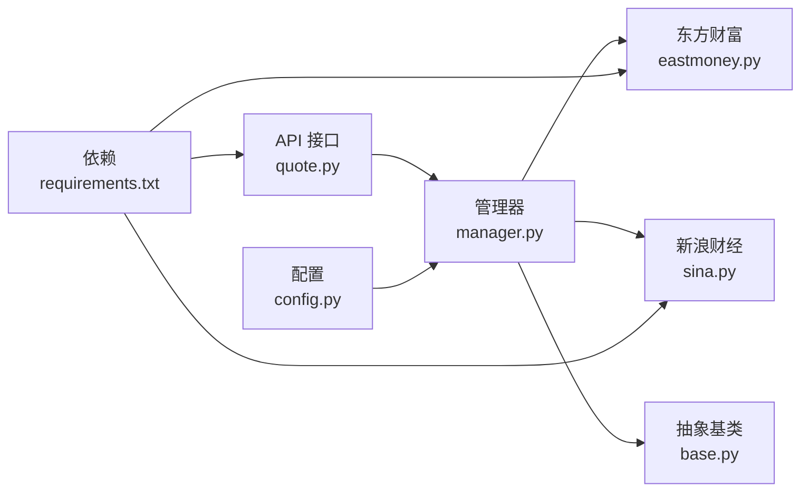

# 数据采集系统

<cite>
**本文引用的文件**
- [backend/app/services/collector/base.py](file://backend/app/services/collector/base.py)
- [backend/app/services/collector/eastmoney.py](file://backend/app/services/collector/eastmoney.py)
- [backend/app/services/collector/sina.py](file://backend/app/services/collector/sina.py)
- [backend/app/services/collector/manager.py](file://backend/app/services/collector/manager.py)
- [backend/app/api/v1/quote.py](file://backend/app/api/v1/quote.py)
- [backend/app/core/config.py](file://backend/app/core/config.py)
- [backend/app/main.py](file://backend/app/main.py)
- [backend/requirements.txt](file://backend/requirements.txt)
</cite>

## 目录
1. [简介](#简介)
2. [项目结构](#项目结构)
3. [核心组件](#核心组件)
4. [架构总览](#架构总览)
5. [详细组件分析](#详细组件分析)
6. [依赖分析](#依赖分析)
7. [性能考虑](#性能考虑)
8. [故障排查指南](#故障排查指南)
9. [结论](#结论)
10. [附录](#附录)

## 简介
本文件面向数据采集系统，聚焦于采集器的架构设计与实现细节，涵盖抽象基类、多数据源实现（东方财富、新浪财经）、采集器管理器的故障转移协调机制。文档还说明了不同数据源在接口参数、数据格式、异常处理方面的差异，以及采集任务的调度与并发控制思路、数据缓存策略建议、配置指南、自定义数据源开发与扩展方法，并给出数据质量保证、错误恢复与性能监控方案。

## 项目结构
后端采用 FastAPI 应用，数据采集模块位于 app/services/collector 下，API 层位于 app/api/v1，配置位于 app/core/config.py。采集器通过 CollectorManager 统一编排，优先级为“东方财富 > 新浪财经”，若前者失败则自动切换到后者。

图表来源
- [backend/app/api/v1/quote.py:1-65](file://backend/app/api/v1/quote.py#L1-L65)
- [backend/app/services/collector/manager.py:1-94](file://backend/app/services/collector/manager.py#L1-L94)
- [backend/app/services/collector/eastmoney.py:1-297](file://backend/app/services/collector/eastmoney.py#L1-L297)
- [backend/app/services/collector/sina.py:1-312](file://backend/app/services/collector/sina.py#L1-L312)
- [backend/app/services/collector/base.py:1-45](file://backend/app/services/collector/base.py#L1-L45)
- [backend/app/core/config.py:1-43](file://backend/app/core/config.py#L1-L43)
- [backend/app/main.py:1-48](file://backend/app/main.py#L1-L48)

章节来源
- [backend/app/api/v1/quote.py:1-65](file://backend/app/api/v1/quote.py#L1-L65)
- [backend/app/services/collector/manager.py:1-94](file://backend/app/services/collector/manager.py#L1-L94)
- [backend/app/services/collector/base.py:1-45](file://backend/app/services/collector/base.py#L1-L45)
- [backend/app/core/config.py:1-43](file://backend/app/core/config.py#L1-L43)
- [backend/app/main.py:1-48](file://backend/app/main.py#L1-L48)

## 核心组件
- 抽象基类 BaseCollector：定义统一的采集接口（实时行情、行情列表、K线、分时、盘口），并提供通用工具方法（如生成东方财富 secid、市场前缀）。
- 东方财富采集器 EastMoneyCollector：基于异步 HTTP 客户端，封装带重试的请求、JSON 解析与字段映射，支持行情、列表、K线、分时、盘口等接口。
- 新浪财经采集器 SinaCollector：同样封装带重试的请求，解析新浪特有的文本/JSONP 格式，支持相同的数据维度。
- 采集器管理器 CollectorManager：按优先级顺序调用各采集器，遇到空数据或异常则自动切换下一个，最终汇总结果或返回 None。
- API 接口 quote.py：对外暴露实时、列表、K线、分时、盘口查询接口，内部直接委托 CollectorManager 执行采集。
- 配置 Settings：集中管理数据库、Redis、数据源优先级、缓存 TTL、采集间隔等参数。

章节来源
- [backend/app/services/collector/base.py:1-45](file://backend/app/services/collector/base.py#L1-L45)
- [backend/app/services/collector/eastmoney.py:1-297](file://backend/app/services/collector/eastmoney.py#L1-L297)
- [backend/app/services/collector/sina.py:1-312](file://backend/app/services/collector/sina.py#L1-L312)
- [backend/app/services/collector/manager.py:1-94](file://backend/app/services/collector/manager.py#L1-L94)
- [backend/app/api/v1/quote.py:1-65](file://backend/app/api/v1/quote.py#L1-L65)
- [backend/app/core/config.py:1-43](file://backend/app/core/config.py#L1-L43)

## 架构总览
系统采用“API → 管理器 → 多采集器”的分层架构。API 层负责请求接入与参数校验；管理器负责故障转移与聚合；采集器负责具体数据源对接与格式转换；配置层提供运行期参数。

图表来源
- [backend/app/api/v1/quote.py:7-16](file://backend/app/api/v1/quote.py#L7-L16)
- [backend/app/services/collector/manager.py:21-33](file://backend/app/services/collector/manager.py#L21-L33)
- [backend/app/services/collector/eastmoney.py:69-85](file://backend/app/services/collector/eastmoney.py#L69-L85)
- [backend/app/services/collector/sina.py:64-107](file://backend/app/services/collector/sina.py#L64-L107)

## 详细组件分析

### 抽象基类 BaseCollector
- 职责：定义统一采集接口，确保各采集器实现一致的契约；提供通用工具方法（如生成东方财富 secid、市场前缀）。
- 设计要点：接口均为异步，便于高并发场景；工具方法复用度高，减少重复逻辑。

章节来源
- [backend/app/services/collector/base.py:5-45](file://backend/app/services/collector/base.py#L5-L45)

### 东方财富采集器 EastMoneyCollector
- 请求与重试：使用异步 HTTP 客户端，封装带重试的请求方法，捕获常见网络异常并记录日志。
- 接口实现：
  - 实时行情：构造 secid 参数，调用接口并解析关键字段，映射为统一结构。
  - 行情列表：支持按字段与方向排序，按市场筛选，返回标准化列表。
  - K线：周期与复权类型映射，解析字符串分隔的 K 线条目。
  - 分时：解析趋势数组，计算时间、价格、均价、成交量。
  - 盘口：解析买卖档位，映射为统一结构。
- 异常处理：对网络错误、解析异常进行捕获与告警，失败时返回 None。

章节来源
- [backend/app/services/collector/eastmoney.py:26-297](file://backend/app/services/collector/eastmoney.py#L26-L297)

### 新浪财经采集器 SinaCollector
- 请求与重试：与东方财富类似，封装带重试的请求方法。
- 接口实现：
  - 实时行情：解析文本格式，拆分字段，计算涨跌额与涨跌幅。
  - 行情列表：通过新浪行情中心 API 获取列表，估算总数。
  - K线：解析 JSONP 包裹的 JSON，提取 K 线字段。
  - 分时：解析 JSONP 包裹的分时数据，提取时间、价格、均价、成交量。
  - 盘口：复用行情接口文本字段，映射买卖档位。
- 异常处理：对网络错误、解析异常进行捕获与告警，失败时返回 None。

章节来源
- [backend/app/services/collector/sina.py:24-312](file://backend/app/services/collector/sina.py#L24-L312)

### 采集器管理器 CollectorManager
- 协调机制：维护采集器字典与优先级列表，逐个尝试，遇空数据或异常即切换下一个。
- 统一接口：对实时、列表、K线、分时、盘口五类接口分别提供代理方法。
- 故障转移：当某数据源返回 None 或抛出异常时，记录日志并继续下一个数据源，直至成功或全部失败。

章节来源
- [backend/app/services/collector/manager.py:12-94](file://backend/app/services/collector/manager.py#L12-L94)

### API 接口 quote.py
- 实时行情：接收逗号分隔的股票代码，最多取前若干只，逐个调用管理器获取数据并组装响应。
- 行情列表：接收市场、排序字段、排序方向、页码、页大小等参数，调用管理器获取列表。
- K线/分时/盘口：接收 symbol 及周期/复权等参数，调用管理器获取对应数据。
- 错误码：当数据为空时返回特定错误码，便于前端识别“数据源暂不可用”。

章节来源
- [backend/app/api/v1/quote.py:7-65](file://backend/app/api/v1/quote.py#L7-L65)

### 配置 Settings
- 数据源优先级：PRIMARY_DATA_SOURCE、FALLBACK_DATA_SOURCE 控制采集器优先级。
- 缓存与采集：QUOTE_CACHE_TTL、QUOTE_COLLECT_INTERVAL 提供缓存与采集间隔的配置入口。
- 其他：数据库、Redis、AI 服务、Celery 等参数，便于系统整体运行参数化。

章节来源
- [backend/app/core/config.py:5-43](file://backend/app/core/config.py#L5-L43)

## 依赖分析
- 组件耦合：API 层仅依赖管理器；管理器依赖抽象基类与具体采集器；采集器依赖抽象基类；配置独立于业务逻辑。
- 外部依赖：httpx（异步 HTTP）、logging（日志）、datetime（时间戳）、json（解析）、FastAPI（API 框架）。
- 并发与连接池：采集器使用异步 HTTP 客户端，限制最大连接数与 keepalive 连接数，避免资源耗尽。

图表来源
- [backend/app/api/v1/quote.py:1-65](file://backend/app/api/v1/quote.py#L1-L65)
- [backend/app/services/collector/manager.py:1-94](file://backend/app/services/collector/manager.py#L1-L94)
- [backend/app/services/collector/base.py:1-45](file://backend/app/services/collector/base.py#L1-L45)
- [backend/app/services/collector/eastmoney.py:1-297](file://backend/app/services/collector/eastmoney.py#L1-L297)
- [backend/app/services/collector/sina.py:1-312](file://backend/app/services/collector/sina.py#L1-L312)
- [backend/app/core/config.py:1-43](file://backend/app/core/config.py#L1-L43)
- [backend/requirements.txt:1-17](file://backend/requirements.txt#L1-L17)

章节来源
- [backend/app/api/v1/quote.py:1-65](file://backend/app/api/v1/quote.py#L1-L65)
- [backend/app/services/collector/manager.py:1-94](file://backend/app/services/collector/manager.py#L1-L94)
- [backend/app/services/collector/base.py:1-45](file://backend/app/services/collector/base.py#L1-L45)
- [backend/app/services/collector/eastmoney.py:1-297](file://backend/app/services/collector/eastmoney.py#L1-L297)
- [backend/app/services/collector/sina.py:1-312](file://backend/app/services/collector/sina.py#L1-L312)
- [backend/app/core/config.py:1-43](file://backend/app/core/config.py#L1-L43)
- [backend/requirements.txt:1-17](file://backend/requirements.txt#L1-L17)

## 性能考虑
- 并发与限流：采集器使用异步 HTTP 客户端并设置最大连接数与 keepalive 连接数，避免连接风暴；可结合队列与信号量进一步限制并发。
- 重试策略：统一的指数退避重试，降低抖动对上游的影响；可根据业务调整重试次数与延迟。
- 缓存策略：配置中提供缓存 TTL 与采集间隔，建议在 API 层或网关层增加 Redis 缓存，命中则直接返回，未命中再触发采集。
- 压测与熔断：建议引入超时与熔断机制，超过阈值快速失败并降级，避免雪崩效应。
- 日志与指标：为每个采集器埋点关键指标（成功率、耗时、重试次数），结合链路追踪定位瓶颈。

## 故障排查指南
- 症状：接口返回“数据源暂不可用”
  - 可能原因：所有数据源均失败或返回空数据。
  - 排查步骤：查看日志中管理器的警告与错误信息；确认采集器是否抛出异常；检查网络连通性与目标站点可用性。
- 症状：实时/列表/分时/K线/盘口数据为空
  - 可能原因：目标数据源返回空或解析失败。
  - 排查步骤：检查采集器日志中的解析异常；核对参数（如 symbol、周期、排序字段）是否正确；验证目标站点接口返回格式。
- 症状：偶发超时/连接断开
  - 可能原因：网络抖动或目标站点限流。
  - 排查步骤：查看采集器重试日志；适当增大超时与重试次数；评估限速策略与并发上限。
- 症状：性能抖动
  - 可能原因：未启用缓存或缓存命中率低。
  - 排查步骤：开启缓存并合理设置 TTL；观察热点数据的缓存命中情况；必要时增加本地缓存层。

章节来源
- [backend/app/services/collector/manager.py:21-94](file://backend/app/services/collector/manager.py#L21-L94)
- [backend/app/services/collector/eastmoney.py:41-67](file://backend/app/services/collector/eastmoney.py#L41-L67)
- [backend/app/services/collector/sina.py:36-62](file://backend/app/services/collector/sina.py#L36-L62)
- [backend/app/api/v1/quote.py:7-65](file://backend/app/api/v1/quote.py#L7-L65)

## 结论
该数据采集系统以抽象基类统一契约，以管理器实现故障转移，以两个数据源覆盖主要行情渠道。通过异步 HTTP 客户端与重试机制提升稳定性，配合配置化的缓存与采集策略，具备良好的可扩展性与可维护性。建议后续补充缓存中间层、性能监控与熔断降级能力，以进一步提升系统鲁棒性与可观测性。

## 附录

### 数据格式转换对比
- 实时行情
  - 东方财富：返回字段较多，包含换手率、昨收等，解析为统一结构。
  - 新浪财经：文本字段解析，计算涨跌额与涨跌幅，部分字段缺失（如换手率）。
- 行情列表
  - 东方财富：支持按字段与方向排序，返回总数。
  - 新浪财经：通过中心 API 获取，估算总数。
- K线
  - 东方财富：字符串分隔的 K 线条目，解析为标准字段。
  - 新浪财经：JSONP 包裹 JSON，解析 K 线字段。
- 分时
  - 东方财富：趋势数组解析，包含均价。
  - 新浪财经：JSONP 包裹分时数据，包含均价。
- 盘口
  - 东方财富：买卖档位字段明确。
  - 新浪财经：复用行情文本字段映射买卖档位。

章节来源
- [backend/app/services/collector/eastmoney.py:69-296](file://backend/app/services/collector/eastmoney.py#L69-L296)
- [backend/app/services/collector/sina.py:64-311](file://backend/app/services/collector/sina.py#L64-L311)

### 采集任务调度与并发控制
- 当前实现：API 层按需触发采集，管理器逐个尝试数据源；未见显式的定时任务或队列调度。
- 建议：
  - 使用 Celery + Redis 实现定时任务与消息队列，按配置的采集间隔批量拉取。
  - 引入信号量或队列长度限制，防止并发过高导致目标站点限流。
  - 对热点 symbol 增加本地缓存，缩短响应时间。

章节来源
- [backend/app/core/config.py:26-31](file://backend/app/core/config.py#L26-L31)
- [backend/app/api/v1/quote.py:7-65](file://backend/app/api/v1/quote.py#L7-L65)

### 数据质量保证与错误恢复
- 质量保证：统一的数据结构、字段映射与时间戳；对缺失字段进行默认值填充；对异常进行日志记录与告警。
- 错误恢复：管理器自动故障转移；采集器内部重试；API 层对空数据返回明确错误码。
- 建议：增加数据校验规则（如价格/成交量范围检查）、异常上报与告警通道、失败重试队列与死信处理。

章节来源
- [backend/app/services/collector/manager.py:21-94](file://backend/app/services/collector/manager.py#L21-L94)
- [backend/app/services/collector/eastmoney.py:41-67](file://backend/app/services/collector/eastmoney.py#L41-L67)
- [backend/app/services/collector/sina.py:36-62](file://backend/app/services/collector/sina.py#L36-L62)
- [backend/app/api/v1/quote.py:7-65](file://backend/app/api/v1/quote.py#L7-L65)

### 性能监控方案
- 指标：成功率、平均/95 分位耗时、重试次数、缓存命中率、并发数。
- 工具：Prometheus + Grafana 或云监控；链路追踪（如 OpenTelemetry）。
- 告警：针对失败率突增、超时比例上升、缓存命中率下降等阈值触发。

### 数据采集配置指南
- 数据源优先级：PRIMARY_DATA_SOURCE、FALLBACK_DATA_SOURCE。
- 缓存与采集：QUOTE_CACHE_TTL、QUOTE_COLLECT_INTERVAL。
- 其他：DATABASE_URL、REDIS_URL、AI 服务参数、Celery Broker/Result Backend 等。

章节来源
- [backend/app/core/config.py:16-31](file://backend/app/core/config.py#L16-L31)

### 自定义数据源开发与扩展
- 步骤：
  1. 继承 BaseCollector，实现 fetch_quote、fetch_quote_list、fetch_kline、fetch_timeline、fetch_orderbook。
  2. 在管理器中注册新采集器，并将其名称加入优先级列表。
  3. 在 API 层按需暴露新接口或复用现有接口。
- 注意事项：
  - 保持返回数据结构一致；
  - 实现带重试的请求方法；
  - 记录清晰的日志以便排查；
  - 遵循目标站点的速率限制与协议规范。

章节来源
- [backend/app/services/collector/base.py:5-45](file://backend/app/services/collector/base.py#L5-L45)
- [backend/app/services/collector/manager.py:15-20](file://backend/app/services/collector/manager.py#L15-L20)
- [backend/app/api/v1/quote.py:7-65](file://backend/app/api/v1/quote.py#L7-L65)