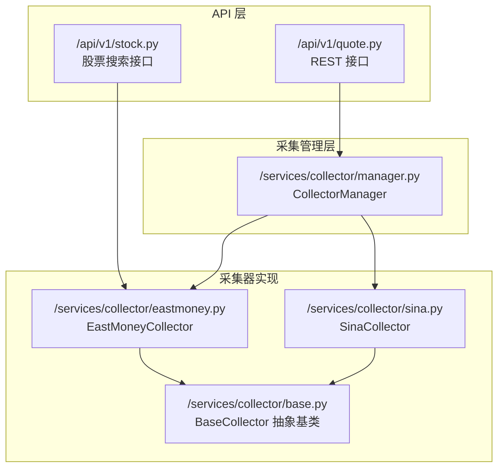
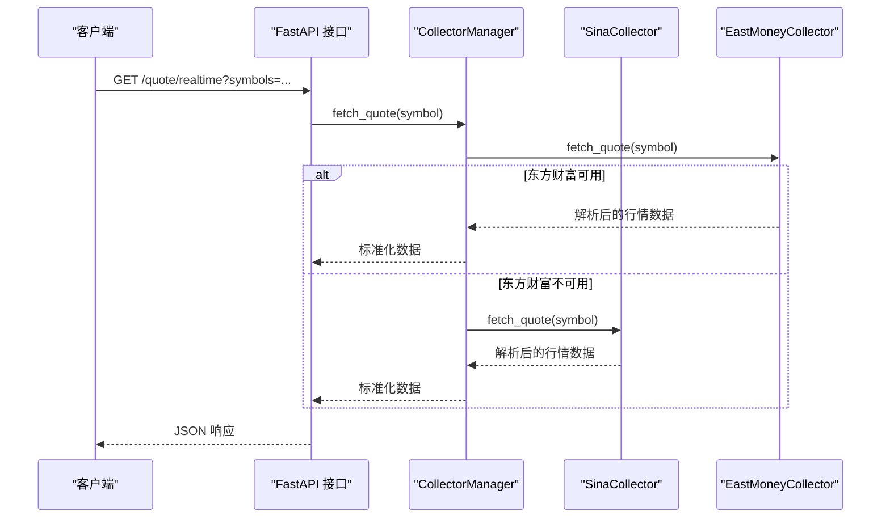
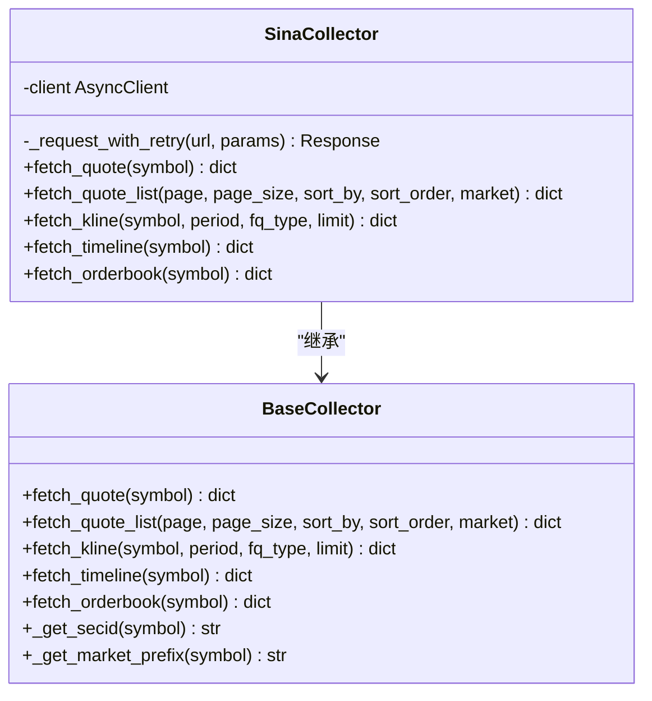
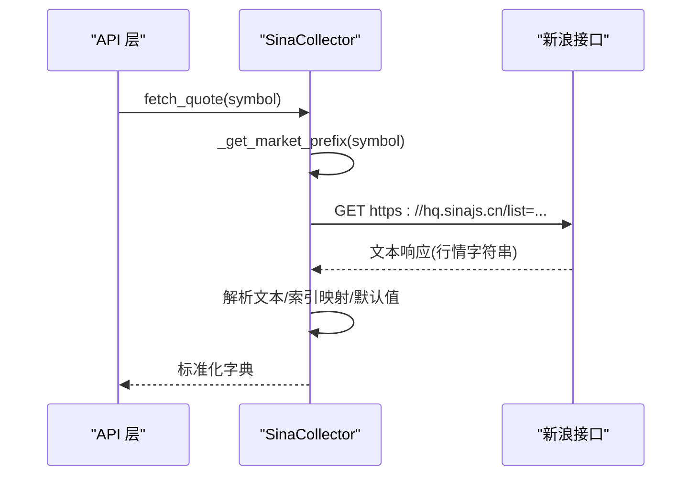
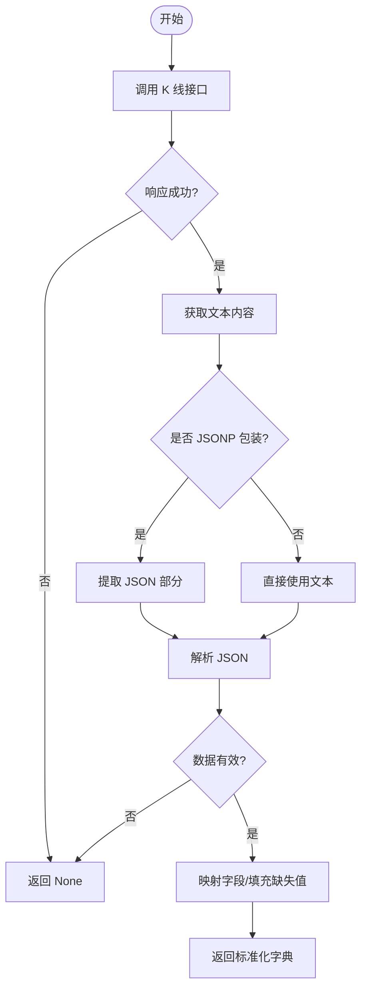
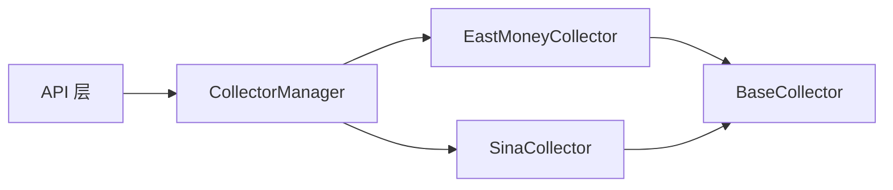

# 新浪数据采集器

<cite>
**本文引用的文件**
- [sina.py](file://backend/app/services/collector/sina.py)
- [base.py](file://backend/app/services/collector/base.py)
- [eastmoney.py](file://backend/app/services/collector/eastmoney.py)
- [manager.py](file://backend/app/services/collector/manager.py)
- [quote.py](file://backend/app/api/v1/quote.py)
- [stock.py](file://backend/app/api/v1/stock.py)
- [README.md](file://README.md)
</cite>

## 目录
1. [简介](#简介)
2. [项目结构](#项目结构)
3. [核心组件](#核心组件)
4. [架构概览](#架构概览)
5. [详细组件分析](#详细组件分析)
6. [依赖关系分析](#依赖关系分析)
7. [性能考虑](#性能考虑)
8. [故障排查指南](#故障排查指南)
9. [结论](#结论)

## 简介
本文件面向开发者与运维人员，系统性解析“新浪数据采集器”的实现细节，重点覆盖以下方面：
- 与“东方财富数据源”的差异对比与互补策略
- API 调用方式、数据接口规范与响应格式解析
- 新浪数据源的特性：接口规范、响应格式、字段映射关系
- 特有数据结构与编码处理：字符编码转换、数据清洗规则、异常数据过滤
- 与基类接口的实现细节：参数传递、返回数据标准化
- 性能优化策略：并发控制、网络请求优化、数据质量保障

## 项目结构
后端采用 FastAPI + Python 异步架构，数据采集层位于 `backend/app/services/collector/`，通过统一的采集管理器进行故障转移与负载均衡，并对外暴露 REST 接口。

图表来源
- [quote.py:1-65](file://backend/app/api/v1/quote.py#L1-L65)
- [stock.py:1-37](file://backend/app/api/v1/stock.py#L1-L37)
- [manager.py:1-94](file://backend/app/services/collector/manager.py#L1-L94)
- [base.py:1-45](file://backend/app/services/collector/base.py#L1-L45)
- [eastmoney.py:1-297](file://backend/app/services/collector/eastmoney.py#L1-L297)
- [sina.py:1-312](file://backend/app/services/collector/sina.py#L1-L312)

章节来源
- [README.md:92-126](file://README.md#L92-L126)

## 核心组件
- 抽象基类 BaseCollector：定义统一的数据采集接口与通用工具方法（如市场前缀与 SECID 生成），确保不同数据源实现的一致性。
- 采集管理器 CollectorManager：按优先级顺序调用各采集器，实现故障转移与容错。
- 采集器实现：
  - EastMoneyCollector：基于东方财富接口，字段丰富、返回总量、支持历史数据与复权类型。
  - SinaCollector：基于新浪接口，作为备用数据源，提供行情、K线、分时、盘口等能力，部分字段为估算值。

章节来源
- [base.py:5-45](file://backend/app/services/collector/base.py#L5-L45)
- [manager.py:12-94](file://backend/app/services/collector/manager.py#L12-L94)
- [eastmoney.py:26-297](file://backend/app/services/collector/eastmoney.py#L26-L297)
- [sina.py:24-312](file://backend/app/services/collector/sina.py#L24-L312)

## 架构概览
采集流程遵循“API -> 管理器 -> 采集器”的分层设计，管理器负责故障转移与结果合并，采集器负责具体接口调用与数据解析。

图表来源
- [quote.py:7-16](file://backend/app/api/v1/quote.py#L7-L16)
- [manager.py:21-33](file://backend/app/services/collector/manager.py#L21-L33)
- [eastmoney.py:69-85](file://backend/app/services/collector/eastmoney.py#L69-L85)
- [sina.py:64-107](file://backend/app/services/collector/sina.py#L64-L107)

## 详细组件分析

### SinaCollector 实现详解
SinaCollector 继承自 BaseCollector，提供以下能力：
- 实时行情：通过单个接口返回多字段，需按固定索引解析；对缺失字段进行默认值填充。
- 行情列表：通过新浪行情中心 API 获取 A 股列表，支持排序与市场筛选；总数为估算值。
- K线数据：返回 JSONP，需提取 JSON 内容；字段中缺少换手率与涨跌幅，以 0 填充。
- 分时数据：返回 JSONP，需提取 JSON 内容；包含昨收与分时点集合。
- 盘口数据：通过行情接口解析买卖盘口前五档，字段索引固定。

关键实现要点
- 请求重试：统一的带退避重试逻辑，捕获常见网络异常并记录日志。
- 字符串解析：行情与盘口数据为字符串拼接，需按引号分割与索引定位。
- JSONP 解析：K线与分时接口返回 JSONP，需去除函数包装后解析。
- 字段映射：将新浪字段映射为统一标准字段，缺失字段以 0 或空字符串填充。
- 时间戳与日期：统一使用本地时间格式化输出。

章节来源
- [sina.py:24-312](file://backend/app/services/collector/sina.py#L24-L312)

#### 类关系图

图表来源
- [base.py:5-45](file://backend/app/services/collector/base.py#L5-L45)
- [sina.py:24-34](file://backend/app/services/collector/sina.py#L24-L34)

#### 实时行情调用序列

图表来源
- [sina.py:64-107](file://backend/app/services/collector/sina.py#L64-L107)

#### K线数据解析流程

图表来源
- [sina.py:173-227](file://backend/app/services/collector/sina.py#L173-L227)

### 与 EastMoneyCollector 的差异对比
- 接口来源与稳定性
  - 东方财富：主数据源，接口稳定、字段丰富、返回总量，适合生产环境。
  - 新浪：备用数据源，接口相对简单，部分字段为估算值，适合故障转移与兜底。
- 字段完整性
  - 东方财富：返回字段更全，包含换手率、涨跌幅等，且提供历史数据与复权类型。
  - 新浪：部分字段缺失（如换手率、涨跌幅），以 0 填充；K线与分时返回 JSONP，需额外解析。
- 列表查询
  - 东方财富：支持更丰富的排序字段与市场筛选，返回总数准确。
  - 新浪：排序字段有限，总数为估算值，市场筛选较简单。
- 复权与历史数据
  - 东方财富：支持多种复权类型与历史数据查询。
  - 新浪：未提供复权与历史数据接口。

章节来源
- [eastmoney.py:69-297](file://backend/app/services/collector/eastmoney.py#L69-L297)
- [sina.py:109-171](file://backend/app/services/collector/sina.py#L109-L171)

### API 调用方式与数据格式处理
- 实时行情
  - 参数：symbol（股票代码）
  - 返回：标准化字典，包含价格、涨跌、成交量、时间戳等字段
- 行情列表
  - 参数：page、page_size、sort_by、sort_order、market
  - 返回：包含 items、total、page、page_size 的字典
- K线数据
  - 参数：symbol、period、fq_type、limit
  - 返回：包含 symbol、period、fq_type、items 的字典
- 分时数据
  - 参数：symbol
  - 返回：包含 symbol、date、prev_close、points 的字典
- 盘口数据
  - 参数：symbol
  - 返回：包含 symbol、timestamp、asks、bids 的字典

章节来源
- [quote.py:7-65](file://backend/app/api/v1/quote.py#L7-L65)
- [eastmoney.py:69-297](file://backend/app/services/collector/eastmoney.py#L69-L297)
- [sina.py:64-312](file://backend/app/services/collector/sina.py#L64-L312)

### 数据格式与字段映射
- 统一字段约定
  - symbol：股票代码
  - name：股票名称
  - market：市场标识（sh/sz）
  - price：当前价格
  - change：涨跌额
  - change_pct：涨跌幅%
  - open/high/low：开盘/最高/最低
  - prev_close：昨收
  - volume/amount：成交量/成交额
  - turnover_rate：换手率（若源无则为 0）
  - timestamp/date：时间戳/日期
  - points：分时点集合（包含 time、price、avg、volume）
  - asks/bids：买卖盘口（前五档）
- 新浪字段映射
  - 实时行情：通过固定索引解析，缺失字段以 0 填充
  - K线/分时：JSONP 解包后解析，字段映射为统一结构
  - 盘口：固定索引解析买卖盘口
- 东方财富字段映射
  - 使用字段名映射，返回字段更完整

章节来源
- [sina.py:64-312](file://backend/app/services/collector/sina.py#L64-L312)
- [eastmoney.py:280-297](file://backend/app/services/collector/eastmoney.py#L280-L297)

### 特有数据结构与编码处理
- 字符串拼接解析
  - 实时行情与盘口数据为字符串拼接，需按引号分割与索引定位
- JSONP 解析
  - K线与分时接口返回 JSONP，需去除函数包装后解析
- 缺失字段处理
  - 对于缺失字段统一以 0 或空字符串填充，保证返回结构一致性
- 异常数据过滤
  - 对空响应、字段数量不足、状态码非 200 的情况返回 None

章节来源
- [sina.py:70-107](file://backend/app/services/collector/sina.py#L70-L107)
- [sina.py:194-227](file://backend/app/services/collector/sina.py#L194-L227)
- [sina.py:280-311](file://backend/app/services/collector/sina.py#L280-L311)

### 与基类接口的实现细节
- 继承关系：SinaCollector 与 EastMoneyCollector 均继承 BaseCollector，实现统一接口
- 工具方法：BaseCollector 提供 _get_secid 与 _get_market_prefix，用于生成东方财富所需的 SECID 与市场前缀
- 参数传递：API 层将查询参数透传至采集管理器，再由采集器实现具体逻辑
- 返回标准化：采集器内部将不同源的字段映射为统一结构，便于上层消费

章节来源
- [base.py:36-45](file://backend/app/services/collector/base.py#L36-L45)
- [eastmoney.py:69-297](file://backend/app/services/collector/eastmoney.py#L69-L297)
- [sina.py:64-312](file://backend/app/services/collector/sina.py#L64-L312)

## 依赖关系分析
- 组件耦合
  - CollectorManager 依赖 BaseCollector 接口，实现对具体采集器的解耦
  - API 层仅依赖 CollectorManager，不关心具体实现
- 外部依赖
  - httpx：异步 HTTP 客户端，支持连接池与超时控制
  - logging：统一的日志记录，便于问题定位
- 故障转移
  - 通过优先级顺序依次尝试，任一成功即返回，失败则继续下一个数据源

图表来源
- [manager.py:12-94](file://backend/app/services/collector/manager.py#L12-L94)
- [base.py:5-45](file://backend/app/services/collector/base.py#L5-L45)
- [eastmoney.py:26-39](file://backend/app/services/collector/eastmoney.py#L26-L39)
- [sina.py:24-34](file://backend/app/services/collector/sina.py#L24-L34)

章节来源
- [manager.py:12-94](file://backend/app/services/collector/manager.py#L12-L94)
- [base.py:5-45](file://backend/app/services/collector/base.py#L5-L45)

## 性能考虑
- 并发控制
  - httpx AsyncClient 使用连接池限制最大连接数与保活连接数，避免资源耗尽
  - 重试策略采用指数退避，降低对上游的压力
- 网络请求优化
  - 设置合理的连接、读写、池超时，减少长时间阻塞
  - 固定浏览器请求头，降低被反爬拦截的概率
- 数据质量保证
  - 对异常响应与解析失败进行日志记录与降级处理
  - 对缺失字段进行默认值填充，保证结构一致性
  - 通过故障转移提升整体可用性

章节来源
- [sina.py:27-34](file://backend/app/services/collector/sina.py#L27-L34)
- [eastmoney.py:32-39](file://backend/app/services/collector/eastmoney.py#L32-L39)
- [manager.py:21-33](file://backend/app/services/collector/manager.py#L21-L33)

## 故障排查指南
- 常见问题
  - 状态码非 200：检查目标接口可用性与参数合法性
  - JSONP 解析失败：确认返回内容是否包含函数包装，正确提取 JSON 部分
  - 字段索引越界：验证响应格式是否符合预期，必要时增加长度校验
  - 重试失败：查看日志中的错误类型，调整重试次数与延迟
- 日志定位
  - 采集器内部记录请求异常与解析失败信息，便于快速定位问题
  - 管理器记录数据源切换与失败原因，辅助故障转移分析

章节来源
- [sina.py:36-62](file://backend/app/services/collector/sina.py#L36-L62)
- [eastmoney.py:41-67](file://backend/app/services/collector/eastmoney.py#L41-L67)
- [manager.py:21-33](file://backend/app/services/collector/manager.py#L21-L33)

## 结论
SinaCollector 作为备用数据源，在接口简洁与故障转移方面提供了重要补充。通过与 EastMoneyCollector 的差异化配合，系统实现了高可用与数据质量的平衡。建议在生产环境中优先使用东方财富接口，同时保留新浪接口作为兜底方案，并持续监控与优化重试与解析逻辑，以进一步提升稳定性与性能。