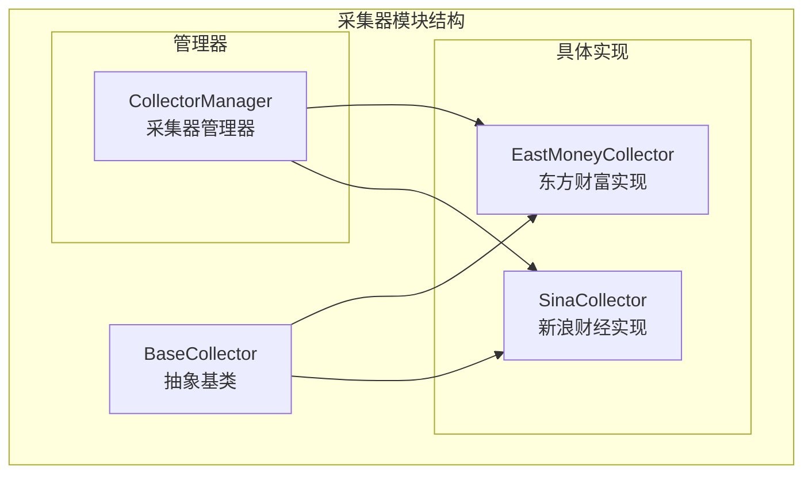
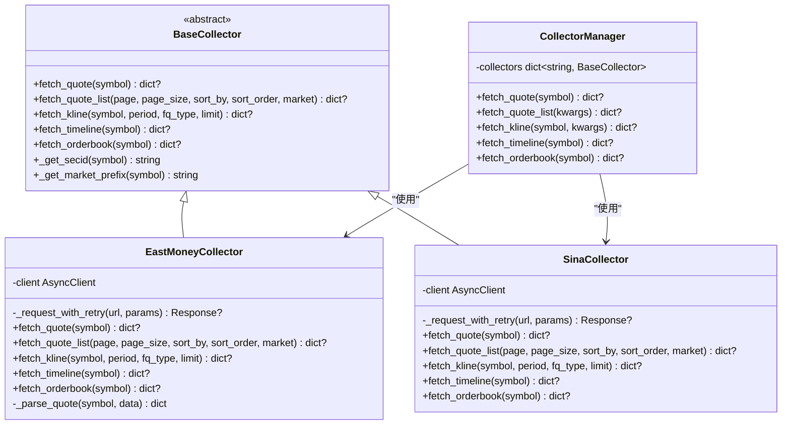
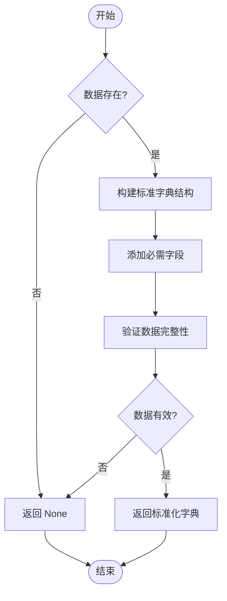
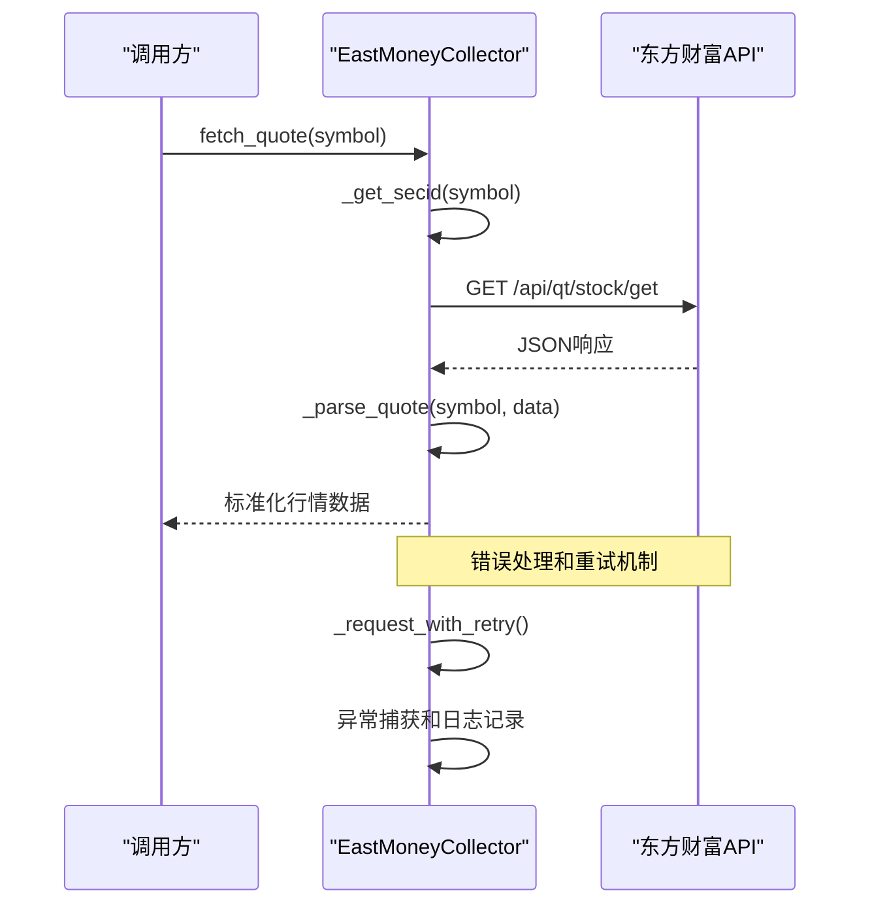
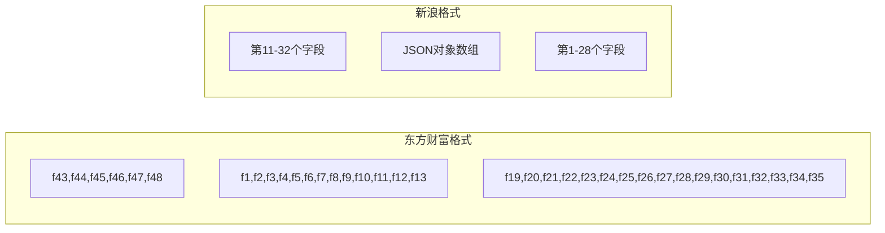
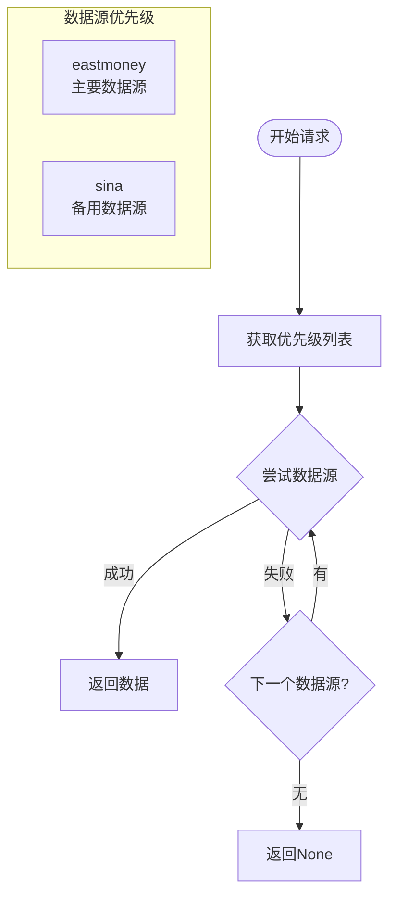
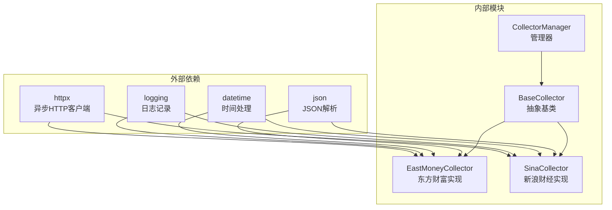

# 采集器基类架构

<cite>
**本文档引用的文件**
- [base.py](file://backend/app/services/collector/base.py)
- [eastmoney.py](file://backend/app/services/collector/eastmoney.py)
- [sina.py](file://backend/app/services/collector/sina.py)
- [manager.py](file://backend/app/services/collector/manager.py)
</cite>

## 目录
1. [简介](#简介)
2. [项目结构](#项目结构)
3. [核心组件](#核心组件)
4. [架构概览](#架构概览)
5. [详细组件分析](#详细组件分析)
6. [依赖关系分析](#依赖关系分析)
7. [性能考虑](#性能考虑)
8. [故障排除指南](#故障排除指南)
9. [结论](#结论)

## 简介

本文件详细解析了Stock-View项目中的采集器基类架构，重点分析BaseCollector抽象基类的设计理念和实现细节。该架构采用抽象基类模式，为多个数据源提供统一的接口规范，支持实时行情、行情列表、K线数据、分时数据和盘口数据的采集功能。

## 项目结构

采集器模块位于后端应用的服务层，采用清晰的层次化组织结构：

**图表来源**
- [base.py:5-45](file://backend/app/services/collector/base.py#L5-L45)
- [eastmoney.py:26-297](file://backend/app/services/collector/eastmoney.py#L26-L297)
- [sina.py:24-312](file://backend/app/services/collector/sina.py#L24-L312)
- [manager.py:12-94](file://backend/app/services/collector/manager.py#L12-L94)

**章节来源**
- [base.py:1-45](file://backend/app/services/collector/base.py#L1-L45)
- [eastmoney.py:1-297](file://backend/app/services/collector/eastmoney.py#L1-L297)
- [sina.py:1-312](file://backend/app/services/collector/sina.py#L1-L312)
- [manager.py:1-94](file://backend/app/services/collector/manager.py#L1-L94)

## 核心组件

### BaseCollector 抽象基类

BaseCollector是整个采集器架构的核心抽象基类，定义了统一的数据采集接口规范。该类采用Python的ABC（Abstract Base Classes）模式，确保所有具体实现都必须实现指定的抽象方法。

#### 抽象方法定义

1. **fetch_quote** - 实时行情获取
   - 参数：symbol（股票代码）
   - 返回：包含完整行情信息的字典或None
   - 功能：获取单只股票的实时价格、涨跌幅度、成交量等信息

2. **fetch_quote_list** - 行情列表获取  
   - 参数：page、page_size、sort_by、sort_order、market
   - 返回：包含分页行情列表的字典或None
   - 功能：获取股票市场的综合行情列表，支持排序和筛选

3. **fetch_kline** - K线数据获取
   - 参数：symbol、period、fq_type、limit
   - 返回：包含K线数据的字典或None
   - 功能：获取指定周期的K线数据，支持复权类型

4. **fetch_timeline** - 分时数据获取
   - 参数：symbol
   - 返回：包含分时数据的字典或None
   - 功能：获取当日分时交易数据

5. **fetch_orderbook** - 盘口数据获取
   - 参数：symbol
   - 返回：包含买卖盘口数据的字典或None
   - 功能：获取实时买卖盘口数据

#### 通用工具方法

1. **_get_secid** - 东方财富secid格式生成
   - 输入：股票代码
   - 输出：东方财富格式的secid标识符
   - 规则：上海市场以"1."开头，深圳市场以"0."开头

2. **_get_market_prefix** - 市场前缀获取
   - 输入：股票代码
   - 输出：市场前缀标识
   - 规则：上海市场返回"sh"，深圳市场返回"sz"

**章节来源**
- [base.py:5-45](file://backend/app/services/collector/base.py#L5-L45)

## 架构概览

整个采集器架构采用"抽象基类 + 多实现 + 管理器"的设计模式，实现了高度的可扩展性和容错能力。

**图表来源**
- [base.py:5-45](file://backend/app/services/collector/base.py#L5-L45)
- [eastmoney.py:26-297](file://backend/app/services/collector/eastmoney.py#L26-L297)
- [sina.py:24-312](file://backend/app/services/collector/sina.py#L24-L312)
- [manager.py:12-94](file://backend/app/services/collector/manager.py#L12-L94)

## 详细组件分析

### BaseCollector 抽象基类详解

BaseCollector作为所有采集器实现的基础，提供了统一的接口规范和通用工具方法。

#### 接口设计原则

1. **一致性原则**：所有抽象方法都遵循相同的参数和返回值规范
2. **异步性原则**：所有方法都采用async/await模式，支持并发调用
3. **容错性原则**：方法返回Optional类型，允许None值表示失败
4. **标准化原则**：返回数据结构保持一致的字段命名规范

#### 参数规范

- **symbol**：股票代码字符串，支持6位数字代码
- **page/page_size**：分页参数，用于行情列表的分页查询
- **sort_by/sort_order**：排序参数，支持多种排序字段和方向
- **period**：时间周期参数，支持1分钟到月级别的K线周期
- **fq_type**：复权类型参数，支持前复权、后复权和不复权

#### 返回值格式约定

所有实现都必须返回标准化的数据结构：

**图表来源**
- [base.py:8-34](file://backend/app/services/collector/base.py#L8-L34)

**章节来源**
- [base.py:5-45](file://backend/app/services/collector/base.py#L5-L45)

### EastMoneyCollector 东方财富实现

EastMoneyCollector是第一个具体实现，提供了完整的数据采集功能。

#### 核心特性

1. **HTTP客户端配置**：使用httpx库配置超时、连接池和请求头
2. **重试机制**：实现指数退避的重试策略，提高稳定性
3. **数据解析**：针对东方财富API的特定响应格式进行解析
4. **错误处理**：完善的异常捕获和日志记录机制

#### 数据获取流程

**图表来源**
- [eastmoney.py:69-86](file://backend/app/services/collector/eastmoney.py#L69-L86)
- [eastmoney.py:41-67](file://backend/app/services/collector/eastmoney.py#L41-L67)

#### 特殊方法实现

1. **_parse_quote**：专门用于解析东方财富API的响应数据
2. **周期映射**：将通用周期参数转换为东方财富特定格式
3. **字段映射**：建立通用字段与API字段的对应关系

**章节来源**
- [eastmoney.py:26-297](file://backend/app/services/collector/eastmoney.py#L26-L297)

### SinaCollector 新浪财经实现

SinaCollector作为备用实现，提供了另一个数据源选择。

#### 核心特性

1. **JSONP支持**：处理新浪API返回的JSONP格式数据
2. **市场前缀**：使用新浪特有的市场前缀格式
3. **简化实现**：相比东方财富实现更加简洁
4. **兼容性**：提供与BaseCollector完全兼容的接口

#### 数据格式差异

**图表来源**
- [sina.py:74-107](file://backend/app/services/collector/sina.py#L74-L107)
- [sina.py:241-270](file://backend/app/services/collector/sina.py#L241-L270)

**章节来源**
- [sina.py:24-312](file://backend/app/services/collector/sina.py#L24-L312)

### CollectorManager 管理器

CollectorManager实现了自动故障转移机制，确保系统的高可用性。

#### 故障转移策略

**图表来源**
- [manager.py:21-33](file://backend/app/services/collector/manager.py#L21-L33)

#### 错误处理机制

1. **异常捕获**：捕获所有数据源相关的异常
2. **日志记录**：详细记录每个数据源的失败原因
3. **自动切换**：失败时自动切换到下一个可用数据源
4. **降级策略**：所有数据源都失败时返回None

**章节来源**
- [manager.py:12-94](file://backend/app/services/collector/manager.py#L12-L94)

## 依赖关系分析

采集器模块的依赖关系清晰明确，遵循单一职责原则：

**图表来源**
- [eastmoney.py:1-6](file://backend/app/services/collector/eastmoney.py#L1-L6)
- [sina.py:1-7](file://backend/app/services/collector/sina.py#L1-L7)
- [manager.py:1-5](file://backend/app/services/collector/manager.py#L1-L5)

### 组件耦合度分析

1. **低耦合设计**：各组件之间通过BaseCollector接口通信
2. **高内聚实现**：每个具体实现专注于自己的数据源特点
3. **可扩展性**：新增数据源只需继承BaseCollector即可
4. **可测试性**：抽象基类便于单元测试和模拟

**章节来源**
- [base.py:1-3](file://backend/app/services/collector/base.py#L1-L3)
- [eastmoney.py:6](file://backend/app/services/collector/eastmoney.py#L6)
- [sina.py:7](file://backend/app/services/collector/sina.py#L7)

## 性能考虑

### 并发性能优化

1. **异步I/O**：所有网络请求都采用异步模式，提高并发处理能力
2. **连接池管理**：合理配置HTTP客户端的连接池大小
3. **超时控制**：设置合理的连接、读取和写入超时时间
4. **重试策略**：实现指数退避的重试机制，平衡成功率和性能

### 内存管理

1. **流式处理**：对大数据量的响应进行流式处理
2. **数据清理**：及时清理不需要的数据结构
3. **缓存策略**：在合适的地方实现数据缓存机制

### 网络优化

1. **请求头优化**：使用完整的浏览器请求头避免反爬检测
2. **压缩传输**：启用HTTP压缩减少传输数据量
3. **连接复用**：利用HTTP/2和连接池提高效率

## 故障排除指南

### 常见问题及解决方案

#### 数据源不可用

**症状**：所有数据源都返回None
**原因**：网络连接问题或API服务中断
**解决方案**：
1. 检查网络连接状态
2. 验证API服务可用性
3. 查看日志中的错误信息

#### 解析错误

**症状**：数据解析失败，返回None
**原因**：API响应格式变化或数据格式异常
**解决方案**：
1. 检查API响应格式是否符合预期
2. 更新数据解析逻辑
3. 添加更健壮的错误处理

#### 超时问题

**症状**：请求超时或连接断开
**原因**：网络延迟过高或服务器负载过重
**解决方案**：
1. 增加超时时间
2. 实现重试机制
3. 优化网络配置

### 调试技巧

1. **日志分析**：查看详细的错误日志信息
2. **网络抓包**：使用工具分析HTTP请求和响应
3. **单元测试**：编写测试用例验证各个组件功能
4. **监控指标**：设置关键性能指标监控

**章节来源**
- [eastmoney.py:41-67](file://backend/app/services/collector/eastmoney.py#L41-L67)
- [sina.py:36-62](file://backend/app/services/collector/sina.py#L36-L62)
- [manager.py:21-33](file://backend/app/services/collector/manager.py#L21-L33)

## 结论

Stock-View项目的采集器基类架构展现了优秀的软件设计实践：

1. **清晰的抽象层次**：BaseCollector提供了统一的接口规范
2. **灵活的扩展机制**：支持轻松添加新的数据源实现
3. **高可用性设计**：通过CollectorManager实现故障转移
4. **健壮的错误处理**：完善的异常捕获和恢复机制
5. **良好的性能特征**：异步I/O和连接池优化

该架构为类似的数据采集系统提供了优秀的参考模板，既保证了功能的完整性，又确保了系统的可维护性和可扩展性。通过抽象基类模式，开发者可以专注于具体的业务实现，而无需关心接口的一致性问题。