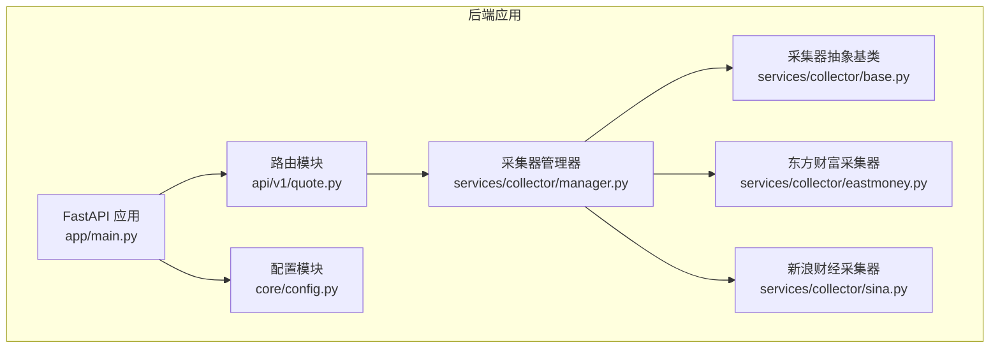
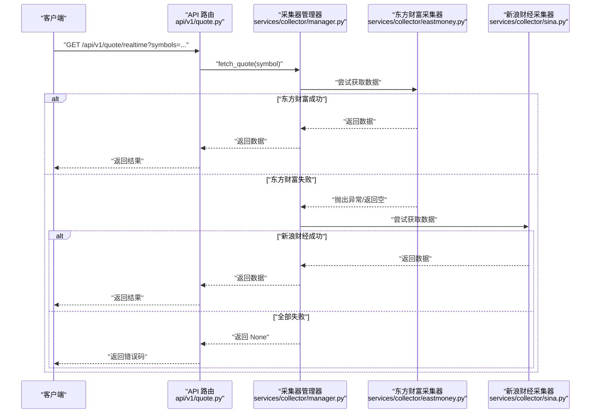
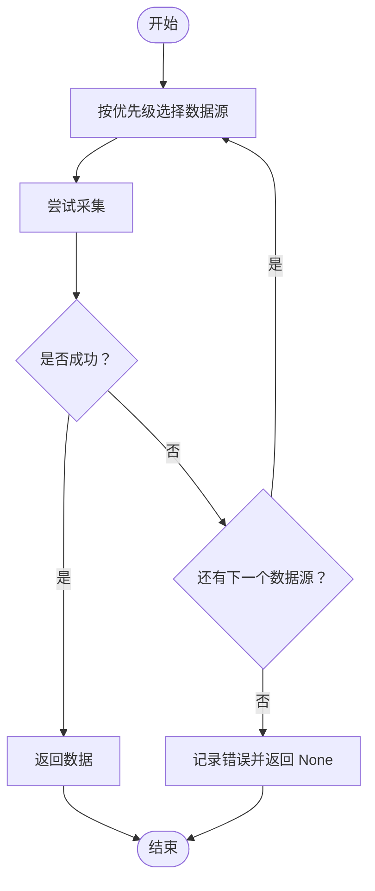
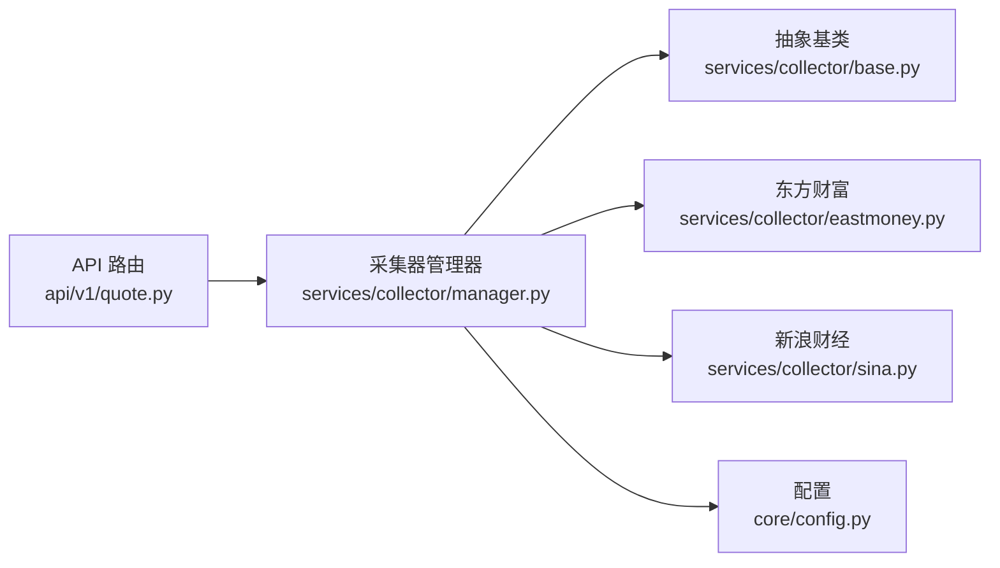

# 采集器管理器

<cite>
**本文引用的文件**
- [manager.py](file://backend/app/services/collector/manager.py)
- [base.py](file://backend/app/services/collector/base.py)
- [eastmoney.py](file://backend/app/services/collector/eastmoney.py)
- [sina.py](file://backend/app/services/collector/sina.py)
- [config.py](file://backend/app/core/config.py)
- [quote.py](file://backend/app/api/v1/quote.py)
- [main.py](file://backend/app/main.py)
- [README.md](file://README.md)
</cite>

## 目录
1. [简介](#简介)
2. [项目结构](#项目结构)
3. [核心组件](#核心组件)
4. [架构总览](#架构总览)
5. [详细组件分析](#详细组件分析)
6. [依赖分析](#依赖分析)
7. [性能考虑](#性能考虑)
8. [故障排查指南](#故障排查指南)
9. [结论](#结论)
10. [附录](#附录)

## 简介
本文件系统性解析采集器管理器（CollectorManager）的设计与实现，涵盖多数据源采集的协调机制、故障转移策略、任务调度与并发控制、资源管理与扩展性设计。重点说明：
- 管理器如何协调多个数据源的采集任务，实现自动故障转移
- 如何通过优先级策略与降级处理实现统一接口
- 采集任务的生命周期管理、监控与性能统计
- 错误恢复、重试策略、超时处理与优雅关闭流程
- 扩展新数据源、配置管理与运行时参数调整

## 项目结构
后端采用分层架构，采集模块位于 services/collector 下，提供统一抽象与具体实现，并通过 FastAPI 路由暴露接口。

图表来源
- [main.py:1-48](file://backend/app/main.py#L1-L48)
- [quote.py:1-65](file://backend/app/api/v1/quote.py#L1-L65)
- [manager.py:1-94](file://backend/app/services/collector/manager.py#L1-L94)
- [base.py:1-45](file://backend/app/services/collector/base.py#L1-L45)
- [eastmoney.py:1-297](file://backend/app/services/collector/eastmoney.py#L1-L297)
- [sina.py:1-312](file://backend/app/services/collector/sina.py#L1-L312)
- [config.py:1-43](file://backend/app/core/config.py#L1-L43)

章节来源
- [README.md:92-126](file://README.md#L92-L126)
- [main.py:1-48](file://backend/app/main.py#L1-L48)
- [quote.py:1-65](file://backend/app/api/v1/quote.py#L1-L65)
- [manager.py:1-94](file://backend/app/services/collector/manager.py#L1-L94)

## 核心组件
- 采集器抽象基类：定义统一的数据采集接口，包括实时行情、行情列表、K线、分时、盘口等方法，并提供通用工具函数（如 secid 生成、市场前缀判断）。
- 采集器实现：
  - 东方财富采集器：基于异步 HTTP 客户端，实现带重试的请求、解析与数据转换。
  - 新浪财经采集器：作为备用数据源，提供相似接口与解析逻辑。
- 采集器管理器：负责注册与发现数据源、按优先级执行采集、故障转移、统一返回格式。
- 配置模块：集中管理运行参数，如主备数据源、缓存 TTL、采集间隔等。
- API 路由：对外提供 REST 接口，调用管理器完成数据采集与返回。

章节来源
- [base.py:5-45](file://backend/app/services/collector/base.py#L5-L45)
- [eastmoney.py:26-297](file://backend/app/services/collector/eastmoney.py#L26-L297)
- [sina.py:24-312](file://backend/app/services/collector/sina.py#L24-L312)
- [manager.py:12-94](file://backend/app/services/collector/manager.py#L12-L94)
- [config.py:5-43](file://backend/app/core/config.py#L5-L43)
- [quote.py:1-65](file://backend/app/api/v1/quote.py#L1-L65)

## 架构总览
采集器管理器以“统一接口 + 多实现 + 故障转移”的方式工作，客户端仅感知管理器提供的方法，内部按优先级依次尝试不同数据源，任一成功即返回，失败则记录日志并继续下一个数据源。

图表来源
- [quote.py:7-16](file://backend/app/api/v1/quote.py#L7-L16)
- [manager.py:21-33](file://backend/app/services/collector/manager.py#L21-L33)
- [eastmoney.py:69-85](file://backend/app/services/collector/eastmoney.py#L69-L85)
- [sina.py:64-107](file://backend/app/services/collector/sina.py#L64-L107)

## 详细组件分析

### 采集器抽象基类（BaseCollector）
- 设计要点
  - 使用抽象基类定义统一接口，确保各数据源实现一致的方法签名。
  - 提供通用工具方法：生成 secid、市场前缀判断，便于不同数据源适配。
- 方法职责
  - 实时行情、行情列表、K线、分时、盘口等异步采集接口。
- 复杂度与性能
  - 接口为 O(1)，实际性能取决于具体实现与网络延迟。
- 错误处理
  - 子类需自行处理解析异常与空数据，基类不强制约束。

章节来源
- [base.py:5-45](file://backend/app/services/collector/base.py#L5-L45)

### 东方财富采集器（EastMoneyCollector）
- 设计要点
  - 基于 httpx 异步客户端，配置连接池、超时与请求头，避免反爬。
  - 统一的带重试请求封装，支持连接断开、超时、状态码异常等场景。
- 数据解析
  - 针对不同接口返回格式进行解析，统一输出标准字段。
- 并发与资源
  - 限制最大连接数与 keepalive 连接数，避免资源耗尽。
- 错误恢复
  - 多次重试与指数退避（通过重试间隔），提升稳定性。
- 性能统计
  - 日志中记录状态码、异常类型与重试次数，便于监控与优化。

章节来源
- [eastmoney.py:26-68](file://backend/app/services/collector/eastmoney.py#L26-L68)
- [eastmoney.py:69-297](file://backend/app/services/collector/eastmoney.py#L69-L297)

### 新浪财经采集器（SinaCollector）
- 设计要点
  - 与东方财富类似，提供带重试的异步请求与解析逻辑。
  - 针对新浪 API 的 JSONP 返回格式进行特殊处理。
- 数据解析
  - 解析新浪返回的行情、K线、分时、盘口数据，统一为标准结构。
- 并发与资源
  - 同样配置连接池与超时，保障稳定性。
- 错误恢复
  - 重试策略与异常分类处理，增强鲁棒性。

章节来源
- [sina.py:24-62](file://backend/app/services/collector/sina.py#L24-L62)
- [sina.py:64-312](file://backend/app/services/collector/sina.py#L64-L312)

### 采集器管理器（CollectorManager）
- 设计要点
  - 维护数据源字典与优先级列表，按顺序尝试采集。
  - 对外暴露统一接口，屏蔽底层差异。
- 任务调度与故障转移
  - 逐个尝试数据源，遇到空数据或异常则记录日志并继续下一个。
  - 全部失败时返回 None，上层路由可据此返回错误码。
- 并发控制
  - 通过子类异步方法与连接池实现并发；管理器本身不直接控制并发，但可扩展。
- 资源管理
  - 依赖子类管理 HTTP 客户端生命周期；可在管理器中增加统一的客户端管理与优雅关闭。
- 统一接口
  - 提供 fetch_quote、fetch_quote_list、fetch_kline、fetch_timeline、fetch_orderbook 等方法，保证上层调用一致性。

图表来源
- [manager.py:21-94](file://backend/app/services/collector/manager.py#L21-L94)

章节来源
- [manager.py:12-94](file://backend/app/services/collector/manager.py#L12-L94)

### API 路由与集成
- 路由职责
  - 提供实时行情、行情列表、K线、分时、盘口等接口。
  - 调用管理器执行采集，处理空数据与异常，返回统一响应结构。
- 错误码
  - 当数据源不可用时返回特定错误码，便于前端展示与用户提示。

章节来源
- [quote.py:1-65](file://backend/app/api/v1/quote.py#L1-L65)

### 配置管理
- 配置项
  - 主数据源与备用数据源名称（PRIMARY_DATA_SOURCE、FALLBACK_DATA_SOURCE）。
  - 采集间隔与缓存 TTL（QUOTE_COLLECT_INTERVAL、QUOTE_CACHE_TTL）。
  - 其他服务相关配置（数据库、Redis、AI 适配器等）。
- 加载机制
  - 通过 pydantic-settings 从 .env 文件加载，使用 LRU 缓存避免重复读取。

章节来源
- [config.py:5-43](file://backend/app/core/config.py#L5-L43)
- [README.md:130-142](file://README.md#L130-L142)

## 依赖分析
- 组件耦合
  - API 路由依赖管理器；管理器依赖抽象基类与具体实现；具体实现依赖 httpx。
- 外部依赖
  - httpx 异步 HTTP 客户端，用于请求与连接池管理。
  - FastAPI 路由，提供 REST 接口。
- 潜在循环依赖
  - 当前结构无循环依赖，模块间单向依赖清晰。
- 扩展点
  - 新增数据源只需继承抽象基类并实现接口，然后在管理器中注册即可。

图表来源
- [quote.py:1-65](file://backend/app/api/v1/quote.py#L1-L65)
- [manager.py:12-94](file://backend/app/services/collector/manager.py#L12-L94)
- [base.py:1-45](file://backend/app/services/collector/base.py#L1-L45)
- [eastmoney.py:1-297](file://backend/app/services/collector/eastmoney.py#L1-L297)
- [sina.py:1-312](file://backend/app/services/collector/sina.py#L1-L312)
- [config.py:1-43](file://backend/app/core/config.py#L1-L43)

章节来源
- [quote.py:1-65](file://backend/app/api/v1/quote.py#L1-L65)
- [manager.py:12-94](file://backend/app/services/collector/manager.py#L12-L94)

## 性能考虑
- 连接池与超时
  - 两个采集器均配置了连接池上限与超时时间，避免资源耗尽与长时间阻塞。
- 重试策略
  - 带退避的多次重试，提高在不稳定网络下的成功率。
- 并发模型
  - 采用异步 I/O，适合高并发场景；建议结合限流与队列控制整体吞吐。
- 缓存与去重
  - 配置中提供缓存 TTL，可结合 Redis 实现热点数据缓存，减少重复请求。
- 监控与日志
  - 管理器与采集器均记录关键事件（状态码、异常、重试次数），便于性能分析与问题定位。

章节来源
- [eastmoney.py:32-39](file://backend/app/services/collector/eastmoney.py#L32-L39)
- [sina.py:27-34](file://backend/app/services/collector/sina.py#L27-L34)
- [config.py:29-30](file://backend/app/core/config.py#L29-L30)

## 故障排查指南
- 常见问题
  - 数据源返回空数据：检查目标股票代码是否正确、接口参数是否匹配。
  - 网络异常或超时：查看重试日志与连接池配置，适当增大超时或降低并发。
  - 解析失败：确认返回格式是否符合预期，必要时更新解析逻辑。
- 日志定位
  - 采集器与管理器均输出详细日志，包括状态码、异常类型、重试次数等。
- 错误码
  - API 路由在数据源不可用时返回特定错误码，便于前端处理与用户提示。

章节来源
- [eastmoney.py:41-67](file://backend/app/services/collector/eastmoney.py#L41-L67)
- [sina.py:36-62](file://backend/app/services/collector/sina.py#L36-L62)
- [manager.py:21-94](file://backend/app/services/collector/manager.py#L21-L94)
- [quote.py:19-33](file://backend/app/api/v1/quote.py#L19-L33)

## 结论
采集器管理器通过统一接口与多数据源实现，实现了稳定的自动故障转移与降级处理。其设计具备良好的扩展性与可维护性，适合在生产环境中持续演进。建议后续增强：
- 管理器内统一客户端生命周期与优雅关闭
- 引入限流与熔断机制
- 增加统一的监控指标与性能统计
- 支持动态配置切换与运行时参数调整

## 附录

### 扩展新数据源步骤
- 继承抽象基类并实现接口
- 在管理器中注册新数据源实例与优先级
- 在 API 路由中调用管理器对应方法
- 更新配置以支持运行时参数调整

章节来源
- [base.py:5-45](file://backend/app/services/collector/base.py#L5-L45)
- [manager.py:15-19](file://backend/app/services/collector/manager.py#L15-L19)
- [quote.py:7-16](file://backend/app/api/v1/quote.py#L7-L16)

### 配置管理与运行时调整
- 通过配置模块集中管理参数，支持环境变量覆盖
- 建议在管理器中增加配置注入与动态刷新能力，以便运行时调整采集间隔、缓存策略等

章节来源
- [config.py:5-43](file://backend/app/core/config.py#L5-L43)
- [README.md:130-142](file://README.md#L130-L142)