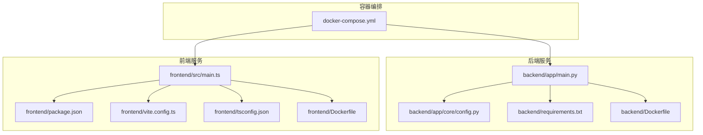
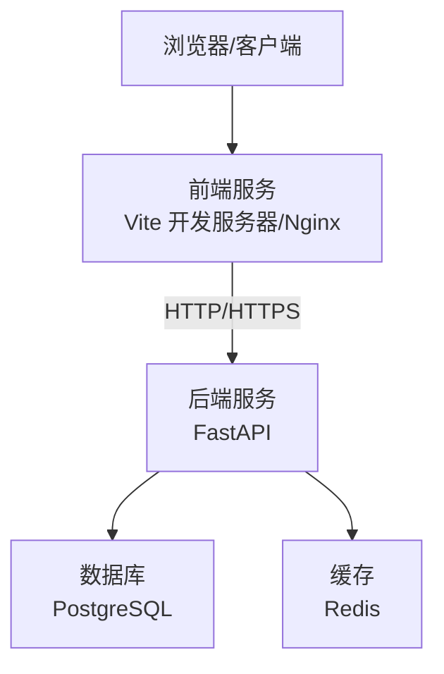
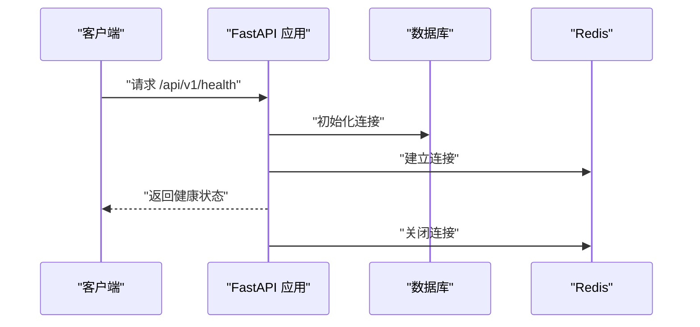
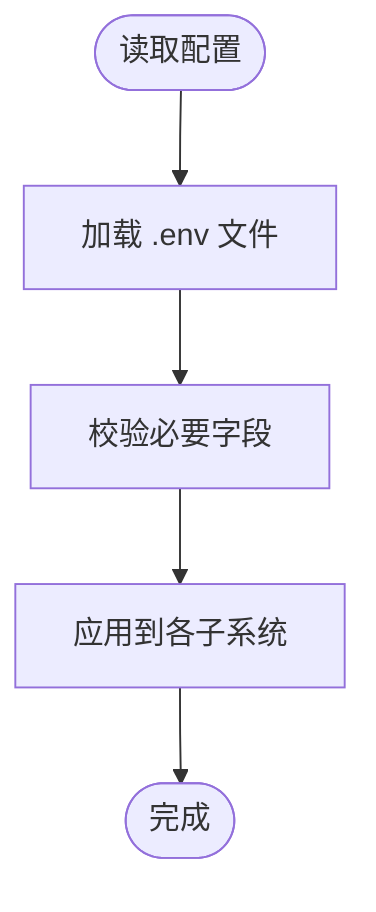
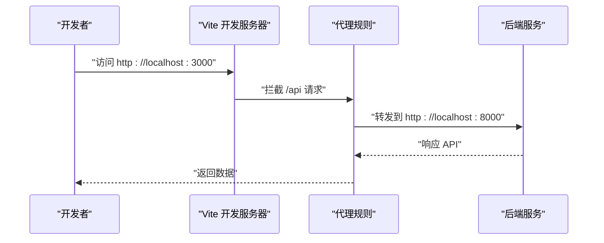
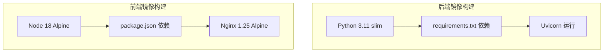
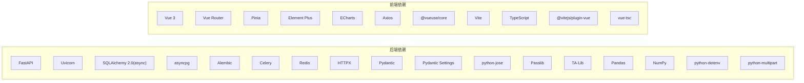

# 开发指南

<cite>
**本文引用的文件**
- [README.md](file://README.md)
- [docker-compose.yml](file://docker-compose.yml)
- [backend/app/main.py](file://backend/app/main.py)
- [backend/app/core/config.py](file://backend/app/core/config.py)
- [backend/Dockerfile](file://backend/Dockerfile)
- [backend/requirements.txt](file://backend/requirements.txt)
- [backend/.gitignore](file://backend/.gitignore)
- [frontend/Dockerfile](file://frontend/Dockerfile)
- [frontend/package.json](file://frontend/package.json)
- [frontend/vite.config.ts](file://frontend/vite.config.ts)
- [frontend/tsconfig.json](file://frontend/tsconfig.json)
- [frontend/src/main.ts](file://frontend/src/main.ts)
</cite>

## 目录
1. [简介](#简介)
2. [项目结构](#项目结构)
3. [核心组件](#核心组件)
4. [架构总览](#架构总览)
5. [详细组件分析](#详细组件分析)
6. [依赖分析](#依赖分析)
7. [性能考虑](#性能考虑)
8. [故障排查指南](#故障排查指南)
9. [结论](#结论)
10. [附录](#附录)

## 简介
本指南面向新加入团队的开发者，提供 Stock-View 项目的完整开发入门与最佳实践。内容涵盖开发环境搭建（Python 虚拟环境、Node.js 环境、依赖安装）、代码规范与 Git 工作流、开发工具链（IDE、格式化、静态分析、单元测试）、调试与性能分析、贡献与发布流程、配置管理与日志规范等。

## 项目结构
项目采用前后端分离架构，通过 Docker Compose 统一编排 PostgreSQL、Redis、后端服务与前端服务。后端基于 FastAPI，前端基于 Vue 3 + TypeScript + Vite。核心模块包括：
- 后端入口与路由注册：FastAPI 应用入口负责生命周期管理、CORS 配置与路由挂载。
- 配置中心：统一读取环境变量，支持开发/生产切换与缓存、限流、AI 适配器等参数。
- 数据采集与服务：行情数据采集器（多数据源），异步任务队列（Celery）。
- 前端入口与开发配置：Vite 开发服务器、路径别名、API 代理、TypeScript 配置。

图表来源
- [docker-compose.yml:1-54](file://docker-compose.yml#L1-L54)
- [backend/app/main.py:1-48](file://backend/app/main.py#L1-L48)
- [backend/app/core/config.py:1-43](file://backend/app/core/config.py#L1-L43)
- [backend/requirements.txt:1-17](file://backend/requirements.txt#L1-L17)
- [backend/Dockerfile:1-12](file://backend/Dockerfile#L1-L12)
- [frontend/package.json:1-27](file://frontend/package.json#L1-L27)
- [frontend/vite.config.ts:1-21](file://frontend/vite.config.ts#L1-L21)
- [frontend/tsconfig.json:1-24](file://frontend/tsconfig.json#L1-L24)
- [frontend/src/main.ts:1-12](file://frontend/src/main.ts#L1-L12)
- [frontend/Dockerfile:1-11](file://frontend/Dockerfile#L1-L11)

章节来源
- [README.md:92-126](file://README.md#L92-L126)

## 核心组件
- 后端应用入口与生命周期
  - 使用 lifespan 管理数据库初始化与 Redis 连接关闭。
  - 注册 REST 路由与 WebSocket 路由，并启用 CORS。
- 配置中心
  - 通过 pydantic-settings 从 .env 文件加载配置，支持数据库、Redis、AI 适配器、JWT、Celery 等参数。
- 前端入口与开发配置
  - Vue 应用初始化 Pinia、路由与 UI 组件库；Vite 提供开发服务器与代理；TypeScript 严格模式与路径别名。

章节来源
- [backend/app/main.py:1-48](file://backend/app/main.py#L1-L48)
- [backend/app/core/config.py:1-43](file://backend/app/core/config.py#L1-L43)
- [frontend/src/main.ts:1-12](file://frontend/src/main.ts#L1-L12)
- [frontend/vite.config.ts:1-21](file://frontend/vite.config.ts#L1-L21)
- [frontend/tsconfig.json:1-24](file://frontend/tsconfig.json#L1-L24)

## 架构总览
系统通过 Docker Compose 将 PostgreSQL、Redis、后端与前端服务组合运行。后端提供 REST API 与 WebSocket，前端通过 Vite 代理访问后端接口。

图表来源
- [docker-compose.yml:1-54](file://docker-compose.yml#L1-L54)
- [backend/app/main.py:22-43](file://backend/app/main.py#L22-L43)
- [frontend/vite.config.ts:12-20](file://frontend/vite.config.ts#L12-L20)

## 详细组件分析

### 后端应用入口与路由
- 生命周期管理：启动时初始化数据库，关闭时释放 Redis 连接。
- 路由组织：REST API 与 WebSocket 路由按版本前缀挂载。
- CORS：允许任意来源跨域访问，便于前端开发。

图表来源
- [backend/app/main.py:13-27](file://backend/app/main.py#L13-L27)
- [backend/app/main.py:38-43](file://backend/app/main.py#L38-L43)

章节来源
- [backend/app/main.py:1-48](file://backend/app/main.py#L1-L48)

### 配置管理
- 环境变量来源：.env 文件，编码为 UTF-8。
- 关键配置项：数据库连接、Redis 连接、主备数据源、AI 适配器、JWT、Celery、缓存 TTL、限流等。
- 缓存策略：使用 LRU 内存限制，避免缓存膨胀。

图表来源
- [backend/app/core/config.py:5-39](file://backend/app/core/config.py#L5-L39)

章节来源
- [backend/app/core/config.py:1-43](file://backend/app/core/config.py#L1-L43)

### 前端入口与开发服务器
- 应用初始化：创建 Vue 应用，注册 Pinia、路由与 UI 组件库。
- 开发服务器：Vite 提供热更新与代理，将 /api 前缀转发至后端 8000 端口。
- TypeScript 配置：严格模式、路径别名、模块解析策略。

图表来源
- [frontend/src/main.ts:1-12](file://frontend/src/main.ts#L1-L12)
- [frontend/vite.config.ts:12-20](file://frontend/vite.config.ts#L12-L20)

章节来源
- [frontend/src/main.ts:1-12](file://frontend/src/main.ts#L1-L12)
- [frontend/vite.config.ts:1-21](file://frontend/vite.config.ts#L1-L21)
- [frontend/tsconfig.json:1-24](file://frontend/tsconfig.json#L1-L24)

### 容器化与部署
- 后端镜像：基于 Python 3.11 slim，安装系统构建工具与 Python 依赖，暴露 8000 端口。
- 前端镜像：Node 构建产物复制至 Nginx，暴露 80 端口。
- Compose 编排：定义 postgres、redis、backend、frontend 服务及其依赖关系与端口映射。

图表来源
- [backend/Dockerfile:1-12](file://backend/Dockerfile#L1-L12)
- [frontend/Dockerfile:1-11](file://frontend/Dockerfile#L1-L11)

章节来源
- [backend/Dockerfile:1-12](file://backend/Dockerfile#L1-L12)
- [frontend/Dockerfile:1-11](file://frontend/Dockerfile#L1-L11)
- [docker-compose.yml:1-54](file://docker-compose.yml#L1-L54)

## 依赖分析
- 后端依赖：FastAPI、Uvicorn、SQLAlchemy 2.0（异步）、asyncpg、Alembic、Celery、Redis、HTTPX、Pydantic、Pydantic Settings、Passlib、TA-Lib、Pandas、NumPy、python-dotenv、python-multipart。
- 前端依赖：Vue 3、Vue Router、Pinia、Element Plus、ECharts、Axios、@vueuse/core；开发依赖包括 Vite、TypeScript、@vitejs/plugin-vue、vue-tsc。

图表来源
- [backend/requirements.txt:1-17](file://backend/requirements.txt#L1-L17)
- [frontend/package.json:1-27](file://frontend/package.json#L1-L27)

章节来源
- [backend/requirements.txt:1-17](file://backend/requirements.txt#L1-L17)
- [frontend/package.json:1-27](file://frontend/package.json#L1-L27)

## 性能考虑
- 缓存策略：Redis 作为缓存与消息中间件，结合 LRU 策略控制内存占用。
- 数据采集间隔：行情采集间隔与缓存 TTL 可调，平衡实时性与资源消耗。
- 异步与并发：后端使用异步 SQLAlchemy 与 Uvicorn，前端使用 Vite 热更新提升开发效率。
- 镜像体积：使用 Alpine 基础镜像与 slim 版本，减少镜像体积与启动时间。

章节来源
- [backend/app/core/config.py:26-31](file://backend/app/core/config.py#L26-L31)
- [docker-compose.yml:16-23](file://docker-compose.yml#L16-L23)
- [backend/Dockerfile:1-12](file://backend/Dockerfile#L1-L12)
- [frontend/Dockerfile:1-11](file://frontend/Dockerfile#L1-L11)

## 故障排查指南
- 启动顺序与依赖
  - 确保先启动数据库与缓存，再启动后端服务；前端依赖后端 API。
- 端口冲突
  - 修改 docker-compose 中的端口映射或停止占用进程。
- 环境变量
  - 在本地开发时复制 .env.example 并根据实际环境调整 DATABASE_URL 与 REDIS_URL。
- 日志查看
  - 使用 docker compose logs -f 服务名 查看后端/前端日志。
- CORS 问题
  - 后端已启用宽松 CORS，若仍出现跨域，请检查前端代理配置与目标地址。

章节来源
- [README.md:47-88](file://README.md#L47-L88)
- [README.md:146-162](file://README.md#L146-L162)
- [backend/app/main.py:29-36](file://backend/app/main.py#L29-L36)
- [frontend/vite.config.ts:12-20](file://frontend/vite.config.ts#L12-L20)

## 结论
本指南提供了从环境搭建到日常开发、调试与发布的全流程指引。建议团队成员遵循统一的代码规范与 Git 工作流，充分利用容器化与代理机制提升开发效率，并通过配置中心与缓存策略保障系统性能与可维护性。

## 附录

### 开发环境搭建
- Docker Compose 一键启动（推荐）
  - 步骤：克隆仓库、安装 Docker 与 Docker Compose、执行构建与启动命令。
  - 访问：前端页面、后端 API、API 文档。
- 本地开发模式
  - 启动依赖服务：PostgreSQL 与 Redis。
  - 后端：创建并激活虚拟环境、安装依赖、配置 .env、启动开发服务器。
  - 前端：安装依赖、启动开发服务器，Vite 自动代理 API 请求。

章节来源
- [README.md:22-88](file://README.md#L22-L88)

### 代码规范与 Git 工作流
- 代码风格
  - Python：使用类型注解与 pydantic 设置配置，遵循后端依赖中的类型与校验约束。
  - JavaScript/TypeScript：启用严格模式，使用路径别名与模块解析策略。
- Git 工作流
  - 建议采用功能分支开发，提交信息清晰描述变更内容，合并前进行代码审查。
- 分支管理策略
  - 主分支用于稳定发布，特性分支从主分支切出，修复分支从主分支切出，遵循小步快跑与及时合并。

章节来源
- [backend/app/core/config.py:1-43](file://backend/app/core/config.py#L1-L43)
- [frontend/tsconfig.json:1-24](file://frontend/tsconfig.json#L1-L24)
- [backend/.gitignore:1-9](file://backend/.gitignore#L1-L9)

### 开发工具链
- IDE 配置
  - 后端：启用 Python 解释器与虚拟环境，安装相关插件。
  - 前端：启用 TypeScript 与 Vite 插件，配置路径别名。
- 代码格式化与静态分析
  - 推荐使用 Python 的格式化与类型检查工具，前端使用 ESLint/Prettier（如引入）。
- 单元测试
  - 建议为后端 API 与核心业务逻辑编写单元测试，覆盖关键路径与边界条件。

章节来源
- [backend/requirements.txt:1-17](file://backend/requirements.txt#L1-L17)
- [frontend/package.json:20-25](file://frontend/package.json#L20-L25)

### 调试技巧与性能分析
- 后端
  - 使用 Uvicorn 的 --reload 参数实现热重载；通过 lifespan 钩子验证数据库与缓存连接。
  - 利用日志与异常处理定位问题；对慢查询与高延迟接口进行性能剖析。
- 前端
  - 使用浏览器开发者工具与 Vite 控制台；通过代理确认请求转发正确。
- 性能分析
  - 后端：关注数据库查询、Redis 命中率与 Celery 任务耗时。
  - 前端：关注首屏渲染、图表绘制与网络请求优化。

章节来源
- [backend/app/main.py:13-27](file://backend/app/main.py#L13-L27)
- [frontend/vite.config.ts:12-20](file://frontend/vite.config.ts#L12-L20)

### 贡献指南、代码审查与发布流程
- 贡献流程
  - Fork 仓库、创建功能分支、提交变更、发起 Pull Request、等待审查与合并。
- 代码审查标准
  - 功能正确性、可读性、安全性、性能影响与测试覆盖率。
- 发布流程
  - 通过 CI/CD 流水线构建镜像并推送到镜像仓库，使用 docker-compose 部署到目标环境。

章节来源
- [README.md:146-162](file://README.md#L146-L162)

### 配置管理与日志记录
- 配置管理
  - 所有敏感与环境相关配置集中于 .env 文件，通过 pydantic-settings 加载。
  - 支持开发/生产环境切换与缓存、限流、AI 适配器等参数动态调整。
- 日志记录
  - 后端使用标准日志输出，结合容器日志查看；前端通过控制台输出调试信息。

章节来源
- [backend/app/core/config.py:36-39](file://backend/app/core/config.py#L36-L39)
- [README.md:130-142](file://README.md#L130-L142)