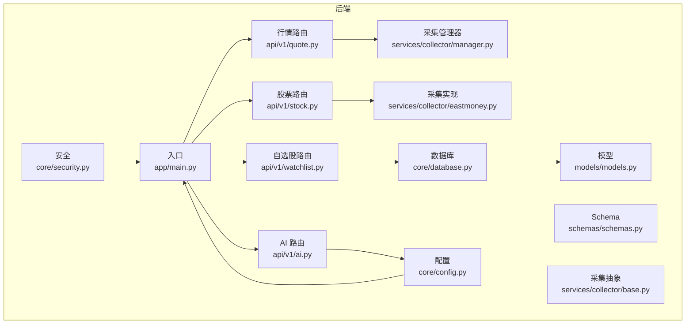
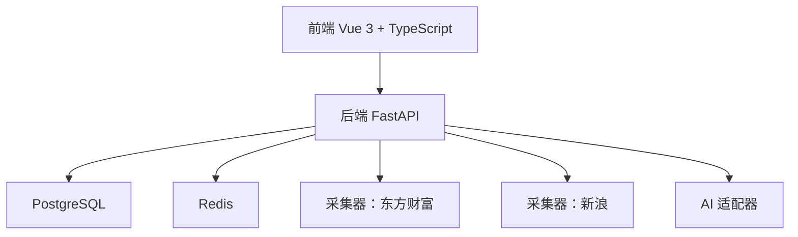

# 代码规范

<cite>
**本文引用的文件**
- [backend/app/main.py](file://backend/app/main.py)
- [backend/app/core/config.py](file://backend/app/core/config.py)
- [backend/app/core/database.py](file://backend/app/core/database.py)
- [backend/app/core/security.py](file://backend/app/core/security.py)
- [backend/app/models/models.py](file://backend/app/models/models.py)
- [backend/app/schemas/schemas.py](file://backend/app/schemas/schemas.py)
- [backend/app/api/v1/quote.py](file://backend/app/api/v1/quote.py)
- [backend/app/api/v1/stock.py](file://backend/app/api/v1/stock.py)
- [backend/app/api/v1/watchlist.py](file://backend/app/api/v1/watchlist.py)
- [backend/app/api/v1/ai.py](file://backend/app/api/v1/ai.py)
- [backend/app/services/collector/base.py](file://backend/app/services/collector/base.py)
- [backend/app/services/collector/eastmoney.py](file://backend/app/services/collector/eastmoney.py)
- [backend/app/services/collector/manager.py](file://backend/app/services/collector/manager.py)
- [backend/requirements.txt](file://backend/requirements.txt)
- [README.md](file://README.md)
</cite>

## 目录
1. [引言](#引言)
2. [项目结构](#项目结构)
3. [核心组件](#核心组件)
4. [架构总览](#架构总览)
5. [详细组件分析](#详细组件分析)
6. [依赖分析](#依赖分析)
7. [性能考虑](#性能考虑)
8. [注释规范](#注释规范)
9. [命名规范](#命名规范)
10. [IDE 配置建议](#ide-配置建议)
11. [格式化与工具链](#格式化与工具链)
12. [常见错误写法与正确示例](#常见错误写法与正确示例)
13. [故障排查指南](#故障排查指南)
14. [结论](#结论)

## 引言
本文件为 Stock-View 项目的代码规范文档，面向后端 Python 与前端 TypeScript/Vue 的开发者，统一团队代码风格与质量标准。内容涵盖：
- 后端 Python 风格（PEP8 基本原则、类型注解、异常处理、日志记录）
- 前端 TypeScript/Vue 组件命名与结构约定
- 注释规范（模块、类、函数、参数、返回值）
- 变量、函数、常量命名规则
- IDE 配置建议（VS Code、PyCharm）
- 代码格式化与静态检查工具（Black、Prettier、ESLint、Ruff、isort 等）

## 项目结构
后端采用 FastAPI + SQLAlchemy 2.0(async) + Pydantic 的分层架构，前端基于 Vue 3 + TypeScript。后端目录按职责拆分：核心配置、数据库、安全、模型、Schema、API 路由、采集服务、AI 接口与任务。

图表来源
- [backend/app/main.py:1-48](file://backend/app/main.py#L1-L48)
- [backend/app/core/config.py:1-43](file://backend/app/core/config.py#L1-L43)
- [backend/app/core/database.py:1-25](file://backend/app/core/database.py#L1-L25)
- [backend/app/core/security.py:1-30](file://backend/app/core/security.py#L1-L30)
- [backend/app/models/models.py:1-74](file://backend/app/models/models.py#L1-L74)
- [backend/app/schemas/schemas.py:1-103](file://backend/app/schemas/schemas.py#L1-L103)
- [backend/app/api/v1/quote.py:1-65](file://backend/app/api/v1/quote.py#L1-L65)
- [backend/app/api/v1/stock.py:1-37](file://backend/app/api/v1/stock.py#L1-L37)
- [backend/app/api/v1/watchlist.py:1-77](file://backend/app/api/v1/watchlist.py#L1-L77)
- [backend/app/api/v1/ai.py:1-29](file://backend/app/api/v1/ai.py#L1-L29)
- [backend/app/services/collector/base.py:1-45](file://backend/app/services/collector/base.py#L1-L45)
- [backend/app/services/collector/eastmoney.py:1-240](file://backend/app/services/collector/eastmoney.py#L1-L240)
- [backend/app/services/collector/manager.py:1-80](file://backend/app/services/collector/manager.py#L1-L80)

章节来源
- [README.md:92-126](file://README.md#L92-L126)

## 核心组件
- 应用入口与生命周期：FastAPI 应用初始化、CORS 中间件、路由注册、健康检查端点
- 配置系统：基于 Pydantic Settings 的 Settings 类，支持缓存与 .env 加载
- 数据库：异步 SQLAlchemy 引擎、会话工厂、Base 基类与初始化
- 安全：密码哈希、JWT 编解码
- 模型与 Schema：SQLAlchemy ORM 模型与 Pydantic 数据校验模型
- API 路由：行情、股票搜索、自选股、AI 分析
- 数据采集：抽象采集器、具体实现（东方财富）、采集管理器（故障转移）

章节来源
- [backend/app/main.py:1-48](file://backend/app/main.py#L1-L48)
- [backend/app/core/config.py:1-43](file://backend/app/core/config.py#L1-L43)
- [backend/app/core/database.py:1-25](file://backend/app/core/database.py#L1-L25)
- [backend/app/core/security.py:1-30](file://backend/app/core/security.py#L1-L30)
- [backend/app/models/models.py:1-74](file://backend/app/models/models.py#L1-L74)
- [backend/app/schemas/schemas.py:1-103](file://backend/app/schemas/schemas.py#L1-L103)
- [backend/app/api/v1/quote.py:1-65](file://backend/app/api/v1/quote.py#L1-L65)
- [backend/app/api/v1/stock.py:1-37](file://backend/app/api/v1/stock.py#L1-L37)
- [backend/app/api/v1/watchlist.py:1-77](file://backend/app/api/v1/watchlist.py#L1-L77)
- [backend/app/api/v1/ai.py:1-29](file://backend/app/api/v1/ai.py#L1-L29)
- [backend/app/services/collector/base.py:1-45](file://backend/app/services/collector/base.py#L1-L45)
- [backend/app/services/collector/eastmoney.py:1-240](file://backend/app/services/collector/eastmoney.py#L1-L240)
- [backend/app/services/collector/manager.py:1-80](file://backend/app/services/collector/manager.py#L1-L80)

## 架构总览
后端通过 FastAPI 提供 REST API，数据采集层负责对接第三方行情接口，数据库层持久化结构化数据，AI 层以适配器模式扩展分析能力。前端通过 Axios 访问后端 API，使用 Pinia 管理状态，ECharts 展示图表。

图表来源
- [README.md:11-18](file://README.md#L11-L18)
- [backend/app/api/v1/quote.py:1-65](file://backend/app/api/v1/quote.py#L1-L65)
- [backend/app/api/v1/stock.py:1-37](file://backend/app/api/v1/stock.py#L1-L37)
- [backend/app/api/v1/watchlist.py:1-77](file://backend/app/api/v1/watchlist.py#L1-L77)
- [backend/app/api/v1/ai.py:1-29](file://backend/app/api/v1/ai.py#L1-L29)
- [backend/app/services/collector/eastmoney.py:1-240](file://backend/app/services/collector/eastmoney.py#L1-L240)
- [backend/app/services/collector/manager.py:1-80](file://backend/app/services/collector/manager.py#L1-L80)

## 详细组件分析

### FastAPI 应用与路由
- 生命周期管理：使用 lifespan 在启动时初始化数据库，在关闭时释放 Redis 连接
- CORS：允许任意来源、头与方法，便于前端开发联调
- 路由注册：按模块 include_router，统一前缀 /api/v1
- 健康检查：/api/v1/health 返回版本信息

章节来源
- [backend/app/main.py:1-48](file://backend/app/main.py#L1-L48)

### 配置系统（Settings）
- 使用 Pydantic Settings 定义配置项，支持默认值与类型约束
- 通过 lru_cache 缓存实例，避免重复解析 .env
- 支持数据库、Redis、AI、Celery、JWT、行情采集等配置

章节来源
- [backend/app/core/config.py:1-43](file://backend/app/core/config.py#L1-L43)

### 数据库与会话
- 异步引擎与会话工厂，连接池配置
- Base 基类用于 ORM 映射
- 初始化元数据创建表

章节来源
- [backend/app/core/database.py:1-25](file://backend/app/core/database.py#L1-L25)

### 安全模块
- 密码哈希与校验（bcrypt）
- JWT 编解码（jose），支持过期时间控制

章节来源
- [backend/app/core/security.py:1-30](file://backend/app/core/security.py#L1-L30)

### 模型与 Schema
- 模型：StockInfo、QuoteDaily、QuoteTick、Watchlist、AIAnalysisLog
- Schema：ResponseBase、QuoteItem/Kline/Timeline/OrderBook 等，统一响应结构

章节来源
- [backend/app/models/models.py:1-74](file://backend/app/models/models.py#L1-L74)
- [backend/app/schemas/schemas.py:1-103](file://backend/app/schemas/schemas.py#L1-L103)

### API 路由
- 行情路由：实时、列表、K线、分时、盘口
- 股票搜索：基于第三方建议接口
- 自选股：增删改查与排序
- AI 分析：分析请求、历史预留、模型信息

章节来源
- [backend/app/api/v1/quote.py:1-65](file://backend/app/api/v1/quote.py#L1-L65)
- [backend/app/api/v1/stock.py:1-37](file://backend/app/api/v1/stock.py#L1-L37)
- [backend/app/api/v1/watchlist.py:1-77](file://backend/app/api/v1/watchlist.py#L1-L77)
- [backend/app/api/v1/ai.py:1-29](file://backend/app/api/v1/ai.py#L1-L29)

### 数据采集层
- 抽象基类定义采集接口
- 东方财富实现：封装 HTTP 请求、参数映射、异常日志
- 管理器：按优先级自动故障转移

章节来源
- [backend/app/services/collector/base.py:1-45](file://backend/app/services/collector/base.py#L1-L45)
- [backend/app/services/collector/eastmoney.py:1-240](file://backend/app/services/collector/eastmoney.py#L1-L240)
- [backend/app/services/collector/manager.py:1-80](file://backend/app/services/collector/manager.py#L1-L80)

## 依赖分析
- 后端依赖集中在 requirements.txt，包含 FastAPI、SQLAlchemy 2.0(async)、httpx、pydantic、celery、redis、JWT、密码学等
- 前端技术栈在 README 中明确：Vue 3 + TypeScript + Pinia + ECharts + Element Plus

章节来源
- [backend/requirements.txt:1-17](file://backend/requirements.txt#L1-L17)
- [README.md:11-18](file://README.md#L11-L18)

## 性能考虑
- 异步 I/O：HTTP 客户端与数据库均采用异步，减少阻塞
- 连接池：数据库连接池大小与溢出配置
- 缓存：Redis 作为缓存与消息队列中间件
- 故障转移：采集器优先级与异常降级
- 参数限制：API 查询参数范围约束，防止高负载

章节来源
- [backend/app/services/collector/eastmoney.py:1-240](file://backend/app/services/collector/eastmoney.py#L1-L240)
- [backend/app/services/collector/manager.py:1-80](file://backend/app/services/collector/manager.py#L1-L80)
- [backend/app/api/v1/quote.py:1-65](file://backend/app/api/v1/quote.py#L1-L65)
- [backend/app/api/v1/stock.py:1-37](file://backend/app/api/v1/stock.py#L1-L37)

## 注释规范
- 模块注释：文件顶部简述模块用途与职责
- 类注释：类名后缩进一行写明类目的与行为
- 函数注释：函数签名下写明功能、参数、返回值与异常
- 字段注释：复杂字段或跨模块共享的常量应有说明
- TODO/NOTE：使用清晰的标记并在必要时附带链接或问题编号

示例路径
- [backend/app/services/collector/base.py:5-18](file://backend/app/services/collector/base.py#L5-L18)
- [backend/app/api/v1/quote.py:7-16](file://backend/app/api/v1/quote.py#L7-L16)
- [backend/app/api/v1/stock.py:10-12](file://backend/app/api/v1/stock.py#L10-L12)

## 命名规范
- Python 后端
  - 模块与包：小写下划线 snake_case
  - 类：大驼峰 PascalCase
  - 函数/方法：小写下划线 snake_case
  - 常量：全大写 UPPER_CASE 或 SCREAMING_SNAKE_CASE
  - 私有成员：下划线前缀 _private
  - 类型别名：使用 typing.TypeVar 或自定义类型名
- 前端（TypeScript/Vue）
  - 文件：PascalCase.vue（组件）、kebab-case.ts/js（工具）
  - 变量/函数：camelCase
  - 常量：UPPER_CASE
  - 组件：PascalCase（根组件 App.vue、页面组件等）
  - Store：useXxx（Pinia）

示例路径
- [backend/app/models/models.py:5-74](file://backend/app/models/models.py#L5-L74)
- [backend/app/schemas/schemas.py:6-103](file://backend/app/schemas/schemas.py#L6-L103)
- [backend/app/api/v1/watchlist.py:10-10](file://backend/app/api/v1/watchlist.py#L10-L10)
- [README.md:11-18](file://README.md#L11-L18)

## IDE 配置建议
- VS Code（后端）
  - 扩展：Python（含 Pylance/自动补全）、Black Formatter、flake8、isort、Ruff
  - 设置要点：格式化器选择 black；导入排序使用 isort；启用 Ruff Lint；类型检查开启
- VS Code（前端）
  - 扩展：ESLint、Prettier、Vue Language Features、TypeScript Importer
  - 设置要点：格式化器选择 Prettier；TS/JS 严格模式；禁止尾随逗号（按团队策略）
- PyCharm（后端）
  - 设置：Python 解释器、结构视图、代码风格（PEP8）、Live Templates
  - 工具：内置 Inspect Code、External Tools 调用 Black/Ruff/isort

## 格式化与工具链
- Python
  - 格式化：Black（一致性、无需讨论风格）
  - 导入排序：isort（稳定导入顺序）
  - Lint：Ruff（快速且可配置）
  - 类型检查：mypy（可选，建议在 CI 强制）
- TypeScript/前端
  - 格式化：Prettier（统一空格/缩进/引号）
  - Lint：ESLint（结合 @typescript-eslint）
  - 类型检查：tsc（noEmit 模式）
- Git Hooks（推荐）
  - pre-commit：运行 Black、isort、Ruff、ESLint、Prettier，确保提交前一致

## 常见错误写法与正确示例
- 错误：在路由中直接发起同步 HTTP 请求
  - 正确：使用 httpx.AsyncClient 并设置合理超时
  - 示例路径：[backend/app/api/v1/stock.py:13-22](file://backend/app/api/v1/stock.py#L13-L22)
- 错误：未做参数范围校验导致高负载
  - 正确：使用 Query 的 ge/le 等约束
  - 示例路径：[backend/app/api/v1/quote.py:24-25](file://backend/app/api/v1/quote.py#L24-L25)
- 错误：异常吞掉不记录日志
  - 正确：捕获异常并记录 warning/error
  - 示例路径：[backend/app/services/collector/eastmoney.py:35-37](file://backend/app/services/collector/eastmoney.py#L35-L37)
- 错误：ORM 查询未使用事务或未处理并发
  - 正确：使用 AsyncSession 上下文与 commit
  - 示例路径：[backend/app/api/v1/watchlist.py:49-50](file://backend/app/api/v1/watchlist.py#L49-L50)
- 错误：未使用 Pydantic 校验输入
  - 正确：定义 Request/Response Schema 并在路由中使用
  - 示例路径：[backend/app/schemas/schemas.py:79-90](file://backend/app/schemas/schemas.py#L79-L90)

## 故障排查指南
- 健康检查失败
  - 检查 /api/v1/health 是否返回状态与版本
  - 章节来源：[backend/app/main.py:46-48](file://backend/app/main.py#L46-L48)
- 数据库连接异常
  - 检查 DATABASE_URL 与连接池配置
  - 章节来源：[backend/app/core/database.py:7-8](file://backend/app/core/database.py#L7-L8)
- Redis 连接异常
  - 检查 REDIS_URL 与生命周期钩子是否正常释放
  - 章节来源：[backend/app/main.py:18-19](file://backend/app/main.py#L18-L19)
- 采集失败
  - 查看采集器日志与异常回退逻辑
  - 章节来源：[backend/app/services/collector/manager.py:21-32](file://backend/app/services/collector/manager.py#L21-L32)
- JWT 解码失败
  - 检查密钥与算法配置
  - 章节来源：[backend/app/core/security.py:25-30](file://backend/app/core/security.py#L25-L30)

## 结论
本规范以现有代码为依据，总结了后端 Python 与前端 TypeScript/Vue 的风格与最佳实践，并提供了工具链与 IDE 配置建议。建议在团队内推广统一的格式化与 Lint 规则，配合 Git Hooks 在提交前强制执行，持续提升代码一致性与可维护性。