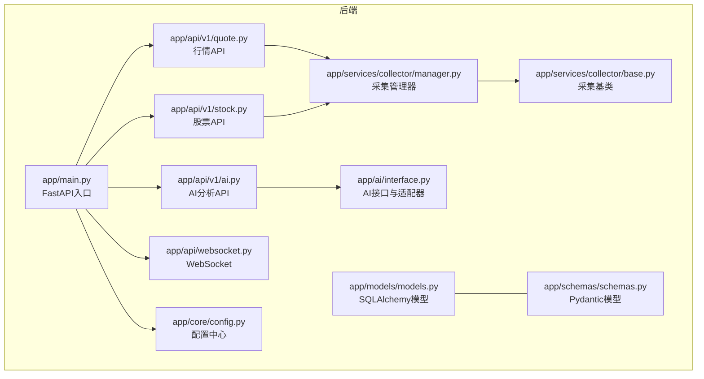
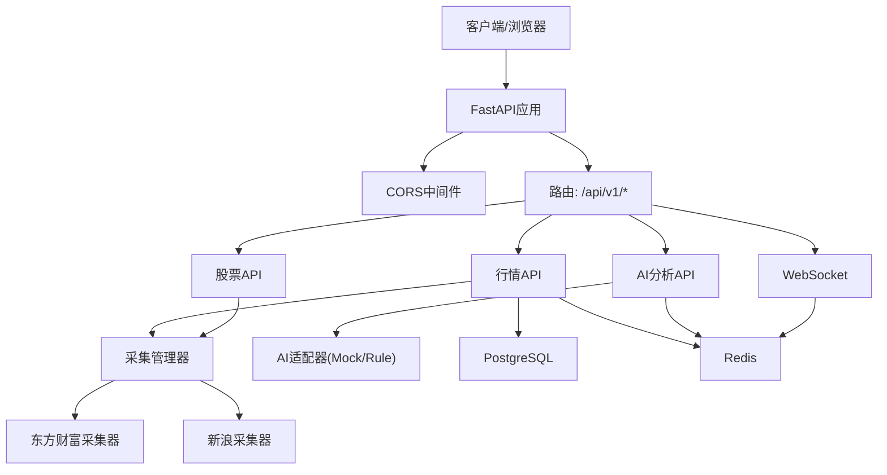
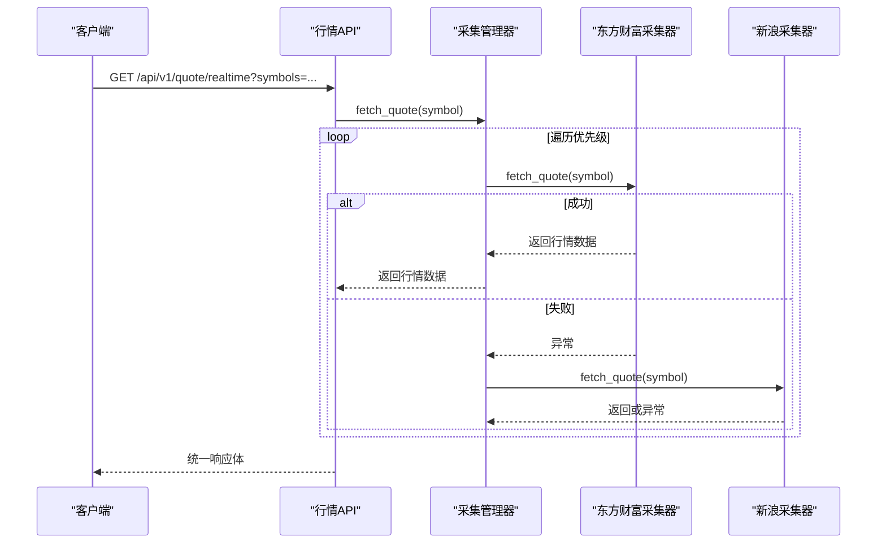
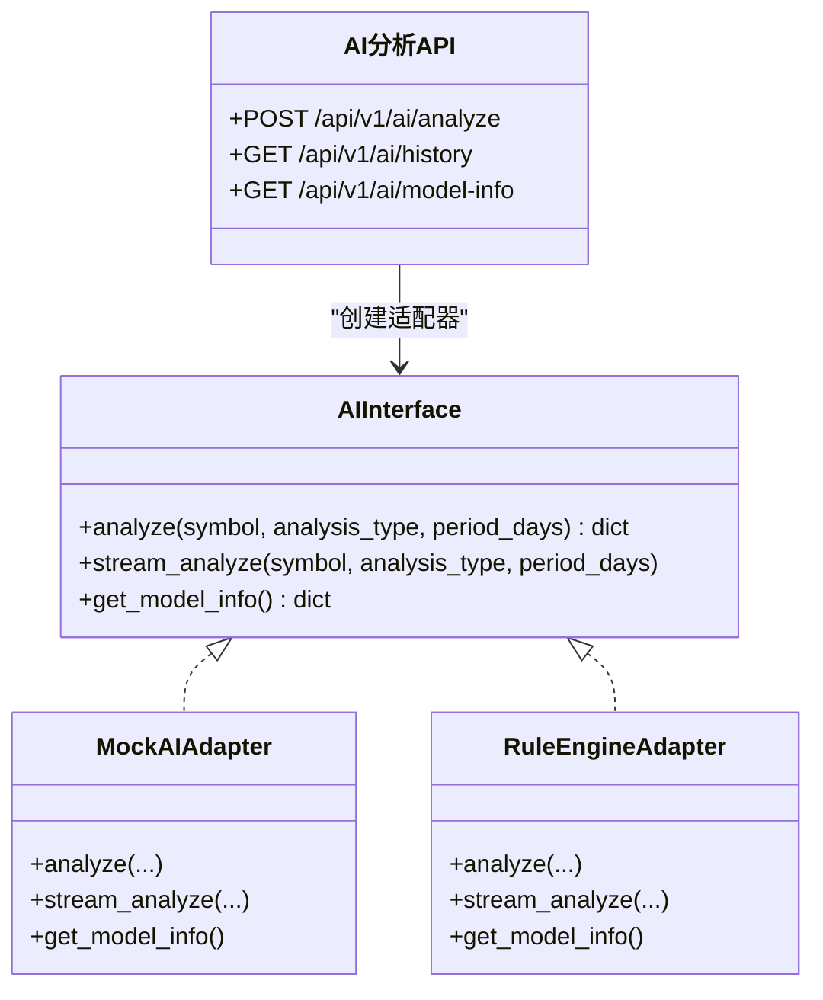
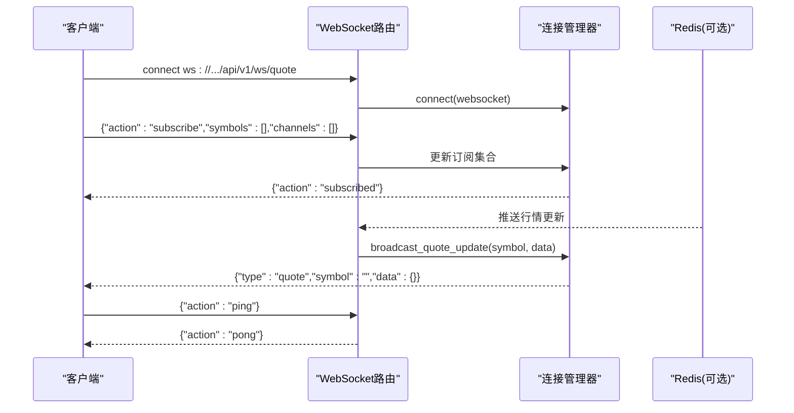
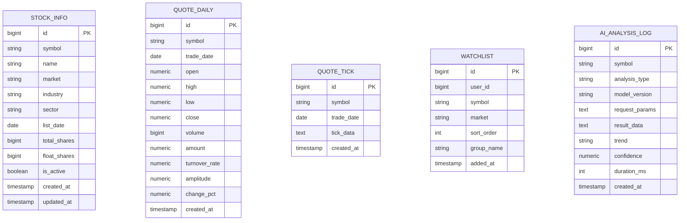
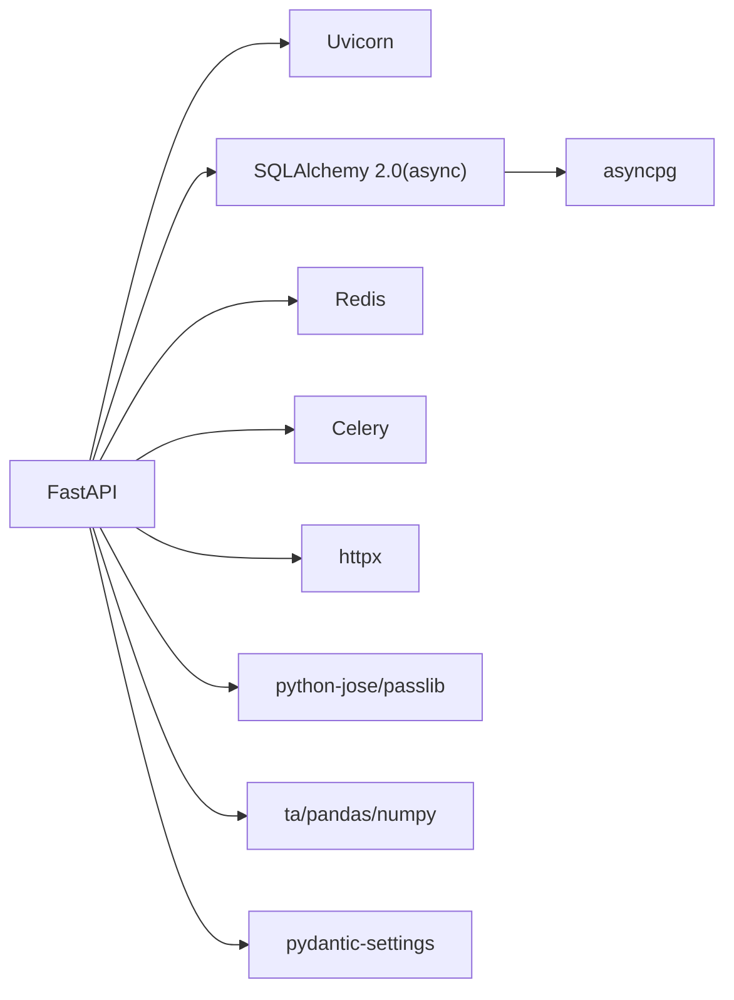

# 开发指南

<cite>
**本文引用的文件**
- [README.md](file://README.md)
- [backend/app/main.py](file://backend/app/main.py)
- [backend/app/core/config.py](file://backend/app/core/config.py)
- [backend/requirements.txt](file://backend/requirements.txt)
- [backend/Dockerfile](file://backend/Dockerfile)
- [backend/app/api/v1/stock.py](file://backend/app/api/v1/stock.py)
- [backend/app/api/v1/quote.py](file://backend/app/api/v1/quote.py)
- [backend/app/models/models.py](file://backend/app/models/models.py)
- [backend/app/schemas/schemas.py](file://backend/app/schemas/schemas.py)
- [backend/app/services/collector/manager.py](file://backend/app/services/collector/manager.py)
- [backend/app/services/collector/base.py](file://backend/app/services/collector/base.py)
- [backend/app/ai/interface.py](file://backend/app/ai/interface.py)
- [backend/app/api/v1/ai.py](file://backend/app/api/v1/ai.py)
- [backend/app/api/websocket.py](file://backend/app/api/websocket.py)
- [backend/.gitignore](file://backend/.gitignore)
</cite>

## 目录
1. [简介](#简介)
2. [项目结构](#项目结构)
3. [核心组件](#核心组件)
4. [架构总览](#架构总览)
5. [详细组件分析](#详细组件分析)
6. [依赖分析](#依赖分析)
7. [性能考虑](#性能考虑)
8. [测试策略与测试环境](#测试策略与测试环境)
9. [版本控制与协作规范](#版本控制与协作规范)
10. [开发环境配置](#开发环境配置)
11. [常见问题与调试技巧](#常见问题与调试技巧)
12. [结论](#结论)

## 简介
本指南面向Stock-View项目的开发者，系统性地阐述开发规范、最佳实践、开发环境配置、版本控制流程、测试策略、性能优化与代码审查标准，并提供常见问题的排查与调试技巧。项目采用前后端分离架构：后端为Python 3.11 + FastAPI + SQLAlchemy 2.0(async)，前端为Vue 3 + TypeScript + Pinia + ECharts + Element Plus；数据库与缓存采用PostgreSQL 15 + Redis 7；部署通过Docker Compose + Nginx。

## 项目结构
仓库采用按层与按功能混合的组织方式：
- 后端
  - 应用入口与生命周期管理：app/main.py
  - 配置中心：app/core/config.py
  - API路由：app/api/v1/*（行情、股票、自选股、AI）
  - 数据模型与序列化：app/models/models.py、app/schemas/schemas.py
  - 数据采集与管理：app/services/collector/*
  - AI分析接口与适配器：app/ai/interface.py
  - WebSocket实时推送：app/api/websocket.py
  - 依赖与镜像：requirements.txt、Dockerfile
- 前端
  - 采用Vite开发服务器，自动代理API至后端8000端口
- 顶层
  - README.md提供快速启动、环境变量与常用命令说明

图表来源
- [backend/app/main.py:1-48](file://backend/app/main.py#L1-L48)
- [backend/app/core/config.py:1-43](file://backend/app/core/config.py#L1-L43)
- [backend/app/api/v1/quote.py:1-65](file://backend/app/api/v1/quote.py#L1-L65)
- [backend/app/api/v1/stock.py:1-37](file://backend/app/api/v1/stock.py#L1-L37)
- [backend/app/api/v1/ai.py:1-29](file://backend/app/api/v1/ai.py#L1-L29)
- [backend/app/api/websocket.py:1-79](file://backend/app/api/websocket.py#L1-L79)
- [backend/app/services/collector/manager.py:1-80](file://backend/app/services/collector/manager.py#L1-L80)
- [backend/app/services/collector/base.py:1-45](file://backend/app/services/collector/base.py#L1-L45)
- [backend/app/models/models.py:1-74](file://backend/app/models/models.py#L1-L74)
- [backend/app/schemas/schemas.py:1-103](file://backend/app/schemas/schemas.py#L1-L103)
- [backend/app/ai/interface.py:1-196](file://backend/app/ai/interface.py#L1-L196)

章节来源
- [README.md:92-126](file://README.md#L92-L126)
- [backend/app/main.py:1-48](file://backend/app/main.py#L1-L48)

## 核心组件
- 应用入口与生命周期
  - 使用FastAPI应用实例，注册CORS中间件与路由前缀，定义健康检查端点
  - 生命周期钩子负责数据库初始化与Redis连接关闭
- 配置中心
  - 基于pydantic-settings的Settings类，集中管理数据库、Redis、AI、JWT、Celery、采集间隔与缓存等配置项
  - 支持从.env文件加载，提供缓存函数避免重复读取
- API层
  - 行情API：实时行情、行情列表、K线、分时、盘口
  - 股票API：股票搜索（调用东方财富建议接口）
  - AI分析API：分析请求、历史记录预留、模型信息查询
  - WebSocket：订阅/退订、心跳、广播行情更新
- 数据模型与序列化
  - SQLAlchemy模型：股票基础信息、日线行情、分时数据、自选股、AI分析日志
  - Pydantic模型：统一响应体、行情、K线、分时、盘口、搜索、自选股、AI分析请求与响应
- 数据采集与AI
  - 采集管理器：多数据源优先级与故障转移
  - 采集基类：统一接口与辅助方法
  - AI接口与适配器：Mock与规则引擎两种适配器，支持流式分析

章节来源
- [backend/app/main.py:1-48](file://backend/app/main.py#L1-L48)
- [backend/app/core/config.py:1-43](file://backend/app/core/config.py#L1-L43)
- [backend/app/api/v1/quote.py:1-65](file://backend/app/api/v1/quote.py#L1-L65)
- [backend/app/api/v1/stock.py:1-37](file://backend/app/api/v1/stock.py#L1-L37)
- [backend/app/api/v1/ai.py:1-29](file://backend/app/api/v1/ai.py#L1-L29)
- [backend/app/api/websocket.py:1-79](file://backend/app/api/websocket.py#L1-L79)
- [backend/app/models/models.py:1-74](file://backend/app/models/models.py#L1-L74)
- [backend/app/schemas/schemas.py:1-103](file://backend/app/schemas/schemas.py#L1-L103)
- [backend/app/services/collector/manager.py:1-80](file://backend/app/services/collector/manager.py#L1-L80)
- [backend/app/services/collector/base.py:1-45](file://backend/app/services/collector/base.py#L1-L45)
- [backend/app/ai/interface.py:1-196](file://backend/app/ai/interface.py#L1-L196)

## 架构总览
下图展示后端核心模块之间的交互关系与数据流向：

图表来源
- [backend/app/main.py:1-48](file://backend/app/main.py#L1-L48)
- [backend/app/api/v1/quote.py:1-65](file://backend/app/api/v1/quote.py#L1-L65)
- [backend/app/api/v1/stock.py:1-37](file://backend/app/api/v1/stock.py#L1-L37)
- [backend/app/api/v1/ai.py:1-29](file://backend/app/api/v1/ai.py#L1-L29)
- [backend/app/api/websocket.py:1-79](file://backend/app/api/websocket.py#L1-L79)
- [backend/app/services/collector/manager.py:1-80](file://backend/app/services/collector/manager.py#L1-L80)
- [backend/app/ai/interface.py:1-196](file://backend/app/ai/interface.py#L1-L196)

## 详细组件分析

### 组件A：行情API与采集管理器
- 行情API提供实时、列表、K线、分时、盘口接口，内部通过采集管理器统一调度数据源
- 采集管理器内置优先级列表，依次尝试可用数据源，异常时记录警告并继续下一个数据源，最终失败则返回None
- 采集基类定义统一接口，包含辅助方法用于生成secid与市场前缀

图表来源
- [backend/app/api/v1/quote.py:7-16](file://backend/app/api/v1/quote.py#L7-L16)
- [backend/app/services/collector/manager.py:21-32](file://backend/app/services/collector/manager.py#L21-L32)
- [backend/app/services/collector/base.py:8-34](file://backend/app/services/collector/base.py#L8-L34)

章节来源
- [backend/app/api/v1/quote.py:1-65](file://backend/app/api/v1/quote.py#L1-L65)
- [backend/app/services/collector/manager.py:1-80](file://backend/app/services/collector/manager.py#L1-L80)
- [backend/app/services/collector/base.py:1-45](file://backend/app/services/collector/base.py#L1-L45)

### 组件B：AI分析接口与适配器
- AI分析API根据配置选择适配器（Mock或Rule），返回统一响应体
- Mock适配器：随机趋势与置信度，模拟技术指标与预测
- 规则引擎适配器：基于K线计算得分，判定趋势与风险等级
- 流式分析：逐步返回进度与最终结果

图表来源
- [backend/app/ai/interface.py:26-196](file://backend/app/ai/interface.py#L26-L196)
- [backend/app/api/v1/ai.py:1-29](file://backend/app/api/v1/ai.py#L1-L29)

章节来源
- [backend/app/ai/interface.py:1-196](file://backend/app/ai/interface.py#L1-L196)
- [backend/app/api/v1/ai.py:1-29](file://backend/app/api/v1/ai.py#L1-L29)

### 组件C：WebSocket实时推送
- 连接管理器维护活动连接与订阅集合，支持订阅/退订与心跳
- 广播函数根据订阅关系向客户端推送行情更新
- 与Redis结合可实现跨进程/跨实例的消息分发（当前实现为内存管理）

图表来源
- [backend/app/api/websocket.py:12-79](file://backend/app/api/websocket.py#L12-L79)

章节来源
- [backend/app/api/websocket.py:1-79](file://backend/app/api/websocket.py#L1-L79)

### 组件D：数据模型与序列化
- 模型层：StockInfo、QuoteDaily、QuoteTick、Watchlist、AIAnalysisLog
- 序列化层：ResponseBase、QuoteItem、KlineItem、TimelinePoint、OrderBookLevel、StockSearchItem、Watchlist相关、AIAnalysis相关
- 统一响应体与字段约束确保前后端契约一致

图表来源
- [backend/app/models/models.py:5-74](file://backend/app/models/models.py#L5-L74)
- [backend/app/schemas/schemas.py:6-103](file://backend/app/schemas/schemas.py#L6-L103)

章节来源
- [backend/app/models/models.py:1-74](file://backend/app/models/models.py#L1-L74)
- [backend/app/schemas/schemas.py:1-103](file://backend/app/schemas/schemas.py#L1-L103)

## 依赖分析
- 后端依赖
  - Web框架与ASGI：FastAPI + Uvicorn
  - ORM与异步数据库：SQLAlchemy 2.0(async) + asyncpg
  - 缓存与消息队列：Redis、Celery
  - HTTP客户端与数据处理：httpx、pandas、numpy、ta
  - 配置与加密：pydantic-settings、python-jose(passlib)
  - 工具：python-multipart、python-dotenv
- Docker镜像
  - 基于python:3.11-slim，安装编译工具链，复制requirements.txt并pip安装，暴露8000端口

图表来源
- [backend/requirements.txt:1-17](file://backend/requirements.txt#L1-L17)
- [backend/Dockerfile:1-12](file://backend/Dockerfile#L1-L12)

章节来源
- [backend/requirements.txt:1-17](file://backend/requirements.txt#L1-L17)
- [backend/Dockerfile:1-12](file://backend/Dockerfile#L1-L12)

## 性能考虑
- 数据采集
  - 采集管理器具备故障转移能力，降低单点数据源失效影响
  - 控制并发与重试策略，避免对第三方接口造成压力
- 缓存与限流
  - 配置中包含AI缓存TTL、速率限制等参数，建议结合Redis实现缓存与限流
- 数据库
  - 使用异步ORM减少阻塞；合理索引与批量写入可提升吞吐
- WebSocket
  - 内存管理连接与订阅，必要时引入Redis实现集群广播
- 前端
  - Vite热重载与代理机制提升开发体验；生产构建需启用压缩与懒加载

## 测试策略与测试环境
- 单元测试
  - 针对采集器抽象与具体实现进行隔离测试，验证接口一致性与错误处理
  - 对AI适配器的分析逻辑进行边界条件与随机性测试
- 集成测试
  - 覆盖API路由与数据库交互，验证序列化、响应体与业务逻辑
  - 验证WebSocket订阅/退订与广播流程
- 端到端测试
  - 前后端联调，覆盖用户典型操作路径（搜索、查看行情、K线、自选股、AI分析）
- 测试环境
  - 使用独立的测试数据库与Redis实例，避免污染生产数据
  - 在CI中执行测试套件，确保每次提交的质量门禁

## 版本控制与协作规范
- 分支管理
  - 主分支保护，仅允许通过Pull Request合并
  - 功能开发在feature/*分支，修复在hotfix/*分支
- 提交规范
  - 类型限定：feat、fix、docs、style、refactor、test、chore
  - 格式示例：feat(api): 添加AI分析历史接口
- 合并流程
  - PR需通过代码审查与测试通过后方可合并
  - 合并前确保变更最小化、注释清晰、无遗留TODO

## 开发环境配置
- 快速启动
  - Docker Compose一键启动：后端服务、数据库、缓存
  - 本地开发模式：分别启动数据库/缓存容器、后端开发服务器、前端开发服务器
- IDE与编辑器
  - 后端：Python 3.11 + VS Code/PyCharm，启用Pylance与flake8/black/isort
  - 前端：Node.js + VS Code，启用TypeScript、ESLint、Prettier
- 调试配置
  - 后端：Uvicorn热重载，设置断点与日志级别
  - 前端：Vite Dev Server，自动代理API至后端8000端口
- 环境变量
  - 参考.env.example，设置DATABASE_URL、REDIS_URL、AI_ADAPTER、APP_ENV、APP_DEBUG等
- 依赖与镜像
  - 后端requirements.txt统一管理依赖；Dockerfile定义镜像构建步骤

章节来源
- [README.md:22-88](file://README.md#L22-L88)
- [backend/.gitignore:1-9](file://backend/.gitignore#L1-L9)

## 常见问题与调试技巧
- 后端无法连接数据库
  - 检查DATABASE_URL是否指向正确主机与端口；Docker Compose是否已启动postgres
- Redis连接失败
  - 确认REDIS_URL与容器网络；若使用Celery，检查broker与backend配置
- AI分析超时或失败
  - 调整AI_REQUEST_TIMEOUT与AI_RATE_LIMIT；切换AI_ADAPTER为rule进行降级验证
- WebSocket无法接收推送
  - 检查订阅参数与通道名称；确认客户端连接状态与心跳
- 前端代理无效
  - 确认Vite代理配置指向后端8000端口；检查CORS设置

## 结论
本指南提供了从架构理解、组件剖析到开发与运维全流程的实践建议。遵循本文的开发规范、测试策略与协作流程，可显著提升代码质量与交付效率。建议在团队内定期回顾与更新规范，以适应项目演进与技术迭代。