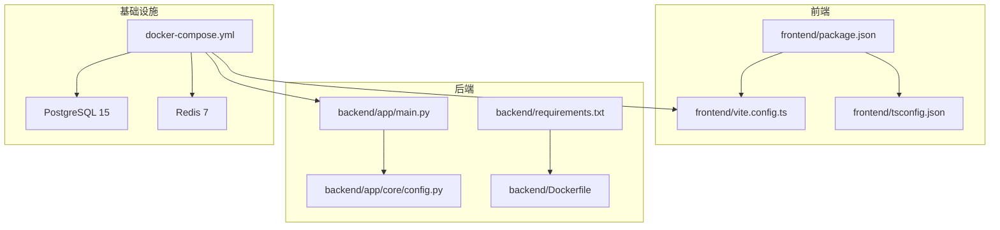
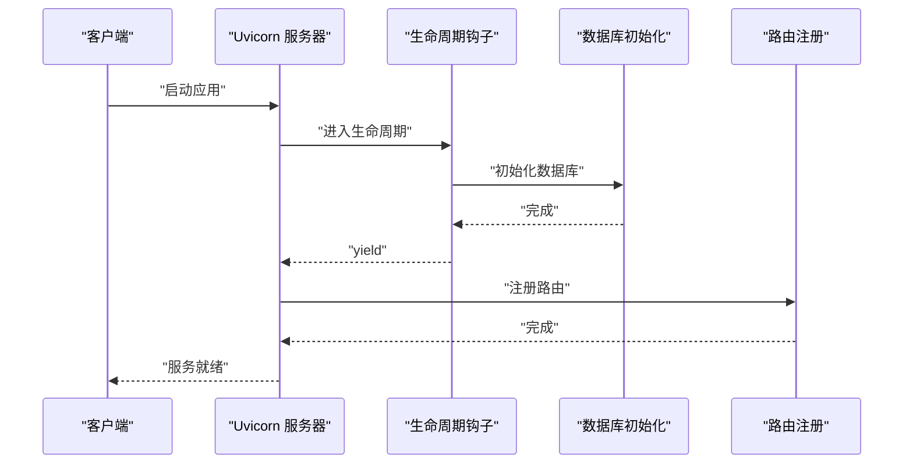
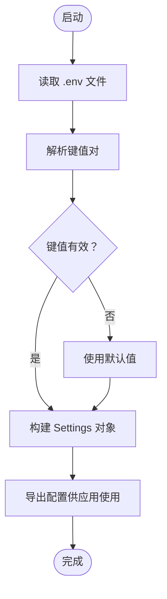
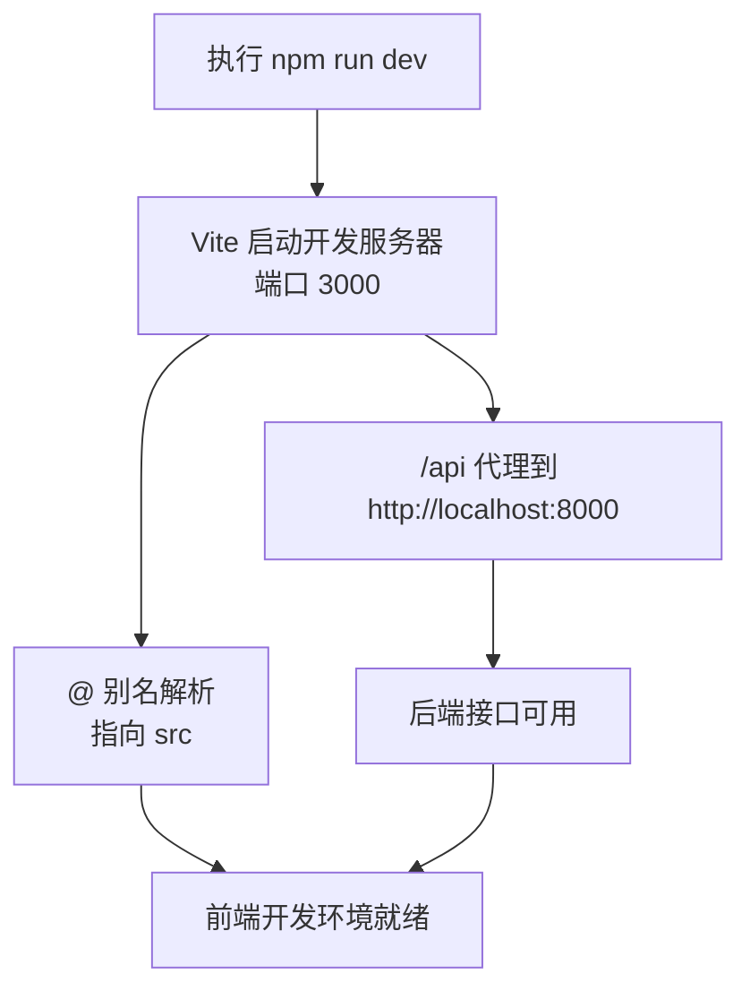
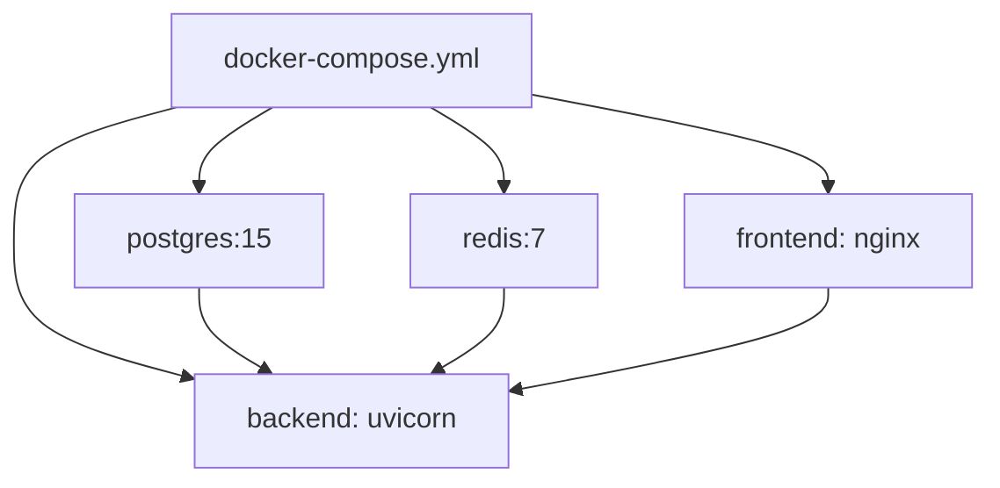
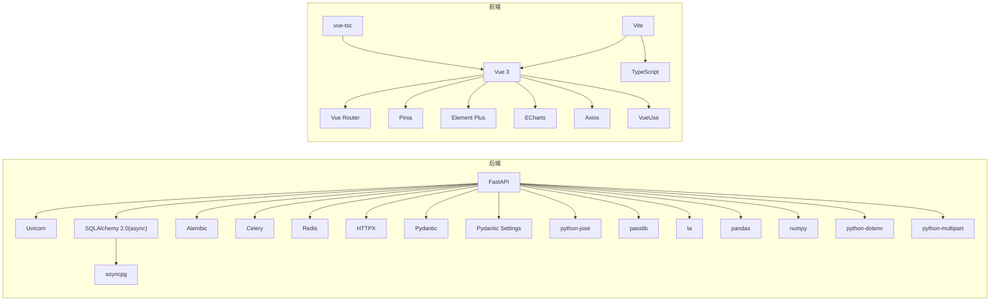

# 开发环境配置

<cite>
**本文引用的文件**
- [README.md](file://README.md)
- [docker-compose.yml](file://docker-compose.yml)
- [backend/Dockerfile](file://backend/Dockerfile)
- [backend/requirements.txt](file://backend/requirements.txt)
- [backend/app/main.py](file://backend/app/main.py)
- [backend/app/core/config.py](file://backend/app/core/config.py)
- [frontend/package.json](file://frontend/package.json)
- [frontend/vite.config.ts](file://frontend/vite.config.ts)
- [frontend/tsconfig.json](file://frontend/tsconfig.json)
</cite>

## 目录
1. [简介](#简介)
2. [项目结构](#项目结构)
3. [核心组件](#核心组件)
4. [架构总览](#架构总览)
5. [详细组件分析](#详细组件分析)
6. [依赖分析](#依赖分析)
7. [性能考虑](#性能考虑)
8. [故障排除指南](#故障排除指南)
9. [结论](#结论)
10. [附录](#附录)

## 简介
本指南面向Stock-View项目的开发者，提供从零开始搭建本地开发环境的完整流程，涵盖Python 3.11+、Node.js 18+、Docker 24+等工具的安装与配置；IDE设置建议（VS Code推荐插件、Python虚拟环境、TypeScript项目配置）；调试配置（后端FastAPI、前端Vue、WebSocket）；热重载配置（Vite HMR、后端自动重启）；以及环境变量与数据库连接配置方法。

## 项目结构
项目采用前后端分离架构，后端使用Python 3.11 + FastAPI + SQLAlchemy 2.0异步ORM，前端使用Vue 3 + TypeScript + Vite，数据库为PostgreSQL 15，缓存为Redis 7，容器编排通过Docker Compose实现。



**图表来源**
- [docker-compose.yml:1-54](file://docker-compose.yml#L1-L54)
- [backend/Dockerfile:1-12](file://backend/Dockerfile#L1-L12)
- [backend/requirements.txt:1-17](file://backend/requirements.txt#L1-L17)
- [backend/app/main.py:1-48](file://backend/app/main.py#L1-L48)
- [backend/app/core/config.py:1-43](file://backend/app/core/config.py#L1-L43)
- [frontend/package.json:1-27](file://frontend/package.json#L1-L27)
- [frontend/vite.config.ts:1-21](file://frontend/vite.config.ts#L1-L21)
- [frontend/tsconfig.json:1-24](file://frontend/tsconfig.json#L1-L24)

**章节来源**
- [README.md:92-126](file://README.md#L92-L126)
- [docker-compose.yml:1-54](file://docker-compose.yml#L1-L54)

## 核心组件
- 后端入口与生命周期管理：FastAPI应用在主程序中定义，包含CORS中间件、路由注册与健康检查端点，并通过生命周期钩子初始化数据库与关闭Redis连接。
- 配置系统：基于Pydantic Settings的环境变量加载，支持开发/生产环境切换、数据库与缓存连接串、AI适配器与限流策略、JWT密钥与算法等。
- 前端开发工具链：Vite作为开发服务器与构建工具，Vue 3 + TypeScript + 插件化配置，路径别名@指向src目录，内置API代理至后端8000端口。
- 容器编排：Docker Compose统一管理PostgreSQL、Redis、后端与前端镜像，暴露必要端口并持久化数据卷。

**章节来源**
- [backend/app/main.py:1-48](file://backend/app/main.py#L1-L48)
- [backend/app/core/config.py:1-43](file://backend/app/core/config.py#L1-L43)
- [frontend/package.json:1-27](file://frontend/package.json#L1-L27)
- [frontend/vite.config.ts:1-21](file://frontend/vite.config.ts#L1-L21)
- [docker-compose.yml:1-54](file://docker-compose.yml#L1-L54)

## 架构总览
下图展示了本地开发模式下的组件交互关系：前端通过Vite代理请求到后端，后端通过异步SQLAlchemy连接PostgreSQL，使用Redis进行缓存与Celery任务队列，WebSocket用于实时数据推送。

```mermaid
graph TB
Browser["浏览器"] --> ViteDev["Vite 开发服务器<br/>端口 3000"]
ViteDev --> Proxy["API 代理<br/>http://localhost:8000"]
Proxy --> FastAPI["FastAPI 应用<br/>端口 8000"]
FastAPI --> DB["PostgreSQL 15"]
FastAPI --> Cache["Redis 7"]
FastAPI --> WS["WebSocket 路由"]
Browser < --> WS
```

**图表来源**
- [frontend/vite.config.ts:14-18](file://frontend/vite.config.ts#L14-L18)
- [backend/app/main.py:39-43](file://backend/app/main.py#L39-L43)
- [docker-compose.yml:4-23](file://docker-compose.yml#L4-L23)

## 详细组件分析

### 后端FastAPI应用配置
- 应用生命周期：在生命周期钩子中初始化数据库并在应用关闭时释放Redis连接，确保资源正确回收。
- 中间件与路由：启用CORS允许跨域访问；按版本前缀注册行情、股票、自选股与AI相关路由，并挂载WebSocket路由。
- 健康检查：提供轻量级健康检查端点，便于前端与容器编排监控。



**图表来源**
- [backend/app/main.py:13-27](file://backend/app/main.py#L13-L27)

**章节来源**
- [backend/app/main.py:1-48](file://backend/app/main.py#L1-L48)

### 配置系统与环境变量
- 配置类：集中定义应用运行所需的关键参数，如数据库URL、Redis URL、AI适配器、Celery队列、JWT密钥与过期时间、行情采集间隔与缓存TTL等。
- 加载方式：通过缓存函数加载配置，从项目根目录下的.env文件读取键值对，支持开发环境默认值与覆盖项。
- 环境变量清单：包含数据库连接串、缓存连接串、AI服务地址与超时、调试开关、主备数据源、JWT配置、Celery队列等。



**图表来源**
- [backend/app/core/config.py:5-39](file://backend/app/core/config.py#L5-L39)

**章节来源**
- [backend/app/core/config.py:1-43](file://backend/app/core/config.py#L1-L43)
- [README.md:130-142](file://README.md#L130-L142)

### 前端Vite开发服务器配置
- 路径别名：@指向src目录，简化导入路径。
- 代理规则：将/api前缀的请求代理到后端8000端口，便于开发阶段前后端联调。
- 开发脚本：提供dev/build/preview等常用命令，构建时先进行类型检查再打包。



**图表来源**
- [frontend/vite.config.ts:7-20](file://frontend/vite.config.ts#L7-L20)
- [frontend/package.json:6-10](file://frontend/package.json#L6-L10)

**章节来源**
- [frontend/vite.config.ts:1-21](file://frontend/vite.config.ts#L1-L21)
- [frontend/package.json:1-27](file://frontend/package.json#L1-L27)

### 容器编排与数据库/缓存服务
- PostgreSQL：映射5432端口，持久化数据卷，初始化数据库与用户凭据。
- Redis：限制内存并设置LRU淘汰策略，持久化数据卷，提供缓存与消息队列能力。
- 后端镜像：基于Python 3.11 Slim，安装依赖后以Uvicorn单工作进程运行。
- 前端镜像：基于Nginx，对外暴露80端口并通过反向代理转发到Vite。



**图表来源**
- [docker-compose.yml:4-50](file://docker-compose.yml#L4-L50)
- [backend/Dockerfile:1-12](file://backend/Dockerfile#L1-L12)

**章节来源**
- [docker-compose.yml:1-54](file://docker-compose.yml#L1-L54)
- [backend/Dockerfile:1-12](file://backend/Dockerfile#L1-L12)

## 依赖分析
- 后端依赖：FastAPI、Uvicorn、SQLAlchemy 2.0异步、asyncpg、Alembic、Celery、Redis、HTTPX、Pydantic、Pydantic Settings、Passlib、TA-Lib、Pandas、NumPy、python-dotenv、python-multipart。
- 前端依赖：Vue 3、Vue Router、Pinia、Element Plus、ECharts、Axios、VueUse、Vite、TypeScript、Vue TSC。



**图表来源**
- [backend/requirements.txt:1-17](file://backend/requirements.txt#L1-L17)
- [frontend/package.json:11-25](file://frontend/package.json#L11-L25)

**章节来源**
- [backend/requirements.txt:1-17](file://backend/requirements.txt#L1-L17)
- [frontend/package.json:1-27](file://frontend/package.json#L1-L27)

## 性能考虑
- 开发环境优先保证迭代速度：后端使用单工作进程Uvicorn，前端Vite启用HMR，避免不必要的构建开销。
- 数据库与缓存：在开发环境中可适当降低Redis内存上限与淘汰策略，减少资源占用；生产环境请根据业务规模调整。
- API代理：前端代理仅在开发阶段生效，生产环境由Nginx统一处理静态资源与反向代理。

## 故障排除指南
- 启动后端报数据库连接错误
  - 检查环境变量DATABASE_URL是否指向正确的主机与端口，开发模式下应使用localhost或容器网络可达的地址。
  - 若使用Docker Compose，请确认postgres服务已启动且端口映射正常。
- 启动后端报Redis连接错误
  - 检查REDIS_URL是否正确，开发模式下应指向localhost或容器网络中的redis服务。
- 前端无法访问后端接口
  - 确认Vite代理配置是否正确，目标地址应为http://localhost:8000。
  - 检查后端CORS配置是否允许来自前端域名的请求。
- WebSocket无法连接
  - 确认WebSocket路由已注册并监听相应端口，浏览器控制台查看网络面板与WebSocket帧。
- Docker构建失败
  - 确保Docker版本满足要求，依赖安装阶段可能需要网络访问，必要时配置代理。
  - 清理Docker构建缓存后重试。

**章节来源**
- [backend/app/core/config.py:12-14](file://backend/app/core/config.py#L12-L14)
- [frontend/vite.config.ts:14-18](file://frontend/vite.config.ts#L14-L18)
- [backend/app/main.py:29-36](file://backend/app/main.py#L29-L36)
- [docker-compose.yml:4-23](file://docker-compose.yml#L4-L23)

## 结论
通过本指南，您可以在本地快速搭建Stock-View的开发环境，掌握后端FastAPI、前端Vue、数据库与缓存的配置要点，并利用Docker Compose实现一键启动。建议在开发过程中充分利用热重载与调试配置，结合环境变量模板进行灵活切换，确保开发效率与稳定性。

## 附录

### 本地开发环境搭建步骤
- 安装工具
  - Python 3.11+：用于后端开发与虚拟环境管理。
  - Node.js 18+：用于前端开发与包管理。
  - Docker 24+：用于容器化部署与服务编排。
- 启动依赖服务
  - 使用Docker Compose启动PostgreSQL与Redis，便于后端与前端联调。
- 启动后端
  - 创建并激活Python虚拟环境，安装依赖，复制并编辑.env文件，设置数据库与缓存连接串，启动Uvicorn开发服务器。
- 启动前端
  - 在frontend目录安装依赖，启动Vite开发服务器，浏览器访问默认端口，API请求将被代理到后端。

**章节来源**
- [README.md:47-88](file://README.md#L47-L88)
- [docker-compose.yml:47-50](file://docker-compose.yml#L47-L50)
- [backend/Dockerfile:1-12](file://backend/Dockerfile#L1-L12)
- [backend/requirements.txt:1-17](file://backend/requirements.txt#L1-L17)

### IDE设置指导（VS Code）
- 推荐插件
  - Python：语法高亮、智能提示、单元测试集成。
  - Pylance：类型检查与智能感知。
  - Python Docstring Generator：自动生成文档字符串。
  - ESLint/Vetur：TypeScript/Vue语法检查与格式化。
  - EditorConfig：统一缩进与换行风格。
  - DotENV：.env文件语法高亮。
- Python虚拟环境
  - 在项目根目录创建venv，激活后安装requirements.txt中的依赖。
- TypeScript项目配置
  - 使用tsconfig.json与tsconfig.node.json，启用严格模式与模块解析策略，确保路径别名@正确解析。

**章节来源**
- [frontend/tsconfig.json:2-22](file://frontend/tsconfig.json#L2-L22)
- [backend/requirements.txt:1-17](file://backend/requirements.txt#L1-L17)

### 调试配置方法
- 后端FastAPI调试
  - 使用Uvicorn的--reload选项开启自动重启，修改代码后自动检测并重启服务。
  - 在VS Code中配置Python调试任务，选择后端入口模块与参数。
- 前端Vue调试
  - 在VS Code中配置JavaScript调试任务，附加到Vite开发服务器进程。
  - 使用浏览器开发者工具断点调试，结合TypeScript源码映射定位问题。
- WebSocket调试技巧
  - 打开浏览器开发者工具的Network面板，观察WebSocket握手与消息收发。
  - 在后端添加日志输出，记录连接建立、消息接收与异常情况。

**章节来源**
- [backend/app/main.py:73-73](file://backend/app/main.py#L73-L73)
- [frontend/vite.config.ts:12-20](file://frontend/vite.config.ts#L12-L20)

### 热重载配置
- Vite HMR
  - Vite默认启用HMR，修改Vue/TS文件后浏览器自动刷新或局部更新。
  - 代理规则确保API变更无需手动重启即可生效。
- 后端自动重启
  - Uvicorn --reload在文件系统变化时触发重启，适合快速迭代开发。

**章节来源**
- [frontend/vite.config.ts:12-20](file://frontend/vite.config.ts#L12-L20)
- [backend/app/main.py:73-73](file://backend/app/main.py#L73-L73)

### 环境变量配置示例与数据库连接
- 环境变量模板
  - 参考项目根目录的.env.example，复制为.env并按需修改键值。
  - 关键键值包括DATABASE_URL、REDIS_URL、AI_ADAPTER、APP_ENV、APP_DEBUG、PRIMARY_DATA_SOURCE、FALLBACK_DATA_SOURCE等。
- 数据库连接
  - 开发模式下DATABASE_URL指向localhost:5432，使用asyncpg驱动。
  - 如使用Docker Compose，后端服务中的DATABASE_URL指向postgres容器名称，确保网络互通。

**章节来源**
- [README.md:130-142](file://README.md#L130-L142)
- [backend/app/core/config.py:12-12](file://backend/app/core/config.py#L12-L12)
- [docker-compose.yml:30-31](file://docker-compose.yml#L30-L31)