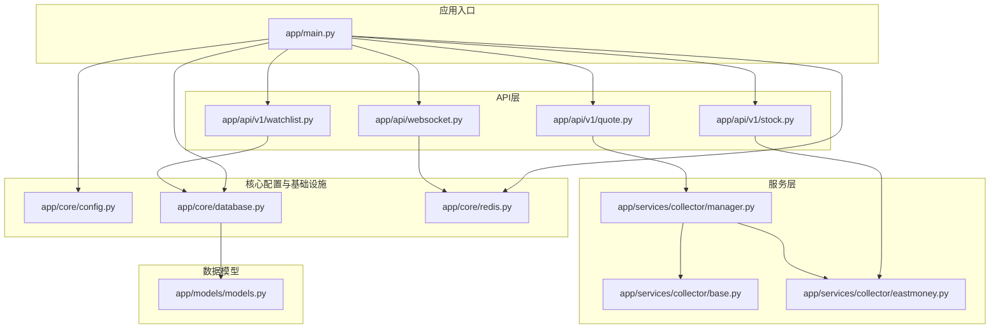
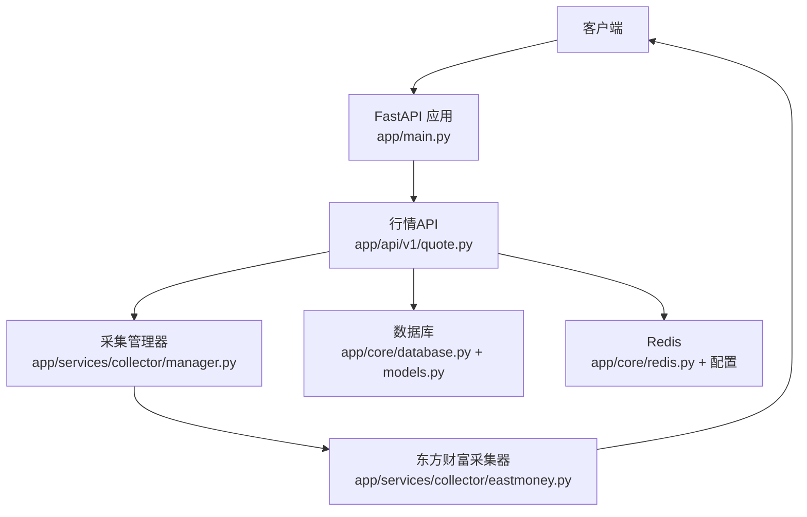
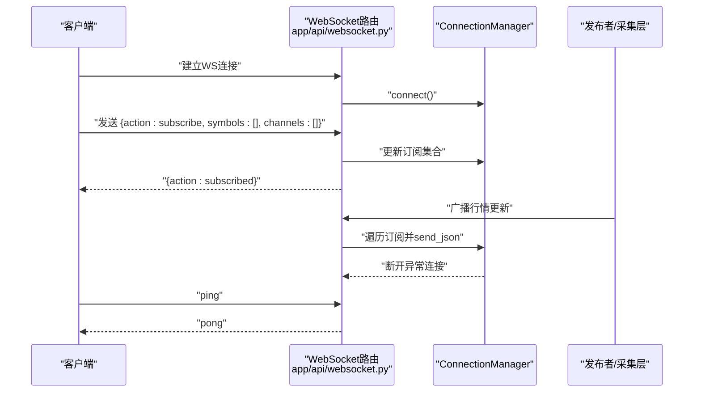
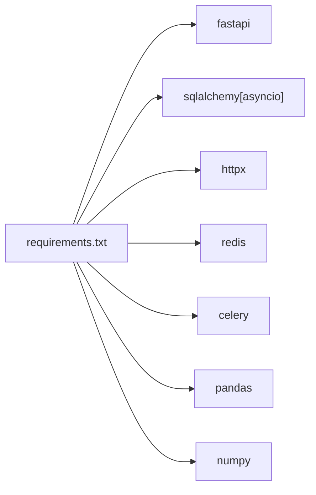

# 性能优化

<cite>
**本文引用的文件**
- [backend/app/main.py](file://backend/app/main.py)
- [backend/app/core/config.py](file://backend/app/core/config.py)
- [backend/app/core/database.py](file://backend/app/core/database.py)
- [backend/app/core/redis.py](file://backend/app/core/redis.py)
- [backend/app/api/v1/quote.py](file://backend/app/api/v1/quote.py)
- [backend/app/api/v1/stock.py](file://backend/app/api/v1/stock.py)
- [backend/app/api/v1/watchlist.py](file://backend/app/api/v1/watchlist.py)
- [backend/app/api/websocket.py](file://backend/app/api/websocket.py)
- [backend/app/services/collector/manager.py](file://backend/app/services/collector/manager.py)
- [backend/app/services/collector/base.py](file://backend/app/services/collector/base.py)
- [backend/app/services/collector/eastmoney.py](file://backend/app/services/collector/eastmoney.py)
- [backend/app/models/models.py](file://backend/app/models/models.py)
- [backend/requirements.txt](file://backend/requirements.txt)
- [backend/Dockerfile](file://backend/Dockerfile)
</cite>

## 目录
1. [引言](#引言)
2. [项目结构](#项目结构)
3. [核心组件](#核心组件)
4. [架构总览](#架构总览)
5. [详细组件分析](#详细组件分析)
6. [依赖分析](#依赖分析)
7. [性能考虑](#性能考虑)
8. [故障排查指南](#故障排查指南)
9. [结论](#结论)
10. [附录](#附录)

## 引言
本指南面向Stock-View项目的后端与全栈性能优化，聚焦以下方面：数据库查询优化、Redis缓存策略、异步任务与并发模型、WebSocket连接与消息处理、缓存策略设计（多级缓存、失效与预热）、性能监控与瓶颈识别、以及内存与GC优化建议。文档在每个技术点后提供“章节来源”，便于追溯到具体实现文件。

## 项目结构
后端采用FastAPI + SQLAlchemy异步ORM + Redis + Celery的组合，服务层通过Collector抽象统一外部数据源，API层提供REST与WebSocket接口，数据库模型覆盖股票基础信息、行情日线、分时与自选股等。

**图表来源**
- [backend/app/main.py:1-48](file://backend/app/main.py#L1-L48)
- [backend/app/core/config.py:1-43](file://backend/app/core/config.py#L1-L43)
- [backend/app/core/database.py:1-25](file://backend/app/core/database.py#L1-L25)
- [backend/app/core/redis.py:1-25](file://backend/app/core/redis.py#L1-L25)
- [backend/app/api/v1/quote.py:1-65](file://backend/app/api/v1/quote.py#L1-L65)
- [backend/app/api/v1/stock.py:1-37](file://backend/app/api/v1/stock.py#L1-L37)
- [backend/app/api/v1/watchlist.py:1-77](file://backend/app/api/v1/watchlist.py#L1-L77)
- [backend/app/api/websocket.py:1-79](file://backend/app/api/websocket.py#L1-L79)
- [backend/app/services/collector/manager.py:1-80](file://backend/app/services/collector/manager.py#L1-L80)
- [backend/app/services/collector/base.py:1-45](file://backend/app/services/collector/base.py#L1-L45)
- [backend/app/services/collector/eastmoney.py:1-240](file://backend/app/services/collector/eastmoney.py#L1-L240)
- [backend/app/models/models.py:1-74](file://backend/app/models/models.py#L1-L74)

**章节来源**
- [backend/app/main.py:1-48](file://backend/app/main.py#L1-L48)
- [backend/app/core/config.py:1-43](file://backend/app/core/config.py#L1-L43)
- [backend/app/core/database.py:1-25](file://backend/app/core/database.py#L1-L25)
- [backend/app/core/redis.py:1-25](file://backend/app/core/redis.py#L1-L25)
- [backend/app/api/v1/quote.py:1-65](file://backend/app/api/v1/quote.py#L1-L65)
- [backend/app/api/v1/stock.py:1-37](file://backend/app/api/v1/stock.py#L1-L37)
- [backend/app/api/v1/watchlist.py:1-77](file://backend/app/api/v1/watchlist.py#L1-L77)
- [backend/app/api/websocket.py:1-79](file://backend/app/api/websocket.py#L1-L79)
- [backend/app/services/collector/manager.py:1-80](file://backend/app/services/collector/manager.py#L1-L80)
- [backend/app/services/collector/base.py:1-45](file://backend/app/services/collector/base.py#L1-L45)
- [backend/app/services/collector/eastmoney.py:1-240](file://backend/app/services/collector/eastmoney.py#L1-L240)
- [backend/app/models/models.py:1-74](file://backend/app/models/models.py#L1-L74)

## 核心组件
- 应用入口与生命周期：FastAPI应用初始化、CORS中间件、路由注册、健康检查、生命周期事件用于数据库初始化与Redis关闭。
- 配置中心：集中管理数据库URL、Redis URL、数据源优先级、AI服务参数、Celery队列、行情采集间隔与缓存TTL、JWT等。
- 数据库：异步引擎与会话工厂，连接池参数可调；模型定义覆盖股票信息、日线行情、分时、自选股与AI分析日志。
- 缓存：Redis连接池全局持有，提供获取与关闭方法；配置中包含AI缓存开关与TTL。
- API层：行情、股票搜索、自选股、WebSocket行情推送。
- 采集层：Collector抽象与实现，支持故障转移与多数据源优先级。

**章节来源**
- [backend/app/main.py:1-48](file://backend/app/main.py#L1-L48)
- [backend/app/core/config.py:1-43](file://backend/app/core/config.py#L1-L43)
- [backend/app/core/database.py:1-25](file://backend/app/core/database.py#L1-L25)
- [backend/app/core/redis.py:1-25](file://backend/app/core/redis.py#L1-L25)
- [backend/app/models/models.py:1-74](file://backend/app/models/models.py#L1-L74)

## 架构总览
下图展示请求流经FastAPI、API层、服务层与外部数据源的整体路径，并标注关键性能关注点（并发、缓存、超时、重试）。

**图表来源**
- [backend/app/main.py:1-48](file://backend/app/main.py#L1-L48)
- [backend/app/api/v1/quote.py:1-65](file://backend/app/api/v1/quote.py#L1-L65)
- [backend/app/services/collector/manager.py:1-80](file://backend/app/services/collector/manager.py#L1-L80)
- [backend/app/services/collector/eastmoney.py:1-240](file://backend/app/services/collector/eastmoney.py#L1-L240)
- [backend/app/core/database.py:1-25](file://backend/app/core/database.py#L1-L25)
- [backend/app/core/redis.py:1-25](file://backend/app/core/redis.py#L1-L25)
- [backend/app/models/models.py:1-74](file://backend/app/models/models.py#L1-L74)

## 详细组件分析

### 数据库查询优化
- 连接池与事务
  - 使用异步引擎与会话工厂，连接池大小与溢出量可配置；会话在请求内创建与释放，避免长事务。
  - 建议：为高并发场景评估pool_size与max_overflow，结合慢查询日志定位热点SQL。
- 模型与索引
  - 常用查询字段（如symbol、user_id、trade_date）应建立索引以提升筛选与排序效率。
  - 建议：对watchlist按(user_id, sort_order)复合索引，对quote按(symbol, trade_date)复合索引。
- 查询模式
  - API层使用select语句进行精确字段查询，避免SELECT *。
  - 建议：批量写入使用bulk操作，减少往返次数；分页查询限制page_size上限。

**章节来源**
- [backend/app/core/database.py:1-25](file://backend/app/core/database.py#L1-L25)
- [backend/app/models/models.py:1-74](file://backend/app/models/models.py#L1-L74)
- [backend/app/api/v1/watchlist.py:1-77](file://backend/app/api/v1/watchlist.py#L1-L77)

### Redis缓存策略
- 连接池与键空间
  - 全局持有Redis连接池，减少连接开销；注意不同业务使用不同DB或命名空间，避免键冲突。
  - 建议：为行情与AI分析分别设置独立TTL与过期策略。
- 缓存键设计
  - 建议：使用前缀区分模块，如quote:{symbol}:{type}、ai:{symbol}:{task}。
- 失效与预热
  - 建议：基于配置项控制TTL；在定时任务中对热点symbol进行预热。
- 并发与序列化
  - 建议：统一编码与解码策略，避免重复转换；批量读写使用pipeline。

**章节来源**
- [backend/app/core/redis.py:1-25](file://backend/app/core/redis.py#L1-L25)
- [backend/app/core/config.py:1-43](file://backend/app/core/config.py#L1-L43)

### 异步任务与并发优化
- 异步框架
  - FastAPI + SQLAlchemy异步ORM + httpx异步HTTP客户端，适合I/O密集型场景。
  - 建议：在Dockerfile中将workers设为1以避免多进程共享异步资源问题；若需多核，使用uvicorn的--workers与进程隔离。
- 采集层并发
  - CollectorManager按优先级尝试多个数据源，失败自动切换，降低单点故障影响。
  - 建议：对外部HTTP请求设置合理timeout，避免阻塞；对高频请求增加本地缓存与限速。
- Celery集成
  - 配置中已提供broker与backend，建议在tasks目录实现后台任务，分离耗时逻辑。

**章节来源**
- [backend/app/main.py:1-48](file://backend/app/main.py#L1-L48)
- [backend/Dockerfile:1-12](file://backend/Dockerfile#L1-L12)
- [backend/app/services/collector/manager.py:1-80](file://backend/app/services/collector/manager.py#L1-L80)
- [backend/app/core/config.py:1-43](file://backend/app/core/config.py#L1-L43)

### WebSocket连接优化
- 连接管理
  - ConnectionManager维护活动连接与订阅集合，支持订阅/退订与ping/pong心跳。
  - 建议：限制单客户端订阅数量，防止广播风暴；对异常发送进行断连清理。
- 广播与消息
  - broadcast_quote_update按symbol与channel过滤目标客户端，避免无效推送。
  - 建议：消息体精简化，仅传输必要字段；对高频推送启用去抖与合并。
- 心跳与保活
  - 建议：服务端定期向客户端发送ping，客户端回pong；超时未响应主动断开。

**图表来源**
- [backend/app/api/websocket.py:1-79](file://backend/app/api/websocket.py#L1-L79)

**章节来源**
- [backend/app/api/websocket.py:1-79](file://backend/app/api/websocket.py#L1-L79)

### 缓存策略设计
- 多级缓存
  - L1：Redis（热点数据、临时结果）；L2：本地内存缓存（短周期高频访问）；L3：数据库（冷数据）。
- 失效策略
  - 基于TTL与LRU淘汰；对写多读少场景采用写穿透与延迟双删。
- 缓存预热
  - 定时任务扫描热门symbol，提前写入Redis；启动阶段加载常用数据集。
- 命中率优化
  - 统一key命名规范；对热点字段做序列化压缩；对过期时间进行抖动以避免雪崩。

**章节来源**
- [backend/app/core/config.py:1-43](file://backend/app/core/config.py#L1-L43)
- [backend/app/services/collector/manager.py:1-80](file://backend/app/services/collector/manager.py#L1-L80)

### 前端性能优化（建议）
- 组件懒加载与路由懒加载：按需加载页面与组件，减少首屏体积。
- 图片优化：使用现代格式（WebP/AVIF）、响应式尺寸与占位符，避免阻塞渲染。
- 代码分割：拆分vendor包与业务代码，利用浏览器缓存。
- 资源压缩与CDN：开启Gzip/Brotli，静态资源走CDN。
- 渲染优化：虚拟滚动处理长列表，防抖节流处理高频交互。

（本节为通用实践建议，不直接分析具体文件）

### 性能监控与分析
- APM工具
  - 推荐：OpenTelemetry + Jaeger/Zipkin链路追踪；Prometheus + Grafana指标监控。
- 指标体系
  - 后端：请求QPS/P95/P99、错误率、数据库慢查询、Redis命中率、WebSocket连接数。
  - 前端：首屏时间、交互延迟、资源体积、FPS。
- 瓶颈识别
  - 通过火焰图定位CPU热点；通过慢查询日志与Redis慢日志定位IO瓶颈；通过WS连接数与广播耗时评估消息层压力。

（本节为通用实践建议，不直接分析具体文件）

### 内存管理与垃圾回收优化
- Python GC
  - 适当增大对象池与复用频繁创建的对象；避免循环引用；在长时间运行的服务中定期触发gc.collect。
- 内存泄漏排查
  - 使用tracemalloc/objgraph定位未释放对象；关注大对象与长生命周期容器。
- 运行时参数
  - 在容器中设置合理的内存限制与JIT参数（如PyPy），平衡吞吐与延迟。

（本节为通用实践建议，不直接分析具体文件）

## 依赖分析
- 外部依赖
  - FastAPI、SQLAlchemy异步、httpx、redis、celery、pandas/numpy等。
- 版本兼容性
  - 建议锁定关键版本，避免因依赖升级导致性能回退。
- 运行时
  - Dockerfile中使用单worker，注意与异步并发模型的匹配。

**图表来源**
- [backend/requirements.txt:1-17](file://backend/requirements.txt#L1-L17)

**章节来源**
- [backend/requirements.txt:1-17](file://backend/requirements.txt#L1-L17)
- [backend/Dockerfile:1-12](file://backend/Dockerfile#L1-L12)

## 性能考虑
- I/O密集优化
  - 使用异步HTTP与数据库，避免阻塞；合理设置超时与重试。
- CPU密集优化
  - 将计算型任务移至Celery worker或专用服务；对数值计算使用pandas/numpy。
- 网络与外部依赖
  - 对第三方数据源设置超时与降级；在CollectorManager中实现故障转移。
- 存储与索引
  - 为高频查询字段建立索引；对历史数据进行分区或归档。
- 缓存与一致性
  - 明确缓存失效策略，避免脏读；对关键路径强制校验缓存命中。

**章节来源**
- [backend/app/services/collector/eastmoney.py:1-240](file://backend/app/services/collector/eastmoney.py#L1-L240)
- [backend/app/services/collector/manager.py:1-80](file://backend/app/services/collector/manager.py#L1-L80)
- [backend/app/api/v1/quote.py:1-65](file://backend/app/api/v1/quote.py#L1-L65)
- [backend/app/models/models.py:1-74](file://backend/app/models/models.py#L1-L74)

## 故障排查指南
- 健康检查
  - 使用/health端点快速判断服务状态。
- 日志与告警
  - 采集器对外部接口异常进行warning记录；WebSocket异常断连清理。
- 数据库与缓存
  - 检查连接池是否耗尽；确认Redis可用性与TTL设置。
- 并发与资源
  - Docker workers=1时，避免多进程共享异步事件循环；监控内存与GC频率。

**章节来源**
- [backend/app/main.py:46-48](file://backend/app/main.py#L46-L48)
- [backend/app/services/collector/manager.py:1-80](file://backend/app/services/collector/manager.py#L1-L80)
- [backend/app/api/websocket.py:1-79](file://backend/app/api/websocket.py#L1-L79)

## 结论
通过异步化、多级缓存、合理的连接池与索引、以及完善的监控与限流，Stock-View可在高并发场景下保持稳定与低延迟。建议优先落地Redis缓存与数据库索引优化，再逐步完善WebSocket消息压缩与心跳保活、以及Celery任务拆分与限速策略。

## 附录
- 关键配置项参考
  - 数据库URL、Redis URL、AI缓存开关与TTL、Celery broker与backend、行情采集间隔与缓存TTL、JWT参数等。
- 建议的监控面板
  - 请求延迟分布、错误率趋势、数据库慢查询TopN、Redis命中率与延迟、WebSocket在线数与广播耗时。

**章节来源**
- [backend/app/core/config.py:1-43](file://backend/app/core/config.py#L1-L43)