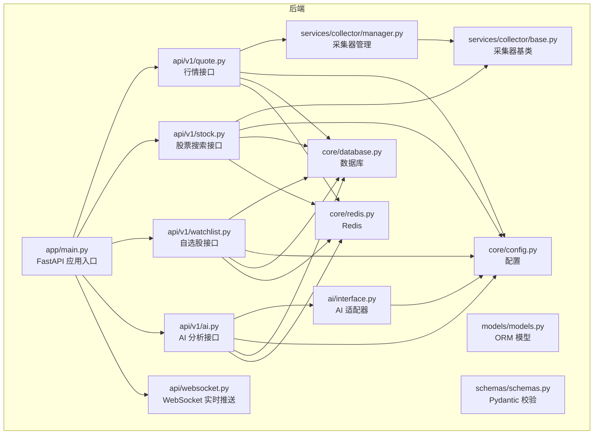
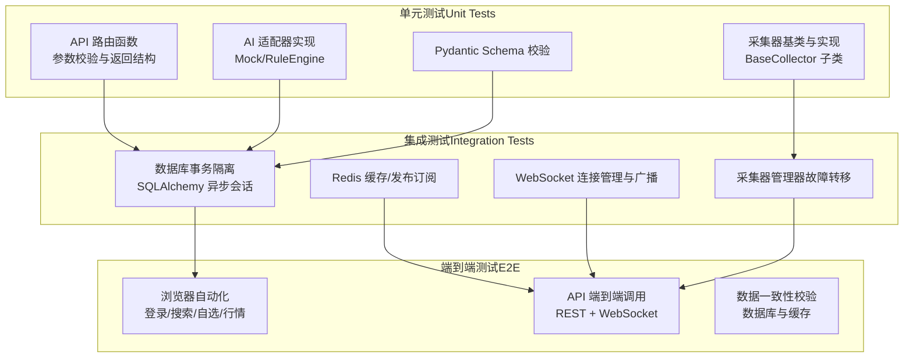
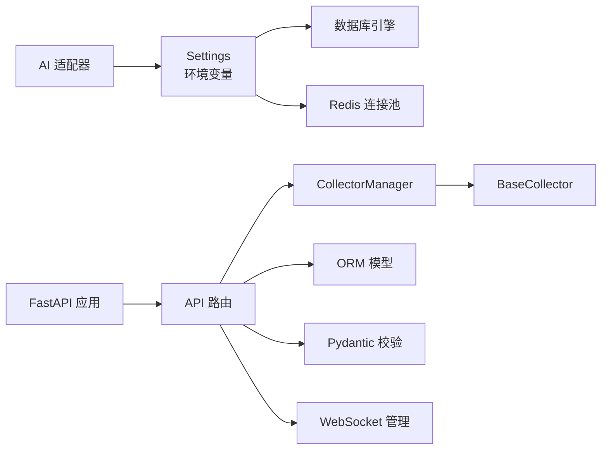

# 测试策略

<cite>
**本文引用的文件**
- [README.md](file://README.md)
- [backend/app/main.py](file://backend/app/main.py)
- [backend/requirements.txt](file://backend/requirements.txt)
- [backend/app/api/v1/quote.py](file://backend/app/api/v1/quote.py)
- [backend/app/api/v1/stock.py](file://backend/app/api/v1/stock.py)
- [backend/app/api/v1/watchlist.py](file://backend/app/api/v1/watchlist.py)
- [backend/app/api/v1/ai.py](file://backend/app/api/v1/ai.py)
- [backend/app/api/websocket.py](file://backend/app/api/websocket.py)
- [backend/app/models/models.py](file://backend/app/models/models.py)
- [backend/app/schemas/schemas.py](file://backend/app/schemas/schemas.py)
- [backend/app/services/collector/manager.py](file://backend/app/services/collector/manager.py)
- [backend/app/services/collector/base.py](file://backend/app/services/collector/base.py)
- [backend/app/core/config.py](file://backend/app/core/config.py)
- [backend/app/core/database.py](file://backend/app/core/database.py)
- [backend/app/core/redis.py](file://backend/app/core/redis.py)
- [backend/app/ai/interface.py](file://backend/app/ai/interface.py)
</cite>

## 目录
1. [引言](#引言)
2. [项目结构](#项目结构)
3. [核心组件](#核心组件)
4. [架构总览](#架构总览)
5. [详细组件分析](#详细组件分析)
6. [依赖关系分析](#依赖关系分析)
7. [性能考虑](#性能考虑)
8. [故障排查指南](#故障排查指南)
9. [结论](#结论)
10. [附录](#附录)

## 引言
本测试策略文档面向 Stock-View 项目，围绕测试金字塔（单元测试、集成测试、端到端测试）制定系统化的测试实施方法，覆盖后端 Python（FastAPI + SQLAlchemy 2.0 + Redis）、前端 Vue 组件、API 接口（REST 与 WebSocket）、以及测试环境与性能/负载测试。目标是确保代码质量、可维护性与系统稳定性。

## 项目结构
- 后端采用 FastAPI + SQLAlchemy 2.0 异步 ORM，模块化组织在 app/ 下，按领域拆分：api、core、models、schemas、services、tasks、ai。
- 前端为 Vue 3 应用，通过 Vite 开发服务器代理 API 到后端 8000 端口。
- 配置与环境变量通过 pydantic-settings 读取，数据库与 Redis 通过连接池管理。

图表来源
- [backend/app/main.py:1-48](file://backend/app/main.py#L1-L48)
- [backend/app/api/v1/quote.py:1-65](file://backend/app/api/v1/quote.py#L1-L65)
- [backend/app/api/v1/stock.py:1-37](file://backend/app/api/v1/stock.py#L1-L37)
- [backend/app/api/v1/watchlist.py:1-77](file://backend/app/api/v1/watchlist.py#L1-L77)
- [backend/app/api/v1/ai.py:1-29](file://backend/app/api/v1/ai.py#L1-L29)
- [backend/app/api/websocket.py:1-79](file://backend/app/api/websocket.py#L1-L79)
- [backend/app/core/config.py:1-43](file://backend/app/core/config.py#L1-L43)
- [backend/app/core/database.py:1-25](file://backend/app/core/database.py#L1-L25)
- [backend/app/core/redis.py:1-25](file://backend/app/core/redis.py#L1-L25)
- [backend/app/models/models.py:1-74](file://backend/app/models/models.py#L1-L74)
- [backend/app/schemas/schemas.py:1-103](file://backend/app/schemas/schemas.py#L1-L103)
- [backend/app/services/collector/manager.py:1-80](file://backend/app/services/collector/manager.py#L1-L80)
- [backend/app/services/collector/base.py:1-45](file://backend/app/services/collector/base.py#L1-L45)
- [backend/app/ai/interface.py:1-196](file://backend/app/ai/interface.py#L1-L196)

章节来源
- [README.md:92-126](file://README.md#L92-L126)
- [backend/app/main.py:1-48](file://backend/app/main.py#L1-L48)

## 核心组件
- FastAPI 应用入口与生命周期：注册路由、CORS 中间件、健康检查端点。
- API 层：行情、股票搜索、自选股、AI 分析、WebSocket。
- 采集层：CollectorManager 负责多数据源优先级与故障转移；BaseCollector 提供统一接口。
- 存储层：SQLAlchemy 2.0 异步 ORM，定义 StockInfo、QuoteDaily、QuoteTick、Watchlist、AIAnalysisLog 等模型。
- 配置与连接：Settings 读取环境变量；数据库与 Redis 连接池初始化与关闭。
- AI 适配器：Mock 与 RuleEngine 两种实现，支持同步与流式分析。

章节来源
- [backend/app/main.py:1-48](file://backend/app/main.py#L1-L48)
- [backend/app/api/v1/quote.py:1-65](file://backend/app/api/v1/quote.py#L1-L65)
- [backend/app/api/v1/stock.py:1-37](file://backend/app/api/v1/stock.py#L1-L37)
- [backend/app/api/v1/watchlist.py:1-77](file://backend/app/api/v1/watchlist.py#L1-L77)
- [backend/app/api/v1/ai.py:1-29](file://backend/app/api/v1/ai.py#L1-L29)
- [backend/app/api/websocket.py:1-79](file://backend/app/api/websocket.py#L1-L79)
- [backend/app/models/models.py:1-74](file://backend/app/models/models.py#L1-L74)
- [backend/app/schemas/schemas.py:1-103](file://backend/app/schemas/schemas.py#L1-L103)
- [backend/app/services/collector/manager.py:1-80](file://backend/app/services/collector/manager.py#L1-L80)
- [backend/app/services/collector/base.py:1-45](file://backend/app/services/collector/base.py#L1-L45)
- [backend/app/core/config.py:1-43](file://backend/app/core/config.py#L1-L43)
- [backend/app/core/database.py:1-25](file://backend/app/core/database.py#L1-L25)
- [backend/app/core/redis.py:1-25](file://backend/app/core/redis.py#L1-L25)
- [backend/app/ai/interface.py:1-196](file://backend/app/ai/interface.py#L1-L196)

## 架构总览
下图展示测试金字塔在本项目中的落地方式与各层职责边界：

## 详细组件分析

### 测试金字塔实施策略
- 单元测试（优先）：针对纯函数、工具函数、Schema 校验、AI 适配器、采集器基类与子类进行隔离测试，确保边界条件与错误路径覆盖。
- 集成测试：以最小可用数据库与 Redis 作为外部依赖，验证路由与服务层组合行为、异常处理与资源释放。
- 端到端测试：通过浏览器自动化或 API 测试套件，覆盖真实用户路径（搜索、自选、行情、WebSocket 订阅），并进行数据一致性与性能回归。

章节来源
- [backend/app/schemas/schemas.py:1-103](file://backend/app/schemas/schemas.py#L1-L103)
- [backend/app/ai/interface.py:1-196](file://backend/app/ai/interface.py#L1-L196)
- [backend/app/services/collector/base.py:1-45](file://backend/app/services/collector/base.py#L1-L45)
- [backend/app/core/database.py:1-25](file://backend/app/core/database.py#L1-L25)
- [backend/app/core/redis.py:1-25](file://backend/app/core/redis.py#L1-L25)
- [backend/app/api/websocket.py:1-79](file://backend/app/api/websocket.py#L1-L79)

### 后端 Python 测试实现（pytest）
- pytest 配置与目录结构
  - 建议在 backend/ 下创建 tests/ 目录，按模块划分子目录（如 tests/api、tests/services、tests/core）。
  - 使用 pytest-asyncio 运行异步测试；必要时使用 monkeypatch 设置环境变量指向测试数据库与 Redis。
- 测试用例编写
  - API 层：对每个路由函数构造请求参数（含边界与非法值），断言响应结构与状态码；对异常分支断言错误码与消息。
  - 服务层：对 CollectorManager 的故障转移逻辑进行断言；对 AI 适配器返回结构进行断言。
  - 数据层：使用独立的测试数据库与事务回滚，断言 CRUD 行为与并发安全。
- Mock 对象使用
  - 使用 unittest.mock 或 pytest-mock 替换外部依赖（HTTP 客户端、Redis、数据库连接），确保测试稳定与可重复。
  - 对 WebSocket 广播函数进行 Mock，验证订阅/退订流程与异常断连处理。
- 示例断言点（不展示具体代码）
  - 断言响应体包含 code/message/data 字段且类型正确。
  - 断言 AI 返回包含趋势、置信度、摘要、预测等关键键。
  - 断言采集器返回字典非空且包含必要字段。

章节来源
- [backend/requirements.txt:1-17](file://backend/requirements.txt#L1-L17)
- [backend/app/api/v1/quote.py:1-65](file://backend/app/api/v1/quote.py#L1-L65)
- [backend/app/api/v1/stock.py:1-37](file://backend/app/api/v1/stock.py#L1-L37)
- [backend/app/api/v1/watchlist.py:1-77](file://backend/app/api/v1/watchlist.py#L1-L77)
- [backend/app/api/v1/ai.py:1-29](file://backend/app/api/v1/ai.py#L1-L29)
- [backend/app/api/websocket.py:1-79](file://backend/app/api/websocket.py#L1-L79)
- [backend/app/ai/interface.py:1-196](file://backend/app/ai/interface.py#L1-L196)
- [backend/app/services/collector/manager.py:1-80](file://backend/app/services/collector/manager.py#L1-L80)

### 前端 Vue 组件测试方案
- 单元测试：对 Vue 组件的渲染、props 输入、事件触发进行断言；对组合式函数（composables）与工具函数进行纯函数测试。
- 组件测试：使用 @testing-library/vue 或 Vitest + @vue/test-utils，模拟 Pinia 状态、路由与 API 客户端，断言 UI 行为与数据流。
- 用户交互测试：通过 Playwright 或 Cypress 执行端到端交互，覆盖搜索、自选管理、K线/分时图渲染、WebSocket 实时更新等场景。
- 性能测试：对图表渲染与数据更新进行节流/去抖断言，避免频繁重绘。

章节来源
- [README.md:15-16](file://README.md#L15-L16)
- [README.md:76-88](file://README.md#L76-L88)

### API 接口测试要点
- REST API 测试
  - 覆盖 GET/POST/PUT/DELETE 全部路由，断言响应结构、状态码与业务语义。
  - 对查询参数进行边界测试（页码、条数、排序字段、周期、复权类型等）。
  - 对数据库写入接口（自选股新增/排序/删除）断言幂等性与并发安全。
- WebSocket 测试
  - 断言连接建立、订阅/退订、心跳 ping/pong、异常断连清理。
  - 断言广播消息格式与目标客户端过滤逻辑。
- 数据验证测试
  - 对 Pydantic Schema 的输入校验进行负例测试（缺失字段、类型不符、范围越界）。
  - 对采集器返回数据进行结构校验与字段存在性断言。

章节来源
- [backend/app/api/v1/quote.py:1-65](file://backend/app/api/v1/quote.py#L1-L65)
- [backend/app/api/v1/stock.py:1-37](file://backend/app/api/v1/stock.py#L1-L37)
- [backend/app/api/v1/watchlist.py:1-77](file://backend/app/api/v1/watchlist.py#L1-L77)
- [backend/app/api/v1/ai.py:1-29](file://backend/app/api/v1/ai.py#L1-L29)
- [backend/app/api/websocket.py:1-79](file://backend/app/api/websocket.py#L1-L79)
- [backend/app/schemas/schemas.py:1-103](file://backend/app/schemas/schemas.py#L1-L103)

### 测试环境搭建指南
- 测试数据库与 Redis
  - 使用独立的测试数据库与 Redis 实例或容器，确保与开发/生产隔离。
  - 在测试环境中设置 DATABASE_URL 与 REDIS_URL 指向测试实例，并在测试前执行数据库迁移。
- 测试数据准备
  - 使用 Alembic 或 SQLAlchemy 初始化脚本创建测试表结构。
  - 准备少量种子数据（如股票代码、自选股记录、AI 日志），用于集成测试。
- 持续集成测试
  - 在 CI 中拉起 Postgres 与 Redis 容器，执行 pytest 与前端 E2E 测试。
  - 将测试覆盖率、静态分析与性能回归纳入流水线。

章节来源
- [backend/app/core/config.py:1-43](file://backend/app/core/config.py#L1-L43)
- [backend/app/core/database.py:1-25](file://backend/app/core/database.py#L1-L25)
- [backend/app/core/redis.py:1-25](file://backend/app/core/redis.py#L1-L25)
- [README.md:47-88](file://README.md#L47-L88)

### 性能测试与负载测试
- 接口性能
  - 使用 Locust 或 k6 对高频接口（实时行情、K线、WebSocket）进行并发压测，设定目标 RPS 与 P95/P99 延迟阈值。
- 数据库与缓存
  - 针对自选股写入、AI 分析缓存命中率进行压测，观察慢查询与缓存失效策略。
- 前端性能
  - 使用 Lighthouse 或 Web Vitals 工具评估图表渲染与交互延迟，结合浏览器性能面板定位瓶颈。
- 回归与告警
  - 将性能指标纳入 CI，设置阈值告警，防止回归。

## 依赖关系分析

图表来源
- [backend/app/main.py:1-48](file://backend/app/main.py#L1-L48)
- [backend/app/core/config.py:1-43](file://backend/app/core/config.py#L1-L43)
- [backend/app/core/database.py:1-25](file://backend/app/core/database.py#L1-L25)
- [backend/app/core/redis.py:1-25](file://backend/app/core/redis.py#L1-L25)
- [backend/app/services/collector/manager.py:1-80](file://backend/app/services/collector/manager.py#L1-L80)
- [backend/app/services/collector/base.py:1-45](file://backend/app/services/collector/base.py#L1-L45)
- [backend/app/models/models.py:1-74](file://backend/app/models/models.py#L1-L74)
- [backend/app/schemas/schemas.py:1-103](file://backend/app/schemas/schemas.py#L1-L103)
- [backend/app/ai/interface.py:1-196](file://backend/app/ai/interface.py#L1-L196)

章节来源
- [backend/app/main.py:1-48](file://backend/app/main.py#L1-L48)
- [backend/app/core/config.py:1-43](file://backend/app/core/config.py#L1-L43)
- [backend/app/core/database.py:1-25](file://backend/app/core/database.py#L1-L25)
- [backend/app/core/redis.py:1-25](file://backend/app/core/redis.py#L1-L25)
- [backend/app/services/collector/manager.py:1-80](file://backend/app/services/collector/manager.py#L1-L80)
- [backend/app/services/collector/base.py:1-45](file://backend/app/services/collector/base.py#L1-L45)
- [backend/app/models/models.py:1-74](file://backend/app/models/models.py#L1-L74)
- [backend/app/schemas/schemas.py:1-103](file://backend/app/schemas/schemas.py#L1-L103)
- [backend/app/ai/interface.py:1-196](file://backend/app/ai/interface.py#L1-L196)

## 性能考虑
- 异步 I/O 与连接池：确保数据库与 Redis 使用连接池，避免阻塞；在高并发下限制请求数与批量处理。
- 缓存策略：对热点数据（如实时行情、AI 分析结果）启用缓存并设置 TTL，减少上游数据源压力。
- 限流与熔断：对第三方数据源与 AI 服务设置超时与重试上限，避免雪崩效应。
- 监控与日志：记录关键链路耗时与错误率，便于定位性能瓶颈。

## 故障排查指南
- 常见问题
  - 数据源不可用：检查 CollectorManager 的故障转移逻辑与日志输出。
  - 数据库连接失败：核对 DATABASE_URL 与容器网络；确认连接池大小与超时设置。
  - WebSocket 断连：检查 ping/pong 心跳与异常捕获，确认断开后的清理逻辑。
  - AI 适配器异常：切换至 mock 模式验证接口通路，再逐步替换为 rule 或其他适配器。
- 调试建议
  - 在测试中开启 APP_DEBUG，打印 SQL 与请求日志。
  - 使用独立测试数据库与 Redis，避免污染生产数据。

章节来源
- [backend/app/services/collector/manager.py:1-80](file://backend/app/services/collector/manager.py#L1-L80)
- [backend/app/api/websocket.py:1-79](file://backend/app/api/websocket.py#L1-L79)
- [backend/app/core/config.py:1-43](file://backend/app/core/config.py#L1-L43)
- [backend/app/ai/interface.py:1-196](file://backend/app/ai/interface.py#L1-L196)

## 结论
通过分层测试策略与完善的测试基础设施，Stock-View 项目可在快速迭代的同时保持高质量与稳定性。建议优先补齐单元测试与集成测试，再扩展端到端测试与性能回归，持续优化测试覆盖率与执行效率。

## 附录
- 快速启动与开发调试参见项目说明，便于本地联调与测试验证。
- 建议在 CI 中加入测试报告与覆盖率统计，保障长期演进质量。

章节来源
- [README.md:22-88](file://README.md#L22-L88)