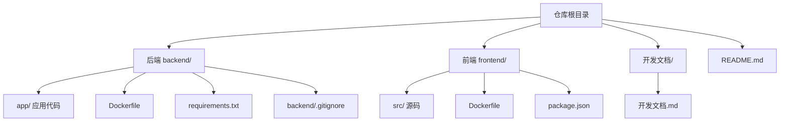
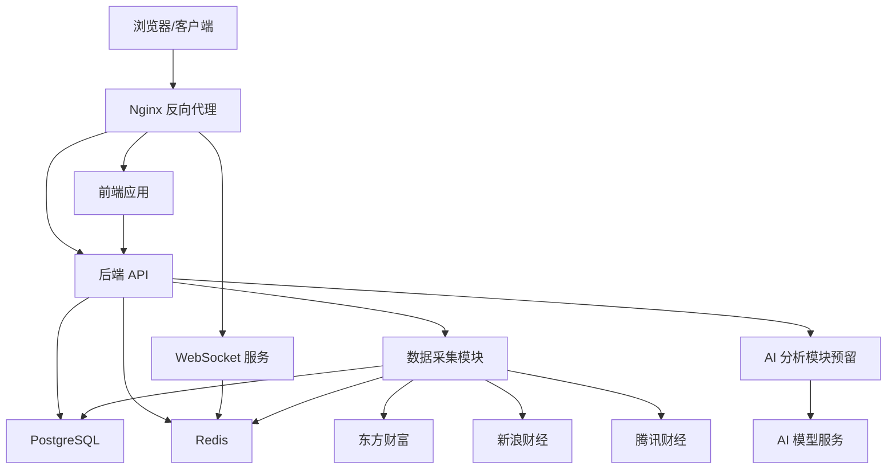
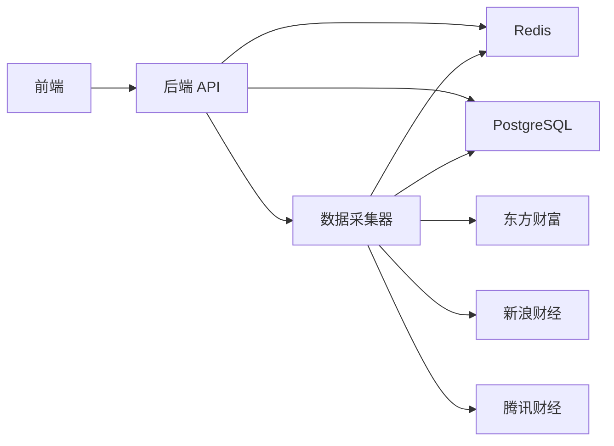

# 版本控制与协作规范

<cite>
**本文引用的文件**
- [README.md](file://README.md)
- [开发文档.md](file://Stock-View 软件开发文档/开发文档.md)
- [backend/.gitignore](file://backend/.gitignore)
</cite>

## 目录
1. [引言](#引言)
2. [项目结构](#项目结构)
3. [核心组件](#核心组件)
4. [架构总览](#架构总览)
5. [详细组件分析](#详细组件分析)
6. [依赖分析](#依赖分析)
7. [性能考虑](#性能考虑)
8. [故障排查指南](#故障排查指南)
9. [结论](#结论)
10. [附录](#附录)

## 引言
本规范旨在为 Stock-View 项目建立统一的版本控制与协作流程，覆盖分支管理、提交规范、代码审查、版本标签与发布说明、冲突解决与常见问题处理，以及团队协作与沟通规范。规范内容基于仓库现有文档与结构进行提炼与落地，确保团队在不同阶段（MVP/V1/V2/V3）均能高效协同。

## 项目结构
Stock-View 采用前后端分离的多模块组织方式，包含后端 Python/FastAPI 服务、前端 Vue3 应用、容器化编排与部署配置。整体结构清晰，便于按功能域划分与独立演进。

**图表来源**
- [README.md:92-126](file://README.md#L92-L126)
- [开发文档.md:2280-2324](file://Stock-View 软件开发文档/开发文档.md#L2280-L2324)

**章节来源**
- [README.md:92-126](file://README.md#L92-L126)
- [开发文档.md:2280-2324](file://Stock-View 软件开发文档/开发文档.md#L2280-L2324)

## 核心组件
- 后端应用：FastAPI + SQLAlchemy + Celery + Redis + PostgreSQL，负责行情数据采集、实时推送、REST API 与 WebSocket。
- 前端应用：Vue3 + TypeScript + Pinia + ECharts + Element Plus，负责行情列表、K线/分时图、自选股与搜索。
- 部署与编排：Docker Compose + Nginx，提供反向代理、静态资源托管与服务编排。
- AI 分析模块：预留插件化适配层，支持 Mock/规则引擎/ML/LLM 渐进接入。

**章节来源**
- [README.md:11-18](file://README.md#L11-L18)
- [开发文档.md:137-197](file://Stock-View 软件开发文档/开发文档.md#L137-L197)
- [开发文档.md:597-793](file://Stock-View 软件开发文档/开发文档.md#L597-L793)

## 架构总览
下图展示了客户端、网关层、后端服务、数据层与外部数据源之间的交互关系，以及 AI 分析模块的预留位置。

**图表来源**
- [开发文档.md:139-197](file://Stock-View 软件开发文档/开发文档.md#L139-L197)
- [开发文档.md:201-212](file://Stock-View 软件开发文档/开发文档.md#L201-L212)

## 详细组件分析

### 分支管理策略
- 主分支保护
  - 仅允许通过 Pull Request 合并至主分支，禁止直接推送。
  - 主分支需启用保护规则：必需的线程检查、必需的审查批准、强制线程检查状态通过。
- 功能分支命名
  - 命名规范：feature/模块名/简短描述，例如 feature/ai-integration/analysis-interface。
  - 修复分支：fix/模块名/简短描述，例如 fix/quote-collector/data-source-fallback。
  - 发布分支：release/vX.Y.Z，例如 release/v1.2.3。
- 发布分支管理
  - 从 develop 或主分支切出，仅用于发布准备与最小化修复。
  - 合并回主分支与 develop，并打上对应语义化版本标签。
- 预发/热修复
  - hotfix/模块名/简短描述，修复生产问题后合并至主分支与 develop。

**章节来源**
- [开发文档.md:137-197](file://Stock-View 软件开发文档/开发文档.md#L137-L197)

### 提交规范
- 提交信息格式
  - type(scope): subject
  - body（可选）：详细说明变更动机、影响范围与迁移注意事项。
  - footer（可选）：关联 Issue/PR、破坏性变更说明、关闭问题等。
- type 分类
  - feat：新增功能
  - fix：缺陷修复
  - docs：文档更新
  - style：不影响逻辑的格式/空格/分号等调整
  - refactor：重构（既不修复 bug 也不增加功能）
  - perf：性能优化
  - test：新增或修改测试
  - build：影响构建系统或外部依赖的更改
  - ci：CI 相关
  - chore：日常维护任务
- scope 定义
  - 后端：core、api、models、schemas、services、tasks、ai、collector、websocket、db
  - 前端：components、pages、stores、router、api、composables、utils、styles
  - 部署：docker、nginx、compose
  - 文档：docs、readme
- 示例
  - feat(ai): 添加规则引擎适配器
  - fix(backend/api): 修正 WebSocket 认证头传递
  - docs(readme): 更新快速启动步骤
  - refactor(frontend/charts): 优化 K 线组件渲染

**章节来源**
- [开发文档.md:597-793](file://Stock-View 软件开发文档/开发文档.md#L597-L793)

### 代码审查流程
- Pull Request 模板
  - 标题：遵循提交规范的 type(scope): subject
  - 摘要：变更目的、影响范围、测试要点
  - 截图/演示视频（UI 变更时）
  - 依赖变更与迁移说明
  - 关联 Issue/PR
- 审查清单
  - 是否满足提交规范与分支策略
  - 是否通过 CI 检查（语法、单元测试、集成测试）
  - 是否存在破坏性变更且已标注
  - 是否更新了相关文档与 API 文档
  - 是否引入了新的依赖或安全风险
- 合并策略
  - 至少一名审查者批准
  - CI 通过、无未处理评论
  - 合并后清理功能分支

**章节来源**
- [开发文档.md:597-793](file://Stock-View 软件开发文档/开发文档.md#L597-L793)

### 版本标签与发布说明
- 语义化版本控制
  - MAJOR.MINOR.PATCH：破坏性变更、新增兼容功能、兼容性修复
- 标签管理
  - 仅在发布分支合并后创建标签，标签名与版本一致
- 发布说明生成
  - 基于 PR 标题与类型汇总变更日志
  - 区分新增功能、修复、改进与破坏性变更
  - 提供升级指引与已知问题

**章节来源**
- [开发文档.md:137-197](file://Stock-View 软件开发文档/开发文档.md#L137-L197)

### 冲突解决指南
- 常见冲突场景
  - 文件权限与忽略规则冲突：检查 .gitignore 与 backend/.gitignore 的一致性
  - 分支合并冲突：优先保留主分支约定，按模块拆分 PR 解决
- 处理步骤
  - rebase 或 merge 主分支最新变更
  - 逐一解决冲突文件，确保逻辑正确
  - 重新运行相关测试与本地验证
  - 更新 PR 描述与审查清单

**章节来源**
- [backend/.gitignore:1-9](file://backend/.gitignore#L1-L9)

### 团队协作与沟通规范
- 沟通渠道
  - Slack/GitHub Discussions：需求与设计讨论
  - GitHub Issues：缺陷与任务跟踪
- 里程碑与计划
  - MVP/V1/V2/V3 分阶段目标明确，定期回顾与调整
- 文档与知识沉淀
  - 开发文档持续更新，保持与实现一致
  - API 文档由框架自动生成，保持接口一致性

**章节来源**
- [开发文档.md:2074-2113](file://Stock-View 软件开发文档/开发文档.md#L2074-L2113)

## 依赖分析
- 语言与框架
  - 后端：Python 3.11+、FastAPI、SQLAlchemy 2.0、Celery、Redis、PostgreSQL
  - 前端：Vue 3、TypeScript、Pinia、ECharts、Element Plus、Vite
- 部署与运维
  - Docker + Docker Compose、Nginx、环境变量配置
- 数据流
  - 外部数据源（东方财富/新浪财经/腾讯财经）经采集器写入 Redis 与 PostgreSQL，并通过 WebSocket 推送至前端

**图表来源**
- [开发文档.md:201-212](file://Stock-View 软件开发文档/开发文档.md#L201-L212)

**章节来源**
- [README.md:11-18](file://README.md#L11-L18)
- [开发文档.md:137-197](file://Stock-View 软件开发文档/开发文档.md#L137-L197)

## 性能考虑
- 数据更新频率策略：交易时段内高频更新，非交易时段降低更新频率，避免资源浪费
- 缓存与队列：Redis 作为缓存与消息队列，减少数据库压力
- 异步任务：Celery + Redis 实现定时采集与后台任务处理
- 前端渲染：ECharts 优化图表渲染，按需加载与懒更新

**章节来源**
- [开发文档.md:434-527](file://Stock-View 软件开发文档/开发文档.md#L434-L527)

## 故障排查指南
- 启动与环境
  - Docker Compose 启动失败：检查端口占用、镜像构建日志与依赖服务状态
  - 环境变量错误：核对 .env.example 并确保 DATABASE_URL 与 REDIS_URL 正确
- 数据采集
  - 数据源不可用：检查网络、Referer 设置与备用源切换逻辑
  - Redis/PostgreSQL 连接失败：确认容器健康状态与凭据
- 前端联调
  - API 代理失败：检查 Nginx 配置与代理头设置
  - WebSocket 连接失败：确认路由与升级头配置

**章节来源**
- [README.md:22-88](file://README.md#L22-L88)
- [开发文档.md:1883-2070](file://Stock-View 软件开发文档/开发文档.md#L1883-L2070)

## 结论
通过统一的分支策略、提交规范、审查流程与版本标签管理，结合明确的冲突解决与沟通规范，Stock-View 项目可在多阶段演进中保持高质量交付与团队高效协作。建议在实践中持续回顾与优化，确保规范与实际工作流相匹配。

## 附录
- 快速启动与常用命令
  - Docker Compose 一键启动、本地开发模式、日志查看与服务重启
- 环境变量说明
  - DATABASE_URL、REDIS_URL、AI_ADAPTER、APP_ENV、APP_DEBUG、PRIMARY_DATA_SOURCE、FALLBACK_DATA_SOURCE

**章节来源**
- [README.md:22-163](file://README.md#L22-L163)