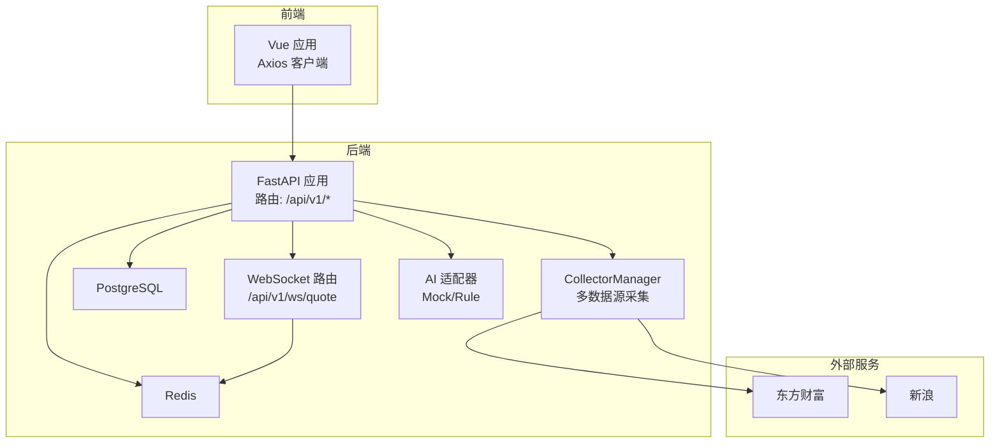
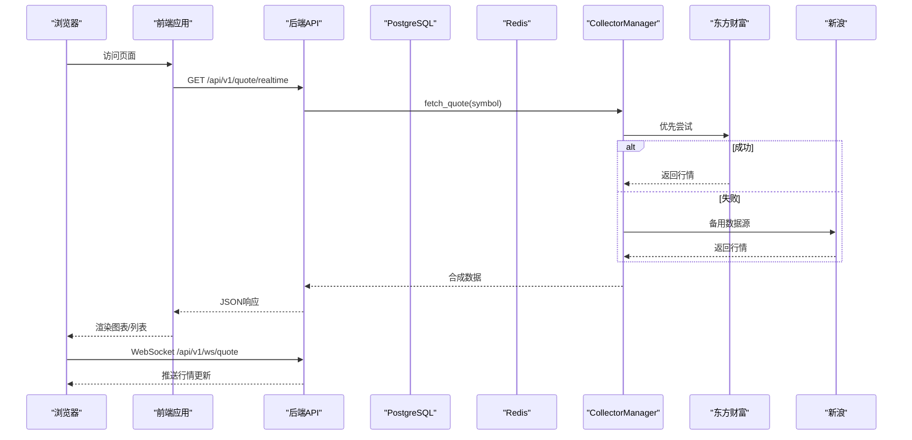
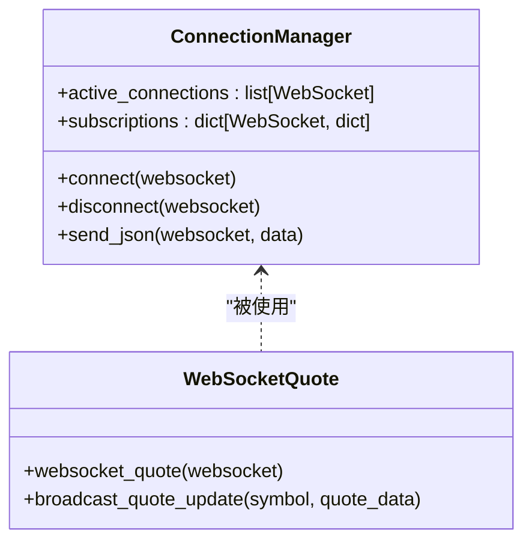
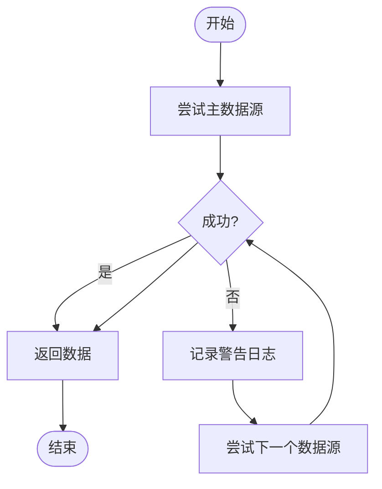
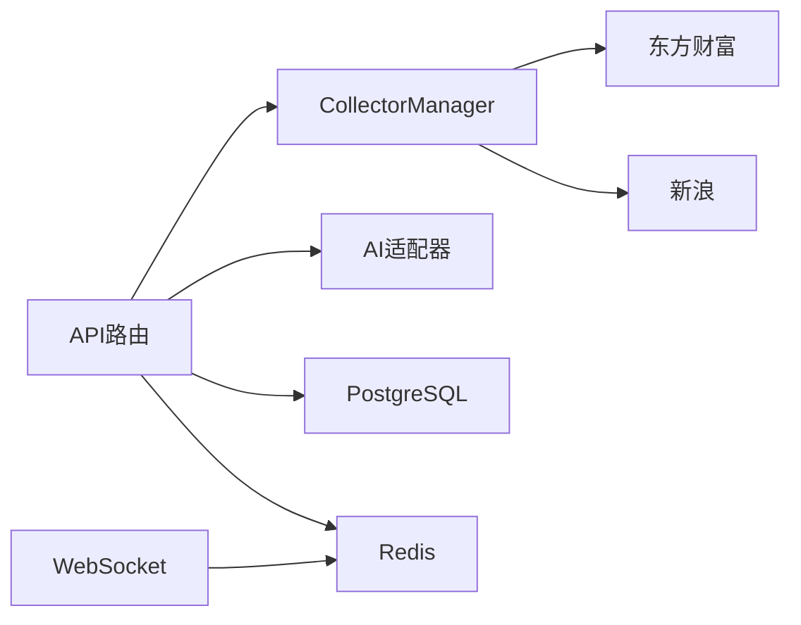

# 调试与问题排查

<cite>
**本文引用的文件**
- [README.md](file://README.md)
- [docker-compose.yml](file://docker-compose.yml)
- [backend/app/main.py](file://backend/app/main.py)
- [backend/app/core/config.py](file://backend/app/core/config.py)
- [backend/app/core/database.py](file://backend/app/core/database.py)
- [backend/app/core/redis.py](file://backend/app/core/redis.py)
- [backend/app/api/websocket.py](file://backend/app/api/websocket.py)
- [backend/app/api/v1/quote.py](file://backend/app/api/v1/quote.py)
- [backend/app/api/v1/stock.py](file://backend/app/api/v1/stock.py)
- [backend/app/api/v1/watchlist.py](file://backend/app/api/v1/watchlist.py)
- [backend/app/api/v1/ai.py](file://backend/app/api/v1/ai.py)
- [backend/app/ai/interface.py](file://backend/app/ai/interface.py)
- [backend/app/services/collector/manager.py](file://backend/app/services/collector/manager.py)
</cite>

## 目录
1. [简介](#简介)
2. [项目结构](#项目结构)
3. [核心组件](#核心组件)
4. [架构总览](#架构总览)
5. [详细组件分析](#详细组件分析)
6. [依赖分析](#依赖分析)
7. [性能考虑](#性能考虑)
8. [故障排查指南](#故障排查指南)
9. [结论](#结论)
10. [附录](#附录)

## 简介
本指南面向Stock-View项目的开发与运维人员，聚焦后端API、前端组件渲染、WebSocket连接、数据库与缓存、AI分析模块等常见问题的诊断与解决路径。内容涵盖调试工具使用、日志分析技巧、数据库问题排查、生产环境处理流程以及常见错误代码与解决方案汇总，帮助快速定位与恢复。

## 项目结构
- 后端采用FastAPI + SQLAlchemy 2.0异步ORM，提供REST API与WebSocket实时推送，并通过CollectorManager聚合多个数据源。
- 前端基于Vue 3 + TypeScript，使用Pinia状态管理与ECharts展示图表，通过Axios调用后端API。
- 部署使用Docker Compose，包含PostgreSQL与Redis服务，便于本地与生产环境一致化。

**图表来源**
- [backend/app/main.py:1-48](file://backend/app/main.py#L1-L48)
- [backend/app/api/websocket.py:1-79](file://backend/app/api/websocket.py#L1-L79)
- [backend/app/core/database.py:1-25](file://backend/app/core/database.py#L1-L25)
- [backend/app/core/redis.py:1-25](file://backend/app/core/redis.py#L1-L25)
- [backend/app/services/collector/manager.py:1-80](file://backend/app/services/collector/manager.py#L1-L80)
- [backend/app/ai/interface.py:1-196](file://backend/app/ai/interface.py#L1-L196)

**章节来源**
- [README.md:92-126](file://README.md#L92-L126)
- [docker-compose.yml:1-54](file://docker-compose.yml#L1-L54)

## 核心组件
- 应用入口与生命周期：注册路由、CORS中间件、数据库初始化与Redis关闭。
- 配置中心：集中管理数据库URL、Redis URL、AI适配器、数据源、缓存与限流参数。
- 数据层：异步SQLAlchemy引擎、会话工厂、基础模型类；连接池大小可调。
- 缓存层：统一Redis连接池，全局单例避免重复连接。
- API层：行情、股票、自选股、AI分析、WebSocket。
- 数据采集：CollectorManager按优先级轮询，异常时自动切换备用数据源。
- AI分析：Mock与规则引擎两种适配器，支持流式进度与结果。

**章节来源**
- [backend/app/main.py:1-48](file://backend/app/main.py#L1-L48)
- [backend/app/core/config.py:1-43](file://backend/app/core/config.py#L1-L43)
- [backend/app/core/database.py:1-25](file://backend/app/core/database.py#L1-L25)
- [backend/app/core/redis.py:1-25](file://backend/app/core/redis.py#L1-L25)
- [backend/app/api/v1/quote.py:1-65](file://backend/app/api/v1/quote.py#L1-L65)
- [backend/app/api/v1/stock.py:1-37](file://backend/app/api/v1/stock.py#L1-L37)
- [backend/app/api/v1/watchlist.py:1-77](file://backend/app/api/v1/watchlist.py#L1-L77)
- [backend/app/api/v1/ai.py:1-29](file://backend/app/api/v1/ai.py#L1-L29)
- [backend/app/api/websocket.py:1-79](file://backend/app/api/websocket.py#L1-L79)
- [backend/app/services/collector/manager.py:1-80](file://backend/app/services/collector/manager.py#L1-L80)
- [backend/app/ai/interface.py:1-196](file://backend/app/ai/interface.py#L1-L196)

## 架构总览
下图展示了从浏览器到后端、数据库与缓存的关键交互路径，以及AI分析与数据采集的扩展点。

**图表来源**
- [backend/app/api/v1/quote.py:1-65](file://backend/app/api/v1/quote.py#L1-L65)
- [backend/app/services/collector/manager.py:1-80](file://backend/app/services/collector/manager.py#L1-L80)
- [backend/app/api/websocket.py:1-79](file://backend/app/api/websocket.py#L1-L79)

## 详细组件分析

### 后端API路由与健康检查
- 路由前缀统一为/api/v1，包含行情、股票、自选股、AI分析与WebSocket。
- 提供健康检查端点用于容器编排与负载均衡探活。
- CORS允许任意来源，便于前端开发与跨域调试。

**章节来源**
- [backend/app/main.py:38-48](file://backend/app/main.py#L38-L48)
- [backend/app/api/v1/quote.py:1-65](file://backend/app/api/v1/quote.py#L1-L65)
- [backend/app/api/v1/stock.py:1-37](file://backend/app/api/v1/stock.py#L1-L37)
- [backend/app/api/v1/watchlist.py:1-77](file://backend/app/api/v1/watchlist.py#L1-L77)
- [backend/app/api/v1/ai.py:1-29](file://backend/app/api/v1/ai.py#L1-L29)

### WebSocket连接管理与广播
- ConnectionManager维护活动连接与订阅集合，支持订阅/退订与心跳。
- 广播函数根据订阅过滤目标客户端，异常断开自动清理。
- 适用于实时行情推送场景。

**图表来源**
- [backend/app/api/websocket.py:12-79](file://backend/app/api/websocket.py#L12-L79)

**章节来源**
- [backend/app/api/websocket.py:1-79](file://backend/app/api/websocket.py#L1-L79)

### 数据库与缓存
- 异步SQLAlchemy引擎启用echo以辅助调试，连接池大小与溢出可配置。
- Redis连接池全局单例，避免重复创建；关闭时释放资源。
- 数据模型基类统一，会话自动关闭，减少泄漏风险。

**章节来源**
- [backend/app/core/database.py:1-25](file://backend/app/core/database.py#L1-L25)
- [backend/app/core/redis.py:1-25](file://backend/app/core/redis.py#L1-L25)

### 数据采集与故障转移
- CollectorManager按优先级尝试主数据源，失败则切换备用数据源。
- 日志记录失败原因，便于定位第三方接口波动。

**图表来源**
- [backend/app/services/collector/manager.py:21-32](file://backend/app/services/collector/manager.py#L21-L32)

**章节来源**
- [backend/app/services/collector/manager.py:1-80](file://backend/app/services/collector/manager.py#L1-L80)

### AI分析适配器
- 支持Mock与规则引擎两种适配器，可通过环境变量切换。
- 提供流式分析进度与最终结果，利于前端展示。

**章节来源**
- [backend/app/api/v1/ai.py:1-29](file://backend/app/api/v1/ai.py#L1-L29)
- [backend/app/ai/interface.py:190-196](file://backend/app/ai/interface.py#L190-L196)

## 依赖分析
- 组件耦合：API层依赖CollectorManager与AI适配器；CollectorManager依赖具体采集器；WebSocket依赖Redis连接池。
- 外部依赖：PostgreSQL、Redis、第三方数据源（东方财富、新浪）。
- 配置集中：数据库URL、Redis URL、AI适配器、缓存TTL、速率限制等均来自配置中心。

**图表来源**
- [backend/app/main.py:1-48](file://backend/app/main.py#L1-L48)
- [backend/app/api/websocket.py:1-79](file://backend/app/api/websocket.py#L1-L79)
- [backend/app/services/collector/manager.py:1-80](file://backend/app/services/collector/manager.py#L1-L80)
- [backend/app/core/database.py:1-25](file://backend/app/core/database.py#L1-L25)
- [backend/app/core/redis.py:1-25](file://backend/app/core/redis.py#L1-L25)

**章节来源**
- [backend/app/core/config.py:1-43](file://backend/app/core/config.py#L1-L43)

## 性能考虑
- 连接池：数据库连接池大小与溢出需结合并发与QPS评估，避免连接耗尽。
- 缓存：Redis作为LRU策略，注意内存上限与键空间设计，避免淘汰导致命中率下降。
- API限流：AI请求限流与超时控制，防止上游抖动影响系统稳定性。
- 数据采集：批量请求与去重，避免对第三方接口造成压力。
- WebSocket：订阅粒度过细可能导致广播成本上升，建议按需聚合消息。

[本节为通用指导，无需列出章节来源]

## 故障排查指南

### 一、后端API错误
- 常见症状
  - 404/405：路由未注册或HTTP方法不匹配。
  - 500：数据库连接失败、会话未正确关闭、采集器异常。
  - 业务错误：如“数据源暂不可用”、“股票代码不存在”等。
- 诊断步骤
  - 检查路由注册与前缀是否正确。
  - 查看后端日志级别与输出，开启调试模式观察SQL与请求详情。
  - 校验数据库与Redis连通性与URL配置。
  - 验证CollectorManager可用数据源列表与网络可达性。
- 关联文件
  - [backend/app/main.py:38-48](file://backend/app/main.py#L38-L48)
  - [backend/app/api/v1/quote.py:31-33](file://backend/app/api/v1/quote.py#L31-L33)
  - [backend/app/api/v1/quote.py:44-47](file://backend/app/api/v1/quote.py#L44-L47)
  - [backend/app/api/v1/quote.py:54-56](file://backend/app/api/v1/quote.py#L54-L56)
  - [backend/app/services/collector/manager.py:28-32](file://backend/app/services/collector/manager.py#L28-L32)

**章节来源**
- [backend/app/api/v1/quote.py:1-65](file://backend/app/api/v1/quote.py#L1-L65)
- [backend/app/services/collector/manager.py:1-80](file://backend/app/services/collector/manager.py#L1-L80)

### 二、前端组件渲染问题
- 常见症状
  - 页面空白、组件不显示、图表不渲染。
  - 列表为空、搜索无结果、自选股无法增删改。
- 诊断步骤
  - 打开浏览器开发者工具，检查Network面板请求与响应。
  - 确认后端API可达与CORS配置，避免跨域阻断。
  - 检查状态管理（Pinia）数据流与派发逻辑。
  - 校验环境变量与API代理配置，确保请求转发至后端。
- 关联文件
  - [README.md:76-88](file://README.md#L76-L88)
  - [docker-compose.yml:42-50](file://docker-compose.yml#L42-L50)

**章节来源**
- [README.md:76-88](file://README.md#L76-L88)
- [docker-compose.yml:42-50](file://docker-compose.yml#L42-L50)

### 三、WebSocket连接问题
- 常见症状
  - 连接频繁断开、无法订阅、无实时推送。
- 诊断步骤
  - 使用浏览器开发者工具Network面板观察WebSocket握手与帧。
  - 检查后端WebSocket路由与ConnectionManager状态。
  - 校验Redis连接与心跳处理逻辑。
- 关联文件
  - [backend/app/api/websocket.py:12-79](file://backend/app/api/websocket.py#L12-L79)
  - [backend/app/core/redis.py:1-25](file://backend/app/core/redis.py#L1-L25)

**章节来源**
- [backend/app/api/websocket.py:1-79](file://backend/app/api/websocket.py#L1-L79)
- [backend/app/core/redis.py:1-25](file://backend/app/core/redis.py#L1-L25)

### 四、数据库问题排查
- 常见症状
  - 连接超时、连接池耗尽、查询缓慢。
- 诊断步骤
  - 启用SQL日志（调试模式），观察慢查询与高并发下的连接数。
  - 检查连接池参数（pool_size、max_overflow）与事务提交/回滚。
  - 分析PostgreSQL慢查询日志与索引使用情况。
- 关联文件
  - [backend/app/core/database.py:7-8](file://backend/app/core/database.py#L7-L8)
  - [backend/app/core/config.py:29-30](file://backend/app/core/config.py#L29-L30)

**章节来源**
- [backend/app/core/database.py:1-25](file://backend/app/core/database.py#L1-L25)
- [backend/app/core/config.py:1-43](file://backend/app/core/config.py#L1-L43)

### 五、缓存与Redis问题
- 常见症状
  - 缓存命中率低、内存占用过高、Key过期策略不当。
- 诊断步骤
  - 使用Redis命令查看内存使用与键空间分布。
  - 检查TTL设置与LRU淘汰策略，必要时调整maxmemory与policy。
  - 观察后端Redis连接池与异常断开。
- 关联文件
  - [docker-compose.yml:16-23](file://docker-compose.yml#L16-L23)
  - [backend/app/core/redis.py:1-25](file://backend/app/core/redis.py#L1-L25)
  - [backend/app/core/config.py:26-27](file://backend/app/core/config.py#L26-L27)

**章节来源**
- [docker-compose.yml:16-23](file://docker-compose.yml#L16-L23)
- [backend/app/core/redis.py:1-25](file://backend/app/core/redis.py#L1-L25)
- [backend/app/core/config.py:26-27](file://backend/app/core/config.py#L26-L27)

### 六、AI分析模块问题
- 常见症状
  - AI分析接口超时、返回空数据、适配器不可用。
- 诊断步骤
  - 切换AI适配器（mock/rule）验证接口可用性。
  - 检查AI请求超时与限流配置。
  - 观察适配器日志与流式进度输出。
- 关联文件
  - [backend/app/api/v1/ai.py:1-29](file://backend/app/api/v1/ai.py#L1-L29)
  - [backend/app/ai/interface.py:190-196](file://backend/app/ai/interface.py#L190-L196)
  - [backend/app/core/config.py:20-24](file://backend/app/core/config.py#L20-L24)

**章节来源**
- [backend/app/api/v1/ai.py:1-29](file://backend/app/api/v1/ai.py#L1-L29)
- [backend/app/ai/interface.py:190-196](file://backend/app/ai/interface.py#L190-L196)
- [backend/app/core/config.py:20-24](file://backend/app/core/config.py#L20-L24)

### 七、调试工具使用
- 浏览器开发者工具
  - Network：检查API请求/响应、WebSocket帧、CORS错误。
  - Console：查看前端错误堆栈与日志。
- Python调试器
  - 在FastAPI路由中设置断点，逐步执行SQL与采集器调用。
  - 使用uvicorn的调试参数与reload选项提升迭代效率。
- 网络抓包工具
  - 使用Wireshark或tcpdump捕获容器间通信，定位网络层面问题。
- 日志分析
  - 后端：开启调试模式与SQL echo，结合日志级别筛选。
  - 前端：在开发环境下打印请求/响应，生产环境使用错误追踪服务。

**章节来源**
- [README.md:54-88](file://README.md#L54-L88)
- [backend/app/core/database.py:7-8](file://backend/app/core/database.py#L7-L8)
- [backend/app/core/config.py:8-9](file://backend/app/core/config.py#L8-L9)

### 八、生产环境问题处理流程
- 错误监控
  - 集成日志聚合与告警（如Prometheus+Grafana或云监控）。
  - 对关键端点（API、WebSocket、数据库、Redis）设置SLA与阈值。
- 告警机制
  - 连接池耗尽、Redis内存告警、AI请求超时、WebSocket断连率。
- 快速恢复
  - 一键回滚与蓝绿发布；临时降级非关键功能；快速扩容Redis/数据库。
- 关联文件
  - [docker-compose.yml:25-50](file://docker-compose.yml#L25-L50)
  - [backend/app/main.py:13-19](file://backend/app/main.py#L13-L19)

**章节来源**
- [docker-compose.yml:25-50](file://docker-compose.yml#L25-L50)
- [backend/app/main.py:13-19](file://backend/app/main.py#L13-L19)

### 九、常见错误代码与解决方案
- 业务错误码
  - 1002：股票代码不存在或数据源暂不可用。检查输入与数据源可用性。
  - 1003：数据源暂不可用。切换备用数据源或等待恢复。
  - 1001：已在自选股中。前端提示去重后再操作。
- 建议处理
  - 对外统一返回结构，前端根据code与message友好提示。
  - 记录上下文参数（如symbol、请求时间）便于定位。

**章节来源**
- [backend/app/api/v1/quote.py:31-33](file://backend/app/api/v1/quote.py#L31-L33)
- [backend/app/api/v1/quote.py:44-47](file://backend/app/api/v1/quote.py#L44-L47)
- [backend/app/api/v1/quote.py:54-56](file://backend/app/api/v1/quote.py#L54-L56)
- [backend/app/api/v1/watchlist.py:38-40](file://backend/app/api/v1/watchlist.py#L38-L40)

## 结论
通过统一的配置中心、清晰的组件边界与完善的日志体系，Stock-View具备良好的可观测性与可维护性。建议在开发阶段开启调试模式与SQL日志，在生产阶段完善监控与告警，结合本文提供的诊断流程与工具，能够高效定位并解决问题。

## 附录
- 快速命令
  - 启动全部服务：docker compose up --build
  - 查看后端日志：docker compose logs -f backend
  - 重启后端：docker compose restart backend
- 环境变量
  - 数据库URL、Redis URL、AI适配器、APP_ENV、APP_DEBUG、数据源与缓存参数等。

**章节来源**
- [README.md:146-162](file://README.md#L146-L162)
- [backend/app/core/config.py:1-43](file://backend/app/core/config.py#L1-L43)
- [docker-compose.yml:29-34](file://docker-compose.yml#L29-L34)