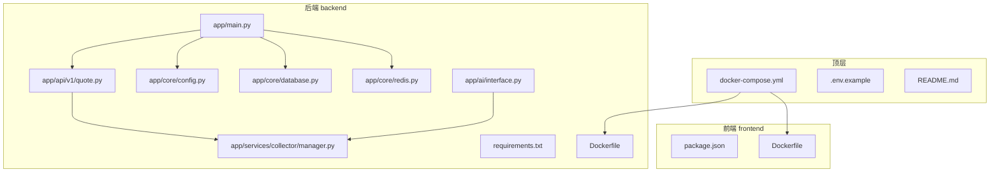
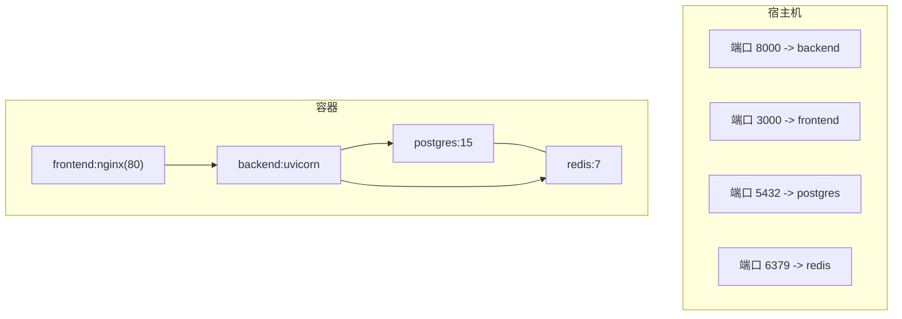
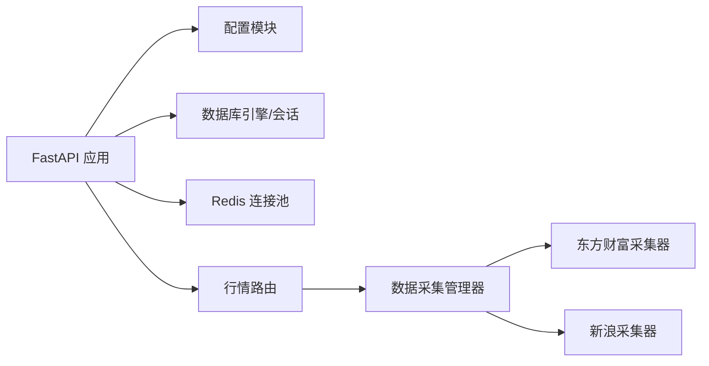

# 快速开始

<cite>
**本文引用的文件**
- [README.md](file://README.md)
- [docker-compose.yml](file://docker-compose.yml)
- [backend/Dockerfile](file://backend/Dockerfile)
- [backend/requirements.txt](file://backend/requirements.txt)
- [backend/app/main.py](file://backend/app/main.py)
- [backend/app/core/config.py](file://backend/app/core/config.py)
- [backend/app/core/database.py](file://backend/app/core/database.py)
- [backend/app/core/redis.py](file://backend/app/core/redis.py)
- [backend/app/api/v1/quote.py](file://backend/app/api/v1/quote.py)
- [backend/app/ai/interface.py](file://backend/app/ai/interface.py)
- [backend/app/services/collector/manager.py](file://backend/app/services/collector/manager.py)
</cite>

## 目录
1. [简介](#简介)
2. [项目结构](#项目结构)
3. [核心组件](#核心组件)
4. [架构总览](#架构总览)
5. [详细组件分析](#详细组件分析)
6. [依赖关系分析](#依赖关系分析)
7. [性能注意事项](#性能注意事项)
8. [故障排查指南](#故障排查指南)
9. [结论](#结论)
10. [附录](#附录)

## 简介
本指南面向首次接触 Stock-View 的开发者与运维人员，帮助你在最短时间内完成项目启动与验证。项目提供两种启动方式：
- Docker Compose 一键启动（推荐）
- 本地开发模式（前后端分别调试）

同时，文档将详细说明环境变量配置、启动验证步骤以及常见问题排查方法，确保你能在最短时间内成功运行项目。

## 项目结构
仓库采用前后端分离的多模块组织方式，核心目录与职责如下：
- backend：Python/FastAPI 后端，包含配置、数据库、Redis、API 路由、AI 插件与数据采集层
- frontend：Vue 3 前端工程（包含构建与开发脚本）
- 顶层：Docker Compose 编排文件、环境变量模板与项目说明

图表来源
- [docker-compose.yml:1-54](file://docker-compose.yml#L1-L54)
- [backend/Dockerfile:1-12](file://backend/Dockerfile#L1-L12)
- [backend/requirements.txt:1-17](file://backend/requirements.txt#L1-L17)
- [backend/app/main.py:1-48](file://backend/app/main.py#L1-L48)
- [backend/app/core/config.py:1-43](file://backend/app/core/config.py#L1-L43)
- [backend/app/core/database.py:1-25](file://backend/app/core/database.py#L1-L25)
- [backend/app/core/redis.py:1-25](file://backend/app/core/redis.py#L1-L25)
- [backend/app/api/v1/quote.py:1-65](file://backend/app/api/v1/quote.py#L1-L65)
- [backend/app/ai/interface.py:1-196](file://backend/app/ai/interface.py#L1-L196)
- [backend/app/services/collector/manager.py:1-80](file://backend/app/services/collector/manager.py#L1-L80)

章节来源
- [README.md:92-126](file://README.md#L92-L126)

## 核心组件
- 后端入口与生命周期：FastAPI 应用在启动时初始化数据库并在关闭时释放 Redis 连接池；注册了行情、股票、自选股与 AI 的路由，并开放健康检查端点。
- 配置系统：通过 pydantic-settings 从 .env 文件加载配置，支持数据库连接、Redis 连接、AI 适配器、Celery、JWT、数据采集间隔等参数。
- 数据库与缓存：使用 SQLAlchemy 2.0 异步引擎连接 PostgreSQL；Redis 使用 aioredis 连接池，用于缓存与消息队列。
- API 路由：提供实时行情、K 线、分时、盘口等接口，内部通过 CollectorManager 统一调度数据源（优先使用东方财富，失败则回退新浪）。
- AI 插件：提供 Mock 与规则引擎两种适配器，支持同步分析与流式分析，便于演示与本地开发。

章节来源
- [backend/app/main.py:1-48](file://backend/app/main.py#L1-L48)
- [backend/app/core/config.py:1-43](file://backend/app/core/config.py#L1-L43)
- [backend/app/core/database.py:1-25](file://backend/app/core/database.py#L1-L25)
- [backend/app/core/redis.py:1-25](file://backend/app/core/redis.py#L1-L25)
- [backend/app/api/v1/quote.py:1-65](file://backend/app/api/v1/quote.py#L1-L65)
- [backend/app/ai/interface.py:1-196](file://backend/app/ai/interface.py#L1-L196)
- [backend/app/services/collector/manager.py:1-80](file://backend/app/services/collector/manager.py#L1-L80)

## 架构总览
下图展示了 Docker Compose 编排的服务关系与端口映射，以及容器内服务的依赖顺序。

图表来源
- [docker-compose.yml:1-54](file://docker-compose.yml#L1-L54)

章节来源
- [docker-compose.yml:1-54](file://docker-compose.yml#L1-L54)

## 详细组件分析

### Docker Compose 一键启动（推荐）
- 适用场景：希望快速获得完整可用的开发/演示环境，避免本地环境差异导致的问题。
- 关键优势：
  - 统一依赖版本：PostgreSQL 15、Redis 7、Python 3.11、Nginx 等均在镜像中固定。
  - 一键编排：数据库、缓存、后端、前端按依赖顺序启动，自动挂载持久卷。
  - 端口隔离：前端默认 3000、后端 8000、数据库 5432、缓存 6379，互不冲突。
- 启动步骤：
  1) 克隆仓库并进入根目录
  2) 执行构建并启动：docker compose up --build
  3) 访问：
     - 前端页面：http://localhost:3000
     - 后端 API：http://localhost:8000
     - API 文档：http://localhost:8000/docs
- 注意事项：
  - 若需后台运行，可使用 docker compose up -d
  - 如需停止，执行 docker compose down
  - 日志查看与重启可使用常用命令集

章节来源
- [README.md:22-42](file://README.md#L22-L42)
- [docker-compose.yml:1-54](file://docker-compose.yml#L1-L54)

### 本地开发模式
- 适用场景：前后端需要独立调试、热更新频繁修改代码时。
- 步骤概览：
  1) 启动依赖服务（PostgreSQL + Redis）
     - docker compose up postgres redis
  2) 启动后端
     - 进入 backend 目录，创建并激活虚拟环境，安装依赖
     - 复制 .env.example 为 .env 并根据需要调整 DATABASE_URL、REDIS_URL 等
     - 启动开发服务器：uvicorn app.main:app --reload --host 0.0.0.0 --port 8000
  3) 启动前端
     - 进入 frontend 目录，安装依赖并启动开发服务器（含热更新）
     - Vite 将自动代理 API 请求至后端 8000 端口
- 优点：开发效率高，改动即时生效；缺点：需自行处理环境一致性与依赖版本。

章节来源
- [README.md:43-88](file://README.md#L43-L88)

### 环境变量配置说明
- 通用建议：在本地开发模式下，将 DATABASE_URL 与 REDIS_URL 指向 localhost；在 Docker Compose 模式下，使用服务名作为主机名（如 postgres、redis）。
- 关键参数：
  - DATABASE_URL：PostgreSQL 连接串（开发默认指向 localhost，Compose 默认指向 postgres 服务）
  - REDIS_URL：Redis 连接串（开发默认指向 localhost，Compose 默认指向 redis 服务）
  - AI_ADAPTER：AI 适配器选择（mock 或 rule），默认 mock
  - APP_ENV、APP_DEBUG：运行环境与调试开关
  - PRIMARY_DATA_SOURCE、FALLBACK_DATA_SOURCE：主备数据源（默认 eastmoney 为主，sina 为备）
  - 其他：AI_SERVICE_URL、AI_REQUEST_TIMEOUT、AI_CACHE_ENABLED/TTL、AI_RATE_LIMIT、JWT 参数、Celery Broker/Backend、行情采集间隔与缓存 TTL 等
- 参考路径：配置类定义与默认值位于配置模块；.env 示例位于根目录。

章节来源
- [backend/app/core/config.py:1-43](file://backend/app/core/config.py#L1-L43)
- [README.md:130-142](file://README.md#L130-L142)

### 启动后的验证步骤
- 健康检查：访问后端健康端点，确认返回状态正常
- API 文档：访问 /docs，确认路由注册正确
- 行情接口：调用实时行情、K 线、分时、盘口等接口，观察返回结构
- WebSocket：若使用 WebSocket 推送，可在前端控制台观察连接与消息
- 数据源连通性：若数据源不可用，接口会返回相应错误码与提示信息

章节来源
- [backend/app/main.py:46-48](file://backend/app/main.py#L46-L48)
- [backend/app/api/v1/quote.py:1-65](file://backend/app/api/v1/quote.py#L1-L65)

### 常见问题排查
- 无法访问后端 API
  - 检查后端容器是否启动成功、端口是否被占用
  - 在本地开发模式下，确认 uvicorn 已监听 0.0.0.0:8000
- 数据库连接失败
  - 确认 DATABASE_URL 指向正确主机与端口
  - 在 Docker Compose 模式下，数据库服务名应为 postgres；本地开发模式下应为 localhost
- Redis 连接失败
  - 确认 REDIS_URL 指向正确主机与端口
  - 在 Docker Compose 模式下，服务名为 redis；本地开发模式下为 localhost
- 数据源不可用
  - 接口返回“数据源暂不可用”或“股票代码不存在或数据源暂不可用”，属于预期行为
  - 可切换 PRIMARY_DATA_SOURCE 或 FALLBACK_DATA_SOURCE，或稍后再试
- AI 分析异常
  - 若 AI_ADAPTER 设置为 mock，将返回模拟结果；若设置为 rule，将基于规则引擎进行分析
  - 可调整 AI_REQUEST_TIMEOUT、AI_CACHE_ENABLED/TTL 等参数优化体验

章节来源
- [backend/app/api/v1/quote.py:28-33](file://backend/app/api/v1/quote.py#L28-L33)
- [backend/app/api/v1/quote.py:44-47](file://backend/app/api/v1/quote.py#L44-L47)
- [backend/app/api/v1/quote.py:53-56](file://backend/app/api/v1/quote.py#L53-L56)
- [backend/app/api/v1/quote.py:62-65](file://backend/app/api/v1/quote.py#L62-L65)
- [backend/app/ai/interface.py:190-196](file://backend/app/ai/interface.py#L190-L196)

## 依赖关系分析
- 后端依赖链：FastAPI 应用 → 配置模块 → 数据库引擎与会话 → Redis 连接池 → API 路由 → 数据采集管理器 → 具体数据源实现
- Docker Compose 依赖链：postgres 与 redis 服务先于 backend 启动，frontend 依赖 backend 提供的 API

图表来源
- [backend/app/main.py:1-48](file://backend/app/main.py#L1-L48)
- [backend/app/core/config.py:1-43](file://backend/app/core/config.py#L1-L43)
- [backend/app/core/database.py:1-25](file://backend/app/core/database.py#L1-L25)
- [backend/app/core/redis.py:1-25](file://backend/app/core/redis.py#L1-L25)
- [backend/app/api/v1/quote.py:1-65](file://backend/app/api/v1/quote.py#L1-L65)
- [backend/app/services/collector/manager.py:1-80](file://backend/app/services/collector/manager.py#L1-L80)

章节来源
- [backend/app/main.py:1-48](file://backend/app/main.py#L1-L48)
- [backend/app/services/collector/manager.py:1-80](file://backend/app/services/collector/manager.py#L1-L80)

## 性能注意事项
- 数据库连接池：异步引擎默认池大小与溢出配置已在代码中设定，可根据并发需求调整
- Redis 内存策略：Compose 中设置了最大内存与淘汰策略，避免缓存占用过高
- AI 分析缓存：可通过 AI_CACHE_ENABLED 与 AI_CACHE_TTL 控制缓存开关与过期时间
- 采集频率：QUOTE_COLLECT_INTERVAL 与 QUOTE_CACHE_TTL 影响行情刷新频率与缓存命中率

章节来源
- [backend/app/core/database.py:7-8](file://backend/app/core/database.py#L7-L8)
- [docker-compose.yml:18-18](file://docker-compose.yml#L18-L18)
- [backend/app/core/config.py:29-30](file://backend/app/core/config.py#L29-L30)
- [backend/app/core/config.py:22-23](file://backend/app/core/config.py#L22-L23)

## 故障排查指南
- 查看后端日志：docker compose logs -f backend
- 重启后端：docker compose restart backend
- 停止并清理：docker compose down
- 前端开发：进入 frontend 目录，使用 npm run dev 启动开发服务器
- 后端开发：进入 backend 目录，使用 uvicorn 启动开发服务器

章节来源
- [README.md:146-162](file://README.md#L146-L162)

## 结论
通过 Docker Compose 一键启动，你可以快速获得稳定一致的开发/演示环境；在需要高频迭代与独立调试时，本地开发模式提供了更高的灵活性。结合本文的环境变量配置、验证步骤与故障排查建议，你可以在最短时间内成功运行 Stock-View 并开展后续开发工作。

## 附录
- 常用命令速查
  - 构建并启动：docker compose up --build
  - 后台启动：docker compose up -d
  - 停止所有服务：docker compose down
  - 查看后端日志：docker compose logs -f backend
  - 重启后端：docker compose restart backend
  - 前端开发：cd frontend && npm run dev
  - 前端生产构建：cd frontend && npm run build
  - 后端开发：cd backend && uvicorn app.main:app --reload

章节来源
- [README.md:146-162](file://README.md#L146-L162)