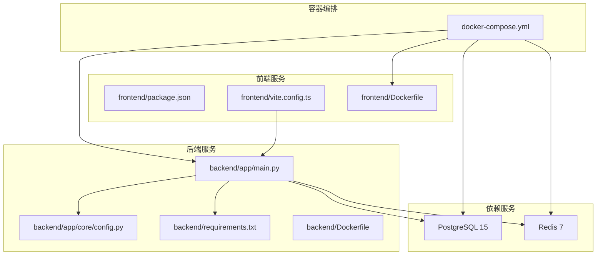
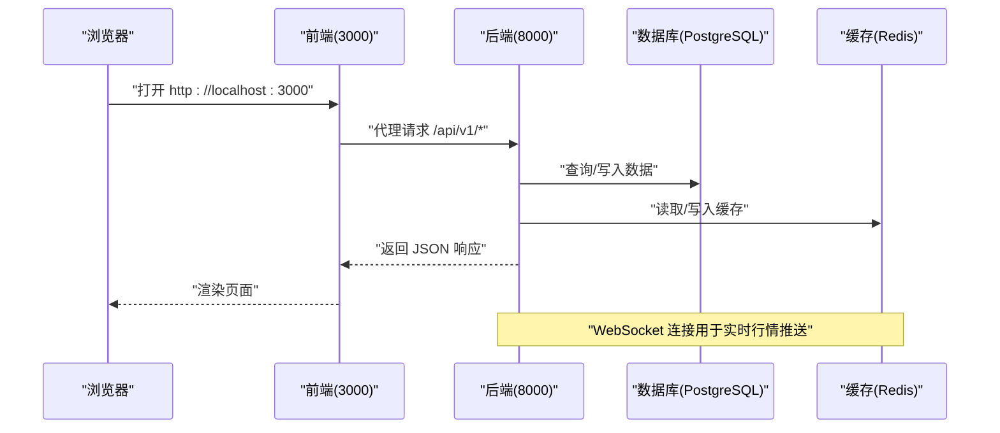
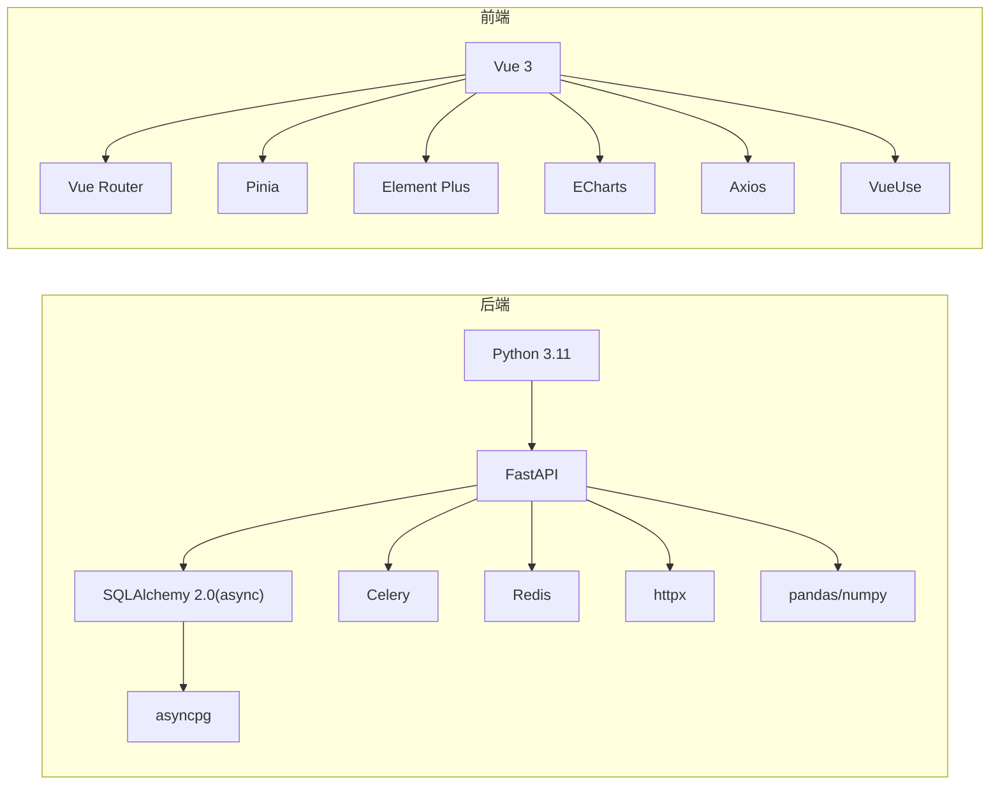

# 快速开始

<cite>
**本文引用的文件**
- [README.md](file://README.md)
- [docker-compose.yml](file://docker-compose.yml)
- [backend/Dockerfile](file://backend/Dockerfile)
- [frontend/Dockerfile](file://frontend/Dockerfile)
- [backend/app/main.py](file://backend/app/main.py)
- [backend/app/core/config.py](file://backend/app/core/config.py)
- [.env.example](file://.env.example)
- [backend/requirements.txt](file://backend/requirements.txt)
- [frontend/package.json](file://frontend/package.json)
- [frontend/vite.config.ts](file://frontend/vite.config.ts)
- [backend/app/api/v1/quote.py](file://backend/app/api/v1/quote.py)
- [backend/app/api/websocket.py](file://backend/app/api/websocket.py)
- [backend/app/ai/interface.py](file://backend/app/ai/interface.py)
</cite>

## 目录
1. [简介](#简介)
2. [项目结构](#项目结构)
3. [核心组件](#核心组件)
4. [架构总览](#架构总览)
5. [详细组件分析](#详细组件分析)
6. [依赖关系分析](#依赖关系分析)
7. [性能注意事项](#性能注意事项)
8. [故障排除指南](#故障排除指南)
9. [结论](#结论)
10. [附录](#附录)

## 简介
本指南面向首次接触 Stock-View 的开发者与测试用户，提供两种快速启动方式：
- Docker Compose 一键启动（推荐）
- 本地开发模式（前后端分别运行）

目标是在最短时间内完成环境准备、服务启动与功能验证，并给出常见问题的排查思路。

## 项目结构
仓库采用前后端分离的容器化架构，核心目录与职责如下：
- docker-compose.yml：统一编排 PostgreSQL、Redis、后端、前端服务
- backend：Python FastAPI 后端，包含路由、数据库、Redis、AI 适配器等
- frontend：Vue 3 + TypeScript 前端，使用 Vite 开发与构建
- README.md：包含技术栈、快速启动、环境变量与常用命令说明

图表来源
- [docker-compose.yml:1-54](file://docker-compose.yml#L1-L54)
- [backend/app/main.py:1-48](file://backend/app/main.py#L1-L48)
- [backend/app/core/config.py:1-43](file://backend/app/core/config.py#L1-L43)
- [backend/requirements.txt:1-17](file://backend/requirements.txt#L1-L17)
- [frontend/package.json:1-27](file://frontend/package.json#L1-L27)
- [frontend/vite.config.ts:1-21](file://frontend/vite.config.ts#L1-L21)
- [backend/Dockerfile:1-12](file://backend/Dockerfile#L1-L12)
- [frontend/Dockerfile:1-11](file://frontend/Dockerfile#L1-L11)

章节来源
- [README.md:92-126](file://README.md#L92-L126)

## 核心组件
- 后端入口与生命周期
  - FastAPI 应用在入口文件中初始化，注册 CORS、路由与生命周期钩子，负责数据库初始化与 Redis 清理。
- 配置系统
  - 使用 pydantic-settings 从 .env 读取配置，包含数据库、Redis、AI、JWT、行情采集等参数。
- 前端开发体验
  - Vite 提供热更新与代理，开发服务器默认端口与代理规则已在配置中定义。
- 依赖服务
  - PostgreSQL 与 Redis 通过 Docker Compose 统一管理，提供持久化卷与资源限制。

章节来源
- [backend/app/main.py:1-48](file://backend/app/main.py#L1-L48)
- [backend/app/core/config.py:1-43](file://backend/app/core/config.py#L1-L43)
- [frontend/vite.config.ts:1-21](file://frontend/vite.config.ts#L1-L21)

## 架构总览
下图展示了 Docker Compose 启动后的典型交互路径：浏览器访问前端页面，前端通过代理转发到后端 API；后端连接数据库与 Redis，部分数据通过采集器从第三方数据源拉取；WebSocket 实时推送行情更新。

图表来源
- [docker-compose.yml:1-54](file://docker-compose.yml#L1-L54)
- [frontend/vite.config.ts:12-20](file://frontend/vite.config.ts#L12-L20)
- [backend/app/main.py:38-43](file://backend/app/main.py#L38-L43)

## 详细组件分析

### Docker Compose 一键启动（推荐）
- 前提条件
  - 已安装 Docker 与 Docker Compose
- 启动步骤
  - 克隆仓库并进入目录
  - 执行构建与启动命令
- 访问地址
  - 前端页面：http://localhost:3000
  - 后端 API：http://localhost:8000
  - API 文档：http://localhost:8000/docs

章节来源
- [README.md:22-42](file://README.md#L22-L42)
- [docker-compose.yml:1-54](file://docker-compose.yml#L1-L54)

### 本地开发模式
- 启动依赖服务（PostgreSQL + Redis）
  - 仅启动数据库与缓存服务，便于前后端独立调试
- 启动后端
  - 进入 backend 目录，创建虚拟环境并安装依赖
  - 复制并编辑 .env 文件，确保数据库与 Redis 地址指向本地
  - 启动开发服务器
- 启动前端
  - 进入 frontend 目录，安装依赖并启动开发服务器
  - Vite 代理将 /api 前缀请求转发至后端 8000 端口

章节来源
- [README.md:43-88](file://README.md#L43-L88)
- [docker-compose.yml:4-23](file://docker-compose.yml#L4-L23)
- [backend/requirements.txt:1-17](file://backend/requirements.txt#L1-L17)
- [.env.example:1-33](file://.env.example#L1-L33)

### 环境变量配置说明
- 应用与安全
  - APP_ENV、APP_DEBUG、APP_SECRET_KEY
- 数据库与缓存
  - DATABASE_URL、REDIS_URL
- 数据源与 AI
  - PRIMARY_DATA_SOURCE、FALLBACK_DATA_SOURCE、AI_ADAPTER、AI_SERVICE_URL
- Celery 与行情采集
  - CELERY_BROKER_URL、CELERY_RESULT_BACKEND、QUOTE_COLLECT_INTERVAL、QUOTE_CACHE_TTL
- JWT
  - JWT_SECRET_KEY、JWT_ALGORITHM、JWT_EXPIRE_MINUTES

章节来源
- [.env.example:1-33](file://.env.example#L1-L33)
- [backend/app/core/config.py:1-43](file://backend/app/core/config.py#L1-L43)

### 常用命令集合
- Docker 相关
  - 构建并启动、后台启动、停止、查看日志、重启后端
- 前端开发
  - 启动开发服务器、生产构建
- 后端开发
  - 启动开发服务器（FastAPI/Uvicorn）

章节来源
- [README.md:146-162](file://README.md#L146-L162)

### API 与实时行情概览
- API 基础信息
  - 基础路径：/api/v1
  - 通用响应格式与错误码定义见开发文档
- 行情接口示例
  - 实时行情、行情列表、K线、分时、盘口等接口
- WebSocket
  - 提供行情订阅与心跳机制，支持多连接与断线处理

章节来源
- [backend/app/api/v1/quote.py:1-65](file://backend/app/api/v1/quote.py#L1-L65)
- [backend/app/api/websocket.py:1-79](file://backend/app/api/websocket.py#L1-L79)

### AI 模块与适配器
- 抽象接口与适配器
  - AIInterface 定义统一分析能力
  - MockAIAdapter 与 RuleEngineAdapter 提供模拟与规则引擎分析
- 适配器选择
  - 通过环境变量控制适配器类型，支持无缝切换

章节来源
- [backend/app/ai/interface.py:1-196](file://backend/app/ai/interface.py#L1-L196)

## 依赖关系分析
- 后端依赖
  - FastAPI、Uvicorn、SQLAlchemy 2.0(async)、异步 PostgreSQL 驱动、Celery、Redis、HTTP 客户端、Pydantic、JWT、TA/Lib、Pandas/Numpy 等
- 前端依赖
  - Vue 3、Vue Router、Pinia、Element Plus、ECharts、Axios、VueUse 等
- 容器镜像
  - 后端基于 Python 3.11 slim，前端基于 Node 18 Alpine 并使用 Nginx 发布

图表来源
- [backend/requirements.txt:1-17](file://backend/requirements.txt#L1-L17)
- [frontend/package.json:11-25](file://frontend/package.json#L11-L25)

章节来源
- [backend/requirements.txt:1-17](file://backend/requirements.txt#L1-L17)
- [frontend/package.json:1-27](file://frontend/package.json#L1-L27)

## 性能注意事项
- Redis 内存策略
  - Compose 中为 Redis 设置了最大内存与淘汰策略，避免内存无限增长
- 行情采集与缓存
  - 后端配置包含采集间隔与缓存 TTL，建议结合实际业务调整
- 前端代理与开发体验
  - Vite 代理将 API 请求转发至后端，减少跨域与部署成本

章节来源
- [docker-compose.yml:16-23](file://docker-compose.yml#L16-L23)
- [backend/app/core/config.py:25-31](file://backend/app/core/config.py#L25-L31)
- [frontend/vite.config.ts:12-20](file://frontend/vite.config.ts#L12-L20)

## 故障排除指南
- 无法访问前端页面
  - 确认前端容器已构建并映射到 3000 端口；若使用本地模式，检查 Vite 是否在 3000 端口运行
- 无法访问后端 API 或文档
  - 确认后端容器已构建并映射到 8000 端口；本地模式下检查 Uvicorn 是否在 8000 端口监听
- 数据库连接失败
  - 检查 DATABASE_URL 是否正确；Docker 模式下使用服务名，本地模式下使用 localhost
- Redis 连接失败
  - 检查 REDIS_URL；Docker 模式下使用服务名，本地模式下使用 localhost
- 数据源请求异常
  - 第三方数据源可能不稳定，后端实现包含重试逻辑；可适当增加重试次数或切换备用数据源
- WebSocket 无法接收实时行情
  - 检查 WebSocket 连接是否建立，确认订阅动作与符号列表正确

章节来源
- [docker-compose.yml:25-50](file://docker-compose.yml#L25-L50)
- [backend/app/core/config.py:12-14](file://backend/app/core/config.py#L12-L14)
- [.env.example:6-10](file://.env.example#L6-L10)
- [backend/app/services/collector/eastmoney.py:41-67](file://backend/app/services/collector/eastmoney.py#L41-L67)
- [backend/app/api/websocket.py:39-65](file://backend/app/api/websocket.py#L39-L65)

## 结论
通过 Docker Compose 一键启动，您可以快速获得完整的开发与演示环境；如需前后端独立调试，可按本地开发模式逐步启动依赖服务、后端与前端。遇到问题时，优先核对环境变量、端口映射与容器健康状态，并参考本指南的故障排除章节进行定位。

## 附录

### 访问地址与端口对照
- 前端页面：http://localhost:3000
- 后端 API：http://localhost:8000
- API 文档：http://localhost:8000/docs

章节来源
- [README.md:37-41](file://README.md#L37-L41)