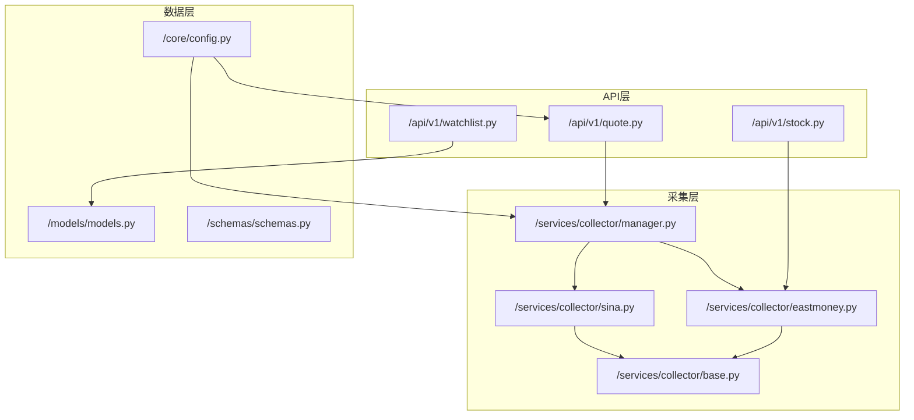
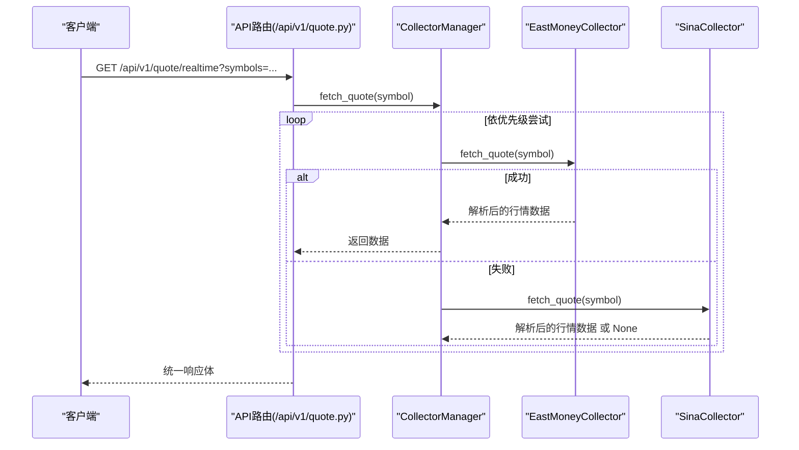
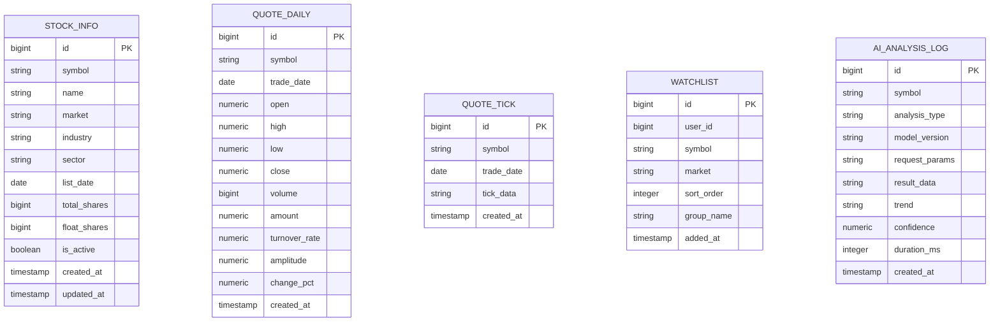
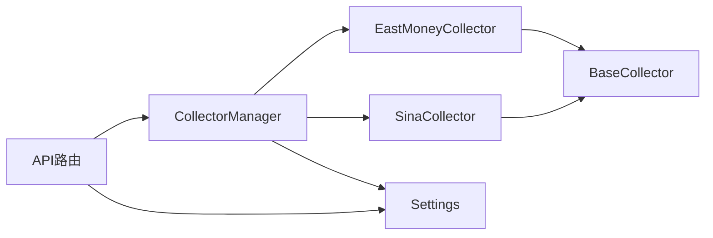

# 数据服务

<cite>
**本文引用的文件**
- [backend/app/services/collector/base.py](file://backend/app/services/collector/base.py)
- [backend/app/services/collector/eastmoney.py](file://backend/app/services/collector/eastmoney.py)
- [backend/app/services/collector/sina.py](file://backend/app/services/collector/sina.py)
- [backend/app/services/collector/manager.py](file://backend/app/services/collector/manager.py)
- [backend/app/models/models.py](file://backend/app/models/models.py)
- [backend/app/schemas/schemas.py](file://backend/app/schemas/schemas.py)
- [backend/app/core/config.py](file://backend/app/core/config.py)
- [backend/app/api/v1/quote.py](file://backend/app/api/v1/quote.py)
- [backend/app/api/v1/stock.py](file://backend/app/api/v1/stock.py)
- [backend/app/api/v1/watchlist.py](file://backend/app/api/v1/watchlist.py)
- [backend/app/main.py](file://backend/app/main.py)
- [README.md](file://README.md)
</cite>

## 目录
1. [简介](#简介)
2. [项目结构](#项目结构)
3. [核心组件](#核心组件)
4. [架构总览](#架构总览)
5. [详细组件分析](#详细组件分析)
6. [依赖分析](#依赖分析)
7. [性能考量](#性能考量)
8. [故障排查指南](#故障排查指南)
9. [结论](#结论)
10. [附录](#附录)

## 简介
本文件面向Stock-View数据服务，系统性梳理数据采集子系统的设计与实现，重点覆盖：
- 多数据源容灾机制与调度策略
- 数据采集器实现原理（BaseCollector基类、东方财富与新浪财经实现、CollectorManager调度）
- 数据模型设计（股票信息、行情数据、自选股、AI分析日志）
- 数据验证与转换（Pydantic模型、格式标准化、异常处理）
- 配置项与使用方法，帮助开发者理解与扩展数据相关功能

## 项目结构
后端采用FastAPI + SQLAlchemy异步ORM + Redis缓存的架构，数据服务位于services/collector目录，API层位于api/v1，数据模型位于models，数据校验位于schemas，全局配置位于core。

图表来源
- [backend/app/api/v1/quote.py:1-65](file://backend/app/api/v1/quote.py#L1-L65)
- [backend/app/api/v1/stock.py:1-37](file://backend/app/api/v1/stock.py#L1-L37)
- [backend/app/api/v1/watchlist.py:1-77](file://backend/app/api/v1/watchlist.py#L1-L77)
- [backend/app/services/collector/manager.py:1-80](file://backend/app/services/collector/manager.py#L1-L80)
- [backend/app/services/collector/base.py:1-45](file://backend/app/services/collector/base.py#L1-L45)
- [backend/app/services/collector/eastmoney.py:1-240](file://backend/app/services/collector/eastmoney.py#L1-L240)
- [backend/app/services/collector/sina.py:1-79](file://backend/app/services/collector/sina.py#L1-L79)
- [backend/app/models/models.py:1-74](file://backend/app/models/models.py#L1-L74)
- [backend/app/schemas/schemas.py:1-103](file://backend/app/schemas/schemas.py#L1-L103)
- [backend/app/core/config.py:1-43](file://backend/app/core/config.py#L1-L43)

章节来源
- [backend/app/main.py:1-48](file://backend/app/main.py#L1-L48)
- [README.md:92-126](file://README.md#L92-L126)

## 核心组件
- BaseCollector：定义统一的数据采集接口（实时行情、行情列表、K线、分时、盘口），并提供通用工具方法（如生成东方财富secid、市场前缀）。
- EastMoneyCollector：实现东方财富数据源的采集逻辑，包含行情、K线、分时、盘口解析与字段映射。
- SinaCollector：实现新浪财经备用数据源，当前仅支持实时行情，其他接口为占位提示。
- CollectorManager：多数据源调度器，按优先级自动故障转移，封装统一调用入口。
- 数据模型：StockInfo、QuoteDaily、QuoteTick、Watchlist、AIAnalysisLog，支撑股票信息、日线行情、分时数据、自选股与AI分析日志存储。
- 数据校验：schemas中定义了响应体、行情、K线、分时、盘口、自选股请求/响应等Pydantic模型。
- 配置：Settings集中管理数据库、Redis、数据源、AI服务、Celery、缓存与定时等参数。

章节来源
- [backend/app/services/collector/base.py:5-45](file://backend/app/services/collector/base.py#L5-L45)
- [backend/app/services/collector/eastmoney.py:11-240](file://backend/app/services/collector/eastmoney.py#L11-L240)
- [backend/app/services/collector/sina.py:10-79](file://backend/app/services/collector/sina.py#L10-L79)
- [backend/app/services/collector/manager.py:12-80](file://backend/app/services/collector/manager.py#L12-L80)
- [backend/app/models/models.py:5-74](file://backend/app/models/models.py#L5-L74)
- [backend/app/schemas/schemas.py:6-103](file://backend/app/schemas/schemas.py#L6-L103)
- [backend/app/core/config.py:5-43](file://backend/app/core/config.py#L5-L43)

## 架构总览
数据服务整体流程：API层接收请求，通过CollectorManager进行数据采集，采集器从东方财富/新浪财经拉取原始数据并解析为统一格式，随后返回给API层；同时，部分数据可写入数据库模型以供持久化与查询。

图表来源
- [backend/app/api/v1/quote.py:7-16](file://backend/app/api/v1/quote.py#L7-L16)
- [backend/app/services/collector/manager.py:21-32](file://backend/app/services/collector/manager.py#L21-L32)
- [backend/app/services/collector/eastmoney.py:23-37](file://backend/app/services/collector/eastmoney.py#L23-L37)
- [backend/app/services/collector/sina.py:19-60](file://backend/app/services/collector/sina.py#L19-L60)

## 详细组件分析

### CollectorManager：多数据源调度与容灾
- 设计要点
  - 维护数据源字典与优先级顺序，按序尝试，遇错即切。
  - 对不同接口（实时、列表、K线、分时、盘口）分别封装，确保接口一致性。
  - 记录日志，便于问题定位与监控。
- 关键行为
  - 实时行情：按优先级依次调用，任一成功即返回。
  - 行情列表/K线/分时/盘口：当前仅使用东方财富实现，避免跨源字段差异导致的复杂性。
- 扩展建议
  - 可引入熔断、重试、超时控制与健康检查。
  - 可增加权重/成功率统计，动态调整优先级。

章节来源
- [backend/app/services/collector/manager.py:12-80](file://backend/app/services/collector/manager.py#L12-L80)

### BaseCollector：抽象基类与通用工具
- 接口职责
  - 定义fetch_quote、fetch_quote_list、fetch_kline、fetch_timeline、fetch_orderbook五个异步接口。
- 工具方法
  - _get_secid：将股票代码转为东方财富secid格式。
  - _get_market_prefix：根据代码前缀返回sh/sz市场前缀。
- 设计意义
  - 统一采集器契约，便于新增数据源时快速实现一致接口。

章节来源
- [backend/app/services/collector/base.py:5-45](file://backend/app/services/collector/base.py#L5-L45)

### EastMoneyCollector：东方财富数据源实现
- 实时行情
  - 使用东方财富REST接口，解析返回字段，映射为统一的行情模型。
  - 字段包含：名称、价格、涨跌额/百分比、开盘/最高/最低、昨收、成交量/金额、换手率、时间戳等。
- 行情列表
  - 支持按字段排序（涨跌幅、成交量、成交额、换手率）与市场筛选（全部/上交所/深交所）。
  - 返回分页数据，包含条目列表与总数。
- K线
  - 支持分钟/日/周/月周期与前/后/不复权，限制返回条数。
  - 解析K线数组，提取日期、OHLC、成交量/金额、涨跌幅等。
- 分时
  - 解析当日分时趋势，包含时间、价格、均价、成交量。
- 盘口
  - 解析买卖盘口各档位的报价与量。
- 错误处理
  - 捕获异常并记录告警日志，返回None以触发上层容灾。

章节来源
- [backend/app/services/collector/eastmoney.py:11-240](file://backend/app/services/collector/eastmoney.py#L11-L240)

### SinaCollector：新浪财经备用实现
- 当前能力
  - 仅实现实时行情，其他接口返回None并提示使用东方财富。
- 设计考虑
  - 作为降级路径，减少对主数据源的压力，同时保持接口可用性。

章节来源
- [backend/app/services/collector/sina.py:10-79](file://backend/app/services/collector/sina.py#L10-L79)

### 数据模型设计
- StockInfo：股票基本信息表，字段覆盖代码、名称、市场、行业、板块、上市日期、总股本、流通股本、状态与时点。
- QuoteDaily：日线行情表，字段覆盖交易日、OHLC、成交量/金额、换手率、振幅、涨跌幅等数值精度控制。
- QuoteTick：分时数据表，以JSON字符串存储当日分时明细，便于灵活扩展。
- Watchlist：自选股表，字段覆盖用户标识、股票代码、市场、排序、分组与添加时间。
- AIAnalysisLog：AI分析日志表，字段覆盖分析类型、模型版本、请求/结果、趋势、置信度、耗时与时间戳。

图表来源
- [backend/app/models/models.py:5-74](file://backend/app/models/models.py#L5-L74)

章节来源
- [backend/app/models/models.py:5-74](file://backend/app/models/models.py#L5-L74)

### 数据验证与转换
- Pydantic模型
  - ResponseBase：统一响应结构（code/message）。
  - QuoteItem/KlineItem/TimelinePoint/OrderBookLevel：具体数据模型，用于API响应与入库校验。
  - WatchlistAddRequest/WatchlistSortRequest：自选股操作请求模型。
  - AIAnalysisRequest/Response：AI分析请求/响应模型。
- 格式标准化
  - 采集器输出统一字段名与类型，API层通过Pydantic自动序列化为JSON。
  - 时间戳统一为ISO格式字符串，数值精度按模型定义保留。
- 异常处理
  - 采集器内部捕获网络/解析异常，返回None触发容灾。
  - API层对None返回特定错误码与消息，避免上游崩溃。

章节来源
- [backend/app/schemas/schemas.py:6-103](file://backend/app/schemas/schemas.py#L6-L103)
- [backend/app/services/collector/eastmoney.py:23-37](file://backend/app/services/collector/eastmoney.py#L23-L37)
- [backend/app/services/collector/sina.py:19-60](file://backend/app/services/collector/sina.py#L19-L60)
- [backend/app/api/v1/quote.py:28-33](file://backend/app/api/v1/quote.py#L28-L33)

### API与使用方法
- 行情接口
  - GET /api/v1/quote/realtime：批量实时行情，最多50个股票。
  - GET /api/v1/quote/list：行情列表，支持市场筛选、排序字段与方向、分页。
  - GET /api/v1/quote/kline：K线，支持周期与复权类型。
  - GET /api/v1/quote/timeline：分时。
  - GET /api/v1/quote/orderbook：盘口。
- 股票搜索
  - GET /api/v1/stock/search：基于东方财富建议接口的股票搜索。
- 自选股
  - GET /api/v1/watchlist：获取自选股列表。
  - POST /api/v1/watchlist：添加自选股。
  - DELETE /api/v1/watchlist/{symbol}：删除自选股。
  - PUT /api/v1/watchlist/sort：批量调整排序。
- 使用示例
  - 获取实时行情：GET /api/v1/quote/realtime?symbols=600036,000001
  - 获取K线：GET /api/v1/quote/kline?symbol=600036&period=d&fq_type=front&limit=120

章节来源
- [backend/app/api/v1/quote.py:7-65](file://backend/app/api/v1/quote.py#L7-L65)
- [backend/app/api/v1/stock.py:10-37](file://backend/app/api/v1/stock.py#L10-L37)
- [backend/app/api/v1/watchlist.py:13-77](file://backend/app/api/v1/watchlist.py#L13-L77)

## 依赖分析
- 组件耦合
  - API层仅依赖CollectorManager，降低对具体数据源的耦合。
  - CollectorManager聚合多个采集器，便于扩展新数据源。
  - 采集器继承BaseCollector，约束实现一致性。
- 外部依赖
  - httpx：异步HTTP客户端。
  - SQLAlchemy：异步ORM，支持PostgreSQL。
  - Redis：缓存与队列（Celery）。
- 配置依赖
  - Settings集中管理数据源、AI服务、缓存与定时等参数，便于部署与运维。

图表来源
- [backend/app/api/v1/quote.py:1-65](file://backend/app/api/v1/quote.py#L1-L65)
- [backend/app/services/collector/manager.py:1-80](file://backend/app/services/collector/manager.py#L1-L80)
- [backend/app/services/collector/base.py:1-45](file://backend/app/services/collector/base.py#L1-L45)
- [backend/app/core/config.py:1-43](file://backend/app/core/config.py#L1-L43)

章节来源
- [backend/app/core/config.py:5-43](file://backend/app/core/config.py#L5-L43)

## 性能考量
- 并发与超时
  - 采集器使用httpx.AsyncClient，具备异步并发能力；建议在CollectorManager中引入限流与超时控制，避免雪崩。
- 缓存策略
  - 配置中提供缓存TTL参数，可在API层或中间层引入Redis缓存热点数据，降低重复请求。
- 数据源选择
  - 优先使用东方财富，备用使用新浪财经，减少跨源字段差异带来的解析成本。
- 数值精度
  - 日线与分时数据模型对数值字段使用Numeric类型，确保精度与一致性。

## 故障排查指南
- 常见问题
  - 数据源不可用：CollectorManager会逐个尝试，若均失败则返回错误码与消息。
  - 股票代码不存在：K线/分时/盘口接口返回“股票代码不存在”相关错误。
  - 网络异常：采集器捕获异常并记录告警日志，返回None触发容灾。
- 定位步骤
  - 查看API层返回的错误码与message。
  - 检查CollectorManager日志，确认失败的数据源与原因。
  - 核对Settings中的数据源配置与网络连通性。
- 建议
  - 在CollectorManager中增加熔断与重试策略。
  - 对高频接口增加缓存与去抖。

章节来源
- [backend/app/api/v1/quote.py:28-33](file://backend/app/api/v1/quote.py#L28-L33)
- [backend/app/services/collector/manager.py:21-32](file://backend/app/services/collector/manager.py#L21-L32)
- [backend/app/services/collector/eastmoney.py:23-37](file://backend/app/services/collector/eastmoney.py#L23-L37)
- [backend/app/services/collector/sina.py:19-60](file://backend/app/services/collector/sina.py#L19-L60)

## 结论
该数据服务通过抽象基类与多数据源调度实现了高可用与可扩展性，采集器对东方财富与新浪财经进行了差异化实现，并以统一的Pydantic模型与数据库模型完成数据标准化与持久化。结合配置中心与API层，开发者可以快速扩展新的数据源、优化缓存与容灾策略，并在不破坏现有接口的前提下迭代功能。

## 附录

### 配置项说明
- 数据库与缓存
  - DATABASE_URL：PostgreSQL连接串
  - REDIS_URL：Redis连接串
- 数据源
  - PRIMARY_DATA_SOURCE：主数据源（默认eastmoney）
  - FALLBACK_DATA_SOURCE：备用数据源（默认sina）
- AI服务
  - AI_ADAPTER/AI_SERVICE_URL/AI_REQUEST_TIMEOUT/AI_CACHE_ENABLED/AI_CACHE_TTL/AI_RATE_LIMIT
- Celery
  - CELERY_BROKER_URL/CELERY_RESULT_BACKEND
- 行情采集
  - QUOTE_COLLECT_INTERVAL：采集间隔（秒）
  - QUOTE_CACHE_TTL：缓存TTL（分钟）

章节来源
- [backend/app/core/config.py:8-31](file://backend/app/core/config.py#L8-L31)
- [README.md:130-142](file://README.md#L130-L142)