# 数据模型设计

<cite>
**本文档引用的文件**
- [models.py](file://backend/app/models/models.py)
- [schemas.py](file://backend/app/schemas/schemas.py)
- [database.py](file://backend/app/core/database.py)
- [config.py](file://backend/app/core/config.py)
- [base.py](file://backend/app/services/collector/base.py)
- [eastmoney.py](file://backend/app/services/collector/eastmoney.py)
- [interface.py](file://backend/app/ai/interface.py)
- [stock.py](file://backend/app/api/v1/stock.py)
- [watchlist.py](file://backend/app/api/v1/watchlist.py)
- [ai.py](file://backend/app/api/v1/ai.py)
- [quote.py](file://backend/app/api/v1/quote.py)
- [main.py](file://backend/app/main.py)
</cite>

## 目录
1. [简介](#简介)
2. [项目结构](#项目结构)
3. [核心数据模型](#核心数据模型)
4. [架构概览](#架构概览)
5. [详细组件分析](#详细组件分析)
6. [依赖关系分析](#依赖关系分析)
7. [性能考虑](#性能考虑)
8. [故障排除指南](#故障排除指南)
9. [结论](#结论)

## 简介

Stock-View是一个基于Python FastAPI构建的A股实时行情查看与AI分析平台。本项目采用现代化的数据模型设计，通过SQLAlchemy ORM实现数据库持久化，通过Pydantic实现数据验证和序列化，为用户提供完整的股票数据服务。

本项目的核心数据模型包括：
- 股票信息模型(STOCK_INFO)
- 日线行情模型(QUOTE_DAILY)
- 分时行情模型(QUOTE_TICK)
- 自选股模型(WATCHLIST)
- AI分析日志模型(AI_ANALYSIS_LOG)

## 项目结构

项目采用分层架构设计，主要包含以下层次：

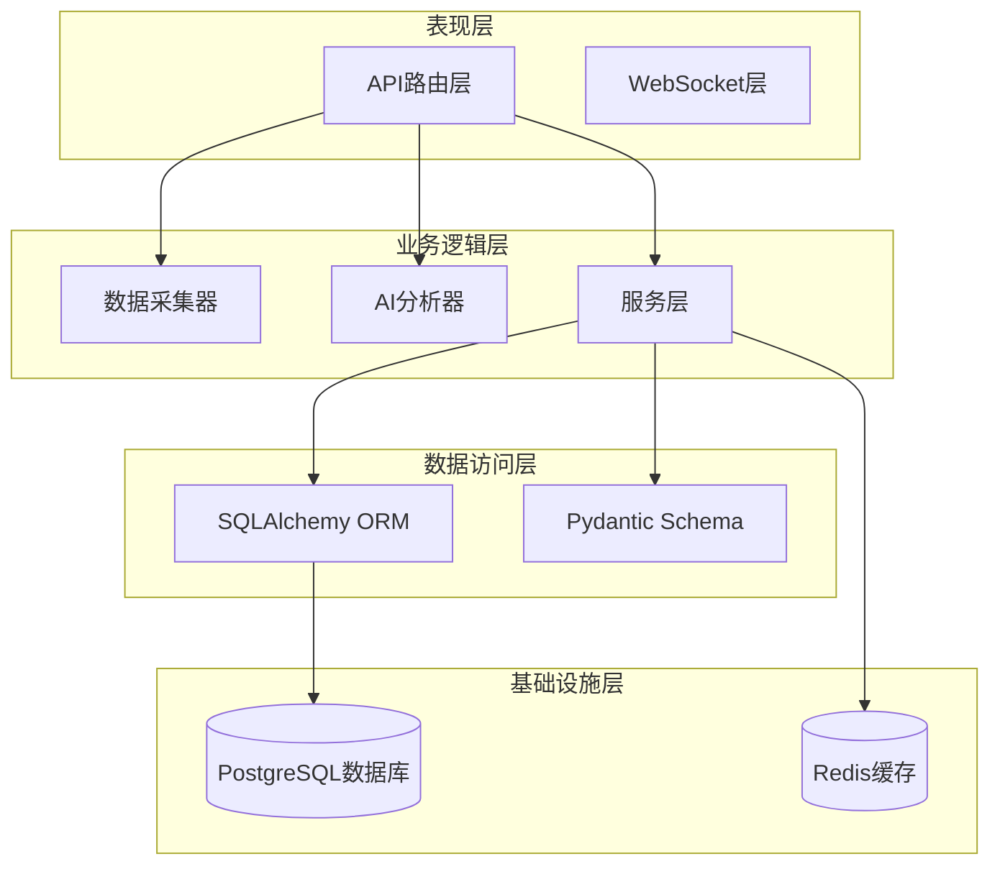

**图表来源**
- [main.py:13-48](file://backend/app/main.py#L13-L48)
- [database.py:1-25](file://backend/app/core/database.py#L1-L25)

**章节来源**
- [main.py:1-48](file://backend/app/main.py#L1-L48)
- [database.py:1-25](file://backend/app/core/database.py#L1-L25)

## 核心数据模型

### 股票信息模型(STOCK_INFO)

股票信息模型用于存储基础的股票元数据信息，是整个系统的核心实体之一。

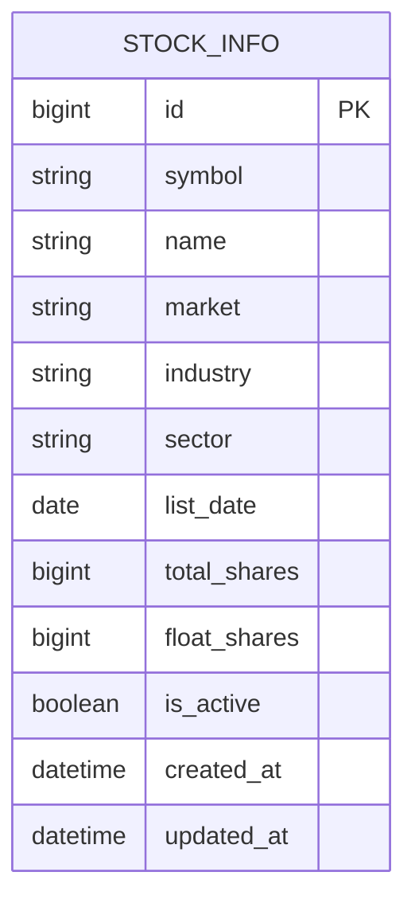

**图表来源**
- [models.py:5-19](file://backend/app/models/models.py#L5-L19)

#### 字段定义与约束

| 字段名 | 数据类型 | 约束条件 | 描述 |
|--------|----------|----------|------|
| id | BigInteger | 主键, 自增 | 股票信息唯一标识符 |
| symbol | String(10) | 非空 | 股票代码(6位数字) |
| name | String(20) | 非空 | 股票名称 |
| market | String(10) | 非空 | 市场类型(sh/sz) |
| industry | String(20) | 可空 | 所属行业 |
| sector | String(20) | 可空 | 所属板块 |
| list_date | Date | 可空 | 上市日期 |
| total_shares | BigInteger | 可空 | 总股本 |
| float_shares | BigInteger | 可空 | 流通股本 |
| is_active | Boolean | 默认True | 是否有效状态 |
| created_at | DateTime | 默认当前时间 | 创建时间 |
| updated_at | DateTime | 默认当前时间, 更新时自动更新 | 更新时间 |

#### 业务含义
- 存储股票的基础元数据信息
- 支持股票搜索和筛选功能
- 提供股票基本信息的查询接口

### 日线行情模型(QUOTE_DAILY)

日线行情模型用于存储股票的日级历史行情数据。

```mermaid
erDiagram
QUOTE_DAILY {
bigint id PK
string symbol
date trade_date
numeric(10,3) open
numeric(10,3) high
numeric(10,3) low
numeric(10,3) close
bigint volume
numeric(18,2) amount
numeric(8,4) turnover_rate
numeric(8,4) amplitude
numeric(8,4) change_pct
datetime created_at
}
```

**图表来源**
- [models.py:22-38](file://backend/app/models/models.py#L22-L38)

#### 字段定义与约束

| 字段名 | 数据类型 | 约束条件 | 描述 |
|--------|----------|----------|------|
| id | BigInteger | 主键, 自增 | 日线数据唯一标识符 |
| symbol | String(10) | 非空 | 股票代码 |
| trade_date | Date | 非空 | 交易日期 |
| open | Numeric(10,3) | 可空 | 开盘价 |
| high | Numeric(10,3) | 可空 | 最高价 |
| low | Numeric(10,3) | 可空 | 最低价 |
| close | Numeric(10,3) | 可空 | 收盘价 |
| volume | BigInteger | 可空 | 成交量 |
| amount | Numeric(18,2) | 可空 | 成交额 |
| turnover_rate | Numeric(8,4) | 可空 | 换手率 |
| amplitude | Numeric(8,4) | 可空 | 振幅 |
| change_pct | Numeric(8,4) | 可空 | 涨跌幅百分比 |
| created_at | DateTime | 默认当前时间 | 创建时间 |

#### 业务含义
- 存储股票的历史日线行情数据
- 支持K线图绘制和历史数据分析
- 提供技术指标计算所需的基础数据

### 分时行情模型(QUOTE_TICK)

分时行情模型用于存储股票的分时交易数据。

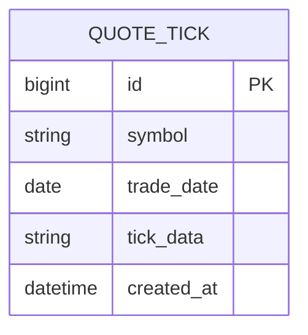

**图表来源**
- [models.py:40-47](file://backend/app/models/models.py#L40-L47)

#### 字段定义与约束

| 字段名 | 数据类型 | 约束条件 | 描述 |
|--------|----------|----------|------|
| id | BigInteger | 主键, 自增 | 分时数据唯一标识符 |
| symbol | String(10) | 非空 | 股票代码 |
| trade_date | Date | 非空 | 交易日期 |
| tick_data | String | 非空 | 分时数据(JSON字符串) |
| created_at | DateTime | 默认当前时间 | 创建时间 |

#### 业务含义
- 存储股票当日的分时交易明细
- 支持分时图绘制和实时行情展示
- 提供高频交易数据的存储能力

### 自选股模型(WATCHLIST)

自选股模型用于管理用户的自选股票列表。

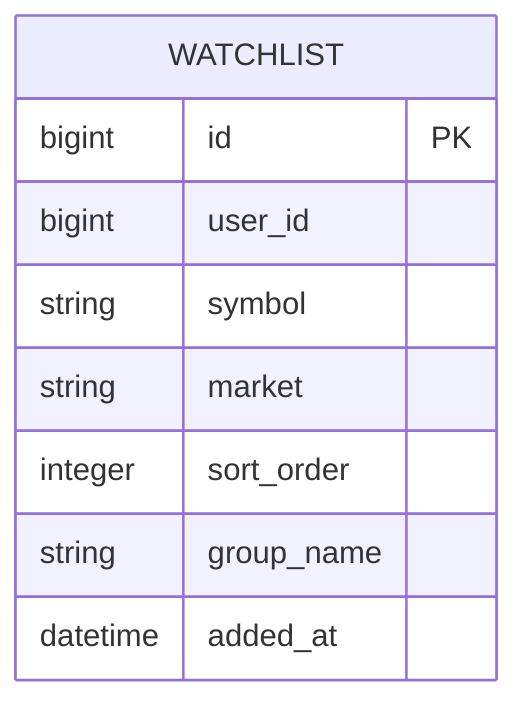

**图表来源**
- [models.py:50-59](file://backend/app/models/models.py#L50-L59)

#### 字段定义与约束

| 字段名 | 数据类型 | 约束条件 | 描述 |
|--------|----------|----------|------|
| id | BigInteger | 主键, 自增 | 自选股记录唯一标识符 |
| user_id | BigInteger | 非空, 默认1 | 用户标识符 |
| symbol | String(10) | 非空 | 股票代码 |
| market | String(10) | 非空 | 市场类型(sh/sz) |
| sort_order | Integer | 默认0 | 排序权重 |
| group_name | String(20) | 默认"default" | 分组名称 |
| added_at | DateTime | 默认当前时间 | 添加时间 |

#### 业务含义
- 管理用户关注的股票列表
- 支持自选股的增删改查操作
- 提供个性化股票监控功能

### AI分析日志模型(AI_ANALYSIS_LOG)

AI分析日志模型用于记录AI分析的历史记录。

```mermaid
erDiagram
AI_ANALYSIS_LOG {
bigint id PK
string symbol
string analysis_type
string model_version
string request_params
string result_data
string trend
numeric(4,2) confidence
integer duration_ms
datetime created_at
}
```

**图表来源**
- [models.py:62-74](file://backend/app/models/models.py#L62-L74)

#### 字段定义与约束

| 字段名 | 数据类型 | 约束条件 | 描述 |
|--------|----------|----------|------|
| id | BigInteger | 主键, 自增 | 分析记录唯一标识符 |
| symbol | String(10) | 非空 | 股票代码 |
| analysis_type | String(20) | 非空 | 分析类型 |
| model_version | String(20) | 非空 | 模型版本 |
| request_params | String | JSON格式 | 请求参数 |
| result_data | String | JSON格式 | 分析结果 |
| trend | String(10) | 可空 | 趋势方向 |
| confidence | Numeric(4,2) | 可空 | 置信度 |
| duration_ms | Integer | 可空 | 处理耗时(ms) |
| created_at | DateTime | 默认当前时间 | 创建时间 |

#### 业务含义
- 记录AI分析的历史操作
- 支持分析结果的查询和统计
- 提供AI分析服务的审计功能

## 架构概览

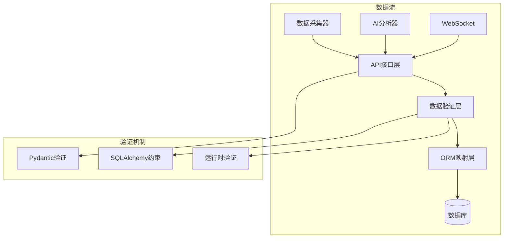

**图表来源**
- [schemas.py:1-103](file://backend/app/schemas/schemas.py#L1-L103)
- [models.py:1-74](file://backend/app/models/models.py#L1-L74)

## 详细组件分析

### Pydantic模型在数据验证中的作用

Pydantic作为数据验证和序列化的核心组件，在整个系统中发挥着重要作用：

#### 通用响应模型

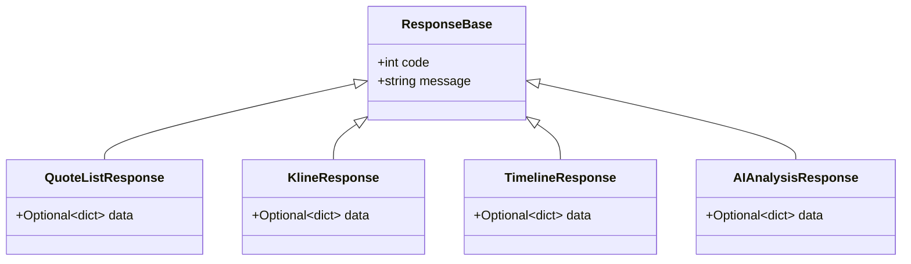

**图表来源**
- [schemas.py:7-47](file://backend/app/schemas/schemas.py#L7-L47)

#### 行情数据模型

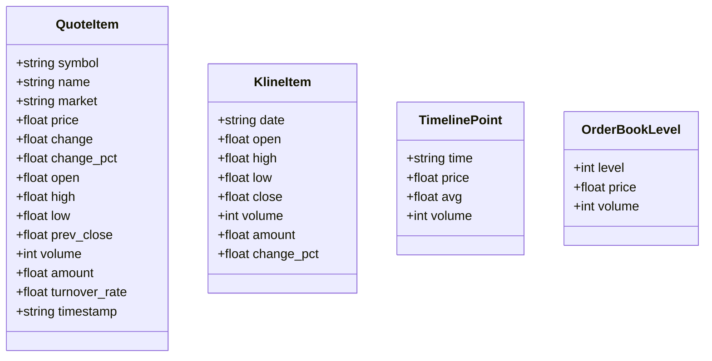

**图表来源**
- [schemas.py:13-68](file://backend/app/schemas/schemas.py#L13-L68)

#### 自选股和AI分析模型

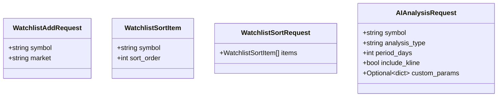

**图表来源**
- [schemas.py:79-103](file://backend/app/schemas/schemas.py#L79-L103)

### 数据验证规则实现

#### 类型转换和默认值设置

Pydantic模型提供了强大的类型转换和默认值设置功能：

| 模型字段 | 类型 | 默认值 | 验证规则 |
|----------|------|--------|----------|
| QuoteItem.turnover_rate | float | 0.0 | 数值范围验证 |
| QuoteItem.timestamp | str | "" | 字符串长度限制 |
| KlineItem.amount | float | 0.0 | 数值范围验证 |
| KlineItem.change_pct | float | 0.0 | 数值范围验证 |
| WatchlistAddRequest.market | str | "sh" | 枚举值验证 |
| AIAnalysisRequest.analysis_type | str | "comprehensive" | 枚举值验证 |
| AIAnalysisRequest.period_days | int | 30 | 数值范围验证(1-365) |
| AIAnalysisRequest.include_kline | bool | True | 布尔值验证 |

#### 字段验证规则

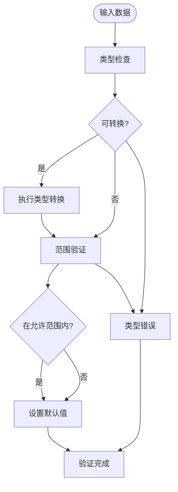

**图表来源**
- [schemas.py:13-103](file://backend/app/schemas/schemas.py#L13-L103)

### 数据模型关系图

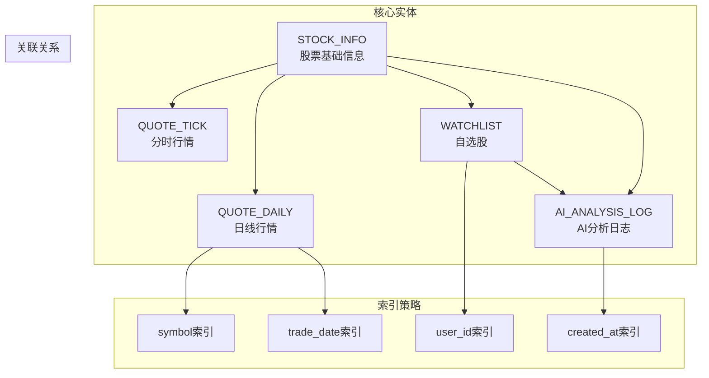

**图表来源**
- [models.py:1-74](file://backend/app/models/models.py#L1-L74)

## 依赖关系分析

### 数据库连接和会话管理

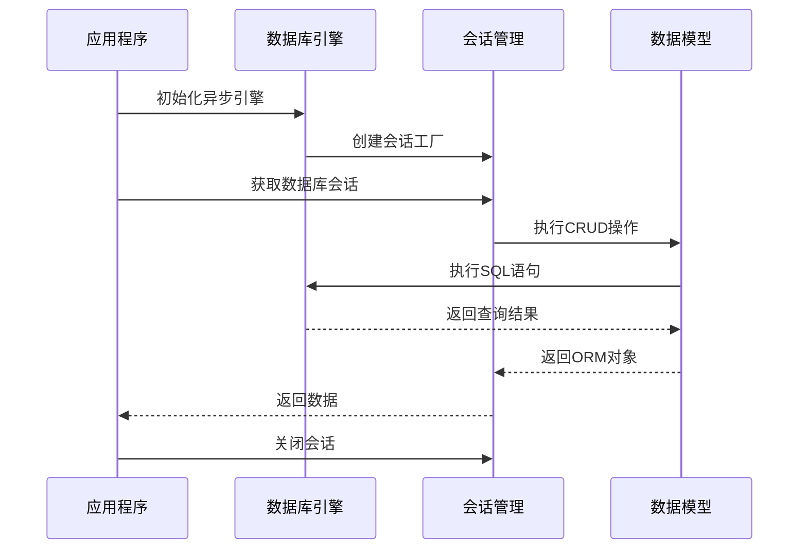

**图表来源**
- [database.py:15-25](file://backend/app/core/database.py#L15-L25)
- [main.py:13-27](file://backend/app/main.py#L13-L27)

### 配置管理

系统采用Pydantic Settings进行配置管理，支持环境变量和默认值：

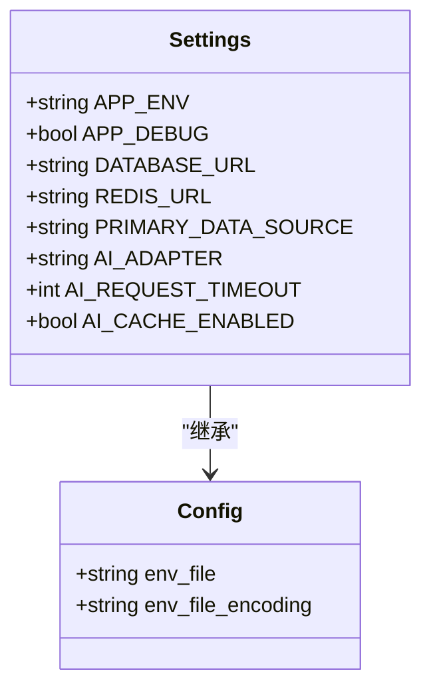

**图表来源**
- [config.py:5-43](file://backend/app/core/config.py#L5-L43)

**章节来源**
- [database.py:1-25](file://backend/app/core/database.py#L1-L25)
- [config.py:1-43](file://backend/app/core/config.py#L1-L43)

## 性能考虑

### 数据库优化策略

1. **索引设计**
   - 在常用查询字段上建立索引
   - 使用复合索引优化多条件查询
   - 定期分析查询计划优化索引

2. **连接池配置**
   - 异步连接池提高并发性能
   - 连接超时和重试机制
   - 连接池大小调优

3. **缓存策略**
   - Redis缓存热点数据
   - 缓存失效策略
   - 缓存一致性保证

### 数据验证性能

1. **Pydantic验证优化**
   - 使用严格模式减少类型转换开销
   - 批量验证减少重复验证成本
   - 自定义验证器避免复杂逻辑

2. **内存管理**
   - 流式处理大数据集
   - 及时释放临时对象
   - 内存使用监控

## 故障排除指南

### 常见问题及解决方案

#### 数据库连接问题

**症状**: 应用启动时数据库连接失败
**原因**: 数据库URL配置错误或网络问题
**解决方案**: 
1. 检查DATABASE_URL配置
2. 验证数据库服务状态
3. 确认网络连通性

#### 数据验证错误

**症状**: API请求返回验证错误
**原因**: 请求数据不符合Pydantic模型定义
**解决方案**:
1. 检查请求参数类型和格式
2. 验证必填字段是否完整
3. 确认数值范围和枚举值

#### 数据采集失败

**症状**: 行情数据获取失败
**原因**: 数据源API变更或网络问题
**解决方案**:
1. 检查数据源可用性
2. 验证API密钥和权限
3. 实现降级策略

**章节来源**
- [database.py:15-25](file://backend/app/core/database.py#L15-L25)
- [config.py:12-24](file://backend/app/core/config.py#L12-L24)

## 结论

Stock-View项目的数据模型设计体现了现代Python Web应用的最佳实践：

1. **清晰的分层架构**: 通过SQLAlchemy ORM和Pydantic实现了清晰的数据访问层和验证层分离

2. **完善的类型系统**: 利用Pydantic的强大类型验证功能，确保了数据的完整性和一致性

3. **灵活的扩展性**: 模型设计支持未来功能扩展，如新的数据类型和业务需求

4. **高性能设计**: 通过异步数据库连接、缓存策略和索引优化，确保了系统的高性能运行

5. **良好的可维护性**: 清晰的代码结构和完善的注释，便于后续维护和功能扩展

该数据模型设计为Stock-View平台提供了坚实的数据基础，支持实时行情展示、AI智能分析和用户个性化功能的实现。