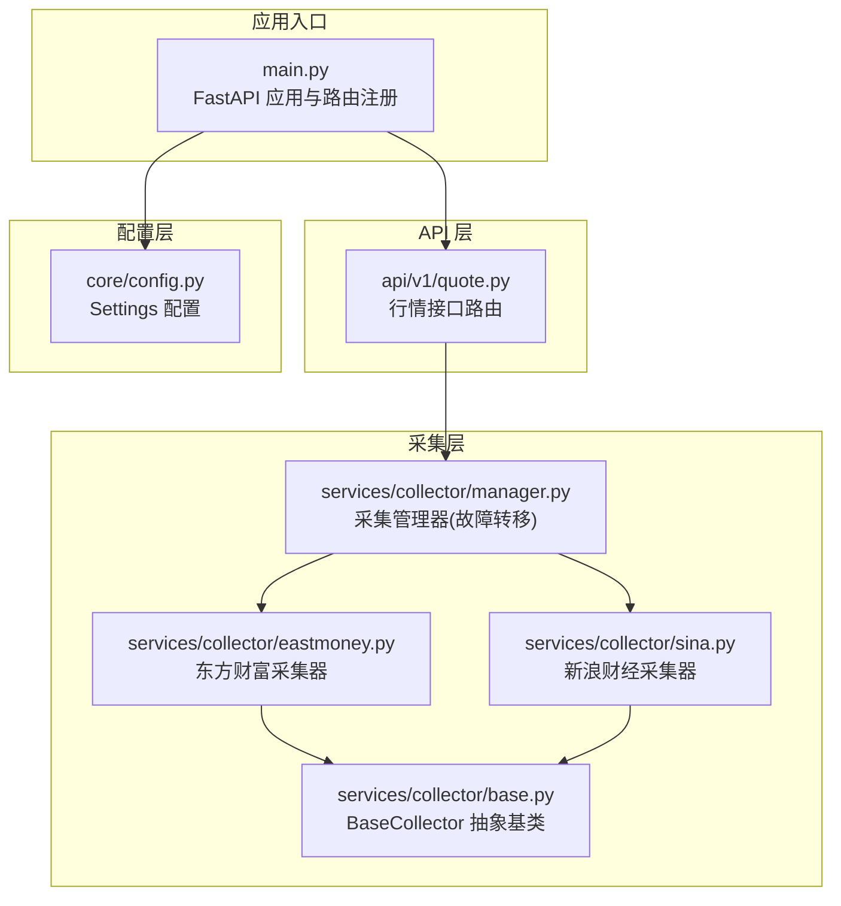
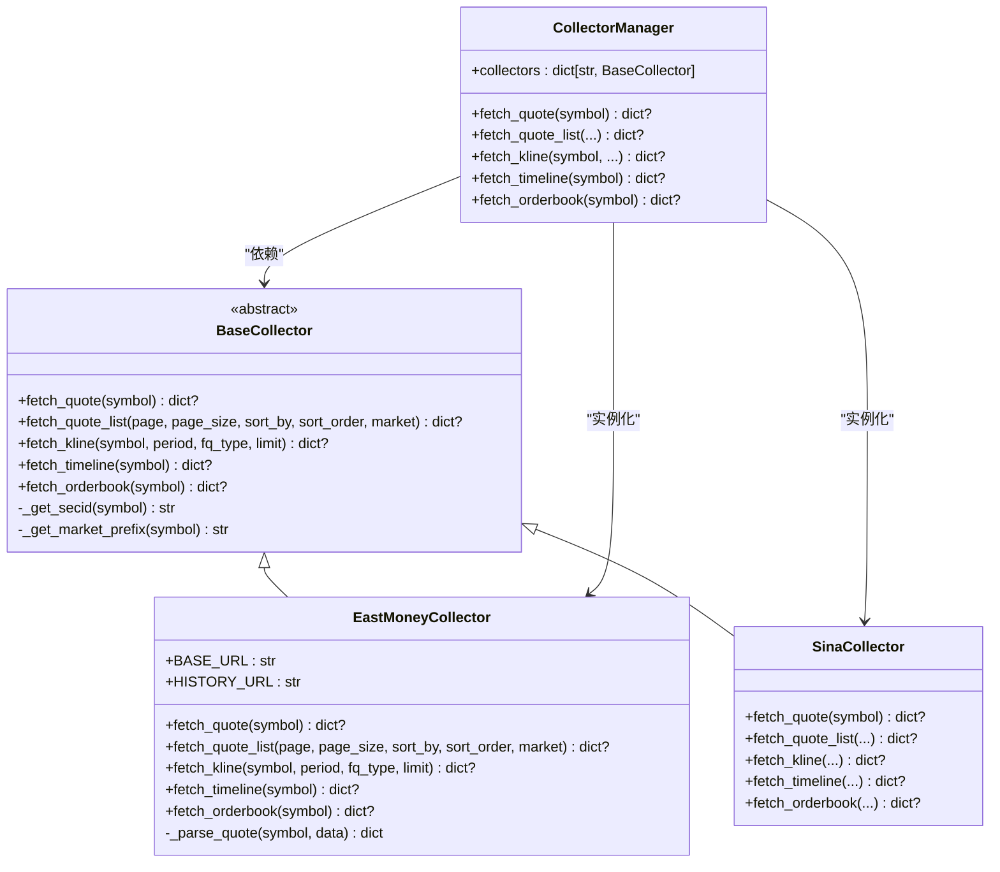
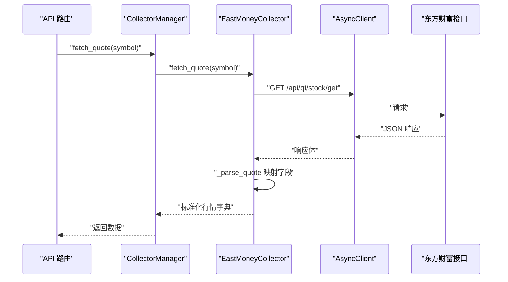
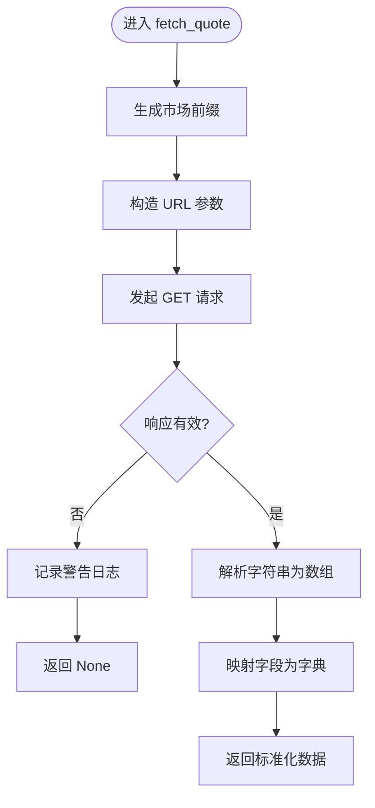
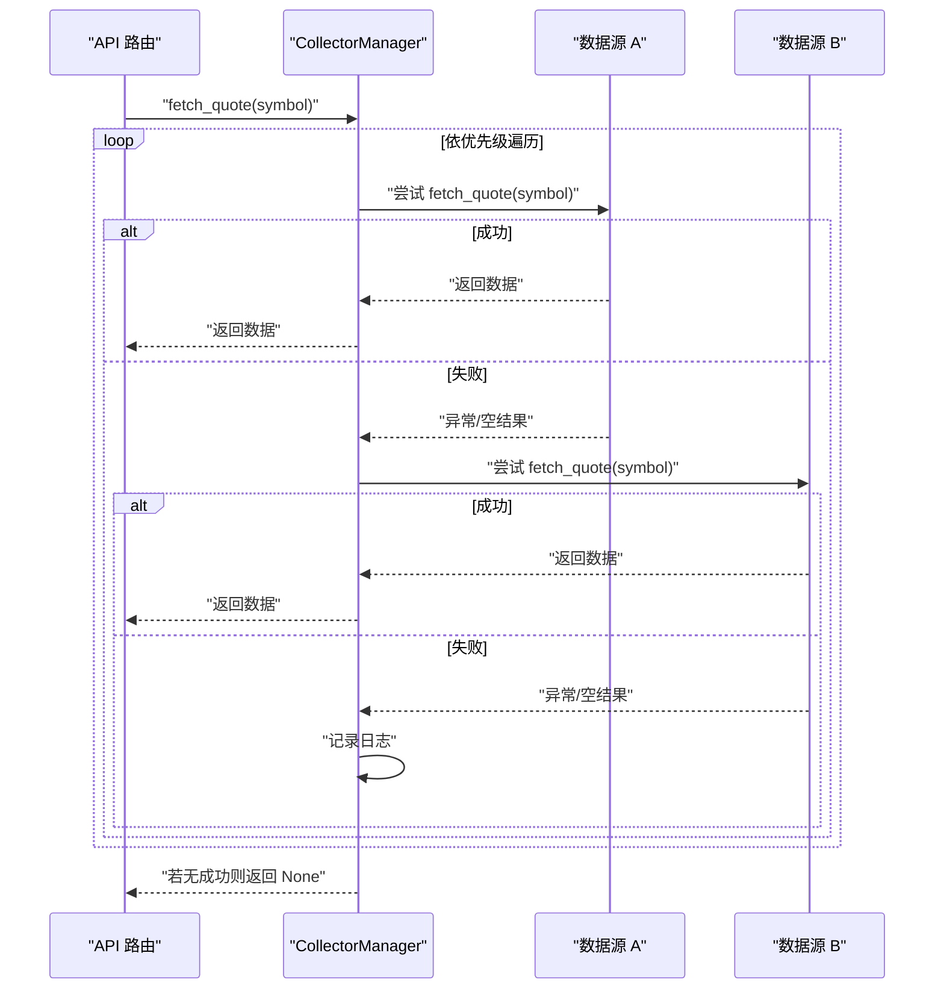
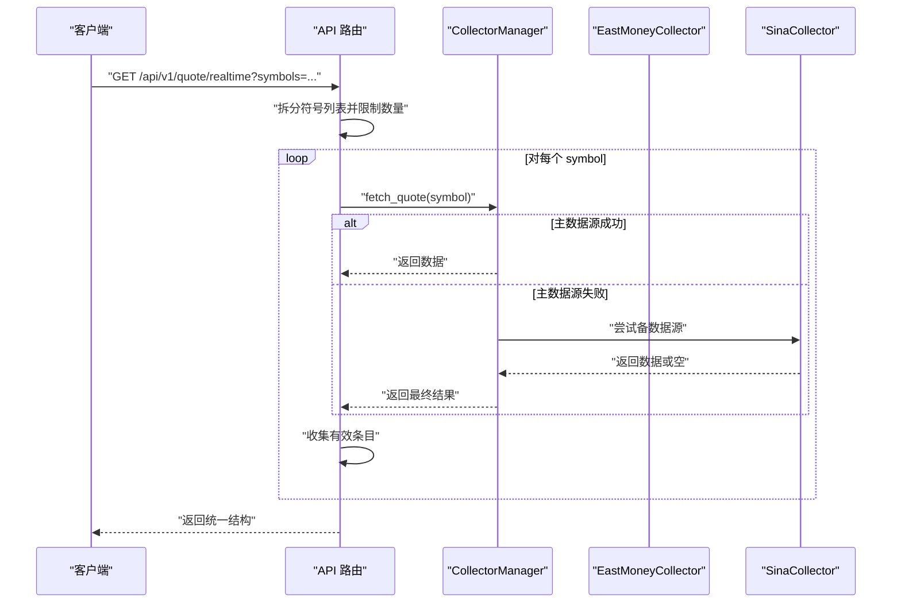
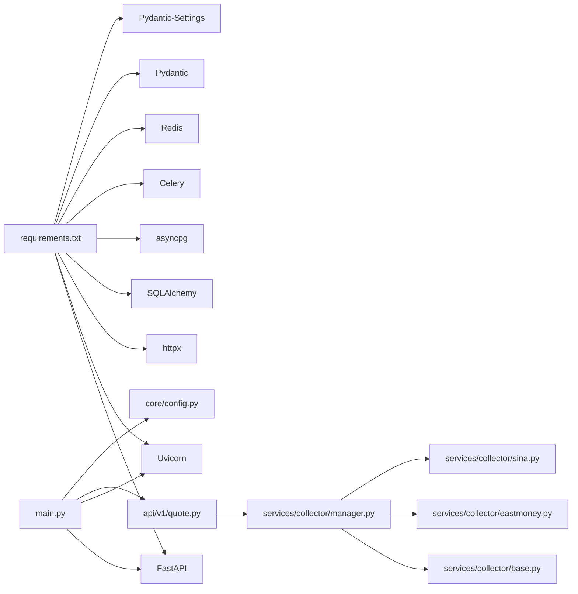

# 数据采集系统

<cite>
**本文引用的文件**
- [backend/app/services/collector/base.py](file://backend/app/services/collector/base.py)
- [backend/app/services/collector/eastmoney.py](file://backend/app/services/collector/eastmoney.py)
- [backend/app/services/collector/sina.py](file://backend/app/services/collector/sina.py)
- [backend/app/services/collector/manager.py](file://backend/app/services/collector/manager.py)
- [backend/app/api/v1/quote.py](file://backend/app/api/v1/quote.py)
- [backend/app/core/config.py](file://backend/app/core/config.py)
- [backend/app/main.py](file://backend/app/main.py)
- [backend/requirements.txt](file://backend/requirements.txt)
</cite>

## 目录
1. [简介](#简介)
2. [项目结构](#项目结构)
3. [核心组件](#核心组件)
4. [架构总览](#架构总览)
5. [详细组件分析](#详细组件分析)
6. [依赖分析](#依赖分析)
7. [性能考虑](#性能考虑)
8. [故障排查指南](#故障排查指南)
9. [结论](#结论)
10. [附录](#附录)

## 简介
本文件面向“数据采集系统”的设计与实现，重点阐述多数据源容灾采集架构：以抽象基类定义统一接口，以工厂式管理器实现数据源选择与故障转移，以 REST API 提供统一访问入口。系统通过“主备”数据源（东方财富为主、新浪财经为备）实现高可用，同时在采集层提供并发安全、错误处理与结果缓存的基础能力。

## 项目结构
后端采用按功能域划分的模块化组织方式，数据采集相关代码集中在服务层的 collector 子包中，API 层通过路由调用采集管理器，核心配置集中于配置模块，应用入口负责路由注册与生命周期管理。

**图表来源**
- [backend/app/main.py:1-48](file://backend/app/main.py#L1-L48)
- [backend/app/api/v1/quote.py:1-65](file://backend/app/api/v1/quote.py#L1-L65)
- [backend/app/services/collector/base.py:1-45](file://backend/app/services/collector/base.py#L1-L45)
- [backend/app/services/collector/eastmoney.py:1-240](file://backend/app/services/collector/eastmoney.py#L1-L240)
- [backend/app/services/collector/sina.py:1-79](file://backend/app/services/collector/sina.py#L1-L79)
- [backend/app/services/collector/manager.py:1-80](file://backend/app/services/collector/manager.py#L1-L80)
- [backend/app/core/config.py:1-43](file://backend/app/core/config.py#L1-L43)

**章节来源**
- [backend/app/main.py:1-48](file://backend/app/main.py#L1-L48)
- [backend/app/api/v1/quote.py:1-65](file://backend/app/api/v1/quote.py#L1-L65)
- [backend/app/services/collector/base.py:1-45](file://backend/app/services/collector/base.py#L1-L45)
- [backend/app/services/collector/eastmoney.py:1-240](file://backend/app/services/collector/eastmoney.py#L1-L240)
- [backend/app/services/collector/sina.py:1-79](file://backend/app/services/collector/sina.py#L1-L79)
- [backend/app/services/collector/manager.py:1-80](file://backend/app/services/collector/manager.py#L1-L80)
- [backend/app/core/config.py:1-43](file://backend/app/core/config.py#L1-L43)

## 核心组件
- 抽象基类 BaseCollector：定义统一的数据采集接口，包含实时行情、行情列表、K线、分时、盘口等异步方法；提供通用工具方法（如 secid 生成、市场前缀推导）。
- 东方财富采集器 EastMoneyCollector：实现具体接口，封装请求参数、解析响应、字段映射与时间戳标准化。
- 新浪财经采集器 SinaCollector：实现部分接口，其余接口提示不支持或待实现。
- 采集管理器 CollectorManager：以优先级顺序尝试不同采集器，实现自动故障转移；对每个接口提供独立的回退策略。
- API 路由 quote.py：对外暴露统一的 REST 接口，调用采集管理器获取数据并返回标准结构。
- 配置 Settings：集中管理应用配置，包括数据库、Redis、AI 适配器、Celery、行情采集间隔与缓存 TTL 等。

**章节来源**
- [backend/app/services/collector/base.py:5-45](file://backend/app/services/collector/base.py#L5-L45)
- [backend/app/services/collector/eastmoney.py:11-240](file://backend/app/services/collector/eastmoney.py#L11-L240)
- [backend/app/services/collector/sina.py:10-79](file://backend/app/services/collector/sina.py#L10-L79)
- [backend/app/services/collector/manager.py:12-80](file://backend/app/services/collector/manager.py#L12-L80)
- [backend/app/api/v1/quote.py:7-65](file://backend/app/api/v1/quote.py#L7-L65)
- [backend/app/core/config.py:5-43](file://backend/app/core/config.py#L5-L43)

## 架构总览
系统采用“接口抽象 + 多实现 + 管理器编排”的架构模式，实现“主备数据源”的容灾采集：

**图表来源**
- [backend/app/services/collector/base.py:5-45](file://backend/app/services/collector/base.py#L5-L45)
- [backend/app/services/collector/eastmoney.py:11-240](file://backend/app/services/collector/eastmoney.py#L11-L240)
- [backend/app/services/collector/sina.py:10-79](file://backend/app/services/collector/sina.py#L10-L79)
- [backend/app/services/collector/manager.py:12-80](file://backend/app/services/collector/manager.py#L12-L80)

## 详细组件分析

### 抽象基类 BaseCollector
- 设计要点
  - 统一接口：定义 fetch_quote、fetch_quote_list、fetch_kline、fetch_timeline、fetch_orderbook 五个异步方法，确保各数据源实现一致的调用契约。
  - 工具方法：提供 _get_secid 与 _get_market_prefix，用于将股票代码转换为特定数据源所需的格式与市场前缀。
- 复杂度与性能
  - 工具方法为 O(1)，字符串拼接与条件判断开销极低。
- 错误处理
  - 基类不直接处理网络异常，交由子类实现捕获与日志记录。

**章节来源**
- [backend/app/services/collector/base.py:5-45](file://backend/app/services/collector/base.py#L5-L45)

### 东方财富采集器 EastMoneyCollector
- 实现差异
  - 使用独立的实时与历史域名，分别处理实时行情与历史数据。
  - 对请求参数进行字段裁剪与排序映射，提升响应体积与速度。
  - 解析响应时进行字段映射与类型转换，统一输出结构。
- 数据标准化
  - 时间戳标准化为固定格式字符串；数值字段进行默认值兜底。
- 错误处理
  - 捕获异常并记录警告日志，返回空结果，便于上层继续尝试其他数据源。
- 性能特征
  - 异步客户端超时设置为 10 秒，避免阻塞事件循环。
  - 字段映射与列表解析为线性复杂度，与数据量成正比。

**图表来源**
- [backend/app/api/v1/quote.py:7-16](file://backend/app/api/v1/quote.py#L7-L16)
- [backend/app/services/collector/manager.py:21-32](file://backend/app/services/collector/manager.py#L21-L32)
- [backend/app/services/collector/eastmoney.py:23-37](file://backend/app/services/collector/eastmoney.py#L23-L37)
- [backend/app/services/collector/eastmoney.py:224-240](file://backend/app/services/collector/eastmoney.py#L224-L240)

**章节来源**
- [backend/app/services/collector/eastmoney.py:11-240](file://backend/app/services/collector/eastmoney.py#L11-L240)

### 新浪财经采集器 SinaCollector
- 实现差异
  - 仅实现 fetch_quote 的完整逻辑，其余接口返回 None 并记录警告日志，提示使用其他数据源。
  - 通过市场前缀拼接股票代码，解析字符串格式的行情数据。
- 适用场景
  - 当主数据源不可用时，作为备选方案；仅限实时行情场景。

**图表来源**
- [backend/app/services/collector/sina.py:19-60](file://backend/app/services/collector/sina.py#L19-L60)

**章节来源**
- [backend/app/services/collector/sina.py:10-79](file://backend/app/services/collector/sina.py#L10-L79)

### 采集管理器 CollectorManager（工厂与故障转移）
- 工厂模式
  - 在初始化阶段创建并注册多个采集器实例，形成“名称到实例”的映射表。
- 故障转移策略
  - 定义采集器优先级列表，按序尝试调用；任一成功即返回，否则记录错误并继续下一个。
  - 对不同接口采用差异化优先级：例如实时行情按全局优先级，列表/K线/分时/盘口统一优先使用主数据源。
- 并发与可扩展性
  - 采用异步调用，避免阻塞；新增数据源只需实现 BaseCollector 并加入注册表即可。

**图表来源**
- [backend/app/services/collector/manager.py:21-32](file://backend/app/services/collector/manager.py#L21-L32)
- [backend/app/services/collector/manager.py:9-19](file://backend/app/services/collector/manager.py#L9-L19)

**章节来源**
- [backend/app/services/collector/manager.py:12-80](file://backend/app/services/collector/manager.py#L12-L80)

### API 层与调度策略
- 路由设计
  - 提供实时行情、行情列表、K线、分时、盘口等接口，参数校验与默认值在路由层完成。
- 调度与并发
  - 实时行情接口对多个股票代码逐个调用采集管理器；当前实现为串行聚合，适合小批量查询。
- 错误处理
  - 当采集管理器返回空时，API 返回统一错误码与消息，便于前端展示。

**图表来源**
- [backend/app/api/v1/quote.py:7-16](file://backend/app/api/v1/quote.py#L7-L16)
- [backend/app/services/collector/manager.py:21-32](file://backend/app/services/collector/manager.py#L21-L32)
- [backend/app/services/collector/eastmoney.py:23-37](file://backend/app/services/collector/eastmoney.py#L23-L37)
- [backend/app/services/collector/sina.py:19-60](file://backend/app/services/collector/sina.py#L19-L60)

**章节来源**
- [backend/app/api/v1/quote.py:7-65](file://backend/app/api/v1/quote.py#L7-L65)

## 依赖分析
- 运行时依赖
  - FastAPI、Uvicorn、httpx、SQLAlchemy、asyncpg、Celery、Redis、Pydantic、Pydantic-Settings 等。
- 内部依赖
  - API 路由依赖采集管理器；采集管理器依赖抽象基类与具体采集器实现；配置模块被应用入口读取。

**图表来源**
- [backend/requirements.txt:1-17](file://backend/requirements.txt#L1-L17)
- [backend/app/main.py:1-48](file://backend/app/main.py#L1-L48)
- [backend/app/api/v1/quote.py:1-65](file://backend/app/api/v1/quote.py#L1-L65)
- [backend/app/services/collector/manager.py:1-80](file://backend/app/services/collector/manager.py#L1-L80)
- [backend/app/services/collector/base.py:1-45](file://backend/app/services/collector/base.py#L1-L45)
- [backend/app/services/collector/eastmoney.py:1-240](file://backend/app/services/collector/eastmoney.py#L1-L240)
- [backend/app/services/collector/sina.py:1-79](file://backend/app/services/collector/sina.py#L1-L79)
- [backend/app/core/config.py:1-43](file://backend/app/core/config.py#L1-L43)

**章节来源**
- [backend/requirements.txt:1-17](file://backend/requirements.txt#L1-L17)
- [backend/app/main.py:1-48](file://backend/app/main.py#L1-L48)
- [backend/app/core/config.py:1-43](file://backend/app/core/config.py#L1-L43)

## 性能考虑
- 并发模型
  - 所有采集接口均为异步实现，采集管理器在单次请求内按优先级串行尝试，适合小批量查询；若需大规模并发，建议在 API 层引入异步并发（如 asyncio.gather）以提升吞吐。
- 超时与稳定性
  - 采集器内部设置 10 秒超时，避免长时间阻塞；建议结合上游限流与指数退避策略进一步增强稳定性。
- 缓存与去重
  - 配置中提供缓存 TTL 与采集间隔，可在 API 或服务层增加缓存中间件以减少重复请求。
- 数据解析
  - 字段映射与类型转换为 O(n) 线性操作，与数据量成正比；建议对热点字段建立索引或缓存以加速。

[本节为通用性能指导，无需引用具体文件]

## 故障排查指南
- 常见问题定位
  - 数据为空：检查采集器是否抛出异常并返回 None；查看日志中“数据源获取失败”的警告信息。
  - 接口不支持：新浪财经对列表、K线、分时、盘口接口返回 None，需切换至主数据源。
  - 参数错误：确认请求参数是否符合路由约束（如页码、每页数量范围）。
- 日志与可观测性
  - 采集器与管理器均记录警告与错误日志，便于快速定位失败节点。
- 可用性保障
  - 若主数据源持续不可用，系统会自动回退至备数据源；建议监控采集成功率并告警。

**章节来源**
- [backend/app/services/collector/eastmoney.py:35-37](file://backend/app/services/collector/eastmoney.py#L35-L37)
- [backend/app/services/collector/sina.py:62-79](file://backend/app/services/collector/sina.py#L62-L79)
- [backend/app/services/collector/manager.py:28-31](file://backend/app/services/collector/manager.py#L28-L31)
- [backend/app/api/v1/quote.py:29-33](file://backend/app/api/v1/quote.py#L29-L33)

## 结论
该数据采集系统通过抽象基类统一接口、以管理器实现多数据源容灾与故障转移，配合 API 层的参数校验与错误码返回，形成了高可用、易扩展的数据采集架构。当前实现已覆盖实时行情与部分历史数据接口，其余接口可通过扩展采集器实现补齐。建议后续在 API 层引入并发优化与缓存策略，以进一步提升吞吐与稳定性。

## 附录

### 配置项与扩展方法
- 配置项（来自 Settings）
  - 数据库连接、Redis 连接、AI 适配器与服务地址、AI 请求超时、缓存开关与 TTL、速率限制、Celery 消息队列、行情采集间隔与缓存 TTL、JWT 密钥与算法等。
- 扩展采集器
  - 新增采集器需继承 BaseCollector 并实现全部抽象方法；在 CollectorManager 中注册实例并纳入优先级列表，即可参与故障转移。
- API 扩展
  - 在 API 层新增路由时，调用采集管理器获取数据，遵循现有错误码与消息规范，保持一致性。

**章节来源**
- [backend/app/core/config.py:5-43](file://backend/app/core/config.py#L5-L43)
- [backend/app/services/collector/base.py:5-45](file://backend/app/services/collector/base.py#L5-L45)
- [backend/app/services/collector/manager.py:15-19](file://backend/app/services/collector/manager.py#L15-L19)
- [backend/app/api/v1/quote.py:7-65](file://backend/app/api/v1/quote.py#L7-L65)