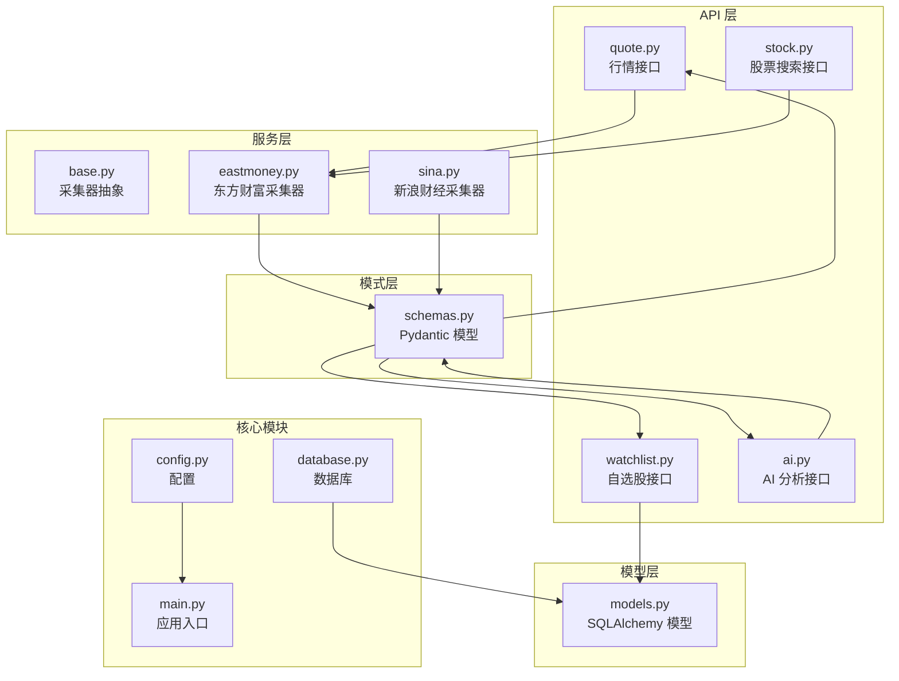
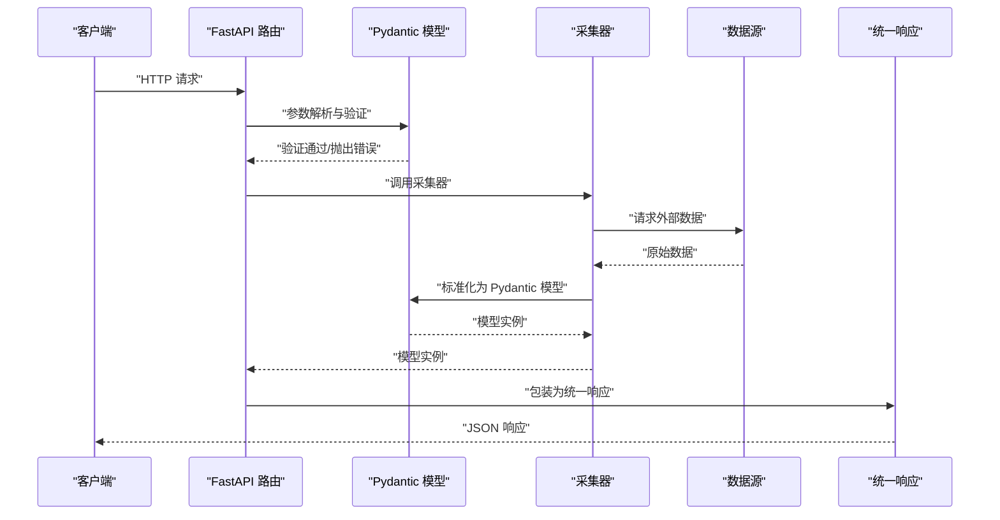
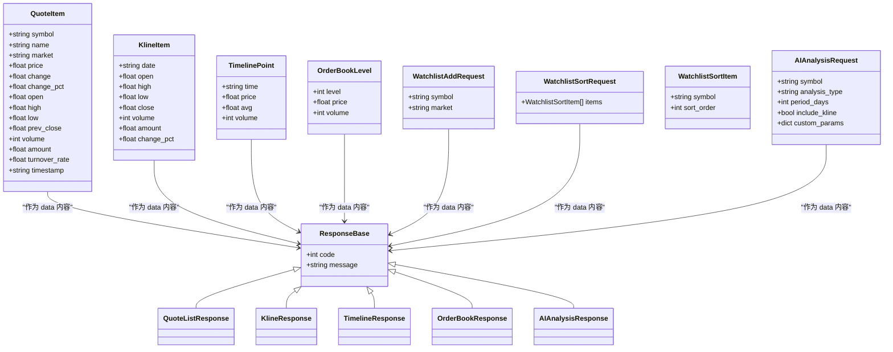
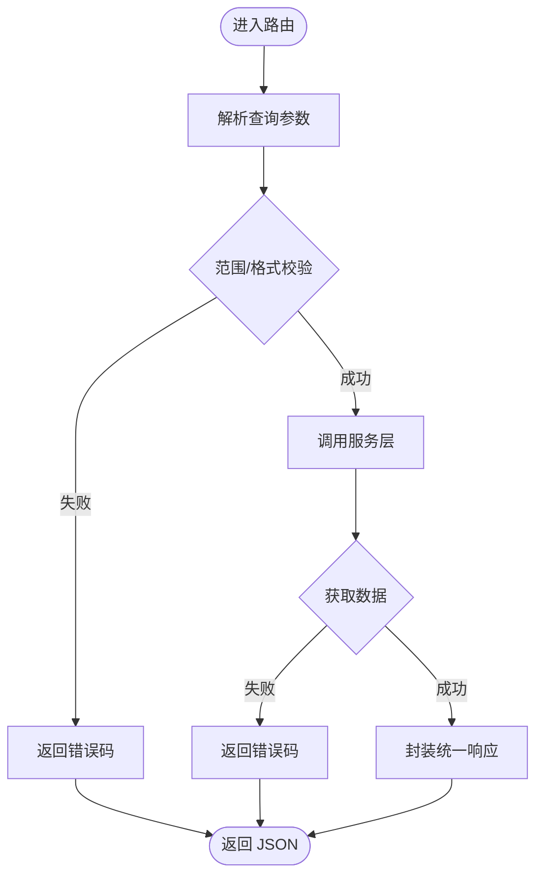
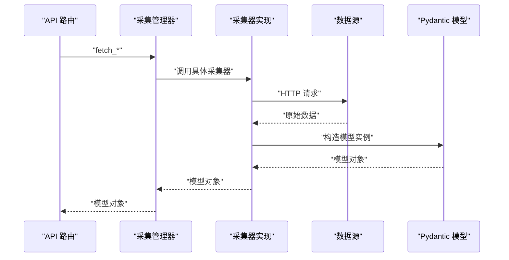
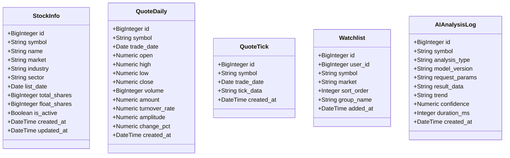
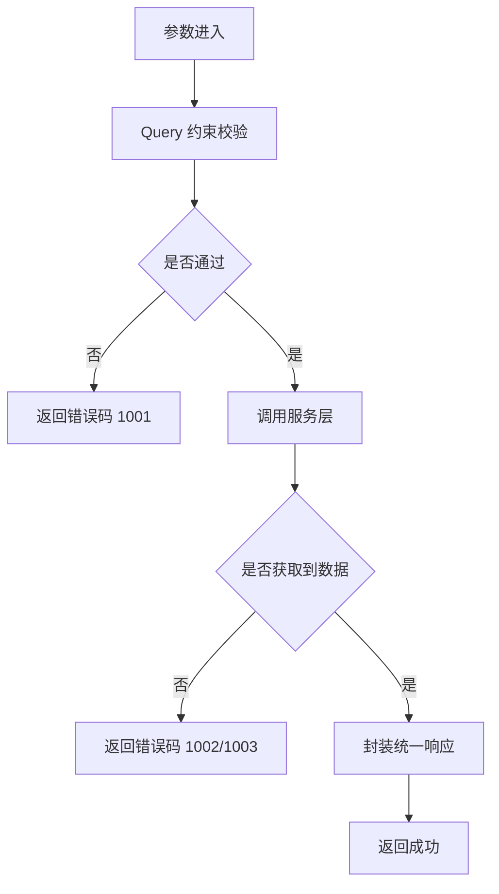
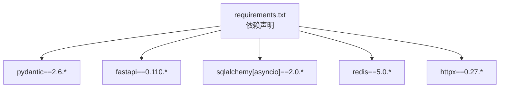

# 数据验证与转换

<cite>
**本文档引用的文件**
- [schemas.py](file://backend/app/schemas/schemas.py)
- [models.py](file://backend/app/models/models.py)
- [quote.py](file://backend/app/api/v1/quote.py)
- [watchlist.py](file://backend/app/api/v1/watchlist.py)
- [stock.py](file://backend/app/api/v1/stock.py)
- [ai.py](file://backend/app/api/v1/ai.py)
- [base.py](file://backend/app/services/collector/base.py)
- [eastmoney.py](file://backend/app/services/collector/eastmoney.py)
- [sina.py](file://backend/app/services/collector/sina.py)
- [database.py](file://backend/app/core/database.py)
- [config.py](file://backend/app/core/config.py)
- [main.py](file://backend/app/main.py)
- [requirements.txt](file://backend/requirements.txt)
</cite>

## 目录
1. [引言](#引言)
2. [项目结构](#项目结构)
3. [核心组件](#核心组件)
4. [架构总览](#架构总览)
5. [详细组件分析](#详细组件分析)
6. [依赖分析](#依赖分析)
7. [性能考虑](#性能考虑)
8. [故障排除指南](#故障排除指南)
9. [结论](#结论)
10. [附录](#附录)

## 引言
本文件系统性梳理后端在数据验证与转换方面的实现，重点覆盖以下方面：
- Pydantic 模型在数据验证中的应用：字段类型验证、默认值与可选字段、嵌套结构校验等。
- 数据转换流程：API 请求参数的验证与转换、采集器返回数据的清洗与标准化、数据库模型与 API 响应的序列化。
- 异常处理机制：验证错误的捕获与处理、错误信息的格式化输出、用户友好的错误提示策略。
- 最佳实践与常见问题：如何在 FastAPI + Pydantic + SQLAlchemy 的组合中构建健壮的数据处理管道。

## 项目结构
后端采用 FastAPI + SQLAlchemy + Pydantic 的分层架构：
- API 层：定义路由与查询参数，负责输入参数的约束与错误码返回。
- 服务层：数据采集器抽象与实现，负责从外部数据源抓取并标准化数据。
- 模型层：SQLAlchemy ORM 映射，负责数据库持久化。
- 模式层：Pydantic 模型，负责请求/响应数据的结构化验证与序列化。
- 核心模块：配置、数据库连接、安全工具等。

图表来源
- [quote.py:1-65](file://backend/app/api/v1/quote.py#L1-L65)
- [watchlist.py:1-77](file://backend/app/api/v1/watchlist.py#L1-L77)
- [stock.py:1-37](file://backend/app/api/v1/stock.py#L1-L37)
- [ai.py:1-29](file://backend/app/api/v1/ai.py#L1-L29)
- [base.py:1-45](file://backend/app/services/collector/base.py#L1-L45)
- [eastmoney.py:1-240](file://backend/app/services/collector/eastmoney.py#L1-L240)
- [sina.py:1-79](file://backend/app/services/collector/sina.py#L1-L79)
- [schemas.py:1-103](file://backend/app/schemas/schemas.py#L1-L103)
- [models.py:1-74](file://backend/app/models/models.py#L1-L74)
- [config.py:1-43](file://backend/app/core/config.py#L1-L43)
- [database.py:1-25](file://backend/app/core/database.py#L1-L25)
- [main.py:1-48](file://backend/app/main.py#L1-L48)

章节来源
- [main.py:1-48](file://backend/app/main.py#L1-L48)
- [config.py:1-43](file://backend/app/core/config.py#L1-L43)
- [database.py:1-25](file://backend/app/core/database.py#L1-L25)

## 核心组件
- Pydantic 模式层：统一定义请求/响应结构，自动进行字段类型验证、默认值填充与序列化。
- API 层：通过 Query 参数注解与 Pydantic 模型实现参数约束与错误码返回。
- 采集器层：对外部数据源进行抓取与标准化，保证数据格式一致性。
- 模型层：SQLAlchemy ORM 映射，确保入库数据的结构与精度约束。

章节来源
- [schemas.py:1-103](file://backend/app/schemas/schemas.py#L1-L103)
- [quote.py:1-65](file://backend/app/api/v1/quote.py#L1-L65)
- [watchlist.py:1-77](file://backend/app/api/v1/watchlist.py#L1-L77)
- [eastmoney.py:1-240](file://backend/app/services/collector/eastmoney.py#L1-L240)
- [models.py:1-74](file://backend/app/models/models.py#L1-L74)

## 架构总览
下图展示从 API 到服务再到数据源的整体调用链路与数据验证位置：

图表来源
- [quote.py:7-16](file://backend/app/api/v1/quote.py#L7-L16)
- [watchlist.py:29-51](file://backend/app/api/v1/watchlist.py#L29-L51)
- [eastmoney.py:23-37](file://backend/app/services/collector/eastmoney.py#L23-L37)
- [schemas.py:13-28](file://backend/app/schemas/schemas.py#L13-L28)

## 详细组件分析

### Pydantic 模型与字段验证
- 字段类型与默认值：所有模式均明确字段类型，并为可选字段提供默认值，避免运行时类型错误。
- 嵌套结构：如行情、K线、分时、盘口等复杂结构，通过嵌套 Pydantic 模型实现逐层验证。
- 序列化：Pydantic 自动将模型实例序列化为字典，便于统一响应封装。

图表来源
- [schemas.py:7-103](file://backend/app/schemas/schemas.py#L7-L103)

章节来源
- [schemas.py:1-103](file://backend/app/schemas/schemas.py#L1-L103)

### API 请求参数验证与转换
- 查询参数约束：通过 Query 注解直接声明参数类型、范围与描述，实现参数级验证。
- 统一响应封装：所有接口返回固定结构的响应体，包含状态码与消息，便于前端统一处理。
- 错误码策略：针对不同场景（如数据源不可用、股票代码不存在）返回特定错误码。

图表来源
- [quote.py:7-16](file://backend/app/api/v1/quote.py#L7-L16)
- [quote.py:19-33](file://backend/app/api/v1/quote.py#L19-L33)
- [quote.py:36-47](file://backend/app/api/v1/quote.py#L36-L47)
- [quote.py:50-56](file://backend/app/api/v1/quote.py#L50-L56)
- [watchlist.py:13-26](file://backend/app/api/v1/watchlist.py#L13-L26)
- [watchlist.py:29-51](file://backend/app/api/v1/watchlist.py#L29-L51)
- [watchlist.py:54-61](file://backend/app/api/v1/watchlist.py#L54-L61)
- [watchlist.py:64-77](file://backend/app/api/v1/watchlist.py#L64-L77)
- [stock.py:10-37](file://backend/app/api/v1/stock.py#L10-L37)

章节来源
- [quote.py:1-65](file://backend/app/api/v1/quote.py#L1-L65)
- [watchlist.py:1-77](file://backend/app/api/v1/watchlist.py#L1-L77)
- [stock.py:1-37](file://backend/app/api/v1/stock.py#L1-L37)

### 数据采集与标准化
- 采集器抽象：定义统一接口，屏蔽不同数据源差异。
- 标准化处理：将外部数据映射到内部模式，确保字段名称、类型与单位一致。
- 容错与降级：当外部数据为空或异常时，返回 None 并由上层路由返回错误码。

图表来源
- [base.py:5-45](file://backend/app/services/collector/base.py#L5-L45)
- [eastmoney.py:23-37](file://backend/app/services/collector/eastmoney.py#L23-L37)
- [eastmoney.py:39-99](file://backend/app/services/collector/eastmoney.py#L39-L99)
- [eastmoney.py:101-147](file://backend/app/services/collector/eastmoney.py#L101-L147)
- [eastmoney.py:149-185](file://backend/app/services/collector/eastmoney.py#L149-L185)
- [eastmoney.py:187-222](file://backend/app/services/collector/eastmoney.py#L187-L222)
- [schemas.py:13-28](file://backend/app/schemas/schemas.py#L13-L28)
- [schemas.py:34-43](file://backend/app/schemas/schemas.py#L34-L43)
- [schemas.py:49-54](file://backend/app/schemas/schemas.py#L49-L54)
- [schemas.py:60-64](file://backend/app/schemas/schemas.py#L60-L64)

章节来源
- [base.py:1-45](file://backend/app/services/collector/base.py#L1-L45)
- [eastmoney.py:1-240](file://backend/app/services/collector/eastmoney.py#L1-L240)
- [sina.py:1-79](file://backend/app/services/collector/sina.py#L1-L79)

### 数据库模型与序列化
- SQLAlchemy 模型：定义字段类型、长度与约束，确保入库精度与一致性。
- ORM 会话：通过异步会话管理数据库连接生命周期。
- 序列化：Pydantic 模型负责将数据库记录转换为 API 响应结构。

图表来源
- [models.py:5-74](file://backend/app/models/models.py#L5-L74)

章节来源
- [models.py:1-74](file://backend/app/models/models.py#L1-L74)
- [database.py:1-25](file://backend/app/core/database.py#L1-L25)

### 异常处理与错误码策略
- 参数错误：通过 Query 注解的 ge/le 等约束实现参数范围校验，失败时返回统一错误码。
- 数据源不可用：采集器返回 None 时，路由层返回对应错误码。
- 用户友好提示：统一响应结构包含 code 与 message，便于前端展示。

图表来源
- [quote.py:19-33](file://backend/app/api/v1/quote.py#L19-L33)
- [quote.py:36-47](file://backend/app/api/v1/quote.py#L36-L47)
- [quote.py:50-56](file://backend/app/api/v1/quote.py#L50-L56)
- [watchlist.py:29-51](file://backend/app/api/v1/watchlist.py#L29-L51)

章节来源
- [quote.py:1-65](file://backend/app/api/v1/quote.py#L1-L65)
- [watchlist.py:1-77](file://backend/app/api/v1/watchlist.py#L1-L77)

## 依赖分析
- Pydantic 版本：项目使用 Pydantic 2.6.*，具备更强的类型推断与更严格的验证能力。
- FastAPI 集成：FastAPI 与 Pydantic 深度集成，Query 注解与模型自动完成参数解析与验证。
- 数据库与缓存：SQLAlchemy 异步 ORM、Redis 缓存、Celery 任务队列等共同支撑高性能数据处理。

图表来源
- [requirements.txt:1-17](file://backend/requirements.txt#L1-L17)

章节来源
- [requirements.txt:1-17](file://backend/requirements.txt#L1-L17)

## 性能考虑
- 异步 I/O：采集器与数据库均采用异步实现，降低阻塞，提升吞吐。
- 缓存策略：Redis 缓存热点数据，减少重复抓取与计算开销。
- 限流与降级：配置中定义了 AI 与行情接口的限流参数，保障系统稳定性。
- 数据标准化：统一的 Pydantic 模型减少重复转换逻辑，提高序列化效率。

## 故障排除指南
- 参数校验失败：检查 Query 注解的 ge/le/描述等是否符合预期；确认客户端传参格式。
- 数据源异常：采集器日志会记录警告信息，优先检查网络连通性与第三方接口可用性。
- 数据库连接问题：确认数据库 URL 与凭据正确，检查连接池配置与并发限制。
- 响应格式异常：确保返回体严格遵循统一响应结构，避免遗漏 code/message/data 字段。

章节来源
- [eastmoney.py:35-37](file://backend/app/services/collector/eastmoney.py#L35-L37)
- [eastmoney.py:97-99](file://backend/app/services/collector/eastmoney.py#L97-L99)
- [eastmoney.py:145-147](file://backend/app/services/collector/eastmoney.py#L145-L147)
- [eastmoney.py:183-185](file://backend/app/services/collector/eastmoney.py#L183-L185)
- [eastmoney.py:220-222](file://backend/app/services/collector/eastmoney.py#L220-L222)

## 结论
本项目通过 Pydantic 模型实现了端到端的数据验证与转换，结合 FastAPI 的参数约束与统一响应机制，形成了清晰、可维护且健壮的数据处理管道。采集器层负责外部数据的标准化，模型层确保入库数据的结构与精度，整体架构具备良好的扩展性与可测试性。

## 附录
- 最佳实践清单
  - 使用 Pydantic 模型定义所有请求/响应结构，避免裸字典传播。
  - 在 API 层利用 Query 注解进行参数范围与必填性约束。
  - 对外部数据进行显式映射与类型转换，统一到内部模式。
  - 将错误码与消息标准化，便于前端统一处理。
  - 为关键接口配置缓存与限流，提升系统稳定性。
  - 为采集器增加日志与重试策略，增强可观测性与可靠性。