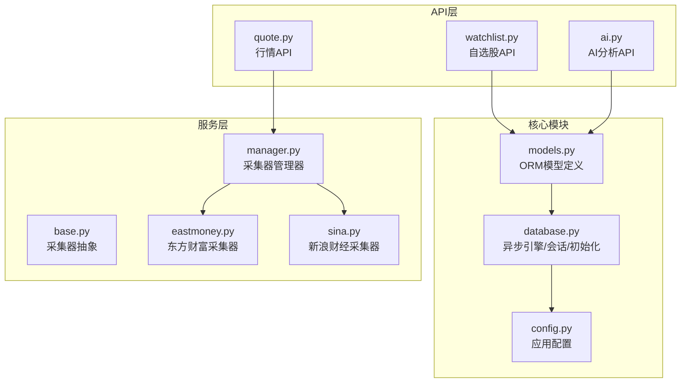
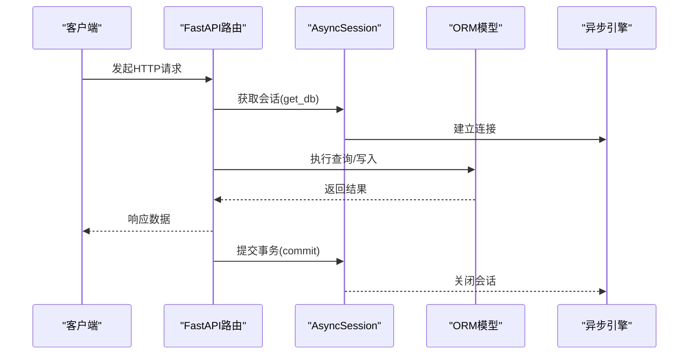
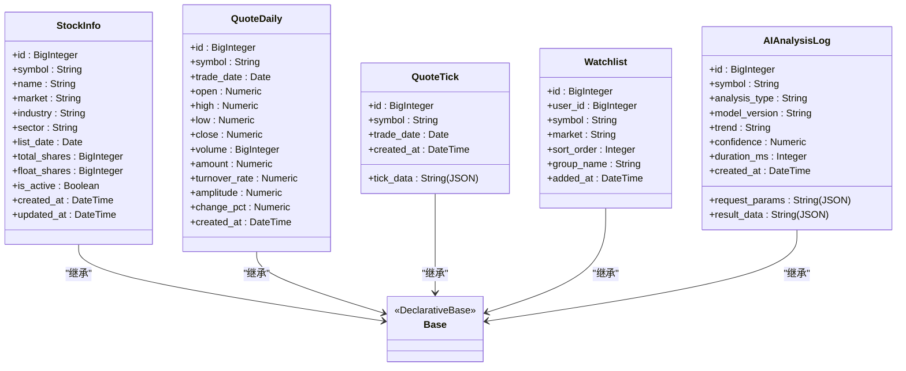
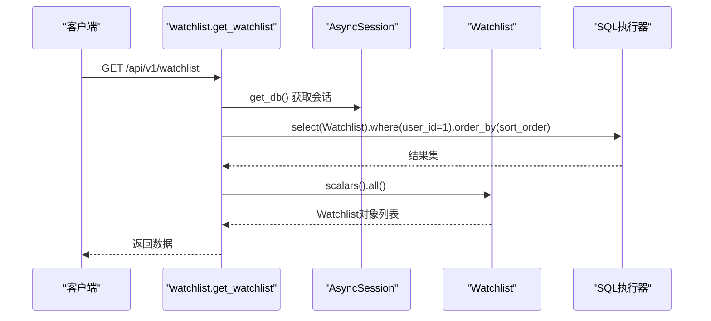
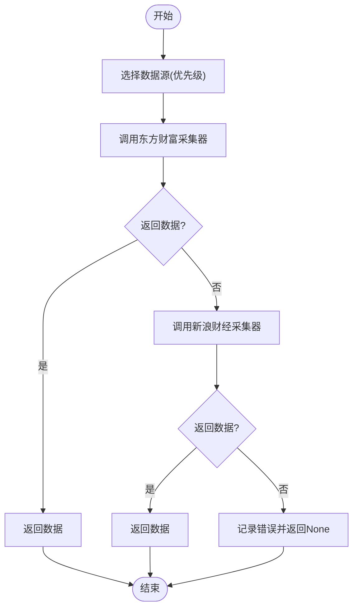
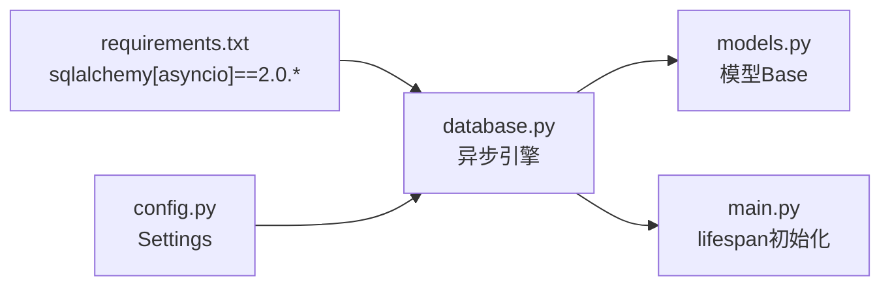

# ORM映射

<cite>
**本文引用的文件**
- [models.py](file://backend/app/models/models.py)
- [database.py](file://backend/app/core/database.py)
- [schemas.py](file://backend/app/schemas/schemas.py)
- [config.py](file://backend/app/core/config.py)
- [watchlist.py](file://backend/app/api/v1/watchlist.py)
- [quote.py](file://backend/app/api/v1/quote.py)
- [ai.py](file://backend/app/api/v1/ai.py)
- [main.py](file://backend/app/main.py)
- [base.py](file://backend/app/services/collector/base.py)
- [manager.py](file://backend/app/services/collector/manager.py)
- [eastmoney.py](file://backend/app/services/collector/eastmoney.py)
- [sina.py](file://backend/app/services/collector/sina.py)
- [requirements.txt](file://backend/requirements.txt)
</cite>

## 目录
1. [简介](#简介)
2. [项目结构](#项目结构)
3. [核心组件](#核心组件)
4. [架构总览](#架构总览)
5. [详细组件分析](#详细组件分析)
6. [依赖分析](#依赖分析)
7. [性能考虑](#性能考虑)
8. [故障排查指南](#故障排查指南)
9. [结论](#结论)
10. [附录](#附录)

## 简介
本文件面向使用 SQLAlchemy 2.0 的开发者，系统性梳理后端 ORM 映射设计与实现，重点覆盖以下模型类：
- StockInfo：股票基础信息
- QuoteDaily：日线行情
- QuoteTick：分时数据
- Watchlist：自选股
- AIAnalysisLog：AI分析日志

内容涵盖模型类定义、字段映射规则、主键与时间戳策略、JSON字段处理、查询优化、批量操作与事务管理策略，以及高级 ORM 特性（如延迟加载、混合属性等）的使用建议。为便于理解，文档同时给出与实际代码文件对应的图示与来源标注。

## 项目结构
后端采用 FastAPI + SQLAlchemy 2.0 异步 ORM 架构，核心目录与文件如下：
- models：ORM 模型定义
- core：数据库引擎、会话与初始化
- api/v1：REST API 路由
- services/collector：行情数据采集器与管理器
- requirements：SQLAlchemy 2.0 异步支持

**图表来源**
- [models.py:1-74](file://backend/app/models/models.py#L1-L74)
- [database.py:1-25](file://backend/app/core/database.py#L1-L25)
- [config.py:1-43](file://backend/app/core/config.py#L1-L43)
- [watchlist.py:1-77](file://backend/app/api/v1/watchlist.py#L1-L77)
- [quote.py:1-65](file://backend/app/api/v1/quote.py#L1-L65)
- [ai.py:1-29](file://backend/app/api/v1/ai.py#L1-L29)
- [base.py:1-45](file://backend/app/services/collector/base.py#L1-L45)
- [manager.py:1-94](file://backend/app/services/collector/manager.py#L1-L94)
- [eastmoney.py:1-297](file://backend/app/services/collector/eastmoney.py#L1-L297)
- [sina.py:1-312](file://backend/app/services/collector/sina.py#L1-L312)

**章节来源**
- [models.py:1-74](file://backend/app/models/models.py#L1-L74)
- [database.py:1-25](file://backend/app/core/database.py#L1-L25)
- [config.py:1-43](file://backend/app/core/config.py#L1-L43)

## 核心组件
本节概述五个核心模型类的职责与字段映射规则，帮助快速建立整体认知。

- StockInfo：存储股票基础信息，含代码、名称、市场、行业、上市日期、总股本、流通股本、是否活跃等字段；提供 created_at、updated_at 时间戳。
- QuoteDaily：存储日线行情，包含开盘、最高、最低、收盘价、成交量、成交额、换手率、振幅、涨跌幅等字段；提供 created_at 时间戳。
- QuoteTick：存储分时数据，以 JSON 字符串形式保存 tick 数据；提供 created_at 时间戳。
- Watchlist：存储用户自选股，包含用户标识、股票代码、市场、排序、分组等字段；提供 added_at 时间戳。
- AIAnalysisLog：存储 AI 分析日志，包含分析类型、模型版本、请求参数、结果数据、趋势、置信度、耗时等字段；提供 created_at 时间戳。

**章节来源**
- [models.py:5-74](file://backend/app/models/models.py#L5-L74)

## 架构总览
下图展示 ORM 层与业务层的交互关系，以及异步数据库会话的生命周期。

**图表来源**
- [watchlist.py:13-77](file://backend/app/api/v1/watchlist.py#L13-L77)
- [database.py:15-25](file://backend/app/core/database.py#L15-L25)

**章节来源**
- [watchlist.py:1-77](file://backend/app/api/v1/watchlist.py#L1-L77)
- [database.py:1-25](file://backend/app/core/database.py#L1-L25)

## 详细组件分析

### StockInfo 股票信息模型
- 表名映射：stock_info
- 主键：id（BigInteger，自增）
- 字段映射：
  - symbol：String(10)，非空
  - name：String(20)，非空
  - market：String(10)，非空
  - industry：String(20)
  - sector：String(20)
  - list_date：Date
  - total_shares：BigInteger
  - float_shares：BigInteger
  - is_active：Boolean，默认 True
  - created_at：DateTime，服务器默认值
  - updated_at：DateTime，服务器默认值 + 更新时自动更新

- 设计要点：
  - 使用 server_default 与 onupdate 实现时间戳自动维护，减少应用层逻辑。
  - is_active 字段便于软删除或状态控制。
  - 字符串长度限制遵循业务约束，避免数据库浪费空间。

- 查询建议：
  - 常用索引：symbol、market、is_active 组合索引可提升筛选效率。
  - 批量查询：使用 select + where + scalars().all() 进行高效批量读取。

**章节来源**
- [models.py:5-19](file://backend/app/models/models.py#L5-L19)

### QuoteDaily 日线行情模型
- 表名映射：quote_daily
- 主键：id（BigInteger，自增）
- 字段映射：
  - symbol：String(10)，非空
  - trade_date：Date，非空
  - open/high/low/close：Numeric(10,3)，保留三位小数
  - volume：BigInteger
  - amount：Numeric(18,2)，保留两位小数
  - turnover_rate/amplitude/change_pct：Numeric(8,4)，保留四位小数
  - created_at：DateTime，服务器默认值

- 设计要点：
  - 数值精度通过 Numeric 精确控制，避免浮点误差累积。
  - trade_date + symbol 组合作为主键可避免重复插入，当前模型未显式声明，需在迁移脚本中补充唯一约束或复合主键。

- 查询建议：
  - 常用索引：symbol + trade_date 复合索引，支持按股票与日期范围查询。
  - 批量写入：使用 bulk_insert_mappings 或批量 INSERT 语句提升入库效率。

**章节来源**
- [models.py:22-38](file://backend/app/models/models.py#L22-L38)

### QuoteTick 分时数据模型
- 表名映射：quote_tick
- 主键：id（BigInteger，自增）
- 字段映射：
  - symbol：String(10)，非空
  - trade_date：Date，非空
  - tick_data：String，JSON 字符串
  - created_at：DateTime，服务器默认值

- 设计要点：
  - tick_data 以字符串存储 JSON，便于灵活扩展；读取时需进行 JSON 解析。
  - 若未来需要复杂查询（如按时间点检索），可考虑拆分为独立表或引入 JSONB 类型（取决于数据库方言）。

- 查询建议：
  - 分页与过滤：按 symbol 和 trade_date 过滤，再按 created_at 排序。
  - 缓存策略：分时数据通常高频访问，可结合 Redis 缓存热点数据。

**章节来源**
- [models.py:40-48](file://backend/app/models/models.py#L40-L48)

### Watchlist 自选股模型
- 表名映射：watchlist
- 主键：id（BigInteger，自增）
- 字段映射：
  - user_id：BigInteger，默认 1
  - symbol：String(10)，非空
  - market：String(10)，非空
  - sort_order：Integer，默认 0
  - group_name：String(20)，默认 "default"
  - added_at：DateTime，服务器默认值

- 查询建议：
  - 排序：按 user_id + sort_order 升序排列。
  - 去重：添加唯一约束（user_id, symbol）防止重复添加。
  - 批量操作：批量新增/修改排序时，使用批量更新减少往返次数。

- 事务管理：
  - 添加/删除/排序操作均在单个事务内完成，确保一致性。

**章节来源**
- [models.py:50-60](file://backend/app/models/models.py#L50-L60)
- [watchlist.py:13-77](file://backend/app/api/v1/watchlist.py#L13-L77)

### AIAnalysisLog AI分析日志模型
- 表名映射：ai_analysis_log
- 主键：id（BigInteger，自增）
- 字段映射：
  - symbol：String(10)，非空
  - analysis_type：String(20)，非空
  - model_version：String(20)，非空
  - request_params/result_data：String（JSON）
  - trend：String(10)
  - confidence：Numeric(4,2)
  - duration_ms：Integer
  - created_at：DateTime，服务器默认值

- 设计要点：
  - JSON 字段用于存储结构化参数与结果，便于后续分析与回放。
  - confidence 与 duration_ms 便于评估模型质量与性能。

- 查询建议：
  - 按 symbol + created_at 范围查询，支持分页。
  - 可按 analysis_type 与 model_version 进行聚合统计。

**章节来源**
- [models.py:62-74](file://backend/app/models/models.py#L62-L74)

### 类关系与继承
- 模型类均继承自统一的 DeclarativeBase（Base），保证元数据一致与迁移能力。
- 采集器采用抽象基类 BaseCollector，派生出 EastMoneyCollector 与 SinaCollector，体现策略模式与故障转移。

**图表来源**
- [models.py:1-74](file://backend/app/models/models.py#L1-L74)
- [base.py:5-45](file://backend/app/services/collector/base.py#L5-L45)

**章节来源**
- [models.py:1-74](file://backend/app/models/models.py#L1-L74)
- [base.py:1-45](file://backend/app/services/collector/base.py#L1-L45)

### API工作流示例（自选股）
以下序列图展示自选股查询的典型流程，体现 ORM 查询与事务提交的协作。

**图表来源**
- [watchlist.py:13-26](file://backend/app/api/v1/watchlist.py#L13-L26)

**章节来源**
- [watchlist.py:1-77](file://backend/app/api/v1/watchlist.py#L1-L77)

### 数据采集与ORM集成
- CollectorManager 负责在多个数据源间进行故障转移，优先使用东方财富，失败则切换到新浪财经。
- 采集器返回的数据结构与 Pydantic 模型保持一致，便于后续入库或直接返回给前端。

**图表来源**
- [manager.py:21-90](file://backend/app/services/collector/manager.py#L21-L90)
- [eastmoney.py:69-86](file://backend/app/services/collector/eastmoney.py#L69-L86)
- [sina.py:64-107](file://backend/app/services/collector/sina.py#L64-L107)

**章节来源**
- [manager.py:1-94](file://backend/app/services/collector/manager.py#L1-L94)
- [eastmoney.py:1-297](file://backend/app/services/collector/eastmoney.py#L1-L297)
- [sina.py:1-312](file://backend/app/services/collector/sina.py#L1-L312)

## 依赖分析
- SQLAlchemy 2.0 异步支持：通过 sqlalchemy[asyncio] 与 asyncpg 驱动实现异步数据库访问。
- 应用配置：通过 Settings 读取 DATABASE_URL、调试开关等，影响引擎初始化与日志输出。
- FastAPI 生命周期：在应用启动时初始化数据库元数据，关闭时清理资源。

**图表来源**
- [requirements.txt:3-3](file://backend/requirements.txt#L3-L3)
- [database.py:1-25](file://backend/app/core/database.py#L1-L25)
- [config.py:1-43](file://backend/app/core/config.py#L1-L43)
- [models.py:1-2](file://backend/app/models/models.py#L1-L2)
- [main.py:13-20](file://backend/app/main.py#L13-L20)

**章节来源**
- [requirements.txt:1-17](file://backend/requirements.txt#L1-L17)
- [database.py:1-25](file://backend/app/core/database.py#L1-L25)
- [config.py:1-43](file://backend/app/core/config.py#L1-L43)
- [main.py:1-48](file://backend/app/main.py#L1-L48)

## 性能考虑
- 异步引擎与连接池：engine 初始化时设置 pool_size 与 max_overflow，适合高并发场景。
- 时间戳自动维护：使用 server_default 与 onupdate 减少应用层写入开销。
- 数值精度：Numeric 精度控制避免浮点误差，适合金融数据。
- 查询优化：
  - 为高频查询字段建立索引（如 symbol、trade_date、user_id、created_at）。
  - 使用 select + scalars().all() 进行批量读取，减少 ORM 对象构造成本。
- 批量操作：
  - 写入：bulk_insert_mappings 或批量 INSERT。
  - 更新：批量 UPDATE，避免逐条 commit。
- 事务策略：
  - 单次操作一个事务，确保原子性；长事务尽量缩短，避免锁竞争。
- 缓存策略：
  - 分时与日线数据可结合 Redis 缓存热点数据，降低数据库压力。

[本节为通用性能建议，无需特定文件来源]

## 故障排查指南
- 数据库连接问题：
  - 检查 DATABASE_URL 是否正确，确认 asyncpg 驱动可用。
  - 查看 APP_DEBUG 开启与否，有助于定位 SQL 与异常。
- ORM 初始化失败：
  - 确认 lifespan 中 init_db 已在应用启动时执行。
  - 检查 Base.metadata.create_all 是否成功。
- 查询异常：
  - 使用 select + where 条件过滤，避免全表扫描。
  - 对于 JSON 字段，注意解析异常与字段缺失。
- 事务问题：
  - 确保每个 API 调用都在会话上下文中完成 commit/close。
  - 避免长时间持有会话导致连接池耗尽。

**章节来源**
- [config.py:1-43](file://backend/app/core/config.py#L1-L43)
- [database.py:15-25](file://backend/app/core/database.py#L15-L25)
- [main.py:13-20](file://backend/app/main.py#L13-L20)

## 结论
本项目基于 SQLAlchemy 2.0 的异步 ORM 实现，模型设计清晰、字段映射合理，配合 FastAPI 生命周期与连接池配置，能够满足实时行情与自选股管理等业务需求。通过合理的索引、批量操作与事务策略，可在保证数据一致性的同时提升系统吞吐量。对于 JSON 字段与复杂查询场景，建议结合数据库方言特性（如 JSONB）进一步优化。

[本节为总结性内容，无需特定文件来源]

## 附录

### 字段类型与精度对照
- String(n)：固定长度字符串，适用于代码、名称、市场等短文本。
- BigInteger：大整数，适用于 ID、数量、股本等。
- Numeric(p,s)：定点数，适用于价格、金额、比例、涨跌幅等。
- Date：日期，适用于交易日。
- DateTime：时间戳，适用于 created_at、updated_at、added_at 等。
- Boolean：布尔值，适用于 is_active 等状态标志。

**章节来源**
- [models.py:1-74](file://backend/app/models/models.py#L1-L74)

### 时间戳自动更新策略
- created_at：使用 server_default=func.now() 在插入时自动赋值。
- updated_at：使用 server_default=func.now(), onupdate=func.now() 在插入与更新时自动维护。
- added_at：同上，用于 Watchlist。
- created_at：用于 QuoteDaily 与 AIAnalysisLog。

**章节来源**
- [models.py:18-19](file://backend/app/models/models.py#L18-L19)
- [models.py:37-37](file://backend/app/models/models.py#L37-L37)
- [models.py:59-59](file://backend/app/models/models.py#L59-L59)
- [models.py:73-74](file://backend/app/models/models.py#L73-L74)

### JSON字段处理建议
- 存储：将结构化数据序列化为字符串，便于跨语言兼容。
- 查询：若需条件查询 JSON 字段，建议引入 JSONB 类型（PostgreSQL）或在应用层解析后再过滤。
- 索引：对 JSON 字段建立 GIN 索引（PostgreSQL）可提升查询性能。

**章节来源**
- [models.py:46-46](file://backend/app/models/models.py#L46-L46)
- [models.py:69-70](file://backend/app/models/models.py#L69-L70)

### 事务与会话管理
- 会话生命周期：在 lifespan 中初始化数据库，在路由函数中通过依赖注入获取 AsyncSession。
- 事务边界：每个 API 操作在一个事务内完成，确保一致性。
- 连接池：合理配置 pool_size 与 max_overflow，避免连接不足或过度占用。

**章节来源**
- [database.py:15-25](file://backend/app/core/database.py#L15-L25)
- [main.py:13-20](file://backend/app/main.py#L13-L20)
- [watchlist.py:13-77](file://backend/app/api/v1/watchlist.py#L13-L77)