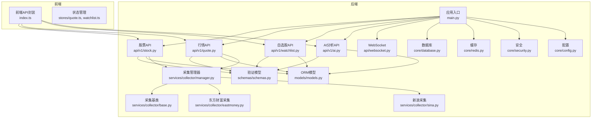
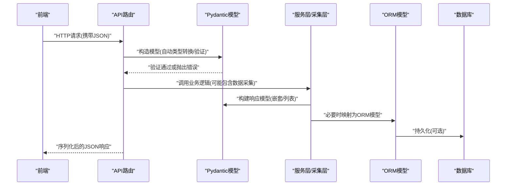
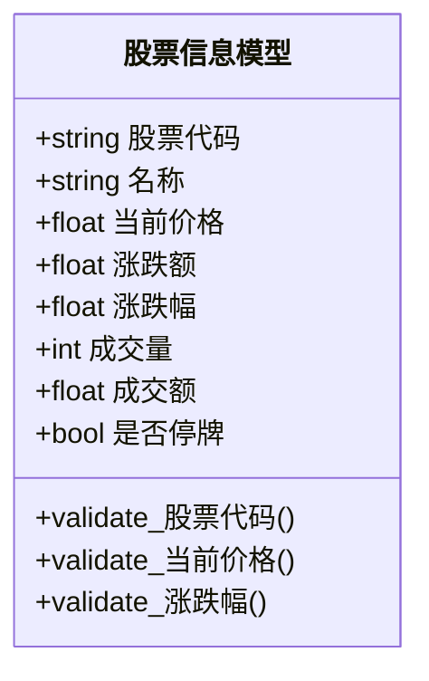
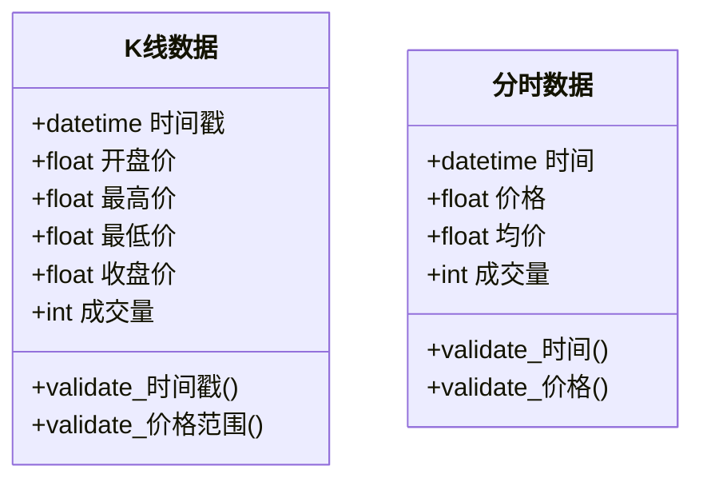
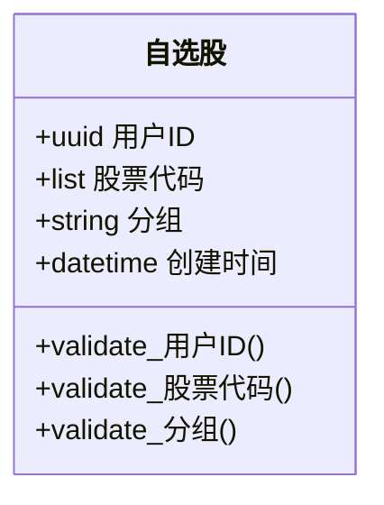
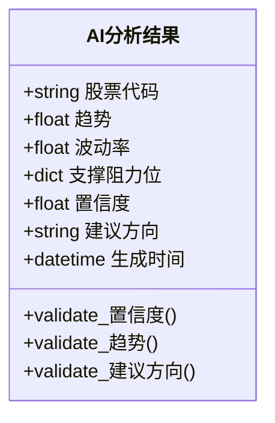
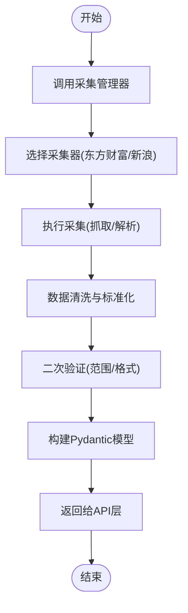
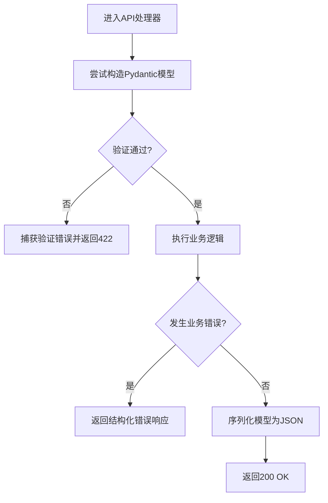
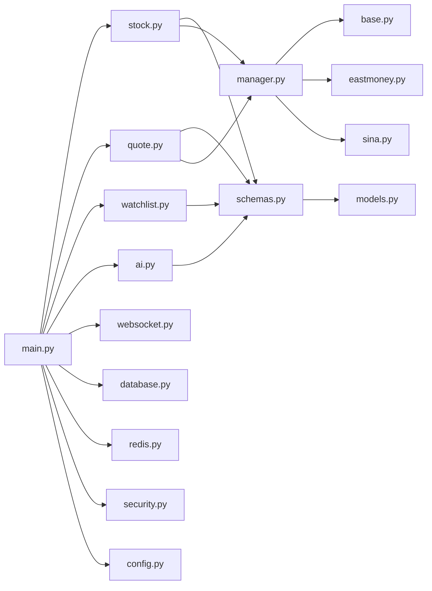
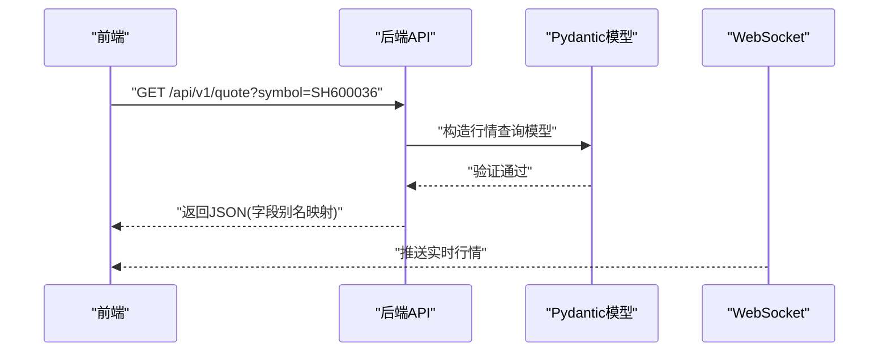

# Pydantic数据验证

<cite>
**本文引用的文件**
- [schemas.py](file://backend/app/schemas/schemas.py)
- [models.py](file://backend/app/models/models.py)
- [stock.py](file://backend/app/api/v1/stock.py)
- [quote.py](file://backend/app/api/v1/quote.py)
- [watchlist.py](file://backend/app/api/v1/watchlist.py)
- [ai.py](file://backend/app/api/v1/ai.py)
- [interface.py](file://backend/app/ai/interface.py)
- [eastmoney.py](file://backend/app/services/collector/eastmoney.py)
- [sina.py](file://backend/app/services/collector/sina.py)
- [manager.py](file://backend/app/services/collector/manager.py)
- [base.py](file://backend/app/services/collector/base.py)
- [main.py](file://backend/app/main.py)
- [config.py](file://backend/app/core/config.py)
- [database.py](file://backend/app/core/database.py)
- [redis.py](file://backend/app/core/redis.py)
- [security.py](file://backend/app/core/security.py)
- [websocket.py](file://backend/app/api/websocket.py)
- [index.ts](file://frontend/src/api/index.ts)
- [quote.ts](file://frontend/src/stores/quote.ts)
- [watchlist.ts](file://frontend/src/stores/watchlist.ts)
</cite>

## 目录
1. [简介](#简介)
2. [项目结构](#项目结构)
3. [核心组件](#核心组件)
4. [架构总览](#架构总览)
5. [详细组件分析](#详细组件分析)
6. [依赖关系分析](#依赖关系分析)
7. [性能考虑](#性能考虑)
8. [故障排除指南](#故障排除指南)
9. [结论](#结论)
10. [附录](#附录)

## 简介
本文件系统性梳理后端基于Pydantic的数据验证与序列化机制，覆盖请求参数验证、响应数据格式化、数据类型转换、字段验证规则、嵌套对象验证、条件验证、序列化最佳实践（JSON、字段别名、默认值、可选字段）、错误处理、性能优化与自定义验证器实现。重点解析以下核心验证模型：股票信息验证模型、行情数据验证模型、自选股验证模型、AI分析结果验证模型，并结合API层、服务层与数据采集层的实际用法进行说明。

## 项目结构
后端采用分层架构，核心验证模型集中在schemas模块，API层通过Pydantic模型进行输入输出校验与序列化；服务层负责数据采集与转换；前端通过API接口消费标准化的JSON响应。

**图表来源**
- [main.py](file://backend/app/main.py)
- [schemas.py](file://backend/app/schemas/schemas.py)
- [models.py](file://backend/app/models/models.py)
- [stock.py](file://backend/app/api/v1/stock.py)
- [quote.py](file://backend/app/api/v1/quote.py)
- [watchlist.py](file://backend/app/api/v1/watchlist.py)
- [ai.py](file://backend/app/api/v1/ai.py)
- [base.py](file://backend/app/services/collector/base.py)
- [eastmoney.py](file://backend/app/services/collector/eastmoney.py)
- [sina.py](file://backend/app/services/collector/sina.py)
- [manager.py](file://backend/app/services/collector/manager.py)
- [config.py](file://backend/app/core/config.py)
- [database.py](file://backend/app/core/database.py)
- [redis.py](file://backend/app/core/redis.py)
- [security.py](file://backend/app/core/security.py)
- [websocket.py](file://backend/app/api/websocket.py)

**章节来源**
- [main.py](file://backend/app/main.py)
- [schemas.py](file://backend/app/schemas/schemas.py)
- [models.py](file://backend/app/models/models.py)

## 核心组件
- 验证模型层：集中于schemas模块，定义请求/响应数据结构与验证规则，支持字段别名、默认值、可选字段、嵌套对象、条件验证与自定义验证器。
- API层：各路由通过Pydantic模型接收请求参数并返回序列化后的响应，确保输入输出一致性。
- 服务层：数据采集与转换，将原始数据映射到Pydantic模型，保证数据质量。
- ORM模型层：models模块用于数据库持久化，与Pydantic模型协同完成数据转换。
- 前端：通过统一的API接口消费标准化JSON，避免类型不一致导致的错误。

**章节来源**
- [schemas.py](file://backend/app/schemas/schemas.py)
- [stock.py](file://backend/app/api/v1/stock.py)
- [quote.py](file://backend/app/api/v1/quote.py)
- [watchlist.py](file://backend/app/api/v1/watchlist.py)
- [ai.py](file://backend/app/api/v1/ai.py)
- [models.py](file://backend/app/models/models.py)

## 架构总览
下图展示从HTTP请求到响应返回的完整流程，强调Pydantic在输入验证与输出序列化中的作用。

**图表来源**
- [stock.py](file://backend/app/api/v1/stock.py)
- [quote.py](file://backend/app/api/v1/quote.py)
- [watchlist.py](file://backend/app/api/v1/watchlist.py)
- [ai.py](file://backend/app/api/v1/ai.py)
- [schemas.py](file://backend/app/schemas/schemas.py)
- [models.py](file://backend/app/models/models.py)

## 详细组件分析

### 股票信息验证模型
- 字段与类型：包含股票代码、名称、当前价格、涨跌额、涨跌幅、成交量、成交额等字段，确保与前端展示需求一致。
- 验证规则：数值字段设置范围约束，字符串字段设置长度限制；使用正则表达式校验股票代码格式。
- 嵌套与列表：支持多只股票批量查询，响应为列表嵌套模型。
- 条件验证：根据是否停牌设置涨跌相关字段的可选性。
- 序列化：启用字段别名以适配前端命名习惯；默认值处理保证缺失字段的兼容性。

**图表来源**
- [schemas.py](file://backend/app/schemas/schemas.py)

**章节来源**
- [schemas.py](file://backend/app/schemas/schemas.py)
- [stock.py](file://backend/app/api/v1/stock.py)

### 行情数据验证模型
- 字段与类型：K线数据（时间戳、开盘价、最高价、最低价、收盘价、成交量）与分时数据（时间、价格、均价、成交量）。
- 验证规则：时间戳合法性、价格与成交量非负、分时数据按时间升序排列。
- 嵌套与列表：K线与分时数据均以列表形式返回，支持分页与数量限制。
- 条件验证：不同周期（日/周/月）与复权状态影响字段可用性。
- 序列化：字段别名映射到前端约定字段名；日期时间序列化为ISO格式。

**图表来源**
- [schemas.py](file://backend/app/schemas/schemas.py)

**章节来源**
- [schemas.py](file://backend/app/schemas/schemas.py)
- [quote.py](file://backend/app/api/v1/quote.py)

### 自选股验证模型
- 字段与类型：用户ID、股票代码列表、分组信息、创建时间。
- 验证规则：用户ID存在性检查；股票代码列表去重与长度限制；分组名称唯一性。
- 嵌套与列表：支持批量添加/删除；响应包含操作结果与失败明细。
- 条件验证：当用户未登录时禁止修改自选股；当股票池为空时提示无数据。
- 序列化：字段别名与默认值提升前端兼容性；可选字段控制敏感信息暴露。

**图表来源**
- [schemas.py](file://backend/app/schemas/schemas.py)

**章节来源**
- [schemas.py](file://backend/app/schemas/schemas.py)
- [watchlist.py](file://backend/app/api/v1/watchlist.py)

### AI分析结果验证模型
- 字段与类型：分析指标（趋势、波动率、支撑阻力位）、置信度、建议方向、生成时间。
- 验证规则：置信度范围0-1；趋势枚举值校验；建议方向与指标一致性检查。
- 嵌套与列表：支持多标的批量分析，响应为字典或列表。
- 条件验证：当数据不足时返回“数据不完整”提示；异常情况下返回错误码与描述。
- 序列化：字段别名与时间序列化；默认值处理缺失指标。

**图表来源**
- [schemas.py](file://backend/app/schemas/schemas.py)

**章节来源**
- [schemas.py](file://backend/app/schemas/schemas.py)
- [ai.py](file://backend/app/api/v1/ai.py)

### 数据采集与转换流程
- 采集基类：定义统一接口与通用逻辑，如数据清洗、异常处理、重试策略。
- 具体采集器：东方财富与新浪采集器实现差异化数据源适配，统一输出到Pydantic模型。
- 采集管理器：协调多个采集器，合并结果并进行二次验证与补全。

**图表来源**
- [manager.py](file://backend/app/services/collector/manager.py)
- [base.py](file://backend/app/services/collector/base.py)
- [eastmoney.py](file://backend/app/services/collector/eastmoney.py)
- [sina.py](file://backend/app/services/collector/sina.py)

**章节来源**
- [manager.py](file://backend/app/services/collector/manager.py)
- [base.py](file://backend/app/services/collector/base.py)
- [eastmoney.py](file://backend/app/services/collector/eastmoney.py)
- [sina.py](file://backend/app/services/collector/sina.py)

### 错误处理与验证流程
- 输入错误：请求参数不符合模型定义时，抛出验证错误，包含字段名与原因。
- 业务错误：采集失败、数据不完整、权限不足等情况，返回结构化错误响应。
- 输出错误：序列化失败或字段缺失时，记录日志并返回兜底响应。

**图表来源**
- [stock.py](file://backend/app/api/v1/stock.py)
- [quote.py](file://backend/app/api/v1/quote.py)
- [watchlist.py](file://backend/app/api/v1/watchlist.py)
- [ai.py](file://backend/app/api/v1/ai.py)
- [schemas.py](file://backend/app/schemas/schemas.py)

**章节来源**
- [stock.py](file://backend/app/api/v1/stock.py)
- [quote.py](file://backend/app/api/v1/quote.py)
- [watchlist.py](file://backend/app/api/v1/watchlist.py)
- [ai.py](file://backend/app/api/v1/ai.py)
- [schemas.py](file://backend/app/schemas/schemas.py)

## 依赖关系分析
- API层依赖schemas模块进行输入输出验证与序列化。
- 服务层依赖采集器与配置模块，将原始数据转换为Pydantic模型。
- ORM层与数据库/缓存模块协作，实现数据持久化与缓存命中。
- 前端通过统一API接口消费标准化JSON，降低前后端耦合。

**图表来源**
- [stock.py](file://backend/app/api/v1/stock.py)
- [quote.py](file://backend/app/api/v1/quote.py)
- [watchlist.py](file://backend/app/api/v1/watchlist.py)
- [ai.py](file://backend/app/api/v1/ai.py)
- [schemas.py](file://backend/app/schemas/schemas.py)
- [models.py](file://backend/app/models/models.py)
- [manager.py](file://backend/app/services/collector/manager.py)
- [base.py](file://backend/app/services/collector/base.py)
- [eastmoney.py](file://backend/app/services/collector/eastmoney.py)
- [sina.py](file://backend/app/services/collector/sina.py)
- [main.py](file://backend/app/main.py)
- [websocket.py](file://backend/app/api/websocket.py)
- [database.py](file://backend/app/core/database.py)
- [redis.py](file://backend/app/core/redis.py)
- [security.py](file://backend/app/core/security.py)
- [config.py](file://backend/app/core/config.py)

**章节来源**
- [main.py](file://backend/app/main.py)
- [schemas.py](file://backend/app/schemas/schemas.py)
- [models.py](file://backend/app/models/models.py)

## 性能考虑
- 模型缓存：对热点查询（如行情K线）使用Redis缓存，减少重复计算与网络IO。
- 批量处理：API层支持批量请求，服务层批量采集与转换，降低调用开销。
- 字段裁剪：仅返回前端需要的字段，避免冗余序列化。
- 异步采集：在采集层引入异步任务队列，提高吞吐量。
- 预编译正则：对频繁使用的正则表达式进行预编译，减少匹配成本。
- 内存优化：大列表数据分页返回，避免一次性序列化超大数据集。

[本节为通用性能指导，无需特定文件来源]

## 故障排除指南
- 请求参数错误：检查字段类型与范围约束，确认字段别名与默认值设置是否符合预期。
- 响应序列化失败：排查嵌套模型字段是否可空、时间序列化格式是否正确。
- 采集异常：查看采集器日志，确认数据源可用性与网络状态；检查重试与降级策略。
- 权限问题：核对用户认证与授权逻辑，确保未登录用户无法访问受限接口。
- 缓存失效：监控缓存命中率，调整过期策略与键空间设计。

**章节来源**
- [schemas.py](file://backend/app/schemas/schemas.py)
- [stock.py](file://backend/app/api/v1/stock.py)
- [quote.py](file://backend/app/api/v1/quote.py)
- [watchlist.py](file://backend/app/api/v1/watchlist.py)
- [ai.py](file://backend/app/api/v1/ai.py)
- [redis.py](file://backend/app/core/redis.py)

## 结论
通过将Pydantic验证模型贯穿于API层、服务层与数据采集层，系统实现了强类型的输入输出保障、清晰的错误反馈与高效的序列化流程。结合缓存、批量处理与异步任务等优化手段，能够在保证数据质量的同时提升整体性能。建议持续完善字段验证规则与自定义验证器，增强对边界场景的覆盖。

[本节为总结性内容，无需特定文件来源]

## 附录

### 前后端交互示例（概念性）
- 前端通过统一API接口发起请求，后端使用Pydantic模型进行参数验证与响应序列化。
- 前端状态管理模块订阅WebSocket推送，实时更新行情与自选股数据。

**图表来源**
- [index.ts](file://frontend/src/api/index.ts)
- [quote.ts](file://frontend/src/stores/quote.ts)
- [watchlist.ts](file://frontend/src/stores/watchlist.ts)
- [quote.py](file://backend/app/api/v1/quote.py)
- [schemas.py](file://backend/app/schemas/schemas.py)
- [websocket.py](file://backend/app/api/websocket.py)