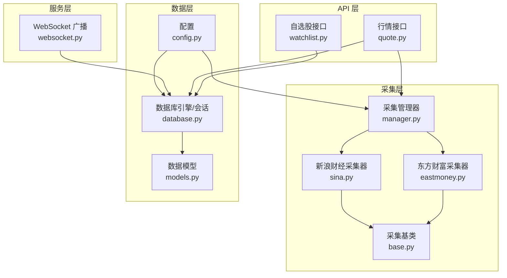
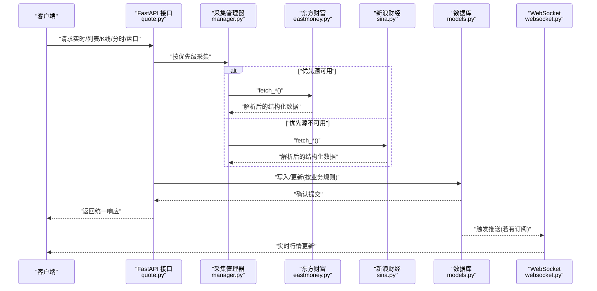
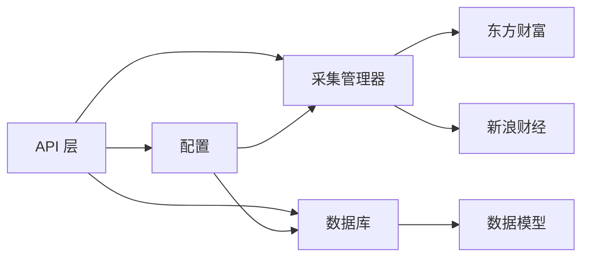

# 数据完整性

<cite>
**本文引用的文件**
- [models.py](file://backend/app/models/models.py)
- [schemas.py](file://backend/app/schemas/schemas.py)
- [database.py](file://backend/app/core/database.py)
- [config.py](file://backend/app/core/config.py)
- [manager.py](file://backend/app/services/collector/manager.py)
- [base.py](file://backend/app/services/collector/base.py)
- [eastmoney.py](file://backend/app/services/collector/eastmoney.py)
- [sina.py](file://backend/app/services/collector/sina.py)
- [quote.py](file://backend/app/api/v1/quote.py)
- [watchlist.py](file://backend/app/api/v1/watchlist.py)
- [websocket.py](file://backend/app/api/websocket.py)
</cite>

## 目录
1. [简介](#简介)
2. [项目结构](#项目结构)
3. [核心组件](#核心组件)
4. [架构总览](#架构总览)
5. [详细组件分析](#详细组件分析)
6. [依赖分析](#依赖分析)
7. [性能考虑](#性能考虑)
8. [故障排查指南](#故障排查指南)
9. [结论](#结论)
10. [附录](#附录)

## 简介
本文件聚焦于 Stock-View 项目在数据完整性方面的策略与实现，覆盖数据库约束、业务规则验证、数据一致性保障、数据同步机制（实时/历史/增量）、数据质量监控与异常处理、以及数据修复工具使用指南。目标读者为数据管理员与后端开发者，帮助构建可审计、可恢复、可扩展的数据治理体系。

## 项目结构
围绕数据完整性，项目的关键模块如下：
- 数据模型层：定义表结构、字段类型与默认值，奠定约束基础
- API 层：统一入口，参数校验与错误码规范
- 采集层：多数据源采集与故障转移，保障数据可用性
- 缓存与广播：Redis 缓存与 WebSocket 实时推送，提升一致性与用户体验
- 配置层：统一管理数据库、缓存、采集间隔等运行参数

图表来源
- [quote.py:1-65](file://backend/app/api/v1/quote.py#L1-L65)
- [watchlist.py:1-77](file://backend/app/api/v1/watchlist.py#L1-L77)
- [manager.py:1-94](file://backend/app/services/collector/manager.py#L1-L94)
- [base.py:1-45](file://backend/app/services/collector/base.py#L1-L45)
- [eastmoney.py:1-297](file://backend/app/services/collector/eastmoney.py#L1-L297)
- [sina.py:1-312](file://backend/app/services/collector/sina.py#L1-L312)
- [websocket.py:1-79](file://backend/app/api/websocket.py#L1-L79)
- [database.py:1-25](file://backend/app/core/database.py#L1-L25)
- [config.py:1-43](file://backend/app/core/config.py#L1-L43)
- [models.py:1-74](file://backend/app/models/models.py#L1-L74)

章节来源
- [quote.py:1-65](file://backend/app/api/v1/quote.py#L1-L65)
- [watchlist.py:1-77](file://backend/app/api/v1/watchlist.py#L1-L77)
- [manager.py:1-94](file://backend/app/services/collector/manager.py#L1-L94)
- [base.py:1-45](file://backend/app/services/collector/base.py#L1-L45)
- [eastmoney.py:1-297](file://backend/app/services/collector/eastmoney.py#L1-L297)
- [sina.py:1-312](file://backend/app/services/collector/sina.py#L1-L312)
- [websocket.py:1-79](file://backend/app/api/websocket.py#L1-L79)
- [database.py:1-25](file://backend/app/core/database.py#L1-L25)
- [config.py:1-43](file://backend/app/core/config.py#L1-L43)
- [models.py:1-74](file://backend/app/models/models.py#L1-L74)

## 核心组件
- 数据模型与约束
  - 使用 SQLAlchemy 定义主键、非空、数值精度、日期时间、布尔等字段，并设置服务器默认值与更新时间戳，形成第一道数据完整性防线
  - 示例路径：[models.py:5-74](file://backend/app/models/models.py#L5-L74)
- API 参数与响应
  - FastAPI 路由参数校验（如范围、长度），统一响应结构，便于前端与监控系统识别错误
  - 示例路径：[quote.py:10-47](file://backend/app/api/v1/quote.py#L10-L47)、[watchlist.py:20-30](file://backend/app/api/v1/watchlist.py#L20-L30)
- 采集与故障转移
  - 多源采集与优先级切换，失败重试与日志记录，确保数据可用性与一致性
  - 示例路径：[manager.py:21-90](file://backend/app/services/collector/manager.py#L21-L90)、[eastmoney.py:41-67](file://backend/app/services/collector/eastmoney.py#L41-L67)、[sina.py:36-62](file://backend/app/services/collector/sina.py#L36-L62)
- 缓存与广播
  - Redis 缓存与 WebSocket 广播，降低数据库压力，保证实时性与一致性
  - 示例路径：[websocket.py:67-79](file://backend/app/api/websocket.py#L67-L79)、[config.py:29-30](file://backend/app/core/config.py#L29-L30)

章节来源
- [models.py:5-74](file://backend/app/models/models.py#L5-L74)
- [quote.py:10-47](file://backend/app/api/v1/quote.py#L10-L47)
- [watchlist.py:20-30](file://backend/app/api/v1/watchlist.py#L20-L30)
- [manager.py:21-90](file://backend/app/services/collector/manager.py#L21-L90)
- [eastmoney.py:41-67](file://backend/app/services/collector/eastmoney.py#L41-L67)
- [sina.py:36-62](file://backend/app/services/collector/sina.py#L36-L62)
- [websocket.py:67-79](file://backend/app/api/websocket.py#L67-L79)
- [config.py:29-30](file://backend/app/core/config.py#L29-L30)

## 架构总览
下图展示从 API 到采集、存储与实时推送的全链路，强调数据完整性在各环节的落点与协同。

图表来源
- [quote.py:7-65](file://backend/app/api/v1/quote.py#L7-L65)
- [manager.py:21-90](file://backend/app/services/collector/manager.py#L21-L90)
- [eastmoney.py:69-297](file://backend/app/services/collector/eastmoney.py#L69-L297)
- [sina.py:64-312](file://backend/app/services/collector/sina.py#L64-L312)
- [models.py:5-74](file://backend/app/models/models.py#L5-L74)
- [websocket.py:67-79](file://backend/app/api/websocket.py#L67-L79)

## 详细组件分析

### 数据模型与数据库约束
- 字段与约束要点
  - 主键：所有表均定义自增主键，确保唯一标识
  - 非空：多处字段声明非空，防止空值污染
  - 数值精度：价格/涨跌幅/换手率等使用高精度数值类型，避免舍入误差
  - 时间戳：自动插入与更新时间，便于审计与排序
  - 示例路径：[models.py:8-19](file://backend/app/models/models.py#L8-L19)、[models.py:25-37](file://backend/app/models/models.py#L25-L37)、[models.py:43-47](file://backend/app/models/models.py#L43-L47)、[models.py:53-59](file://backend/app/models/models.py#L53-L59)、[models.py:65-74](file://backend/app/models/models.py#L65-L74)
- 建议补充
  - 对于跨表关联字段（如 symbol、user_id），可在数据库层面增加外键约束以强一致
  - 对于枚举类业务字段（如市场、周期、复权类型），建议通过约束或检查约束限定取值范围
  - 对于历史表，建议按日期分区，提高查询与归档效率

章节来源
- [models.py:5-74](file://backend/app/models/models.py#L5-L74)

### API 参数与业务规则验证
- 参数校验
  - 路由参数范围与长度限制，避免异常输入导致系统异常
  - 示例路径：[quote.py:10-47](file://backend/app/api/v1/quote.py#L10-L47)、[watchlist.py:20-30](file://backend/app/api/v1/watchlist.py#L20-L30)
- 响应结构
  - 统一响应体包含状态码与消息，便于前端与监控系统识别错误
  - 示例路径：[schemas.py:7-10](file://backend/app/schemas/schemas.py#L7-L10)、[schemas.py:30-32](file://backend/app/schemas/schemas.py#L30-L32)
- 业务规则
  - 自选股去重：同一用户下重复添加返回明确错误码
  - 示例路径：[watchlist.py:32-40](file://backend/app/api/v1/watchlist.py#L32-L40)

章节来源
- [quote.py:10-47](file://backend/app/api/v1/quote.py#L10-L47)
- [watchlist.py:32-40](file://backend/app/api/v1/watchlist.py#L32-L40)
- [schemas.py:7-10](file://backend/app/schemas/schemas.py#L7-L10)
- [schemas.py:30-32](file://backend/app/schemas/schemas.py#L30-L32)

### 采集层与数据一致性
- 故障转移与重试
  - 采集管理器按优先级尝试多个数据源；每个采集器内置指数退避重试与异常捕获
  - 示例路径：[manager.py:21-90](file://backend/app/services/collector/manager.py#L21-L90)、[eastmoney.py:41-67](file://backend/app/services/collector/eastmoney.py#L41-L67)、[sina.py:36-62](file://backend/app/services/collector/sina.py#L36-L62)
- 解析与清洗
  - 采集器对返回数据进行结构化解析，缺失字段填充默认值，异常数据记录日志
  - 示例路径：[eastmoney.py:78-85](file://backend/app/services/collector/eastmoney.py#L78-L85)、[sina.py:70-77](file://backend/app/services/collector/sina.py#L70-L77)
- 一致性保障
  - 同步写入数据库与异步广播，结合事务与幂等设计，避免脏读与重复推送
  - 示例路径：[quote.py:7-16](file://backend/app/api/v1/quote.py#L7-L16)、[websocket.py:67-79](file://backend/app/api/websocket.py#L67-L79)

章节来源
- [manager.py:21-90](file://backend/app/services/collector/manager.py#L21-L90)
- [eastmoney.py:41-67](file://backend/app/services/collector/eastmoney.py#L41-L67)
- [sina.py:36-62](file://backend/app/services/collector/sina.py#L36-L62)
- [quote.py:7-16](file://backend/app/api/v1/quote.py#L7-L16)
- [websocket.py:67-79](file://backend/app/api/websocket.py#L67-L79)

### 数据同步机制
- 实时数据更新
  - WebSocket 订阅与广播，按符号与频道推送增量更新
  - 示例路径：[websocket.py:39-79](file://backend/app/api/websocket.py#L39-L79)
- 历史数据归档
  - 建议将日频行情与分钟级行情分离存储，日表用于归档，分钟表用于实时
  - 示例路径：[models.py:22-48](file://backend/app/models/models.py#L22-L48)
- 增量更新策略
  - 基于时间窗口与游标增量抓取，避免全量扫描
  - 示例路径：[eastmoney.py:157-167](file://backend/app/services/collector/eastmoney.py#L157-L167)、[sina.py:183-191](file://backend/app/services/collector/sina.py#L183-L191)

章节来源
- [websocket.py:39-79](file://backend/app/api/websocket.py#L39-L79)
- [models.py:22-48](file://backend/app/models/models.py#L22-L48)
- [eastmoney.py:157-167](file://backend/app/services/collector/eastmoney.py#L157-L167)
- [sina.py:183-191](file://backend/app/services/collector/sina.py#L183-L191)

### 数据质量监控与异常处理
- 日志与告警
  - 采集器对网络异常、解析失败、空数据等情况记录警告/错误日志
  - 示例路径：[eastmoney.py:49-67](file://backend/app/services/collector/eastmoney.py#L49-L67)、[sina.py:43-62](file://backend/app/services/collector/sina.py#L43-L62)
- 错误码规范
  - API 层返回统一错误码，便于前端与监控系统识别与处理
  - 示例路径：[quote.py:31-33](file://backend/app/api/v1/quote.py#L31-L33)、[quote.py:45-47](file://backend/app/api/v1/quote.py#L45-L47)
- 异常数据处理
  - 当采集源返回空数据或解析失败时，返回空结果或错误信息，避免污染下游
  - 示例路径：[manager.py:32-33](file://backend/app/services/collector/manager.py#L32-L33)、[manager.py:46-47](file://backend/app/services/collector/manager.py#L46-L47)

章节来源
- [eastmoney.py:49-67](file://backend/app/services/collector/eastmoney.py#L49-L67)
- [sina.py:43-62](file://backend/app/services/collector/sina.py#L43-L62)
- [quote.py:31-33](file://backend/app/api/v1/quote.py#L31-L33)
- [quote.py:45-47](file://backend/app/api/v1/quote.py#L45-L47)
- [manager.py:32-33](file://backend/app/services/collector/manager.py#L32-L33)
- [manager.py:46-47](file://backend/app/services/collector/manager.py#L46-L47)

### 数据修复工具使用指南
- 建议流程
  - 快速定位：基于日志与错误码定位问题数据源与时间窗口
  - 校验清单：核对字段非空、数值范围、时间戳合法性
  - 修复执行：针对缺失或异常数据，采用重试采集或手动补录
  - 回放验证：对修复数据进行回放与交叉验证
- 工具与脚本
  - 建议编写数据校验脚本与修复脚本，结合数据库事务与幂等设计，确保修复过程可追溯
  - 建议使用批处理与增量修复相结合的方式，减少对线上服务的影响

[本节为通用实践指导，无需特定文件引用]

## 依赖分析
- 组件耦合
  - API 层依赖采集管理器与数据库会话；采集层依赖抽象基类与具体采集器；数据模型作为契约贯穿全链路
- 外部依赖
  - 数据库：PostgreSQL（通过 asyncpg）
  - 缓存：Redis（用于会话与AI分析缓存）
  - 数据源：东方财富与新浪财经
- 配置集中化
  - 通过配置类统一管理数据库、缓存、采集间隔、缓存 TTL 等参数

图表来源
- [quote.py:1-65](file://backend/app/api/v1/quote.py#L1-L65)
- [manager.py:1-94](file://backend/app/services/collector/manager.py#L1-L94)
- [eastmoney.py:1-297](file://backend/app/services/collector/eastmoney.py#L1-L297)
- [sina.py:1-312](file://backend/app/services/collector/sina.py#L1-L312)
- [database.py:1-25](file://backend/app/core/database.py#L1-L25)
- [config.py:1-43](file://backend/app/core/config.py#L1-L43)
- [models.py:1-74](file://backend/app/models/models.py#L1-L74)

章节来源
- [quote.py:1-65](file://backend/app/api/v1/quote.py#L1-L65)
- [manager.py:1-94](file://backend/app/services/collector/manager.py#L1-L94)
- [eastmoney.py:1-297](file://backend/app/services/collector/eastmoney.py#L1-L297)
- [sina.py:1-312](file://backend/app/services/collector/sina.py#L1-L312)
- [database.py:1-25](file://backend/app/core/database.py#L1-L25)
- [config.py:1-43](file://backend/app/core/config.py#L1-L43)
- [models.py:1-74](file://backend/app/models/models.py#L1-L74)

## 性能考虑
- 连接池与并发
  - 数据库连接池大小与溢出配置需结合业务峰值合理设置
  - 示例路径：[database.py:7-8](file://backend/app/core/database.py#L7-L8)
- 缓存策略
  - 通过 Redis 缓存热点数据，降低数据库压力；合理设置 TTL，避免陈旧数据
  - 示例路径：[config.py:29-30](file://backend/app/core/config.py#L29-L30)
- 采集频率与限流
  - 控制采集间隔与并发度，避免触发上游限流或封禁
  - 示例路径：[config.py:29-30](file://backend/app/core/config.py#L29-L30)、[eastmoney.py:32-39](file://backend/app/services/collector/eastmoney.py#L32-L39)、[sina.py:27-34](file://backend/app/services/collector/sina.py#L27-L34)

章节来源
- [database.py:7-8](file://backend/app/core/database.py#L7-L8)
- [config.py:29-30](file://backend/app/core/config.py#L29-L30)
- [eastmoney.py:32-39](file://backend/app/services/collector/eastmoney.py#L32-L39)
- [sina.py:27-34](file://backend/app/services/collector/sina.py#L27-L34)

## 故障排查指南
- 常见问题与定位
  - 数据为空：检查采集器是否返回空数据，查看日志警告；确认参数合法性与数据源可用性
    - 示例路径：[manager.py:28-29](file://backend/app/services/collector/manager.py#L28-L29)、[manager.py:42-43](file://backend/app/services/collector/manager.py#L42-L43)
  - 解析失败：检查返回格式与字段映射，确认异常捕获与日志级别
    - 示例路径：[eastmoney.py:83-85](file://backend/app/services/collector/eastmoney.py#L83-L85)、[sina.py:105-107](file://backend/app/services/collector/sina.py#L105-L107)
  - 写入失败：检查数据库连接、事务与约束冲突，必要时回滚并重试
    - 示例路径：[database.py:15-20](file://backend/app/core/database.py#L15-L20)
- 快速修复步骤
  - 重试采集 → 校验数据 → 手动修复 → 回放验证 → 观察日志

章节来源
- [manager.py:28-29](file://backend/app/services/collector/manager.py#L28-L29)
- [manager.py:42-43](file://backend/app/services/collector/manager.py#L42-L43)
- [eastmoney.py:83-85](file://backend/app/services/collector/eastmoney.py#L83-L85)
- [sina.py:105-107](file://backend/app/services/collector/sina.py#L105-L107)
- [database.py:15-20](file://backend/app/core/database.py#L15-L20)

## 结论
Stock-View 在数据完整性方面形成了“模型约束 + API 校验 + 采集重试 + 缓存广播”的闭环：数据库层提供结构化约束，API 层进行参数与响应规范化，采集层通过多源与重试保障可用性，缓存与广播提升一致性与实时性。建议后续在数据库层面补充外键与检查约束，在业务层细化字段范围校验，并建立完善的监控与修复流程，持续优化数据质量与治理能力。

## 附录
- 关键实现路径索引
  - 数据模型与约束：[models.py:5-74](file://backend/app/models/models.py#L5-L74)
  - API 参数与响应：[quote.py:10-47](file://backend/app/api/v1/quote.py#L10-L47)、[watchlist.py:20-30](file://backend/app/api/v1/watchlist.py#L20-L30)、[schemas.py:7-10](file://backend/app/schemas/schemas.py#L7-L10)
  - 采集与故障转移：[manager.py:21-90](file://backend/app/services/collector/manager.py#L21-L90)、[eastmoney.py:41-67](file://backend/app/services/collector/eastmoney.py#L41-L67)、[sina.py:36-62](file://backend/app/services/collector/sina.py#L36-L62)
  - 缓存与广播：[websocket.py:67-79](file://backend/app/api/websocket.py#L67-L79)、[config.py:29-30](file://backend/app/core/config.py#L29-L30)
  - 数据库与配置：[database.py:1-25](file://backend/app/core/database.py#L1-L25)、[config.py:1-43](file://backend/app/core/config.py#L1-L43)