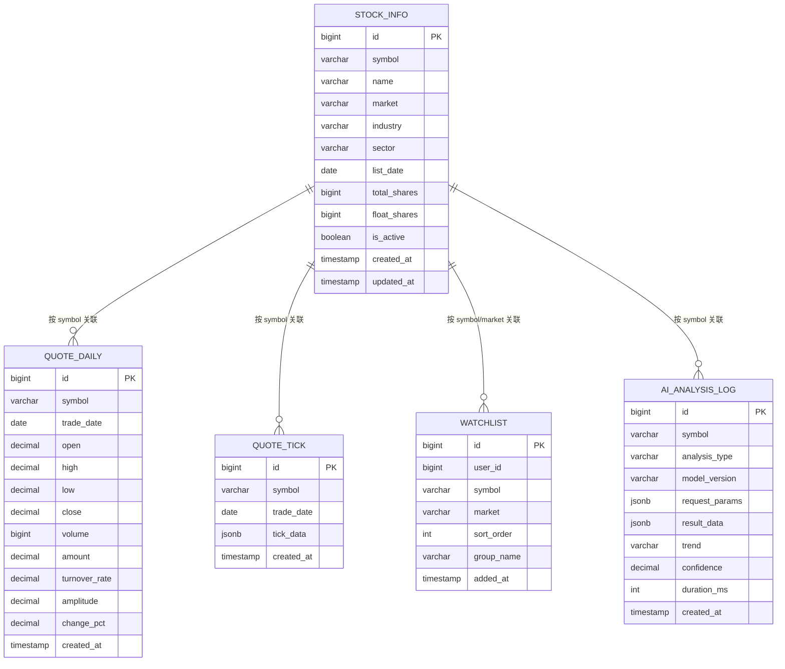
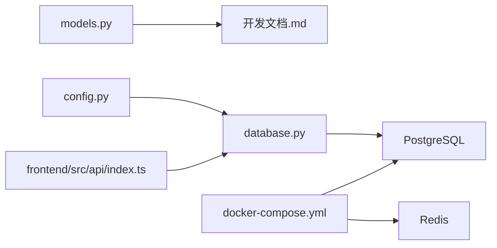

# 数据库设计

<cite>
**本文引用的文件**
- [开发文档.md](file://Stock-View 软件开发文档/开发文档.md)
- [models.py](file://backend/app/models/models.py)
- [database.py](file://backend/app/core/database.py)
- [config.py](file://backend/app/core/config.py)
- [requirements.txt](file://backend/requirements.txt)
- [index.ts](file://frontend/src/api/index.ts)
- [docker-compose.yml](file://docker-compose.yml)
</cite>

## 目录
1. [简介](#简介)
2. [项目结构](#项目结构)
3. [核心组件](#核心组件)
4. [架构总览](#架构总览)
5. [详细组件分析](#详细组件分析)
6. [依赖分析](#依赖分析)
7. [性能考虑](#性能考虑)
8. [故障排查指南](#故障排查指南)
9. [结论](#结论)
10. [附录](#附录)

## 简介
本文件面向Stock-View项目的PostgreSQL数据库设计，系统梳理整体架构与各数据表的设计理念，覆盖表结构设计原则、字段类型选择、索引策略、约束规则、主键/外键关系、唯一性约束、默认值设置等数据库设计最佳实践。同时结合现有SQL定义与ORM模型映射，给出性能优化建议（查询索引、分区策略、数据压缩）、版本管理与迁移（基于Alembic）、以及备份恢复策略的实施指南。

## 项目结构
数据库层由以下关键部分组成：
- ORM模型层：定义各业务实体的字段、类型与默认值
- 数据库连接与初始化：异步引擎、会话管理、首次创建表
- 配置层：数据库连接串、调试开关、池大小等
- 文档层：完整的DDL定义、索引与分区策略说明
- 前端API层：调用后端接口，间接驱动数据库访问
- 容器编排：Docker Compose中PostgreSQL与Redis服务定义

```mermaid
graph TB
subgraph "后端"
CFG["配置<br/>config.py"]
ENG["异步引擎/会话<br/>database.py"]
ORM["ORM模型<br/>models.py"]
DOC["数据库设计文档<br/>开发文档.md"]
end
subgraph "前端"
API["API封装<br/>frontend/src/api/index.ts"]
end
subgraph "基础设施"
PG["PostgreSQL 15+"]
RD["Redis 7+"]
DC["Docker Compose"]
end
API --> ENG
CFG --> ENG
ENG --> ORM
ORM --> PG
DOC --> PG
DC --> PG
DC --> RD
```

图表来源
- [config.py:12](file://backend/app/core/config.py#L12)
- [database.py:7](file://backend/app/core/database.py#L7)
- [models.py:1-74](file://backend/app/models/models.py#L1-L74)
- [开发文档.md:969-1107](file://Stock-View 软件开发文档/开发文档.md#L969-L1107)
- [docker-compose.yml:1956-1977](file://docker-compose.yml#L1956-L1977)

章节来源
- [config.py:12](file://backend/app/core/config.py#L12)
- [database.py:7](file://backend/app/core/database.py#L7)
- [models.py:1-74](file://backend/app/models/models.py#L1-L74)
- [开发文档.md:969-1107](file://Stock-View 软件开发文档/开发文档.md#L969-L1107)
- [docker-compose.yml:1956-1977](file://docker-compose.yml#L1956-L1977)

## 核心组件
- stock_info 股票基本信息表：存储股票代码、名称、市场、行业、板块、上市日期、股本等静态信息，并维护唯一性约束与常用索引。
- quote_daily 日线行情表：存储日K线OHLC、成交量、成交额、换手率、振幅、涨跌幅等，支持按月分区与复合索引。
- quote_tick 分时tick数据表：以JSONB存储当日分时点位与昨收，便于灵活扩展与高效检索。
- watchlist 自选股表：支持用户维度的自选股集合、排序与分组，具备用户索引。
- ai_analysis_log AI分析日志表：记录分析类型、模型版本、请求参数、结果、趋势、置信度、耗时与时间戳，具备符号与时间索引。

章节来源
- [models.py:5-38](file://backend/app/models/models.py#L5-L38)
- [models.py:40-47](file://backend/app/models/models.py#L40-L47)
- [models.py:50-59](file://backend/app/models/models.py#L50-L59)
- [models.py:62-74](file://backend/app/models/models.py#L62-L74)
- [开发文档.md:975-1107](file://Stock-View 软件开发文档/开发文档.md#L975-L1107)

## 架构总览
数据库层采用“ORM模型 + 异步连接 + DDL定义”的组合方式：
- ORM模型定义字段与默认值，确保Python侧一致性
- Alembic用于版本化迁移（通过requirements中依赖体现）
- DDL定义在文档中明确表结构、索引与分区策略
- 前端通过API触发后端查询，间接驱动数据库访问

图表来源
- [models.py:5-38](file://backend/app/models/models.py#L5-L38)
- [models.py:40-47](file://backend/app/models/models.py#L40-L47)
- [models.py:50-59](file://backend/app/models/models.py#L50-L59)
- [models.py:62-74](file://backend/app/models/models.py#L62-L74)
- [开发文档.md:975-1107](file://Stock-View 软件开发文档/开发文档.md#L975-L1107)

## 详细组件分析

### stock_info 股票基本信息表
- 设计理念
  - 存储股票静态元数据，如代码、名称、市场、行业、板块、上市日期、股本等
  - 使用唯一性约束保证同一市场下股票代码唯一
  - 提供常用过滤索引：按代码、行业、是否活跃
- 字段类型与约束
  - 符号与市场组合唯一；布尔字段is_active默认True；时间戳created_at/updated_at默认当前时间
- 索引策略
  - 对symbol、industry、is_active建立独立索引，提升筛选效率
- 默认值与更新机制
  - created_at与updated_at使用服务器默认值；updated_at在更新时自动刷新

章节来源
- [models.py:8-19](file://backend/app/models/models.py#L8-L19)
- [开发文档.md:975-995](file://Stock-View 软件开发文档/开发文档.md#L975-L995)

### quote_daily 日线行情表
- 设计理念
  - 存储日K线OHLC、成交量、成交额、换手率、振幅、涨跌幅等
  - 支持按月分区，便于历史数据归档与维护
- 字段类型与约束
  - symbol与trade_date组合唯一；数值精度满足价格与金额存储需求
- 索引策略
  - 复合索引(symbol, trade_date)与单列索引(trade_date)，兼顾范围查询与日期过滤
- 分区策略
  - 按交易日期进行月级分区，便于冷热数据分离与批量维护

章节来源
- [models.py:25-37](file://backend/app/models/models.py#L25-L37)
- [开发文档.md:999-1026](file://Stock-View 软件开发文档/开发文档.md#L999-L1026)

### quote_tick 分时tick数据表
- 设计理念
  - 以JSONB存储当日分时点位数组与昨收，结构灵活、扩展性强
  - 适合高频写入场景，避免大量重复列
- 字段类型与约束
  - symbol与trade_date组合唯一；tick_data为JSONB类型
- 索引策略
  - 唯一性约束可作为隐式索引；可根据查询模式增加必要索引

章节来源
- [models.py:43-47](file://backend/app/models/models.py#L43-L47)
- [开发文档.md:1051-1070](file://Stock-View 软件开发文档/开发文档.md#L1051-L1070)

### watchlist 自选股表
- 设计理念
  - 支持用户维度的自选股集合，具备排序与分组能力
  - 未来可扩展到多用户体系（当前默认user_id为1）
- 字段类型与约束
  - user_id、symbol、market三者唯一；sort_order默认0；group_name默认"default"
- 索引策略
  - 对user_id建立索引，加速用户自选股查询

章节来源
- [models.py:53-59](file://backend/app/models/models.py#L53-L59)
- [开发文档.md:1074-1087](file://Stock-View 软件开发文档/开发文档.md#L1074-L1087)

### ai_analysis_log AI分析日志表
- 设计理念
  - 记录AI分析过程的关键指标：类型、模型版本、请求参数、结果、趋势、置信度、耗时、时间戳
  - JSONB字段便于保留原始请求与结果，利于审计与回放
- 字段类型与约束
  - symbol、analysis_type、model_version非空；置信度与耗时为数值类型
- 索引策略
  - 对symbol与created_at分别建立索引，支持按股票与时间检索

章节来源
- [models.py:65-74](file://backend/app/models/models.py#L65-L74)
- [开发文档.md:1091-1107](file://Stock-View 软件开发文档/开发文档.md#L1091-L1107)

### 数据库连接与初始化
- 异步引擎与连接池
  - 使用异步引擎与会话工厂，池大小与溢出配置满足高并发场景
- 初始化流程
  - 通过Base.metadata.create_all创建所有表结构
- 配置来源
  - DATABASE_URL来自环境变量，支持开发与容器化部署

章节来源
- [database.py:7](file://backend/app/core/database.py#L7)
- [database.py:23-25](file://backend/app/core/database.py#L23-L25)
- [config.py:12](file://backend/app/core/config.py#L12)

## 依赖分析
- ORM与数据库
  - models.py中的类映射到PostgreSQL表，字段类型与默认值保持一致
- 文档与实现
  - 开发文档中的DDL与models.py字段定义相互印证，确保设计一致性
- 前端与后端
  - 前端API封装调用后端接口，间接驱动数据库查询
- 基础设施
  - Docker Compose定义PostgreSQL与Redis服务，提供稳定运行环境

图表来源
- [models.py:1-74](file://backend/app/models/models.py#L1-L74)
- [开发文档.md:969-1107](file://Stock-View 软件开发文档/开发文档.md#L969-L1107)
- [config.py:12](file://backend/app/core/config.py#L12)
- [database.py:7](file://backend/app/core/database.py#L7)
- [index.ts:1-33](file://frontend/src/api/index.ts#L1-L33)
- [docker-compose.yml:1956-1977](file://docker-compose.yml#L1956-L1977)

章节来源
- [models.py:1-74](file://backend/app/models/models.py#L1-L74)
- [开发文档.md:969-1107](file://Stock-View 软件开发文档/开发文档.md#L969-L1107)
- [config.py:12](file://backend/app/core/config.py#L12)
- [database.py:7](file://backend/app/core/database.py#L7)
- [index.ts:1-33](file://frontend/src/api/index.ts#L1-L33)
- [docker-compose.yml:1956-1977](file://docker-compose.yml#L1956-L1977)

## 性能考虑
- 查询索引设计
  - stock_info：对symbol、industry、is_active建立索引，提升筛选效率
  - quote_daily：复合索引(symbol, trade_date)与单列索引(trade_date)，兼顾范围与日期过滤
  - quote_tick：基于查询模式可考虑在symbol或trade_date上增加索引
  - watchlist：对user_id建立索引，加速用户自选股查询
  - ai_analysis_log：对symbol与created_at建立索引，支持按股票与时间检索
- 分区策略
  - quote_daily已定义月级分区，建议按需滚动创建后续分区，配合归档与清理策略
- 数据压缩与存储
  - JSONB字段（quote_tick.tick_data、ai_analysis_log.request_params/result_data）可利用PostgreSQL压缩特性，结合查询模式评估是否启用压缩
- 连接池与并发
  - 异步引擎与合理池大小配置有助于提升吞吐；注意监控慢查询与锁竞争
- 缓存协同
  - Redis用于实时行情与热点数据缓存，减少数据库压力

章节来源
- [开发文档.md:992-994](file://Stock-View 软件开发文档/开发文档.md#L992-L994)
- [开发文档.md:1024-1025](file://Stock-View 软件开发文档/开发文档.md#L1024-L1025)
- [开发文档.md:1058](file://Stock-View 软件开发文档/开发文档.md#L1058)
- [开发文档.md:1086](file://Stock-View 软件开发文档/开发文档.md#L1086)
- [开发文档.md:1105-1106](file://Stock-View 软件开发文档/开发文档.md#L1105-L1106)

## 故障排查指南
- 连接问题
  - 检查DATABASE_URL配置与网络连通性；确认PostgreSQL服务已启动且端口开放
- 权限与认证
  - 确认数据库用户密码正确，具备创建表与索引权限
- 表结构不一致
  - 若出现字段缺失或类型不匹配，优先对比models.py与开发文档中的DDL定义
- 性能问题
  - 使用EXPLAIN ANALYZE分析慢查询，检查索引是否被使用；根据查询模式调整索引或分区
- 数据一致性
  - 对于唯一性约束冲突（如stock_info、quote_daily、quote_tick、watchlist），需检查插入逻辑与去重策略

章节来源
- [config.py:12](file://backend/app/core/config.py#L12)
- [database.py:7](file://backend/app/core/database.py#L7)
- [models.py:8-19](file://backend/app/models/models.py#L8-L19)
- [models.py:25-37](file://backend/app/models/models.py#L25-L37)
- [models.py:43-47](file://backend/app/models/models.py#L43-L47)
- [models.py:53-59](file://backend/app/models/models.py#L53-L59)
- [models.py:65-74](file://backend/app/models/models.py#L65-L74)

## 结论
本数据库设计围绕“静态信息+行情数据+用户行为+分析日志”四大维度展开，采用PostgreSQL的强类型与JSONB灵活性，结合索引与分区策略，满足高性能与可维护性的双重目标。通过Alembic版本化管理与容器化部署，可实现稳定的演进与运维。建议在生产环境中持续监控慢查询、定期维护索引与分区，并制定完善的备份与恢复策略。

## 附录

### 数据库版本管理与迁移（基于Alembic）
- 依赖与安装
  - 在requirements.txt中已声明Alembic依赖，可用于生成与执行迁移脚本
- 建议流程
  - 修改models.py后，使用Alembic自动生成差异迁移；在测试环境验证后再上线
  - 迁移脚本应包含升级与降级操作，确保回滚安全
- 配置与执行
  - 将DATABASE_URL配置到Alembic环境，确保与应用一致
  - 执行迁移前先备份数据库，迁移后验证数据完整性

章节来源
- [requirements.txt:5](file://backend/requirements.txt#L5)
- [config.py:12](file://backend/app/core/config.py#L12)

### 备份与恢复策略
- 备份
  - 使用pg_dump进行逻辑备份，按天/周生成快照；对quote_daily等大表可结合分区策略进行增量备份
- 恢复
  - 通过pg_restore进行恢复；在测试环境验证后再对生产执行
- 高可用
  - 结合Docker Compose中的卷挂载，确保数据持久化；必要时引入主从复制或托管服务

章节来源
- [docker-compose.yml:1956-1977](file://docker-compose.yml#L1956-L1977)