# 数据模型

<cite>
**本文引用的文件**
- [models.py](file://backend/app/models/models.py)
- [schemas.py](file://backend/app/schemas/schemas.py)
- [database.py](file://backend/app/core/database.py)
- [config.py](file://backend/app/core/config.py)
- [redis.py](file://backend/app/core/redis.py)
- [base.py](file://backend/app/services/collector/base.py)
- [eastmoney.py](file://backend/app/services/collector/eastmoney.py)
- [sina.py](file://backend/app/services/collector/sina.py)
- [manager.py](file://backend/app/services/collector/manager.py)
- [quote.py](file://backend/app/api/v1/quote.py)
- [watchlist.py](file://backend/app/api/v1/watchlist.py)
- [stock.py](file://backend/app/api/v1/stock.py)
- [ai.py](file://backend/app/api/v1/ai.py)
- [main.py](file://backend/app/main.py)
- [requirements.txt](file://backend/requirements.txt)
- [README.md](file://README.md)
</cite>

## 目录
1. [简介](#简介)
2. [项目结构](#项目结构)
3. [核心组件](#核心组件)
4. [架构总览](#架构总览)
5. [详细组件分析](#详细组件分析)
6. [依赖分析](#依赖分析)
7. [性能考虑](#性能考虑)
8. [故障排查指南](#故障排查指南)
9. [结论](#结论)
10. [附录](#附录)

## 简介
本文件系统性梳理 Stock-View 的数据模型设计，围绕 SQLAlchemy 2.0 ORM 模型、Pydantic 数据验证模型、数据库迁移与索引、查询性能优化、数据生命周期与缓存策略展开。重点覆盖以下模型与流程：
- 股票基本信息模型：stock_info
- 行情数据模型：quote_daily、quote_tick
- 自选股模型：watchlist
- AI 分析日志模型：ai_analysis_log
- 行情采集与故障转移：CollectorManager + BaseCollector + 东方财富/新浪财经
- API 层对数据模型的使用：自选股 CRUD、行情查询、股票搜索、AI 分析
- 数据库初始化、Redis 缓存、配置管理

## 项目结构
后端采用分层组织：核心配置与数据库连接、模型定义、Pydantic 数据验证、采集器与管理器、API 路由。

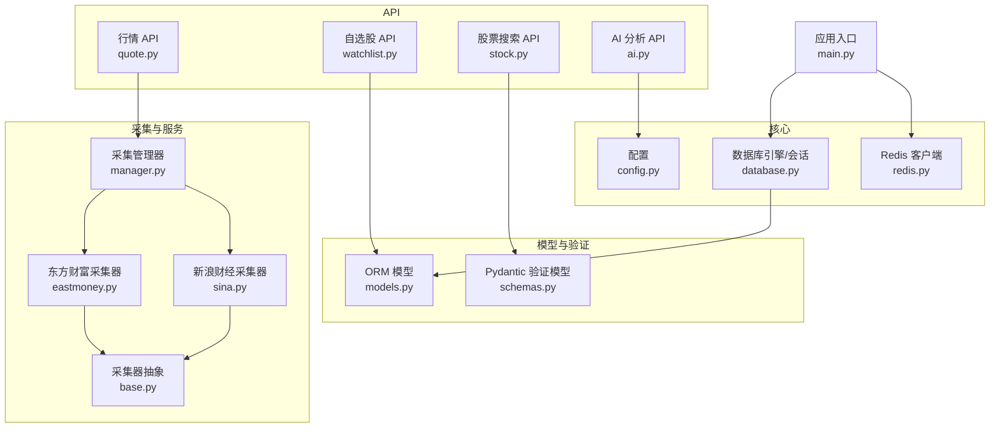

**图表来源**
- [main.py:13-48](file://backend/app/main.py#L13-L48)
- [database.py:1-25](file://backend/app/core/database.py#L1-L25)
- [redis.py:1-25](file://backend/app/core/redis.py#L1-L25)
- [models.py:1-74](file://backend/app/models/models.py#L1-L74)
- [schemas.py:1-103](file://backend/app/schemas/schemas.py#L1-L103)
- [base.py:1-45](file://backend/app/services/collector/base.py#L1-L45)
- [eastmoney.py:1-297](file://backend/app/services/collector/eastmoney.py#L1-L297)
- [sina.py:1-312](file://backend/app/services/collector/sina.py#L1-L312)
- [manager.py:1-94](file://backend/app/services/collector/manager.py#L1-L94)
- [quote.py:1-65](file://backend/app/api/v1/quote.py#L1-L65)
- [watchlist.py:1-77](file://backend/app/api/v1/watchlist.py#L1-L77)
- [stock.py:1-37](file://backend/app/api/v1/stock.py#L1-L37)
- [ai.py:1-29](file://backend/app/api/v1/ai.py#L1-L29)

**章节来源**
- [README.md:92-126](file://README.md#L92-L126)
- [requirements.txt:1-17](file://backend/requirements.txt#L1-L17)

## 核心组件
- 数据库引擎与会话：异步 SQLAlchemy 2.0，连接池配置，会话生命周期管理，应用启动时初始化元数据。
- ORM 模型：stock_info、quote_daily、quote_tick、watchlist、ai_analysis_log。
- Pydantic 模型：统一响应包装、行情/自选/AI 等请求与响应结构。
- 采集器体系：BaseCollector 抽象 + 东方财富/新浪财经具体实现 + CollectorManager 故障转移。
- API 层：自选股 CRUD、行情查询、股票搜索、AI 分析；统一响应结构。

**章节来源**
- [database.py:1-25](file://backend/app/core/database.py#L1-L25)
- [models.py:1-74](file://backend/app/models/models.py#L1-L74)
- [schemas.py:1-103](file://backend/app/schemas/schemas.py#L1-L103)
- [base.py:1-45](file://backend/app/services/collector/base.py#L1-L45)
- [manager.py:1-94](file://backend/app/services/collector/manager.py#L1-L94)
- [watchlist.py:1-77](file://backend/app/api/v1/watchlist.py#L1-L77)
- [quote.py:1-65](file://backend/app/api/v1/quote.py#L1-L65)
- [stock.py:1-37](file://backend/app/api/v1/stock.py#L1-L37)
- [ai.py:1-29](file://backend/app/api/v1/ai.py#L1-L29)

## 架构总览
下图展示数据模型在系统中的位置与交互：

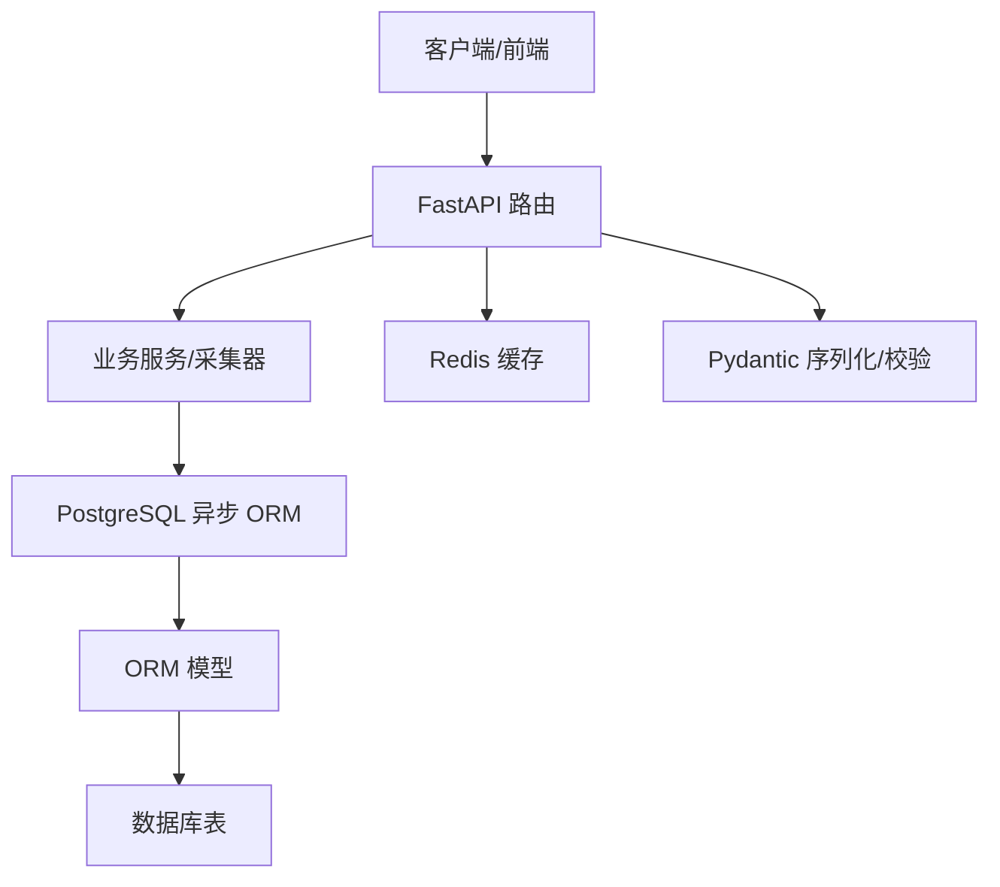

**图表来源**
- [main.py:22-48](file://backend/app/main.py#L22-L48)
- [database.py:1-25](file://backend/app/core/database.py#L1-L25)
- [models.py:1-74](file://backend/app/models/models.py#L1-L74)
- [schemas.py:1-103](file://backend/app/schemas/schemas.py#L1-L103)
- [redis.py:1-25](file://backend/app/core/redis.py#L1-L25)

## 详细组件分析

### 股票基本信息模型（stock_info）
- 表名：stock_info
- 字段要点：主键自增、股票代码、名称、市场、行业、板块、上市日期、总股本、流通股本、是否有效、创建/更新时间戳。
- 约束与默认：布尔字段默认启用，时间字段使用服务器默认值。
- 设计意图：存储股票基础档案，作为行情与自选股关联的基础。

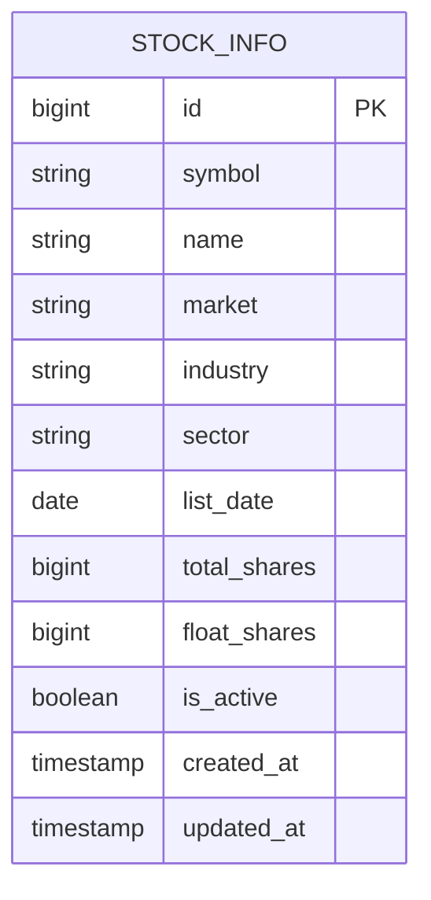

**图表来源**
- [models.py:5-20](file://backend/app/models/models.py#L5-L20)

**章节来源**
- [models.py:5-20](file://backend/app/models/models.py#L5-L20)

### 日线行情模型（quote_daily）
- 表名：quote_daily
- 字段要点：主键自增、股票代码、交易日、开盘/最高/最低/收盘价（数值精度）、成交量、成交额、换手率、振幅、涨跌幅、创建时间。
- 设计意图：按日归集行情，便于回测与统计分析。

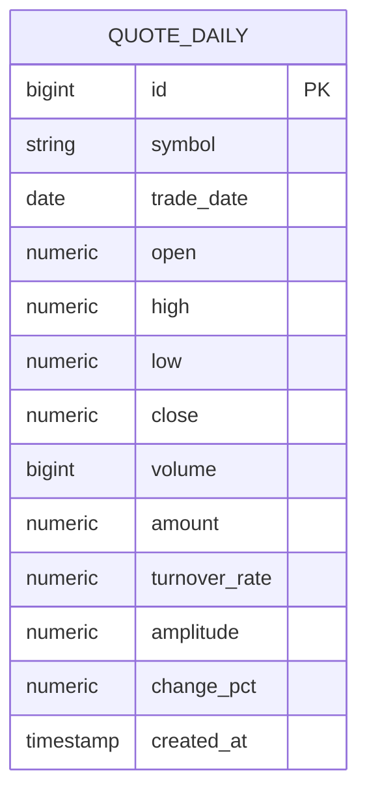

**图表来源**
- [models.py:22-38](file://backend/app/models/models.py#L22-L38)

**章节来源**
- [models.py:22-38](file://backend/app/models/models.py#L22-L38)

### 分时/逐笔模型（quote_tick）
- 表名：quote_tick
- 字段要点：主键自增、股票代码、交易日、tick_data（JSON 字符串）、创建时间。
- 设计意图：以文本形式保存原始分时/逐笔 JSON，便于扩展与兼容不同数据源格式。

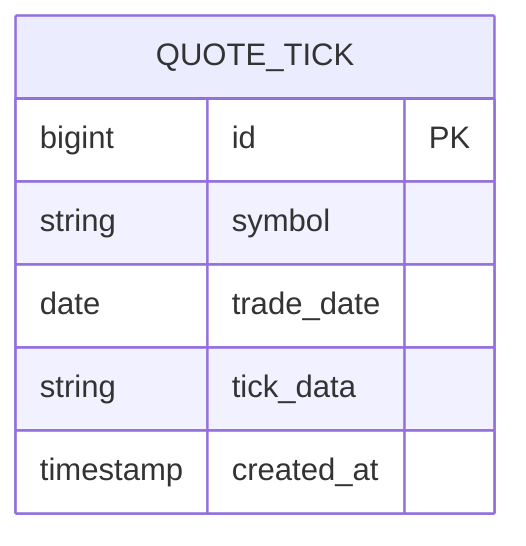

**图表来源**
- [models.py:40-48](file://backend/app/models/models.py#L40-L48)

**章节来源**
- [models.py:40-48](file://backend/app/models/models.py#L40-L48)

### 自选股模型（watchlist）
- 表名：watchlist
- 字段要点：主键自增、用户标识、股票代码、市场、排序序号、分组名、添加时间。
- 设计意图：记录用户关注的股票清单，支持排序与分组。

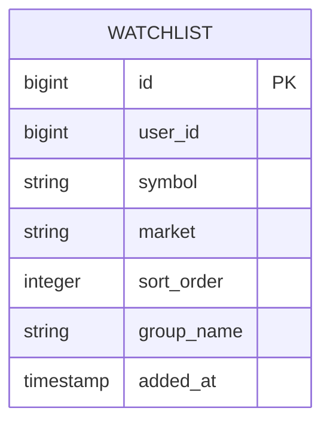

**图表来源**
- [models.py:50-60](file://backend/app/models/models.py#L50-L60)

**章节来源**
- [models.py:50-60](file://backend/app/models/models.py#L50-L60)

### AI 分析日志模型（ai_analysis_log）
- 表名：ai_analysis_log
- 字段要点：主键自增、股票代码、分析类型、模型版本、请求参数（JSON）、结果数据（JSON）、趋势、置信度、耗时、创建时间。
- 设计意图：记录 AI 分析过程与结果，便于审计与重放。

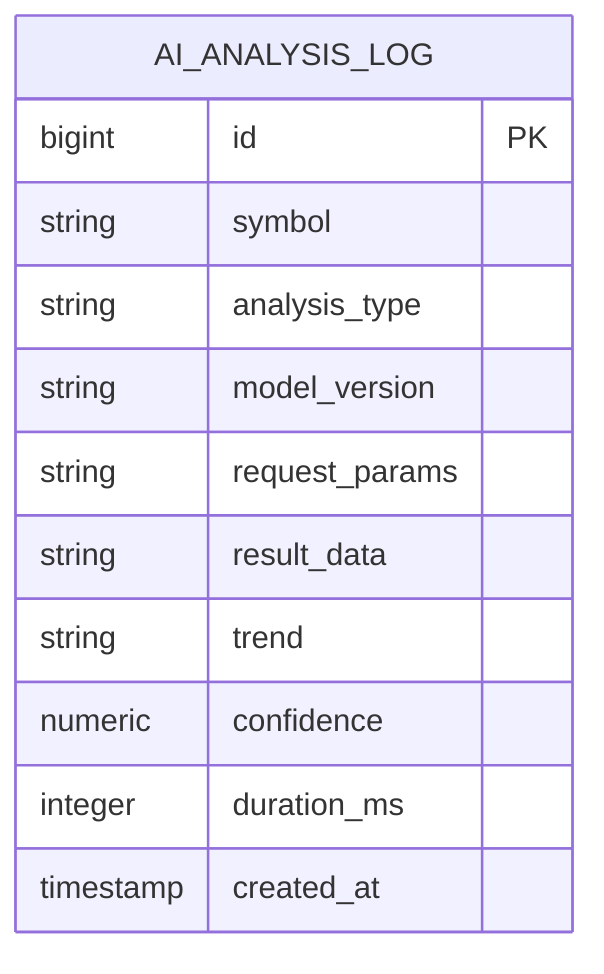

**图表来源**
- [models.py:62-74](file://backend/app/models/models.py#L62-L74)

**章节来源**
- [models.py:62-74](file://backend/app/models/models.py#L62-L74)

### Pydantic 数据验证模型
- 统一响应包装：ResponseBase（code/message），用于所有 API 响应。
- 行情相关：QuoteItem、KlineItem、TimelinePoint、OrderBookLevel；以及对应响应容器。
- 自选股相关：WatchlistAddRequest、WatchlistSortItem、WatchlistSortRequest。
- AI 相关：AIAnalysisRequest、AIAnalysisResponse。
- 设计意图：通过强类型与自动序列化/反序列化，确保请求参数校验与响应一致性。

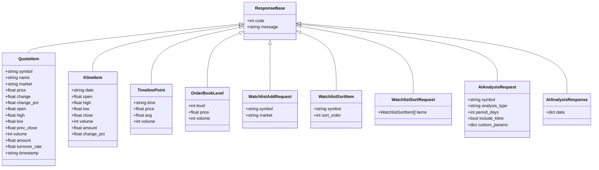

**图表来源**
- [schemas.py:6-103](file://backend/app/schemas/schemas.py#L6-L103)

**章节来源**
- [schemas.py:6-103](file://backend/app/schemas/schemas.py#L6-L103)

### 数据采集与故障转移
- BaseCollector：定义 fetch_quote/fetch_quote_list/fetch_kline/fetch_timeline/fetch_orderbook 抽象方法，并提供辅助函数生成 secid 与市场前缀。
- EastMoneyCollector/SinaCollector：实现具体采集逻辑，包含请求重试、超时控制、数据解析与字段映射。
- CollectorManager：按优先级依次尝试数据源，遇到空数据或异常则切换下一个，最终失败则返回 None。

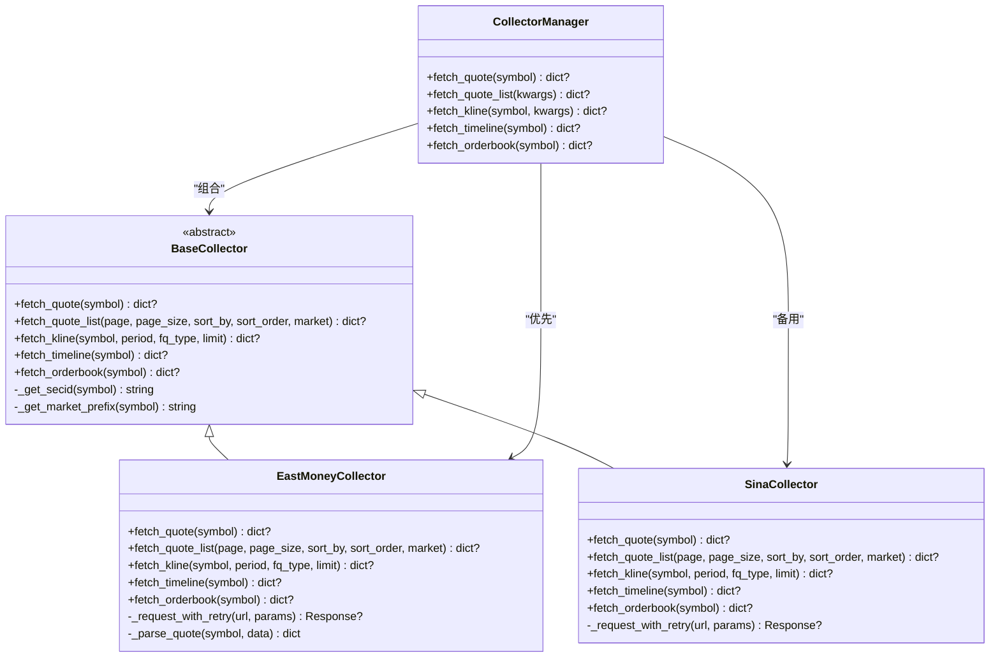

**图表来源**
- [base.py:5-45](file://backend/app/services/collector/base.py#L5-L45)
- [eastmoney.py:26-297](file://backend/app/services/collector/eastmoney.py#L26-L297)
- [sina.py:24-312](file://backend/app/services/collector/sina.py#L24-L312)
- [manager.py:12-94](file://backend/app/services/collector/manager.py#L12-L94)

**章节来源**
- [base.py:1-45](file://backend/app/services/collector/base.py#L1-L45)
- [eastmoney.py:1-297](file://backend/app/services/collector/eastmoney.py#L1-L297)
- [sina.py:1-312](file://backend/app/services/collector/sina.py#L1-L312)
- [manager.py:1-94](file://backend/app/services/collector/manager.py#L1-L94)

### API 层与数据模型交互
- 自选股 API：查询、新增、删除、排序，直接操作 watchlist 模型。
- 行情 API：实时、列表、K线、分时、盘口，通过 CollectorManager 获取数据。
- 股票搜索 API：调用外部接口返回标准化结构。
- AI 分析 API：根据配置选择适配器并返回分析结果。

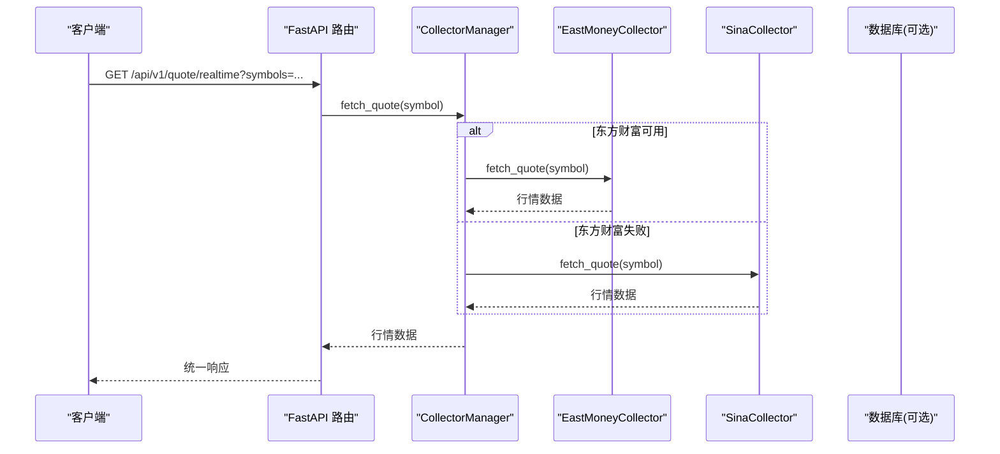

**图表来源**
- [quote.py:7-16](file://backend/app/api/v1/quote.py#L7-L16)
- [manager.py:21-33](file://backend/app/services/collector/manager.py#L21-L33)
- [eastmoney.py:69-86](file://backend/app/services/collector/eastmoney.py#L69-L86)
- [sina.py:64-107](file://backend/app/services/collector/sina.py#L64-L107)

**章节来源**
- [watchlist.py:13-77](file://backend/app/api/v1/watchlist.py#L13-L77)
- [quote.py:1-65](file://backend/app/api/v1/quote.py#L1-L65)
- [stock.py:10-37](file://backend/app/api/v1/stock.py#L10-L37)
- [ai.py:10-29](file://backend/app/api/v1/ai.py#L10-L29)

## 依赖分析
- 数据库：SQLAlchemy 2.0 异步引擎 + asyncpg，连接池大小与溢出配置。
- 缓存：Redis 异步客户端，全局连接池。
- 校验：Pydantic 2.6，配合 pydantic-settings 管理配置。
- 采集：httpx 异步 HTTP 客户端，限流与重试策略。
- 认证：jose + passlib，JWT 密钥与密码哈希。

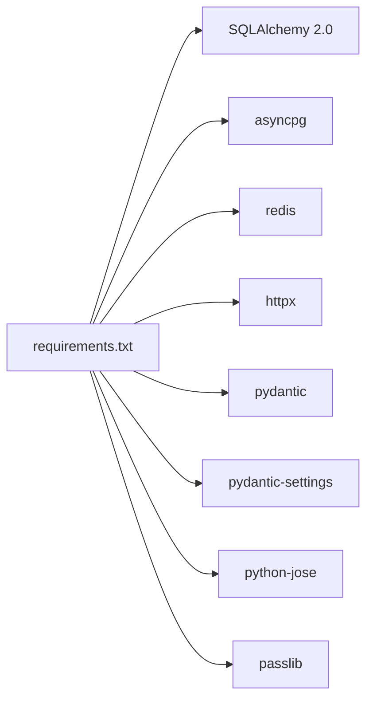

**图表来源**
- [requirements.txt:1-17](file://backend/requirements.txt#L1-L17)

**章节来源**
- [requirements.txt:1-17](file://backend/requirements.txt#L1-L17)
- [config.py:1-43](file://backend/app/core/config.py#L1-L43)

## 性能考虑
- 数据库连接池：连接池大小与溢出参数需结合并发与硬件资源评估，避免连接争用。
- 查询路径：行情 API 通过 CollectorManager 优先使用主数据源，失败自动降级，减少单点风险。
- 缓存策略：Redis 用于热点数据与短期分析结果缓存，结合 TTL 控制过期。
- 索引优化：建议为高频查询字段建立索引（如 watchlist.user_id/symbol、quote_daily.symbol/trade_date）。
- 批量与分页：行情列表与自选股排序应限制批量大小，避免一次性加载过多数据。
- IO 优化：采集器使用异步 HTTP 客户端与重试退避，降低网络抖动影响。

[本节为通用指导，无需特定文件引用]

## 故障排查指南
- 数据库初始化失败：检查 DATABASE_URL 与数据库权限，确认应用生命周期中 init_db 已执行。
- Redis 连接异常：核对 REDIS_URL，确认 Redis 服务可达，注意连接池复用。
- 行情为空：检查 CollectorManager 优先级与数据源可用性，查看采集器日志与重试次数。
- 自选股重复添加：新增前先查询是否存在相同 user_id+symbol，避免重复。
- AI 分析异常：确认 AI_ADAPTER 配置与服务地址，检查超时与缓存开关。

**章节来源**
- [database.py:23-25](file://backend/app/core/database.py#L23-L25)
- [redis.py:10-25](file://backend/app/core/redis.py#L10-L25)
- [manager.py:21-33](file://backend/app/services/collector/manager.py#L21-L33)
- [watchlist.py:32-51](file://backend/app/api/v1/watchlist.py#L32-L51)
- [config.py:19-24](file://backend/app/core/config.py#L19-L24)

## 结论
本数据模型以 SQLAlchemy 2.0 异步 ORM 为核心，结合 Pydantic 提供强类型的请求/响应校验，配合多数据源采集与故障转移机制，形成稳定高效的行情与用户数据处理链路。建议在生产环境中完善索引、缓存与监控，持续优化查询与采集性能。

[本节为总结，无需特定文件引用]

## 附录
- 环境变量与默认值：见配置模块与 README 中的环境变量说明。
- 常用命令：Docker Compose 一键启动、本地开发模式、前端/后端启动方式。

**章节来源**
- [config.py:5-43](file://backend/app/core/config.py#L5-L43)
- [README.md:130-142](file://README.md#L130-L142)
- [README.md:146-162](file://README.md#L146-L162)