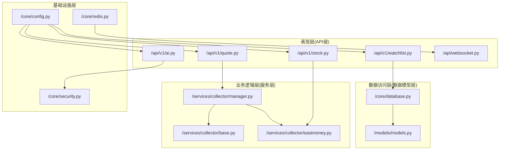
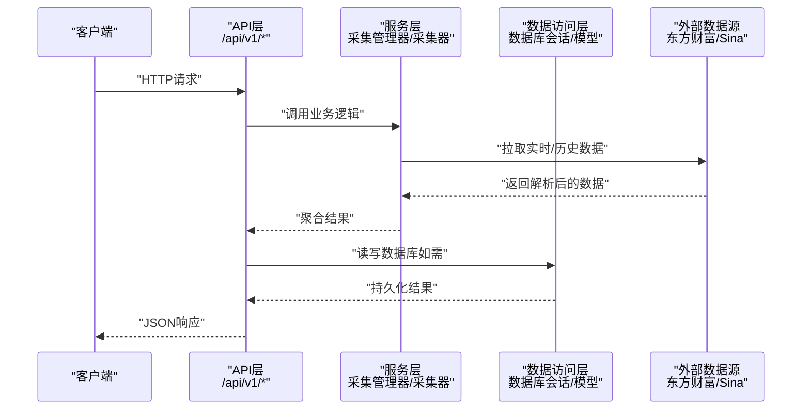
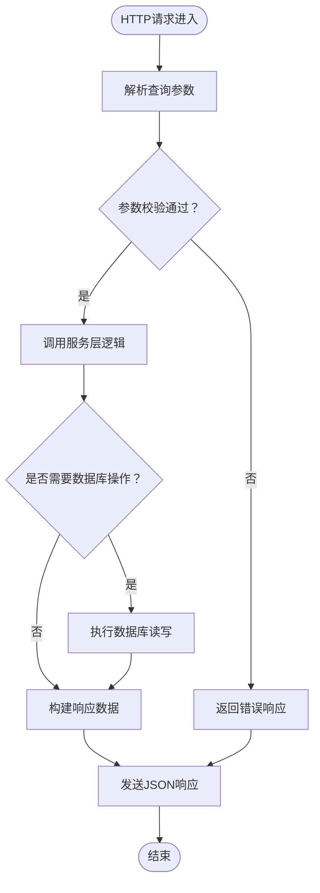
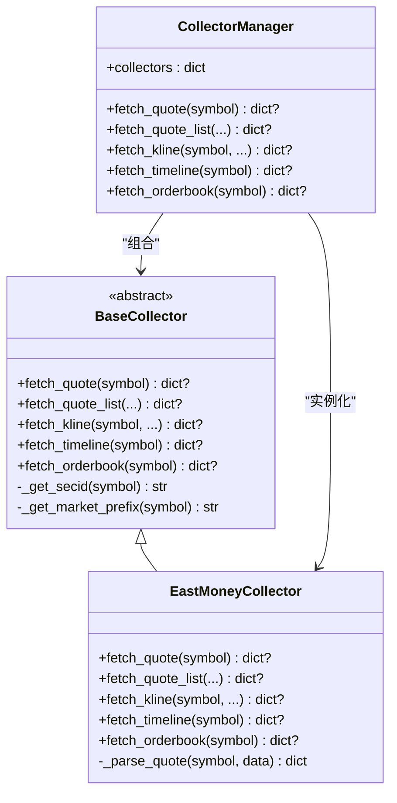
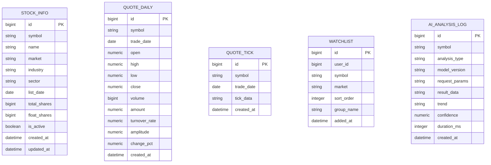
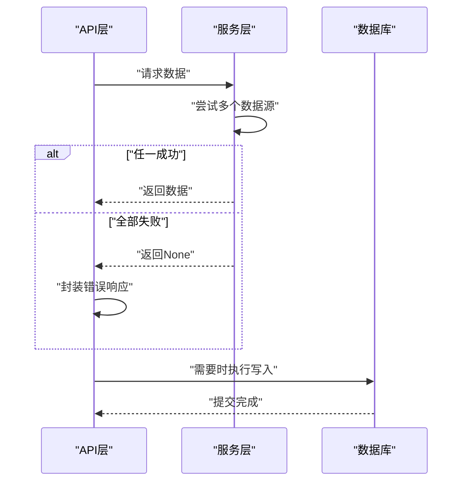
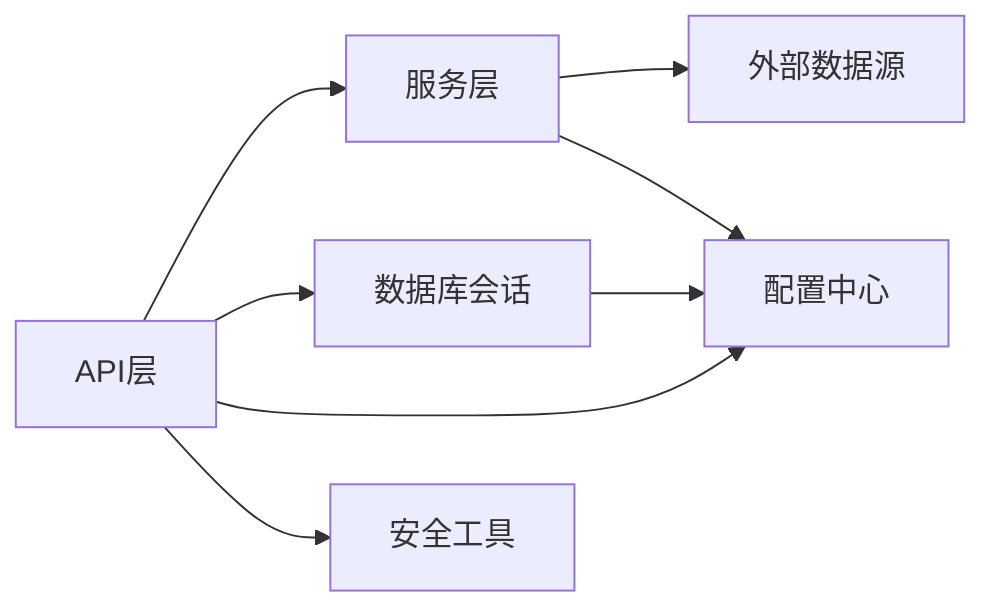

# 分层架构设计

<cite>
**本文档引用的文件**
- [backend/app/main.py](file://backend/app/main.py)
- [backend/app/api/v1/quote.py](file://backend/app/api/v1/quote.py)
- [backend/app/api/v1/stock.py](file://backend/app/api/v1/stock.py)
- [backend/app/api/v1/watchlist.py](file://backend/app/api/v1/watchlist.py)
- [backend/app/api/v1/ai.py](file://backend/app/api/v1/ai.py)
- [backend/app/api/websocket.py](file://backend/app/api/websocket.py)
- [backend/app/services/collector/manager.py](file://backend/app/services/collector/manager.py)
- [backend/app/services/collector/base.py](file://backend/app/services/collector/base.py)
- [backend/app/services/collector/eastmoney.py](file://backend/app/services/collector/eastmoney.py)
- [backend/app/models/models.py](file://backend/app/models/models.py)
- [backend/app/schemas/schemas.py](file://backend/app/schemas/schemas.py)
- [backend/app/core/database.py](file://backend/app/core/database.py)
- [backend/app/core/config.py](file://backend/app/core/config.py)
- [backend/app/core/redis.py](file://backend/app/core/redis.py)
- [backend/app/core/security.py](file://backend/app/core/security.py)
</cite>

## 目录
1. [引言](#引言)
2. [项目结构](#项目结构)
3. [核心组件](#核心组件)
4. [架构总览](#架构总览)
5. [详细组件分析](#详细组件分析)
6. [依赖分析](#依赖分析)
7. [性能考虑](#性能考虑)
8. [故障排查指南](#故障排查指南)
9. [结论](#结论)

## 引言
本文件面向Stock-View项目，系统化阐述其分层架构设计：表现层（API层）、业务逻辑层（服务层）、数据访问层（数据模型层）。文档将明确各层职责边界、接口规范、依赖关系，梳理从HTTP请求到数据库操作的完整处理链路，并总结分层架构在关注点分离、可测试性、可维护性等方面的优势。

## 项目结构
后端采用FastAPI作为Web框架，按功能域组织模块，形成清晰的分层结构：
- 表现层（API层）：位于app/api/v1，负责HTTP路由注册、参数校验、响应封装
- 业务逻辑层（服务层）：位于app/services，包含数据采集器抽象与实现、采集管理器等
- 数据访问层（数据模型层）：位于app/models与app/core/database，提供ORM模型与数据库会话管理
- 基础设施层：位于app/core，包含配置、Redis连接、安全工具等

图表来源
- [backend/app/api/v1/quote.py:1-65](file://backend/app/api/v1/quote.py#L1-L65)
- [backend/app/api/v1/stock.py:1-37](file://backend/app/api/v1/stock.py#L1-L37)
- [backend/app/api/v1/watchlist.py:1-77](file://backend/app/api/v1/watchlist.py#L1-L77)
- [backend/app/api/v1/ai.py:1-29](file://backend/app/api/v1/ai.py#L1-L29)
- [backend/app/api/websocket.py:1-79](file://backend/app/api/websocket.py#L1-L79)
- [backend/app/services/collector/manager.py:1-80](file://backend/app/services/collector/manager.py#L1-L80)
- [backend/app/services/collector/base.py:1-45](file://backend/app/services/collector/base.py#L1-L45)
- [backend/app/services/collector/eastmoney.py:1-240](file://backend/app/services/collector/eastmoney.py#L1-L240)
- [backend/app/core/database.py:1-25](file://backend/app/core/database.py#L1-L25)
- [backend/app/models/models.py:1-74](file://backend/app/models/models.py#L1-L74)
- [backend/app/core/config.py:1-43](file://backend/app/core/config.py#L1-L43)
- [backend/app/core/redis.py:1-25](file://backend/app/core/redis.py#L1-L25)

章节来源
- [backend/app/main.py:1-48](file://backend/app/main.py#L1-L48)

## 核心组件
- 应用入口与生命周期：FastAPI应用在主程序中初始化，注册CORS中间件与路由，通过lifespan管理数据库初始化与Redis关闭
- 配置中心：集中管理数据库、Redis、AI服务、JWT、定时任务等配置项
- 数据库会话：提供异步引擎与会话工厂，统一数据库连接与生命周期管理
- 数据模型：基于SQLAlchemy ORM定义StockInfo、QuoteDaily、QuoteTick、Watchlist、AIAnalysisLog等表结构
- 请求模型：Pydantic模型定义通用响应结构与各接口输入输出结构
- 采集器体系：抽象基类定义统一接口，具体实现（如东方财富）负责对接第三方数据源
- 采集管理器：负责多数据源优先级与故障转移，提升可用性
- WebSocket：提供行情推送能力，结合Redis实现消息广播

章节来源
- [backend/app/main.py:1-48](file://backend/app/main.py#L1-L48)
- [backend/app/core/config.py:1-43](file://backend/app/core/config.py#L1-L43)
- [backend/app/core/database.py:1-25](file://backend/app/core/database.py#L1-L25)
- [backend/app/models/models.py:1-74](file://backend/app/models/models.py#L1-L74)
- [backend/app/schemas/schemas.py:1-103](file://backend/app/schemas/schemas.py#L1-L103)
- [backend/app/services/collector/base.py:1-45](file://backend/app/services/collector/base.py#L1-L45)
- [backend/app/services/collector/manager.py:1-80](file://backend/app/services/collector/manager.py#L1-L80)
- [backend/app/services/collector/eastmoney.py:1-240](file://backend/app/services/collector/eastmoney.py#L1-L240)
- [backend/app/api/websocket.py:1-79](file://backend/app/api/websocket.py#L1-L79)

## 架构总览
下图展示从HTTP请求到数据库操作的完整处理链路，体现分层职责与调用方向：

图表来源
- [backend/app/api/v1/quote.py:1-65](file://backend/app/api/v1/quote.py#L1-L65)
- [backend/app/api/v1/watchlist.py:1-77](file://backend/app/api/v1/watchlist.py#L1-L77)
- [backend/app/services/collector/manager.py:1-80](file://backend/app/services/collector/manager.py#L1-L80)
- [backend/app/services/collector/eastmoney.py:1-240](file://backend/app/services/collector/eastmoney.py#L1-L240)
- [backend/app/core/database.py:1-25](file://backend/app/core/database.py#L1-L25)
- [backend/app/models/models.py:1-74](file://backend/app/models/models.py#L1-L74)

## 详细组件分析

### 表现层（API层）职责与实现
- 路由注册：在应用启动时注册各模块路由，统一前缀/api/v1
- 参数校验：使用Query装饰器进行参数约束与默认值设置
- 响应封装：统一返回包含code、message、data的结构
- WebSocket：提供订阅/退订与心跳机制，支持行情广播

图表来源
- [backend/app/api/v1/quote.py:7-16](file://backend/app/api/v1/quote.py#L7-L16)
- [backend/app/api/v1/watchlist.py:13-26](file://backend/app/api/v1/watchlist.py#L13-L26)
- [backend/app/api/websocket.py:39-64](file://backend/app/api/websocket.py#L39-L64)

章节来源
- [backend/app/main.py:38-43](file://backend/app/main.py#L38-L43)
- [backend/app/api/v1/quote.py:1-65](file://backend/app/api/v1/quote.py#L1-L65)
- [backend/app/api/v1/stock.py:1-37](file://backend/app/api/v1/stock.py#L1-L37)
- [backend/app/api/v1/watchlist.py:1-77](file://backend/app/api/v1/watchlist.py#L1-L77)
- [backend/app/api/v1/ai.py:1-29](file://backend/app/api/v1/ai.py#L1-L29)
- [backend/app/api/websocket.py:1-79](file://backend/app/api/websocket.py#L1-L79)

### 业务逻辑层（服务层）职责与实现
- 抽象接口：定义fetch_quote、fetch_quote_list、fetch_kline、fetch_timeline、fetch_orderbook等方法
- 具体实现：以东方财富采集器为例，负责构造请求参数、调用第三方接口、解析响应并转换为统一格式
- 管理器：按优先级尝试多个数据源，实现故障转移；记录日志并返回可用数据

图表来源
- [backend/app/services/collector/base.py:1-45](file://backend/app/services/collector/base.py#L1-L45)
- [backend/app/services/collector/eastmoney.py:1-240](file://backend/app/services/collector/eastmoney.py#L1-L240)
- [backend/app/services/collector/manager.py:1-80](file://backend/app/services/collector/manager.py#L1-L80)

章节来源
- [backend/app/services/collector/base.py:1-45](file://backend/app/services/collector/base.py#L1-L45)
- [backend/app/services/collector/eastmoney.py:1-240](file://backend/app/services/collector/eastmoney.py#L1-L240)
- [backend/app/services/collector/manager.py:1-80](file://backend/app/services/collector/manager.py#L1-L80)

### 数据访问层（数据模型层）职责与实现
- 数据库会话：提供异步引擎与会话工厂，支持连接池配置与自动关闭
- ORM模型：定义StockInfo、QuoteDaily、QuoteTick、Watchlist、AIAnalysisLog等表结构
- 依赖注入：通过FastAPI依赖注入获取数据库会话，确保作用域内一致性

图表来源
- [backend/app/models/models.py:1-74](file://backend/app/models/models.py#L1-L74)
- [backend/app/core/database.py:1-25](file://backend/app/core/database.py#L1-L25)

章节来源
- [backend/app/core/database.py:1-25](file://backend/app/core/database.py#L1-L25)
- [backend/app/models/models.py:1-74](file://backend/app/models/models.py#L1-L74)
- [backend/app/api/v1/watchlist.py:13-26](file://backend/app/api/v1/watchlist.py#L13-L26)

### 层间通信机制与错误传播策略
- 层间通信：API层通过依赖注入获取数据库会话；服务层通过采集器接口解耦具体实现；配置中心为各层提供统一参数
- 错误传播：API层对服务层返回None或异常时，返回统一错误码与提示；服务层内部捕获异常并记录日志，向上返回None以触发降级
- 事务管理：数据库操作通过异步会话管理，提交/回滚在API层显式调用，保证原子性

图表来源
- [backend/app/api/v1/quote.py:31-33](file://backend/app/api/v1/quote.py#L31-L33)
- [backend/app/services/collector/manager.py:21-32](file://backend/app/services/collector/manager.py#L21-L32)
- [backend/app/api/v1/watchlist.py:48-51](file://backend/app/api/v1/watchlist.py#L48-L51)

章节来源
- [backend/app/api/v1/quote.py:31-33](file://backend/app/api/v1/quote.py#L31-L33)
- [backend/app/services/collector/manager.py:21-32](file://backend/app/services/collector/manager.py#L21-L32)
- [backend/app/api/v1/watchlist.py:48-51](file://backend/app/api/v1/watchlist.py#L48-L51)

## 依赖分析
- 组件耦合：API层仅依赖服务层接口与数据库会话；服务层依赖抽象采集器；数据库层独立于上层
- 外部依赖：HTTP客户端用于第三方数据源；Redis用于WebSocket广播；SQLAlchemy用于ORM
- 配置依赖：所有关键行为（超时、缓存、限流、JWT）由配置中心统一管理

图表来源
- [backend/app/api/v1/quote.py:1-65](file://backend/app/api/v1/quote.py#L1-L65)
- [backend/app/services/collector/manager.py:1-80](file://backend/app/services/collector/manager.py#L1-L80)
- [backend/app/core/config.py:1-43](file://backend/app/core/config.py#L1-L43)
- [backend/app/core/database.py:1-25](file://backend/app/core/database.py#L1-L25)
- [backend/app/core/security.py:1-30](file://backend/app/core/security.py#L1-L30)

章节来源
- [backend/app/core/config.py:1-43](file://backend/app/core/config.py#L1-L43)
- [backend/app/core/database.py:1-25](file://backend/app/core/database.py#L1-L25)
- [backend/app/core/security.py:1-30](file://backend/app/core/security.py#L1-L30)

## 性能考虑
- 异步I/O：数据库与HTTP请求均采用异步实现，降低阻塞，提升并发吞吐
- 连接池：数据库连接池与HTTP客户端连接池减少资源创建开销
- 缓存与限流：配置中心提供AI缓存TTL与限流参数，服务层可据此优化调用频率
- 故障转移：采集管理器按优先级切换数据源，避免单点故障导致全链路降级

## 故障排查指南
- 数据源不可用：检查采集器日志与网络连通性；确认采集管理器是否正确切换至备用数据源
- 数据库连接问题：核对DATABASE_URL与连接池配置；确认会话生命周期与异常处理
- WebSocket断连：检查Redis连接与广播逻辑；验证订阅集合与消息序列化
- JWT与认证：核对密钥与算法配置；验证令牌签名与过期时间

章节来源
- [backend/app/services/collector/manager.py:21-32](file://backend/app/services/collector/manager.py#L21-L32)
- [backend/app/core/database.py:15-20](file://backend/app/core/database.py#L15-L20)
- [backend/app/api/websocket.py:67-79](file://backend/app/api/websocket.py#L67-L79)
- [backend/app/core/security.py:18-30](file://backend/app/core/security.py#L18-L30)

## 结论
Stock-View采用清晰的分层架构：表现层专注接口与协议，业务逻辑层专注数据采集与编排，数据访问层专注持久化与事务，基础设施层提供配置与支撑。该架构实现了关注点分离、良好的可测试性与可维护性，并通过异步I/O、连接池、故障转移与统一配置提升了系统性能与稳定性。