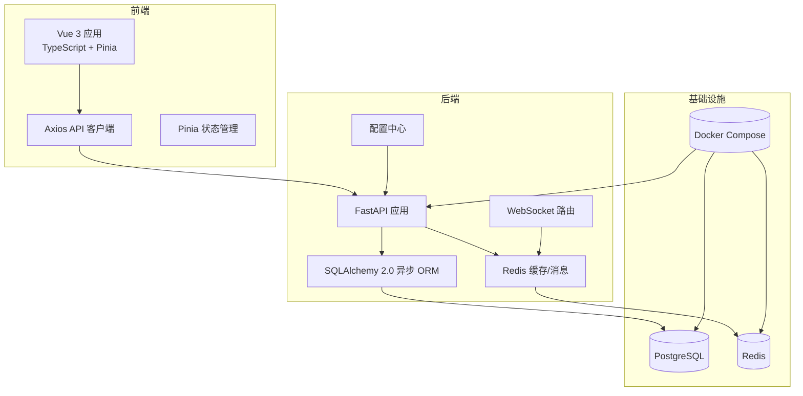
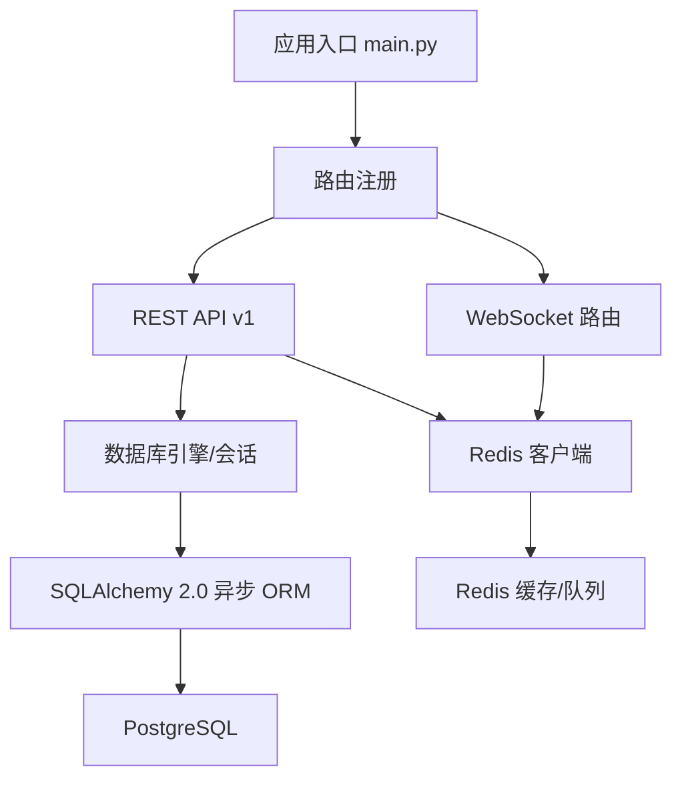
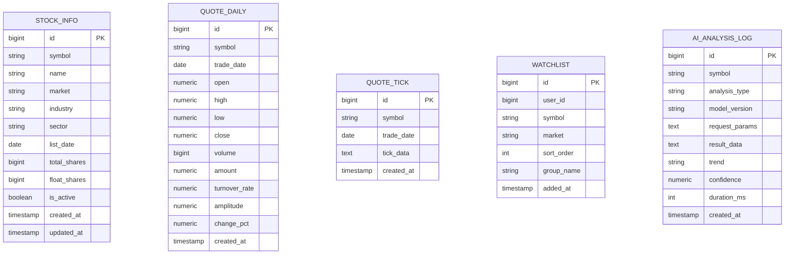
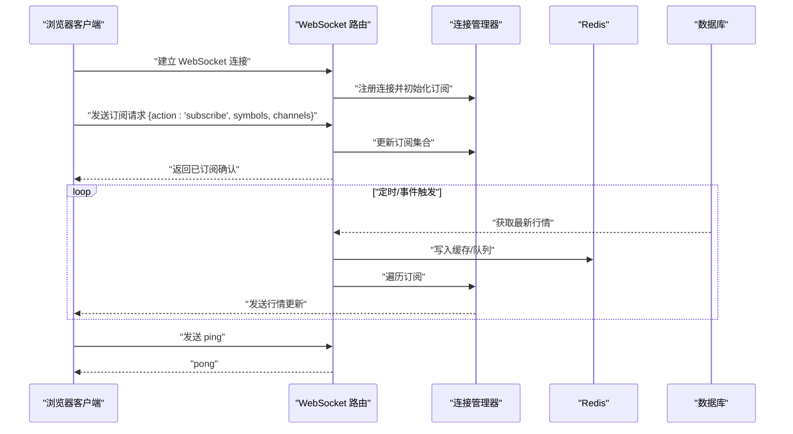
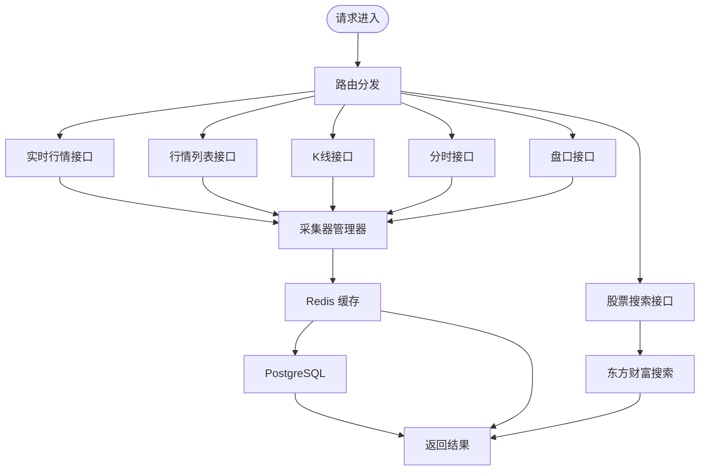
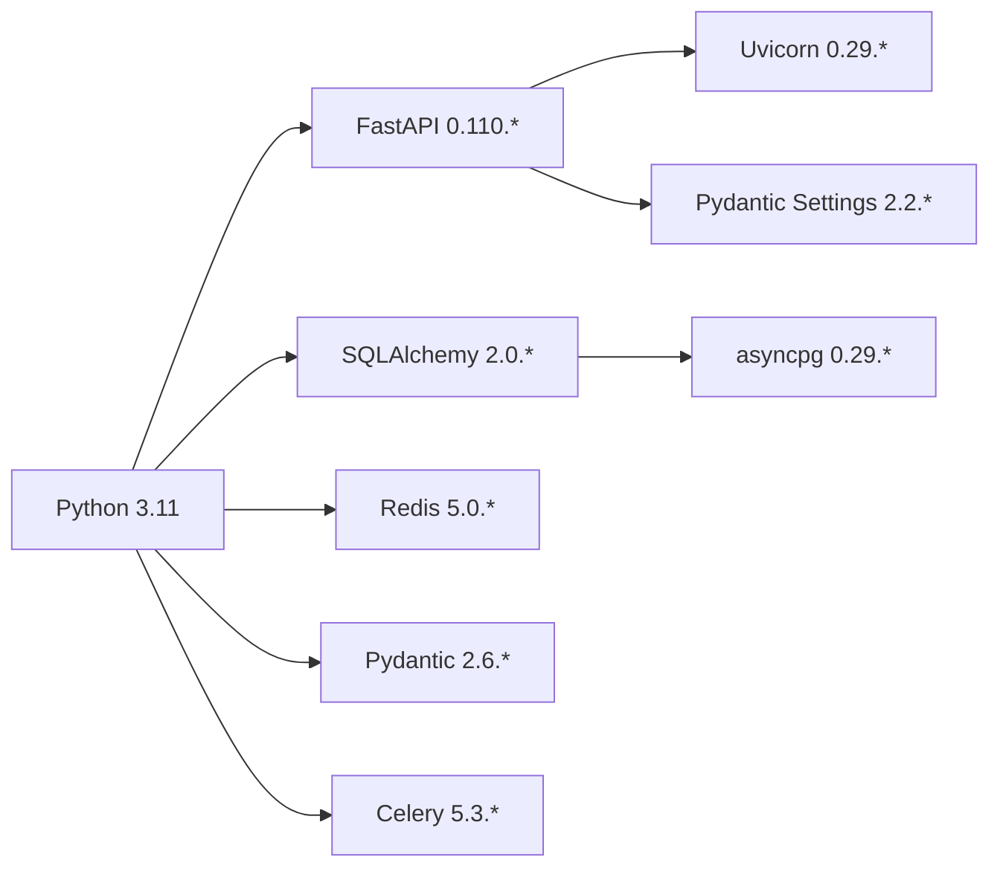

# 技术栈选型

<cite>
**本文引用的文件**
- [README.md](file://README.md)
- [backend/requirements.txt](file://backend/requirements.txt)
- [backend/app/main.py](file://backend/app/main.py)
- [backend/app/core/config.py](file://backend/app/core/config.py)
- [backend/app/core/database.py](file://backend/app/core/database.py)
- [backend/app/core/redis.py](file://backend/app/core/redis.py)
- [backend/app/models/models.py](file://backend/app/models/models.py)
- [backend/app/schemas/schemas.py](file://backend/app/schemas/schemas.py)
- [backend/app/api/v1/quote.py](file://backend/app/api/v1/quote.py)
- [backend/app/api/v1/stock.py](file://backend/app/api/v1/stock.py)
- [backend/app/api/websocket.py](file://backend/app/api/websocket.py)
- [backend/Dockerfile](file://backend/Dockerfile)
</cite>

## 目录
1. [引言](#引言)
2. [项目结构](#项目结构)
3. [核心组件](#核心组件)
4. [架构总览](#架构总览)
5. [详细组件分析](#详细组件分析)
6. [依赖分析](#依赖分析)
7. [性能考量](#性能考量)
8. [故障排查指南](#故障排查指南)
9. [结论](#结论)
10. [附录](#附录)

## 引言
本技术栈选型文档围绕 Stock-View 项目的前后端技术决策展开，重点说明后端采用 Python 3.11 + FastAPI + SQLAlchemy 2.0 的原因与优势，前端采用 Vue 3 + TypeScript + Pinia 的理由，并解释数据库 PostgreSQL、缓存系统 Redis、WebSocket 实现实时通信的价值。同时给出版本兼容性、性能考量、社区支持、升级路径与替代方案的对比分析，帮助读者全面理解技术栈的选型逻辑与演进策略。

## 项目结构
项目采用前后端分离架构，后端以 FastAPI 为核心，提供 REST API 与 WebSocket；前端基于 Vue 3 + TypeScript + Pinia 构建交互界面；数据库使用 PostgreSQL，缓存使用 Redis；通过 Docker Compose 统一编排部署。

图表来源
- [backend/app/main.py:1-48](file://backend/app/main.py#L1-L48)
- [backend/app/api/websocket.py:1-79](file://backend/app/api/websocket.py#L1-L79)
- [backend/app/core/database.py:1-25](file://backend/app/core/database.py#L1-L25)
- [backend/app/core/redis.py:1-25](file://backend/app/core/redis.py#L1-L25)
- [backend/app/core/config.py:1-43](file://backend/app/core/config.py#L1-L43)
- [backend/Dockerfile:1-12](file://backend/Dockerfile#L1-L12)

章节来源
- [README.md:92-126](file://README.md#L92-L126)
- [backend/app/main.py:1-48](file://backend/app/main.py#L1-L48)

## 核心组件
- 后端框架：FastAPI 提供高性能异步 Web 框架，具备自动生成 OpenAPI 文档、类型安全、高并发能力，适合实时行情与 AI 分析场景。
- 数据库：PostgreSQL 15 提供企业级关系型数据库能力，支持 JSON/JSONB、复杂查询与扩展生态，满足历史行情与用户数据存储需求。
- 缓存：Redis 7 作为缓存与消息中间件，支撑高频行情缓存、限流与异步任务队列。
- 前端：Vue 3 + TypeScript + Pinia 构建响应式界面，结合 ECharts 实现可视化，配合 WebSocket 实现实时行情推送。
- 部署：Docker + Nginx，统一打包与反向代理，便于开发与生产环境一致性。

章节来源
- [README.md:11-18](file://README.md#L11-L18)
- [backend/requirements.txt:1-17](file://backend/requirements.txt#L1-L17)

## 架构总览
下图展示后端核心模块如何协同工作：应用入口负责生命周期管理与路由注册；配置中心提供数据库与缓存连接参数；数据库层使用 SQLAlchemy 2.0 异步 ORM；缓存层使用 Redis；WebSocket 路由负责实时订阅与广播；API 路由处理业务请求。

图表来源
- [backend/app/main.py:1-48](file://backend/app/main.py#L1-L48)
- [backend/app/api/websocket.py:1-79](file://backend/app/api/websocket.py#L1-L79)
- [backend/app/core/database.py:1-25](file://backend/app/core/database.py#L1-L25)
- [backend/app/core/redis.py:1-25](file://backend/app/core/redis.py#L1-L25)

## 详细组件分析

### 后端技术栈选型与优势
- Python 3.11
  - 版本优势：更快的启动速度、更高的执行性能、更好的内存占用，适合高并发的行情数据处理与 AI 分析。
  - Docker 使用 3.11-slim，减少镜像体积，提升部署效率。
- FastAPI
  - 异步非阻塞：充分利用异步特性，提高并发吞吐，降低延迟。
  - 自动生成 API 文档：OpenAPI/Swagger，便于联调与测试。
  - 类型注解与 Pydantic：强类型保障，减少运行时错误。
- SQLAlchemy 2.0 (async)
  - 异步 ORM：与 FastAPI 协同，避免阻塞；支持连接池与会话管理，保证高并发下的稳定性。
  - 映射关系清晰：模型定义直观，便于维护与扩展。
- Redis
  - 缓存与限流：高频行情缓存、AI 接口限流与去重。
  - 消息中间件：Celery 任务队列的 Broker/Backend。
- PostgreSQL
  - 结构化数据存储：支持复杂查询、事务与扩展，适合历史行情与用户数据。
  - JSON/JSONB：可存储半结构化数据，如盘口、K 线明细等。

章节来源
- [backend/Dockerfile:1-12](file://backend/Dockerfile#L1-L12)
- [backend/requirements.txt:1-17](file://backend/requirements.txt#L1-L17)
- [backend/app/core/database.py:1-25](file://backend/app/core/database.py#L1-L25)
- [backend/app/core/redis.py:1-25](file://backend/app/core/redis.py#L1-L25)
- [backend/app/core/config.py:1-43](file://backend/app/core/config.py#L1-L43)

### 前端技术栈选型与优势
- Vue 3
  - Composition API：更灵活的逻辑组织，适合大型单页应用的状态与逻辑管理。
  - 更好的 TypeScript 支持：类型推导与 IDE 友好。
- TypeScript
  - 强类型保障：减少运行时错误，提升团队协作效率。
- Pinia
  - 轻量且易用的状态管理，天然支持 TypeScript，与 Vue 3 协同良好。
- ECharts + Element Plus
  - ECharts：专业金融图表库，适合 K 线、分时、盘口等可视化。
  - Element Plus：UI 组件库，快速搭建界面原型。

章节来源
- [README.md:15-16](file://README.md#L15-L16)

### 数据库设计与协作关系
- 模型映射
  - 股票基础信息、日线行情、分时/盘口明细、自选股、AI 分析日志等模型，覆盖核心业务域。
  - 字段类型与约束明确，便于索引优化与查询。
- 与后端协作
  - 通过 SQLAlchemy 2.0 异步会话进行 CRUD 操作，结合 Pydantic Schema 进行数据校验与序列化。
  - 高并发场景下，连接池与会话过期控制确保资源合理释放。

图表来源
- [backend/app/models/models.py:1-74](file://backend/app/models/models.py#L1-L74)

章节来源
- [backend/app/models/models.py:1-74](file://backend/app/models/models.py#L1-L74)
- [backend/app/schemas/schemas.py:1-103](file://backend/app/schemas/schemas.py#L1-L103)

### WebSocket 实时通信机制
- 订阅管理
  - 连接管理器维护活动连接与订阅集合，支持多股票、多频道订阅。
- 广播机制
  - 当行情更新时，按订阅关系广播至对应客户端，断开异常连接自动清理。
- 心跳与容错
  - 支持 ping/pong 心跳检测，异常发送自动断开，保证长连接稳定。

图表来源
- [backend/app/api/websocket.py:1-79](file://backend/app/api/websocket.py#L1-L79)
- [backend/app/core/redis.py:1-25](file://backend/app/core/redis.py#L1-L25)
- [backend/app/core/database.py:1-25](file://backend/app/core/database.py#L1-L25)

章节来源
- [backend/app/api/websocket.py:1-79](file://backend/app/api/websocket.py#L1-L79)

### API 与数据采集流程
- 路由组织
  - REST API v1 下包含行情、股票、自选股、AI 等模块，职责清晰。
- 数据采集
  - 行情数据通过采集器管理器聚合多个数据源（如东方财富、新浪），支持主备切换与限流。
- 搜索与校验
  - 使用 Pydantic Schema 对输入参数进行严格校验，返回统一响应结构。

图表来源
- [backend/app/api/v1/quote.py:1-65](file://backend/app/api/v1/quote.py#L1-L65)
- [backend/app/api/v1/stock.py:1-37](file://backend/app/api/v1/stock.py#L1-L37)
- [backend/app/core/redis.py:1-25](file://backend/app/core/redis.py#L1-L25)
- [backend/app/core/database.py:1-25](file://backend/app/core/database.py#L1-L25)

章节来源
- [backend/app/api/v1/quote.py:1-65](file://backend/app/api/v1/quote.py#L1-L65)
- [backend/app/api/v1/stock.py:1-37](file://backend/app/api/v1/stock.py#L1-L37)
- [backend/app/schemas/schemas.py:1-103](file://backend/app/schemas/schemas.py#L1-L103)

## 依赖分析
- 版本兼容性
  - Python 3.11 与 FastAPI 0.110.*、SQLAlchemy 2.0.*、Pydantic 2.6.*、Redis 5.0.*、Celery 5.3.* 均保持兼容。
  - 异步驱动 asyncpg 与 SQLAlchemy 2.0 异步引擎配套使用。
- 外部依赖
  - httpx 用于外部数据源调用；numpy/pandas/ta 用于技术分析与指标计算。
- 配置与连接
  - 通过 pydantic-settings 从 .env 加载配置，集中管理数据库与缓存连接串。

图表来源
- [backend/requirements.txt:1-17](file://backend/requirements.txt#L1-L17)
- [backend/app/core/config.py:1-43](file://backend/app/core/config.py#L1-L43)

章节来源
- [backend/requirements.txt:1-17](file://backend/requirements.txt#L1-L17)
- [backend/app/core/config.py:1-43](file://backend/app/core/config.py#L1-L43)

## 性能考量
- 异步优先：后端全链路采用异步，数据库与缓存均使用异步客户端，降低阻塞，提升并发。
- 连接池与会话：数据库连接池大小与溢出配置平衡吞吐与资源占用；会话过期控制避免长时间占用。
- 缓存策略：Redis 缓存高频数据，设置 TTL 与容量上限，结合限流与降级策略。
- WebSocket：按需广播，订阅过滤，避免无效推送；心跳检测与异常断连清理。
- 前端渲染：ECharts 按需加载与懒渲染，Pinia 精准状态更新，减少不必要重渲染。

## 故障排查指南
- 健康检查
  - 后端提供健康检查接口，用于容器编排与运维监控。
- 日志与异常
  - WebSocket 发送异常自动断开连接，避免堆积；Redis/数据库异常应记录并降级处理。
- 环境变量
  - 确认 DATABASE_URL 与 REDIS_URL 指向正确地址与端口；开发与生产环境区分。
- 数据源可用性
  - 主备数据源切换与失败回退逻辑，避免单点故障导致服务不可用。

章节来源
- [backend/app/main.py:46-48](file://backend/app/main.py#L46-L48)
- [backend/app/api/websocket.py:29-34](file://backend/app/api/websocket.py#L29-L34)
- [backend/app/core/config.py:12-14](file://backend/app/core/config.py#L12-L14)

## 结论
Stock-View 的技术栈以“高性能、可扩展、易维护”为目标：后端通过 Python 3.11 + FastAPI + SQLAlchemy 2.0 异步组合，满足实时行情与 AI 分析的高并发需求；数据库 PostgreSQL 与缓存 Redis 形成互补，支撑结构化与半结构化数据；前端采用 Vue 3 + TypeScript + Pinia，结合 ECharts 实现专业可视化与实时推送。整体选型兼顾当前业务需求与未来演进空间，具备良好的升级路径与替代方案弹性。

## 附录

### 版本兼容性与升级路径
- Python 3.11 → 3.12
  - 升级要点：检查异步库与第三方包是否支持新版本；逐步迁移测试用例。
- FastAPI 0.110.* → 0.111.*
  - 升级要点：关注路由注册与中间件变更；保持类型注解与 Pydantic 兼容。
- SQLAlchemy 2.0.* → 2.1.*
  - 升级要点：遵循官方迁移指南；注意会话与连接池配置细节。
- Redis 7 → 7.x
  - 升级要点：关注新特性与废弃项；保持连接参数一致。
- 前端生态
  - Vue 3 → 3.x（保持兼容）；TypeScript 5.x；Pinia 体系保持稳定。

### 替代方案对比
- Web 框架
  - Django/DRF：功能完备但同步为主，异步支持有限；适合传统 CRUD 场景。
  - Quart：纯异步，但生态与文档相对较少；适合轻量异步服务。
- 数据库
  - MySQL：成本低、生态成熟；对 JSON/复杂查询支持不及 PostgreSQL。
  - MongoDB：文档模型灵活；不适合强一致与复杂关联查询。
- 缓存
  - Memcached：简单高效；功能较弱；Redis 更适合复杂场景。
- 前端
  - React + Redux/Zustand：生态丰富；TypeScript 支持良好；学习曲线略高于 Vue。
  - SvelteKit：性能优异；生态与 Vue 差距较大；迁移成本较高。