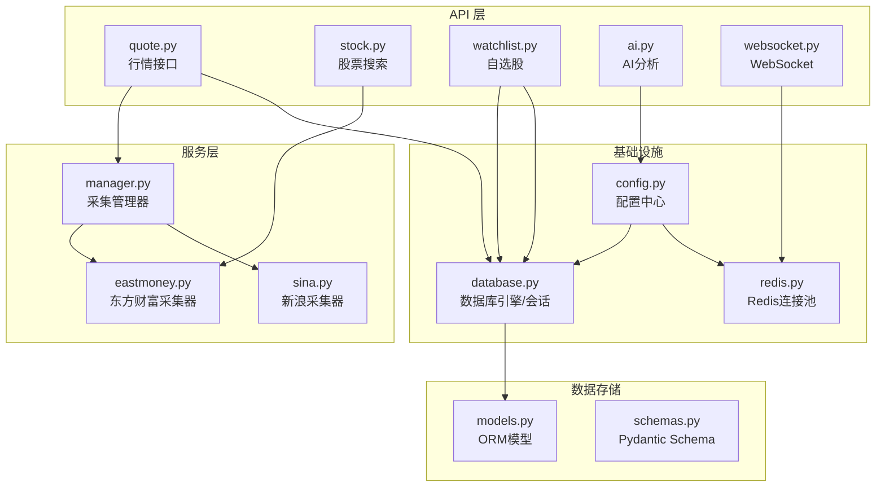
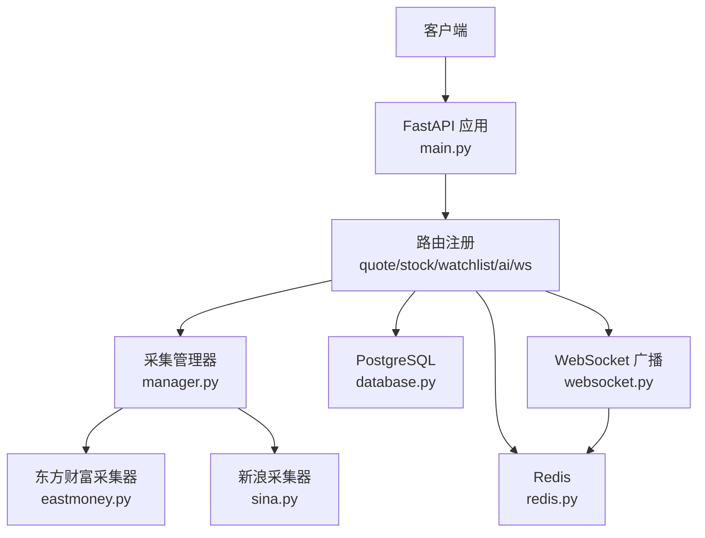
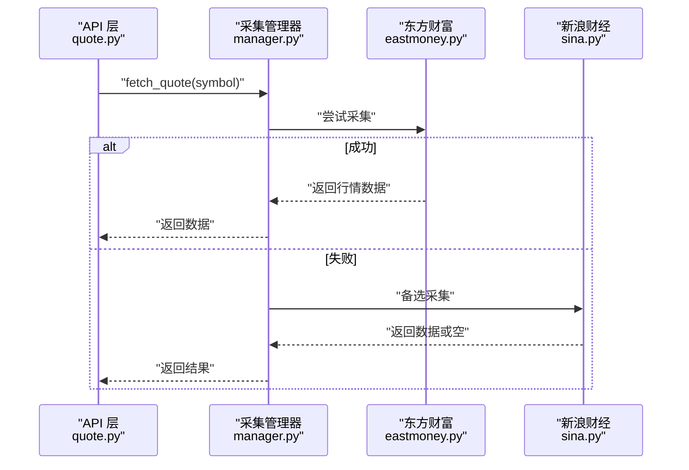
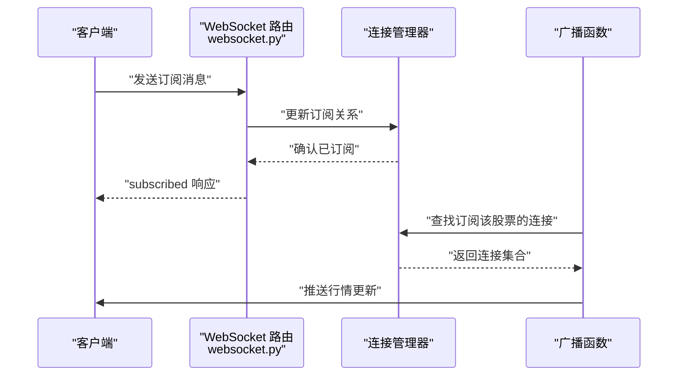
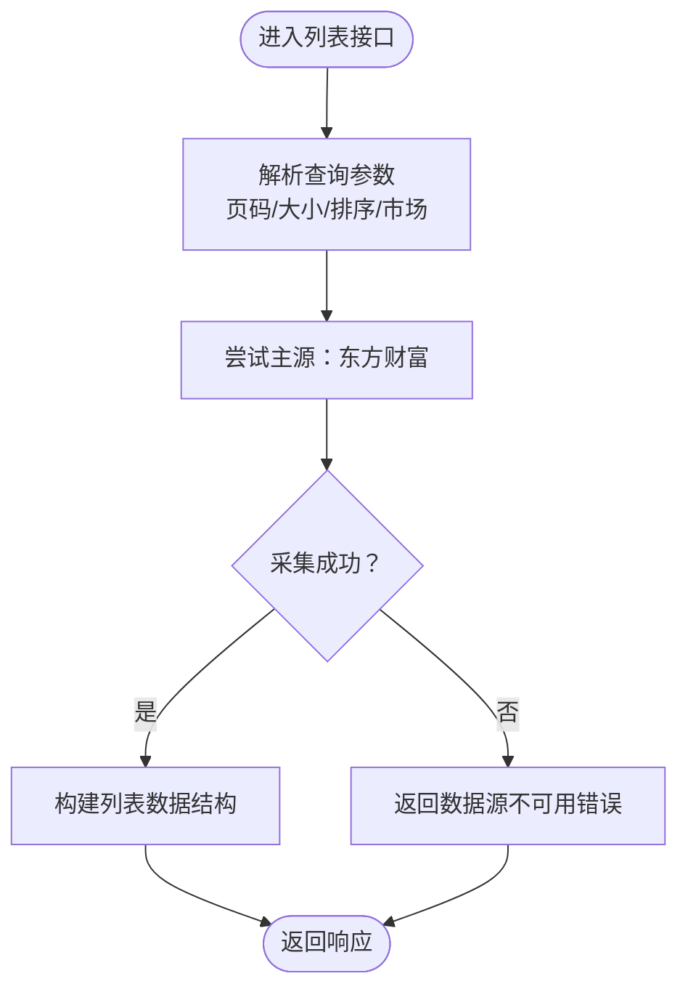
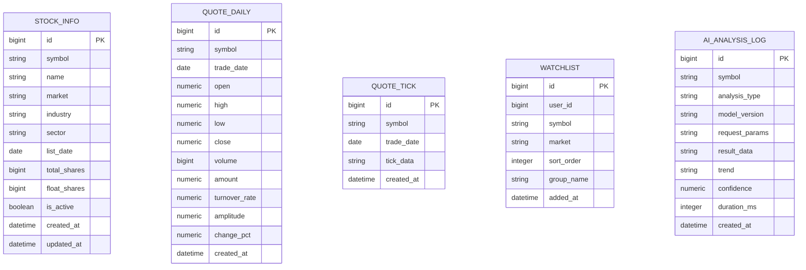
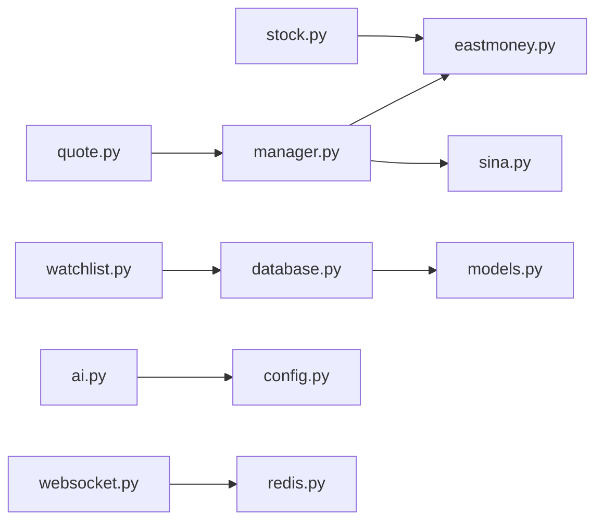

# 数据流设计

<cite>
**本文引用的文件**
- [backend/app/main.py](file://backend/app/main.py)
- [backend/app/core/config.py](file://backend/app/core/config.py)
- [backend/app/core/database.py](file://backend/app/core/database.py)
- [backend/app/core/redis.py](file://backend/app/core/redis.py)
- [backend/app/services/collector/base.py](file://backend/app/services/collector/base.py)
- [backend/app/services/collector/eastmoney.py](file://backend/app/services/collector/eastmoney.py)
- [backend/app/services/collector/sina.py](file://backend/app/services/collector/sina.py)
- [backend/app/services/collector/manager.py](file://backend/app/services/collector/manager.py)
- [backend/app/api/v1/quote.py](file://backend/app/api/v1/quote.py)
- [backend/app/api/v1/stock.py](file://backend/app/api/v1/stock.py)
- [backend/app/api/v1/watchlist.py](file://backend/app/api/v1/watchlist.py)
- [backend/app/api/v1/ai.py](file://backend/app/api/v1/ai.py)
- [backend/app/api/websocket.py](file://backend/app/api/websocket.py)
- [backend/app/models/models.py](file://backend/app/models/models.py)
- [backend/app/schemas/schemas.py](file://backend/app/schemas/schemas.py)
</cite>

## 目录
1. [引言](#引言)
2. [项目结构](#项目结构)
3. [核心组件](#核心组件)
4. [架构总览](#架构总览)
5. [详细组件分析](#详细组件分析)
6. [依赖分析](#依赖分析)
7. [性能考量](#性能考量)
8. [故障排查指南](#故障排查指南)
9. [结论](#结论)
10. [附录](#附录)

## 引言
本文件面向Stock-View项目，系统化梳理从外部数据源到最终用户展示的完整数据链路，覆盖数据采集、缓存、处理、存储、传输等环节，并对实时数据流与批量数据流的差异处理、一致性与质量控制、生命周期管理、监控与运维进行深入说明。

## 项目结构
后端采用FastAPI框架，按功能域划分模块：核心配置与基础设施（数据库、Redis）、数据采集层（抽象采集器与具体实现）、API层（行情、股票、自选股、AI、WebSocket）、模型与Schema定义。整体呈现“API → 服务层 → 外部数据源”的清晰分层。

图表来源
- [backend/app/api/v1/quote.py:1-65](file://backend/app/api/v1/quote.py#L1-L65)
- [backend/app/api/v1/stock.py:1-37](file://backend/app/api/v1/stock.py#L1-L37)
- [backend/app/api/v1/watchlist.py:1-77](file://backend/app/api/v1/watchlist.py#L1-L77)
- [backend/app/api/v1/ai.py:1-29](file://backend/app/api/v1/ai.py#L1-L29)
- [backend/app/api/websocket.py:1-79](file://backend/app/api/websocket.py#L1-L79)
- [backend/app/services/collector/manager.py:1-80](file://backend/app/services/collector/manager.py#L1-L80)
- [backend/app/services/collector/eastmoney.py:1-240](file://backend/app/services/collector/eastmoney.py#L1-L240)
- [backend/app/services/collector/sina.py:1-79](file://backend/app/services/collector/sina.py#L1-L79)
- [backend/app/core/config.py:1-43](file://backend/app/core/config.py#L1-L43)
- [backend/app/core/database.py:1-25](file://backend/app/core/database.py#L1-L25)
- [backend/app/core/redis.py:1-25](file://backend/app/core/redis.py#L1-L25)
- [backend/app/models/models.py:1-74](file://backend/app/models/models.py#L1-L74)
- [backend/app/schemas/schemas.py:1-103](file://backend/app/schemas/schemas.py#L1-L103)

章节来源
- [backend/app/main.py:1-48](file://backend/app/main.py#L1-L48)
- [backend/app/core/config.py:1-43](file://backend/app/core/config.py#L1-L43)

## 核心组件
- 配置中心：集中管理数据库、Redis、数据源、AI服务、缓存与限流等参数，提供运行时配置读取与缓存。
- 数据采集层：抽象采集器定义统一接口；具体实现分别对接东方财富与新浪财经，支持行情、K线、分时、盘口等多维度数据。
- API层：提供REST接口与WebSocket通道，统一响应格式，封装业务逻辑。
- 存储层：基于SQLAlchemy ORM定义股票、行情、自选股、AI日志等模型，支撑数据持久化。
- 缓存与传输：Redis用于会话、缓存与任务队列；WebSocket负责实时推送。

章节来源
- [backend/app/core/config.py:1-43](file://backend/app/core/config.py#L1-L43)
- [backend/app/services/collector/base.py:1-45](file://backend/app/services/collector/base.py#L1-L45)
- [backend/app/services/collector/eastmoney.py:1-240](file://backend/app/services/collector/eastmoney.py#L1-L240)
- [backend/app/services/collector/sina.py:1-79](file://backend/app/services/collector/sina.py#L1-L79)
- [backend/app/api/v1/quote.py:1-65](file://backend/app/api/v1/quote.py#L1-L65)
- [backend/app/api/websocket.py:1-79](file://backend/app/api/websocket.py#L1-L79)
- [backend/app/models/models.py:1-74](file://backend/app/models/models.py#L1-L74)

## 架构总览
系统采用“API网关/入口”+“采集器集群”+“数据库/缓存”+“消息通道”的架构。API层接收请求，采集器层负责拉取外部数据，数据库负责持久化，Redis负责缓存与会话，WebSocket负责实时推送。

图表来源
- [backend/app/main.py:22-43](file://backend/app/main.py#L22-L43)
- [backend/app/api/v1/quote.py:1-65](file://backend/app/api/v1/quote.py#L1-L65)
- [backend/app/api/v1/stock.py:1-37](file://backend/app/api/v1/stock.py#L1-L37)
- [backend/app/api/v1/watchlist.py:1-77](file://backend/app/api/v1/watchlist.py#L1-L77)
- [backend/app/api/v1/ai.py:1-29](file://backend/app/api/v1/ai.py#L1-L29)
- [backend/app/api/websocket.py:1-79](file://backend/app/api/websocket.py#L1-L79)
- [backend/app/services/collector/manager.py:1-80](file://backend/app/services/collector/manager.py#L1-L80)
- [backend/app/services/collector/eastmoney.py:1-240](file://backend/app/services/collector/eastmoney.py#L1-L240)
- [backend/app/services/collector/sina.py:1-79](file://backend/app/services/collector/sina.py#L1-L79)
- [backend/app/core/database.py:1-25](file://backend/app/core/database.py#L1-L25)
- [backend/app/core/redis.py:1-25](file://backend/app/core/redis.py#L1-L25)

## 详细组件分析

### 数据采集与故障转移（Collector Manager）
- 设计要点
  - 抽象采集器定义统一接口，具体实现分别对接不同数据源。
  - 管理器按优先级顺序尝试采集，失败自动切换至备选源，提升可用性。
  - 对部分接口（如列表、K线、分时、盘口）限定主源，确保稳定性与兼容性。
- 实现机制
  - 通过HTTP客户端访问外部API，解析响应并转换为内部统一结构。
  - 记录采集异常日志，便于问题定位与告警。
- 关键流程（以实时行情为例）

图表来源
- [backend/app/api/v1/quote.py:7-16](file://backend/app/api/v1/quote.py#L7-L16)
- [backend/app/services/collector/manager.py:21-32](file://backend/app/services/collector/manager.py#L21-L32)
- [backend/app/services/collector/eastmoney.py:23-37](file://backend/app/services/collector/eastmoney.py#L23-L37)
- [backend/app/services/collector/sina.py:19-60](file://backend/app/services/collector/sina.py#L19-L60)

章节来源
- [backend/app/services/collector/base.py:1-45](file://backend/app/services/collector/base.py#L1-L45)
- [backend/app/services/collector/manager.py:1-80](file://backend/app/services/collector/manager.py#L1-L80)
- [backend/app/services/collector/eastmoney.py:1-240](file://backend/app/services/collector/eastmoney.py#L1-L240)
- [backend/app/services/collector/sina.py:1-79](file://backend/app/services/collector/sina.py#L1-L79)

### 实时数据流（WebSocket）
- 设计要点
  - WebSocket连接管理器维护活跃连接与订阅关系。
  - 客户端通过订阅消息选择关注的股票与频道，服务端按需推送。
  - 广播函数仅向订阅者推送对应标的的行情更新。
- 关键流程（订阅与推送）

图表来源
- [backend/app/api/websocket.py:39-79](file://backend/app/api/websocket.py#L39-L79)

章节来源
- [backend/app/api/websocket.py:1-79](file://backend/app/api/websocket.py#L1-L79)

### 批量数据流（列表、K线、分时、盘口）
- 设计要点
  - 列表接口支持分页、排序与市场过滤，主源为东方财富。
  - K线、分时、盘口接口限定主源，避免跨源差异导致的数据不一致。
  - 接口返回统一响应结构，错误码明确指示数据源状态。
- 关键流程（列表接口）

图表来源
- [backend/app/api/v1/quote.py:19-33](file://backend/app/api/v1/quote.py#L19-L33)
- [backend/app/services/collector/manager.py:34-43](file://backend/app/services/collector/manager.py#L34-L43)
- [backend/app/services/collector/eastmoney.py:39-99](file://backend/app/services/collector/eastmoney.py#L39-L99)

章节来源
- [backend/app/api/v1/quote.py:1-65](file://backend/app/api/v1/quote.py#L1-L65)
- [backend/app/services/collector/manager.py:1-80](file://backend/app/services/collector/manager.py#L1-L80)
- [backend/app/services/collector/eastmoney.py:1-240](file://backend/app/services/collector/eastmoney.py#L1-L240)

### 数据存储与模型
- 设计要点
  - 使用SQLAlchemy ORM定义股票基础信息、日线行情、逐笔行情、自选股、AI分析日志等模型。
  - 字段类型与精度满足金融数据需求，时间戳与索引设计兼顾查询效率。
- 数据模型关系

图表来源
- [backend/app/models/models.py:5-74](file://backend/app/models/models.py#L5-L74)

章节来源
- [backend/app/models/models.py:1-74](file://backend/app/models/models.py#L1-L74)

### 缓存与一致性
- 缓存策略
  - 配置项包含AI缓存开关与TTL、行情采集间隔与缓存TTL等，用于平衡实时性与资源消耗。
  - Redis作为缓存与会话载体，WebSocket连接管理器可结合订阅关系实现精准推送。
- 一致性保障
  - 主备源优先级与失败转移降低单点风险。
  - 对于列表与复杂接口限定主源，减少跨源差异。
  - 数据入库前进行字段校验与默认值处理，避免脏数据进入存储层。

章节来源
- [backend/app/core/config.py:26-31](file://backend/app/core/config.py#L26-L31)
- [backend/app/core/redis.py:1-25](file://backend/app/core/redis.py#L1-L25)
- [backend/app/services/collector/manager.py:9-32](file://backend/app/services/collector/manager.py#L9-L32)
- [backend/app/services/collector/eastmoney.py:224-240](file://backend/app/services/collector/eastmoney.py#L224-L240)

### 数据质量控制与生命周期
- 质量控制
  - 采集器对返回数据进行判空与字段提取，异常时记录日志并回退。
  - API层对输入参数进行范围约束与类型提示，减少无效请求。
- 生命周期
  - 模型字段包含创建与更新时间戳，便于审计与过期清理。
  - 配置项提供缓存TTL与采集间隔，控制内存占用与刷新频率。

章节来源
- [backend/app/api/v1/quote.py:10-16](file://backend/app/api/v1/quote.py#L10-L16)
- [backend/app/services/collector/eastmoney.py:23-37](file://backend/app/services/collector/eastmoney.py#L23-L37)
- [backend/app/models/models.py:18-19](file://backend/app/models/models.py#L18-L19)

### 监控与运维
- 健康检查
  - 提供健康检查端点，便于容器编排与负载均衡探活。
- 日志与告警
  - 采集器与管理器对异常进行警告级别日志输出，便于问题追踪。
- 运维建议
  - 结合采集间隔与缓存TTL调优实时性与吞吐。
  - 对Redis与数据库连接池参数进行容量评估与压测。

章节来源
- [backend/app/main.py:46-48](file://backend/app/main.py#L46-L48)
- [backend/app/services/collector/manager.py:28-31](file://backend/app/services/collector/manager.py#L28-L31)
- [backend/app/services/collector/sina.py:58-60](file://backend/app/services/collector/sina.py#L58-L60)

## 依赖分析
- 组件耦合
  - API层依赖采集管理器与数据库/Redis；采集管理器依赖具体采集器实现。
  - 数据模型独立于API与采集层，通过ORM解耦。
- 外部依赖
  - HTTP客户端访问外部行情API；数据库驱动与Redis客户端为异步实现。
- 循环依赖
  - 当前结构未见循环导入；各模块职责清晰，层次分明。

图表来源
- [backend/app/api/v1/quote.py:1-65](file://backend/app/api/v1/quote.py#L1-L65)
- [backend/app/api/v1/stock.py:1-37](file://backend/app/api/v1/stock.py#L1-L37)
- [backend/app/api/v1/watchlist.py:1-77](file://backend/app/api/v1/watchlist.py#L1-L77)
- [backend/app/api/v1/ai.py:1-29](file://backend/app/api/v1/ai.py#L1-L29)
- [backend/app/api/websocket.py:1-79](file://backend/app/api/websocket.py#L1-L79)
- [backend/app/services/collector/manager.py:1-80](file://backend/app/services/collector/manager.py#L1-L80)
- [backend/app/services/collector/eastmoney.py:1-240](file://backend/app/services/collector/eastmoney.py#L1-L240)
- [backend/app/services/collector/sina.py:1-79](file://backend/app/services/collector/sina.py#L1-L79)
- [backend/app/core/database.py:1-25](file://backend/app/core/database.py#L1-L25)
- [backend/app/core/redis.py:1-25](file://backend/app/core/redis.py#L1-L25)
- [backend/app/models/models.py:1-74](file://backend/app/models/models.py#L1-L74)

章节来源
- [backend/app/api/v1/quote.py:1-65](file://backend/app/api/v1/quote.py#L1-L65)
- [backend/app/api/v1/stock.py:1-37](file://backend/app/api/v1/stock.py#L1-L37)
- [backend/app/api/v1/watchlist.py:1-77](file://backend/app/api/v1/watchlist.py#L1-L77)
- [backend/app/api/v1/ai.py:1-29](file://backend/app/api/v1/ai.py#L1-L29)
- [backend/app/api/websocket.py:1-79](file://backend/app/api/websocket.py#L1-L79)
- [backend/app/services/collector/manager.py:1-80](file://backend/app/services/collector/manager.py#L1-L80)
- [backend/app/services/collector/eastmoney.py:1-240](file://backend/app/services/collector/eastmoney.py#L1-L240)
- [backend/app/services/collector/sina.py:1-79](file://backend/app/services/collector/sina.py#L1-L79)
- [backend/app/core/database.py:1-25](file://backend/app/core/database.py#L1-L25)
- [backend/app/core/redis.py:1-25](file://backend/app/core/redis.py#L1-L25)
- [backend/app/models/models.py:1-74](file://backend/app/models/models.py#L1-L74)

## 性能考量
- 实时性与吞吐
  - 采集间隔与缓存TTL需结合业务峰值与网络抖动调优。
  - WebSocket广播仅针对订阅目标推送，避免全量广播带来的带宽压力。
- 存储与查询
  - 对高频查询字段建立索引（如symbol、trade_date），减少慢查询。
  - 控制JSON字段长度与序列化开销，必要时拆分存储。
- 网络与并发
  - HTTP客户端超时与重试策略需与采集间隔匹配，避免积压。
  - 数据库连接池参数与Redis连接数应与并发请求数相适应。

## 故障排查指南
- 常见问题定位
  - 采集失败：检查采集器日志与外部API可用性；确认主备源切换是否生效。
  - WebSocket断连：检查连接管理器与订阅关系；确认客户端心跳与重连机制。
  - 数据库异常：核对连接串与权限；检查连接池耗尽与事务超时。
- 快速恢复
  - 临时关闭高并发接口或提高缓存命中率。
  - 降级非关键路径（如AI分析）以释放资源。
  - 回滚配置或切换到稳定版本。

章节来源
- [backend/app/services/collector/manager.py:28-31](file://backend/app/services/collector/manager.py#L28-L31)
- [backend/app/api/websocket.py:67-79](file://backend/app/api/websocket.py#L67-L79)
- [backend/app/core/database.py:15-20](file://backend/app/core/database.py#L15-L20)

## 结论
本设计文档从数据采集、缓存、处理、存储、传输到实时推送形成闭环，通过主备源优先级与失败转移提升可用性，借助统一Schema与ORM保障数据一致性与可维护性。建议在生产环境中持续监控采集成功率、延迟与吞吐，并根据业务增长迭代缓存策略与存储模型。

## 附录
- 关键配置项（节选）
  - 数据库URL、Redis URL
  - 主备数据源名称
  - AI适配器、服务地址、超时、缓存开关与TTL、速率限制
  - Celery Broker与结果后端
  - 行情采集间隔与缓存TTL
  - JWT密钥与算法、过期时间

章节来源
- [backend/app/core/config.py:12-35](file://backend/app/core/config.py#L12-L35)