# 整体架构概览

<cite>
**本文引用的文件**
- [README.md](file://README.md)
- [backend/app/main.py](file://backend/app/main.py)
- [backend/app/core/config.py](file://backend/app/core/config.py)
- [backend/app/core/database.py](file://backend/app/core/database.py)
- [backend/app/core/redis.py](file://backend/app/core/redis.py)
- [backend/app/api/v1/quote.py](file://backend/app/api/v1/quote.py)
- [backend/app/api/v1/stock.py](file://backend/app/api/v1/stock.py)
- [backend/app/api/v1/watchlist.py](file://backend/app/api/v1/watchlist.py)
- [backend/app/api/v1/ai.py](file://backend/app/api/v1/ai.py)
- [backend/app/api/websocket.py](file://backend/app/api/websocket.py)
- [backend/app/services/collector/manager.py](file://backend/app/services/collector/manager.py)
- [backend/app/models/models.py](file://backend/app/models/models.py)
- [backend/app/schemas/schemas.py](file://backend/app/schemas/schemas.py)
- [backend/requirements.txt](file://backend/requirements.txt)
- [backend/Dockerfile](file://backend/Dockerfile)
</cite>

## 目录
1. [引言](#引言)
2. [项目结构](#项目结构)
3. [核心组件](#核心组件)
4. [架构总览](#架构总览)
5. [详细组件分析](#详细组件分析)
6. [依赖分析](#依赖分析)
7. [性能考量](#性能考量)
8. [故障排查指南](#故障排查指南)
9. [结论](#结论)
10. [附录](#附录)

## 引言
本项目是一个面向A股市场的实时行情查看与AI分析平台，采用前后端分离架构，后端以FastAPI为核心，结合SQLAlchemy 2.0异步ORM、PostgreSQL与Redis作为数据与缓存层，并通过WebSocket提供实时行情推送；前端基于Vue 3 + TypeScript，使用Pinia进行状态管理、ECharts绘制图表、Element Plus提供UI组件。系统通过模块化设计实现“表现层-业务逻辑层-数据访问层”的清晰分层，支持多数据源采集与故障转移、可插拔的AI分析适配器以及可扩展的异步任务队列。

## 项目结构
仓库采用按层与按功能混合的组织方式：
- 后端 backend：FastAPI应用入口、核心配置与连接、API路由、业务服务、数据模型与Schema、采集器与AI适配器、WebSocket实时推送。
- 前端 frontend：Vue 3 + TypeScript 应用入口、路由、API客户端、状态管理、页面组件。
- 文档与部署：README提供技术栈、快速启动、环境变量说明与常用命令；Dockerfile与compose用于容器化部署。

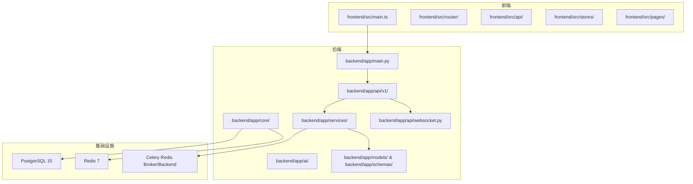

**图表来源**
- [backend/app/main.py:1-48](file://backend/app/main.py#L1-L48)
- [backend/app/core/database.py:1-25](file://backend/app/core/database.py#L1-L25)
- [backend/app/core/redis.py:1-25](file://backend/app/core/redis.py#L1-L25)
- [backend/app/api/v1/quote.py:1-65](file://backend/app/api/v1/quote.py#L1-L65)
- [backend/app/api/v1/stock.py:1-37](file://backend/app/api/v1/stock.py#L1-L37)
- [backend/app/api/v1/watchlist.py:1-77](file://backend/app/api/v1/watchlist.py#L1-L77)
- [backend/app/api/websocket.py:1-79](file://backend/app/api/websocket.py#L1-L79)
- [backend/app/services/collector/manager.py:1-80](file://backend/app/services/collector/manager.py#L1-L80)
- [backend/app/models/models.py:1-74](file://backend/app/models/models.py#L1-L74)
- [backend/app/schemas/schemas.py:1-103](file://backend/app/schemas/schemas.py#L1-L103)

**章节来源**
- [README.md:92-126](file://README.md#L92-L126)
- [backend/app/main.py:1-48](file://backend/app/main.py#L1-L48)

## 核心组件
- 应用入口与生命周期：FastAPI应用在启动时初始化数据库并在关闭时释放Redis连接，注册REST路由与WebSocket路由。
- 配置中心：集中管理数据库、Redis、AI服务、限流、缓存、JWT、数据源等配置项。
- 数据访问层：SQLAlchemy 2.0异步引擎与会话管理，统一的Base模型基类；Redis异步连接池封装。
- 业务服务：行情采集器管理器负责多数据源采集与故障转移；自选股持久化；AI分析适配器抽象。
- API层：按功能拆分的v1路由，覆盖行情、股票搜索、自选股、AI分析与WebSocket。
- 前端：Vue 3 + TypeScript，Axios API客户端、Pinia状态管理、页面组件与路由。

**章节来源**
- [backend/app/main.py:13-48](file://backend/app/main.py#L13-L48)
- [backend/app/core/config.py:1-43](file://backend/app/core/config.py#L1-L43)
- [backend/app/core/database.py:1-25](file://backend/app/core/database.py#L1-L25)
- [backend/app/core/redis.py:1-25](file://backend/app/core/redis.py#L1-L25)
- [backend/app/api/v1/quote.py:1-65](file://backend/app/api/v1/quote.py#L1-L65)
- [backend/app/api/v1/stock.py:1-37](file://backend/app/api/v1/stock.py#L1-L37)
- [backend/app/api/v1/watchlist.py:1-77](file://backend/app/api/v1/watchlist.py#L1-L77)
- [backend/app/api/v1/ai.py:1-29](file://backend/app/api/v1/ai.py#L1-L29)
- [backend/app/api/websocket.py:1-79](file://backend/app/api/websocket.py#L1-L79)
- [backend/app/services/collector/manager.py:1-80](file://backend/app/services/collector/manager.py#L1-L80)
- [backend/app/models/models.py:1-74](file://backend/app/models/models.py#L1-L74)
- [backend/app/schemas/schemas.py:1-103](file://backend/app/schemas/schemas.py#L1-L103)

## 架构总览
系统采用前后端分离与微服务化理念（概念性说明）：
- 前后端分离：前端独立部署，后端提供REST与WebSocket接口，跨域策略允许开发与生产环境灵活配置。
- 微服务化设计：后端以功能域拆分API模块（行情、股票、自选股、AI），服务边界清晰；AI分析通过适配器抽象，便于替换与扩展。
- 异步处理架构：后端使用SQLAlchemy 2.0异步ORM与Redis异步客户端；WebSocket实现实时推送；计划内引入Celery异步任务队列处理耗时任务。
- 数据一致性与可用性：PostgreSQL承载结构化数据，Redis承担缓存与消息通道；多数据源采集与故障转移提升可用性。

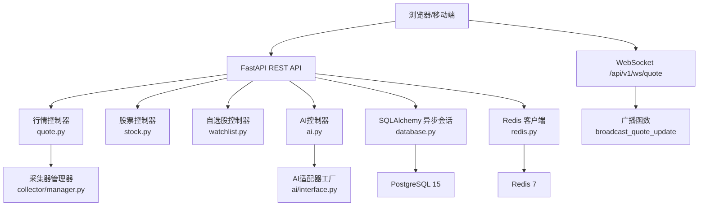

**图表来源**
- [backend/app/main.py:22-43](file://backend/app/main.py#L22-L43)
- [backend/app/api/v1/quote.py:1-65](file://backend/app/api/v1/quote.py#L1-L65)
- [backend/app/api/v1/stock.py:1-37](file://backend/app/api/v1/stock.py#L1-L37)
- [backend/app/api/v1/watchlist.py:1-77](file://backend/app/api/v1/watchlist.py#L1-L77)
- [backend/app/api/v1/ai.py:1-29](file://backend/app/api/v1/ai.py#L1-L29)
- [backend/app/api/websocket.py:39-79](file://backend/app/api/websocket.py#L39-L79)
- [backend/app/services/collector/manager.py:1-80](file://backend/app/services/collector/manager.py#L1-L80)
- [backend/app/core/database.py:1-25](file://backend/app/core/database.py#L1-L25)
- [backend/app/core/redis.py:1-25](file://backend/app/core/redis.py#L1-L25)

## 详细组件分析

### 组件A：后端应用入口与生命周期
- 职责：创建FastAPI实例、注册中间件（CORS）、挂载路由、定义健康检查端点；在应用生命周期内初始化数据库与Redis资源。
- 关键点：使用lifespan钩子确保数据库在启动时创建表并在关闭时释放Redis连接；路由前缀统一为/api/v1，便于版本化管理。

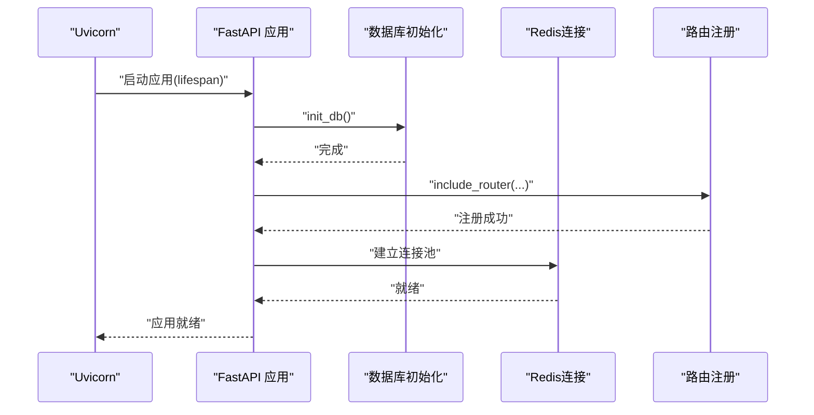

**图表来源**
- [backend/app/main.py:13-48](file://backend/app/main.py#L13-L48)
- [backend/app/core/database.py:23-25](file://backend/app/core/database.py#L23-L25)
- [backend/app/core/redis.py:10-18](file://backend/app/core/redis.py#L10-L18)

**章节来源**
- [backend/app/main.py:1-48](file://backend/app/main.py#L1-L48)

### 组件B：配置中心与环境变量
- 职责：集中定义运行环境、数据库、Redis、AI服务、JWT、数据源与限流等配置项；通过缓存函数避免重复解析。
- 设计优势：统一配置来源，便于在不同环境切换；敏感参数如密钥与超时时间集中管理。

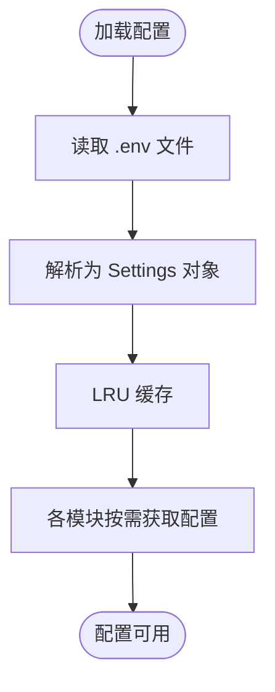

**图表来源**
- [backend/app/core/config.py:41-43](file://backend/app/core/config.py#L41-L43)

**章节来源**
- [backend/app/core/config.py:1-43](file://backend/app/core/config.py#L1-L43)
- [README.md:130-142](file://README.md#L130-L142)

### 组件C：数据访问层（SQLAlchemy 2.0 + Redis）
- 职责：提供异步数据库引擎与会话工厂，统一模型基类；提供Redis异步连接池与关闭逻辑。
- 性能特性：连接池参数可调；异步会话避免阻塞；Redis连接池减少频繁创建销毁开销。

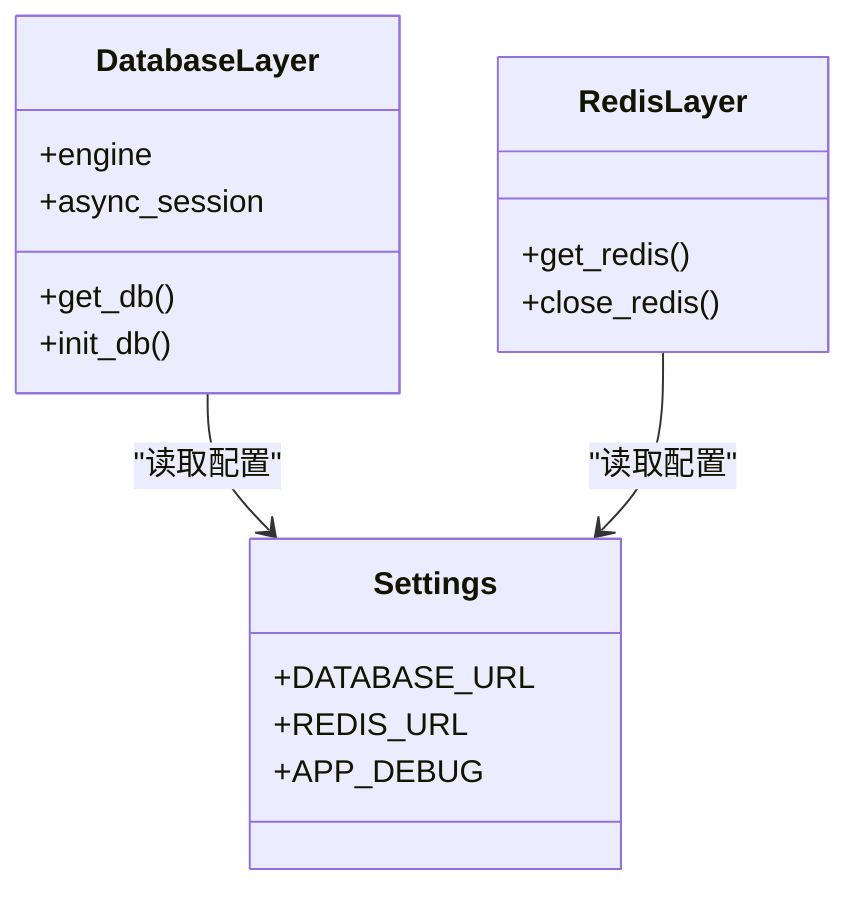

**图表来源**
- [backend/app/core/database.py:1-25](file://backend/app/core/database.py#L1-L25)
- [backend/app/core/redis.py:1-25](file://backend/app/core/redis.py#L1-L25)
- [backend/app/core/config.py:1-43](file://backend/app/core/config.py#L1-L43)

**章节来源**
- [backend/app/core/database.py:1-25](file://backend/app/core/database.py#L1-L25)
- [backend/app/core/redis.py:1-25](file://backend/app/core/redis.py#L1-L25)

### 组件D：行情API与采集器管理器
- 职责：提供实时行情、K线、分时、盘口等查询接口；通过采集器管理器实现主备数据源自动故障转移。
- 数据流：API接收参数 -> 管理器选择采集器 -> 调用具体采集器 -> 返回标准化数据结构。

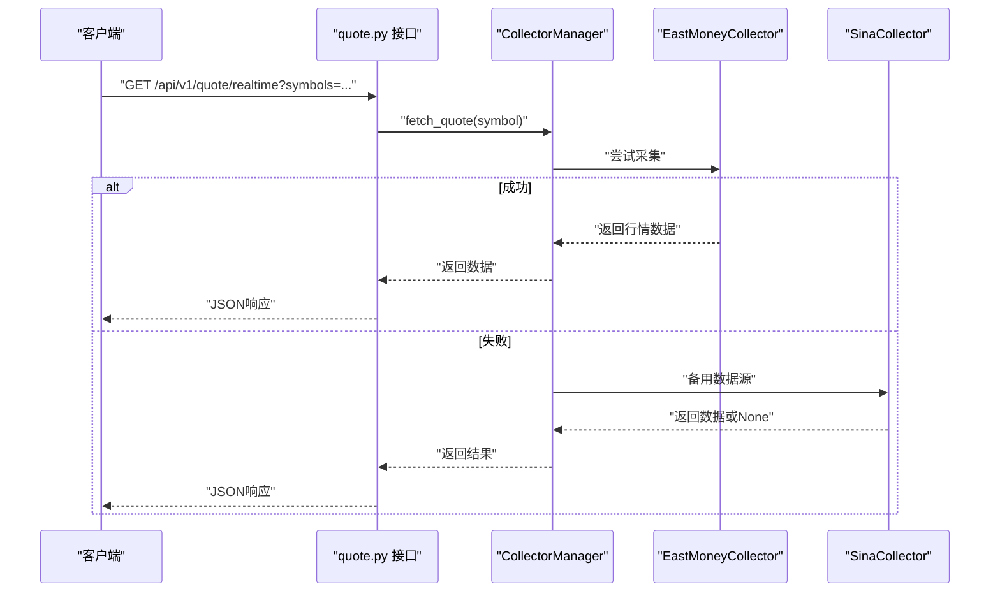

**图表来源**
- [backend/app/api/v1/quote.py:7-16](file://backend/app/api/v1/quote.py#L7-L16)
- [backend/app/services/collector/manager.py:21-32](file://backend/app/services/collector/manager.py#L21-L32)

**章节来源**
- [backend/app/api/v1/quote.py:1-65](file://backend/app/api/v1/quote.py#L1-L65)
- [backend/app/services/collector/manager.py:1-80](file://backend/app/services/collector/manager.py#L1-L80)

### 组件E：自选股管理（CRUD与排序）
- 职责：提供自选股增删改查与排序接口；使用异步数据库会话与SQL表达式实现原子操作。
- 数据模型：Watchlist表记录用户自选股及其排序字段。

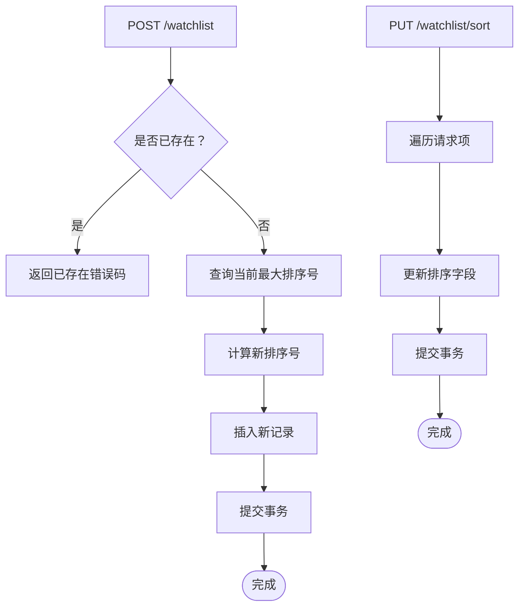

**图表来源**
- [backend/app/api/v1/watchlist.py:29-51](file://backend/app/api/v1/watchlist.py#L29-L51)
- [backend/app/api/v1/watchlist.py:64-77](file://backend/app/api/v1/watchlist.py#L64-L77)
- [backend/app/models/models.py:50-60](file://backend/app/models/models.py#L50-L60)

**章节来源**
- [backend/app/api/v1/watchlist.py:1-77](file://backend/app/api/v1/watchlist.py#L1-L77)
- [backend/app/models/models.py:50-60](file://backend/app/models/models.py#L50-L60)

### 组件F：WebSocket实时推送
- 职责：维护WebSocket连接与订阅关系，根据订阅关系向客户端广播行情更新；支持订阅、退订与心跳检测。
- 广播流程：收到订阅消息 -> 更新订阅集合 -> 发送已订阅确认 -> 有更新时广播 -> 断开清理。

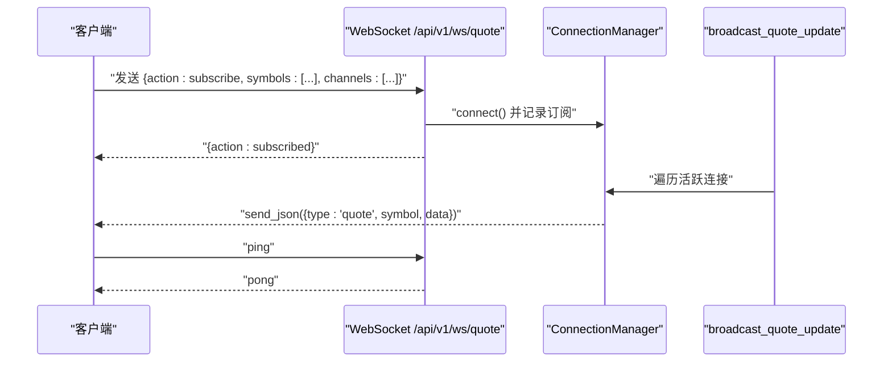

**图表来源**
- [backend/app/api/websocket.py:39-79](file://backend/app/api/websocket.py#L39-L79)

**章节来源**
- [backend/app/api/websocket.py:1-79](file://backend/app/api/websocket.py#L1-L79)

### 组件G：AI分析适配器与历史接口
- 职责：通过适配器工厂创建AI分析器，支持不同实现（mock/rule等）；提供分析历史与模型信息查询接口。
- 扩展性：新增AI模型只需实现统一接口并通过工厂注入即可无缝接入。

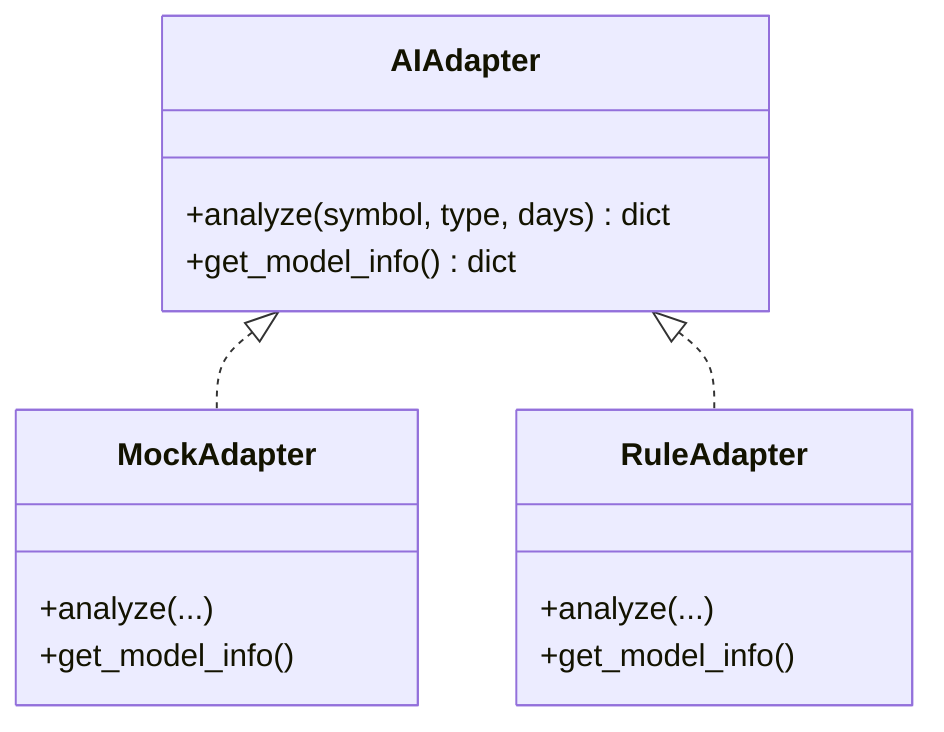

**图表来源**
- [backend/app/api/v1/ai.py:10-15](file://backend/app/api/v1/ai.py#L10-L15)
- [backend/app/api/v1/ai.py:24-29](file://backend/app/api/v1/ai.py#L24-L29)

**章节来源**
- [backend/app/api/v1/ai.py:1-29](file://backend/app/api/v1/ai.py#L1-L29)

### 组件H：数据模型与Schema
- 数据模型：StockInfo、QuoteDaily、QuoteTick、Watchlist、AIAnalysisLog等，覆盖股票基础信息、日线与分时、自选股与AI分析日志。
- Schema：Pydantic模型定义请求与响应结构，统一返回格式（code/message/data）。

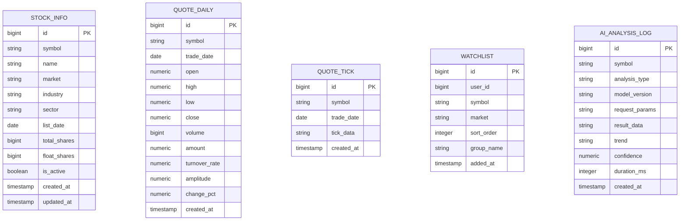

**图表来源**
- [backend/app/models/models.py:5-74](file://backend/app/models/models.py#L5-L74)
- [backend/app/schemas/schemas.py:6-103](file://backend/app/schemas/schemas.py#L6-L103)

**章节来源**
- [backend/app/models/models.py:1-74](file://backend/app/models/models.py#L1-L74)
- [backend/app/schemas/schemas.py:1-103](file://backend/app/schemas/schemas.py#L1-L103)

## 依赖分析
- 技术栈选择理由：
  - 前端：Vue 3 + TypeScript 提供强类型与组合式API；Pinia状态管理、ECharts图表、Element Plus组件满足交互与可视化需求。
  - 后端：FastAPI具备高性能与自动生成OpenAPI文档能力；SQLAlchemy 2.0异步ORM降低IO阻塞；Redis提供缓存与消息通道。
  - 数据库：PostgreSQL 15具备ACID与复杂查询能力；Redis 7提供低延迟缓存与发布订阅。
  - 部署：Docker + Nginx实现容器化与反向代理，简化运维。
- 外部依赖：HTTP客户端用于调用外部数据源（如东方财富搜索建议）；Celery计划用于异步任务队列。

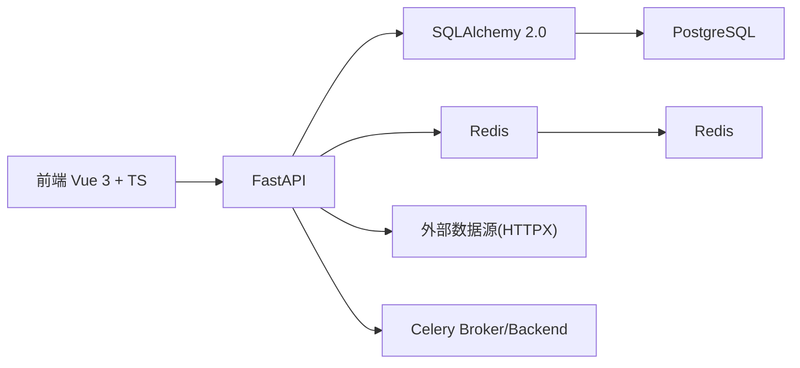

**图表来源**
- [backend/requirements.txt:1-17](file://backend/requirements.txt#L1-L17)
- [backend/app/api/v1/stock.py:13-36](file://backend/app/api/v1/stock.py#L13-L36)
- [backend/app/core/config.py:26-27](file://backend/app/core/config.py#L26-L27)

**章节来源**
- [README.md:11-18](file://README.md#L11-L18)
- [backend/requirements.txt:1-17](file://backend/requirements.txt#L1-L17)

## 性能考量
- 异步化：后端使用SQLAlchemy 2.0异步引擎与Redis异步客户端，避免阻塞；WebSocket长连接按需广播，减少无效推送。
- 连接池：数据库连接池参数可调；Redis连接池全局复用，降低连接开销。
- 缓存策略：配置中包含AI缓存开关与TTL，可按需启用；行情缓存TTL与采集间隔可调。
- 资源回收：应用生命周期内显式关闭Redis连接，避免资源泄漏。
- 扩展性：采集器与AI适配器采用工厂与接口抽象，便于替换与横向扩展。

**章节来源**
- [backend/app/core/database.py:7-8](file://backend/app/core/database.py#L7-L8)
- [backend/app/core/redis.py:10-18](file://backend/app/core/redis.py#L10-L18)
- [backend/app/core/config.py:29-30](file://backend/app/core/config.py#L29-L30)
- [backend/app/api/websocket.py:67-79](file://backend/app/api/websocket.py#L67-L79)

## 故障排查指南
- 健康检查：后端提供健康检查端点，用于快速判断服务状态。
- CORS问题：若前端无法访问后端，请检查CORS中间件配置与允许的来源。
- 数据库连接：确认DATABASE_URL正确指向PostgreSQL；启动时init_db应能创建表。
- Redis连接：确认REDIS_URL正确指向Redis；应用关闭时会主动关闭连接池。
- 数据源不可用：行情接口返回特定错误码表示数据源不可用，采集器管理器会尝试备用数据源。
- WebSocket断连：客户端需定期发送ping保持连接，断连后自动清理订阅。

**章节来源**
- [backend/app/main.py:46-48](file://backend/app/main.py#L46-L48)
- [backend/app/main.py:29-36](file://backend/app/main.py#L29-L36)
- [backend/app/core/database.py:23-25](file://backend/app/core/database.py#L23-L25)
- [backend/app/core/redis.py:21-24](file://backend/app/core/redis.py#L21-L24)
- [backend/app/api/v1/quote.py:31-33](file://backend/app/api/v1/quote.py#L31-L33)
- [backend/app/api/websocket.py:60-61](file://backend/app/api/websocket.py#L60-L61)

## 结论
本项目通过前后端分离与模块化设计，实现了清晰的分层与高内聚低耦合；后端以FastAPI为核心，结合SQLAlchemy 2.0异步ORM与Redis，提供了高性能与可扩展的数据访问能力；WebSocket实现实时推送；AI分析适配器与多数据源采集为未来扩展预留空间。整体架构兼顾开发效率与运行效率，适合在生产环境中持续演进。

## 附录
- 快速启动与常用命令参见README中的“快速启动”与“常用命令”章节。
- 环境变量说明参见README中的“环境变量说明”。

**章节来源**
- [README.md:22-162](file://README.md#L22-L162)