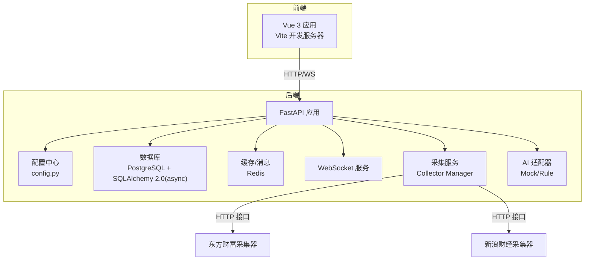
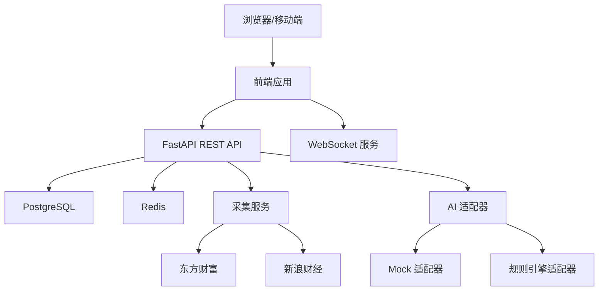
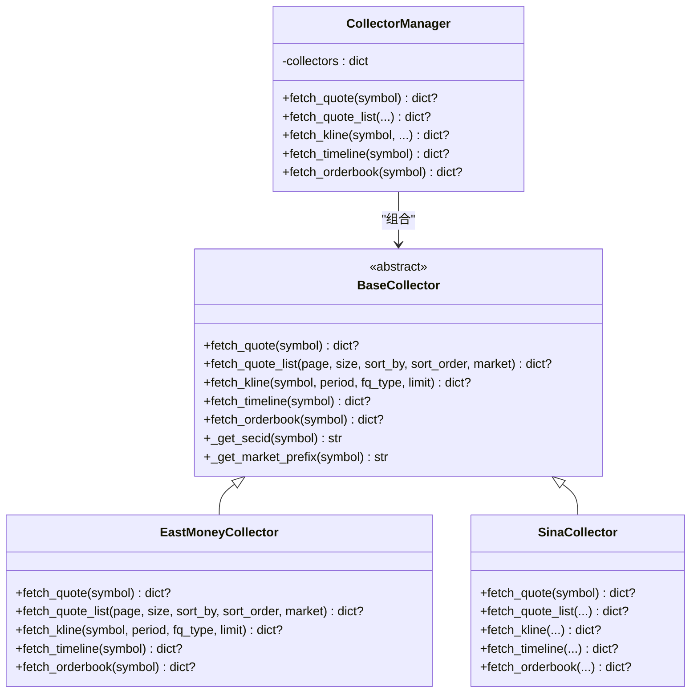
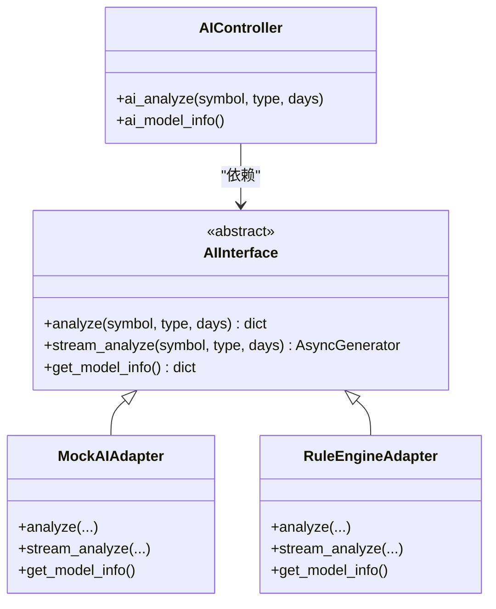
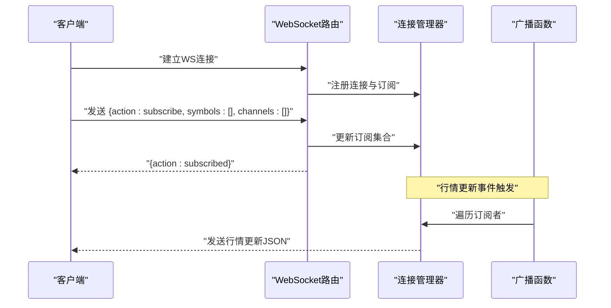
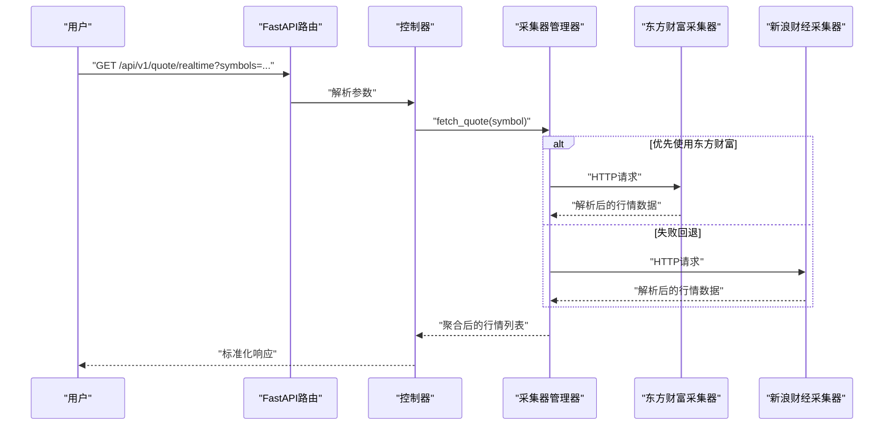
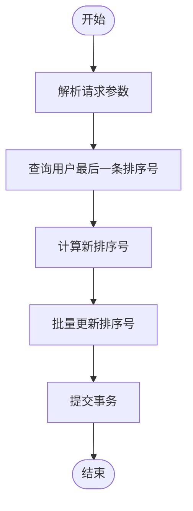
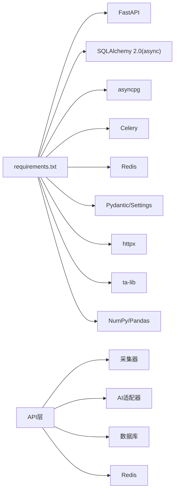

# 架构设计

<cite>
**本文引用的文件**
- [README.md](file://README.md)
- [backend/app/main.py](file://backend/app/main.py)
- [backend/app/core/config.py](file://backend/app/core/config.py)
- [backend/app/core/database.py](file://backend/app/core/database.py)
- [backend/app/core/redis.py](file://backend/app/core/redis.py)
- [backend/app/models/models.py](file://backend/app/models/models.py)
- [backend/app/schemas/schemas.py](file://backend/app/schemas/schemas.py)
- [backend/app/api/v1/quote.py](file://backend/app/api/v1/quote.py)
- [backend/app/api/v1/stock.py](file://backend/app/api/v1/stock.py)
- [backend/app/api/v1/watchlist.py](file://backend/app/api/v1/watchlist.py)
- [backend/app/api/v1/ai.py](file://backend/app/api/v1/ai.py)
- [backend/app/api/websocket.py](file://backend/app/api/websocket.py)
- [backend/app/services/collector/manager.py](file://backend/app/services/collector/manager.py)
- [backend/app/services/collector/base.py](file://backend/app/services/collector/base.py)
- [backend/app/services/collector/eastmoney.py](file://backend/app/services/collector/eastmoney.py)
- [backend/app/services/collector/sina.py](file://backend/app/services/collector/sina.py)
- [backend/app/ai/interface.py](file://backend/app/ai/interface.py)
- [backend/requirements.txt](file://backend/requirements.txt)
</cite>

## 目录
1. [引言](#引言)
2. [项目结构](#项目结构)
3. [核心组件](#核心组件)
4. [架构总览](#架构总览)
5. [详细组件分析](#详细组件分析)
6. [依赖分析](#依赖分析)
7. [性能考量](#性能考量)
8. [故障排查指南](#故障排查指南)
9. [结论](#结论)
10. [附录](#附录)

## 引言
本项目是一个面向A股市场的实时行情查看与AI分析平台，采用前后端分离架构，后端以FastAPI + SQLAlchemy 2.0(异步)为核心，结合PostgreSQL与Redis作为数据与缓存层，并通过WebSocket提供实时行情推送。系统具备可插拔的AI分析能力，支持Mock与规则引擎两种适配器，便于后续接入真实AI服务。部署采用Docker Compose + Nginx，支持一键启动与本地开发模式。

## 项目结构
项目采用“后端/前端”分层组织，后端按领域与层次划分模块：
- 应用入口与中间件：FastAPI应用、CORS、路由注册、健康检查
- 核心配置与基础设施：配置读取、数据库连接、Redis连接
- 数据模型与序列化：SQLAlchemy模型、Pydantic Schema
- API层：v1版本REST接口（行情、股票、自选股、AI）
- 服务层：数据采集器抽象与实现（东方财富、新浪财经），AI适配器接口
- WebSocket：连接管理与行情广播
- 异步任务：Celery相关（预留）

图表来源
- [backend/app/main.py:1-48](file://backend/app/main.py#L1-L48)
- [backend/app/core/config.py:1-43](file://backend/app/core/config.py#L1-L43)
- [backend/app/core/database.py:1-25](file://backend/app/core/database.py#L1-L25)
- [backend/app/core/redis.py:1-25](file://backend/app/core/redis.py#L1-L25)
- [backend/app/api/websocket.py:1-79](file://backend/app/api/websocket.py#L1-L79)
- [backend/app/services/collector/manager.py:1-80](file://backend/app/services/collector/manager.py#L1-L80)
- [backend/app/services/collector/eastmoney.py:1-240](file://backend/app/services/collector/eastmoney.py#L1-L240)
- [backend/app/services/collector/sina.py:1-79](file://backend/app/services/collector/sina.py#L1-L79)
- [backend/app/ai/interface.py:1-196](file://backend/app/ai/interface.py#L1-L196)

章节来源
- [README.md:92-126](file://README.md#L92-L126)
- [backend/app/main.py:1-48](file://backend/app/main.py#L1-L48)

## 核心组件
- 应用入口与生命周期
  - FastAPI应用初始化、CORS中间件、路由注册、健康检查
  - 生命周期钩子负责数据库初始化与Redis连接关闭
- 配置中心
  - 从环境变量读取数据库、Redis、AI、JWT、采集间隔等配置
  - 支持开发/生产环境切换与调试开关
- 数据层
  - SQLAlchemy 2.0 异步引擎与会话工厂
  - 统一的Base模型基类
- 缓存与消息
  - Redis异步连接池，全局复用
- API层
  - v1版本REST接口：行情、股票、自选股、AI、WebSocket
- 采集服务
  - CollectorManager统一调度，优先级与故障转移
  - 东方财富与新浪财经采集器实现具体接口
- AI分析
  - 抽象接口与Mock/Rule适配器，支持流式分析

章节来源
- [backend/app/main.py:1-48](file://backend/app/main.py#L1-L48)
- [backend/app/core/config.py:1-43](file://backend/app/core/config.py#L1-L43)
- [backend/app/core/database.py:1-25](file://backend/app/core/database.py#L1-L25)
- [backend/app/core/redis.py:1-25](file://backend/app/core/redis.py#L1-L25)
- [backend/app/models/models.py:1-74](file://backend/app/models/models.py#L1-L74)
- [backend/app/schemas/schemas.py:1-103](file://backend/app/schemas/schemas.py#L1-L103)
- [backend/app/api/v1/quote.py:1-65](file://backend/app/api/v1/quote.py#L1-L65)
- [backend/app/api/v1/stock.py:1-37](file://backend/app/api/v1/stock.py#L1-L37)
- [backend/app/api/v1/watchlist.py:1-77](file://backend/app/api/v1/watchlist.py#L1-L77)
- [backend/app/api/v1/ai.py:1-29](file://backend/app/api/v1/ai.py#L1-L29)
- [backend/app/api/websocket.py:1-79](file://backend/app/api/websocket.py#L1-L79)
- [backend/app/services/collector/manager.py:1-80](file://backend/app/services/collector/manager.py#L1-L80)
- [backend/app/services/collector/base.py:1-45](file://backend/app/services/collector/base.py#L1-L45)
- [backend/app/services/collector/eastmoney.py:1-240](file://backend/app/services/collector/eastmoney.py#L1-L240)
- [backend/app/services/collector/sina.py:1-79](file://backend/app/services/collector/sina.py#L1-L79)
- [backend/app/ai/interface.py:1-196](file://backend/app/ai/interface.py#L1-L196)

## 架构总览
系统采用前后端分离与微服务化理念（后端服务内部分层清晰，可独立演进）：
- 前端：Vue 3 + TypeScript，组件化UI，状态管理与路由分离
- 后端：FastAPI + SQLAlchemy 2.0(async)，REST API + WebSocket
- 数据层：PostgreSQL + Redis，分别承担持久化与缓存/消息
- 扩展点：AI分析插件化；数据采集多源与故障转移；异步任务预留

图表来源
- [backend/app/main.py:1-48](file://backend/app/main.py#L1-L48)
- [backend/app/api/websocket.py:1-79](file://backend/app/api/websocket.py#L1-L79)
- [backend/app/services/collector/manager.py:1-80](file://backend/app/services/collector/manager.py#L1-L80)
- [backend/app/services/collector/eastmoney.py:1-240](file://backend/app/services/collector/eastmoney.py#L1-L240)
- [backend/app/services/collector/sina.py:1-79](file://backend/app/services/collector/sina.py#L1-L79)
- [backend/app/ai/interface.py:1-196](file://backend/app/ai/interface.py#L1-L196)

## 详细组件分析

### 组件A：数据采集与故障转移（CollectorManager）
- 设计要点
  - 抽象采集器接口，统一规范fetch_quote/fetch_quote_list/fetch_kline/fetch_timeline/fetch_orderbook
  - CollectorManager按优先级轮询调用，异常即跳过，实现自动故障转移
  - 仅在特定接口上使用主数据源，其他接口可按需扩展
- 数据流
  - API层调用CollectorManager，再转发至具体采集器
  - 采集器通过HTTP客户端访问外部数据源，解析并返回标准化数据
- 错误处理
  - 捕获异常并记录警告日志，确保不影响整体流程
  - 所有数据源失败时返回None，由上层决定降级策略

图表来源
- [backend/app/services/collector/base.py:1-45](file://backend/app/services/collector/base.py#L1-L45)
- [backend/app/services/collector/eastmoney.py:1-240](file://backend/app/services/collector/eastmoney.py#L1-L240)
- [backend/app/services/collector/sina.py:1-79](file://backend/app/services/collector/sina.py#L1-L79)
- [backend/app/services/collector/manager.py:1-80](file://backend/app/services/collector/manager.py#L1-L80)

章节来源
- [backend/app/services/collector/base.py:1-45](file://backend/app/services/collector/base.py#L1-L45)
- [backend/app/services/collector/eastmoney.py:1-240](file://backend/app/services/collector/eastmoney.py#L1-L240)
- [backend/app/services/collector/sina.py:1-79](file://backend/app/services/collector/sina.py#L1-L79)
- [backend/app/services/collector/manager.py:1-80](file://backend/app/services/collector/manager.py#L1-L80)

### 组件B：AI分析插件化架构
- 设计要点
  - 抽象AI接口，统一analyze/stream_analyze/get_model_info
  - 提供Mock与规则引擎两种适配器，支持流式进度返回
  - 通过配置选择适配器名称，动态创建实例
- 数据流
  - API层接收请求参数，创建适配器并执行分析
  - 规则引擎适配器依赖采集器获取K线数据进行规则评分
- 扩展性
  - 新增适配器只需实现抽象接口，替换配置即可上线

图表来源
- [backend/app/ai/interface.py:1-196](file://backend/app/ai/interface.py#L1-L196)
- [backend/app/api/v1/ai.py:1-29](file://backend/app/api/v1/ai.py#L1-L29)

章节来源
- [backend/app/ai/interface.py:1-196](file://backend/app/ai/interface.py#L1-L196)
- [backend/app/api/v1/ai.py:1-29](file://backend/app/api/v1/ai.py#L1-L29)

### 组件C：WebSocket实时行情推送
- 设计要点
  - 连接管理器维护活动连接与订阅集合
  - 客户端通过动作(subscribe/unsubscribe/ping)控制订阅
  - 广播函数按符号与频道过滤，向订阅者推送行情更新
- 数据流
  - 定时任务或采集器触发行情更新事件
  - 广播函数遍历订阅者，发送JSON消息
- 错误处理
  - 发送异常视为连接断开，清理连接与订阅

图表来源
- [backend/app/api/websocket.py:1-79](file://backend/app/api/websocket.py#L1-L79)

章节来源
- [backend/app/api/websocket.py:1-79](file://backend/app/api/websocket.py#L1-L79)

### 组件D：REST API处理链路（以行情为例）
- 设计要点
  - API路由按功能域划分（quote/stock/watchlist/ai/ws）
  - 控制器层负责参数解析与调用服务层
  - 服务层通过采集器获取数据，返回标准化响应
- 数据流
  - 客户端请求 -> FastAPI路由 -> 控制器 -> 采集器 -> 外部数据源 -> 返回标准化数据
- 错误处理
  - 数据源不可用时返回明确错误码与提示

图表来源
- [backend/app/api/v1/quote.py:1-65](file://backend/app/api/v1/quote.py#L1-L65)
- [backend/app/services/collector/manager.py:1-80](file://backend/app/services/collector/manager.py#L1-L80)
- [backend/app/services/collector/eastmoney.py:1-240](file://backend/app/services/collector/eastmoney.py#L1-L240)
- [backend/app/services/collector/sina.py:1-79](file://backend/app/services/collector/sina.py#L1-L79)

章节来源
- [backend/app/api/v1/quote.py:1-65](file://backend/app/api/v1/quote.py#L1-L65)
- [backend/app/services/collector/manager.py:1-80](file://backend/app/services/collector/manager.py#L1-L80)
- [backend/app/services/collector/eastmoney.py:1-240](file://backend/app/services/collector/eastmoney.py#L1-L240)
- [backend/app/services/collector/sina.py:1-79](file://backend/app/services/collector/sina.py#L1-L79)

### 组件E：自定义流程（自选股排序）

图表来源
- [backend/app/api/v1/watchlist.py:64-77](file://backend/app/api/v1/watchlist.py#L64-L77)

章节来源
- [backend/app/api/v1/watchlist.py:1-77](file://backend/app/api/v1/watchlist.py#L1-L77)

## 依赖分析
- 技术栈与版本
  - 后端：FastAPI 0.110.*、SQLAlchemy 2.0.*、asyncpg、Celery、Redis、Pydantic/Settings、httpx、TA/Lib、NumPy/Pandas
- 组件耦合
  - API层对采集器与AI适配器松耦合（通过抽象接口与工厂函数）
  - 采集器对具体外部数据源紧耦合，但通过Manager集中管理
  - 数据层通过异步引擎与会话工厂解耦业务逻辑
- 外部依赖
  - 东方财富、新浪财经HTTP接口
  - PostgreSQL与Redis服务
  - Docker Compose/Nginx部署

图表来源
- [backend/requirements.txt:1-17](file://backend/requirements.txt#L1-L17)
- [backend/app/main.py:1-48](file://backend/app/main.py#L1-L48)

章节来源
- [backend/requirements.txt:1-17](file://backend/requirements.txt#L1-L17)
- [backend/app/main.py:1-48](file://backend/app/main.py#L1-L48)

## 性能考量
- 异步化
  - 数据库使用SQLAlchemy 2.0异步引擎，降低IO阻塞
  - 采集器与AI分析均采用异步HTTP客户端与协程
- 缓存与限流
  - Redis用于缓存与消息队列，可扩展为分布式缓存
  - AI侧支持请求超时、缓存TTL、速率限制等配置
- 并发与连接池
  - 数据库连接池参数可调，满足高并发场景
  - Redis连接池全局复用，避免频繁创建销毁
- 采集优化
  - CollectorManager优先级与故障转移减少单点风险
  - 采集间隔与缓存TTL配置可平衡实时性与成本

## 故障排查指南
- 健康检查
  - 访问健康端点确认后端存活与版本信息
- 日志与异常
  - 采集器与AI适配器捕获异常并记录警告日志，便于定位问题
- 数据源不可用
  - API层在数据源不可用时返回明确错误码与提示，前端友好展示
- WebSocket连接
  - 发送异常会触发断开清理，检查客户端心跳与订阅参数

章节来源
- [backend/app/main.py:46-48](file://backend/app/main.py#L46-L48)
- [backend/app/api/v1/quote.py:28-33](file://backend/app/api/v1/quote.py#L28-L33)
- [backend/app/api/websocket.py:29-34](file://backend/app/api/websocket.py#L29-L34)

## 结论
本项目通过前后端分离与清晰的分层设计，实现了高性能、可扩展、易维护的A股行情与AI分析平台。后端以FastAPI为核心，结合异步数据库与Redis，提供稳定的REST与WebSocket服务能力；采集层通过多源与故障转移保障数据可用性；AI层采用插件化架构，便于未来接入真实AI服务。整体架构具备良好的扩展性与可运维性，适合持续迭代与功能扩展。

## 附录
- 系统边界
  - 前端：Vue 3应用，负责UI渲染与用户交互
  - 后端：FastAPI服务，提供API与WebSocket，协调采集与AI
  - 数据层：PostgreSQL存储结构化数据，Redis提供缓存与消息
- 第三方服务集成
  - 东方财富、新浪财经：行情数据采集
  - Docker Compose/Nginx：容器编排与反向代理
- 环境变量与配置
  - 数据库URL、Redis URL、AI适配器、采集间隔、缓存TTL、JWT等

章节来源
- [README.md:130-142](file://README.md#L130-L142)
- [backend/app/core/config.py:1-43](file://backend/app/core/config.py#L1-L43)