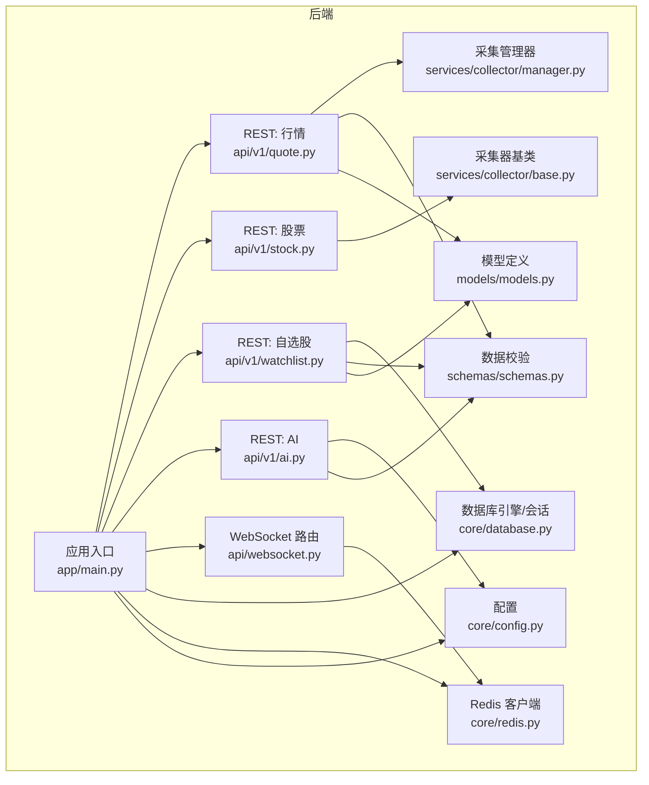
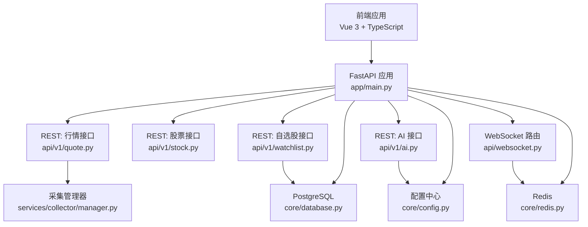
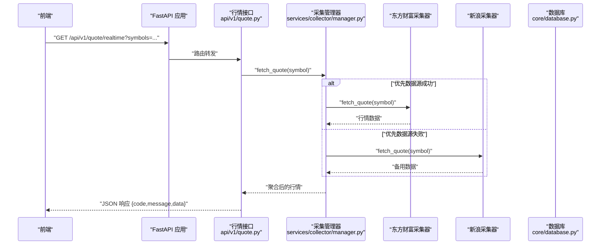
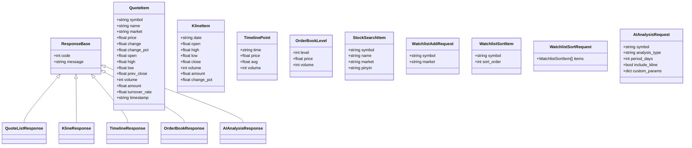
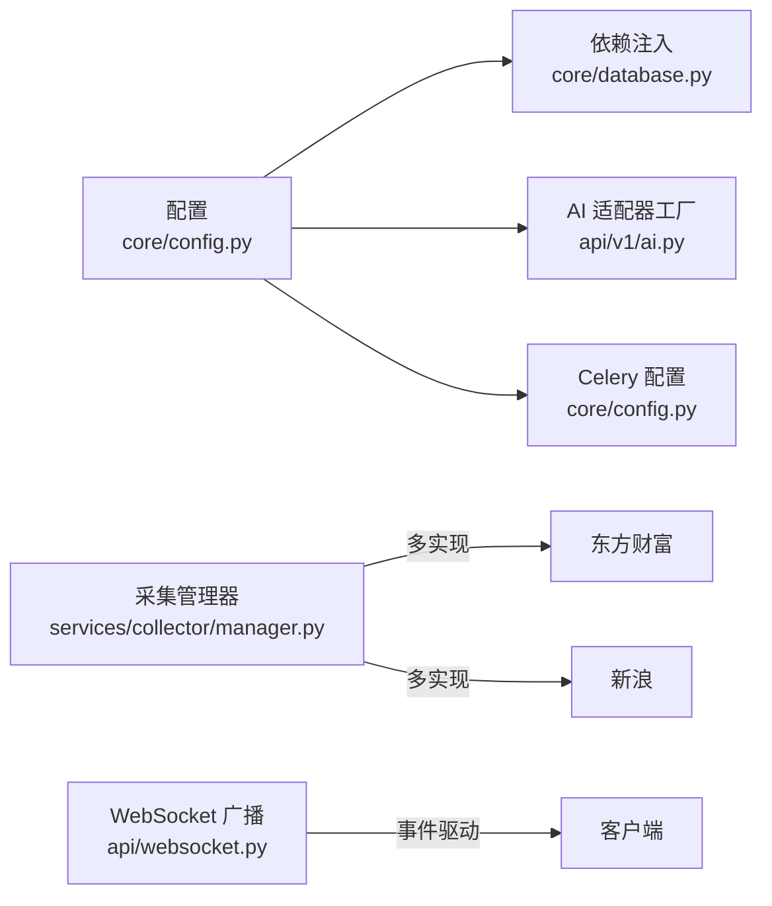
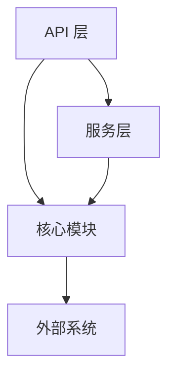

# 组件交互设计

<cite>
**本文引用的文件**
- [backend/app/main.py](file://backend/app/main.py)
- [backend/app/api/websocket.py](file://backend/app/api/websocket.py)
- [backend/app/core/database.py](file://backend/app/core/database.py)
- [backend/app/core/redis.py](file://backend/app/core/redis.py)
- [backend/app/core/config.py](file://backend/app/core/config.py)
- [backend/app/models/models.py](file://backend/app/models/models.py)
- [backend/app/api/v1/quote.py](file://backend/app/api/v1/quote.py)
- [backend/app/api/v1/stock.py](file://backend/app/api/v1/stock.py)
- [backend/app/api/v1/watchlist.py](file://backend/app/api/v1/watchlist.py)
- [backend/app/api/v1/ai.py](file://backend/app/api/v1/ai.py)
- [backend/app/services/collector/manager.py](file://backend/app/services/collector/manager.py)
- [backend/app/services/collector/base.py](file://backend/app/services/collector/base.py)
- [backend/app/schemas/schemas.py](file://backend/app/schemas/schemas.py)
- [README.md](file://README.md)
</cite>

## 目录
1. [引言](#引言)
2. [项目结构](#项目结构)
3. [核心组件](#核心组件)
4. [架构总览](#架构总览)
5. [详细组件分析](#详细组件分析)
6. [依赖分析](#依赖分析)
7. [性能考虑](#性能考虑)
8. [故障排查指南](#故障排查指南)
9. [结论](#结论)
10. [附录](#附录)

## 引言
本设计文档聚焦 Stock-View 项目的组件交互设计，系统性阐述前端组件、后端服务、数据库与缓存之间的协作模式；深入解析 WebSocket 实时通信机制（连接建立、订阅管理、消息推送、断线重连策略）；梳理 API 调用链路、数据传输格式与错误处理策略；总结组件解耦设计（依赖注入、事件驱动、消息队列等异步通信模式），并给出性能优化与并发处理建议。

## 项目结构
后端采用 FastAPI 应用入口集中注册路由，核心模块按职责划分：
- 应用入口与生命周期：FastAPI 应用、CORS 中间件、路由注册、健康检查
- 核心基础设施：数据库（SQLAlchemy 2.x async）、Redis（aioredis）、配置（pydantic-settings）
- API 层：v1 版本 REST 接口（行情、股票、自选股、AI）
- 服务层：数据采集器抽象与多数据源管理器（东方财富、新浪）
- 模型与校验：SQLAlchemy 模型与 Pydantic Schema
- WebSocket：连接管理器与行情广播



图表来源
- [backend/app/main.py:22-48](file://backend/app/main.py#L22-L48)
- [backend/app/api/websocket.py:12-36](file://backend/app/api/websocket.py#L12-L36)
- [backend/app/core/database.py:7-25](file://backend/app/core/database.py#L7-L25)
- [backend/app/core/redis.py:10-25](file://backend/app/core/redis.py#L10-L25)
- [backend/app/core/config.py:5-43](file://backend/app/core/config.py#L5-L43)
- [backend/app/api/v1/quote.py:1-65](file://backend/app/api/v1/quote.py#L1-L65)
- [backend/app/api/v1/stock.py:1-37](file://backend/app/api/v1/stock.py#L1-L37)
- [backend/app/api/v1/watchlist.py:1-77](file://backend/app/api/v1/watchlist.py#L1-L77)
- [backend/app/api/v1/ai.py:1-29](file://backend/app/api/v1/ai.py#L1-L29)
- [backend/app/services/collector/manager.py:12-80](file://backend/app/services/collector/manager.py#L12-L80)
- [backend/app/services/collector/base.py:5-45](file://backend/app/services/collector/base.py#L5-L45)
- [backend/app/models/models.py:1-74](file://backend/app/models/models.py#L1-L74)
- [backend/app/schemas/schemas.py:1-103](file://backend/app/schemas/schemas.py#L1-L103)

章节来源
- [backend/app/main.py:1-48](file://backend/app/main.py#L1-L48)
- [README.md:92-126](file://README.md#L92-L126)

## 核心组件
- 应用入口与生命周期
  - 使用 lifespan 在启动阶段初始化数据库，在关闭阶段释放 Redis 连接池
  - 注册 CORS 中间件与多路由前缀统一为 /api/v1
  - 提供健康检查接口
- 数据库与缓存
  - 异步 SQLAlchemy 引擎与会话工厂，连接池参数可配置
  - Redis 客户端通过全局连接池提供，支持关闭回收
- 配置中心
  - 从环境变量加载数据库、Redis、AI、Celery、采集间隔与缓存 TTL 等配置
- API 层
  - 行情：实时、列表、K线、分时、盘口
  - 股票：搜索（基于东方财富建议接口）
  - 自选股：增删改查与排序
  - AI：分析请求、历史预留、模型信息
- 服务层
  - 采集器抽象与多数据源管理器，支持主备数据源自动故障转移
- WebSocket
  - 连接管理器维护活动连接与订阅集合，提供订阅/退订与心跳响应
  - 广播函数按符号与频道过滤推送

章节来源
- [backend/app/main.py:13-48](file://backend/app/main.py#L13-L48)
- [backend/app/core/database.py:7-25](file://backend/app/core/database.py#L7-L25)
- [backend/app/core/redis.py:10-25](file://backend/app/core/redis.py#L10-L25)
- [backend/app/core/config.py:5-43](file://backend/app/core/config.py#L5-L43)
- [backend/app/api/v1/quote.py:1-65](file://backend/app/api/v1/quote.py#L1-L65)
- [backend/app/api/v1/stock.py:1-37](file://backend/app/api/v1/stock.py#L1-L37)
- [backend/app/api/v1/watchlist.py:1-77](file://backend/app/api/v1/watchlist.py#L1-L77)
- [backend/app/api/v1/ai.py:1-29](file://backend/app/api/v1/ai.py#L1-L29)
- [backend/app/services/collector/manager.py:12-80](file://backend/app/services/collector/manager.py#L12-L80)
- [backend/app/api/websocket.py:12-79](file://backend/app/api/websocket.py#L12-L79)

## 架构总览
下图展示从前端到后端、数据库与缓存的整体交互路径，以及 WebSocket 的实时推送通道。



图表来源
- [backend/app/main.py:22-48](file://backend/app/main.py#L22-L48)
- [backend/app/api/v1/quote.py:1-65](file://backend/app/api/v1/quote.py#L1-L65)
- [backend/app/api/v1/stock.py:1-37](file://backend/app/api/v1/stock.py#L1-L37)
- [backend/app/api/v1/watchlist.py:1-77](file://backend/app/api/v1/watchlist.py#L1-L77)
- [backend/app/api/v1/ai.py:1-29](file://backend/app/api/v1/ai.py#L1-L29)
- [backend/app/api/websocket.py:12-79](file://backend/app/api/websocket.py#L12-L79)
- [backend/app/services/collector/manager.py:12-80](file://backend/app/services/collector/manager.py#L12-L80)
- [backend/app/core/database.py:7-25](file://backend/app/core/database.py#L7-L25)
- [backend/app/core/redis.py:10-25](file://backend/app/core/redis.py#L10-L25)
- [backend/app/core/config.py:5-43](file://backend/app/core/config.py#L5-L43)

## 详细组件分析

### WebSocket 实时通信机制
- 连接建立
  - 客户端通过 /api/v1/ws/quote 建立 WebSocket 连接，服务端接受并登记为活动连接
  - 记录每个连接的订阅集合（symbols、channels）
- 订阅管理
  - 客户端发送包含 action 的 JSON 消息，支持 subscribe/unsubscribe/ping
  - 服务端更新订阅集合，并回执订阅结果
- 消息推送
  - 广播函数按 symbol 与 channel 过滤，向匹配的连接推送行情消息
  - 发送异常时自动移除失效连接
- 断线重连
  - 客户端收到 WebSocketDisconnect 后应主动重连
  - 重连后需重新发送订阅请求以恢复订阅状态

```mermaid
sequenceDiagram
participant C as "客户端"
participant WS as "WebSocket 路由<br/>api/websocket.py"
participant M as "连接管理器"
participant R as "Redis 客户端"
C->>WS : "建立 /api/v1/ws/quote 连接"
WS->>M : "accept 并登记活动连接"
C->>WS : "发送 {action : subscribe, symbols : [], channels : []}"
WS->>M : "更新订阅集合"
WS-->>C : "{action : subscribed}"
Note over WS,R : "后台可通过 Redis 或业务逻辑触发推送"
WS->>R : "获取/存储订阅状态可选"
WS-->>C : "推送行情消息 {type : quote, symbol, data}"
C->>WS : "发送 {action : ping}"
WS-->>C : "{action : pong, timestamp}"
C--/X : "断开连接"
WS->>M : "移除连接与订阅"
```

图表来源
- [backend/app/api/websocket.py:12-79](file://backend/app/api/websocket.py#L12-L79)
- [backend/app/core/redis.py:10-25](file://backend/app/core/redis.py#L10-L25)

章节来源
- [backend/app/api/websocket.py:12-79](file://backend/app/api/websocket.py#L12-L79)

### API 调用链路与数据传输
- 行情接口
  - GET /api/v1/quote/realtime：按逗号分隔的 symbol 列表批量获取实时行情
  - GET /api/v1/quote/list：分页获取行情列表，支持排序字段与方向
  - GET /api/v1/quote/kline：获取 K 线，支持周期、复权与数量限制
  - GET /api/v1/quote/timeline：获取分时数据
  - GET /api/v1/quote/orderbook：获取盘口数据
- 股票搜索
  - GET /api/v1/stock/search：关键词搜索，返回 A 股标的建议
- 自选股
  - GET /api/v1/watchlist：获取当前用户自选股列表
  - POST /api/v1/watchlist：添加自选股（去重与排序）
  - DELETE /api/v1/watchlist/{symbol}：删除自选股
  - PUT /api/v1/watchlist/sort：批量调整排序
- AI 分析
  - POST /api/v1/ai/analyze：请求 AI 分析
  - GET /api/v1/ai/history：历史记录预留
  - GET /api/v1/ai/model-info：获取模型信息



图表来源
- [backend/app/api/v1/quote.py:1-65](file://backend/app/api/v1/quote.py#L1-L65)
- [backend/app/services/collector/manager.py:12-80](file://backend/app/services/collector/manager.py#L12-L80)
- [backend/app/services/collector/base.py:5-45](file://backend/app/services/collector/base.py#L5-L45)

章节来源
- [backend/app/api/v1/quote.py:1-65](file://backend/app/api/v1/quote.py#L1-L65)
- [backend/app/api/v1/stock.py:1-37](file://backend/app/api/v1/stock.py#L1-L37)
- [backend/app/api/v1/watchlist.py:1-77](file://backend/app/api/v1/watchlist.py#L1-L77)
- [backend/app/api/v1/ai.py:1-29](file://backend/app/api/v1/ai.py#L1-L29)

### 数据模型与传输格式
- 通用响应体
  - 字段：code、message、data
- 行情项
  - 字段：symbol、name、market、price、change、change_pct、open、high、low、prev_close、volume、amount、turnover_rate、timestamp
- K线项
  - 字段：date、open、high、low、close、volume、amount、change_pct
- 分时点
  - 字段：time、price、avg、volume
- 盘口层级
  - 字段：level、price、volume
- 股票搜索项
  - 字段：symbol、name、market、pinyin
- 自选股请求
  - 添加：symbol、market
  - 排序：items[{symbol, sort_order}]
- AI 分析请求
  - 字段：symbol、analysis_type、period_days、include_kline、custom_params



图表来源
- [backend/app/schemas/schemas.py:6-103](file://backend/app/schemas/schemas.py#L6-L103)

章节来源
- [backend/app/schemas/schemas.py:1-103](file://backend/app/schemas/schemas.py#L1-L103)

### 错误处理策略
- API 层
  - 对于数据源不可用或查询失败的场景，返回标准化错误码与消息
  - 示例：数据源不可用返回特定 code，股票代码不存在返回特定 code
- WebSocket 层
  - 发送异常时主动断开连接，避免僵尸连接
  - 支持 ping/pong 心跳检测，便于客户端侧断线重连
- 数据库层
  - 通过依赖注入的异步会话确保请求作用域内的事务与资源释放
- 配置层
  - 通过 LRU 缓存减少重复解析配置的成本

章节来源
- [backend/app/api/v1/quote.py:19-65](file://backend/app/api/v1/quote.py#L19-L65)
- [backend/app/api/v1/watchlist.py:13-77](file://backend/app/api/v1/watchlist.py#L13-L77)
- [backend/app/api/websocket.py:29-34](file://backend/app/api/websocket.py#L29-L34)
- [backend/app/core/database.py:15-20](file://backend/app/core/database.py#L15-L20)
- [backend/app/core/config.py:41-43](file://backend/app/core/config.py#L41-L43)

### 组件解耦设计
- 依赖注入
  - 数据库会话通过依赖函数注入，确保路由层无需感知具体连接细节
  - 配置通过单例 Settings 与缓存函数提供，避免全局状态散落
- 事件驱动与消息队列
  - 配置中预留 Celery 相关 Broker 与 Backend，可用于引入异步任务队列
  - WebSocket 广播作为事件驱动的下行通道，订阅者与发布者解耦
- 插件化与适配器
  - AI 分析通过适配器工厂创建不同实现（mock/rule），便于替换与扩展
  - 数据采集器抽象定义统一接口，多实现并存，支持故障转移



图表来源
- [backend/app/core/config.py:26-27](file://backend/app/core/config.py#L26-L27)
- [backend/app/api/v1/ai.py:10-15](file://backend/app/api/v1/ai.py#L10-L15)
- [backend/app/services/collector/manager.py:12-80](file://backend/app/services/collector/manager.py#L12-L80)
- [backend/app/api/websocket.py:67-79](file://backend/app/api/websocket.py#L67-L79)

章节来源
- [backend/app/core/database.py:15-20](file://backend/app/core/database.py#L15-L20)
- [backend/app/core/config.py:26-27](file://backend/app/core/config.py#L26-L27)
- [backend/app/api/v1/ai.py:10-15](file://backend/app/api/v1/ai.py#L10-L15)
- [backend/app/services/collector/manager.py:12-80](file://backend/app/services/collector/manager.py#L12-L80)
- [backend/app/api/websocket.py:67-79](file://backend/app/api/websocket.py#L67-L79)

## 依赖分析
- 模块耦合
  - API 层对服务层与基础设施有直接依赖，但通过抽象与配置实现松耦合
  - WebSocket 与 Redis 存在弱耦合（可选用于持久化订阅状态）
- 外部依赖
  - PostgreSQL 与 Redis 作为外部基础设施，通过连接字符串与连接池管理
  - HTTP 客户端用于外部数据源（如股票搜索）
- 循环依赖
  - 当前结构未发现循环导入；若后续引入任务队列，需注意模块拆分避免循环



图表来源
- [backend/app/main.py:22-48](file://backend/app/main.py#L22-L48)
- [backend/app/api/v1/quote.py:1-65](file://backend/app/api/v1/quote.py#L1-L65)
- [backend/app/services/collector/manager.py:12-80](file://backend/app/services/collector/manager.py#L12-L80)
- [backend/app/core/database.py:7-25](file://backend/app/core/database.py#L7-L25)
- [backend/app/core/redis.py:10-25](file://backend/app/core/redis.py#L10-L25)

章节来源
- [backend/app/main.py:22-48](file://backend/app/main.py#L22-L48)
- [backend/app/api/v1/quote.py:1-65](file://backend/app/api/v1/quote.py#L1-L65)
- [backend/app/services/collector/manager.py:12-80](file://backend/app/services/collector/manager.py#L12-L80)
- [backend/app/core/database.py:7-25](file://backend/app/core/database.py#L7-L25)
- [backend/app/core/redis.py:10-25](file://backend/app/core/redis.py#L10-L25)

## 性能考虑
- 连接池与并发
  - 数据库连接池参数可调，建议结合峰值 QPS 与慢查询分析进行优化
  - WebSocket 连接数与广播频率需监控，避免高并发下的内存与带宽压力
- 缓存策略
  - 配置中提供采集间隔与缓存 TTL，建议结合热点数据与更新频率设定
  - Redis 可用于缓存热点行情与订阅状态，降低数据库与上游数据源压力
- 异步与超时
  - 所有 IO 操作采用异步，HTTP 客户端设置合理超时，避免阻塞
- 负载均衡与水平扩展
  - 建议通过反向代理与多实例部署提升吞吐与可用性

## 故障排查指南
- 健康检查
  - 访问 /api/v1/health 确认服务可用与版本信息
- 日志与错误码
  - 关注 API 返回的 code/message，定位数据源不可用或参数错误
  - WebSocket 发送异常会触发断开，检查客户端重连逻辑
- 数据库与缓存
  - 确认连接字符串与网络可达性
  - Redis 连接池在应用关闭时回收，避免资源泄漏
- 配置问题
  - 确认 .env 文件中的数据库与 Redis 地址、AI 适配器与限流参数

章节来源
- [backend/app/main.py:46-48](file://backend/app/main.py#L46-L48)
- [backend/app/api/v1/quote.py:19-65](file://backend/app/api/v1/quote.py#L19-L65)
- [backend/app/api/websocket.py:29-34](file://backend/app/api/websocket.py#L29-L34)
- [backend/app/core/redis.py:21-25](file://backend/app/core/redis.py#L21-L25)
- [backend/app/core/config.py:12-14](file://backend/app/core/config.py#L12-L14)

## 结论
本设计文档从组件交互、实时通信、API 流程、数据模型、错误处理与解耦策略等方面，系统性梳理了 Stock-View 的后端架构。通过抽象化的服务层、可插拔的 AI 适配器、事件驱动的 WebSocket 广播以及可配置的缓存与限流策略，系统在保证扩展性的同时兼顾性能与稳定性。后续可在任务队列、指标监控与可观测性方面进一步完善。

## 附录
- 环境变量与默认值参见 README 的“环境变量说明”
- 快速启动与开发调试步骤参见 README 的“快速启动”与“常用命令”

章节来源
- [README.md:130-142](file://README.md#L130-L142)
- [README.md:22-88](file://README.md#L22-L88)
- [README.md:146-163](file://README.md#L146-L163)