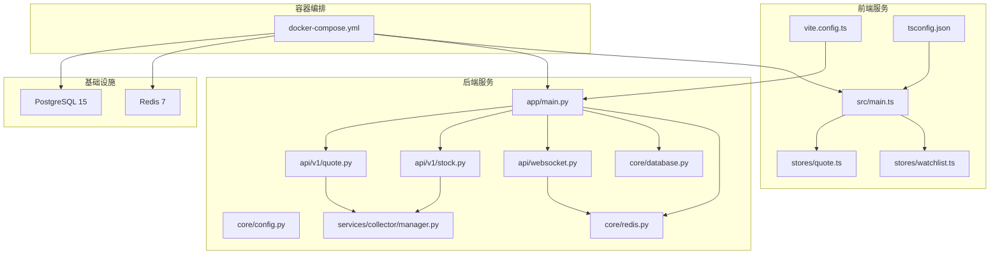
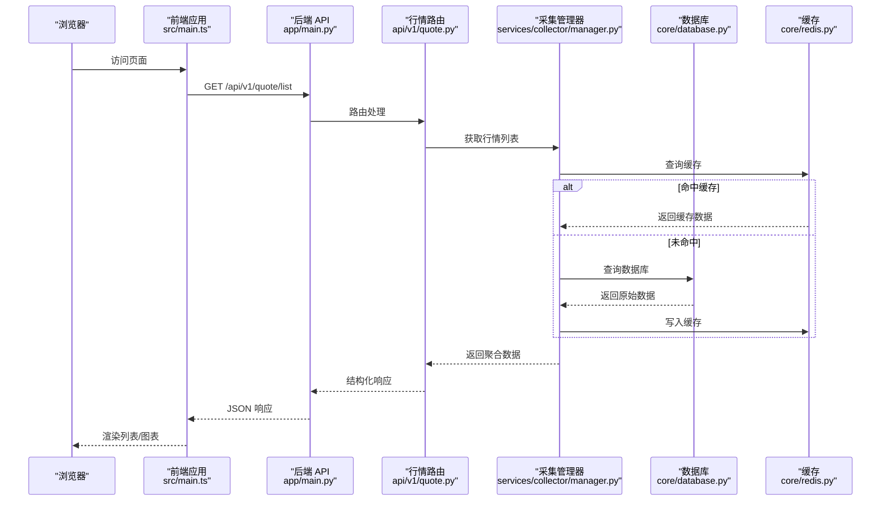
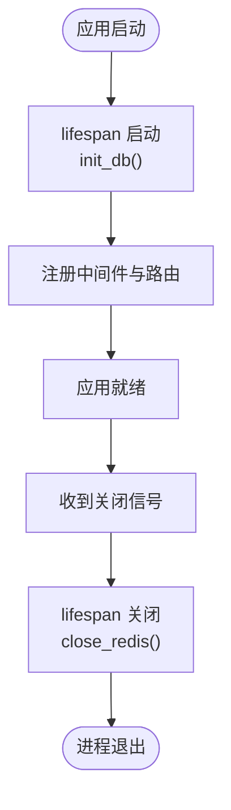
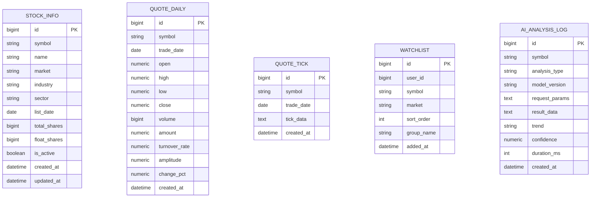
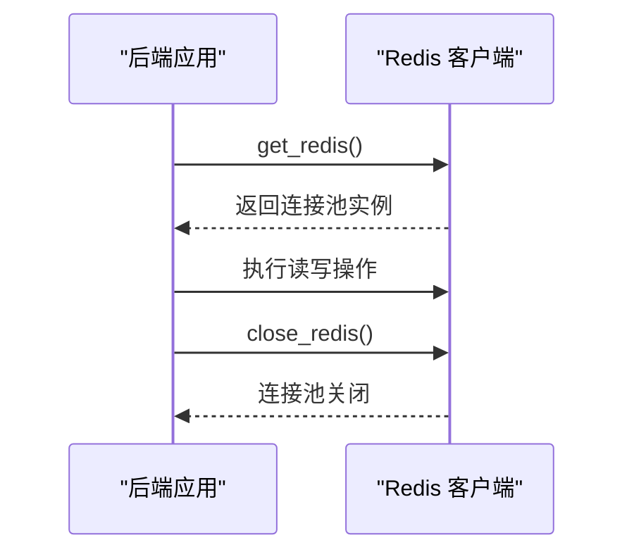
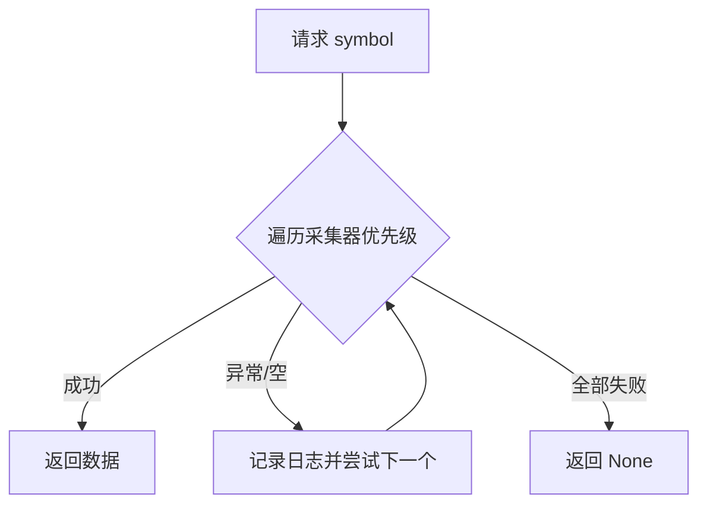
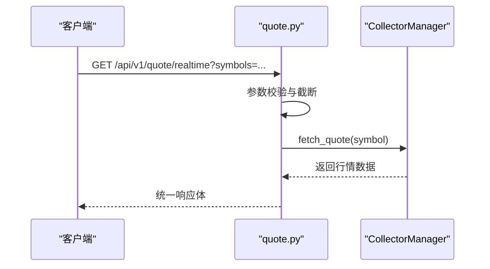
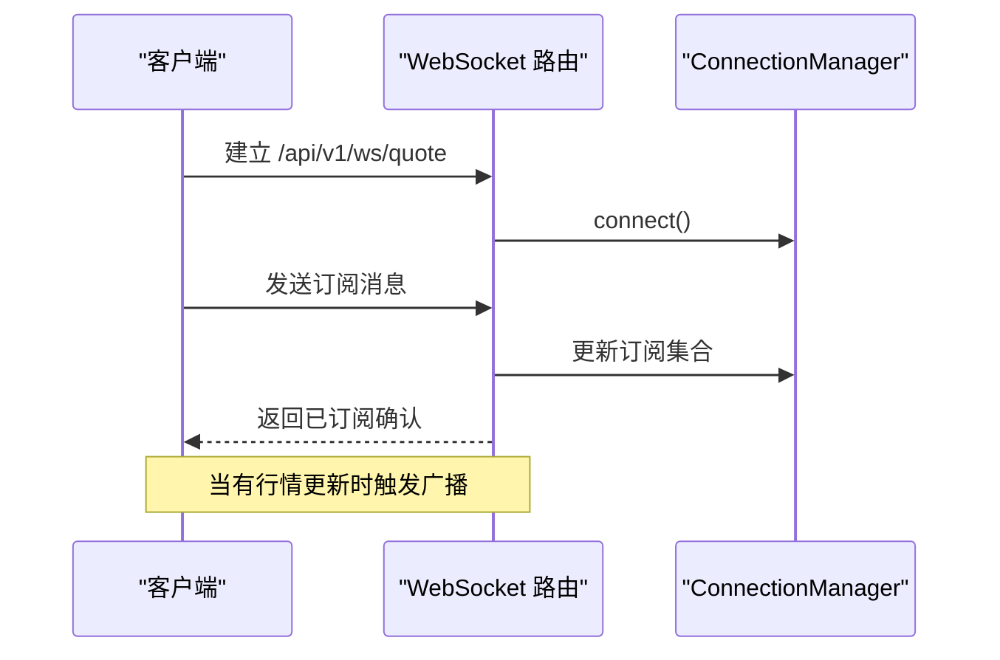
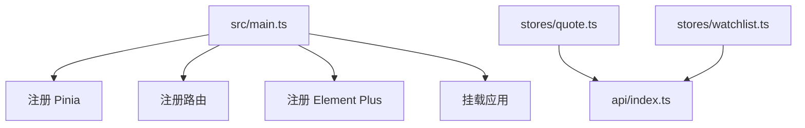
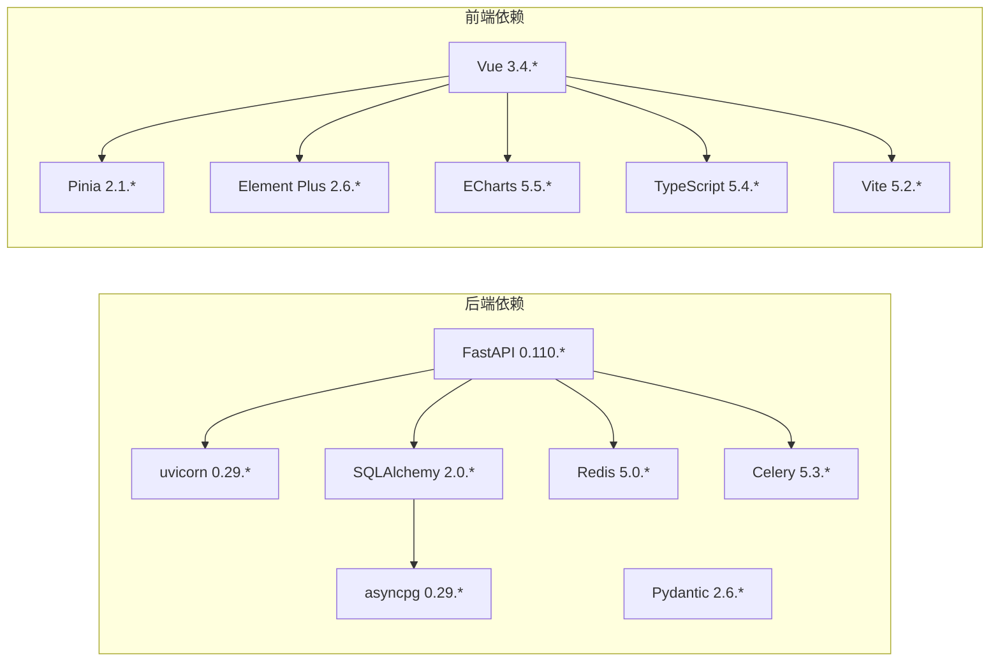

# 技术选型与组件

<cite>
**本文引用的文件**
- [backend/Dockerfile](file://backend/Dockerfile)
- [frontend/Dockerfile](file://frontend/Dockerfile)
- [docker-compose.yml](file://docker-compose.yml)
- [backend/requirements.txt](file://backend/requirements.txt)
- [frontend/package.json](file://frontend/package.json)
- [backend/app/main.py](file://backend/app/main.py)
- [backend/app/core/config.py](file://backend/app/core/config.py)
- [backend/app/core/database.py](file://backend/app/core/database.py)
- [backend/app/core/redis.py](file://backend/app/core/redis.py)
- [backend/app/models/models.py](file://backend/app/models/models.py)
- [backend/app/schemas/schemas.py](file://backend/app/schemas/schemas.py)
- [backend/app/api/v1/quote.py](file://backend/app/api/v1/quote.py)
- [backend/app/api/v1/stock.py](file://backend/app/api/v1/stock.py)
- [backend/app/api/websocket.py](file://backend/app/api/websocket.py)
- [backend/app/services/collector/manager.py](file://backend/app/services/collector/manager.py)
- [frontend/vite.config.ts](file://frontend/vite.config.ts)
- [frontend/tsconfig.json](file://frontend/tsconfig.json)
- [frontend/src/main.ts](file://frontend/src/main.ts)
- [frontend/src/stores/quote.ts](file://frontend/src/stores/quote.ts)
- [frontend/src/stores/watchlist.ts](file://frontend/src/stores/watchlist.ts)
</cite>

## 目录
1. [引言](#引言)
2. [项目结构](#项目结构)
3. [核心组件](#核心组件)
4. [架构总览](#架构总览)
5. [详细组件分析](#详细组件分析)
6. [依赖关系分析](#依赖关系分析)
7. [性能考量](#性能考量)
8. [故障排查指南](#故障排查指南)
9. [结论](#结论)
10. [附录](#附录)

## 引言
本文件系统性梳理 Stock-View 的技术选型与组件实现，覆盖后端（Python 3.11、FastAPI、SQLAlchemy 2.0、uvicorn）、前端（Vue 3 + TypeScript、Pinia、ECharts、Element Plus）、数据库（PostgreSQL 15、Redis 7）以及容器化（Docker、docker-compose）。文档同时提供版本兼容性与升级建议，并通过图示展示关键流程与依赖关系。

## 项目结构
项目采用前后端分离与容器化部署的组织方式：
- 后端：FastAPI 应用，模块化路由与服务层，异步数据库连接与 Redis 客户端，统一健康检查与生命周期管理。
- 前端：Vite + Vue 3 + TypeScript，Pinia 状态管理，Element Plus 组件库，ECharts 图表库，Nginx 静态资源服务。
- 数据与缓存：PostgreSQL 15 存储结构化数据，Redis 7 提供高性能缓存与消息通道。
- 编排：docker-compose 统一编排 PostgreSQL、Redis、后端、前端服务，持久化卷与网络互通。

**图示来源**
- [docker-compose.yml:1-54](file://docker-compose.yml#L1-L54)
- [backend/app/main.py:1-48](file://backend/app/main.py#L1-L48)
- [backend/app/core/config.py:1-43](file://backend/app/core/config.py#L1-L43)
- [backend/app/core/database.py:1-25](file://backend/app/core/database.py#L1-L25)
- [backend/app/core/redis.py:1-25](file://backend/app/core/redis.py#L1-L25)
- [backend/app/api/v1/quote.py:1-65](file://backend/app/api/v1/quote.py#L1-L65)
- [backend/app/api/v1/stock.py:1-37](file://backend/app/api/v1/stock.py#L1-L37)
- [backend/app/api/websocket.py:1-79](file://backend/app/api/websocket.py#L1-L79)
- [backend/app/services/collector/manager.py:1-94](file://backend/app/services/collector/manager.py#L1-L94)
- [frontend/src/main.ts:1-12](file://frontend/src/main.ts#L1-L12)
- [frontend/vite.config.ts:1-21](file://frontend/vite.config.ts#L1-L21)
- [frontend/tsconfig.json:1-24](file://frontend/tsconfig.json#L1-L24)
- [frontend/src/stores/quote.ts:1-43](file://frontend/src/stores/quote.ts#L1-L43)
- [frontend/src/stores/watchlist.ts:1-36](file://frontend/src/stores/watchlist.ts#L1-L36)

**章节来源**
- [docker-compose.yml:1-54](file://docker-compose.yml#L1-L54)
- [backend/Dockerfile:1-12](file://backend/Dockerfile#L1-L12)
- [frontend/Dockerfile:1-11](file://frontend/Dockerfile#L1-L11)

## 核心组件
- 后端运行时与框架
  - Python 3.11：容器基础镜像与运行时版本一致。
  - FastAPI：异步 Web 框架，启用 lifespan 生命周期钩子进行数据库初始化与 Redis 清理。
  - uvicorn：ASGI 服务器，默认单工作进程，生产可按需扩展。
  - SQLAlchemy 2.0：异步引擎与 ORM 映射，支持结构化数据建模与迁移。
  - Redis 5.0：异步 Redis 客户端，用于缓存与消息通道。
- 前端运行时与框架
  - Vue 3 + TypeScript：组合式 API 与严格类型约束。
  - Pinia：轻量状态管理，替代 Vuex。
  - Element Plus：企业级桌面端组件库。
  - ECharts：专业可视化图表库。
  - Vite：快速构建与热更新。
- 数据库与缓存
  - PostgreSQL 15：ACID 事务、扩展性强、适配金融数据。
  - Redis 7：高性能键值存储、LRU 策略、限流与消息广播。
- 容器化与编排
  - 多阶段构建：后端 Python 依赖安装，前端 Node 构建后由 Nginx 提供静态服务。
  - docker-compose：统一编排、环境变量注入、端口映射、持久化卷。

**章节来源**
- [backend/app/main.py:1-48](file://backend/app/main.py#L1-L48)
- [backend/app/core/config.py:1-43](file://backend/app/core/config.py#L1-L43)
- [backend/app/core/database.py:1-25](file://backend/app/core/database.py#L1-L25)
- [backend/app/core/redis.py:1-25](file://backend/app/core/redis.py#L1-L25)
- [backend/requirements.txt:1-17](file://backend/requirements.txt#L1-L17)
- [frontend/package.json:1-27](file://frontend/package.json#L1-L27)
- [frontend/src/main.ts:1-12](file://frontend/src/main.ts#L1-L12)
- [frontend/vite.config.ts:1-21](file://frontend/vite.config.ts#L1-L21)
- [docker-compose.yml:1-54](file://docker-compose.yml#L1-L54)

## 架构总览
下图展示从浏览器到后端 API、数据采集与缓存的整体调用链路。

**图示来源**
- [frontend/src/main.ts:1-12](file://frontend/src/main.ts#L1-L12)
- [backend/app/main.py:1-48](file://backend/app/main.py#L1-L48)
- [backend/app/api/v1/quote.py:1-65](file://backend/app/api/v1/quote.py#L1-L65)
- [backend/app/services/collector/manager.py:1-94](file://backend/app/services/collector/manager.py#L1-L94)
- [backend/app/core/database.py:1-25](file://backend/app/core/database.py#L1-L25)
- [backend/app/core/redis.py:1-25](file://backend/app/core/redis.py#L1-L25)

## 详细组件分析

### 后端：FastAPI 应用与生命周期
- 生命周期管理：通过 lifespan 在启动时初始化数据库，在关闭时释放 Redis 连接池。
- 路由注册：统一前缀 /api/v1，包含行情、股票、自选股、AI 与 WebSocket。
- CORS：允许跨域访问，便于前端本地开发代理到后端。
- 健康检查：提供 /api/v1/health 接口。

**图示来源**
- [backend/app/main.py:13-27](file://backend/app/main.py#L13-L27)
- [backend/app/core/database.py:23-25](file://backend/app/core/database.py#L23-L25)
- [backend/app/core/redis.py:21-25](file://backend/app/core/redis.py#L21-L25)

**章节来源**
- [backend/app/main.py:1-48](file://backend/app/main.py#L1-L48)

### 数据库：SQLAlchemy 2.0 与模型设计
- 引擎与会话：异步引擎、连接池配置；会话自动关闭。
- 模型设计：涵盖股票基础信息、日线行情、分笔数据、自选股、AI 分析日志等。
- 元数据：应用启动时自动创建表。

**图示来源**
- [backend/app/models/models.py:1-74](file://backend/app/models/models.py#L1-L74)

**章节来源**
- [backend/app/core/database.py:1-25](file://backend/app/core/database.py#L1-L25)
- [backend/app/models/models.py:1-74](file://backend/app/models/models.py#L1-L74)

### 缓存：Redis 与连接池
- 异步客户端：基于 aioredis，全局连接池按需创建。
- 生命周期：应用关闭时主动关闭连接池，避免资源泄漏。
- 使用场景：缓存行情数据、限流、消息广播通道。

**图示来源**
- [backend/app/core/redis.py:1-25](file://backend/app/core/redis.py#L1-L25)

**章节来源**
- [backend/app/core/redis.py:1-25](file://backend/app/core/redis.py#L1-L25)

### 数据采集与故障转移：Collector 管理器
- 策略：优先级队列（如“eastmoney”在前），逐个尝试，失败则切换下一个。
- 支持：实时行情、行情列表、K 线、分时、盘口。
- 日志：记录空数据与异常，便于问题定位。

**图示来源**
- [backend/app/services/collector/manager.py:1-94](file://backend/app/services/collector/manager.py#L1-L94)

**章节来源**
- [backend/app/services/collector/manager.py:1-94](file://backend/app/services/collector/manager.py#L1-L94)

### API 路由与响应模型
- 路由：行情（实时、列表、K 线、分时、盘口）、股票搜索、自选股、AI 分析、WebSocket。
- 响应：统一响应基类与各业务模型，确保前后端契约一致。
- 示例：实时行情接口对符号列表做截断与去重，限制并发数量。

**图示来源**
- [backend/app/api/v1/quote.py:1-65](file://backend/app/api/v1/quote.py#L1-L65)
- [backend/app/services/collector/manager.py:1-94](file://backend/app/services/collector/manager.py#L1-L94)

**章节来源**
- [backend/app/api/v1/quote.py:1-65](file://backend/app/api/v1/quote.py#L1-L65)
- [backend/app/api/v1/stock.py:1-37](file://backend/app/api/v1/stock.py#L1-L37)
- [backend/app/schemas/schemas.py:1-103](file://backend/app/schemas/schemas.py#L1-L103)

### WebSocket 实时推送
- 连接管理：维护活动连接与订阅集合，支持订阅/退订/心跳。
- 广播：根据订阅关系向客户端推送行情更新。
- 错误处理：发送异常时自动断开无效连接。

**图示来源**
- [backend/app/api/websocket.py:1-79](file://backend/app/api/websocket.py#L1-L79)

**章节来源**
- [backend/app/api/websocket.py:1-79](file://backend/app/api/websocket.py#L1-L79)

### 前端：应用入口与状态管理
- 入口：创建 Vue 应用，挂载 Pinia、路由与 Element Plus。
- 状态：Pinia Store 管理行情列表、当前行情、自选股等。
- 开发体验：Vite 代理到后端 8000 端口，tsconfig 路径别名与严格模式。

**图示来源**
- [frontend/src/main.ts:1-12](file://frontend/src/main.ts#L1-L12)
- [frontend/src/stores/quote.ts:1-43](file://frontend/src/stores/quote.ts#L1-L43)
- [frontend/src/stores/watchlist.ts:1-36](file://frontend/src/stores/watchlist.ts#L1-L36)
- [frontend/vite.config.ts:1-21](file://frontend/vite.config.ts#L1-L21)
- [frontend/tsconfig.json:1-24](file://frontend/tsconfig.json#L1-L24)

**章节来源**
- [frontend/src/main.ts:1-12](file://frontend/src/main.ts#L1-L12)
- [frontend/src/stores/quote.ts:1-43](file://frontend/src/stores/quote.ts#L1-L43)
- [frontend/src/stores/watchlist.ts:1-36](file://frontend/src/stores/watchlist.ts#L1-L36)
- [frontend/vite.config.ts:1-21](file://frontend/vite.config.ts#L1-L21)
- [frontend/tsconfig.json:1-24](file://frontend/tsconfig.json#L1-L24)

## 依赖关系分析
- 版本锁定与兼容性
  - 后端：FastAPI 0.110.*、SQLAlchemy 2.0.*、asyncpg 0.29.*、Celery 5.3.*、Redis 5.0.*、Pydantic 2.6.*、NumPy 1.26.*、Pandas 2.2.*。
  - 前端：Vue 3.4.*、Pinia 2.1.*、Element Plus 2.6.*、ECharts 5.5.*、TypeScript 5.4.*、Vite 5.2.*。
- 容器镜像
  - 后端：python:3.11-slim，uvicorn 标准版，暴露 8000 端口。
  - 前端：node:18-alpine 构建，nginx:1.25-alpine 提供静态服务，暴露 80 端口。
- 编排与网络
  - docker-compose 将后端与前端分别构建，后端通过环境变量连接数据库与缓存，前端通过 Vite 代理访问后端。

**图示来源**
- [backend/requirements.txt:1-17](file://backend/requirements.txt#L1-L17)
- [frontend/package.json:1-27](file://frontend/package.json#L1-L27)

**章节来源**
- [backend/requirements.txt:1-17](file://backend/requirements.txt#L1-L17)
- [frontend/package.json:1-27](file://frontend/package.json#L1-L27)
- [docker-compose.yml:1-54](file://docker-compose.yml#L1-L54)

## 性能考量
- 异步化
  - 后端：SQLAlchemy 2.0 异步引擎、aioredis 异步客户端，降低阻塞。
  - 前端：Pinia 无样板代码，状态更新粒度细，减少不必要渲染。
- 连接池与缓存
  - 数据库连接池参数（池大小、溢出）需结合并发与硬件资源调整。
  - Redis 作为 LRU 缓存，合理设置 TTL 与容量，避免内存压力。
- 网络与代理
  - 前端开发代理到后端 8000 端口，避免跨域与生产环境差异。
- 容器资源
  - docker-compose 中 Redis 设置最大内存与策略，建议在生产中增加 CPU/内存限制与健康检查。

[本节为通用性能建议，无需特定文件引用]

## 故障排查指南
- 健康检查
  - 访问 /api/v1/health 确认后端存活与版本。
- 数据库连接
  - 检查 DATABASE_URL 是否正确，容器间网络是否可达。
- 缓存可用性
  - 检查 REDIS_URL 与 Redis 服务状态，确认连接池初始化。
- WebSocket
  - 客户端订阅后无推送：检查订阅集合与广播逻辑，关注异常断连处理。
- 前端联调
  - Vite 代理是否指向后端地址，跨域头是否允许。
- 容器日志
  - docker-compose 查看服务日志，定位启动失败或依赖加载错误。

**章节来源**
- [backend/app/main.py:46-48](file://backend/app/main.py#L46-L48)
- [backend/app/core/config.py:12-14](file://backend/app/core/config.py#L12-L14)
- [backend/app/core/redis.py:10-18](file://backend/app/core/redis.py#L10-L18)
- [backend/app/api/websocket.py:67-79](file://backend/app/api/websocket.py#L67-L79)
- [frontend/vite.config.ts:14-19](file://frontend/vite.config.ts#L14-L19)

## 结论
本项目以现代技术栈构建高性能、可扩展的 A 股行情与 AI 分析平台。后端通过异步化与缓存提升吞吐，前端以 Vue 3 + TypeScript 提供良好开发体验与交互性能。PostgreSQL 与 Redis 的组合满足结构化数据与高并发缓存需求。docker-compose 实现一键编排与环境隔离，便于本地开发与生产部署。

## 附录

### 版本兼容性与升级建议
- Python 3.11 → 升级至 3.12（注意第三方库同步更新）
- FastAPI 0.110.* → 建议跟踪 0.115+ 的异步增强与安全修复
- SQLAlchemy 2.0.* → 保持主版本一致，关注迁移脚本与语法变更
- asyncpg 0.29.* → 升级至 0.30+ 以获得更好的异步性能
- Celery 5.3.* → 建议升级至 5.4+ 以支持新特性与稳定性改进
- Redis 5.0.* → 升级至 6.x 或 7.x，注意命令兼容性与配置项变化
- Vue 3.4.* → 升级至 3.5+，关注 Composition API 变更
- TypeScript 5.4.* → 升级至 5.5+，配合 vue-tsc 与 Vite
- Element Plus 2.6.* → 升级至 2.7+，关注样式与组件 API 变更
- ECharts 5.5.* → 升级至 5.6+，关注图表配置与主题更新
- Vite 5.2.* → 升级至 6.x，关注插件生态与构建优化
- PostgreSQL 15 → 生产建议升级至 16，关注新特性与性能改进
- Redis 7 → 生产建议启用持久化与集群模式，结合监控指标

[本节为通用升级建议，无需特定文件引用]