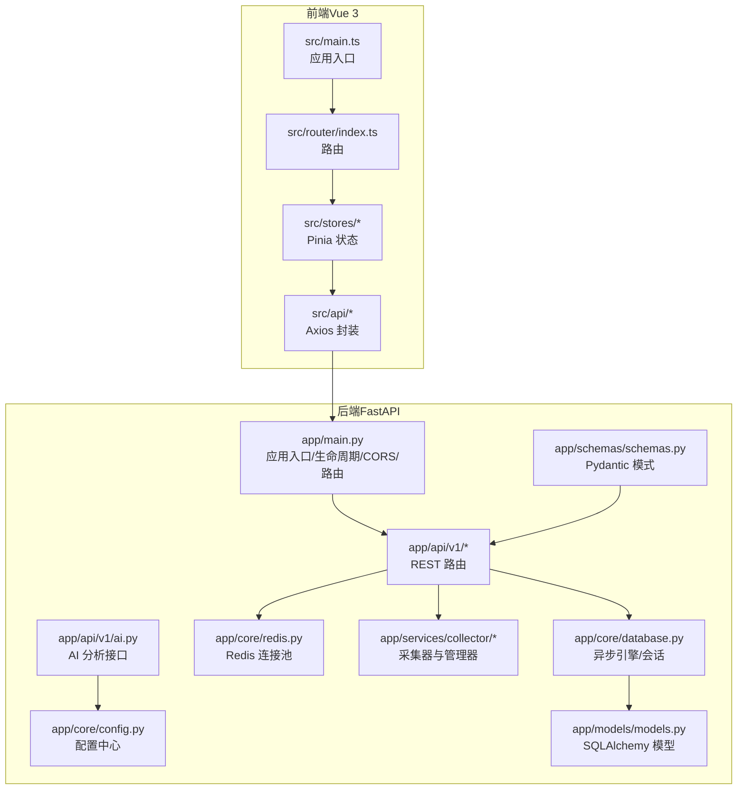
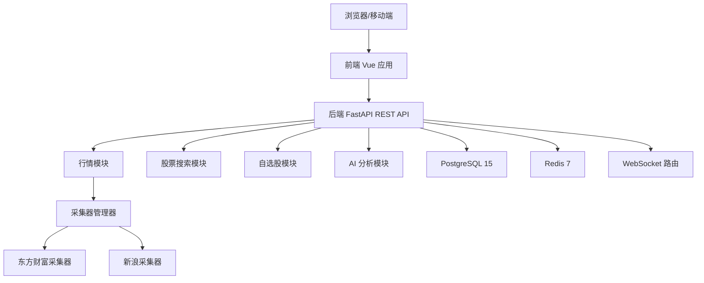
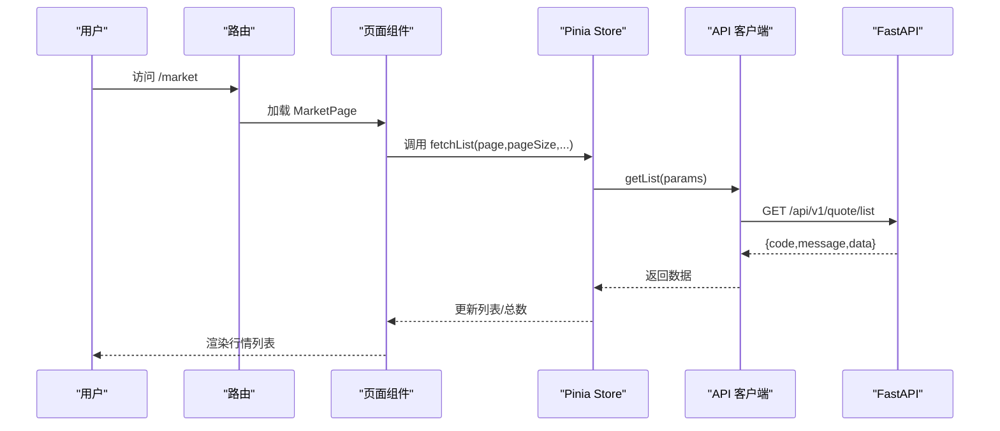
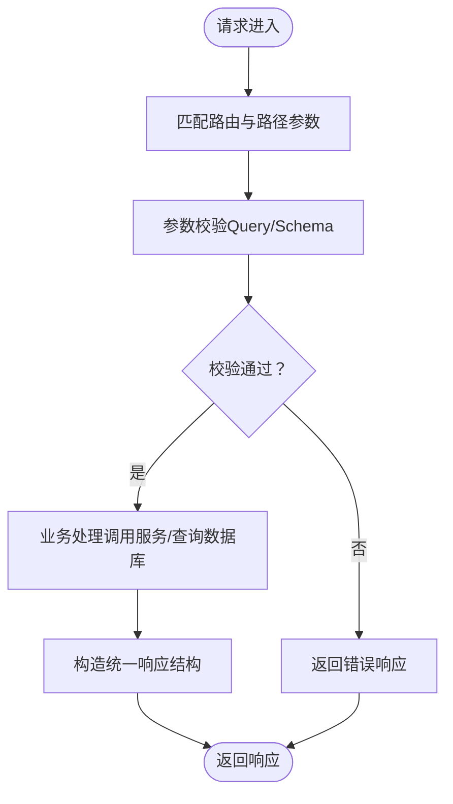
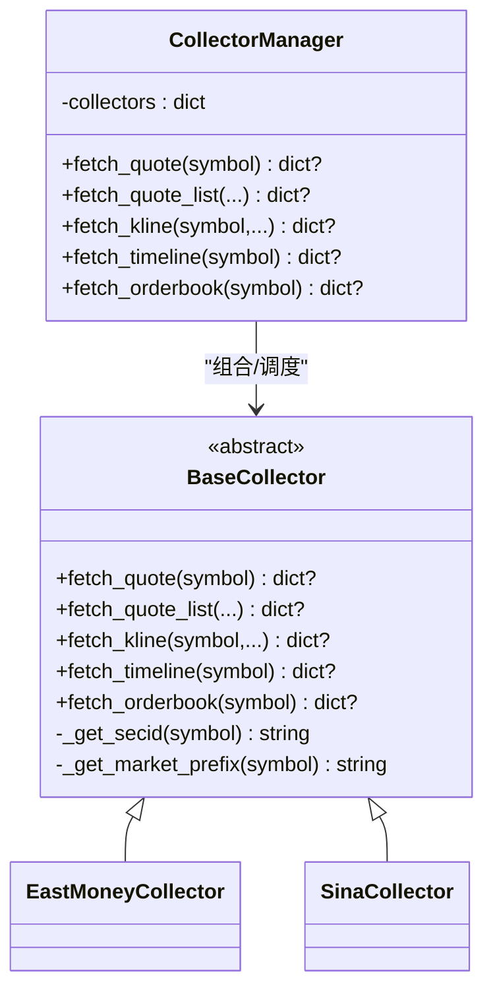
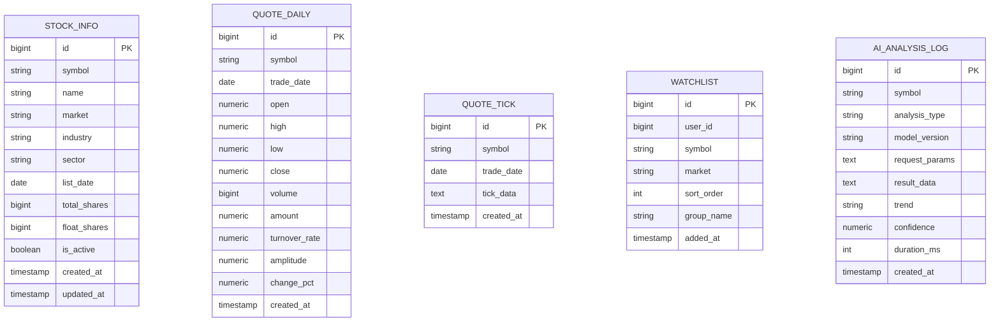
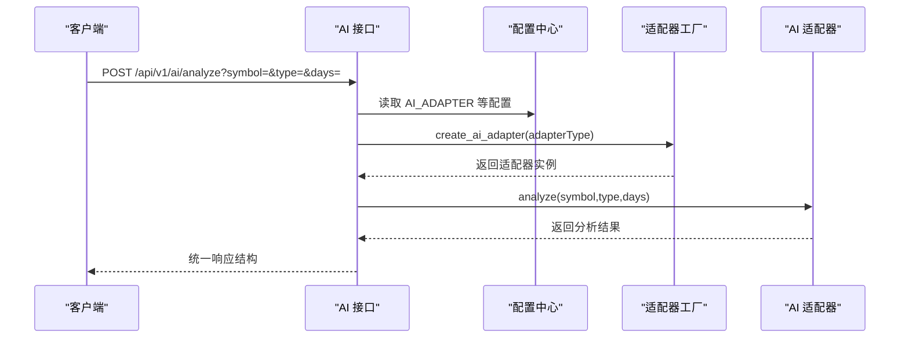
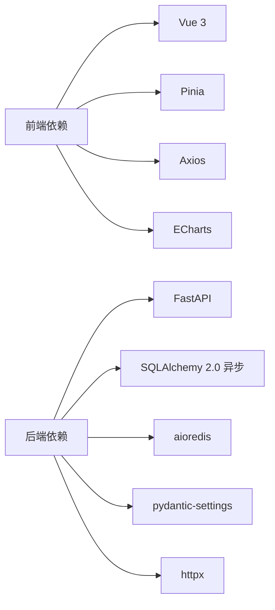

# 整体架构设计

<cite>
**本文引用的文件**
- [README.md](file://README.md)
- [backend/app/main.py](file://backend/app/main.py)
- [backend/app/core/config.py](file://backend/app/core/config.py)
- [backend/app/core/database.py](file://backend/app/core/database.py)
- [backend/app/core/redis.py](file://backend/app/core/redis.py)
- [backend/app/api/v1/quote.py](file://backend/app/api/v1/quote.py)
- [backend/app/api/v1/stock.py](file://backend/app/api/v1/stock.py)
- [backend/app/api/v1/watchlist.py](file://backend/app/api/v1/watchlist.py)
- [backend/app/api/v1/ai.py](file://backend/app/api/v1/ai.py)
- [backend/app/services/collector/manager.py](file://backend/app/services/collector/manager.py)
- [backend/app/services/collector/base.py](file://backend/app/services/collector/base.py)
- [backend/app/models/models.py](file://backend/app/models/models.py)
- [backend/app/schemas/schemas.py](file://backend/app/schemas/schemas.py)
- [frontend/src/main.ts](file://frontend/src/main.ts)
- [frontend/src/router/index.ts](file://frontend/src/router/index.ts)
- [frontend/src/stores/quote.ts](file://frontend/src/stores/quote.ts)
- [frontend/src/stores/watchlist.ts](file://frontend/src/stores/watchlist.ts)
</cite>

## 目录
1. [引言](#引言)
2. [项目结构](#项目结构)
3. [核心组件](#核心组件)
4. [架构总览](#架构总览)
5. [详细组件分析](#详细组件分析)
6. [依赖关系分析](#依赖关系分析)
7. [性能考量](#性能考量)
8. [故障排查指南](#故障排查指南)
9. [结论](#结论)
10. [附录](#附录)

## 引言
本文件面向架构师与高级开发者，系统阐述 Stock-View 的整体架构设计。项目采用前后端分离架构，前端基于 Vue 3 + TypeScript，后端基于 FastAPI + SQLAlchemy 2.0（异步），数据库与缓存分别为 PostgreSQL 15 与 Redis 7，通过 Docker Compose 编排部署。后端以 RESTful API 为核心，结合微服务思想（数据采集子服务、AI 分析适配器、WebSocket 实时推送）与模块化设计（按领域拆分 API、服务、模型与模式），实现高内聚低耦合、可扩展、可维护的系统。

## 项目结构
- 前端（Vue 3 + TypeScript + Pinia + ECharts + Element Plus）
  - 应用入口与插件注册、路由与页面组件、状态管理（Pinia Store）、API 客户端封装
- 后端（Python 3.11 + FastAPI + SQLAlchemy 2.0 异步）
  - 应用入口与生命周期、CORS 中间件、路由注册、配置中心、数据库与 Redis 连接、数据模型与模式定义、服务层（采集器与管理器）、AI 分析适配器接口、WebSocket 路由

图表来源
- [backend/app/main.py:1-48](file://backend/app/main.py#L1-L48)
- [backend/app/core/config.py:1-43](file://backend/app/core/config.py#L1-L43)
- [backend/app/core/database.py:1-25](file://backend/app/core/database.py#L1-L25)
- [backend/app/core/redis.py:1-25](file://backend/app/core/redis.py#L1-L25)
- [backend/app/api/v1/quote.py:1-65](file://backend/app/api/v1/quote.py#L1-L65)
- [backend/app/api/v1/stock.py:1-37](file://backend/app/api/v1/stock.py#L1-L37)
- [backend/app/api/v1/watchlist.py:1-77](file://backend/app/api/v1/watchlist.py#L1-L77)
- [backend/app/api/v1/ai.py:1-29](file://backend/app/api/v1/ai.py#L1-L29)
- [backend/app/services/collector/manager.py:1-94](file://backend/app/services/collector/manager.py#L1-L94)
- [backend/app/services/collector/base.py:1-45](file://backend/app/services/collector/base.py#L1-L45)
- [backend/app/models/models.py:1-74](file://backend/app/models/models.py#L1-L74)
- [backend/app/schemas/schemas.py:1-103](file://backend/app/schemas/schemas.py#L1-L103)
- [frontend/src/main.ts:1-12](file://frontend/src/main.ts#L1-L12)
- [frontend/src/router/index.ts:1-14](file://frontend/src/router/index.ts#L1-L14)
- [frontend/src/stores/quote.ts:1-43](file://frontend/src/stores/quote.ts#L1-L43)
- [frontend/src/stores/watchlist.ts:1-36](file://frontend/src/stores/watchlist.ts#L1-L36)

章节来源
- [README.md:92-126](file://README.md#L92-L126)
- [backend/app/main.py:1-48](file://backend/app/main.py#L1-L48)
- [frontend/src/main.ts:1-12](file://frontend/src/main.ts#L1-L12)

## 核心组件
- 应用入口与生命周期
  - 后端应用通过 lifespan 在启动阶段初始化数据库，在关闭阶段释放 Redis 连接；注册 CORS 与多条 v1 接口路由，并提供健康检查端点
- 配置中心
  - 统一从环境变量读取数据库、缓存、AI 适配器、限流与缓存 TTL、采集间隔等参数，支持 LRU 缓存
- 数据访问层
  - 异步 SQLAlchemy 引擎与会话工厂，统一提供数据库连接；Redis 连接池按需创建与关闭
- 业务逻辑层
  - API v1 路由：行情、股票搜索、自选股、AI 分析；采集器管理器负责多数据源优先级与故障转移；AI 分析通过适配器模式解耦
- 表现层
  - Vue 应用注册路由、Pinia 状态、Element Plus 插件；页面组件通过 API 客户端调用后端接口；状态管理封装列表、实时行情与自选股操作

章节来源
- [backend/app/main.py:13-48](file://backend/app/main.py#L13-L48)
- [backend/app/core/config.py:5-43](file://backend/app/core/config.py#L5-L43)
- [backend/app/core/database.py:7-25](file://backend/app/core/database.py#L7-L25)
- [backend/app/core/redis.py:10-25](file://backend/app/core/redis.py#L10-L25)
- [backend/app/api/v1/quote.py:1-65](file://backend/app/api/v1/quote.py#L1-L65)
- [backend/app/api/v1/stock.py:1-37](file://backend/app/api/v1/stock.py#L1-L37)
- [backend/app/api/v1/watchlist.py:1-77](file://backend/app/api/v1/watchlist.py#L1-L77)
- [backend/app/api/v1/ai.py:1-29](file://backend/app/api/v1/ai.py#L1-L29)
- [backend/app/services/collector/manager.py:12-94](file://backend/app/services/collector/manager.py#L12-L94)
- [frontend/src/main.ts:8-12](file://frontend/src/main.ts#L8-L12)

## 架构总览
系统采用前后端分离与微服务思想（模块化）：
- 前端：Vue 3 单页应用，路由驱动页面切换，Pinia 管理全局状态，Axios 封装 API 调用
- 后端：FastAPI 提供 REST API，按领域拆分模块（行情、股票、自选股、AI），采集器模块负责数据源聚合与故障转移，数据库与 Redis 提供持久化与缓存能力
- 微服务体现：
  - 数据采集子服务：抽象采集器接口，实现多数据源（东方财富、新浪）优先级与故障转移
  - AI 分析适配器：通过适配器工厂创建不同实现（mock/rule），便于替换与扩展
  - WebSocket：独立路由模块，用于实时推送（若启用）

图表来源
- [backend/app/main.py:38-43](file://backend/app/main.py#L38-L43)
- [backend/app/api/v1/quote.py:1-65](file://backend/app/api/v1/quote.py#L1-L65)
- [backend/app/api/v1/stock.py:1-37](file://backend/app/api/v1/stock.py#L1-L37)
- [backend/app/api/v1/watchlist.py:1-77](file://backend/app/api/v1/watchlist.py#L1-L77)
- [backend/app/api/v1/ai.py:1-29](file://backend/app/api/v1/ai.py#L1-L29)
- [backend/app/services/collector/manager.py:12-94](file://backend/app/services/collector/manager.py#L12-L94)
- [backend/app/core/database.py:7-25](file://backend/app/core/database.py#L7-L25)
- [backend/app/core/redis.py:10-25](file://backend/app/core/redis.py#L10-L25)

## 详细组件分析

### 前端组件分析（Vue 3 + Pinia）
- 应用入口与插件
  - 注册 Pinia、路由、Element Plus，挂载根组件
- 路由与页面
  - 定义市场、详情、自选股、搜索等页面路由，History 模式
- 状态管理
  - 行情 Store：封装列表加载、实时行情获取、当前行情更新
  - 自选股 Store：封装列表加载、添加、移除、是否已关注判断
- API 客户端
  - 通过 Axios 封装统一调用后端接口，返回统一响应结构

图表来源
- [frontend/src/router/index.ts:1-14](file://frontend/src/router/index.ts#L1-L14)
- [frontend/src/stores/quote.ts:11-22](file://frontend/src/stores/quote.ts#L11-L22)
- [backend/app/api/v1/quote.py:19-33](file://backend/app/api/v1/quote.py#L19-L33)

章节来源
- [frontend/src/main.ts:1-12](file://frontend/src/main.ts#L1-L12)
- [frontend/src/router/index.ts:1-14](file://frontend/src/router/index.ts#L1-L14)
- [frontend/src/stores/quote.ts:1-43](file://frontend/src/stores/quote.ts#L1-L43)
- [frontend/src/stores/watchlist.ts:1-36](file://frontend/src/stores/watchlist.ts#L1-L36)

### 后端组件分析（FastAPI + SQLAlchemy 异步）

#### RESTful API 设计原则
- 资源化命名：/api/v1/quote、/api/v1/stock、/api/v1/watchlist、/api/v1/ai
- 统一响应结构：code/message/data，便于前端一致处理
- 参数校验：Query 参数约束范围与默认值，Schema 校验请求体
- 错误处理：对数据源不可用等异常返回明确错误码与消息

图表来源
- [backend/app/api/v1/quote.py:7-16](file://backend/app/api/v1/quote.py#L7-L16)
- [backend/app/api/v1/stock.py:10-37](file://backend/app/api/v1/stock.py#L10-L37)
- [backend/app/api/v1/watchlist.py:13-26](file://backend/app/api/v1/watchlist.py#L13-L26)
- [backend/app/api/v1/ai.py:10-15](file://backend/app/api/v1/ai.py#L10-L15)

章节来源
- [backend/app/api/v1/quote.py:1-65](file://backend/app/api/v1/quote.py#L1-L65)
- [backend/app/api/v1/stock.py:1-37](file://backend/app/api/v1/stock.py#L1-L37)
- [backend/app/api/v1/watchlist.py:1-77](file://backend/app/api/v1/watchlist.py#L1-L77)
- [backend/app/api/v1/ai.py:1-29](file://backend/app/api/v1/ai.py#L1-L29)

#### 数据采集与故障转移（Collector Manager）
- 抽象基类定义统一接口：实时行情、行情列表、K 线、分时、盘口
- 管理器按优先级遍历采集器，遇异常或空数据则切换下一数据源，最终失败记录日志
- 通过统一入口对外提供稳定的数据获取能力

图表来源
- [backend/app/services/collector/base.py:5-45](file://backend/app/services/collector/base.py#L5-L45)
- [backend/app/services/collector/manager.py:12-94](file://backend/app/services/collector/manager.py#L12-L94)

章节来源
- [backend/app/services/collector/base.py:1-45](file://backend/app/services/collector/base.py#L1-L45)
- [backend/app/services/collector/manager.py:1-94](file://backend/app/services/collector/manager.py#L1-L94)

#### 数据模型与模式（ORM 与校验）
- 模型：StockInfo、QuoteDaily、QuoteTick、Watchlist、AIAnalysisLog
- 模式：ResponseBase、QuoteItem/Kline/Timeline/OrderBook、StockSearchItem、WatchlistAddRequest/SortRequest、AIAnalysisRequest/Response
- 通过 Pydantic 模式保证请求/响应结构一致性，SQLAlchemy 模型映射数据库表

图表来源
- [backend/app/models/models.py:5-74](file://backend/app/models/models.py#L5-L74)
- [backend/app/schemas/schemas.py:6-103](file://backend/app/schemas/schemas.py#L6-L103)

章节来源
- [backend/app/models/models.py:1-74](file://backend/app/models/models.py#L1-L74)
- [backend/app/schemas/schemas.py:1-103](file://backend/app/schemas/schemas.py#L1-L103)

#### AI 分析适配器（插件化）
- 通过工厂方法创建适配器实例，支持 mock/rule 等实现
- 统一分析接口与模型信息查询，便于后续接入外部 AI 服务

图表来源
- [backend/app/api/v1/ai.py:10-15](file://backend/app/api/v1/ai.py#L10-L15)
- [backend/app/core/config.py:19-24](file://backend/app/core/config.py#L19-L24)

章节来源
- [backend/app/api/v1/ai.py:1-29](file://backend/app/api/v1/ai.py#L1-L29)
- [backend/app/core/config.py:1-43](file://backend/app/core/config.py#L1-L43)

## 依赖关系分析
- 前端依赖
  - Vue 3、Vue Router、Pinia、Element Plus、ECharts、Axios、@vueuse/core
  - Vite 构建与开发服务器，自动代理 API 到后端 8000 端口
- 后端依赖
  - FastAPI、SQLAlchemy 2.0 异步、asyncpg、aioredis、httpx、pydantic-settings
  - 通过依赖注入与上下文管理器实现数据库与 Redis 生命周期管理
- 配置与环境
  - 所有敏感与可变参数集中于环境变量，支持 development/production 环境切换

图表来源
- [frontend/package.json:11-25](file://frontend/package.json#L11-L25)
- [backend/app/core/config.py:1-43](file://backend/app/core/config.py#L1-L43)

章节来源
- [frontend/package.json:1-27](file://frontend/package.json#L1-L27)
- [backend/app/core/config.py:1-43](file://backend/app/core/config.py#L1-L43)

## 性能考量
- 异步 I/O
  - 数据库与 Redis 使用异步驱动，降低阻塞；采集器使用异步 HTTP 客户端
- 缓存策略
  - Redis 作为缓存与队列（Celery Broker/Result Backend），可通过配置控制 TTL 与限流
- 并发与连接池
  - 数据库连接池参数可调，避免高并发下的连接瓶颈
- 采集频率与批量
  - 行情采集间隔与批量大小可控，减少对上游数据源的压力
- 前端优化
  - Pinia 状态局部更新，ECharts 按需渲染，路由懒加载减少首屏负载

## 故障排查指南
- 健康检查
  - 后端提供 /api/v1/health，返回服务状态与版本
- CORS 问题
  - 确认前端开发服务器代理至后端 8000 端口，生产环境 Nginx 配置允许跨域
- 数据源不可用
  - 行情接口返回特定错误码表示数据源不可用；检查采集器优先级与网络连通性
- 数据库/Redis 连接
  - 检查 DATABASE_URL/REDIS_URL 是否正确；容器编排时确保服务名与端口映射
- 配置项缺失
  - 确认 .env 文件存在且包含必要键值；必要时使用 .env.example 作为模板

章节来源
- [backend/app/main.py:46-48](file://backend/app/main.py#L46-L48)
- [backend/app/api/v1/quote.py:31-33](file://backend/app/api/v1/quote.py#L31-L33)
- [backend/app/core/config.py:12-14](file://backend/app/core/config.py#L12-L14)
- [backend/app/core/redis.py:13-17](file://backend/app/core/redis.py#L13-L17)

## 结论
Stock-View 通过前后端分离与模块化设计，实现了清晰的职责边界与良好的扩展性。后端以 RESTful API 为核心，结合采集器与 AI 适配器的插件化架构，满足多数据源与未来 AI 能力接入的需求；数据库与 Redis 提供高性能持久化与缓存能力。该架构在性能、可扩展性与可维护性方面具备良好平衡，适合持续演进与团队协作。

## 附录
- 快速启动与开发模式参见项目说明
- 环境变量与常用命令参见项目说明